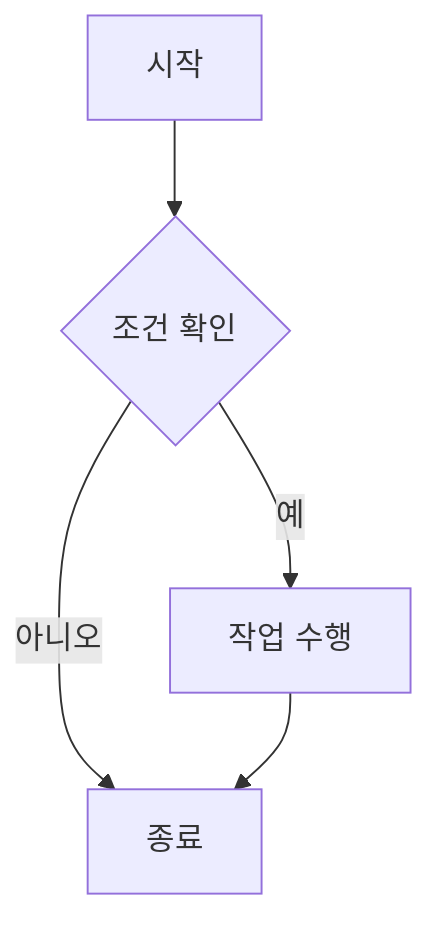
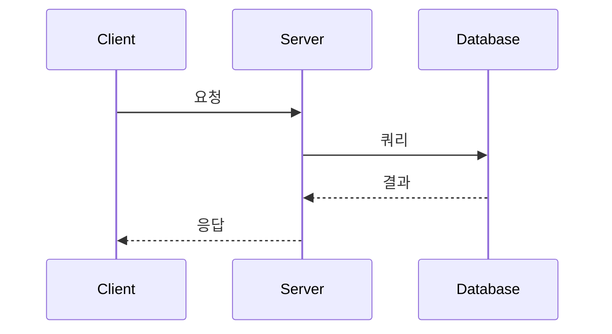

# Writing UI Components

MDX에서 사용할 수 있는 아름다운 UI 컴포넌트 모음입니다. 문서화, 튜토리얼, 가이드 작성에 최적화되어 있습니다.

## 설치

```bash
npm install lucide-react
```

## 컴포넌트 목록

### 1. Callout

경고, 정보, 성공, 오류 메시지를 표시하는 컴포넌트입니다.

```tsx
import { Callout } from '@/components/writing-ui'

<Callout type="info" title="정보">
  이것은 정보 메시지입니다.
</Callout>

<Callout type="warning" title="주의">
  이것은 경고 메시지입니다.
</Callout>

<Callout type="error" title="오류">
  이것은 오류 메시지입니다.
</Callout>

<Callout type="success" title="성공">
  이것은 성공 메시지입니다.
</Callout>

<Callout type="note" title="참고">
  이것은 참고 메시지입니다.
</Callout>
```

### 2. CodeBlock

코드 블록을 표시하는 컴포넌트입니다. 복사 기능이 포함되어 있습니다.
이 컴포넌트는 직접 호출하지 않습니다. 기본 문법인 ``` 를 사용하면 렌더링 과정에서 사용됩니다.

**Syntax Highlighting 지원**

모든 코드 블록은 자동으로 언어별 syntax highlighting이 적용됩니다. 100개 이상의 프로그래밍 언어를 지원합니다.

````mdx
```javascript
const greeting = 'Hello, World!';
console.log(greeting);
```

```python
def greet(name):
    print(f"Hello, {name}!")
```

```typescript
interface User {
  name: string;
  age: number;
}
```
````

### 3. Mermaid

Mermaid 다이어그램을 렌더링하는 컴포넌트입니다. 플로우차트, 시퀀스 다이어그램, 간트 차트 등 다양한 다이어그램을 지원합니다.

````mdx



````

**지원되는 다이어그램 유형:**

- Flowchart (graph)
- Sequence Diagram (sequenceDiagram)
- Class Diagram (classDiagram)
- State Diagram (stateDiagram)
- Entity Relationship Diagram (erDiagram)
- Gantt Chart (gantt)
- Pie Chart (pie)
- Git Graph (gitGraph)
- 그 외 다수

### 4. Steps

단계별 가이드를 표시하는 컴포넌트입니다.

```tsx
import { Steps, Step } from '@/components/writing-ui';

<Steps>
  <Step title='첫 번째 단계'>프로젝트를 설정합니다.</Step>
  <Step title='두 번째 단계'>패키지를 설치합니다.</Step>
  <Step title='세 번째 단계'>애플리케이션을 실행합니다.</Step>
</Steps>;
```

### 5. Tabs

탭 인터페이스를 만드는 컴포넌트입니다.

```tsx
import {
  Tabs,
  TabsList,
  TabsTrigger,
  TabsContent,
} from '@/components/writing-ui';

<Tabs defaultValue='tab1'>
  <TabsList>
    <TabsTrigger value='tab1'>탭 1</TabsTrigger>
    <TabsTrigger value='tab2'>탭 2</TabsTrigger>
  </TabsList>
  <TabsContent value='tab1'>첫 번째 탭의 내용입니다.</TabsContent>
  <TabsContent value='tab2'>두 번째 탭의 내용입니다.</TabsContent>
</Tabs>;
```

### 6. Card

카드 형태의 컨테이너 컴포넌트입니다.

```tsx
import { Card } from '@/components/writing-ui';
import { Star } from 'lucide-react';

<Card
  title='카드 제목'
  description='카드 설명'
  href='https://example.com'
  icon={<Star className='h-5 w-5' />}
>
  추가 내용이 들어갑니다.
</Card>;
```

### 7. Blockquote

인용문을 표시하는 컴포넌트입니다.

```tsx
import { Blockquote } from '@/components/writing-ui';

<Blockquote author='스티브 잡스' cite='Stanford Commencement Address'>
  Stay hungry, stay foolish.
</Blockquote>;
```

### 8. Badge

뱃지/라벨을 표시하는 컴포넌트입니다.

```tsx
import { Badge } from '@/components/writing-ui'

<Badge variant="default" size="sm">기본</Badge>
<Badge variant="success" size="md">성공</Badge>
<Badge variant="warning" size="lg">경고</Badge>
```

### 9. Reference

참고자료를 표시하는 컴포넌트입니다.

```tsx
import { Reference, ReferenceList } from '@/components/writing-ui';

<ReferenceList title='참고자료'>
  <Reference
    title='React 공식 문서'
    description='React의 공식 문서입니다.'
    href='https://react.dev'
    type='documentation'
    author='React Team'
  />
  <Reference
    title='Next.js 가이드'
    description='Next.js 시작 가이드입니다.'
    href='https://nextjs.org'
    type='tutorial'
  />
</ReferenceList>;
```

## 사용 예시

MDX 파일에서 다음과 같이 사용할 수 있습니다:

```mdx
import { Callout, Steps, Step, CodeBlock } from '@/components/writing-ui';

# 튜토리얼 제목

<Callout type='info' title='시작하기 전에'>
  이 튜토리얼을 따라하기 전에 Node.js가 설치되어 있는지 확인하세요.
</Callout>

<Steps>
  <Step title='프로젝트 생성'>
    새로운 Next.js 프로젝트를 생성합니다.
    <CodeBlock language='bash'>npx create-next-app@latest my-app</CodeBlock>
  </Step>

  <Step title='의존성 설치'>
    필요한 패키지를 설치합니다.
    <CodeBlock language='bash'>cd my-app npm install</CodeBlock>
  </Step>
</Steps>

<Callout type='success' title='완료!'>
  프로젝트 설정이 완료되었습니다.
</Callout>
```

## 커스터마이징

모든 컴포넌트는 `className` prop을 통해 추가 스타일을 적용할 수 있습니다. Tailwind CSS 클래스를 사용하여 원하는 스타일로 커스터마이징할 수 있습니다.

```tsx
<Callout type='info' className='border-2 border-blue-500'>
  커스터마이징된 Callout
</Callout>
```
