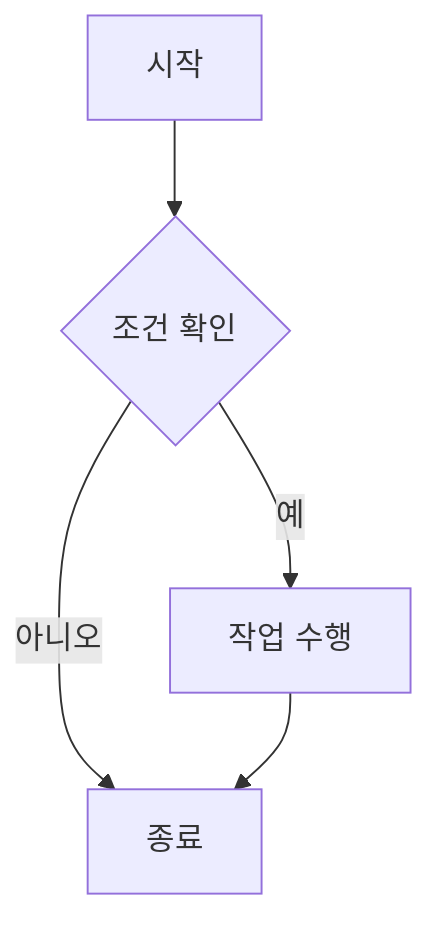
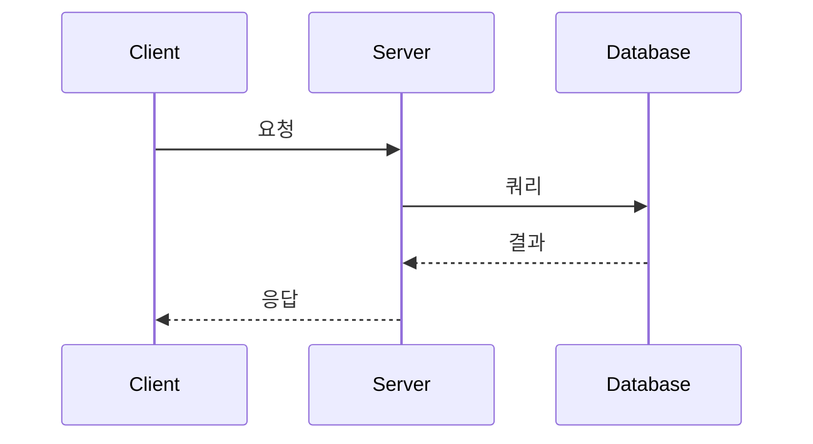

# Writing UI Components

MDX에서 사용할 수 있는 아름다운 UI 컴포넌트 모음입니다. 문서화, 튜토리얼, 가이드 작성에 최적화되어 있습니다.

## ✨ 특징

- **Import 불필요**: MDX 파일에서 `import` 없이 바로 사용 가능
- **타입 안전**: TypeScript로 작성되어 타입 안정성 제공
- **아름다운 디자인**: Tailwind CSS 기반의 현대적인 UI
- **동적 아이콘**: Lucide React의 모든 아이콘을 동적으로 로드

## 💡 중요: Import 불필요!

모든 컴포넌트는 **MDX 렌더러에서 자동으로 제공**되므로, MDX 파일에서 별도로 `import`할 필요가 없습니다.

```mdx
<!-- ❌ 이렇게 하지 않아도 됩니다 -->

import { Callout } from '@/components/writing-ui';

<!-- ✅ 바로 사용하세요! -->

<Callout type='info' title='알림'>
  Import 없이 바로 사용할 수 있습니다!
</Callout>
```

## 설치

```bash
bun install lucide-react
```

## 컴포넌트 목록

### 1. Callout

경고, 정보, 성공, 오류 메시지를 표시하는 컴포넌트입니다.

```mdx
<Callout type='info' title='정보'>
  이것은 정보 메시지입니다.
</Callout>

<Callout type='warning' title='주의'>
  이것은 경고 메시지입니다.
</Callout>

<Callout type='error' title='오류'>
  이것은 오류 메시지입니다.
</Callout>

<Callout type='success' title='성공'>
  이것은 성공 메시지입니다.
</Callout>

<Callout type='note' title='참고'>
  이것은 참고 메시지입니다.
</Callout>
```

### 2. CodeBlock

코드 블록을 표시하는 컴포넌트입니다. 복사 기능이 포함되어 있습니다.

**⚠️ 중요:** 이 컴포넌트는 **직접 사용하지 않습니다**. 일반 마크다운 코드 블록(\`\`\`)을 사용하면 자동으로 렌더링됩니다.

**사용하지 마세요:**

```mdx
<!-- ❌ 이렇게 하지 마세요 - acorn 파싱 에러 발생! -->

<CodeBlock language='tsx'>{`function Hello() { ... }`}</CodeBlock>
```

**올바른 사용법:**

```mdx
<!-- ✅ 이렇게 하세요 - 자동으로 CodeBlock으로 렌더링됩니다 -->

\`\`\`tsx
function Hello() {
return <div>Hello</div>
}
\`\`\`
```

**Syntax Highlighting 지원**

모든 코드 블록은 자동으로 언어별 syntax highlighting이 적용됩니다. [highlight.js](https://highlightjs.org/)를 사용하여 190개 이상의 프로그래밍 언어를 지원합니다.

**지원하지 않는 언어 처리**

highlight.js가 지원하지 않는 언어는 자동으로 처리됩니다:

- `mdx` → `markdown`으로 변환
- `vue` → `html`로 변환
- `svelte` → `html`로 변환
- 기타 지원하지 않는 언어 → `plaintext`로 fallback

**기본 텍스트 색상 보장**

하이라이팅 실패 시에도 코드가 보이도록 기본 텍스트 색상(`#e6edf3`)이 항상 적용됩니다.

````mdx
```javascript
const greeting = 'Hello, World!';
console.log(greeting);
```

```python
def greet(name):
    print(f"Hello, {name}!")
```

```typescript
interface User {
  name: string;
  age: number;
}
```
````

### 3. Mermaid

Mermaid 다이어그램을 렌더링하는 컴포넌트입니다. 플로우차트, 시퀀스 다이어그램, 간트 차트 등 다양한 다이어그램을 지원합니다.

````mdx



````

**지원되는 다이어그램 유형:**

- Flowchart (graph)
- Sequence Diagram (sequenceDiagram)
- Class Diagram (classDiagram)
- State Diagram (stateDiagram)
- Entity Relationship Diagram (erDiagram)
- Gantt Chart (gantt)
- Pie Chart (pie)
- Git Graph (gitGraph)
- 그 외 다수

### 4. Steps

단계별 가이드를 표시하는 컴포넌트입니다.

```mdx
<Steps>
  <Step title='첫 번째 단계'>프로젝트를 설정합니다.</Step>
  <Step title='두 번째 단계'>패키지를 설치합니다.</Step>
  <Step title='세 번째 단계'>애플리케이션을 실행합니다.</Step>
</Steps>
```

### 5. Tabs

탭 인터페이스를 만드는 컴포넌트입니다.

```mdx
<Tabs defaultValue='tab1'>
  <TabsList>
    <TabsTrigger value='tab1'>탭 1</TabsTrigger>
    <TabsTrigger value='tab2'>탭 2</TabsTrigger>
  </TabsList>
  <TabsContent value='tab1'>첫 번째 탭의 내용입니다.</TabsContent>
  <TabsContent value='tab2'>두 번째 탭의 내용입니다.</TabsContent>
</Tabs>
```

### 6. Card

카드 형태의 컨테이너 컴포넌트입니다.

```mdx
<Card
  title='카드 제목'
  description='카드 설명'
  href='https://example.com'
  icon={<Star className='h-5 w-5' />}
>
  추가 내용이 들어갑니다.
</Card>
```

### 7. Blockquote

인용문을 표시하는 컴포넌트입니다.

```mdx
<Blockquote author='스티브 잡스' cite='Stanford Commencement Address'>
  Stay hungry, stay foolish.
</Blockquote>
```

### 8. Badge

뱃지/라벨을 표시하는 컴포넌트입니다.

```mdx
<Badge variant='default' size='sm'>
  기본
</Badge>
<Badge variant='success' size='md'>
  성공
</Badge>
<Badge variant='warning' size='lg'>
  경고
</Badge>
```

### 9. Reference

참고자료를 표시하는 컴포넌트입니다.

```mdx
<ReferenceList title='참고자료'>
  <Reference
    title='React 공식 문서'
    description='React의 공식 문서입니다.'
    href='https://react.dev'
    type='documentation'
    author='React Team'
  />
  <Reference
    title='Next.js 가이드'
    description='Next.js 시작 가이드입니다.'
    href='https://nextjs.org'
    type='tutorial'
  />
</ReferenceList>
```

### 10. Icon (동적 아이콘 로더)

Lucide React의 모든 아이콘을 동적으로 로드하여 사용할 수 있습니다.

**장점:**

- **Import 불필요**: 아이콘 이름만으로 사용 가능
- **번들 크기 최적화**: 사용한 아이콘만 자동으로 포함
- **1,000개 이상의 아이콘**: Lucide React의 모든 아이콘 지원

```mdx
<!-- 동적 Icon 컴포넌트 사용 (모든 Lucide 아이콘 가능) -->

<Icon name='Star' className='h-6 w-6 text-yellow-500' />
<Icon name='Rocket' size={32} color='blue' />
<Icon name='Heart' className='h-5 w-5 text-red-500' />

<!-- 자주 사용하는 아이콘은 직접 사용도 가능 -->

<Star className='h-5 w-5' />
<Code className='h-4 w-4' />
<CheckCircle className='h-6 w-6 text-green-500' />
```

**자주 사용하는 아이콘 (직접 사용 가능):**

`Star`, `Code`, `Palette`, `Zap`, `FileText`, `ArrowRight`, `Info`, `AlertTriangle`, `CheckCircle`, `XCircle`, `Lightbulb`, `HelpCircle`, `ExternalLink`, `Copy`, `Check`, `ChevronRight`, `ChevronLeft`, `ChevronDown`, `ChevronUp`, `X`, `Menu`, `Search`, `Home`, `Settings`, `User`, `Mail`, `Github`, `Twitter`, `Linkedin`, `Youtube`, `Book`, `BookOpen`, `Bookmark`, `Calendar`, `Clock`, `Download`, `Upload`, `Eye`, `EyeOff`, `Heart`, `MessageCircle`, `Share2`, `ThumbsUp`, `TrendingUp`, `Trash2`, `Edit`, `Plus`, `Minus`, `Save`, `Send`, `Filter`, `SortAsc`, `SortDesc`, `RefreshCw`, `Loader2`, `AlertCircle`, `Lock`, `Unlock`, `Key`, `Shield`, `Bell`, `BellOff`, `Globe`, `Link2`, `MapPin`, `Phone`, `Tag`, `Folder`, `File`, `Image`, `Video`, `Music`, `Archive`, `Database`, `Server`, `Terminal`, `PackageIcon`, `Cpu`, `HardDrive`, `Wifi`, `WifiOff`, `Battery`, `Power`, `Sun`, `Moon`, `Cloud`, `CloudRain`, `Sunrise`, `Sunset`, `Rocket`

**모든 아이콘 목록:** [Lucide Icons](https://lucide.dev/icons/)

## 사용 예시

MDX 파일에서 **Import 없이** 다음과 같이 사용할 수 있습니다:

```mdx
---
title: '튜토리얼 제목'
---

# 튜토리얼 제목

<Callout type='info' title='시작하기 전에' icon={<Info />}>
  이 튜토리얼을 따라하기 전에 Node.js가 설치되어 있는지 확인하세요.
</Callout>

<Steps>
  <Step title="프로젝트 생성">
    새로운 Next.js 프로젝트를 생성합니다.
    
    \`\`\`bash
    npx create-next-app@latest my-app
    \`\`\`
  </Step>

  <Step title="의존성 설치">
    필요한 패키지를 설치합니다.
    
    \`\`\`bash
    cd my-app
    bun install
    \`\`\`
  </Step>
  
  <Step title="아이콘 활용">
    동적 아이콘을 사용할 수 있습니다.
    
    <div className="flex gap-2">
      <Icon name="Rocket" className="h-6 w-6 text-blue-500" />
      <Icon name="Sparkles" className="h-6 w-6 text-purple-500" />
      <Icon name="Zap" className="h-6 w-6 text-yellow-500" />
    </div>
  </Step>
</Steps>

<Callout type='success' title='완료!'>
  프로젝트 설정이 완료되었습니다.
</Callout>
```

## 커스터마이징

모든 컴포넌트는 `className` prop을 통해 추가 스타일을 적용할 수 있습니다. Tailwind CSS 클래스를 사용하여 원하는 스타일로 커스터마이징할 수 있습니다.

```mdx
<Callout type='info' className='border-2 border-blue-500'>
  커스터마이징된 Callout
</Callout>

<Card className='bg-gradient-to-r from-purple-500 to-pink-500 text-white'>
  그라데이션 배경의 카드
</Card>
```

## 기술적 세부사항

### 렌더링 방식

모든 컴포넌트는 `components/mdx-renderer.tsx`의 `components` prop을 통해 전역으로 제공됩니다. 이를 통해:

1. **타입 안정성**: TypeScript가 컴포넌트 props를 검증합니다
2. **코드 분할**: 사용한 컴포넌트만 번들에 포함됩니다
3. **일관성**: 모든 MDX 파일에서 동일한 컴포넌트를 사용합니다

### Icon 동적 로딩

`Icon` 컴포넌트는 `React.lazy()`와 `import()`를 사용하여 아이콘을 동적으로 로드합니다:

- **번들 크기 최적화**: 사용한 아이콘만 번들에 포함
- **빠른 초기 로딩**: 필요할 때만 아이콘을 로드
- **에러 처리**: 존재하지 않는 아이콘은 폴백(HelpCircle) 표시

### 코드 블록 자동 렌더링

\`\`\` 문법으로 작성한 코드 블록은 자동으로 `CodeBlock` 컴포넌트로 렌더링됩니다:

- **Syntax Highlighting**: highlight.js 사용
- **복사 기능**: 클립보드 복사 버튼 제공
- **언어 감지**: 190개 이상의 언어 지원
