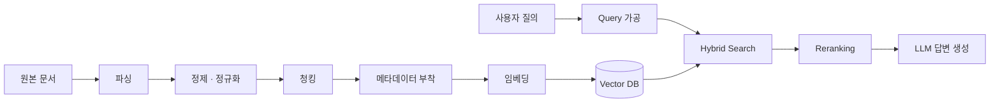

## 서문

LLM에 외부 지식이나 도구를 갖다 붙이는 방법은 크게 두 갈래. **무엇을 줄지** 와 **어떻게 전달할지**.

- **RAG (Retrieval-Augmented Generation, 검색 증강 생성)** — 검색 결과를 프롬프트에 끼워 넣어 생성하는 *패턴*. 어떤 DB를 쓰든, 어떤 전송 방식을 쓰든 이 패턴을 따르면 RAG임.
- **MCP (Model Context Protocol)** — Anthropic이 만든 *프로토콜*. 모델이 외부 리소스(파일, DB, API)와 도구에 접근할 때 무엇을 어떤 형식으로 주고받을지 규정함. LSP(Language Server Protocol) 의 영감을 받은 통신 규격.

같은 층위가 아님. RAG는 *전략*, MCP는 *배관*. 한 시스템에서 같이 쓰일 수도 있고(MCP 서버가 vector search 결과를 노출), 따로 쓰일 수도 있음. 이 글은 그중 RAG 쪽 — 더 정확히는 RAG가 가장 자주 처박히는 부분 — 만 본다.

<Callout type="note" title="이 글의 thesis">
**RAG의 어려움은 LLM이 아니라 데이터 설계에 있다.**

vector DB 고르고 LLM API 부르는 데까지는 며칠이면 됨. 그런데 "사용자 질문에 정말 관련된 청크가 top-5에 들어오는가" 가 안 풀려서 6개월이 가는 게 RAG임. 안 풀리는 이유는 거의 항상 **무엇을, 어떤 형태로, 어떤 메타데이터와 함께, 어떤 인덱스 위에 올려뒀는가** 라는 데이터 설계 문제.
</Callout>

이 글은 그 데이터 설계의 의사결정 지점들을 따라간다. 큰 두 챕터:

- **B. 적절한 데이터를 *만드는* 일** — 전처리
- **C. 적절한 데이터를 *꺼내는* 일** — Vector DB

뒤에 D. 평가, E. 흔한 함정.

### 전체 그림



이 글은 이 그림의 거의 모든 박스를 의사결정 단위로 본다.

---

## B. 적절한 데이터를 *만드는* 일 — 전처리

### B.1 파싱

파싱은 도메인 편차가 가장 큰 영역이라 별도 글이 필요한 주제임. 이 글은 "이미 텍스트가 뽑힌 상태" 에서 시작한다고 가정함. 다만 이건 짚어둠.

<Callout type="warning" title="파싱 품질은 모든 하위 단계의 천장">
PDF 표를 잘못 추출하면 어떤 청킹 전략을 써도 그 표는 검색되지 않음. HTML 본문과 사이드바를 안 분리하면 임베딩에 광고 텍스트가 섞임. 코드 파일을 그냥 텍스트로 다루면 함수 단위 검색이 불가능함.

운영 중에 "왜 이 문서가 안 찾아지지" 라는 미스터리의 90%가 사실은 파싱에서 출발함.
</Callout>

실무 권장:

- 텍스트 PDF는 `pdfplumber` / `pymupdf`. 스캔 PDF는 OCR (Tesseract, AWS Textract).
- 표는 `camelot` / Textract / Azure Document Intelligence 같은 표 전용 추출기로 분리해서 JSON/markdown으로 저장.
- HTML은 `readability` / `trafilatura` 로 본문만 추출.
- 코드는 tree-sitter 같은 AST 파서로 함수/클래스 단위 분할.

파싱 검증용 샘플 스위트를 만들어두면 정신 건강에 좋음. 안 그러면 6개월 후 "이거 임베딩 모델 바꿔야 하나" 고민하다가 사실은 파싱에서 줄바꿈 하나가 깨지고 있었다는 걸 발견하게 됨.

### B.2 정제 · 정규화

검색 품질을 비용 대비 가장 빠르게 끌어올리는 단계. 무시되기도 가장 쉬움. 둘이 결합되면 가장 손해 큰 단계가 됨.

- **중복 제거** — 완전 동일 (hash) + 유사 중복 (MinHash, SimHash). 위키류 미러, 사내 문서의 *사본의 사본의 사본* 이 검색 결과를 도배함.
- **노이즈 제거** — 헤더/푸터/페이지 번호, 광고, 쿠키 안내, 코드 주석의 license 헤더. 이런 게 임베딩 공간에서 자기들끼리 클러스터를 만들어버리면 무관한 청크끼리 가까워짐.
- **정규화** — Unicode NFC/NFKC, whitespace 정리, 줄바꿈 정책, 따옴표 통일.
- **언어 감지** — 임베딩 모델이 다국어가 아니면 언어별로 인덱스를 나누거나 필터링.

<Callout type="note" title="한국어 특이사항">
자모 분리 문자(NFD) 와 완성형(NFC) 이 섞이면 *같은 단어가 다른 토큰* 으로 들어감. macOS에서 만든 파일명·텍스트에서 자주 발생. NFC로 통일해두는 게 안전함. 전각/반각 숫자·영문도 통일 필요.

이거 안 잡으면 "분명히 있는 문서인데 왜 안 찾아지지" 미스터리 시즌2 시작됨.
</Callout>

### B.3 청킹 전략 <Badge variant="default" size="sm">★ 가장 큰 결정</Badge>

청킹은 RAG에서 가장 큰 한 가지 결정임. **검색의 단위가 곧 청크** 이기 때문에, 청킹이 곧 "정답이 들어 있는 부분을 검색 결과로 가져올 수 있는가" 의 거의 전부를 결정함.

#### 본질적 trade-off

| 청크 크기 | 장점 | 단점 |
|---|---|---|
| 작음 (128~256 토큰) | 정밀도 ↑, 임베딩이 한 주제에 집중 | 컨텍스트 부족, 답에 필요한 주변 정보가 잘림 |
| 큼 (1024~2048 토큰) | 컨텍스트 풍부 | 청크 내 노이즈 ↑, 임베딩이 평균화되어 정확도 ↓ |

크기뿐 아니라 **경계 위치** 도 중요함. 문장 중간에서 잘리면 그 청크의 임베딩은 의미를 잃음. 그래도 fixed-size로 끝낸 PoC는 데모 시연은 잘 됨. 그런데 실제 사용자 질의가 들어오는 순간 무너짐.

#### 청킹 방법론 6종

<Tabs defaultValue="fixed">
  <TabsList>
    <TabsTrigger value="fixed">Fixed-size</TabsTrigger>
    <TabsTrigger value="recursive">Recursive</TabsTrigger>
    <TabsTrigger value="sentence">Sentence</TabsTrigger>
    <TabsTrigger value="semantic">Semantic</TabsTrigger>
    <TabsTrigger value="structure">Document-aware</TabsTrigger>
    <TabsTrigger value="parent-child">Parent-child</TabsTrigger>
  </TabsList>

  <TabsContent value="fixed">
**Fixed-size (고정 크기)**

토큰 또는 문자 수로 일정하게 자름. 가장 단순. 의미 경계를 무시하므로 quality는 최하단. 신속 baseline용으론 OK. 그러나 baseline 이후엔 거의 항상 더 나은 게 있음.
  </TabsContent>

  <TabsContent value="recursive">
**Recursive (계층적 분리자)**

LangChain의 `RecursiveCharacterTextSplitter` 가 대표적. `\n\n` → `\n` → `. ` → ` ` 순으로 분리자를 시도하며 목표 크기에 맞춤. 실용적으로 가장 자주 쓰이는 방식. 의미 경계를 어느 정도 존중하면서 크기 제약을 지킴. *모르면 일단 이걸로 시작* 해도 됨.
  </TabsContent>

  <TabsContent value="sentence">
**Sentence / Paragraph boundary**

문장(또는 문단) 경계에서만 자르고, 여러 문장을 묶어 목표 크기 충족. 일관성 ↑. 다만 한국어 문장 분리기 품질이 도메인마다 다르니 검증 필요.
  </TabsContent>

  <TabsContent value="semantic">
**Semantic chunking**

연속된 문장들의 임베딩 유사도를 계산해서, 유사도가 급격히 떨어지는 지점에서 분할. 의미 단위로 자르려는 시도. 잘 동작하는 도메인이 있음 (긴 서술 문서).

단점: 임베딩 호출 비용, 결과 청크 크기 편차가 큼. 정렬된 도메인 아니면 효과가 들쭉날쭉함.
  </TabsContent>

  <TabsContent value="structure">
**Document-structure-aware**

markdown heading, HTML section, 코드 함수 등 *구조 단서* 기준 분할. 사내 문서·기술 문서에는 거의 항상 이게 정답에 가까움. 같은 heading 아래는 의미적으로 묶이는 경향이 있음.

작성자들이 이미 의미 경계를 표시해뒀는데 굳이 무시할 이유가 없음.
  </TabsContent>

  <TabsContent value="parent-child">
**Parent-child / Contextual retrieval**

검색은 작은 청크로 하고, LLM에 넘기는 컨텍스트는 그 청크의 *부모* (더 큰 단락 또는 문서 전체 요약) 로 함. 검색 정밀도와 답변 컨텍스트의 풍부함을 동시에 잡음.

구현 복잡도가 늘어남 (두 종류의 청크 관리). 그러나 효과는 큼.
  </TabsContent>
</Tabs>

<Callout type="info" title="Anthropic Contextual Retrieval (2024)">
각 청크를 임베딩하기 전에, **그 청크가 속한 문서의 컨텍스트를 LLM으로 짧게 생성해 prepend** 하는 기법.

예: *"이 청크는 2024년 Q3 매출 보고서의 ARR 섹션이며, 북미 지역에 대한 내용임."* — 이 한 줄을 청크 앞에 붙이면 청크 자체의 임베딩 품질이 크게 올라감.

비용은 청크당 추가 LLM 호출 (전체 문서를 매번 보내야 함). **prompt caching으로 70% 이상 절감 가능.** Anthropic 자체 실험에서 retrieval failure가 **49% 감소** 했다고 보고됨.

원본: [Introducing Contextual Retrieval (Anthropic, 2024-09)](https://www.anthropic.com/news/contextual-retrieval).
</Callout>

#### 크기·오버랩 결정

- **크기 상한**: 사용 임베딩 모델의 max sequence length (보통 256~8192 토큰). 초과는 잘림.
- **권장 시작값**: 일반 문서는 512 토큰. 코드는 함수 단위. Q&A형 짧은 콘텐츠는 256.
- **오버랩**: 보통 10~20%. 경계 손실 보정용.
- 결정은 평가 기반으로 — 256 / 512 / 1024 ablation 후 Recall@k 측정.

<Callout type="warning" title="추측 금지">
"청크는 512가 좋다고 하던데요" 는 정답이 아님. 그 사람의 도메인에서 그랬을 뿐. 본인 데이터에서 ablation 안 돌리면 결국 *남의 직감* 으로 운영하는 것.
</Callout>

#### 청킹 결정 체크리스트

<Steps>
  <Step title="문서에 구조가 있는가">
    heading, 함수 경계 등 구조 단서가 있으면 그것부터 우선. 작성자가 이미 의미 경계를 표시해뒀는데 무시할 이유 없음.
  </Step>
  <Step title="임베딩 모델의 max seq length는">
    이게 청크 크기 상한을 못 박음. 모델 결정과 청킹 결정은 사실 한 결정.
  </Step>
  <Step title="답변에 필요한 컨텍스트의 자연 단위는">
    FAQ 한 쌍 / 한 문단 / 한 절 중 어느 것이 자연스러운가. 자연 단위와 어긋난 청크는 거의 항상 답변 품질을 깎음.
  </Step>
  <Step title="부모 컨텍스트가 필요한가">
    "이 한 문단만 보면 무슨 말인지 모르겠다" 면 parent-child 패턴 검토.
  </Step>
  <Step title="단단한 사실(고유명사·코드·ID)이 많은가">
    많으면 청크는 작게 + Hybrid search 필수. 임베딩만으론 식별자 매칭이 약함.
  </Step>
</Steps>

### B.4 메타데이터 설계

메타데이터는 두 가지 다른 일을 함:

1. **필터링** — "권한 X 사용자에게 노출 가능한, 2024년 이후의, 카테고리 Y 문서" 로 후보를 좁힘.
2. **컨텍스트 보강** — 메타데이터를 청크 텍스트에 prepend 해서 임베딩과 LLM 답변 품질에 기여.

이 두 역할은 같은 필드라도 다른 형태로 인덱스에 올라가야 함.

#### 필수 메타데이터

| 필드 | 용도 | 인덱스 |
|---|---|---|
| `doc_id`, `chunk_id` | 출처 추적, citation | scalar |
| `source_url` / `path` | citation, 신뢰도 가중 | scalar |
| `title_path` (예: "보고서 > Q3 > ARR") | 사용자에 보여줄 출처, 컨텍스트 보강 | scalar + prepend |
| `section_level` | 헤더 깊이, 가중 | scalar |
| `created_at`, `updated_at` | 최신성 가중, TTL | scalar (range) |
| `tenant_id` / `acl` | multi-tenancy, 권한 분리 | scalar (정확 매칭) |
| `category` / `tags` | 도메인 필터 | scalar (정확/IN) |
| `language` | 언어별 필터링 | scalar |

#### Prepend vs Filter-only

같은 메타데이터를 어디에 둘지의 선택. 결과가 꽤 다름.

<Tabs defaultValue="prepend">
<TabsList>
<TabsTrigger value="prepend">Prepend (텍스트에 박기)</TabsTrigger>
<TabsTrigger value="filter">Filter-only (별도 저장)</TabsTrigger>
<TabsTrigger value="both">둘 다</TabsTrigger>
</TabsList>

<TabsContent value="prepend">

```text
청크 텍스트 = "보고서 > Q3 > ARR | 2024-09 | 북미\n\n<실제 본문>"
→ 임베딩이 이 메타까지 포함해 학습됨
```

- **장점**: 임베딩 자체에 컨텍스트가 들어가 검색 정확도 ↑. "Q3 ARR" 같은 자연어 질문이 잘 매칭됨.
- **단점**: 토큰 비용 ↑, 메타가 바뀌면 재임베딩 필요.

</TabsContent>

<TabsContent value="filter">

```text
청크 텍스트 = 본문 그대로
메타데이터 = JSON으로 별도 저장, 검색 시 filter로만 사용
```

- **장점**: 정확한 조건 매칭, 임베딩과 분리되어 비용 효율적.
- **단점**: 자연어 질문에선 의미적으로 안 닿음 — 사용자가 "북미 매출"이라 물어도 메타가 `{region: "NA"}` 면 임베딩 공간에선 모르는 사람.

</TabsContent>

<TabsContent value="both">

**실무 권장 — 둘은 배타적이지 않음**

- 자연어 질문에 자주 등장할 메타 (제목 경로, 작성일, 카테고리 이름) → **prepend**
- 정확 매칭 필터 (tenant_id, acl, language code) → **filter 전용**
- 일부는 양쪽 (예: category — prepend에 "재무 분야" 같은 자연어 + filter에 `category_id`)

같은 정보를 두 형태로 두는 게 가장 효과적인 경우가 많음.

</TabsContent>
</Tabs>

#### 스키마 변경 비용

메타데이터 스키마는 사실상 **인덱스 스키마** 임. 새 필드를 prepend에 추가하려면 *전체 재임베딩 + 재인덱싱* 이 필요함 (수억 청크면 며칠~몇 주 단위 작업).

<Callout type="warning" title="처음에 잡지 못한 메타는 늘 비싸게 돌아온다">
"나중에 추가하면 되지" 했다가 6개월 뒤 사용자 권한 누수 사고가 나는 게 흔한 패턴. 다국어·다버전·권한·시간 필드는 반드시 첫 설계에 포함.

필터 전용 메타는 추가 비용이 작음 (DB가 지원하면 online ALTER). prepend 메타는 비쌈.
</Callout>

### B.5 임베딩 모델 선택

여기서 잘못 고르면 나중에 모든 걸 다시 임베딩해야 함. 그래서 *첫 결정이 가장 무서운 결정* 중 하나.

#### 결정 축

- **차원** — 384 / 768 / 1024 / 1536 / 3072. 저장 비용 + ANN 검색 속도에 선형 영향. 무조건 큰 차원이 좋은 건 아님.
- **다국어 지원** — 한국어가 중요하면 multilingual 또는 한국어 특화 모델 필수. MTEB-ko 등 한국어 벤치 참고.
- **도메인** — general (web) / 코드 / 의료 / 법률. 도메인 모델이 같은 차원에서 더 잘 동작할 수 있음.
- **비용** — Closed (OpenAI text-embedding-3, Cohere, Voyage) 는 API 호출당 과금. Open (BGE, E5, GTE, KoE5) 은 self-host 컴퓨트 비용. 인덱싱 규모가 크면 self-host가 빠르게 유리해짐.
- **Max sequence length** — 청킹 상한 결정. 보통 512~8192.
- **거리 함수** — 모델이 어떤 거리로 훈련됐는가. cosine 이 표준이지만 일부는 dot product.

#### 한국어 + 다국어 시장의 현재 선택지

| 모델 | 차원 | 특이사항 |
|---|---|---|
| `text-embedding-3-large` (OpenAI) | 3072 | 다국어 무난, max 8192, Matryoshka 지원 (차원 축소 가능) |
| `text-embedding-3-small` (OpenAI) | 1536 | 비용 저렴, 품질 OK |
| `voyage-multilingual-2` | 1024 | 한국어 포함 다국어 |
| `BGE-M3` (BAAI) | 1024 | 다국어 + dense·sparse·colbert 멀티 벡터 출력. self-host 가능 |
| `multilingual-e5-large` | 1024 | 무난한 baseline, self-host |
| `KoE5` 등 한국어 특화 | 모델별 | 한국어 단일 도메인이라면 후보 |

<Callout type="note" title="MTEB는 출발점, 결승점이 아니다">
리더보드 1위가 본인 도메인에서도 1위라는 보장은 없음. **자체 도메인 평가 셋 (수십~수백 쿼리)** 으로 후보 3~5개를 직접 비교하면 거의 항상 순위가 바뀜.

리더보드는 어디서부터 후보를 좁힐지 알려줄 뿐. 그 다음은 본인 데이터로 검증.
</Callout>

#### 모델 변경의 비용

임베딩 모델을 바꾸면 **전체 데이터를 다시 임베딩** 해야 함. 차원이 다르면 인덱스 구조도 다시 만들어야 함. 운영 단계에선 shadow index로 마이그레이션해야 무중단 가능함 (C.7 운영 섹션 참조).

이 비용 때문에 임베딩 모델은 한 번 정하면 6개월~1년은 묶임. 6개월 뒤의 자기 자신에게 폭탄을 보내는 일이라 생각하고 골라야 함.

#### Late-interaction (ColBERT 계열) — 짧게

토큰별 벡터를 저장하고 query 토큰과 모든 doc 토큰을 비교하는 방식. 단일 벡터보다 표현력 ↑, 저장량·검색 비용 *수십 배* ↑. BGE-M3, ColBERTv2 등이 대표. 대부분 시스템에선 dense + reranker 조합이 더 실용적이지만, 검색 정확도가 critical하고 비용 감수 가능하면 후보.

---

## C. 적절한 데이터를 *꺼내는* 일 — Vector DB

### C.1 인덱스 알고리즘

수십만 이상 벡터에선 brute-force가 못 버팀. 근사 최근접 이웃 (Approximate Nearest Neighbor, ANN) 알고리즘으로 인덱스를 만들어야 함.

#### Flat (Brute force)

- 모든 벡터와 직접 거리 계산. recall 100% (정답).
- 데이터가 작을 때 (≤ 수십만, GPU면 더) 유효.
- 다른 알고리즘 평가의 **ground truth baseline** 으로 항상 유용.

#### HNSW (Hierarchical Navigable Small World)

사실상 표준. Pinecone, Qdrant, Weaviate, pgvector(HNSW 옵션) 등 거의 모든 DB가 지원. 다층 그래프에서 greedy search.

파라미터:

- **M**: 노드당 연결 수 (보통 16~48). 클수록 recall ↑ 메모리 ↑.
- **efConstruction**: 인덱스 빌드 시 후보 풀 크기 (보통 100~400). 클수록 빌드 느려지지만 품질 ↑.
- **ef** (검색 시): 후보 풀 크기 (보통 50~500). recall vs latency 튜닝 파라미터.

메모리를 많이 씀 (RAM에 다 들어가야 함).

#### IVF (Inverted File)

k-means 클러스터링으로 벡터들을 그룹화하고, 검색 시 가까운 일부 클러스터만 탐색.

- 파라미터: `nlist` (클러스터 수, 보통 √N), `nprobe` (검색할 클러스터 수, recall 조절).
- HNSW보다 메모리 효율적, recall은 약간 낮음.
- **IVF-PQ**: 양자화와 결합해 메모리를 크게 줄임. FAISS의 주요 옵션.

#### DiskANN

디스크 기반 ANN. 대부분의 인덱스를 디스크에 두고 메모리는 최소만. 수억~수십억 규모. Microsoft 연구. Milvus, Vespa 등이 지원.

#### 규모별 선택 가이드

| 데이터 규모 | 추천 |
|---|---|
| < 100만 | HNSW (메모리 충분) 또는 Flat |
| 100만 ~ 1억 | HNSW (메모리 충분) / IVF-PQ |
| 1억 ~ 10억 | IVF-PQ / DiskANN |
| > 10억 | DiskANN, 분산 (Milvus/Vespa) |

#### 튜닝 원칙

- **먼저 Flat으로 ground truth recall 측정** → ANN의 recall@k 평가 기준 확보.
- ef/nprobe를 올려가며 recall이 충분히 높아지는 (예: 95%) 지점의 latency 확인.
- recall이 너무 낮으면 → 인덱스가 아니라 청킹·임베딩이 문제일 가능성이 큼. 그때 인덱스 튜닝 더 하는 건 시간 낭비.

### C.2 거리 함수

세 가지가 일반적: **Cosine**, **Dot product**, **L2 (Euclidean)**.

<Callout type="warning" title="규칙 하나만 기억해도 됨">
**임베딩 모델이 훈련된 거리와 일치시켜라.**

거의 모든 현대 임베딩은 cosine 또는 정규화된 dot product에 맞춰 훈련됨. L2는 정규화된 벡터에 대해 cosine과 monotonic equivalent. 정규화된 벡터를 쓰면 cosine = dot product (계산 더 빠름). 보통 인덱스 시점에 한 번 정규화해서 저장.
</Callout>

### C.3 양자화 (Quantization)

벡터를 압축해서 메모리와 검색 비용을 줄이는 기법. 메모리가 운영의 주요 제약이 될 때 검토.

| 방식 | 압축률 | Recall 손실 |
|---|---|---|
| **SQ (Scalar Quantization)** — float32 → int8 | 4× | 매우 작음 (보통 1~2%) |
| **PQ (Product Quantization)** — 부분 벡터 코드북 | 8~64× | 중간 (튜닝 가능) |
| **Binary** — 1 bit per dim | 32× | 큼 (re-rank 필수) |
| **Matryoshka embeddings** — 차원 축소 | 2~6× | 작음 (모델이 학습된 차원에서) |

실무 패턴:

1. **첫 단계**: SQ 만으로도 4× 절약, 거의 손실 없음. 무난한 default.
2. **메모리가 더 필요하면**: PQ + IVF 조합.
3. **극단적 규모**: Binary embedding으로 first-stage 후 dense rerank.

### C.4 메타데이터 필터링

"2024년 이후 + 카테고리 X + 사용자 권한 Y" 같은 메타 조건과 vector 검색을 결합하는 방법. 세 가지 접근:

#### Pre-filter

1. 메타 조건으로 후보 ID 좁히고
2. 그 안에서 ANN 검색.

문제: 후보가 너무 좁아지면 ANN 인덱스가 빈약해짐 (HNSW 그래프가 disconnected). 일부 DB는 *filterable HNSW* 또는 별도의 후처리 그래프를 둠 (Qdrant).

#### Post-filter

1. ANN으로 top-K (K를 크게, 예: 1000) 가져옴
2. 메타 조건으로 필터링.

문제: selectivity가 매우 낮으면 (필터 통과율이 작으면) K를 충분히 키워도 결과가 부족할 수 있음.

#### Filter-aware ANN (Hybrid)

DB 엔진이 인덱스 탐색 중에 필터를 함께 적용함. Qdrant의 `payload index`, Weaviate의 `where filter` 등. 가장 실용적이지만 DB 선택에 종속.

#### 결정 기준 (selectivity 기반)

| 필터 selectivity | 권장 |
|---|---|
| 매우 높음 (1% 이하 통과) | Pre-filter 또는 메타 inverted index 기반 검색 후 ANN |
| 중간 (10~50%) | Filter-aware ANN, 또는 큰 K post-filter |
| 낮음 (대부분 통과) | Post-filter 충분 |

<Callout type="note" title="카디널리티 함정">
`timestamp` 정확 매칭처럼 카디널리티가 *너무 높은* 필드를 필터로 쓰면 인덱스가 의미 없어짐. **range 쿼리** (`BETWEEN`, `≥`) 로 전환하거나, `month` / `quarter` 같은 거친 단위 필드를 별도 추가하는 게 정신 건강에 좋음.
</Callout>

### C.5 Hybrid Search + Reranking

dense embedding만으론 잘 안 풀리는 두 가지:

1. **고유명사, 코드 식별자, ID, 약어** — 임베딩이 의미를 일반화하면서 정확한 토큰 매칭이 약해짐. `API_KEY_PROD_v2` 같은 식별자가 정확히 들어간 문서를 못 찾음.
2. **드물게 등장하는 단어** — 학습 데이터에 적게 나온 단어는 임베딩 품질이 낮음.

이걸 푸는 두 도구.

#### 1) BM25 + Dense 결합

- **BM25**: 정확한 토큰 매칭 기반 sparse 검색 (전통적 검색의 표준).
- **Dense embedding**: 의미적 유사성.
- 두 점수를 결합.

**RRF (Reciprocal Rank Fusion)** 가 가장 단순하고 안정적임:

```text
score(doc) = Σ_method (1 / (k + rank_method(doc)))
```

`k = 60` 정도가 표준. 점수 정규화 없이도 동작. 각 검색의 상위 100개씩 가져와 합치는 방식.

가중 점수 결합도 가능하지만, 점수 분포가 다른 두 시스템을 정규화하는 게 까다로움. *RRF로 시작하고, 평가에서 부족하면 그때 튜닝하면 됨.*

언제 hybrid가 필요한가:

- 도메인에 고유명사·ID·코드가 많을 때 (사내 docs, API 문서, 코드베이스).
- 사용자 질문이 짧고 키워드형일 때.

거꾸로 의미적 매칭이 절대적인 도메인 (자연어 Q&A, 추론형 질의) 에선 dense만으로도 충분할 수 있음. 평가로 확인하면 됨.

#### 2) Reranking (Cross-encoder)

ANN 검색은 **bi-encoder** 임 — 질문과 청크를 독립적으로 임베딩해서 거리 계산. 빠르지만 표현력 한계.

**Cross-encoder reranker** 는 (질문, 청크) 쌍을 함께 입력받아 점수를 매김. 표현력 압도적이지만 비용이 청크당 한 번씩 들어감 (top-100 reranking이면 모델 호출 100번).

운영 패턴:

- 후보 50~100개를 ANN(+hybrid)으로 가져옴 (**recall 단계**)
- Reranker로 top-5~10 정제 (**precision 단계**)

대표 모델:

- `cross-encoder/ms-marco-MiniLM-L-12-v2` (open, 빠름)
- `BAAI/bge-reranker-large`, `bge-reranker-v2-m3` (다국어)
- `Cohere Rerank 3` (managed API)
- `Voyage rerank-2`

언제 reranker:

- 답변에 들어가는 top-k가 매우 적어야 할 때 (컨텍스트 윈도 제약).
- 청크 컨텍스트가 길어 노이즈가 많을 때.
- 평가에서 검색 정밀도가 답변 품질의 병목으로 확인됐을 때.

<Callout type="warning" title="Reranker는 마법 아님">
"reranker 붙이면 좋아진다며" 하고 무지성으로 박아 넣으면 latency p95가 갑자기 800ms로 늘어남. 검색당 추가 latency 100~500ms (모델/N에 따라). End-to-end SLA 안에 들어가는지 확인하고, *효과가 평가로 입증된 후* 적용.
</Callout>

### C.6 Query 쪽 처리

여기까지는 인덱스 측 데이터를 다뤘음. 그런데 검색은 두 변수 (인덱스 측 청크 / 질의 측 query) 의 매칭임. 질의 쪽도 가공할 여지가 큼.

#### Query rewriting

LLM으로 사용자 질의를 검색에 더 맞게 다시 씀:

- 오타·약어 보정
- 다의어 명확화
- 대명사 해소 (대화형 RAG에서 "그건 왜?" → "X 기능은 왜 도입되었나?")
- 키워드 추가 (Hybrid search용)

비용은 LLM 호출 한 번. 대화 맥락 처리에는 사실상 필수. *없으면 후속 질의가 전부 망가짐.*

#### HyDE (Hypothetical Document Embeddings)

원리: 질의 대신 *가상의 정답 문서* 를 LLM이 생성하고, 그걸 임베딩으로 검색.

```text
질의: "Postgres에서 JSON 인덱싱은 어떻게?"
HyDE 생성: "Postgres는 GIN 인덱스를 jsonb에 적용할 수 있다. ..."
→ 이 생성문의 임베딩으로 검색
```

질의와 정답 문서의 임베딩 분포 차이 (질의는 짧고 의문형, 문서는 길고 서술형) 를 해소해서 dense 검색이 더 잘 동작하게 함.

비용: 추가 LLM 호출 (보통 작은 모델로 충분). **사실성은 중요하지 않음** — 검색 단서로만 쓰이므로 hallucination 무방. (이 시점에서만 hallucination이 친구임.)

#### Multi-query

같은 질의를 LLM으로 변형해서 여러 검색을 돌리고 결과를 union. 다양한 표현을 커버.

#### Query decomposition

복합 질의를 sub-query로 분해해서 각각 검색. 예: "A와 B 중 어느 게 더 빠른가" → A 검색, B 검색 후 비교 답변.

#### Trade-off

Query 쪽 처리는 거의 모두 *추가 LLM 호출 ↔ 검색 정확도* 의 trade임. End-to-end latency와 비용 안에서 무엇이 가장 효과적인지 평가셋으로 결정해야 함. 대화형이거나 도메인 어휘가 사용자 어휘와 다를수록 효과가 큼.

### C.7 운영

#### 데이터 업데이트

- **배치 vs 증분** — 매일 밤 전체 재인덱싱은 단순하지만 신선도 ↓. 증분(insert/update/delete)이 일반적인 운영 모드.
- **삭제** — 대부분 vector index에선 즉시 삭제가 비싸거나 불가능 (HNSW 그래프 일관성 유지가 까다로움). 보통 *soft delete* (tombstone) 후 주기적 compaction.
- **갱신** — 청크 텍스트가 바뀌면 삭제 + insert. ID 재사용 정책을 미리 정해둘 것.

#### 임베딩 모델 교체 — Shadow Index 마이그레이션

새 모델로 옮기려면 다음 순서:

<Steps>
  <Step title="새 인덱스 생성">
    다른 namespace 또는 별도 컬렉션으로 빈 인덱스 준비. 차원/거리 함수 새 모델 기준.
  </Step>
  <Step title="기존 데이터 재임베딩">
    백그라운드로 진행 (수일~수주). 큰 데이터셋이면 진행률 모니터링 필수.
  </Step>
  <Step title="이중 쓰기 (dual write)">
    이 시점부터 들어오는 새 데이터는 두 인덱스에 동시에 인입. 스위치 직후의 시점 차이를 막음.
  </Step>
  <Step title="A/B 검증">
    새 인덱스에서 평가셋 Recall@k가 기존 이상인지 확인. 못 미치면 여기서 중단하고 원인 분석.
  </Step>
  <Step title="트래픽 스위치">
    쿼리 트래픽을 새 인덱스로 전환. 가능하면 1% → 10% → 50% → 100% 점진적 비율로.
  </Step>
  <Step title="구 인덱스 회수">
    며칠 안정 운영 후 구 인덱스 제거. 너무 빨리 지우면 롤백 불가.
  </Step>
</Steps>

이 과정을 위해 *임베딩 모델 메타데이터를 인덱스/청크에 박아두는* 게 필요함 (`embedding_version: v3-large-2024-09` 같은 필드). 안 박아두면 1년 뒤 마이그레이션이 사실상 불가능해짐.

#### Multi-tenancy / Namespace

여러 고객·팀의 데이터를 한 시스템에 둘 때:

- **물리 분리** — 컬렉션·인덱스 자체를 tenant별로 분리. 격리 강함, 운영 부담 ↑.
- **논리 분리** — 메타데이터 필터(`tenant_id`)로 분리. 단순하지만 누수 위험 (필터 누락 = 데이터 노출).
- **하이브리드** — 대형 tenant는 물리 분리, 소형은 논리 분리.

<Callout type="error" title="ACL이 강한 도메인은 물리 분리">
의료·법률·금융처럼 데이터 누수가 *법적 사고* 가 되는 도메인에서는 메타 필터 하나로 권한 분리 절대 금지. 어디서든 한 줄 빠지면 끝남. 물리 분리가 운영 부담은 크지만 마음 편함.
</Callout>

#### 모니터링 지표

- **Recall@k** — 평가셋으로 오프라인 정기 측정.
- **Latency p50/p95/p99** — 검색 단계 + 임베딩 + reranker 각각.
- **Index size, 메모리 사용량** — 양자화·증분 인덱싱 필요 시점 감지.
- **Query drift** — 시간이 지나면서 질의 분포가 학습 시점과 달라짐. 새 토픽 등장 감지.
- **Embedding/Index version** — 어떤 청크가 어떤 모델로 임베딩됐는지 추적.
- **Cost** — 호출량 × 단가. 호출 폭증 알람.

#### 비용 통제

운영에서 비용은 거의 항상 다음 셋:

1. LLM 답변 생성 — 청크 수 × 토큰 × 단가
2. 임베딩 — 인덱싱(일회성, 큼) + 쿼리(반복적)
3. Vector DB 메모리/스토리지

대처:

- **답변 생성**: 청크 수 줄이기 (상위 5개로 충분한 도메인이 많음), prompt caching, 작은 모델로 fallback.
- **임베딩**: self-host 검토, 캐싱 (동일 질의 재사용), 청킹 후 중복 제거.
- **DB**: 양자화, archive tier 활용.

### C.8 Vector DB 제품 비교

| 제품 | 형태 | 강점 | 약점 / 주의 |
|---|---|---|---|
| **Pinecone** | Managed SaaS | 운영 부담 최소, scale, hybrid 지원 | 비용, 벤더 락인, 셀프호스트 불가 |
| **Weaviate** | OSS + Managed | hybrid search built-in, GraphQL 인터페이스, modules | 운영 복잡도 중간, GraphQL 학습 곡선 |
| **Qdrant** | OSS + Managed (Rust) | filter-aware HNSW, payload-rich, 빠름 | 비교적 신생, 운영 패턴 정립 중 |
| **Milvus** | OSS (Go) + Zilliz | 대규모(>10억), 다양한 인덱스, K8s native | 운영 복잡도 ↑, 작은 규모엔 과함 |
| **pgvector** | Postgres extension | 트랜잭션 통합, 기존 RDB 인프라 활용, ACL을 Postgres로 | 수억 규모에서 한계, HNSW 메모리 제약 |
| **Elasticsearch / OpenSearch** | 분산 검색 엔진 | BM25 + dense 결합 자연스러움, 기존 ES 인프라 재활용 | 메모리 ↑, vector-only 성능은 전용 DB 대비 떨어짐 |
| **Vespa** | 분산 (Yahoo origin) | 매우 큰 규모, 정교한 ranking | 학습 곡선 ↑, 운영 인력 필요 |

#### 선택 기준

1. **규모** — < 1억이면 거의 모두 OK. > 1억이면 Milvus/Vespa/DiskANN-지원 옵션.
2. **운영 인력** — 적으면 managed (Pinecone, Zilliz, Weaviate Cloud). 인력 없는데 self-host로 가면 알람이 새벽에 사람 깨움.
3. **메타데이터 모델** — payload가 풍부하고 자주 필터링이면 Qdrant/Weaviate.
4. **트랜잭션 요구** — 기존 Postgres와 강한 일관성 필요면 pgvector.
5. **기존 검색 인프라** — ES가 이미 있다면 ES vector 먼저 시도, 부족하면 분리.
6. **락인 허용도** — 회피 우선이면 OSS 옵션.

---

## D. 평가 — 잘 동작하는지 어떻게 아는가

<Callout type="warning" title="평가셋 없으면 모든 결정은 추측">
청킹 크기 256 vs 512, 임베딩 모델 A vs B, Reranker 유무 — 어느 것도 평가 없이는 결정할 수 없음. RAG에서 가장 자주 빠지는 함정이 *"평가 없이 production 시작"* 임. 이 함정에 빠지면 모든 개선이 "감" 으로 진행되고, 실제 효과 측정이 불가능해짐.
</Callout>

### 두 층의 평가

**1) 검색 단계 (Retrieval)**

- **Recall@k** — 정답 청크가 top-k 안에 있는가의 비율.
- **MRR (Mean Reciprocal Rank)** — 정답의 평균 역순위. 정답이 1위면 1, 2위면 0.5, ...
- **nDCG@k** — 정답이 여러 개고 순위에 가중치를 줄 때.
- **Precision@k** — top-k 중 관련 청크 비율 (다중 정답).

**2) 종단 단계 (End-to-end)**

- **Faithfulness** — 답변이 검색된 컨텍스트에서만 나왔는가 (hallucination 측정).
- **Answer relevance** — 답변이 질문에 맞는가.
- **Context precision/recall** — 컨텍스트가 답변에 필요한 정보를 충분히/정확히 담는가.

자동화: **RAGAS**, **TruLens**, **DeepEval** 등이 LLM-as-judge 기반으로 위 지표를 계산해줌. LLM judge의 편향을 인지하면서도, 사람 라벨링이 부족할 때 보완으로 유용.

### 평가셋 만들기

- **합성 (Synthetic)** — 각 청크에서 LLM으로 질문을 생성. 빠르고 양 충분. 단점: LLM이 만드는 질문은 실제 사용자 질문과 분포가 다를 수 있음 (특히 어휘·짧음).
- **사용자 로그** — production 질의 + 사람 라벨링. 비싸지만 가장 정직.
- **혼합** — 합성으로 baseline 만들고, 실제 로그에서 어려운 케이스(검색 실패)를 골라 사람이 라벨링.

크기는 도메인 다양성 기준 100~500 쿼리부터 시작. 너무 적으면 통계적 신뢰 ↓, 너무 많으면 매번 평가 비용 ↑.

### Ablation 패턴

"이 결정이 정말 효과가 있나?" 를 답하는 유일한 방법:

- 청킹 크기: 256 / 512 / 1024 비교
- 청킹 방식: Recursive / Semantic / Document-aware 비교
- 임베딩 모델: A vs B vs C 비교
- Reranker 유 / 무
- Hybrid 유 / 무
- Query rewriting 유 / 무

각 변경이 Recall@k와 end-to-end faithfulness를 얼마나 바꾸는지 봐야 의사결정이 됨.

<Callout type="note" title="이 한 줄만 가져가도 됨">
측정 없이 RAG를 튜닝하는 건, 눈을 가리고 활을 쏘면서 *더 좋은 활을 사는 것* 과 같음. 더 좋은 임베딩, 더 좋은 reranker, 더 비싼 DB — 다 의미 없음. 어디가 못 맞는지 알아야 어디를 손볼지 정해짐.
</Callout>

---

## E. 마무리 — 흔한 함정 체크리스트

운영 RAG에서 가장 자주 본 실수들. 각 항목 옆에 *그래서 어떻게 됐는지* 를 한 줄씩 붙임.

- [ ] **MTEB 점수만으로 임베딩 모델 결정** — 본인 도메인에선 차순위였던 거 6개월 뒤 재임베딩으로 알게 됨.
- [ ] **청킹 한 가지(fixed-size)만 시도하고 끝** — Recursive + 메타 prepend만 추가해도 크게 개선되는 경우가 흔함. PoC 때 한 시도가 production으로 굳음.
- [ ] **메타데이터를 사후에 추가하려 함** — "나중에 추가하면 되지" 의 *나중에* 가 재임베딩 시작 신호임을 그때서야 깨달음.
- [ ] **Hybrid search 없이 dense embedding만** — 고유명사·ID 매칭이 안 되는 디버깅에 몇 주 쓰고 결국 BM25 결합으로 풀림. 처음부터 hybrid가 빨랐음.
- [ ] **평가셋 없이 production** — 모든 개선이 "감" 으로 진행. PM이 "이거 좋아진 거 맞나요?" 물어보면 대답 못 함.
- [ ] **모델 교체 계획 부재** — 임베딩 버전 메타가 없어서 1년 뒤 마이그레이션이 사실상 불가능. 코드를 뒤져 "이게 어느 모델로 만들어진 거지" 추리.
- [ ] **multi-tenancy를 메타 필터 하나로** — 필터 누락 = 데이터 누수. 보안 사고 한 번이 운영 마진 1년치를 가져감.
- [ ] **Reranker를 마법인 줄 알고 어디나 적용** — latency p95가 800ms로 늘어남. 효과는 평가로 입증한 후 적용해야 함.
- [ ] **Query rewriting 없이 대화형 RAG** — "그건 왜?" 같은 후속 질의의 검색이 망가짐. 사용자가 "이거 멍청한데?" 라고 함.
- [ ] **파싱 품질 검증 없음** — 모든 하위 단계의 천장이 되고, 6개월 후 원인을 못 찾음.

### Hallucination과의 연결

[about-alignment](/docs/ai/alignment/about-alignment) 에서 Hallucination의 해결책으로 RAG가 짧게 언급됐음. 그러나 RAG는 hallucination을 *대체* 하지 않고 *변형* 함:

<Callout type="error" title="더 자신감 있는 hallucination 머신">
잘못 설계된 검색 파이프라인은 새로운 종류의 hallucination을 만든다 — 모델이 본 적 없는 컨텍스트를 본 적 있다고 믿게 만든다. 가짜 사실 인용이 *외부 사실 인용* 으로 둔갑하고, 잘못된 메타데이터가 *권위 있는 출처* 로 보이게 한다.

원래 hallucination은 *모델이 자신감 있게 틀린 답을 함* 이었음. RAG가 잘못되면 *시스템 전체가 인용 출처까지 첨부해서 자신감 있게 틀린 답을 함*. 사용자도 의심을 못 함. 무서운 일.
</Callout>

RAG의 데이터 설계가 안 풀린 상태에서 LLM에 외부 컨텍스트를 주는 건, 더 정교한 hallucination을 양산하는 일에 가까움. 그래서 이 글의 모든 단계 — 청킹, 메타데이터, 인덱스, 평가 — 는 결국 alignment 문제와 닿아 있음. 모델 자체가 아니라 *파이프라인이 만드는 신뢰의 환상* 을 다루는 일임.

---

## 참고 문헌

<ReferenceList title="더 읽기">
  <Reference
    title="Retrieval-Augmented Generation for Knowledge-Intensive NLP Tasks"
    description="RAG 패턴을 정식 제안한 원조 논문."
    href="https://arxiv.org/abs/2005.11401"
    type="paper"
    author="Lewis et al. (2020)"
  />
  <Reference
    title="Introducing Contextual Retrieval"
    description="청크에 LLM 생성 컨텍스트를 prepend하는 방식. retrieval failure 49% 감소 보고."
    href="https://www.anthropic.com/news/contextual-retrieval"
    type="article"
    author="Anthropic (2024)"
  />
  <Reference
    title="Model Context Protocol"
    description="모델-외부 도구/리소스 통신 프로토콜 스펙."
    href="https://modelcontextprotocol.io"
    type="documentation"
    author="Anthropic"
  />
  <Reference
    title="Efficient and robust approximate nearest neighbor search using HNSW graphs"
    description="HNSW 알고리즘 원논문."
    href="https://arxiv.org/abs/1603.09320"
    type="paper"
    author="Malkov & Yashunin (2018)"
  />
  <Reference
    title="Product Quantization for Nearest Neighbor Search"
    description="PQ 양자화 원조."
    href="https://hal.inria.fr/inria-00514462v2"
    type="paper"
    author="Jégou et al. (2011)"
  />
  <Reference
    title="Dense Passage Retrieval for Open-Domain QA"
    description="dense retrieval (DPR) 의 기초."
    href="https://arxiv.org/abs/2004.04906"
    type="paper"
    author="Karpukhin et al. (2020)"
  />
  <Reference
    title="Precise Zero-Shot Dense Retrieval without Relevance Labels (HyDE)"
    description="가상의 정답 문서를 임베딩으로 검색하는 HyDE."
    href="https://arxiv.org/abs/2212.10496"
    type="paper"
    author="Gao et al. (2022)"
  />
  <Reference
    title="RAGAS — Evaluation of RAG"
    description="RAG 평가 자동화 프레임워크."
    href="https://docs.ragas.io"
    type="documentation"
    author="Exploding Gradients"
  />
  <Reference
    title="MTEB Leaderboard"
    description="임베딩 모델 비교 벤치마크. 출발점으로만 쓸 것."
    href="https://huggingface.co/spaces/mteb/leaderboard"
    type="documentation"
    author="Hugging Face"
  />
</ReferenceList>
