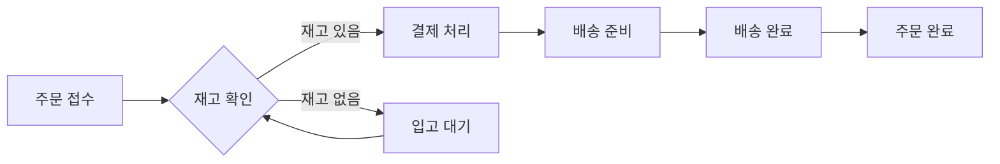
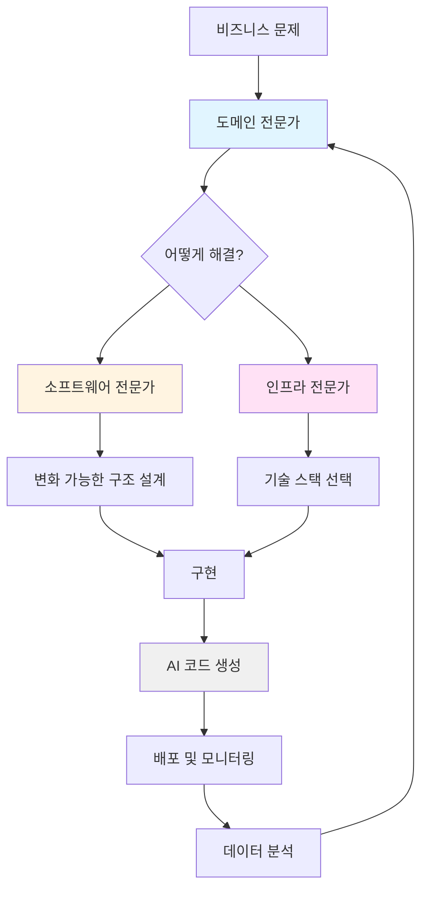

# Episode 15: "코드 제너레이션: 템플릿에서 LLM까지"

_반복 작업을 자동화하는 도구들의 진화_

---

## 프롤로그: 똑같은 코드를 백 번째 작성하던 날

2010년, 당신은 회사에서 새로운 REST API 엔드포인트를 추가하는 작업을 하고 있습니다. Controller, Service, Repository, DTO, Test... 파일을 하나씩 만들며 생각합니다.

_"이거... 지난주에도 똑같이 만들지 않았나?"_

```java
// UserController.java
@RestController
@RequestMapping("/api/users")
public class UserController {
    @Autowired
    private UserService userService;
    
    @GetMapping("/{id}")
    public ResponseEntity<UserDTO> getUser(@PathVariable Long id) {
        return ResponseEntity.ok(userService.getUser(id));
    }
}

// 그리고 또...
// ProductController.java
@RestController
@RequestMapping("/api/products")
public class ProductController {
    @Autowired
    private ProductService productService;
    
    @GetMapping("/{id}")
    public ResponseEntity<ProductDTO> getProduct(@PathVariable Long id) {
        return ResponseEntity.ok(productService.getProduct(id));
    }
}

// 그리고 또... 그리고 또...
```

<Callout type='error' title='반복 작업의 고통'>
**복사-붙여넣기의 악순환:**
- 같은 패턴의 코드를 수십 번 작성
- 변수명만 바꾸다 실수하기 일쑤
- 나중에 패턴이 바뀌면 모든 파일 수정

**휴먼 에러의 온상:**
- "User를 Product로 바꾸다가 한 곳을 빠뜨렸네..."
- "테스트 파일 만드는 걸 또 깜빡했다..."
- "이번엔 Builder 패턴 적용하는 걸 잊었네..."

**시간 낭비:**
- 실제로 중요한 비즈니스 로직은 10%
- 나머지 90%는 보일러플레이트
</Callout>

개발자들은 깨달았습니다: **반복적인 코드는 자동으로 생성되어야 한다.**

이것은 단순한 편의성의 문제가 아니었습니다. 코드 제너레이션은 **일관성, 정확성, 생산성**의 문제였습니다.

<Callout type='note' title='이 글에서 다룰 내용'>
  - 코드 생성기의 진화: 템플릿에서 AI까지
  - 메타프로그래밍: 코드를 작성하는 코드
  - 로우코드/노코드: 개발자가 아닌 사람도 만드는 시대
  - AI 시대의 코드 생성: 새로운 패러다임
</Callout>

---

## Chapter 1: 코드 생성기의 역사

### 초창기: Make와 자동 빌드 도구들

1976년, Unix의 `make`는 사실상 최초의 코드 생성 도구였습니다. C 코드에서 실행 파일을 자동으로 생성했으니까요.

```makefile
# 1976년의 자동화
# Makefile
app: main.o utils.o
    gcc -o app main.o utils.o

main.o: main.c
    gcc -c main.c

utils.o: utils.c
    gcc -c utils.c
```

하지만 진정한 **소스 코드 생성**은 1980년대부터 시작됩니다.

### 1990년대: GUI 빌더의 시대

Visual Basic(1991)과 Delphi(1995)는 혁명적이었습니다. **버튼을 드래그 앤 드롭하면 코드가 자동으로 생성**되었으니까요.

```vb
' Visual Basic이 자동으로 생성한 코드
Private Sub Command1_Click()
    MsgBox "Hello, World!"
End Sub

Private Sub Form_Load()
    Command1.Caption = "Click Me"
    Command1.Left = 1200
    Command1.Top = 800
End Sub
```

<Card title='Visual Basic의 혁신' description='코드 생성의 민주화'>
**이전:** 
- 모든 UI 코드를 손으로 작성
- 좌표 계산, 이벤트 핸들러 연결 등 복잡한 작업

**Visual Basic 이후:**
- 마우스로 UI 디자인
- 자동으로 생성된 코드 기반으로 로직만 추가
- **비전문가도 소프트웨어 개발 가능**
</Card>

이것은 중요한 발견이었습니다: **코드 생성은 진입 장벽을 낮춘다.**

### 2000년대: 웹 시대의 스캐폴딩 도구

Ruby on Rails(2004)의 등장은 웹 개발에 큰 충격을 주었습니다.

```bash
# Rails의 마법 같은 코드 생성
$ rails generate scaffold Post title:string content:text

# 자동으로 생성되는 것들:
# - Model (post.rb)
# - Controller (posts_controller.rb)
# - Views (index, show, new, edit...)
# - Migration (create_posts.rb)
# - Routes
# - Tests
```

<Steps>
<Step title='Rails의 철학: Convention over Configuration'>
"설정보다 관습"이라는 철학으로, 정해진 패턴을 따르면 자동으로 모든 것이 생성됩니다.
</Step>

<Step title='다른 프레임워크들의 추종'>
- Django (Python): `python manage.py startapp`
- Laravel (PHP): `php artisan make:model`
- Spring Boot (Java): Spring Initializr
- Angular (TypeScript): `ng generate component`
</Step>

<Step title='생산성의 폭발'>
하루 걸리던 CRUD 작업이 5분으로 단축. 개발자들은 비즈니스 로직에 집중할 수 있게 되었습니다.
</Step>
</Steps>

### 2010년대: Yeoman과 프로젝트 제너레이터

2012년, Google의 Yeoman은 **프로젝트 전체를 생성하는 도구**로 등장했습니다.

```bash
# Yeoman으로 React 앱 생성
$ npm install -g yo generator-react-webpack
$ yo react-webpack my-app

# 생성되는 것들:
# - 프로젝트 구조
# - 빌드 설정 (webpack.config.js)
# - 테스트 설정 (jest.config.js)
# - 린트 설정 (.eslintrc)
# - 패키지 의존성 (package.json)
# - README, gitignore 등
```

<Callout type='success' title='Yeoman의 영향력'>
Yeoman은 단순한 도구가 아니라 **생태계**였습니다. 커뮤니티가 만든 8,000개 이상의 제너레이터가 있었고, 각 프레임워크와 회사가 자신만의 제너레이터를 제공했습니다.

- `generator-angular`: Angular 프로젝트
- `generator-backbone`: Backbone.js 앱
- `generator-webapp`: 기본 웹앱
- 각 회사의 자체 제너레이터: 팀의 베스트 프랙티스 공유
</Callout>

### 현대: Create-* 도구들의 시대

2016년 Create React App 이후, `create-*` 패턴이 표준이 되었습니다.

```bash
# 2016~현재: 제로 설정 철학
$ npx create-react-app my-app
$ npx create-next-app my-app
$ npm create vite@latest my-app
$ bun create next-app my-app

# 2024: AI 기반 생성
$ v0 create dashboard --with-auth --database=postgres
```

<Callout type='info' title='현대 코드 제너레이터의 특징'>
**제로 설정 (Zero Configuration):**
- 복잡한 webpack, babel 설정을 숨김
- "그냥 작동하는" 프로젝트

**최신 베스트 프랙티스 내장:**
- TypeScript, ESLint, Prettier 기본 포함
- 테스트 환경 자동 구성
- 성능 최적화 기본 적용

**점진적 복잡도:**
- 초보자: 제공된 그대로 사용
- 전문가: `eject`로 설정 커스터마이징 가능
</Callout>

---

## Chapter 2: 메타프로그래밍 - 코드를 작성하는 코드

메타프로그래밍은 **런타임에 코드를 생성하거나 수정하는 기법**입니다. 제너레이터가 개발 시점에 코드를 만든다면, 메타프로그래밍은 **실행 중에** 만듭니다.

### Reflection: 자기 자신을 들여다보기

Java의 Reflection은 가장 널리 사용되는 메타프로그래밍 기법입니다.

```java
// Spring Framework의 마법
@RestController
public class UserController {
    @Autowired  // ← 이것은 메타프로그래밍
    private UserService userService;
    
    @GetMapping("/users/{id}")  // ← 이것도
    public User getUser(@PathVariable Long id) {
        return userService.getUser(id);
    }
}

// Spring이 런타임에 하는 일:
// 1. @RestController 발견
// 2. HTTP 요청 핸들러로 등록
// 3. @Autowired 발견
// 4. UserService 인스턴스 자동 주입
// 5. @GetMapping 발견
// 6. GET /users/{id} 라우트 자동 생성
```

<Card title='Reflection의 활용 사례' description='실무에서 매일 사용하는 메타프로그래밍'>
**ORM (Hibernate, TypeORM):**
```java
@Entity
public class User {
    @Id
    @GeneratedValue
    private Long id;
    
    @Column(unique = true)
    private String email;
}
// → 자동으로 CREATE TABLE, SELECT, INSERT 생성
```

**Serialization (Jackson, Gson):**
```java
ObjectMapper mapper = new ObjectMapper();
String json = mapper.writeValueAsString(user);
// → 런타임에 클래스 구조 분석하여 JSON 변환
```

**테스트 프레임워크 (JUnit, Jest):**
```java
@Test
public void testUserCreation() { ... }
// → @Test 어노테이션으로 테스트 메서드 자동 발견
```
</Card>

### 매크로: 컴파일 시점의 코드 생성

Rust의 매크로는 **컴파일 시점에 코드를 생성**합니다.

```rust
// Rust의 derive 매크로
#[derive(Debug, Clone, Serialize, Deserialize)]
pub struct User {
    pub id: u64,
    pub name: String,
    pub email: String,
}

// 자동으로 생성되는 코드:
// - Debug 출력 구현
// - Clone 구현
// - JSON 직렬화/역직렬화 구현
// 수백 줄의 보일러플레이트를 한 줄로!
```

<Callout type='success' title='매크로의 장점'>
**성능:**
- 런타임 오버헤드 없음
- 컴파일 시점에 모든 코드 생성 완료

**타입 안전성:**
- 생성된 코드도 컴파일러가 검증
- 런타임 에러 대신 컴파일 에러

**유지보수성:**
- 반복 코드 제거
- 한 곳만 수정하면 모든 곳에 반영
</Callout>

### Python의 Metaclass: 클래스를 만드는 클래스

Python은 **클래스 자체를 프로그래밍**할 수 있습니다.

```python
# Django ORM의 메타클래스 마법
class User(models.Model):
    name = models.CharField(max_length=100)
    email = models.EmailField()
    
    class Meta:
        db_table = 'users'
        ordering = ['-created_at']

# Django가 metaclass로 자동 생성하는 것들:
# - __init__ 메서드
# - save(), delete() 메서드
# - objects.all(), filter() 같은 쿼리 메서드
# - 데이터베이스 마이그레이션 코드
```

<Steps>
<Step title='메타클래스의 동작 원리'>
Python에서 클래스도 객체입니다. 메타클래스는 클래스를 만드는 "공장"입니다.

```python
# 일반적인 경우
instance = MyClass()  # 클래스로 인스턴스 생성

# 메타클래스
MyClass = MyMetaclass()  # 메타클래스로 클래스 생성!
```
</Step>

<Step title='실용적인 활용: 싱글톤 패턴'>
```python
class Singleton(type):
    _instances = {}
    
    def __call__(cls, *args, **kwargs):
        if cls not in cls._instances:
            cls._instances[cls] = super().__call__(*args, **kwargs)
        return cls._instances[cls]

class Database(metaclass=Singleton):
    pass

# 몇 번을 생성해도 같은 인스턴스
db1 = Database()
db2 = Database()
assert db1 is db2  # True
```
</Step>

<Step title='프레임워크에서의 활용'>
- **Django ORM**: 모델 클래스에 쿼리 메서드 자동 추가
- **SQLAlchemy**: 테이블 매핑 자동화
- **Pydantic**: 데이터 검증 코드 자동 생성
</Step>
</Steps>

### JavaScript의 Proxy: 동적 인터셉션

JavaScript의 Proxy는 객체 접근을 가로챌 수 있습니다.

```javascript
// Vue 3의 반응성 시스템
const state = reactive({
  count: 0,
  message: 'Hello'
});

// state.count를 읽거나 쓸 때마다
// Vue가 자동으로 의존성 추적 및 UI 업데이트

// 내부 구현 (단순화)
function reactive(target) {
  return new Proxy(target, {
    get(obj, prop) {
      track(obj, prop);  // 의존성 추적
      return obj[prop];
    },
    set(obj, prop, value) {
      obj[prop] = value;
      trigger(obj, prop);  // UI 업데이트 트리거
      return true;
    }
  });
}
```

<Card title='Proxy의 활용 사례' description='현대 프레임워크의 핵심 기술'>
**Vue 3 Composition API:**
```javascript
const count = ref(0);
// ref는 내부적으로 Proxy 사용
// count.value 접근 시 자동 추적
```

**MobX 상태 관리:**
```javascript
const store = observable({
  todos: []
});
// 자동으로 변경 감지 및 리렌더링
```

**API 모킹:**
```javascript
const api = new Proxy({}, {
  get: (_, endpoint) => (...args) => 
    fetch(\`/api/\${endpoint}\`, ...args)
});
// api.users.get() → fetch('/api/users')
```
</Card>

### 메타프로그래밍의 양날의 검

<Callout type='warning' title='메타프로그래밍 사용 시 주의사항'>
**장점:**
- 보일러플레이트 코드 대폭 감소
- 프레임워크 사용자에게 편리한 API 제공
- DRY(Don't Repeat Yourself) 원칙 실현

**단점:**
- **디버깅 어려움**: 코드가 어디서 생성되는지 추적 힘듦
- **성능 오버헤드**: Reflection은 일반 호출보다 느림
- **학습 곡선**: 초보자가 이해하기 어려움
- **IDE 지원 부족**: 자동완성, 타입 검사 제한적

**권장사항:**
- 프레임워크나 라이브러리 개발 시 제한적으로 사용
- 비즈니스 로직에는 명시적 코드 사용
- 성능이 중요한 부분은 메타프로그래밍 피하기
</Callout>

---

## Chapter 3: 로우코드/노코드 - 코딩 없이 만드는 소프트웨어

로우코드/노코드는 **비개발자도 소프트웨어를 만들 수 있게** 하는 패러다임입니다.

### 초창기: Microsoft Access와 FileMaker

1990년대, Access와 FileMaker는 "프로그래밍 없이 데이터베이스 앱"을 만들 수 있게 했습니다.

```sql
-- 개발자: 복잡한 SQL 작성
SELECT 
  o.order_id,
  c.customer_name,
  SUM(oi.quantity * p.price) as total
FROM orders o
JOIN customers c ON o.customer_id = c.id
JOIN order_items oi ON o.id = oi.order_id
JOIN products p ON oi.product_id = p.id
WHERE o.created_at >= '2024-01-01'
GROUP BY o.order_id, c.customer_name
HAVING total > 1000;

-- Access 사용자: 마우스 클릭으로 쿼리 작성
```

<Card title='Access의 혁신' description='비개발자의 데이터베이스 접근'>
- **쿼리 빌더**: 드래그 앤 드롭으로 SQL 생성
- **폼 디자이너**: 버튼 클릭으로 UI 작성
- **VBA 매크로**: 간단한 로직은 녹화 기능으로

**영향:**
- 수백만 명의 사무직 직원들이 자체 도구 개발
- "시민 개발자(Citizen Developer)" 개념 탄생
- IT 부서 없이도 업무 자동화 가능
</Card>

### 2000년대: 워크플로우 자동화

#### BPMN: Business Process Model and Notation

BPMN은 **비즈니스 프로세스를 시각적으로 설계**하는 표준입니다.



<Steps>
<Step title='BPMN의 목적'>
**비즈니스와 IT의 간극 해소:**
- 기획자가 그린 플로우차트가 → 실제 실행되는 코드로
- "요구사항 문서"가 아니라 "실행 가능한 프로세스"
</Step>

<Step title='BPMN 엔진의 동작'>
```xml
<!-- BPMN 2.0 XML 정의 -->
<process id="orderProcess">
  <startEvent id="start"/>
  <userTask id="approveOrder" name="주문 승인"/>
  <serviceTask id="processPayment" name="결제 처리">
    <extensionElements>
      <camunda:connector>
        <camunda:connectorId>payment-service</camunda:connectorId>
      </camunda:connector>
    </extensionElements>
  </serviceTask>
  <endEvent id="end"/>
</process>
```

엔진(Camunda, Activiti 등)이 이 XML을 읽고 실제 프로세스 실행.
</Step>

<Step title='실무 활용 사례'>
- **은행**: 대출 승인 프로세스
- **제조**: 품질 검사 워크플로우
- **HR**: 휴가 신청 승인 프로세스
- **보험**: 클레임 처리 자동화
</Step>
</Steps>

<Callout type='info' title='Digital Transformation의 핵심'>
BPMN과 BPM(Business Process Management) 솔루션은 **디지털 전환의 이론적 기반**입니다:

- **프로세스 최적화**: 병목 지점 시각화 및 개선
- **규정 준수**: 감사 추적(Audit Trail) 자동 기록
- **민첩성**: 비즈니스 변화에 빠르게 대응
- **통합**: 레거시 시스템과 신규 시스템 연결

**대표 솔루션:**
- Camunda (오픈소스)
- IBM BPM
- Pega Platform
- Appian
</Callout>

#### Zapier와 IFTTT: 클라우드 시대의 워크플로우

2011년, Zapier는 "프로그래밍 없이 앱들을 연결"하는 서비스를 시작했습니다.

```javascript
// 개발자가 작성해야 했던 코드:
const express = require('express');
app.post('/webhook/gmail', async (req, res) => {
  const email = req.body;
  if (email.from.includes('important')) {
    await slack.post('/messages', {
      channel: '#urgent',
      text: `New email from ${email.from}: ${email.subject}`
    });
  }
  res.status(200).send('OK');
});

// Zapier 사용자: 마우스 클릭 3번
// 1. Trigger: Gmail - New Email
// 2. Filter: From contains "important"
// 3. Action: Slack - Send Message to Channel
```

<Card title='현대 노코드 자동화 플랫폼' description='2020년대의 주요 도구들'>
**Zapier:**
- 6,000개 이상의 앱 연동
- 복잡한 멀티스텝 워크플로우
- 일반 사용자 타겟

**Make (구 Integromat):**
- 시각적 플로우 빌더
- 개발자 친화적
- 복잡한 로직 구현 가능

**n8n:**
- 오픈소스
- 셀프 호스팅 가능
- 데이터 프라이버시 중요 시

**Temporal:**
- 개발자용 워크플로우 엔진
- 코드로 작성, 시각화 제공
- 내결함성(Fault Tolerance) 보장
</Card>

### 2010년대: 앱 빌더의 부상

#### Bubble: 프로그래밍 없이 웹앱 만들기

Bubble(2012)은 완전한 웹 애플리케이션을 코드 없이 만들 수 있게 했습니다.

<Steps>
<Step title='데이터베이스 설계'>
마우스 클릭으로 테이블, 관계, 제약조건 정의. SQL 작성 불필요.
</Step>

<Step title='UI 디자인'>
드래그 앤 드롭으로 레이아웃 구성. CSS 지식 불필요.
</Step>

<Step title='워크플로우 정의'>
"When Button is clicked → Create a new Thing → Navigate to Page" 형태로 로직 구성. JavaScript 불필요.
</Step>

<Step title='API 연동'>
외부 API도 GUI로 설정. `fetch()` 작성 불필요.
</Step>
</Steps>

<Callout type='success' title='Bubble의 성공 사례'>
- **Comet**: Y Combinator 출신 스타트업, Series A까지 Bubble로만 개발
- **Qoins**: 100만 달러 이상 투자 유치, Bubble 기반
- **수천 개의 스타트업**: MVP를 48시간 안에 런칭

**교훈:**
많은 스타트업에게 필요한 것은 "완벽한 코드"가 아니라 "빠른 검증"입니다.
</Callout>

#### Retool: 내부 도구 전문

Retool(2017)은 **관리자 대시보드, 내부 툴 제작**에 특화되었습니다.

```javascript
// 개발자가 작성해야 했던 코드:
// - React 컴포넌트 수십 개
// - API 호출 로직
// - 폼 검증
// - 테이블 페이지네이션
// - 권한 관리
// → 보통 2-3주 소요

// Retool: 2-3시간
// 1. DB 연결 (PostgreSQL, MySQL 등)
// 2. 쿼리 작성 (SQL Editor)
// 3. 테이블/폼/차트 컴포넌트 배치
// 4. 버튼에 쿼리 연결
// → 완료!
```

<Card title='Retool의 타겟: 개발자를 위한 로우코드' description='생산성과 유연성의 균형'>
**철학:**
- 80%는 노코드로 (UI, CRUD)
- 20%는 코드로 (복잡한 로직, 커스텀 함수)

**장점:**
- **속도**: 관리 페이지를 하루 만에 완성
- **유지보수**: 한 곳에서 관리
- **보안**: 권한 관리 내장

**사용 사례:**
- 고객 지원 도구
- 데이터베이스 관리 대시보드
- 주문/재고 관리 시스템
- 내부 리포팅 툴
</Card>

### 2020년대: AI 네이티브 노코드

#### v0.dev: 텍스트로 UI 생성

Vercel의 v0.dev(2023)는 **자연어로 UI를 생성**합니다.

```text
사용자: "사용자 목록을 보여주는 테이블 만들어줘. 
        검색 기능이 있고, 페이지네이션 되어야 해."

v0.dev: (3초 후)
```

```tsx
// 자동 생성된 코드
'use client';

import { useState } from 'react';
import { Input } from '@/components/ui/input';
import {
  Table,
  TableBody,
  TableCell,
  TableHead,
  TableHeader,
  TableRow,
} from '@/components/ui/table';

export default function UserTable({ users }) {
  const [search, setSearch] = useState('');
  const [page, setPage] = useState(0);
  
  const filtered = users.filter(u => 
    u.name.toLowerCase().includes(search.toLowerCase())
  );
  
  const paged = filtered.slice(page * 10, (page + 1) * 10);
  
  return (
    <div className="space-y-4">
      <Input 
        placeholder="Search users..." 
        value={search}
        onChange={(e) => setSearch(e.target.value)}
      />
      <Table>
        <TableHeader>
          <TableRow>
            <TableHead>Name</TableHead>
            <TableHead>Email</TableHead>
          </TableRow>
        </TableHeader>
        <TableBody>
          {paged.map(user => (
            <TableRow key={user.id}>
              <TableCell>{user.name}</TableCell>
              <TableCell>{user.email}</TableCell>
            </TableRow>
          ))}
        </TableBody>
      </Table>
      {/* Pagination controls */}
    </div>
  );
}
```

#### Lovable (구 GPT Engineer): 앱 전체 생성

Lovable(2024)은 **대화만으로 풀스택 앱**을 만듭니다.

<Steps>
<Step title='자연어 대화'>
```text
"쇼핑몰을 만들고 싶어. 
상품 목록, 장바구니, 결제 기능이 필요해."
```
</Step>

<Step title='자동 설계'>
Lovable이 자동으로:
- 데이터베이스 스키마 설계
- API 엔드포인트 정의
- UI 컴포넌트 구조 결정
</Step>

<Step title='코드 생성 및 배포'>
- React/Next.js 프론트엔드
- Node.js 백엔드
- PostgreSQL 데이터베이스
- Vercel/Railway 자동 배포
</Step>

<Step title='반복 개선'>
```text
"결제는 Stripe로 연동해줘"
"상품 이미지를 크게 보여줘"
"관리자 페이지 추가해줘"
```
대화로 계속 수정 가능!
</Step>
</Steps>

<Callout type='warning' title='AI 노코드의 현실'>
**놀라운 점:**
- 80% 정도의 일반적인 요구사항은 완벽히 처리
- 프로토타입 제작 속도가 10배 이상 빨라짐
- 비개발자도 실제 작동하는 앱 제작 가능

**한계:**
- **복잡한 비즈니스 로직**: 여전히 개발자 필요
- **성능 최적화**: 자동 생성 코드는 비효율적일 수 있음
- **커스터마이징**: 생성된 코드 이해 및 수정 능력 필요
- **유지보수**: 장기 프로젝트는 결국 코드 품질 중요

**최선의 활용법:**
- MVP, 프로토타입에 사용
- 생성된 코드를 시작점으로 개발자가 다듬기
- 간단한 내부 도구, 랜딩 페이지 등
</Callout>

#### Cursor, Windsurf: IDE에 통합된 AI

2024년, AI 코드 생성은 **IDE 자체에 통합**되었습니다.

<Card title='AI IDE의 새로운 패러다임' description='코드 작성 방식의 근본적 변화'>
**Cursor:**
- `Cmd+K`: 선택한 코드 수정
- `Cmd+L`: AI와 대화하며 개발
- Composer: 여러 파일 동시 편집

**Windsurf (Codeium):**
- Cascade: 전체 코드베이스 이해
- Flows: 복잡한 작업 자동화
- 무료 무제한 사용

**변화:**
```text
과거: 
  생각 → 구글 검색 → Stack Overflow → 복붙 → 수정

현재:
  생각 → AI에게 요청 → 코드 생성 → 리뷰 → 수정
  
미래:
  생각 → AI와 대화 → 완성
```
</Card>

---

## Chapter 4: 코드 생성의 미래

### 계층별 전략

<Callout type='info' title='2025년 코드 생성 전략'>
**프로토타입/MVP (0→1):**
- Lovable, v0.dev, Bolt.new 같은 AI 노코드 플랫폼
- 48시간 안에 작동하는 앱
- 빠른 검증이 목표

**스타트업 초기 (1→10):**
- Cursor/Windsurf로 AI 페어 프로그래밍
- 코드 품질 유지하며 빠른 개발
- 리팩토링 여유 있음

**성장 단계 (10→100):**
- 프레임워크의 제너레이터 (Rails, Django, Next.js)
- 메타프로그래밍으로 보일러플레이트 제거
- 내부 도구는 Retool로 빠르게

**엔터프라이즈 (100→1000):**
- 자체 코드 제너레이터 개발
- 회사만의 베스트 프랙티스 강제
- BPMN/BPM으로 비즈니스 프로세스 자동화
</Callout>

### AI 시대에도 개발자가 필요한 이유

<Steps>
<Step title='AI는 "무엇을"이 아니라 "어떻게"를 모른다'>
AI는 명확한 요구사항이 주어지면 코드를 잘 생성합니다. 하지만:
- "수익성 높은 제품"을 만들 수는 없음
- "사용자가 원하는 UX"를 알 수 없음
- "비즈니스 목표"를 이해하지 못함

**개발자의 역할:** 제품 비전, UX 설계, 비즈니스 로직 정의
</Step>

<Step title='복잡한 시스템 설계'>
```text
AI가 잘하는 것:
- 단일 컴포넌트 생성
- 명확한 패턴 구현
- 표준적인 CRUD 작업

AI가 못하는 것:
- 마이크로서비스 아키텍처 설계
- 확장 가능한 데이터 모델 설계
- 성능 병목 지점 파악 및 해결
- 장애 복구 전략 수립
```

**개발자의 역할:** 시스템 아키텍처, 기술 선택, 트레이드오프 결정
</Step>

<Step title='컨텍스트와 레거시'>
기업의 실제 코드베이스는:
- 10년 이상된 레거시 코드
- 수백 개의 마이크로서비스
- 복잡한 비즈니스 규칙
- 조직 특유의 관습

AI는 이 모든 컨텍스트를 한 번에 이해할 수 없습니다.

**개발자의 역할:** 레거시 이해, 점진적 개선, 조직 지식 전수
</Step>

<Step title='책임과 의사결정'>
코드는 단순한 텍스트가 아닙니다:
- 보안 취약점 → 고객 데이터 유출
- 버그 → 금전적 손실
- 잘못된 아키텍처 → 회사 실패

AI는 책임을 질 수 없습니다.

**개발자의 역할:** 최종 의사결정, 코드 리뷰, 품질 보증
</Step>
</Steps>

<Callout type='success' title='AI는 도구, 개발자는 장인'>
**과거의 자동화:**
- 컴파일러 등장 → 어셈블리 프로그래머 실직? ❌
- IDE 등장 → 텍스트 에디터 프로그래머 실직? ❌
- Stack Overflow 등장 → 책 읽는 프로그래머 실직? ❌

**각 도구는:**
- 생산성을 10배 높임
- 더 복잡한 문제를 해결 가능하게 함
- 프로그래밍을 더 많은 사람에게 개방

**AI도 마찬가지:**
- 반복 작업 자동화
- 개발자는 더 높은 수준의 문제에 집중
- 더 많은 사람이 소프트웨어 개발 참여
</Callout>

### 프로그래밍의 진화: 3개 계층으로의 수렴

살아있는 비즈니스는 끊임없이 변화합니다. 시장이 변하고, 고객이 변하고, 경쟁사가 변합니다. 그리고 그 변화를 따라가기 위해 **코드도 계속 변화**해야 합니다.

과거에는 변화의 대부분이 "어떻게 구현할 것인가"의 문제였습니다:
- 이 기능을 C로 구현할까 Java로 구현할까?
- 이 반복문은 for를 쓸까 while을 쓸까?
- 메모리는 어떻게 할당하고 해제할까?

하지만 기술이 발달하면서, 이런 **"How(어떻게)"의 문제들은 점점 자동화**되고 있습니다.

<Card title='프로그래밍 역할의 변천사' description='번역자에서 문제 해결자로'>
**1세대 (1950~1990):**
```text
인간의 의도 → 기계어로 번역 → 컴퓨터 실행
```
프로그래머 = 번역자
- 절차를 컴퓨터가 이해할 수 있는 언어로 변환
- 메모리 관리, 포인터 연산, 레지스터 활용

**2세대 (1990~2020):**
```text
비즈니스 요구사항 → 알고리즘 설계 → 프레임워크로 구현
```
프로그래머 = 설계자 + 구현자
- 효율적인 알고리즘 선택
- 적절한 프레임워크와 라이브러리 활용
- 일부는 자동화, 일부는 수동

**3세대 (2020~현재):**
```text
문제 정의 → 해결 방법 설계 → AI 협업으로 구현
```
프로그래머 = 문제 해결자
- 문제의 본질 파악
- 최적의 해결 방법 설계
- 구현은 대부분 자동화
</Card>

앞으로 개발자의 역할은 **3개의 핵심 계층**으로 수렴할 것입니다.

#### 1️⃣ 인프라 계층: 기술 스택 설계

**핵심 질문:** "어떤 기술을 어떻게 조합할 것인가?"

```text
문제별 최적 스택 설계:
━━━━━━━━━━━━━━━━━━━━━━━━━━━━
실시간 채팅?
  → WebSocket + Redis Pub/Sub
  → 또는 WebRTC Peer-to-Peer?

글로벌 서비스?
  → Multi-region DB + CDN
  → 또는 Edge Computing?

10억 건 데이터 분석?
  → Data Lake + Spark
  → 또는 Serverless 병렬 처리?
```

<Callout type='info' title='인프라 전문가의 핵심 역량'>
**기술 선택:**
- 문제 특성 파악 (트래픽 패턴, 데이터 규모, 지연시간 요구사항)
- 트레이드오프 이해 (일관성 vs 가용성, 비용 vs 성능)
- 미래 확장성 고려

**실무 사례:**
- 스타트업 초기: Vercel + Supabase (빠른 개발)
- 성장기: AWS + Kubernetes (확장성)
- 대규모: Multi-cloud + Custom Infra (최적화)

**AI가 못하는 것:**
- "우리 회사에 맞는" 아키텍처 설계
- 비용과 성능의 비즈니스적 판단
- 조직 역량에 맞는 기술 선택
</Callout>

#### 2️⃣ 소프트웨어 계층: 변화 관리

**핵심 질문:** "어떻게 하면 변화를 쉽게 만들 수 있을까?"

비즈니스는 변합니다. 그런데 코드가 변화를 거부하면 비즈니스가 멈춥니다.

```typescript
// ❌ 변화에 취약한 코드
function calculatePrice(productType: string, quantity: number): number {
  if (productType === 'book') {
    return quantity * 10000 * 0.9; // 10% 할인
  } else if (productType === 'electronics') {
    return quantity * 50000 * 0.95; // 5% 할인
  } else if (productType === 'food') {
    return quantity * 5000; // 할인 없음
  }
  // 새 제품 타입 추가할 때마다 이 함수 수정...
}

// ✅ 변화에 유연한 코드 (Strategy Pattern)
interface PricingStrategy {
  calculate(quantity: number): number;
}

class Product {
  constructor(
    private pricingStrategy: PricingStrategy
  ) {}
  
  getPrice(quantity: number): number {
    return this.pricingStrategy.calculate(quantity);
  }
}

// 새 제품 타입? 새 Strategy 클래스만 추가
// 기존 코드는 전혀 수정하지 않음 (Open-Closed Principle)
```

<Callout type='warning' title='소프트웨어 전문가의 핵심 역량'>
**디자인 패턴 활용:**
- Strategy: 알고리즘 교체 가능하게
- Observer: 변경 사항 자동 전파
- Factory: 객체 생성 로직 분리
- Dependency Injection: 결합도 낮추기

**코드 변화 비용 최소화:**
- 단일 책임 원칙 (SRP): 하나만 잘하는 클래스
- 개방-폐쇄 원칙 (OCP): 확장은 쉽게, 수정은 어렵게
- 의존성 역전 (DIP): 추상에 의존, 구체에 의존 금지

**실무 가치:**
```text
잘못된 설계:
  요구사항 변경 → 10개 파일 수정 → 버그 3개 발생 → 2일 소요

좋은 설계:
  요구사항 변경 → 1개 클래스 추가 → 버그 0개 → 2시간 소요
```

**AI가 못하는 것:**
- 6개월 후 어떻게 변할지 예측
- 현재와 미래의 균형점 찾기
- 과도한 추상화 vs 적절한 추상화 판단
</Callout>

#### 3️⃣ 도메인 계층: 비즈니스 가치 창출

**핵심 질문:** "이 소프트웨어로 어떤 문제를 해결할 것인가?"

기술은 수단입니다. 목적은 **비즈니스 가치 창출**입니다.

<Steps>
<Step title='비즈니스 프로세스 이해'>
```text
예: 보험 청구 처리

기존 프로세스 (3일 소요):
1. 고객이 서류 제출 (팩스/우편)
2. 직원이 서류 스캔 및 입력 (2시간)
3. 담당자가 검토 (1일)
4. 매니저가 승인 (1일)
5. 결제 처리 (1일)

문제점:
- 중복 입력 작업
- 지연 대기 시간
- 서류 분실 위험
```
</Step>

<Step title='Digital Transformation 설계'>
```text
개선된 프로세스 (2시간 소요):
1. 고객이 모바일 앱에서 사진 업로드
   → OCR로 자동 인식 (30초)
2. AI가 1차 검토 (30초)
   → 의심 건만 담당자에게
3. 담당자 검토 (필요시만, 10분)
4. 자동 결제 처리 (1분)

효과:
- 처리 시간 97% 감소
- 인력 50% 절감
- 고객 만족도 상승
```
</Step>

<Step title='비즈니스 규칙을 코드로'>
```typescript
// 도메인 전문가의 코드는 "비즈니스를 표현"합니다
class InsuranceClaim {
  async process() {
    // 비즈니스 규칙 1: 소액은 자동 승인
    if (this.amount < 100000) {
      return this.autoApprove();
    }
    
    // 비즈니스 규칙 2: AI 위험도 평가
    const riskScore = await this.aiRiskAssessment();
    if (riskScore < 0.3) {
      return this.autoApprove();
    }
    
    // 비즈니스 규칙 3: 고위험 건은 매니저 승인 필요
    if (riskScore > 0.7) {
      return this.escalateToManager();
    }
    
    // 중간 위험도는 일반 직원 검토
    return this.assignToAgent();
  }
}

// 이 코드는 "보험 청구 프로세스"를 그대로 표현
// 비즈니스 규칙이 바뀌면 코드도 같이 변경
```
</Step>

<Step title='지속적 가치 개선'>
데이터를 보고 개선합니다:
- "80%는 소액 청구 → 자동화 범위 확대"
- "금요일 오후에 청구 폭증 → 자동 스케일링"
- "특정 병원 청구가 의심 → 패턴 감지 추가"

**비즈니스와 기술의 선순환**
</Step>
</Steps>

<Callout type='success' title='도메인 전문가의 핵심 역량'>
**비즈니스 이해:**
- 실제 사용자의 pain point 파악
- 업무 흐름의 병목 지점 발견
- ROI 계산 (개발 비용 vs 비즈니스 효과)

**Digital Transformation:**
- 수작업을 자동화로
- 오프라인을 온라인으로
- 순차 처리를 병렬 처리로
- 사람 판단을 데이터 기반 의사결정으로

**도메인 주도 설계 (DDD):**
- 유비쿼터스 언어: 개발자와 기획자가 같은 용어 사용
- Bounded Context: 도메인 경계 명확히
- Aggregate: 비즈니스 규칙 강제

**AI가 잘 하지 못하는 것(Physical World에 발을 딛기 전까지는?):**
- "어떤 문제를 해결할 가치가 있는가?" 판단
- "고객이 진짜 원하는 것"이 무엇인지 발견
- "회사의 전략적 방향"에 맞는 제품 설계
</Callout>

### 3개 계층의 시너지

실제로는 이 3개 계층이 **유기적으로 연결**됩니다.



<Card title='실제 프로젝트 예시: 이커머스 구축' description='3개 계층의 협업'>
**도메인 전문가의 역할:**
- "장바구니 이탈률 60% → 원클릭 구매 도입"
- "배송 지연 불만 → 실시간 배송 추적"
- "반품이 복잡함 → 모바일에서 QR 코드로 간소화"

**소프트웨어 전문가의 역할:**
- "결제 모듈을 Strategy 패턴으로 설계 → 신용카드/카카오페이/네이버페이 쉽게 추가"
- "이벤트 기반 아키텍처 → 주문/재고/배송이 느슨하게 결합"
- "Command Pattern → 주문 취소/변경 이력 관리"

**인프라 전문가의 역할:**
- "블랙프라이데이 대비 → Auto Scaling + CDN"
- "글로벌 확장 → Multi-region DB + CloudFront"
- "실시간 재고 → Redis + Kafka Streaming"

**AI의 역할:**
- 각 전문가의 설계에 따라 코드 생성
- 보일러플레이트 자동화
- 테스트 코드 작성

**결과:**
- 인간: 전략, 설계, 의사결정 (20% 시간)
- AI: 구현, 테스트, 문서화 (80% 시간)
- **생산성 5배 증가, 품질은 더 향상**
</Card>

<Callout type='note' title='인간만이 할 수 있는 영역'>
이 3개 계층의 핵심 역량은 **AI 시대에도 인간의 영역으로 남을 것**입니다.

**이유:**

1. **맥락 의존적:** 회사마다, 산업마다, 시기마다 다름
2. **창의적 문제 해결:** 정답이 없는 트레이드오프의 연속
3. **책임과 판단:** 비즈니스 리스크를 감수하는 의사결정
4. **인간 이해:** 사용자의 감정, 조직의 정치, 시장의 변화

**단, AI가 직접 언어와 프레임워크를 만들어 모든 기술적 우위를 점령하는 시대가 온다면?**
그때는 다시 생각해봐야 할 문제입니다. 하지만 그 시대가 온다면, 프로그래밍이 아니라 **모든 화이트칼라 직업**이 재정의될 것입니다.

지금은, 우리는 **AI와 협업하는 방법**을 배우는 시대를 살고 있습니다.
</Callout>

---

## 에필로그: 추상화의 끊임없는 상승

1950년대, 프로그래머는 **펀치 카드로 기계어**를 작성했습니다.

1960년대, **어셈블리어**가 등장했습니다. 당시 사람들은 말했습니다:
_"이제 하드웨어를 이해 못 해도 프로그래밍할 수 있다니, 세상 끝났네!"_

1970년대, **C 언어**가 나왔습니다:
_"메모리 주소를 몰라도 된다니, 진짜 프로그래머는 아니지!"_

1990년대, **가비지 컬렉션**이 도입되었습니다:
_"메모리 관리도 못 하는 프로그래머?"_

2000년대, **프레임워크**가 보편화되었습니다:
_"프레임워크만 쓰고 기본도 모르는 개발자들..."_

2020년대, **AI 코딩 어시스턴트**:
_"AI가 코드 작성하면 개발자는 뭐 하나?"_

**하지만 매번 결과는 같았습니다:**
- ✅ 프로그래머는 사라지지 않았다
- ✅ 더 복잡한 소프트웨어를 만들게 되었다
- ✅ 더 많은 사람이 개발자가 되었다
- ✅ 산업은 기하급수적으로 성장했다

<Blockquote author='Joel Spolsky' cite='Joel on Software'>
"모든 추상화는 새로운 가능성을 열어줍니다. 우리는 이전 세대가 불가능하다고 생각한 것들을 일상적으로 만들고 있습니다."
</Blockquote>

코드 생성은 **프로그래밍의 종말이 아니라, 다음 진화 단계**입니다.

우리는 이제:
- 보일러플레이트를 생성하는 대신 → 비즈니스 로직에 집중
- 문법을 외우는 대신 → 시스템을 설계
- 버그를 고치는 대신 → 사용자 경험을 개선

**코드 생성 도구는 우리를 대체하지 않습니다. 우리를 더 나은 개발자로 만들어줍니다.**

---

<ReferenceList title='참고자료'>
  <Reference
    title='Yeoman - The web scaffolding tool'
    description='코드 생성기의 표준을 정립한 도구'
    href='https://yeoman.io'
    type='documentation'
  />
  <Reference
    title='Ruby on Rails Guides - Command Line'
    description='Rails의 강력한 제너레이터 시스템'
    href='https://guides.rubyonrails.org/command_line.html'
    type='documentation'
  />
  <Reference
    title='Rust Macros - The Rust Book'
    description='컴파일 타임 메타프로그래밍의 정수'
    href='https://doc.rust-lang.org/book/ch19-06-macros.html'
    type='documentation'
  />
  <Reference
    title='Python Metaclasses - Real Python'
    description='클래스를 만드는 클래스 이해하기'
    href='https://realpython.com/python-metaclasses/'
    type='tutorial'
  />
  <Reference
    title='BPMN 2.0 Specification'
    description='비즈니스 프로세스 모델링 표준'
    href='https://www.omg.org/spec/BPMN/2.0/'
    type='documentation'
    author='Object Management Group'
  />
  <Reference
    title='Bubble Documentation'
    description='노코드 웹 앱 개발 플랫폼'
    href='https://manual.bubble.io/'
    type='documentation'
  />
  <Reference
    title='Retool Documentation'
    description='내부 도구 제작을 위한 로우코드 플랫폼'
    href='https://docs.retool.com/'
    type='documentation'
  />
  <Reference
    title='v0 by Vercel'
    description='AI 기반 UI 생성 도구'
    href='https://v0.dev'
    type='tool'
    author='Vercel'
  />
  <Reference
    title='Lovable (GPT Engineer)'
    description='자연어로 풀스택 앱 생성'
    href='https://lovable.dev'
    type='tool'
  />
  <Reference
    title='Camunda Platform'
    description='오픈소스 BPM 플랫폼'
    href='https://camunda.com/platform/'
    type='tool'
  />
  <Reference
    title='The Rise of No-Code - a16z'
    description='노코드 트렌드 분석'
    href='https://a16z.com/the-rise-of-no-code/'
    type='article'
    author='Andreessen Horowitz'
  />
</ReferenceList>

