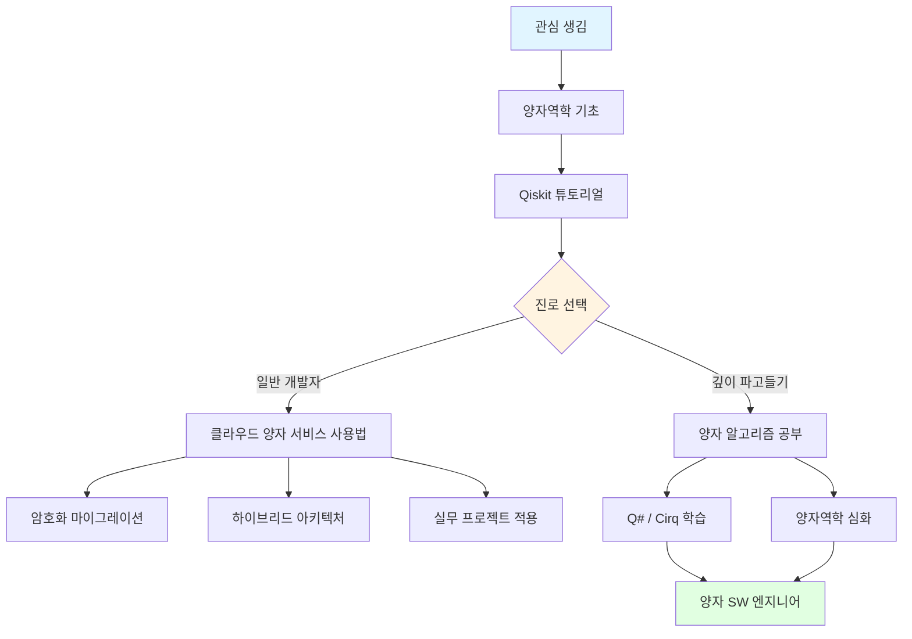

# Episode 16: "양자 컴퓨팅과 프로그래밍 패러다임"

_큐비트로 코딩하는 시대가 온다_

---

## 프롤로그: 2035년, 한 개발자의 아침

당신은 아침 9시에 출근하여 슬랙을 엽니다. CTO로부터 메시지가 하나 도착해 있습니다.

_"오늘 오후 2시까지 100만 개 배송 경로 최적화 결과 부탁합니다. 양자 클러스터 사용 승인했으니 Q# 코드로 작성해주세요."_

당신은 커피를 한 모금 마시고, IDE를 켭니다. 파일명: `delivery-optimization.qs`

```qsharp
operation OptimizeDeliveryRoutes(
    locations: Location[], 
    constraints: Constraint[]
) : Route[] {
    // 100만 개 경로를 10초 만에 최적화
    use qubits = Qubit[Ceiling(Lg(IntAsDouble(Length(locations))))];
    // ... 양자 알고리즘
}
```

10분 후, 코드를 작성하고 양자 클라우드에 제출합니다. **12초 후 결과가 도착**합니다. 기존 클래식 컴퓨터로는 3주 걸리던 계산이었습니다.

<Callout type='note' title='이것은 SF가 아니다'>
**2024년 현재:**
- Google의 Willow 칩: 에러율 획기적 개선
- IBM의 Condor: 1,121큐비트 프로세서
- AWS Braket: 양자 컴퓨팅 클라우드 서비스 상용화
- Microsoft Azure Quantum: Q# 언어 제공

**추세:**
- 10년마다 큐비트 수 10배 증가
- 에러율은 지수적으로 감소
- 상용 서비스 가격은 계속 하락

**전문가 예측:**
대부분의 양자 컴퓨팅 전문가들은 **2030~2035년경 실용적 양자 우위**를 달성할 것으로 예상합니다.
</Callout>

우리는 묻습니다: **양자 컴퓨팅이 실제로 상용화되면, 세상은 어떻게 바뀔까?**

<Callout type='info' title='이 글에서 다룰 내용'>
  - 클래식 비트와 큐비트의 근본적 차이
  - 양자 프로그래밍 언어와 실제 코드
  - 암호화, 신약개발, AI, 최적화 문제 - 세상의 변화
  - 개발자가 지금 준비해야 할 것들
</Callout>

---

## Chapter 1: 체스판에서 3차원으로 - 클래식 비트와 큐비트

### 전통적 비트: 0 또는 1

우리가 지난 80년간 사용한 컴퓨터는 **디지털**입니다. 모든 것이 0과 1로 표현됩니다.

```python
# 클래식 비트의 세계
bit = 0  # 또는 1
# "동시에 0이면서 1"은 불가능
```

이것은 마치 **동전**과 같습니다. 앞면이거나 뒷면입니다. 동시에 둘 다일 수는 없습니다.

### 큐비트: 0이면서 동시에 1

양자 비트(Qubit)는 **중첩(Superposition)** 상태에 있을 수 있습니다.

```python
# 큐비트의 세계 (의사 코드)
qubit = |0⟩ + |1⟩  # 동시에 0이면서 1!
# 관측하는 순간 0 또는 1로 "붕괴"
```

<Card title='슈뢰딩거의 고양이와 큐비트' description='양자역학의 가장 유명한 사고 실험'>
**슈뢰딩거의 고양이:**
상자 안의 고양이는 관측하기 전까지 **"살아있으면서 동시에 죽어있는"** 상태입니다.

**큐비트도 마찬가지:**
측정하기 전까지 **"0이면서 동시에 1인"** 상태입니다.

**핵심:**
이것은 "우리가 모를 뿐"이 아닙니다. 정말로 **물리적으로 동시에 두 상태**입니다.
</Card>

### 지수적 확장: N큐비트 = 2^N 상태

여기서 마법이 시작됩니다.

<Steps>
<Step title='클래식 비트의 성장'>
```text
1비트 = 2개 상태 (0, 1)
2비트 = 4개 상태 (00, 01, 10, 11)
3비트 = 8개 상태
...
N비트 = 2^N 상태

BUT: 한 번에 하나의 상태만 가능
```
</Step>

<Step title='큐비트의 폭발적 성장'>
```text
1큐비트 = 2개 상태를 동시에
2큐비트 = 4개 상태를 동시에
3큐비트 = 8개 상태를 동시에
...
N큐비트 = 2^N 상태를 동시에 처리!
```

**300큐비트 = 우주의 원자 개수보다 많은 상태**를 동시에 처리할 수 있습니다.
</Step>

<Step title='실제 의미'>
클래식 컴퓨터가 100만 가지 경우의 수를 하나씩 확인하려면:
```python
# 클래식: 순차 처리
for case in range(1_000_000):
    result = calculate(case)  # 100만 번 반복
# 시간: O(N)
```

양자 컴퓨터는:
```qsharp
// 양자: 병렬 처리
use qubits = Qubit[20];  // 2^20 = 100만
// 모든 경우를 동시에 계산!
// 시간: O(1) 또는 O(log N)
```
</Step>
</Steps>

<Callout type='warning' title='오해: 양자컴퓨터가 모든 것을 빠르게 하는가?'>
**❌ 틀렸습니다!**

양자 컴퓨터는 **특정 종류의 문제**에서만 빠릅니다:
- ✅ 암호 해독 (Shor's Algorithm)
- ✅ 데이터베이스 검색 (Grover's Algorithm)
- ✅ 조합 최적화 (QAOA)
- ✅ 양자 시뮬레이션
- ❌ 웹 브라우징, 이메일, 문서 작성

**비유:**
- 클래식 컴퓨터 = 자동차 (도로를 달림)
- 양자 컴퓨터 = 헬리콥터 (하늘을 날아 일부 목적지로 직행)

헬리콥터가 더 빠른 경우도 있지만, 모든 경우에 더 빠른 것은 아닙니다.
</Callout>

### 양자 얽힘: 마법 같은 연결

양자 컴퓨팅의 또 다른 핵심은 **얽힘(Entanglement)**입니다.

```text
두 큐비트를 얽히게 하면:
- 첫 번째 큐비트를 측정 → 0으로 붕괴
- 두 번째 큐비트도 순간적으로 영향을 받음
- 거리와 무관 (1cm든 1광년이든)
```

<Card title='아인슈타인의 "으스스한 원거리 작용"' description='Einstein-Podolsky-Rosen 역설'>
아인슈타인은 양자 얽힘을 **"으스스한 원거리 작용(spooky action at a distance)"**이라고 불렀습니다. 정보가 빛의 속도보다 빠르게 전달되는 것처럼 보이니까요.

**하지만:**
- 실제로 정보는 전달되지 않음 (상대성이론 위반 ❌)
- 측정 결과는 무작위 (제어 불가)
- 단, **상관관계는 보장**됨

**활용:**
- 양자 암호통신 (도청 절대 불가능)
- 양자 텔레포테이션 (정보 전송)
- 양자 알고리즘의 핵심 메커니즘
</Card>

---

## Chapter 2: 양자 코드 작성하기 - 새로운 프로그래밍 패러다임

### Qiskit: IBM의 Python 기반 양자 프레임워크

**Qiskit**은 가장 인기 있는 양자 프로그래밍 프레임워크입니다.

```python
from qiskit import QuantumCircuit, execute, Aer

# 양자 회로 생성
circuit = QuantumCircuit(2, 2)  # 2큐비트, 2클래식비트

# 중첩 상태 만들기 (Hadamard gate)
circuit.h(0)  # 큐비트 0을 |0⟩과 |1⟩의 중첩으로

# 얽힘 만들기 (CNOT gate)
circuit.cx(0, 1)  # 큐비트 0과 1을 얽힘

# 측정
circuit.measure([0, 1], [0, 1])

# 시뮬레이터에서 실행
backend = Aer.get_backend('qasm_simulator')
job = execute(circuit, backend, shots=1000)
result = job.result()

print(result.get_counts())
# 출력: {'00': 503, '11': 497}
# → 0과 1이 항상 같이 나타남 (얽힘 증명)
```

<Callout type='success' title='Qiskit의 강점'>
**생태계:**
- IBM Quantum Experience: 실제 양자 컴퓨터 무료 접근
- Qiskit Aer: 고성능 시뮬레이터
- Qiskit Nature: 화학/물리 시뮬레이션
- Qiskit Finance: 금융 최적화
- Qiskit Machine Learning: 양자 머신러닝

**Python 친화적:**
개발자들이 이미 익숙한 Python 생태계와 완벽 통합.
</Callout>

### Cirq: Google의 양자 프레임워크

**Cirq**는 Google이 만든 Python 프레임워크입니다.

```python
import cirq

# 큐비트 정의
qubits = cirq.LineQubit.range(3)

# 회로 생성
circuit = cirq.Circuit(
    # 모든 큐비트를 중첩 상태로
    cirq.H.on_each(*qubits),
    
    # 얽힘 생성
    cirq.CNOT(qubits[0], qubits[1]),
    cirq.CNOT(qubits[1], qubits[2]),
    
    # 측정
    cirq.measure(*qubits, key='result')
)

print(circuit)

# 시뮬레이터 실행
simulator = cirq.Simulator()
result = simulator.run(circuit, repetitions=1000)
print(result.histogram(key='result'))
```

<Card title='Cirq vs Qiskit' description='어떤 것을 선택할까?'>
**Qiskit:**
- ✅ 더 큰 커뮤니티
- ✅ 실제 하드웨어 접근 쉬움 (IBM Quantum)
- ✅ 고수준 알고리즘 라이브러리 풍부

**Cirq:**
- ✅ 더 낮은 수준의 제어 가능
- ✅ NISQ(Noisy Intermediate-Scale Quantum) 알고리즘 최적화
- ✅ Google의 하드웨어와 밀접한 통합

**결론:**
- 연구/학습: Qiskit
- 하드웨어 최적화: Cirq
- 실무: 둘 다 알아두기
</Card>

### Q#: Microsoft의 양자 전용 언어

**Q#**는 양자 컴퓨팅을 위해 **처음부터 설계된 언어**입니다.

```qsharp
namespace QuantumTeleportation {
    open Microsoft.Quantum.Canon;
    open Microsoft.Quantum.Intrinsic;

    // 양자 텔레포테이션 구현
    operation Teleport(message : Qubit, target : Qubit) : Unit {
        use auxiliary = Qubit();
        
        // 얽힘 쌍 생성
        H(auxiliary);
        CNOT(auxiliary, target);
        
        // 메시지와 보조 큐비트 얽힘
        CNOT(message, auxiliary);
        H(message);
        
        // 측정
        let m1 = M(message);
        let m2 = M(auxiliary);
        
        // 수신자 측 보정
        if (m2 == One) { X(target); }
        if (m1 == One) { Z(target); }
    }
}
```

<Steps>
<Step title='Q#의 독특한 특징'>
**타입 안전:**
```qsharp
// 큐비트는 특별한 타입
operation DoSomething(q : Qubit) : Unit {
    // q를 복사하려고 하면 컴파일 에러!
    // (No-cloning theorem)
}
```
</Step>

<Step title='리소스 관리'>
```qsharp
// 큐비트는 자동으로 관리됨
use qubits = Qubit[10] {
    // 이 블록 안에서만 사용
    // 블록 끝나면 자동으로 리셋 및 해제
}
```
</Step>

<Step title='시뮬레이션과 실제 하드웨어 호환'>
```qsharp
// 같은 코드를 시뮬레이터와 실제 하드웨어에서 실행
// Azure Quantum을 통해 다양한 하드웨어 선택 가능:
// - IonQ (이온 트랩)
// - Honeywell (이온 트랩)
// - Rigetti (초전도)
```
</Step>
</Steps>

<Callout type='info' title='양자 프로그래밍의 패러다임 전환'>
**클래식 프로그래밍:**
```python
# 명령형 (Imperative)
result = 0
for i in range(n):
    result += compute(i)
```

**양자 프로그래밍:**
```qsharp
// 선언형 + 확률적 (Declarative + Probabilistic)
use qubits = Qubit[n];
ApplySuperposition(qubits);  // 모든 상태를 동시에
ApplyOracle(qubits);         // 답에 "표시"
AmplitudeAmplification(qubits);  // 답의 확률 증폭
let result = Measure(qubits);  // 높은 확률로 답 획득
```

**핵심 차이:**
- 순차적 → 병렬적
- 결정론적 → 확률적
- 명령형 → 선언적
- 직접 제어 → 간접 제어 (확률 조작)
</Callout>

### 실제 양자 알고리즘: Grover's Algorithm

데이터베이스 검색을 **제곱근 시간**에 수행하는 알고리즘입니다.

```python
from qiskit import QuantumCircuit
from qiskit.algorithms import AmplificationProblem, Grover
from qiskit.primitives import Sampler

# 문제: 1,000,000개 중 특정 항목 찾기
# 클래식: 평균 500,000번 검색
# 양자: 약 1,000번만에 찾음!

def create_oracle(marked_item):
    """찾고자 하는 항목에 표시하는 오라클"""
    n = len(bin(marked_item)[2:])
    oracle = QuantumCircuit(n)
    
    # 찾고자 하는 항목의 위상 반전
    # (구체적 구현은 복잡하므로 생략)
    
    return oracle

# Grover 알고리즘 실행
oracle = create_oracle(marked_item=42)
problem = AmplificationProblem(oracle)
grover = Grover(sampler=Sampler())

result = grover.amplify(problem)
print(f"찾은 항목: {result.top_measurement}")
# 출력: "찾은 항목: 42"
```

<Card title='Grover 알고리즘의 임팩트' description='데이터베이스 검색의 혁명'>
**시간 복잡도:**
- 클래식: O(N) - 선형 검색
- 양자: O(√N) - 제곱근 시간!

**실제 예시:**
```text
100만 개 항목 검색:
- 클래식: 평균 500,000번
- 양자: 약 1,000번

10억 개 항목 검색:
- 클래식: 평균 5억 번
- 양자: 약 31,623번

→ 1만 배 이상 빠름!
```

**활용 분야:**
- 암호 해독 (대칭키)
- 데이터베이스 쿼리 가속화
- AI 학습 데이터 검색
- 최적화 문제
</Card>

---

## Chapter 3: 세상을 바꿀 양자 혁명 - 실제 임팩트

### 1️⃣ 암호화: RSA의 종말과 새로운 시대

#### 현재의 인터넷 보안

지금 이 순간도 당신의 브라우저는 **RSA 암호화**로 보호받고 있습니다.

```python
# RSA의 안전성 기반: 큰 수의 소인수분해는 어렵다
# 예: 2048비트 RSA 키 깨기
# 클래식 컴퓨터: 수억 년
# → 안전함 ✅

p = 매우_큰_소수  # 1024비트
q = 또다른_큰_소수  # 1024비트
N = p * q  # 2048비트

# N을 알아도 p와 q를 찾기는 거의 불가능 (클래식으로는)
```

<Callout type='error' title='Shor의 알고리즘: RSA를 깨뜨리다'>
**1994년, Peter Shor:**
양자 컴퓨터로 소인수분해를 **다항 시간**에 수행하는 알고리즘 발견.

```text
RSA 2048비트 키 깨기:
━━━━━━━━━━━━━━━━━━━━━━━
클래식 슈퍼컴퓨터: 수억 년
양자 컴퓨터 (4000큐비트): 약 8시간

→ RSA는 사실상 무용지물
```

**현재 상태 (2024):**
- IBM: 1,121큐비트 (Condor)
- Google: 에러율 대폭 개선 (Willow)
- RSA 깨는 데 필요: 약 4,000 논리 큐비트
- 에러 보정 고려 시: 약 2,000만 물리 큐비트

**예상 시점:**
- 낙관적: 2030년
- 현실적: 2035~2040년
- 보수적: 2045년 이후

**하지만 위험은 지금:**
- "Store now, decrypt later" 공격
- 지금 암호화된 데이터를 저장해두었다가
- 10년 후 양자 컴퓨터로 해독
</Callout>

#### 양자 내성 암호화 (Post-Quantum Cryptography)

이미 세계는 대비하고 있습니다.

<Steps>
<Step title='NIST 표준화 (2024)'>
미국 국립표준기술연구소(NIST)는 2024년 **양자 내성 암호 표준**을 발표했습니다.

```python
# CRYSTALS-Kyber: 양자 내성 키 교환
# Lattice 기반 암호화 (격자 암호)

from pqcrypto.kem.kyber512 import generate_keypair, encrypt, decrypt

# 키 생성
public_key, secret_key = generate_keypair()

# 암호화
ciphertext, shared_secret = encrypt(public_key)

# 복호화
shared_secret_decrypted = decrypt(secret_key, ciphertext)

# 양자 컴퓨터로도 깨기 어려움!
```
</Step>

<Step title='전환 기간 (2025~2035)'>
**현재 진행 중:**
- Google Chrome: 양자 내성 TLS 실험
- Signal: PQXDH 프로토콜 도입
- Apple iMessage: PQ3 프로토콜 출시
- OpenSSH: 양자 내성 키 교환 지원

**개발자 행동 요령:**
```typescript
// ❌ 곧 위험해질 코드
import { RSA } from 'crypto';

// ✅ 양자 시대를 대비한 코드
import { CRYSTALS_Kyber } from 'pqcrypto';
import { Dilithium } from 'pqcrypto'; // 전자서명

// 하이브리드 접근: 기존 + 양자 내성
const key = combineKeys(
  RSA.generate(),
  Kyber.generate()
);
```
</Step>

<Step title='블록체인과 암호화폐의 위기'>
**Bitcoin, Ethereum의 위험:**
```text
Bitcoin 주소:
- 공개키 해시에서 개인키 역산 가능 (양자로)
- 한 번이라도 송금한 주소: 공개키 노출
- Shor 알고리즘으로 개인키 탈취 가능

전체 비트코인의 약 25% (500만 BTC)가 위험
→ 현재 가치로 약 5,000억 달러!
```

**해결책:**
- Bitcoin 프로토콜 업그레이드 필요
- 양자 내성 서명 알고리즘 도입
- 기존 주소에서 새 주소로 이동 캠페인
</Step>
</Steps>

<Callout type='warning' title='개발자들이 지금 해야 할 것'>
**1. Crypto Agility (암호 민첩성):**
```typescript
// 하드코딩된 알고리즘 ❌
const encrypted = AES256.encrypt(data);

// 설정 가능한 알고리즘 ✅
const encrypted = CryptoService.encrypt(data, {
  algorithm: config.CRYPTO_ALGORITHM  // 나중에 변경 가능
});
```

**2. 인벤토리 작성:**
- 어떤 암호화 알고리즘을 어디서 사용하는가?
- RSA, ECDSA, DH → 위험
- AES, SHA-256 → 비교적 안전 (키 크기 증가 필요)

**3. 마이그레이션 계획:**
- 2025~2030: 테스트 및 실험
- 2030~2035: 단계적 전환
- 2035 이후: 완전 전환
</Callout>

### 2️⃣ 신약 개발: 분자 시뮬레이션 혁명

#### 현재의 신약 개발

```text
신약 하나 개발:
━━━━━━━━━━━━━━━━━
비용: 평균 26억 달러
기간: 10~15년
성공률: 약 10%
```

**왜 이렇게 오래 걸릴까?**

<Card title='분자 시뮬레이션의 어려움' description='지수적 복잡도의 저주'>
**문제:**
분자는 **양자역학적 시스템**입니다. 정확한 시뮬레이션은 클래식 컴퓨터로 불가능합니다.

```python
# 작은 분자 하나 시뮬레이션
# 예: 페니실린 (C16H18N2O4S)

원자 수: 41개
전자 수: ~200개

양자 상태 공간: 2^200 ≈ 10^60
→ 우주의 원자 개수(10^80)보다는 작지만
→ 슈퍼컴퓨터로도 불가능

# 근사 방법 사용
# → 정확도 하락
# → 실패율 증가
```

**결과:**
- 대부분의 후보 약물이 임상 시험 실패
- 수많은 시행착오
- 막대한 비용
</Card>

#### 양자 컴퓨터의 게임 체인저

양자 컴퓨터는 **양자역학을 시뮬레이션**하는 데 자연스럽게 적합합니다.

```python
from qiskit_nature.units import DistanceUnit
from qiskit_nature.second_q.drivers import PySCFDriver

# 분자 정의: 물(H2O)
driver = PySCFDriver(
    atom="""
    O 0.0 0.0 0.0
    H 0.757 0.586 0.0
    H -0.757 0.586 0.0
    """,
    unit=DistanceUnit.ANGSTROM,
    basis="sto3g"
)

# 양자 컴퓨터로 에너지 계산
problem = driver.run()
# 실제 하드웨어나 시뮬레이터에서 실행
# → 정확한 분자 궤도 에너지 계산
```

<Steps>
<Step title='단백질 접힘 문제 해결'>
**AlphaFold의 한계:**
- AI로 단백질 구조 예측 성공
- 하지만 **동역학(Dynamics)**은 여전히 어려움
- 단백질이 어떻게 움직이는지, 약물과 어떻게 상호작용하는지

**양자 컴퓨터:**
```text
단백질-약물 결합 시뮬레이션:
━━━━━━━━━━━━━━━━━━━━━
클래식 + AI: 근사치, 며칠~몇 주
양자: 정확한 계산, 몇 시간

→ 수백~수천 개 후보 약물 빠르게 스크리닝
→ 임상 시험 성공률 대폭 증가
```
</Step>

<Step title='맞춤형 의약품'>
```python
# 2035년의 신약 개발 프로세스

# 1. 환자의 유전자 분석
genome = analyze_patient_genome(patient)

# 2. 양자 컴퓨터로 환자 맞춤형 약물 설계
drug_candidates = quantum_simulator.design_drugs(
    target_protein=genome.disease_marker,
    patient_profile=genome,
    constraints=[
        no_side_effects,
        high_efficacy,
        low_toxicity
    ]
)

# 3. 가상 임상 시험
results = quantum_simulator.simulate_clinical_trial(
    drug_candidates,
    patient_cohort=similar_patients
)

# 4. 최적 약물 선택 및 합성
optimal_drug = results.best()
# 개발 기간: 10년 → 1년
# 비용: 26억 달러 → 1억 달러
```
</Step>

<Step title='실제 사례 (2024년)'>
**기업들의 움직임:**
- **Roche + Cambridge Quantum**: 알츠하이머 치료제 개발
- **Pfizer + IBM**: 양자 컴퓨팅 신약 개발 파트너십
- **Sanofi + Pasqal**: 면역학 연구

**예상 임팩트:**
- 희귀병 치료제 개발 가능 (현재는 수익성 부족)
- 암 맞춤형 치료 (개인별 최적 약물)
- 항생제 내성 해결
</Step>
</Steps>

<Callout type='success' title='헬스케어 혁명'>
**예측:**

**2030년:**
- 양자 컴퓨터 기반 신약 후보 첫 임상 시험

**2035년:**
- 양자 설계 신약 첫 FDA 승인
- 신약 개발 기간 50% 단축

**2040년:**
- 맞춤형 의약품 상용화
- 주요 질병 치료율 대폭 증가
- 의료비 감소 (조기 발견 + 정확한 치료)

**인류에게 미칠 영향:**
양자 컴퓨팅이 가져올 가장 큰 가치는 아마도 여기에 있을 것입니다.
</Callout>

### 3️⃣ AI와 머신러닝: 양자 가속

#### 양자 머신러닝 (QML)

양자 컴퓨터는 특정 AI 작업을 **지수적으로 가속**할 수 있습니다.

```python
from qiskit_machine_learning.algorithms import VQC
from qiskit_machine_learning.neural_networks import SamplerQNN

# 양자 신경망 정의
qnn = SamplerQNN(
    circuit=feature_map,  # 양자 feature map
    input_params=input_params,
    weight_params=weight_params
)

# 양자 분류기
vqc = VQC(
    num_qubits=4,
    quantum_instance=quantum_backend,
    optimizer=optimizer
)

# 학습 (클래식보다 빠름)
vqc.fit(X_train, y_train)

# 추론
predictions = vqc.predict(X_test)
```

<Card title='QML이 빠른 이유' description='힐베르트 공간에서의 학습'>
**클래식 신경망:**
```python
# N차원 데이터 처리
# → N개의 파라미터 필요
# → O(N) 또는 O(N²) 시간
```

**양자 신경망:**
```python
# N차원 데이터를 log(N) 큐비트로 인코딩
# → 2^n 차원 힐베르트 공간 활용
# → O(log N) 시간 (이론적)
```

**실용적 이점:**
- 고차원 데이터 처리 (유전체학, 금융)
- 특성 추출 속도 향상
- 복잡한 패턴 인식
</Card>

#### 양자 최적화: 조합 폭발 문제 해결

**문제:**
```text
외판원 문제 (TSP):
- N개 도시를 최단 경로로 방문
- 가능한 경로: N! (팩토리얼)
- 100개 도시: 10^157 경로
- 우주 나이 동안 계산해도 불가능
```

**양자 해법: QAOA (Quantum Approximate Optimization Algorithm)**

```python
from qiskit.algorithms.optimizers import COBYLA
from qiskit_optimization.applications import Maxcut
from qiskit_optimization.algorithms import MinimumEigenOptimizer
from qiskit.algorithms import QAOA
from qiskit.primitives import Sampler

# 문제 정의: 배송 경로 최적화
problem = define_delivery_problem(
    locations=1000,
    vehicles=50,
    constraints=["time_windows", "capacity"]
)

# QAOA로 해결
qaoa = QAOA(optimizer=COBYLA(), reps=3, sampler=Sampler())
optimizer = MinimumEigenOptimizer(qaoa)

result = optimizer.solve(problem)
optimal_routes = result.x

# 클래식: 며칠
# 양자: 몇 분
```

<Steps>
<Step title='물류 및 공급망'>
```text
Amazon, FedEx, UPS의 최적화 문제:
━━━━━━━━━━━━━━━━━━━━━━━━━
- 수백만 개 패키지
- 수만 개 차량
- 수천 개 배송 센터
- 실시간 트래픽

클래식: 휴리스틱 (준최적)
양자: 진짜 최적해 or 거의 최적

예상 절감:
- 연료비 10~20% 감소
- 배송 시간 단축
- 탄소 배출 감소
```
</Step>

<Step title='금융 포트폴리오 최적화'>
```python
# 1,000개 자산으로 포트폴리오 구성
# 제약조건:
# - 최소 리스크
# - 목표 수익률
# - 섹터별 제한
# - 유동성 요구사항

# 가능한 조합: 2^1000

# 양자 알고리즘:
portfolio = quantum_optimize_portfolio(
    assets=1000,
    target_return=0.12,
    max_risk=0.15,
    constraints=sector_limits
)

# 결과: 클래식보다 10% 더 나은 샤프 비율
```
</Step>

<Step title='교통 흐름 최적화'>
```text
스마트 시티의 교통 신호 최적화:
━━━━━━━━━━━━━━━━━━━━━━━
- 1,000개 교차로
- 실시간 교통량
- 목표: 평균 대기 시간 최소화

양자 최적화 결과:
- 평균 통근 시간 20% 감소
- 연료 소비 15% 감소
- 교통 사고 10% 감소
```
</Step>
</Steps>

<Callout type='info' title='양자 AI의 한계'>
**오해: 양자 컴퓨터가 모든 AI를 대체?**

**❌ 아닙니다:**
- GPT, Claude 같은 LLM: 양자로 학습해도 별 이득 없음
- 이미지 분류, 음성 인식: 클래식이 충분히 빠름
- 일반적인 딥러닝: 클래식 GPU가 더 효율적

**✅ 양자가 빛나는 분야:**
- 초고차원 데이터 (유전체, 금융 시계열)
- 조합 최적화 (물류, 스케줄링)
- 양자 시스템 학습 (분자 특성)
- 특정 패턴 인식 (암호 분석)

**결론:**
양자와 클래식의 **하이브리드**가 미래입니다.
</Callout>

### 4️⃣ 기후 변화: 탄소 포집과 재료 과학

#### 새로운 재료 발견

양자 컴퓨터는 **새로운 재료를 설계**할 수 있습니다.

<Card title='배터리 혁명' description='전기차의 미래'>
**현재 리튬이온 배터리:**
- 에너지 밀도: ~250 Wh/kg
- 충전 시간: 30분~1시간
- 수명: 1,000~2,000 사이클

**양자 컴퓨터로 설계한 차세대 배터리:**
```python
# 양자 시뮬레이션으로 최적 재료 찾기
optimal_material = quantum_material_search(
    target_properties={
        "energy_density": "> 500 Wh/kg",  # 2배
        "charge_time": "< 5 min",          # 10배 빠름
        "cycle_life": "> 10000",           # 10배 긴 수명
        "cost": "< current * 0.5",         # 절반 가격
        "safety": "high"
    }
)

# 2024년: 불가능
# 2035년: 양자 컴퓨터로 가능
```

**임팩트:**
- 전기차 1회 충전 주행거리: 1,000km+
- 충전 시간: 커피 한 잔 마실 시간
- 가격: 내연기관차보다 저렴
- → 전기차 완전 대중화
</Card>

#### 탄소 포집 촉매

```text
기후 변화 대응의 핵심:
━━━━━━━━━━━━━━━━━━━
대기 중 CO2를 효율적으로 포집하여
유용한 화학물질로 전환

현재 촉매: 비효율적, 비싸다
필요: 획기적인 새 촉매

양자 컴퓨터:
→ 수백만 개 후보 물질 시뮬레이션
→ 최적 촉매 발견
→ CO2를 연료/플라스틱/건축자재로 전환
```

<Callout type='success' title='지속 가능한 미래'>
**예상 시나리오 (2040년):**
- 효율적 탄소 포집 기술 상용화
- 재생 에너지 저장 배터리 획기적 개선
- 수소 연료 전지 효율 배가
- 실내 온도 유지 재료 (난방/냉방 불필요)

**결과:**
- 탄소 중립 달성 가능
- 에너지 비용 대폭 감소
- 깨끗한 공기와 물
</Callout>

---

## Chapter 4: 개발자를 위한 준비 가이드

양자 컴퓨팅 시대, 개발자는 무엇을 준비해야 할까요?

### 레벨 1: 기본 이해 (모든 개발자)

<Steps>
<Step title='양자역학 기초 개념'>
**필수 이해:**
- 중첩 (Superposition)
- 얽힘 (Entanglement)
- 측정과 붕괴
- 큐비트 vs 비트

**학습 리소스:**
- "Quantum Computing for Computer Scientists" (유튜브, 1시간)
- IBM Quantum Learning Platform (무료)
- "Quantum Country" (인터랙티브 튜토리얼)

**소요 시간:** 일주일 정도 투자
</Step>

<Step title='양자 프로그래밍 맛보기'>
```python
# 30분만 투자하여 첫 양자 프로그램 작성
from qiskit import QuantumCircuit, execute, Aer

# 동전 던지기 양자 버전
qc = QuantumCircuit(1, 1)
qc.h(0)  # 중첩 상태
qc.measure(0, 0)

# 실행
backend = Aer.get_backend('qasm_simulator')
job = execute(qc, backend, shots=100)
result = job.result()

print(result.get_counts())
# {'0': 52, '1': 48} - 거의 50:50

# 축하합니다! 첫 양자 프로그램 완성 🎉
```

**의미:**
양자 컴퓨팅이 "마법"이 아니라 **실제 프로그래밍 가능한 기술**임을 체감.
</Step>

<Step title='양자 내성 암호화 적용'>
**당장 할 수 있는 것:**
```bash
# OpenSSH에서 양자 내성 키 교환 활성화
ssh -o "KexAlgorithms=sntrup761x25519-sha512@openssh.com" user@host

# TLS 설정에서 하이브리드 암호 suite 사용
ssl_ciphers TLS13-KYBER-ECDHE-RSA-AES256-GCM-SHA384;
```

**회사 프로젝트:**
- 사용 중인 암호화 알고리즘 인벤토리 작성
- 마이그레이션 플랜 수립
- 양자 내성 라이브러리 조사
</Step>
</Steps>

### 레벨 2: 실무 활용 (관심있는 개발자)

<Steps>
<Step title='Qiskit 또는 Cirq 학습'>
**목표:**
간단한 양자 알고리즘을 직접 구현할 수 있는 수준.

**프로젝트 아이디어:**
```python
# 1. Deutsch-Jozsa 알고리즘
#    (함수가 상수인지 균형인지 한 번에 판별)

# 2. Grover 검색 알고리즘
#    (작은 데이터셋에서 검색)

# 3. 양자 랜덤 넘버 생성기
#    (진짜 랜덤!)

# 4. 양자 게임 (Quantum tic-tac-toe)
```

**학습 경로:**
- Qiskit Textbook (무료, 한국어 있음)
- "Programming Quantum Computers" (O'Reilly)
- Coursera: "Quantum Computing" by Saint Petersburg State University

**소요 시간:** 1~2개월 주말 학습
</Step>

<Step title='클라우드 양자 컴퓨터 사용'>
**무료 접근 가능:**
- **IBM Quantum Experience**: 127큐비트 실제 양자컴퓨터
- **Amazon Braket**: 프리티어 제공
- **Azure Quantum**: 무료 크레딧

```python
# IBM 실제 양자 컴퓨터에서 실행
from qiskit import IBMQ

IBMQ.save_account('YOUR_API_TOKEN')
IBMQ.load_account()

provider = IBMQ.get_provider(hub='ibm-q')
backend = provider.get_backend('ibm_brisbane')  # 실제 양자 컴퓨터!

job = execute(circuit, backend)
result = job.result()

# 당신의 코드가 진짜 양자 프로세서에서 실행되었습니다!
```
</Step>

<Step title='하이브리드 알고리즘 이해'>
**현실:**
당분간은 **클래식 + 양자 하이브리드**가 주류.

```python
# 전형적인 하이브리드 워크플로우

# 1. 클래식: 데이터 전처리
X_train, X_test = preprocess_data(raw_data)

# 2. 양자: Feature Map (특성 추출)
quantum_features = quantum_feature_map(X_train)

# 3. 클래식: 머신러닝 학습
model = RandomForestClassifier()
model.fit(quantum_features, y_train)

# 4. 양자 + 클래식: 추론
quantum_test_features = quantum_feature_map(X_test)
predictions = model.predict(quantum_test_features)
```

**핵심:**
- 양자를 "가속기"로 사용
- 클래식과 양자의 장점 결합
- 현실적으로 가장 먼저 실용화될 방식
</Step>
</Steps>

### 레벨 3: 전문가 (양자 개발자 커리어)

<Card title='양자 소프트웨어 엔지니어가 되려면' description='새로운 커리어 경로'>
**필요 역량:**

**1. 수학:**
- 선형대수 (필수!)
- 복소수
- 확률론
- 군론 (Group Theory) 기초

**2. 양자역학:**
- 대학 물리 수준의 양자역학
- 양자 정보 이론

**3. 프로그래밍:**
- Python (Qiskit, Cirq)
- Q#, Silq 등 양자 전용 언어
- 클래식 알고리즘 (비교를 위해)

**4. 도메인 지식:**
- 화학 (신약)
- 금융 (최적화)
- 암호학 (보안)
- 머신러닝 (QML)

**학위 과정:**
- MIT: Quantum Information Science
- Caltech: Quantum Engineering
- TU Delft: Quantum Computer Science
- 국내: KAIST, 서울대 양자정보 관련 연구실

**취업 시장 (2024~):**
- IBM Quantum
- Google Quantum AI
- Amazon Braket
- Microsoft Quantum
- IonQ, Rigetti, PsiQuantum (스타트업)
- 금융사 (JP Morgan, Goldman Sachs)
- 제약사 (Roche, Pfizer)

**연봉:**
- 미국: $150k ~ $300k+ (경력에 따라)
- 한국: 아직 시장 형성 중, 해외 대비 60~70% 수준
</Card>

<Callout type='info' title='현실적 조언'>
**양자 개발자가 될 필요는 없습니다.**

대부분의 개발자는:
- ✅ 양자 컴퓨팅 **사용자**가 되면 충분
- ✅ API로 양자 서비스 호출 (AWS Braket, Azure Quantum)
- ✅ 하이브리드 아키텍처 설계

예시:
```typescript
// 2035년의 일반적인 개발자 코드
import { QuantumOptimizer } from 'aws-quantum-sdk';

const optimizer = new QuantumOptimizer({
  provider: 'aws-braket',
  algorithm: 'qaoa'
});

// 복잡한 양자 알고리즘은 SDK가 처리
const result = await optimizer.solve({
  type: 'vehicle-routing',
  data: deliveryData
});

// 일반 개발자는 이 수준이면 충분
```

**핵심:**
- 양자 컴퓨팅이 **존재하고 언제 유용한지** 아는 것
- 필요할 때 **적절히 활용**할 수 있는 것
- 모든 것을 이해할 필요는 없음
</Callout>

### 학습 로드맵 요약



---

## 에필로그: 양자 시대의 프로그래머

### 패러다임의 전환

1950년대, 프로그래머는 **펀치 카드**로 기계어를 작성했습니다.
1970년대, **C 언어**가 등장하며 추상화의 시대가 열렸습니다.
1990년대, **객체지향**이 소프트웨어 설계를 바꿨습니다.
2000년대, **인터넷**이 모든 것을 연결했습니다.
2020년대, **AI**가 코드 작성을 돕기 시작했습니다.

**2030년대, 양자 컴퓨팅이 불가능을 가능하게 만들 것입니다.**

<Blockquote author='Richard Feynman' cite='1981년 강연'>
"자연은 양자역학적입니다. 젠장! 따라서 자연을 시뮬레이션하고 싶다면, 양자역학적 컴퓨터를 만드는 게 낫습니다."
</Blockquote>

### 새로운 사고방식

양자 프로그래밍은 **완전히 다른 사고방식**을 요구합니다.

<Steps>
<Step title='결정론에서 확률론으로'>
```python
# 클래식: 명확한 답
result = search(database, query)
assert result == expected

# 양자: 확률적 답
result = quantum_search(database, query)
# 80% 확률로 정답, 20% 확률로 오답
# 여러 번 실행하여 확률 높이기
```
</Step>

<Step title='순차에서 중첩으로'>
```python
# 클래식: 하나씩 시도
for candidate in all_candidates:
    if check(candidate):
        return candidate

# 양자: 모든 것을 동시에
use qubits = encode(all_candidates)
apply_quantum_oracle(qubits)
answer = measure(qubits)  # 자동으로 답 찾음
```
</Step>

<Step title='직접 제어에서 간접 유도로'>
**클래식:**
"이 변수를 5로 설정하라"

**양자:**
"정답이 높은 확률로 측정되도록 진폭을 조작하라"

**비유:**
- 클래식 = 목적지까지 직접 걸어감
- 양자 = 물결을 만들어 원하는 곳의 파도를 키움
</Step>
</Steps>

### 우리가 만들 미래

<Callout type='success' title='양자 컴퓨팅이 가져올 세상'>
**2030년대:**
- 양자 클라우드 서비스 보편화
- 첫 양자 설계 신약 출시
- 양자 내성 암호화 표준화

**2040년대:**
- 양자 우위 명확히 입증
- AI + 양자 하이브리드 시스템 주류
- 배터리 혁명, 전기차 완전 대중화

**2050년대:**
- 신약 개발 기간 1/10로 단축
- 주요 질병 정복 (암, 알츠하이머 등)
- 기후 변화 해결 가시화
- 완전 새로운 재료와 기술

**인류의 도약:**
양자 컴퓨팅은 단순한 기술 발전이 아닙니다.
**인류가 우주를 이해하고 제어하는 방식의 근본적 변화**입니다.
</Callout>

### 개발자의 역할

우리 개발자들은 이 변화의 **최전선**에 있습니다.

**우리가 할 일:**

1. **학습**: 새로운 패러다임 이해하기
2. **실험**: 양자 알고리즘 직접 작성해보기
3. **대비**: 암호화 마이그레이션 준비하기
4. **상상**: 양자로 가능해질 서비스 구상하기
5. **구축**: 양자 시대의 애플리케이션 만들기

<Card title='당신의 선택' description='지금 시작하세요'>
**Level 1 (1시간):**
IBM Quantum Experience 가입하고 첫 양자 프로그램 실행

**Level 2 (1주):**
Qiskit 튜토리얼 따라하며 기초 다지기

**Level 3 (1개월):**
Grover 알고리즘 직접 구현하여 이해하기

**Level 4 (1년):**
본격적으로 양자 개발자 커리어 준비

**핵심:**
완벽하게 이해하려 하지 마세요. **일단 시작**하세요.
</Card>

---

## 결론: 양자 도약을 준비하며

2024년 현재, 우리는 **양자 컴퓨팅의 iPhone 이전 시대**에 살고 있습니다.

2007년 이전, 스마트폰은 존재했지만 대중화되지 않았습니다.
iPhone이 등장하고 10년 만에 세상이 바뀌었습니다.

양자 컴퓨팅도 마찬가지입니다.
기술은 이미 존재합니다.
이제 필요한 것은 **시간과 최적화, 그리고 킬러 앱**입니다.

그 킬러 앱을 만들 사람은 **바로 당신**일 수 있습니다.

<Callout type='note' title='마지막 메시지'>
양자 컴퓨팅은 더 이상 SF가 아닙니다.
10년 내에 실용화될 **현실적 기술**입니다.

지금부터 조금씩 준비한다면,
그 미래의 최전선에 설 수 있습니다.

**큐비트로 코딩하는 시대, 함께 맞이합시다.** 🚀
</Callout>

---

<ReferenceList title='참고자료'>
  <Reference
    title='IBM Quantum Experience'
    description='무료로 실제 양자 컴퓨터를 사용할 수 있는 플랫폼'
    href='https://quantum-computing.ibm.com'
    type='tool'
    author='IBM'
  />
  <Reference
    title='Qiskit Documentation'
    description='가장 인기 있는 양자 프로그래밍 프레임워크'
    href='https://qiskit.org/documentation/'
    type='documentation'
    author='IBM'
  />
  <Reference
    title='Google Cirq'
    description='Google의 양자 프로그래밍 프레임워크'
    href='https://quantumai.google/cirq'
    type='documentation'
    author='Google'
  />
  <Reference
    title='Microsoft Q# Documentation'
    description='양자 프로그래밍 전용 언어'
    href='https://docs.microsoft.com/en-us/azure/quantum/'
    type='documentation'
    author='Microsoft'
  />
  <Reference
    title='Quantum Country'
    description='인터랙티브 양자 컴퓨팅 학습 자료'
    href='https://quantum.country'
    type='tutorial'
    author='Andy Matuschak & Michael Nielsen'
  />
  <Reference
    title='NIST Post-Quantum Cryptography'
    description='양자 내성 암호화 표준'
    href='https://csrc.nist.gov/projects/post-quantum-cryptography'
    type='documentation'
    author='NIST'
  />
  <Reference
    title='Quantum Computing for Computer Scientists'
    description='개발자를 위한 양자 컴퓨팅 입문 강의'
    href='https://www.youtube.com/watch?v=F_Riqjdh2oM'
    type='tutorial'
    author='Microsoft Research'
  />
  <Reference
    title='Nature: Quantum Supremacy using a Programmable Superconducting Processor'
    description='Google의 양자 우월성 논문'
    href='https://www.nature.com/articles/s41586-019-1666-5'
    type='article'
    author='Google AI Quantum Team'
  />
  <Reference
    title='Programming Quantum Computers'
    description='실용적 양자 프로그래밍 가이드 책'
    href='https://www.oreilly.com/library/view/programming-quantum-computers/9781492039679/'
    type='article'
    author="Eric Johnston, Nic Harrigan, Mercedes Gimeno-Segovia"
  />
  <Reference
    title='AWS Braket'
    description='Amazon의 양자 컴퓨팅 클라우드 서비스'
    href='https://aws.amazon.com/braket/'
    type='tool'
    author='Amazon Web Services'
  />
  <Reference
    title='Quantum Algorithm Zoo'
    description='알려진 모든 양자 알고리즘 목록'
    href='https://quantumalgorithmzoo.org'
    type='documentation'
    author='Stephen Jordan (NIST)'
  />
  <Reference
    title='Qiskit Textbook (한국어)'
    description='한국어로 번역된 Qiskit 교과서'
    href='https://qiskit.org/textbook-beta/course/introduction-course'
    type='tutorial'
    author='IBM Quantum'
  />
</ReferenceList>

