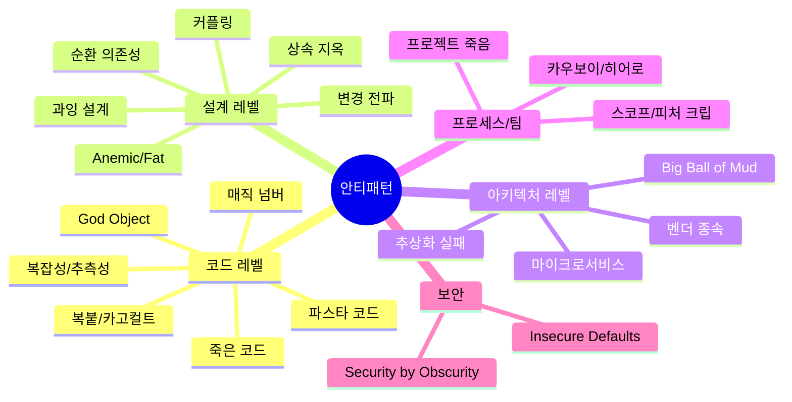

# 안티패턴 가이드: "이러면 망한다"

*코드에서 조직까지, 52가지 실패 패턴을 코드로 파헤치기*

---

개발을 좀 해본 사람이라면 알 거임. "이렇게 하면 좋다"는 말보다 "이러면 망한다"는 말이 훨씬 피부에 와닿는다는 걸. 디자인 패턴 책을 달달 외워봤자, 실제로 코드를 짜다 보면 "아 이거 뭔가 잘못된 것 같은데..." 하는 순간이 온다. 그 순간이 바로 안티패턴을 만나는 순간이다. 근데 문제는 그걸 깨달았을 때는 이미 코드가 3000줄짜리 괴물이 된 다음이라는 거.

시니어 개발자들 붙잡고 "그때 왜 그렇게 짰어요?"라고 물어보면 대부분 쓴웃음을 짓는다. 다 겪어봤기 때문임. God Object 하나로 서비스 전체를 돌리다가 새벽 3시에 핫픽스 배포하고, 스파게티 코드 리팩토링한다고 2주 스프린트를 날려먹고, "이 코드 누가 짰어?"라고 git blame 찍어보면 6개월 전의 자기 자신이 나오는 경험. 안티패턴은 그런 전장의 흉터 같은 거다. 남의 흉터를 보고 배우면 내 피는 안 흘려도 된다.

이 시리즈에서는 코드 레벨부터 조직 레벨까지 총 52가지 안티패턴을 실제 TypeScript 코드와 함께 파헤친다. "이론적으로 이러면 안 됩니다~"가 아니라 "실제로 이렇게 짜면 이렇게 망합니다"를 보여줄 거임. 각 편마다 나쁜 코드와 개선된 코드를 나란히 놓을 테니, 지금 당장 내 코드에서 비슷한 패턴이 있는지 찾아보면 된다. 찾으면? 축하한다. 리팩토링할 거리가 생긴 거다.

## 안티패턴 전체 지도

---

## 목차

### Part 1: 코드 레벨 안티패턴

*키보드에 손 대는 순간 시작되는 재앙*

1. [God Object](/docs/articles/anti-patterns/1.god-object) — 모든 걸 아는 신 클래스
2. [파스타 코드 3형제](/docs/articles/anti-patterns/2.pasta-code) — 스파게티, 라자냐, 라비올리
3. [죽은 코드 3종](/docs/articles/anti-patterns/3.zombie-code) — Lava Flow, Dead Code, Boat Anchor
4. [매직 넘버와 하드코딩](/docs/articles/anti-patterns/4.magic-and-hardcoding) — Magic Numbers/Strings + Hard Coding
5. [복붙과 카고 컬트](/docs/articles/anti-patterns/5.copy-paste-and-cargo-cult) — Copy-Paste + Cargo Cult Programming
6. [복잡성과 추측성](/docs/articles/anti-patterns/6.complexity-and-speculation) — Accidental Complexity + Arrow Anti-Pattern + Speculative Generality

### Part 2: 설계 레벨 안티패턴

*클래스 설계에서 시작되는 구조적 실패*

7. [Anemic과 Fat](/docs/articles/anti-patterns/7.anemic-and-fat) — 비즈니스 로직 배치의 양극단
8. [변경 전파 쌍](/docs/articles/anti-patterns/8.change-propagation) — Shotgun Surgery + Divergent Change
9. [커플링 냄새](/docs/articles/anti-patterns/9.coupling-smells) — Feature Envy + Inappropriate Intimacy + Middle Man
10. [상속 지옥](/docs/articles/anti-patterns/10.inheritance-hell) — Refused Bequest + Parallel Inheritance + Yo-yo Problem
11. [순환 의존성](/docs/articles/anti-patterns/11.circular-dependency) — Circular Dependency
12. [과잉 설계](/docs/articles/anti-patterns/12.over-engineering) — Swiss Army Knife + Poltergeist + Golden Hammer + Premature Optimization + Premature Abstraction

### Part 3: 아키텍처 레벨 안티패턴

*시스템 전체를 망가뜨리는 구조적 문제*

13. [Big Ball of Mud](/docs/articles/anti-patterns/13.big-ball-of-mud) — Big Ball of Mud + Stovepipe System
14. [벤더 종속과 은탄환](/docs/articles/anti-patterns/14.vendor-and-silver-bullet) — Vendor Lock-in + Silver Bullet + Architecture Astronaut
15. [마이크로서비스 안티패턴](/docs/articles/anti-patterns/15.microservice-antipatterns) — Distributed Monolith + Nanoservices + Chatty I/O
16. [추상화 실패](/docs/articles/anti-patterns/16.abstraction-failures) — Leaky Abstraction + Abstraction Inversion + Object Cesspool

### Part 4: 프로세스 / 팀 레벨 안티패턴

*코드 밖에서 프로젝트를 죽이는 패턴*

17. [프로젝트의 죽음](/docs/articles/anti-patterns/17.project-death) — Death March + Analysis Paralysis + Design by Committee
18. [스코프와 피처 크립](/docs/articles/anti-patterns/18.scope-and-feature-creep) — Scope Creep + Feature Creep + Continuous Obsolescence
19. [카우보이와 히어로](/docs/articles/anti-patterns/19.cowboy-and-hero) — Cowboy Coding + Hero Programming + Smoke and Mirrors

### Part 5: 보안 특화 안티패턴

*"나만 알면 안전하다"는 착각*

20. [보안 안티패턴](/docs/articles/anti-patterns/20.security-antipatterns) — Security through Obscurity + Insecure Defaults

---

*"바보는 경험에서 배우고, 현명한 사람은 남의 경험에서 배운다." — 오토 폰 비스마르크. 이 시리즈가 당신의 남의 경험이 되길.*
