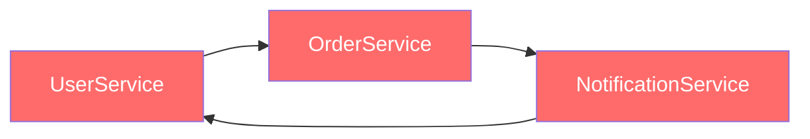

# 순환 의존성: 뫼비우스의 코드

*A가 B를 부르고, B가 C를 부르고, C가 다시 A를 부르면?*

---

순환 의존성. 이름부터 직관적이다. 모듈 A가 모듈 B에 의존하고, B가 C에 의존하고, C가 다시 A에 의존하는 구조. 의존 관계가 원(circle)을 형성하는 거다. "뫼비우스의 띠"처럼 시작과 끝이 없는 코드.

프로그래밍을 좀 해본 사람이라면 한 번쯤은 경험해봤을 거다. "이상하게 import만 추가하면 undefined가 뜨는데요?" — 그게 순환 의존성이었을 확률이 높다. 가장 기본적이면서도 가장 해결하기 까다로운 설계 문제 중 하나임.

<Callout type="warning" title="한줄요약">
순환 의존성은 모듈의 독립성을 파괴하고, 변경 영향도를 예측 불가능하게 만든다.
</Callout>

---

## 이게 뭔데

의존성 그래프에서 순환(cycle)이 존재하는 상태를 말한다. 보통은 두세 개 모듈이 서로를 참조하면서 발생하는데, 모듈이 많아지면 순환 고리가 5개, 10개로 커지는 경우도 있다. 이걸 시각화하면 이렇게 됨:



빨간색은 의도한 거다. 세 모듈이 순환 고리를 형성하고 있고, 이 세 모듈은 사실상 **하나의 거대한 모듈**과 다름없다. 하나를 건드리면 나머지 둘도 영향을 받으니까.

문제의 핵심은 이거임: **순환 의존성이 존재하면 모듈을 독립적으로 이해하고, 테스트하고, 재사용하는 것이 불가능하다.**

---

## 이런 코드 본 적 있을 거임

실제로 있을 법한 시나리오를 보자. 유저 서비스, 주문 서비스, 알림 서비스가 서로를 필요로 하는 상황:

```typescript
// user.service.ts
import { OrderService } from "./order.service";

export class UserService {
  private orderService = new OrderService();

  async getUser(id: string): Promise<User> {
    // DB에서 유저 조회
    return { id, name: "김철수", email: "chulsoo@test.com" };
  }

  async getUserPreferences(id: string): Promise<UserPreferences> {
    return { pushEnabled: true, emailEnabled: true, smsEnabled: false };
  }

  async deleteUser(id: string): Promise<void> {
    // 유저 삭제 전에 모든 주문을 취소해야 함
    await this.orderService.cancelAllOrders(id); // → OrderService에 의존!
    // 유저 삭제 로직...
  }
}
```

```typescript
// order.service.ts
import { NotificationService } from "./notification.service";

export class OrderService {
  private notificationService = new NotificationService();

  async createOrder(userId: string, items: Item[]): Promise<Order> {
    const order = { id: crypto.randomUUID(), userId, items, status: "created" };
    // 주문 생성 후 알림 발송
    await this.notificationService.sendOrderNotification(userId, order); // → NotificationService에 의존!
    return order;
  }

  async cancelAllOrders(userId: string): Promise<void> {
    // 해당 유저의 모든 주문 취소
    const orders = await this.getOrdersByUser(userId);
    for (const order of orders) {
      order.status = "cancelled";
      await this.notificationService.sendOrderNotification(userId, order);
    }
  }

  async getOrdersByUser(userId: string): Promise<Order[]> {
    return []; // DB 조회...
  }
}
```

```typescript
// notification.service.ts
import { UserService } from "./user.service"; // 여기서 순환 완성!

export class NotificationService {
  private userService = new UserService();

  async sendOrderNotification(userId: string, order: Order): Promise<void> {
    // 알림을 보내려면 유저의 알림 설정을 확인해야 함
    const prefs = await this.userService.getUserPreferences(userId); // → UserService에 의존!

    if (prefs.pushEnabled) {
      await this.sendPush(userId, `주문 ${order.id} 상태: ${order.status}`);
    }
    if (prefs.emailEnabled) {
      const user = await this.userService.getUser(userId); // → 또 UserService!
      await this.sendEmail(user.email, `주문 상태 변경: ${order.status}`);
    }
  }

  private async sendPush(userId: string, message: string): Promise<void> {
    // FCM 발송...
  }

  private async sendEmail(to: string, message: string): Promise<void> {
    // 이메일 발송...
  }
}
```

각각의 의존이 나름 합리적이긴 하다. `UserService`는 유저 삭제 시 주문을 취소해야 하니 `OrderService`가 필요하고, `OrderService`는 주문 상태 변경 시 알림을 보내야 하니 `NotificationService`가 필요하고, `NotificationService`는 알림 설정을 확인해야 하니 `UserService`가 필요하다. 각각은 합리적인데, 전체를 보면 순환이 완성된다.

<Callout type="error" title="뭐가 문제냐면">
- **빌드 순서 결정 불가**: 뭘 먼저 컴파일해야 하는지 정할 수 없다 (A가 B를 필요로 하고, B가 C를 필요로 하고, C가 A를 필요로 하니까)
- **번들러/런타임 에러**: ES Module에서는 순환 import 시 `undefined`가 나오거나 `ReferenceError`가 발생한다
- **독립 테스트 불가능**: `UserService`만 테스트하고 싶어도 `OrderService`와 `NotificationService`를 전부 로드해야 한다
- **변경 전파**: 하나의 모듈을 수정하면 순환 고리를 따라 영향이 전파된다 — 어디까지 영향이 미치는지 예측 불가
- **무한 인스턴스화**: 위 코드에서 `new UserService()` → `new OrderService()` → `new NotificationService()` → `new UserService()` → 스택 오버플로!
</Callout>

---

## 이렇게 고치면 됨

순환 의존성을 해결하는 방법은 여러 가지가 있다. 상황에 따라 적절한 걸 골라야 함.

### 방법 1: 의존성 역전 (Dependency Inversion)

의존 방향을 뒤집는다. 구체적인 구현이 아닌 **인터페이스에 의존**하도록 만들어서, 순환을 끊는 것이 핵심:

```typescript
// notification.interface.ts — 인터페이스는 누구에게도 의존하지 않음
export interface INotificationService {
  sendOrderNotification(userId: string, order: Order): Promise<void>;
}

// user-preferences.interface.ts
export interface IUserPreferencesProvider {
  getUserPreferences(id: string): Promise<UserPreferences>;
  getUser(id: string): Promise<User>;
}

// notification.service.ts — UserService 직접 의존 제거!
export class NotificationService implements INotificationService {
  constructor(private userPrefsProvider: IUserPreferencesProvider) {} // 인터페이스에만 의존

  async sendOrderNotification(userId: string, order: Order): Promise<void> {
    const prefs = await this.userPrefsProvider.getUserPreferences(userId);
    if (prefs.pushEnabled) {
      await this.sendPush(userId, `주문 ${order.id} 상태: ${order.status}`);
    }
    if (prefs.emailEnabled) {
      const user = await this.userPrefsProvider.getUser(userId);
      await this.sendEmail(user.email, `주문 상태 변경: ${order.status}`);
    }
  }

  private async sendPush(userId: string, message: string): Promise<void> { /* ... */ }
  private async sendEmail(to: string, message: string): Promise<void> { /* ... */ }
}

// user.service.ts — IUserPreferencesProvider를 구현
export class UserService implements IUserPreferencesProvider {
  constructor(private orderService: OrderService) {}

  async getUser(id: string): Promise<User> { /* ... */ }
  async getUserPreferences(id: string): Promise<UserPreferences> { /* ... */ }
  async deleteUser(id: string): Promise<void> {
    await this.orderService.cancelAllOrders(id);
  }
}

// 조립은 한 곳에서
const userService = new UserService(orderService);
const notificationService = new NotificationService(userService); // 인터페이스로 주입
const orderService = new OrderService(notificationService);
```

의존 방향이 이렇게 바뀐다:


`NotificationService` → `UserService`로의 직접 의존이 사라지고, 대신 `IUserPreferencesProvider` 인터페이스에 의존한다. 순환이 끊어진 거다.

### 방법 2: 이벤트 기반 (Event-Driven)

직접 호출 대신 **이벤트를 발행하고 구독하는 방식**으로 결합을 제거:

```typescript
// event-bus.ts — 단순한 이벤트 버스
type EventHandler = (data: any) => Promise<void> | void;

class EventBus {
  private handlers = new Map<string, EventHandler[]>();

  on(event: string, handler: EventHandler) {
    const existing = this.handlers.get(event) ?? [];
    this.handlers.set(event, [...existing, handler]);
  }

  async emit(event: string, data: any) {
    const handlers = this.handlers.get(event) ?? [];
    await Promise.all(handlers.map((h) => h(data)));
  }
}

export const eventBus = new EventBus();

// order.service.ts — NotificationService를 직접 호출하지 않음
export class OrderService {
  async createOrder(userId: string, items: Item[]): Promise<Order> {
    const order = { id: crypto.randomUUID(), userId, items, status: "created" };
    // 이벤트만 발행! 누가 듣는지는 모르고, 관심도 없음
    await eventBus.emit("order:created", { userId, order });
    return order;
  }
}

// notification.service.ts — 이벤트를 구독
export class NotificationService {
  constructor() {
    eventBus.on("order:created", (data) => this.handleOrderEvent(data));
    eventBus.on("order:cancelled", (data) => this.handleOrderEvent(data));
  }

  private async handleOrderEvent(data: { userId: string; order: Order }) {
    // 유저 정보는 별도 모듈에서 직접 조회 (순환 없음)
    await this.sendPush(data.userId, `주문 상태: ${data.order.status}`);
  }

  private async sendPush(userId: string, message: string): Promise<void> { /* ... */ }
}
```

이벤트 기반의 장점은 모듈 간 **완전한 디커플링**이라는 것. `OrderService`는 `NotificationService`의 존재 자체를 모른다. 단점은 흐름 추적이 어려워진다는 것인데, 이건 로깅으로 보완할 수 있다.

### 방법 3: 중간 모듈 추출

순환의 원인이 되는 공통 기능을 별도 모듈로 추출:

```typescript
// user-preferences.service.ts — 새로 추출된 모듈
export class UserPreferencesService {
  async getPreferences(userId: string): Promise<UserPreferences> {
    return { pushEnabled: true, emailEnabled: true, smsEnabled: false };
  }

  async getContactInfo(userId: string): Promise<{ email: string }> {
    return { email: "chulsoo@test.com" };
  }
}

// notification.service.ts — UserService 대신 UserPreferencesService에 의존
export class NotificationService {
  constructor(private prefsService: UserPreferencesService) {} // 순환 없음!

  async sendOrderNotification(userId: string, order: Order): Promise<void> {
    const prefs = await this.prefsService.getPreferences(userId);
    if (prefs.pushEnabled) {
      await this.sendPush(userId, `주문 ${order.id}: ${order.status}`);
    }
  }
  // ...
}
```

가장 단순한 해결 방법이다. `NotificationService`가 `UserService` 전체가 아니라 **실제로 필요한 것만** 별도 모듈로 분리해서 가져다 쓰면 순환이 자연스럽게 끊어진다.

---

## 실무에서는

순환 의존성은 이론적인 문제가 아니다. 실무에서 정말 자주 마주치는 문제이고, 프로젝트가 커질수록 더 자주 발생한다.

**Node.js / CommonJS의 함정**

Node.js의 `require()`는 순환 의존을 부분적으로 허용한다. A가 B를 require하고 B가 A를 require하면, B에서 보이는 A는 "그 시점까지 export된 것만" 담겨 있는 불완전한 객체다. 때문에 어떤 때는 동작하고 어떤 때는 `undefined`가 나와서 디버깅이 미치도록 어렵다.

```typescript
// CommonJS에서는 "부분적으로" 동작
const a = require("./a"); // a의 export가 아직 완성 안 된 상태일 수 있음
console.log(a.someFunction); // undefined! 😱

// ES Module에서는 더 엄격
import { someFunction } from "./a"; // TDZ(Temporal Dead Zone) 에러 가능
```

**Barrel Export (index.ts)의 함정**

TypeScript 프로젝트에서 `index.ts`를 통한 barrel export를 즐겨 쓰는 분들이 많다. 이게 순환 의존성의 온상이 됨:

```typescript
// services/index.ts (barrel export)
export { UserService } from "./user.service";
export { OrderService } from "./order.service";
export { NotificationService } from "./notification.service";

// user.service.ts
import { OrderService } from "./index"; // ← barrel을 통해 import
// 이제 user.service → index → order.service → index → notification.service → index → user.service
// 실질적으로 전체 모듈이 순환 의존!
```

**NestJS의 forwardRef()**

NestJS를 쓴다면 `forwardRef()`를 본 적 있을 거다. 이건 순환 의존성을 "해결"하는 게 아니라 **런타임에 지연 로딩으로 우회**하는 것이다. 근본적인 설계 문제는 그대로 남아 있음:

```typescript
// 이건 해결이 아니라 진통제임!
@Module({
  imports: [forwardRef(() => OrderModule)],
})
export class UserModule {}
```

<Callout type="note" title="순환 의존성 감지법">
- **CLI 도구**: `npx madge --circular src/` 명령어 한 방이면 프로젝트 내 모든 순환 의존성을 찾아준다
- **ESLint 규칙**: `eslint-plugin-import`의 `import/no-cycle` 규칙을 활성화하면 import 시점에 순환을 잡아줌
- **번들러 경고**: webpack이나 Vite에서 순환 의존 경고가 나오면 무시하지 말자. 지금은 돌아가도 언젠가 터진다
- **습관**: 새 모듈을 import할 때 "이거 순환 안 되나?" 한 번만 생각하면 80%는 예방 가능
- **시각화**: `npx madge --image graph.svg src/`로 의존성 그래프를 시각화해서 팀 전체가 볼 수 있게 공유
</Callout>

<Callout type="info" title="순환 의존성은 왜 생기는 걸까?">
대부분은 **모듈 경계를 잘못 그어서** 발생한다. "유저와 관련된 건 UserService에 넣자"라는 식으로 도메인 단위로만 모듈을 나누면, 도메인 간의 상호작용이 곧 순환 의존이 된다. 해결의 핵심은 **기능 단위가 아니라 의존 방향 단위로** 모듈을 설계하는 것. "이 모듈이 무엇을 알아야 하는가?"보다 "이 모듈이 무엇을 몰라야 하는가?"를 먼저 생각하면 순환을 피할 수 있다.
</Callout>

## 정리

순환 의존성은 "돌아가니까 괜찮지"로 넘기기 쉬운 문제다. 특히 Node.js의 CommonJS 모듈은 순환을 어느 정도 허용하니까 문제를 인식조차 못하는 경우가 많다. 하지만 이건 시한폭탄이다. 프로젝트가 커지면 어느 날 갑자기 터지고, 그때 고치려면 비용이 수십 배로 불어나 있다.

의존성 역전, 이벤트 기반, 중간 모듈 추출 — 상황에 맞는 방법을 선택하면 된다. 가장 중요한 건 **순환이 생겼다는 사실을 인지하는 것** 자체다. `madge`든 ESLint든, 도구를 세팅해두고 CI에서 자동으로 잡아주게 하자.

다음 글에서는 정반대의 문제를 다룬다. 순환 의존성이 "설계가 부족해서" 생기는 문제라면, 과잉 설계는 "설계를 너무 많이 해서" 생기는 문제다. 스위스 아미 나이프, 폴터가이스트, 황금 망치, 성급한 최적화, 성급한 추상화 — 과잉 설계 5종 세트를 만나보자.

---

_← [이전 글: 상속 지옥](/docs/articles/anti-patterns/10.inheritance-hell) | [다음 글: 과잉 설계](/docs/articles/anti-patterns/12.over-engineering) →_