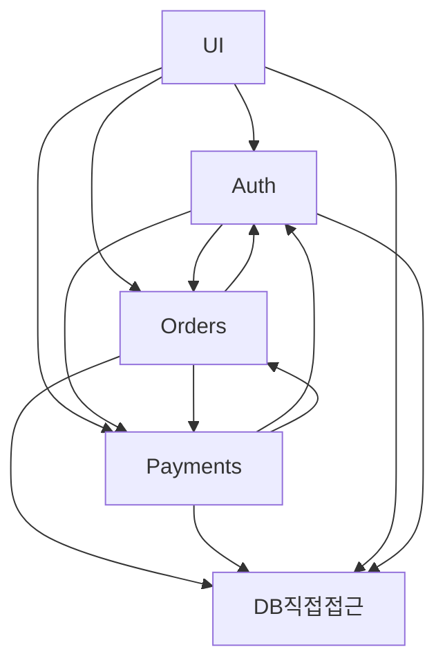
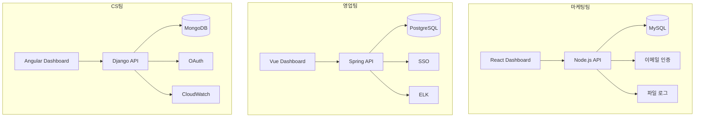

# Big Ball of Mud: 진흙 공과 굴뚝

*아키텍처? 그게 먹는 건가?*

---

이번 글에서 다루는 두 가지 안티패턴은 가장 "거시적인" 아키텍처 안티패턴이다. Big Ball of Mud는 아키텍처가 아예 없는 상태, Stovepipe System은 시스템들이 각자 제멋대로 진화한 상태. 둘 다 개별 코드의 문제가 아니라 **시스템 전체**의 문제라는 공통점이 있다.

코드 레벨의 안티패턴은 파일 하나, 클래스 하나를 고치면 해결되기도 한다. 하지만 아키텍처 레벨의 안티패턴은? 그냥 "리팩토링합시다"로 안 됨. 수개월에서 수년이 걸리는 대규모 작업이 필요하다. 그래서 더 무섭고, 그래서 더 알아둬야 한다.

---

## 1. Big Ball of Mud (진흙 공)

### 이게 뭔데

<Callout type="warning" title="정의">
일관된 아키텍처 없이 임시방편으로 성장하여, 전체 구조를 파악할 수 없는 소프트웨어 시스템. 1997년 Brian Foote와 Joseph Yoder가 논문에서 공식적으로 명명했다.
</Callout>

"우리 시스템에 아키텍처가 있긴 한 건가?"

이 질문을 해본 적 있다면, 당신의 시스템은 아마 진흙 공이다. Big Ball of Mud는 가장 흔한 소프트웨어 아키텍처... 아니, "아키텍처의 부재"다. Foote와 Yoder는 이걸 이렇게 정의했다:

> "A Big Ball of Mud is a haphazardly structured, sprawling, sloppy, duct-tape-and-baling-wire, spaghetti-code jungle."

직역하면 "되는대로 구조화된, 무분별하게 확장된, 엉성한, 덕테이프와 철사로 고정한, 스파게티 코드 정글"이다. 시적이다.

진흙 공의 핵심 특징은 **모든 것이 모든 것에 의존한다**는 거다. 모듈 간 경계가 없고, 어디서든 어디로든 호출이 가능하다. 의존성 그래프를 그려보면 이렇게 된다:



보이는가? 모든 게 모든 것에 연결되어 있다. UI가 DB를 직접 접근하고, 인증 모듈이 주문을 알고, 결제가 인증을 호출한다. 화살표가 사방으로 뻗어있다. 이게 진흙 공이다.

재밌는 건, Foote와 Yoder의 논문 제목이 "Big Ball of Mud"인데 부제가 없다. 그냥 그 자체로 설명이 끝나기 때문이다. 그리고 이 논문에서 가장 충격적인 주장은 이거다: **대부분의 소프트웨어 시스템이 결국 진흙 공이 된다.** 예외가 아니라 규칙이라는 거다.

### 어떻게 이 지경이 되나

사실 진흙 공은 계획해서 만드는 게 아니다. 아무도 "오늘부터 진흙 공을 만들자!"라고 선언하지 않는다. 그냥 자연스럽게 된다. 중력처럼.

**단계 1: 타당한 시작**

스타트업이나 새 프로젝트에서 "일단 빠르게 만들자"는 완전히 합리적인 결정이다. MVP를 만들어서 시장 반응을 봐야 하니까. 아키텍처에 3개월 투자하고 나서 "아 이거 시장이 안 되네"라고 하면 그게 더 바보짓이다.

**단계 2: "나중에 고치자"의 반복**

MVP가 성공하면 기능을 추가해야 한다. 근데 아키텍처를 정비할 시간은 없다. 고객이 기다리고 있으니까. "이거 일단 여기에 넣고, 나중에 리팩토링하자." 이 말이 100번 반복된다.

**단계 3: 사람이 바뀐다**

초기 개발자가 떠나고 새 개발자가 온다. 새 개발자는 기존 코드의 의도를 모른다. 문서도 없다. 그래서 가장 안전한 방법을 택한다 — 기존 코드를 건드리지 않고 새 코드를 옆에 추가하는 거다. 이러면 중복은 늘고 일관성은 사라진다.

**단계 4: 두려움**

```typescript
// 이 함수를 건드리면 안 됩니다.
// 왜 동작하는지 아무도 모릅니다.
// — 2019년 퇴사한 김모씨의 마지막 커밋
function processLegacyOrder(data: any): any {
  // 372줄의 알 수 없는 코드...
  // if문 15단계 중첩
  // try-catch가 try-catch 안에 있고
  // 그 안에 또 try-catch가 있음
  // 어딘가에서 전역 변수를 수정함
  // 테스트? 없음
  return result; // result가 어디서 정의됐는지는 비밀
}
```

이 단계가 되면 리팩토링은 "기술적 부채 상환"이 아니라 "생존을 건 도박"이 된다. 아무도 건드리고 싶어하지 않는다. 그래서 옆에 또 새 코드를 추가한다. 진흙 공은 더 커진다.

### 진짜 문제

진흙 공이 무서운 건 **작동한다**는 거다. 맞다, 작동한다. 고객 요청도 처리하고, 결제도 되고, 데이터도 저장된다. 그래서 경영진은 "잘 되고 있는데 왜 시간 달라는 거야?"라고 한다.

문제는 이런 것들이다:
- 새 기능 추가에 걸리는 시간이 점점 늘어남 (1주 → 1달 → 3달)
- 버그 하나 고치면 다른 곳에서 3개가 터짐
- 신입 개발자가 생산성을 내기까지 6개월 이상 걸림
- 성능 최적화가 불가능 (어디가 병목인지 파악 불가)
- 테스트 작성 불가 (의존성을 끊을 수 없음)

### 탈출법

<Callout type="success" title="진흙 공에서 탈출하기">
- **Strangler Fig 패턴:** 기존 시스템을 감싸면서 점진적으로 교체. 무화과나무가 숙주 나무를 서서히 감싸듯이, 새 시스템이 구 시스템을 점진적으로 대체
- **Bounded Context 도입:** 도메인별로 경계를 나누기. "이 모듈은 주문만 담당한다. 결제 로직은 여기 없다"
- **의존성 방향 규칙 수립:** "이 레이어는 저 레이어를 호출하면 안 됨." 컴파일 타임에 강제하면 더 좋음
- **실용적 접근:** 완벽한 리팩토링보다 부분적 개선. "가장 자주 변경되는 부분"부터 분리
</Callout>

한 가지 중요한 점: 진흙 공을 한 번에 깨끗하게 다시 쓰겠다는 유혹에 빠지면 안 된다. Joel Spolsky의 유명한 글 "Things You Should Never Do"에서 경고하듯, 대규모 재작성(Big Rewrite)은 거의 항상 실패한다. 기존 코드에는 수년간 축적된 비즈니스 규칙과 버그 수정이 들어있다. 이걸 처음부터 다시 쓰면 그 지식이 전부 사라진다.

점진적으로 가야 한다. 느리지만 이게 유일하게 작동하는 방법이다.

---

## 2. Stovepipe System (굴뚝 시스템)

### 이게 뭔데

<Callout type="warning" title="정의">
조직 내 시스템들이 사일로(silo)처럼 분리되어, 공통 인프라나 컴포넌트 재사용 없이 독립적으로 중복 구축된 상태. 각 시스템이 굴뚝(stovepipe)처럼 수직으로만 연결되고 수평적 통합이 없다.
</Callout>

Stovepipe는 원래 난로의 굴뚝을 뜻한다. 굴뚝은 아래에서 위로만 연결되고, 옆 굴뚝과는 연결되지 않는다. Stovepipe System도 마찬가지다 — 각 시스템이 자기만의 수직 스택을 가지고 있고, 옆 시스템과는 아무 연결이 없다.

진흙 공이 "구조가 없는" 문제였다면, 굴뚝 시스템은 "구조가 있는데 서로 단절된" 문제다. 각각의 시스템은 나름 잘 만들어져 있을 수도 있다. 문제는 전체적인 통합이 없다는 거다.

### 이런 상황

어느 중견 기업의 상황을 보자. 마케팅팀, 영업팀, CS팀이 각각 시스템을 만들었다.

**마케팅팀 시스템:**
- 자체 고객 DB (MySQL)
- 자체 인증 시스템 (이메일 + 비밀번호)
- 자체 로깅 (파일 기반)
- 자체 대시보드 (React)

**영업팀 시스템:**
- 자체 고객 DB (PostgreSQL)
- 자체 인증 시스템 (SSO 연동)
- 자체 로깅 (ELK 스택)
- 자체 대시보드 (Vue)

**CS팀 시스템:**
- 자체 고객 DB (MongoDB)
- 자체 인증 시스템 (OAuth)
- 자체 로깅 (CloudWatch)
- 자체 대시보드 (Angular)

같은 회사인데 고객 정보가 3곳에 분산되어 있다. 고객이 전화번호를 변경하면? 영업팀 시스템에서는 바뀌는데 CS팀에서는 안 바뀐다. 마케팅팀은 아직 옛날 번호로 문자를 보내고 있다. 데이터 불일치. 진짜 자주 일어나는 일이다.



세 개의 굴뚝이 나란히 서 있다. 각각은 잘 작동한다. 하지만 서로 대화하지 않는다.

### 왜 이렇게 되나

원인은 대부분 **조직 구조**다. Conway의 법칙이 정확히 작동하는 거다 — "시스템의 구조는 조직의 커뮤니케이션 구조를 따른다." 팀이 분리되어 있으니 시스템도 분리된다.

각 팀의 입장에서는 합리적인 선택이었을 수 있다:
- "우리 팀이 쓸 건 우리가 잘 아는 기술로 만들자"
- "다른 팀 시스템에 의존하면 우리 일정이 밀린다"
- "공통 인프라 만들자고 하면 회의만 3개월이다"

다 맞는 말이다. 단기적으로는. 하지만 장기적으로는 유지보수 비용이 3배, 인프라 비용이 3배, 데이터 불일치 문제가 끊임없이 발생한다.

### 해결법

<Callout type="success" title="굴뚝 허물기">
- **공통 인프라 도입:** 인증은 Identity Provider 하나로, 로깅은 중앙 집중식으로, 모니터링은 공유 플랫폼으로
- **API Gateway:** 각 시스템 간 통신의 단일 진입점. 서비스 디스커버리와 라우팅 일원화
- **공유 데이터 플랫폼:** 고객 데이터는 하나의 source of truth에서 관리. 각 시스템은 필요한 데이터를 구독
- **플랫폼 팀:** 공통 인프라를 전담하는 팀을 구성. 각 제품 팀은 비즈니스 로직에 집중
</Callout>

주의할 점: 굴뚝을 허문다고 진흙 공으로 합치면 안 된다. 적절한 공통 인프라를 두되, 각 시스템의 도메인 독립성은 유지해야 한다. 이게 말은 쉬운데 실행은 어렵다.

---

## 진흙 공 vs 굴뚝: 뭐가 더 나쁜데

둘 다 나쁘지만, 성격이 다르다.

| | Big Ball of Mud | Stovepipe System |
|---|---|---|
| **핵심 문제** | 결합도 과잉 | 통합 부재 |
| **구조** | 구조 없음 | 구조는 있지만 고립 |
| **의존성** | 모든 것이 연결 | 아무것도 연결 안 됨 |
| **데이터** | 뒤엉킴 | 중복/불일치 |
| **수정 비용** | 하나 고치면 전체 영향 | 같은 수정을 N번 반복 |
| **원인** | 기술적 부채 축적 | 조직 구조의 반영 |

아이러니한 건, 굴뚝 시스템의 각 굴뚝이 내부적으로 진흙 공일 수도 있다는 거다. 최악의 조합. 이런 경우도 실제로 꽤 많다.

<Callout type="info" title="Conway의 법칙">
"시스템을 설계하는 조직은 그 조직의 커뮤니케이션 구조를 본뜬 설계를 만들어낸다." 굴뚝 시스템은 Conway의 법칙이 작동한 결과물이다. 따라서 시스템을 고치려면 먼저 조직을 고쳐야 할 수도 있다. 이게 바로 "역 Conway 전략(Inverse Conway Maneuver)"이다 — 원하는 시스템 구조에 맞게 조직을 재편하는 것.
</Callout>

두 안티패턴 모두 "어느 날 갑자기 발생하는" 것이 아니라 "서서히 되어가는" 것이다. 물이 끓는 줄 모르는 개구리처럼. 그래서 정기적으로 시스템 구조를 점검하고, "지금 우리 아키텍처는 괜찮은가?"를 물어야 한다. 질문을 안 하면, 답은 항상 "진흙 공"이다.

---

_← [이전 글: 과잉 설계](/docs/articles/anti-patterns/12.over-engineering) | [다음 글: 벤더 종속과 은탄환](/docs/articles/anti-patterns/14.vendor-and-silver-bullet) →_
