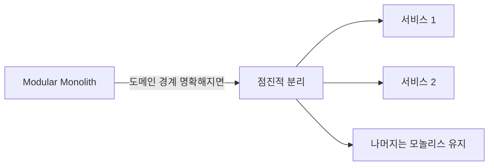

# 마이크로서비스 안티패턴: 분산의 그림자

*마이크로서비스가 답이라고 했는데, 문제가 더 늘었어*

---

마이크로서비스는 올바르게 적용하면 강력한 아키텍처다. 독립 배포, 기술 스택 자유, 팀 자율성. 근데 "올바르게 적용하면"이라는 전제가 붙는 순간 현실은 달라진다. 마이크로서비스를 잘못 적용하면 모놀리스보다 **훨씬 더 심각한** 문제가 생긴다. 모놀리스의 단점에 분산 시스템의 단점까지 더해지니까.

이번 글에서 다루는 세 가지 — Distributed Monolith(분산 모놀리스), Nanoservices(나노서비스), Chatty I/O(수다스러운 I/O) — 는 마이크로서비스 전환에서 가장 흔한 실패 패턴이다. 셋 다 겪어본 사람으로서 말하는데, 진짜 괴롭다.

---

## 1. Distributed Monolith (분산 모놀리스)

### 이게 뭔데

<Callout type="warning" title="정의">
마이크로서비스로 물리적으로 분리했지만, 서비스 간 결합도가 높아서 독립적으로 배포·운영할 수 없는 시스템. 모놀리스의 단점(높은 결합도)과 분산 시스템의 단점(네트워크 복잡도, 분산 트랜잭션)을 **동시에** 가진다.
</Callout>

분산 모놀리스는 마이크로서비스의 가장 흔한 실패 형태다. "우리 마이크로서비스 아키텍처입니다"라고 말하지만, 실제로는 모놀리스를 네트워크로 연결한 것일 뿐. 더 나쁜 건, 모놀리스였을 때는 함수 호출이었던 게 이제 HTTP 요청이 됐다는 거다. 지연 시간 추가, 실패 지점 추가, 디버깅 난이도 증가. 이점은 없고 비용만 늘어남.

### 이런 구조

```typescript
// Order Service — 주문을 생성하려면 다른 서비스를 동기적으로 호출해야 함
class OrderService {
  async createOrder(userId: string, items: OrderItem[]): Promise<Order> {
    // 1. User Service에 동기 호출 — 실패하면 주문 불가
    const user = await fetch(`${USER_SERVICE_URL}/users/${userId}`);
    if (!user.ok) throw new Error("유저 서비스 응답 없음");

    // 2. Inventory Service에 동기 호출 — 실패하면 주문 불가
    const stock = await fetch(`${INVENTORY_SERVICE_URL}/check`, {
      method: "POST",
      body: JSON.stringify({ items }),
    });
    if (!stock.ok) throw new Error("재고 서비스 응답 없음");

    // 3. Pricing Service에 동기 호출 — 실패하면 주문 불가
    const price = await fetch(`${PRICING_SERVICE_URL}/calculate`, {
      method: "POST",
      body: JSON.stringify({ items, userId }),
    });
    if (!price.ok) throw new Error("가격 서비스 응답 없음");

    // 4. 주문 저장 — 공유 DB 사용 🚨
    const order = await sharedDb.query(
      `INSERT INTO orders (user_id, items, total) VALUES ($1, $2, $3)`,
      [userId, JSON.stringify(items), (await price.json()).total]
    );

    // 5. Payment Service에 동기 호출
    await fetch(`${PAYMENT_SERVICE_URL}/charge`, {
      method: "POST",
      body: JSON.stringify({ orderId: order.id, amount: order.total }),
    });

    return order;
  }
}
```

```yaml
# docker-compose.yml — 서비스는 5개인데 DB는 1개
services:
  order-service:
    depends_on: [user-service, inventory-service, pricing-service, payment-service, shared-db]
  user-service:
    depends_on: [shared-db]
  inventory-service:
    depends_on: [shared-db, pricing-service]  # 재고가 왜 가격에 의존?
  pricing-service:
    depends_on: [shared-db]
  payment-service:
    depends_on: [shared-db, user-service]     # 결제가 왜 유저에 의존?
  shared-db:
    image: postgres:16
```

보이는가? 5개 서비스인데 전부 `shared-db`에 의존하고, `depends_on` 체인이 복잡하게 엮여있다. Order Service를 배포하려면 나머지 4개 서비스가 전부 떠 있어야 한다. 이건 마이크로서비스가 아니라 **네트워크로 연결된 모놀리스**다.

<Callout type="error" title="분산 모놀리스 증상">
- 서비스 하나 배포하면 다른 서비스도 재배포 필요
- 하나의 서비스 장애가 전체 시스템 장애로 전파
- 서비스 간 공유 DB 테이블 존재
- 배포 순서가 중요함 ("B 먼저 올리고, 그 다음 A, 그 다음 C")
- 서비스 간 공유 DTO/라이브러리 패키지가 있고, 버전이 맞아야 동작
- 통합 테스트 없이는 아무것도 배포할 수 없음
</Callout>

### 왜 이렇게 되나

대부분의 분산 모놀리스는 "모놀리스를 서비스별로 쪼개자"에서 시작한다. 문제는 쪼개는 기준이 **코드 구조**였다는 거다. "controllers 폴더를 서비스로, models 폴더를 서비스로, utils를 공유 패키지로..." 이러면 기존의 결합도가 그대로 서비스 간 결합도가 된다. 쪼개야 할 기준은 코드 구조가 아니라 **비즈니스 도메인**이다.

### 해결법

<Callout type="success" title="분산 모놀리스 탈출">
- **서비스 간 비동기 통신 (메시지 큐):** 서비스 A가 이벤트를 발행하면, 서비스 B가 자기 페이스로 처리. A는 B의 생사를 모름
- **각 서비스가 자체 DB를 소유:** Database per Service 패턴. 서비스 간 데이터 공유는 API 또는 이벤트로
- **API 버전 관리:** 서비스 간 계약이 변경될 때 하위 호환성 유지
- **독립 배포 테스트:** "이 서비스만 배포했을 때 다른 서비스에 영향 없는가?" 이걸 CI에서 검증
</Callout>

---

## 2. Nanoservices (나노서비스)

### 이게 뭔데

<Callout type="warning" title="정의">
서비스가 지나치게 잘게 분리되어, 각 서비스의 관리·배포·통신 오버헤드가 서비스가 제공하는 이점을 초과하는 상태. 각 서비스가 함수 하나 수준의 작은 기능만 담당한다.
</Callout>

마이크로서비스의 "마이크로"를 너무 진지하게 받아들인 결과물이다. 서비스를 작게 만들라고 했더니 진짜로 함수 하나짜리 서비스를 만든 거다.

### 이런 구조

```typescript
// 회원가입 하나를 처리하기 위해 호출해야 하는 서비스들:

// 1. EmailFormatValidationService (이메일 형식 검증)
//    POST /validate-email-format
//    → { valid: true }

// 2. PasswordStrengthCheckerService (비밀번호 강도 체크)
//    POST /check-password-strength
//    → { strength: "strong" }

// 3. UsernameAvailabilityService (유저네임 중복 체크)
//    POST /check-username
//    → { available: true }

// 4. UserCreationService (유저 생성)
//    POST /create-user
//    → { userId: "123" }

// 5. WelcomeEmailService (환영 이메일 발송)
//    POST /send-welcome-email
//    → { sent: true }

// 6. DefaultSettingsInitializerService (기본 설정 초기화)
//    POST /init-default-settings
//    → { initialized: true }

// 회원가입 오케스트레이션 — 6개 서비스 호출
async function registerUser(data: RegisterData) {
  const emailValid = await fetch(`${EMAIL_VALIDATION_URL}/validate-email-format`, {
    method: "POST", body: JSON.stringify({ email: data.email })
  });

  const pwStrength = await fetch(`${PW_CHECKER_URL}/check-password-strength`, {
    method: "POST", body: JSON.stringify({ password: data.password })
  });

  const nameAvail = await fetch(`${USERNAME_URL}/check-username`, {
    method: "POST", body: JSON.stringify({ username: data.username })
  });

  // ... 나머지 3개 서비스 호출

  // 이 중 하나라도 실패하면? 롤백은? 재시도는?
  // 6개 서비스의 버전 관리는? 로그 추적은?
  // 지연 시간: 네트워크 왕복 6번 = 최소 수십 ms 추가
}
```

위의 6개 서비스는 하나의 `UserService`에 있으면 되는 기능들이다. 이걸 6개로 쪼개면:
- 배포할 컨테이너 6개
- 모니터링할 서비스 6개
- 관리할 저장소 6개
- 서비스 간 네트워크 호출 6번
- 장애 지점 6곳

함수 호출 하나면 될 걸 네트워크 왕복 6번으로 바꾼 셈이다. 오버헤드만 늘고 이점은 없다.

### 나노서비스인지 아닌지 판단하는 기준

이 질문들에 "예"가 많으면 나노서비스다:

- 이 서비스를 독립적으로 배포할 이유가 있는가? → "아니오"면 나노서비스
- 이 서비스를 담당하는 별도 팀이 있는가? → "아니오"면 나노서비스
- 이 서비스의 확장성 요구가 다른 서비스와 다른가? → "아니오"면 나노서비스
- 이 서비스를 다른 기술 스택으로 만들 이유가 있는가? → "아니오"면 나노서비스

### 해결법

<Callout type="success" title="적절한 크기 찾기">
- **Bounded Context 기준으로 병합:** 비즈니스 도메인 경계에 맞게 서비스 크기 조정
- **팀 단위로 서비스 소유:** 한 팀이 하나의 서비스(또는 소수의 관련 서비스)를 소유
- **Two Pizza Rule:** 서비스는 피자 두 판으로 먹여살릴 수 있는 팀(5-8명)이 관리할 수 있는 크기
- **단일 목적 원칙:** 서비스 하나가 하나의 비즈니스 능력(capability)을 담당. "하나의 함수"가 아니라 "하나의 비즈니스 능력"
</Callout>

위의 6개 나노서비스를 합치면:

```typescript
// 하나의 UserService로 병합 — 이게 적절한 크기
class UserService {
  async register(data: RegisterData): Promise<User> {
    // 검증 (네트워크 호출 없이 함수 호출)
    this.validateEmail(data.email);
    this.checkPasswordStrength(data.password);
    await this.ensureUsernameAvailable(data.username);

    // 생성
    const user = await this.userRepository.create(data);

    // 후처리 (비동기 이벤트로)
    await this.eventBus.publish("user.registered", { userId: user.id });
    // → 이메일 발송, 기본 설정 초기화는 이벤트 구독자가 처리

    return user;
  }

  private validateEmail(email: string): void { /* ... */ }
  private checkPasswordStrength(pw: string): void { /* ... */ }
  private async ensureUsernameAvailable(name: string): Promise<void> { /* ... */ }
}
```

네트워크 호출 6번이 함수 호출 3번 + 이벤트 발행 1번으로 줄었다. 코드도 읽기 쉽고, 디버깅도 쉽고, 배포도 하나만 하면 된다.

---

## 3. Chatty I/O (수다스러운 I/O)

### 이게 뭔데

<Callout type="warning" title="정의">
단일 작업을 처리하기 위해 과도하게 많은 I/O 호출(DB 쿼리, API 요청, 파일 읽기 등)을 수행하는 패턴. 대표적으로 N+1 쿼리 문제가 있다.
</Callout>

I/O 작업은 비싸다. 메모리 접근이 나노초 단위라면, 네트워크 요청은 밀리초 단위다. 천 배에서 만 배 차이. 그래서 I/O 횟수를 최소화하는 게 성능 최적화의 기본인데, Chatty I/O는 이걸 정면으로 위반한다.

가장 흔한 형태가 **N+1 쿼리**다. 목록을 조회하는 1번의 쿼리, 그 다음 각 항목의 상세 정보를 가져오는 N번의 쿼리. 합하면 N+1번.

### 이런 코드

```typescript
// N+1 쿼리의 교과서적 예시
async function getOrdersWithUsers(): Promise<OrderWithUser[]> {
  // 1번 쿼리: 주문 목록 조회
  const orders = await db.query<Order>("SELECT * FROM orders LIMIT 100");

  // N번 쿼리: 각 주문의 유저 정보를 개별 조회 🚨
  const result: OrderWithUser[] = [];
  for (const order of orders) {
    // 이 쿼리가 100번 실행됨!
    const user = await db.query<User>(
      "SELECT * FROM users WHERE id = $1",
      [order.userId]
    );
    result.push({ ...order, user: user[0] });
  }

  return result;
  // 총 쿼리 수: 1 + 100 = 101번
  // 주문이 1000개면? 1001번.
}
```

100개의 주문을 가져오는데 DB 쿼리가 101번 실행된다. 주문이 1000개면 1001번. 각 쿼리가 2ms라고 해도 1000번이면 2초다. 하나의 API 응답에 2초. 사용자는 이미 떠났다.

더 심각한 건 마이크로서비스 환경에서의 Chatty I/O다:

```typescript
// 마이크로서비스 간 N+1 — 더 심각함
async function getOrderDetails(orderId: string) {
  const order = await fetch(`${ORDER_SERVICE}/orders/${orderId}`);         // ~50ms
  const user = await fetch(`${USER_SERVICE}/users/${order.userId}`);       // ~50ms
  const items = await fetch(`${INVENTORY_SERVICE}/items?ids=${order.itemIds}`); // ~50ms
  const payment = await fetch(`${PAYMENT_SERVICE}/payments/${order.paymentId}`); // ~50ms
  const shipping = await fetch(`${SHIPPING_SERVICE}/tracking/${order.trackingId}`); // ~50ms

  // 총 지연: ~250ms (순차 호출)
  // 이걸 목록 페이지에서 20개 주문에 대해 하면? ~5000ms
}
```

DB 쿼리는 그래도 밀리초 수준인데, 서비스 간 HTTP 호출은 수십 밀리초다. N+1이 서비스 간에서 발생하면 응답 시간이 초 단위로 늘어난다.

### 고친 코드

```typescript
// 해결 1: JOIN 쿼리 (SQL 레벨)
async function getOrdersWithUsers(): Promise<OrderWithUser[]> {
  // 1번의 쿼리로 끝!
  const result = await db.query<OrderWithUser>(`
    SELECT o.*, u.name as user_name, u.email as user_email
    FROM orders o
    JOIN users u ON o.user_id = u.id
    LIMIT 100
  `);
  return result;
  // 총 쿼리 수: 1번
}

// 해결 2: Batch Loading (ORM 레벨)
async function getOrdersWithUsers(): Promise<OrderWithUser[]> {
  const orders = await db.query<Order>("SELECT * FROM orders LIMIT 100");

  // 유저 ID를 모아서 한 번에 조회 (IN 절)
  const userIds = [...new Set(orders.map(o => o.userId))];
  const users = await db.query<User>(
    "SELECT * FROM users WHERE id = ANY($1)",
    [userIds]
  );

  // 메모리에서 매핑
  const userMap = new Map(users.map(u => [u.id, u]));
  return orders.map(order => ({
    ...order,
    user: userMap.get(order.userId)!
  }));
  // 총 쿼리 수: 2번 (100이 아니라 2!)
}

// 해결 3: DataLoader 패턴 (GraphQL에서 자주 사용)
const userLoader = new DataLoader<string, User>(async (userIds) => {
  const users = await db.query<User>(
    "SELECT * FROM users WHERE id = ANY($1)",
    [userIds]
  );
  const userMap = new Map(users.map(u => [u.id, u]));
  return userIds.map(id => userMap.get(id)!);
});

// 개별 호출처럼 보이지만 자동으로 배치됨
const user1 = await userLoader.load("user-1");
const user2 = await userLoader.load("user-2");
// → 실제로는 하나의 쿼리: SELECT * FROM users WHERE id IN ('user-1', 'user-2')
```

101번의 쿼리가 2번으로, 혹은 1번으로 줄었다. 성능 차이는 극적이다.

### Chatty I/O 감지하는 법

<Callout type="note" title="수다쟁이 찾기">
- **쿼리 로깅:** ORM의 쿼리 로깅을 켜고, 하나의 API 요청에서 실행되는 쿼리 수를 세라. 10개 넘으면 의심, 50개 넘으면 확실
- **APM 도구:** New Relic, Datadog 등에서 DB 쿼리 횟수 모니터링
- **Slow Query Log:** 개별 쿼리는 빠르지만 횟수가 문제. 느린 쿼리뿐 아니라 빈번한 쿼리도 추적
- **코드 리뷰 시:** `for` 루프 안에 `await`가 있으면 일단 의심. DB 호출이나 API 호출이 루프 안에 있으면 N+1 후보
</Callout>

---

## 마이크로서비스, 언제 도입해야 하나

이 세 가지 안티패턴을 보면 "마이크로서비스 안 하는 게 낫겠다"는 생각이 들 수도 있다. 반은 맞고 반은 틀리다. 마이크로서비스가 필요한 상황은 분명히 있다.

<Callout type="info" title="마이크로서비스 적용 시점">
- 팀이 10명 이상이고 독립 배포가 필요할 때
- 확장성 요구가 서비스마다 다를 때 (검색은 트래픽 많고, 결제는 적고)
- 모놀리스가 충분히 성숙한 후 분리 (도메인 경계가 명확해진 후)
- **"먼저 모놀리스를 잘 만들고, 나중에 쪼개라" (MonolithFirst)** — Martin Fowler
</Callout>

MonolithFirst 전략이 중요하다. 처음부터 마이크로서비스로 시작하면 도메인 경계를 잘못 잡을 확률이 높다. 모놀리스로 시작해서 도메인을 충분히 이해한 다음, 실제로 분리가 필요한 부분만 분리하는 게 훨씬 안전하다.



결론: 마이크로서비스는 도구다. 도구는 문제에 맞게 써야 한다. 망치가 좋다고 나사를 망치로 박으면 안 된다. 모놀리스가 나쁜 게 아니고, 마이크로서비스가 좋은 게 아니다. 상황에 맞는 선택이 좋은 거다.

---

_← [이전 글: 벤더 종속과 은탄환](/docs/articles/anti-patterns/14.vendor-and-silver-bullet) | [다음 글: 추상화 실패](/docs/articles/anti-patterns/16.abstraction-failures) →_
