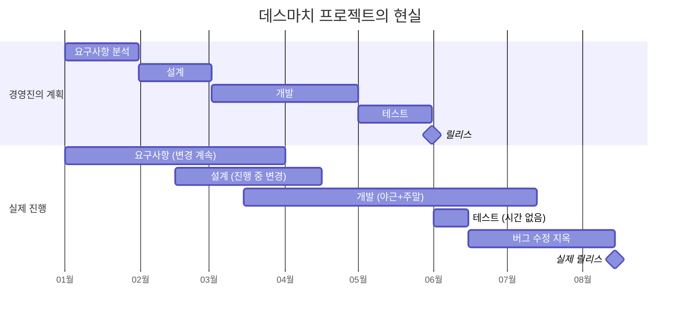
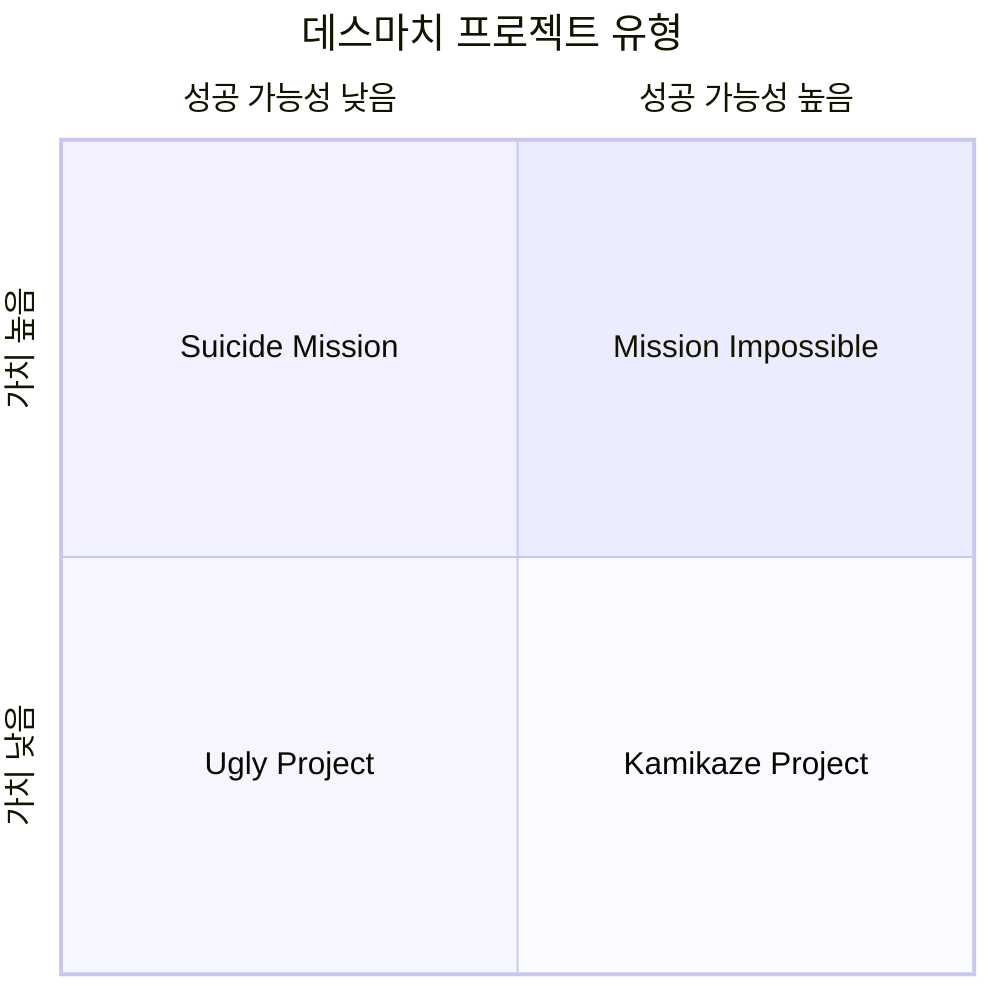
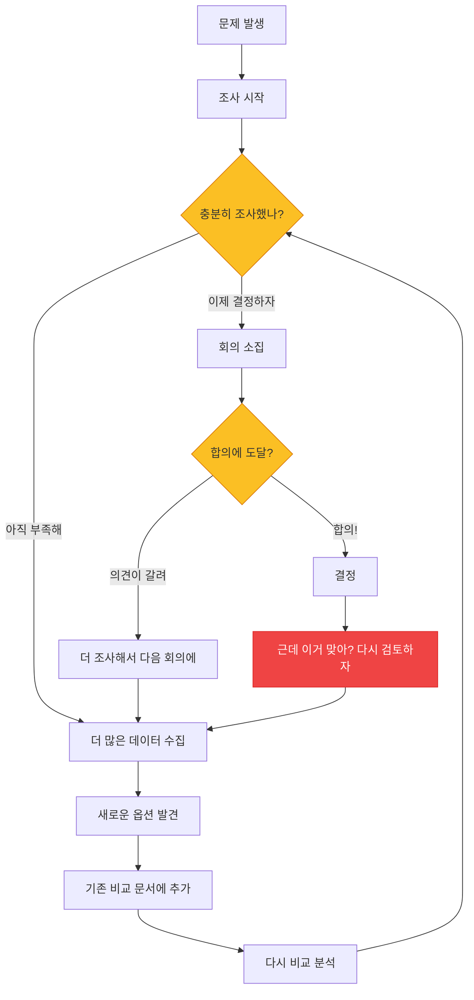
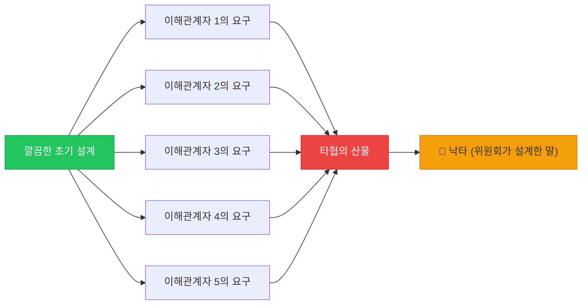
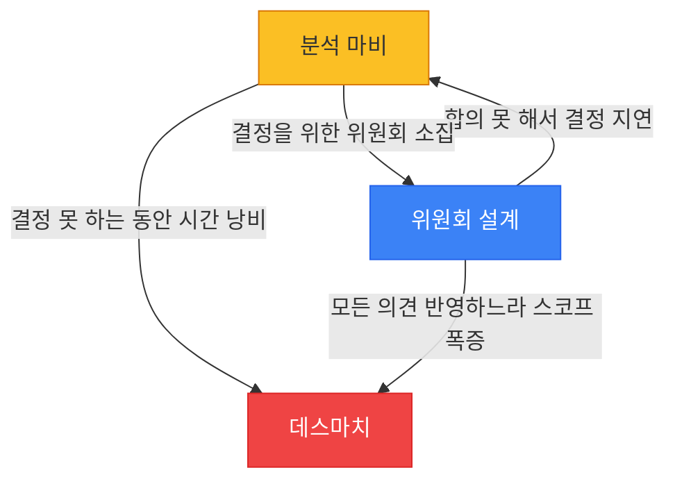

# 프로젝트의 죽음: 데스마치, 분석 마비, 위원회 설계

*코드가 아니라 프로세스가 프로젝트를 죽인다*

---

여기서부터는 분위기가 좀 바뀐다. 지금까지는 코드 레벨의 안티패턴을 다뤘다면, 이제부터는 코드 밖에서 프로젝트를 죽이는 것들을 이야기한다. 사실 대부분의 프로젝트가 실패하는 이유는 기술적 문제가 아니라 프로세스와 사람의 문제다. 아무리 깨끗한 코드를 짜도, 프로젝트 자체가 잘못된 방향으로 가고 있으면 의미가 없음.

이번 글에서 다루는 세 가지 — Death March, Analysis Paralysis, Design by Committee — 는 프로젝트를 죽이는 가장 흔한 방법들이다. 그리고 슬프게도, 개발자 혼자서는 해결하기 어려운 문제들이기도 함.

---

## 1. Death March (데스마치)

### 이게 뭔데

<Callout type="warning" title="Death March란">
실패가 명백히 예견되는 프로젝트를 외부 압력이나 현실 부정으로 인해 계속 진행하는 것. Edward Yourdon이 1997년 저서 "Death March"에서 정의한 개념. 프로젝트 참여자 대부분이 "이건 안 된다"고 느끼지만, 누구도 그 말을 하지 못하거나 해도 무시당하는 상황.
</Callout>

데스마치. 이름부터 불길하다. 그리고 이름만큼이나 현실도 불길함. 간단히 말하면, **모두가 실패를 알고 있는데 멈출 수 없는 프로젝트**다. 마치 절벽을 향해 행진하는 군대처럼, 방향이 잘못됐다는 걸 알면서도 멈추지 못한다.

Yourdon은 데스마치 프로젝트를 이렇게 정의했다: "인력, 일정, 예산, 기능 중 하나 이상이 정상적인 프로젝트 대비 50% 이상 부족하거나 초과되는 프로젝트." 쉽게 말하면, 10명이 12개월에 할 일을 5명에게 6개월에 하라고 하는 거임.

### 증상 체크리스트

데스마치에 빠져 있는지 확인하는 간단한 방법이 있다:

- 일정은 누가 봐도 불가능한데, 경영진은 "해야 한다"고만 반복
- 매일 야근이 기본이고, 주말 근무가 "자발적 참여"라는 이름으로 강요됨
- "더 열심히 하면 된다"가 유일한 해결책으로 제시됨
- 팀원들이 하나둘 퇴사하기 시작함
- 품질은 바닥을 뚫고 지하로 내려가는데, 릴리스 날짜는 여전히 고정
- "일정은 변경 불가, 스코프도 변경 불가, 리소스 추가도 불가" (그럼 뭘 변경할 수 있냐고)
- 회의에서 나쁜 소식을 전하면 분위기가 얼어붙음

경영진의 계획은 6개월, 실제로는 10개월 이상. 그리고 나온 결과물은 원래 계획의 절반 수준에 버그는 두 배. 이건 비유가 아니라 실제로 일어나는 일이다.

### 왜 이 지경이 되나

데스마치는 하루아침에 발생하지 않는다. 여러 요인이 복합적으로 작용해서 점진적으로 빠져든다.

**비현실적인 초기 추정.** 가장 흔한 원인. 영업팀이 고객에게 "3개월이면 됩니다"라고 약속하고, 개발팀에게는 나중에 통보함. 혹은 경영진이 시장 상황을 이유로 일정을 일방적으로 정해버림. 개발자의 추정은 참고만 할 뿐.

**"안 된다"고 말할 수 없는 문화.** 이게 정말 치명적임. 기술적으로 불가능하다는 의견을 내면 "부정적이다", "협조적이지 않다"는 평가를 받는 조직. 결국 모든 사람이 입을 다물고, 문제는 프로젝트가 터질 때까지 누적된다.

**선크 코스트 오류.** "이미 6개월과 5억을 투자했으니 포기할 수 없다." 이건 논리적으로 틀린 판단인데, 감정적으로는 너무나 강력하다. 이미 쓴 비용은 회수할 수 없고, 앞으로의 비용만이 의사결정에 영향을 줘야 하는데, 인간은 그렇게 이성적이지 못함.

**정치적 이유.** "이 프로젝트는 CEO가 직접 발표한 거라 취소할 수 없습니다." "거래처와 이미 계약했습니다." 기술적 현실과 무관하게 프로젝트가 계속되는 경우.

### 데스마치의 네 가지 유형

Yourdon은 데스마치를 네 가지로 분류했다:

- **Mission Impossible**: 성공 가능성도 높고 가치도 높음. 어렵지만 해볼 만한 프로젝트. 이런 건 드물다.
- **Suicide Mission**: 가치는 높지만 성공 가능성이 낮음. 경영진은 "전략적으로 중요하다"고 하지만 기술적으로 불가능에 가까움.
- **Kamikaze Project**: 성공 가능성은 있지만 가치가 낮음. 왜 이걸 하는지 아무도 모르는데, 누군가가 시작했으니 계속하는 프로젝트.
- **Ugly Project**: 가치도 없고 성공 가능성도 없음. 지금 당장 중단해야 하는데 아무도 결정하지 못하는 프로젝트.

### 생존법

<Callout type="note" title="데스마치 생존법">
1. **스코프를 줄여라**: 전부 다 할 수 없으면, 할 수 있는 것만이라도 제대로 해라. MVP를 정의하고 나머지는 과감히 버려라.
2. **최소 기능으로 출시하고 반복**: "완벽한 10개 기능"보다 "동작하는 3개 기능"이 낫다. 출시 후 반복 개선.
3. **정직하게 현실을 보고해라**: 나쁜 소식은 빨리 전해야 한다. "현재 진행률 30%이고, 일정 내 완료는 불가능합니다"라고 명확히.
4. **데이터로 이야기해라**: "느낌"이 아니라 번다운 차트, 벨로시티, 버그 추이 같은 숫자로 현실을 보여줘라.
5. **그래도 안 되면... 떠나라**: 진지하게. 건강을 갈아넣어서 완성한 프로젝트는 대부분 출시 후에도 유지보수 지옥이다. 그리고 그 유지보수도 당신이 하게 됨.
</Callout>

<Callout type="info" title="Brooks의 법칙">
"지각한 소프트웨어 프로젝트에 인력을 추가하면 더 늦어진다." — Frederick Brooks, "The Mythical Man-Month" (1975). 50년 전의 통찰인데 아직도 유효하다. 새 인력은 학습 시간이 필요하고, 커뮤니케이션 오버헤드가 기하급수적으로 증가하기 때문.
</Callout>

---

## 2. Analysis Paralysis (분석 마비)

### 이게 뭔데

<Callout type="warning" title="Analysis Paralysis란">
완벽한 분석과 최적의 결정을 추구하다가 의사결정 자체가 마비되는 현상. 데이터를 더 모으고, 비교를 더 하고, 검토를 더 하고... 하지만 결론은 영원히 나오지 않는다. "충분한 정보가 모이면 결정하겠다"는데, "충분한 정보"의 기준이 없음.
</Callout>

분석 마비는 데스마치와는 반대 방향의 문제다. 데스마치가 "생각 없이 무조건 전진"이라면, 분석 마비는 "생각만 하고 전진을 못 하는 것."

아마 이런 경험이 있을 거다:

- DB 선택에 3개월을 쓴다 (결국 PostgreSQL 쓸 거면서)
- 프레임워크 비교 문서를 50페이지 작성한다 (결국 React 쓸 거면서)
- 아키텍처 회의를 20번 한다 (결국 모놀리스로 시작할 거면서)
- 클라우드 서비스 비교표를 만든다 (AWS vs GCP vs Azure, 결론: "좀 더 알아보자")
- CI/CD 파이프라인 설계에 한 달을 쓴다 (코드는 아직 한 줄도 없는데)

위 다이어그램을 보면 알겠지만, 분석 마비의 핵심은 **탈출구 없는 루프**다. 조사 → 비교 → 회의 → 합의 실패 → 다시 조사... 이 루프가 무한히 반복된다.

### 왜 빠지게 되나

**완벽주의.** "최적의 선택"을 하고 싶은 마음은 이해한다. 하지만 소프트웨어에서 완벽한 선택은 존재하지 않음. 모든 기술 선택에는 트레이드오프가 있고, "정답"은 없다. "충분히 좋은 선택"만 있을 뿐.

**실패에 대한 두려움.** "잘못된 선택을 하면 나중에 큰 비용이 든다"는 두려움. 맞는 말이긴 한데, 결정을 안 하는 것도 비용이다. 그리고 그 비용은 보이지 않아서 더 위험함.

**책임 회피.** 결정을 내리면 그 결정에 대한 책임이 따른다. 결정을 미루면 책임도 미뤄진다. 의식적이든 무의식적이든, 결정을 피하는 사람이 있다.

**정보 과잉.** 현대에는 정보가 너무 많다. DB를 고르려고 검색하면 10개의 비교 글, 20개의 벤치마크, 30개의 블로그 포스트가 나온다. 그리고 각각 다른 결론을 내리고 있음. 정보가 많을수록 결정이 어려워지는 역설.

### 실제 시나리오: DB 선택

이건 실제로 자주 보는 패턴이다:

**1주차**: "PostgreSQL이 좋겠다."
**2주차**: "근데 MongoDB가 스키마 유연성이 더 좋대."
**3주차**: "DynamoDB는 스케일링이 좋다던데?"
**4주차**: "CockroachDB는 분산 환경에서..."
**5주차**: "그냥 SQLite로 시작하면 안 되나?"
**6주차**: "SQLite는 동시성이..."
**7주차**: "다시 PostgreSQL로 돌아가자."
**8주차**: "근데 Aurora PostgreSQL이랑 일반 PostgreSQL이랑 뭐가 다른 거야?"
**9주차**: 비교 문서 3번째 업데이트
**10주차**: "조금 더 조사해보자."

3개월이 지났다. 코드는 한 줄도 없다. 팀의 사기는 바닥이고, 경영진은 "대체 뭐 하고 있는 거냐"고 묻기 시작함.

### 해결법

<Callout type="success" title="분석 마비 탈출법">
1. **시간 제한을 두고 결정**: "2주 후에 결정 안 되면 PostgreSQL로 간다." 디폴트 옵션을 미리 정해두면 결정의 부담이 줄어든다.
2. **Reversible vs Irreversible 구분**: 되돌릴 수 있는 결정은 빠르게, 되돌릴 수 없는 결정만 신중하게. 대부분의 기술 결정은 되돌릴 수 있다.
3. **프로토타입으로 검증**: 비교 문서 50페이지보다 프로토타입 하나가 더 많은 정보를 준다. 2~3일짜리 스파이크로 직접 써보는 게 최고의 의사결정 도구.
4. **"Two-Way Door" 원칙**: Jeff Bezos의 개념. 양방향 문(되돌릴 수 있는 결정)은 빠르게 통과하고, 단방향 문(되돌릴 수 없는 결정)만 신중하게.
5. **80% 확신이면 결정**: 100% 확신은 오지 않는다. 80%면 충분하다.
</Callout>

---

## 3. Design by Committee (위원회 설계)

### 이게 뭔데

<Callout type="warning" title="Design by Committee란">
너무 많은 이해관계자의 합의를 추구하다가, 일관성 없고 비대하고 타협의 산물인 설계가 나오는 현상. "모든 사람을 만족시키려다 아무도 만족 못 하는" 결과. "낙타는 위원회가 설계한 말이다"라는 유명한 격언이 있다.
</Callout>

위원회 설계는 민주주의의 함정이다. 모든 의견을 존중하고, 모든 요구사항을 수용하고, 모든 이해관계자를 만족시키려는 선의에서 시작한다. 하지만 결과는 누구도 만족하지 못하는 Frankenstein 괴물.

### 어떻게 생기나

전형적인 시나리오를 보자:

**API 엔드포인트 하나를 설계하는 회의.**

- PM: "이 필드도 넣어야 해요. 향후 대시보드에서 쓸 거예요."
- 프론트엔드 개발자: "응답에 이미지 URL도 포함해주세요."
- 백엔드 개발자: "성능을 위해 필드를 최소화해야 합니다."
- QA: "에러 응답에 디버그 정보도 넣어주세요."
- 보안팀: "응답에 내부 ID가 노출되면 안 됩니다."
- 디자이너: "정렬 순서를 서버에서 제어해야 해요."
- 데이터팀: "분석용 메타데이터도 응답에 포함해주세요."
- CTO: "GraphQL로 하면 이런 문제 없지 않나요?"

결과? 모든 요구사항을 반영한 괴물 API가 탄생한다. 응답 크기는 10KB, 필드는 47개, 그 중 실제로 사용되는 건 12개. 그리고 다음 회의에서 또 필드를 추가하자는 의견이 나옴.

### 실제 사례들

**HTML 표준**: 초기 HTML은 Tim Berners-Lee가 혼자 설계해서 깔끔했다. 이후 W3C 위원회에서 관리하면서 XHTML 2.0 같은 괴물이 나왔고, 결국 WHATWG라는 소규모 그룹이 HTML5를 만들어서 성공했다.

**USB 표준**: USB-A, USB-B, Mini-USB, Micro-USB, USB-C... 위원회가 매번 새로운 커넥터를 추가한 결과, 서랍 속에 케이블이 10종류. (USB-C로 드디어 통일되는 중이긴 하지만)

**프로그래밍 언어 C++**: "모든 패러다임을 지원하자"는 위원회 설계의 결과. 절차적, 객체지향, 제네릭, 함수형, 메타프로그래밍 전부 포함. 결과적으로 C++을 "완전히" 이해하는 사람은 지구상에 거의 없다.

### 위원회 설계의 전형적 증상

- 모든 결정에 10명 이상의 승인이 필요
- 회의록에 "결정: 다음 회의에서 논의"가 반복
- 설계 문서가 회의 때마다 점점 두꺼워짐 (깊어지는 게 아니라 넓어짐)
- 서로 상충하는 요구사항이 모두 포함되어 있음
- "이 기능은 A팀을 위한 거고, 이 기능은 B팀을 위한 거예요"
- 결과물이 모든 것을 하려고 하지만, 어떤 것도 잘 하지 못함

### 해결법

<Callout type="success" title="위원회 설계 방지법">
1. **강한 기술 리더십**: 의견은 듣되, 최종 결정은 소수(1~3명)가 내린다. Apple의 성공 비결 중 하나가 이거다.
2. **결정 권한의 명확화**: "누가 결정하는가"를 미리 정한다. RACI 매트릭스를 활용.
3. **의견 수렴 ≠ 합의 도출**: 모든 의견을 듣는 건 좋지만, 모든 의견을 반영하는 건 재앙.
4. **"Disagree and Commit"**: Amazon의 원칙. 반대 의견이 있어도, 결정이 내려지면 모두가 그 방향으로 전력을 다한다.
5. **작게 시작, 빠르게 반복**: 완벽한 설계를 한 번에 만들려 하지 말고, 최소한의 설계로 시작해서 피드백을 받으며 개선.
</Callout>

---

## 세 가지의 관계

이 세 가지 안티패턴은 별개처럼 보이지만, 실제로는 서로 연결되어 있고 동시에 발생하기도 한다.

- 분석 마비로 3개월을 날린 후, 남은 3개월에 전체 일정을 밀어넣으면 → 데스마치
- 위원회 설계로 스코프가 3배로 부풀면 → 데스마치
- 위원회가 합의에 도달하지 못하면 → 분석 마비
- 분석 마비를 해결하겠다고 더 많은 사람을 끌어들이면 → 위원회 설계

결국 이 세 가지의 공통적인 해결책은 하나다: **빠르게 결정하고, 작게 시작하고, 반복하라.** Agile의 핵심 원칙이 바로 이거임. Agile이 유행처럼 퍼진 이유가 있다. 이런 프로세스 안티패턴에 대한 직접적인 대응이기 때문.

<Callout type="note" title="핵심">
프로젝트를 죽이는 건 나쁜 코드가 아니라 나쁜 프로세스다. 완벽한 기술 스택보다 빠른 의사결정과 명확한 리더십이 프로젝트의 생존에 더 중요하다. "최적의 선택"을 찾느라 시간을 낭비하지 말고, "충분히 좋은 선택"을 빠르게 하고 앞으로 나아가라.
</Callout>

---

_← [이전 글: 추상화 실패](/docs/articles/anti-patterns/16.abstraction-failures) | [다음 글: 스코프와 피처 크립](/docs/articles/anti-patterns/18.scope-and-feature-creep) →_