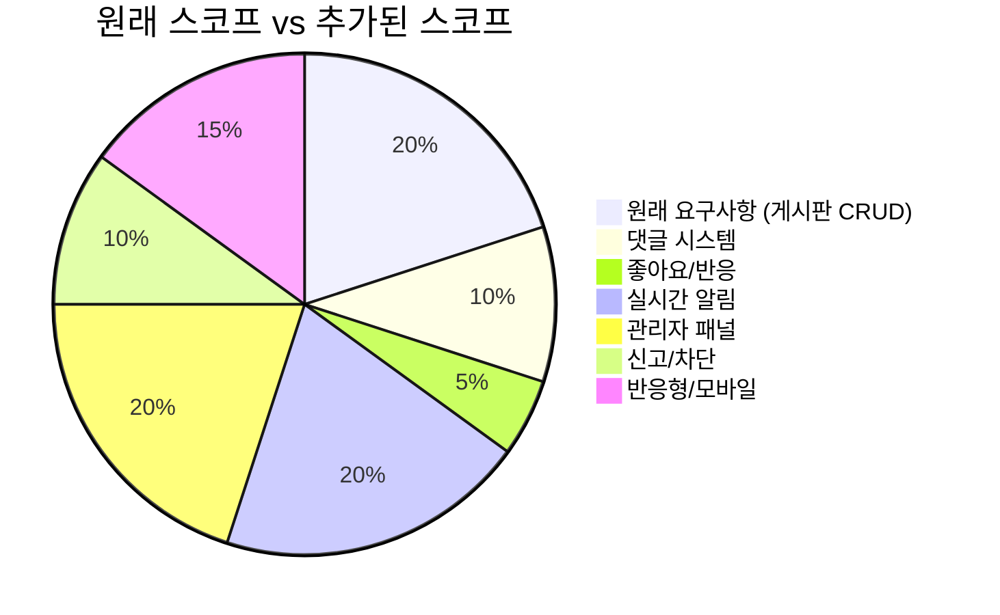
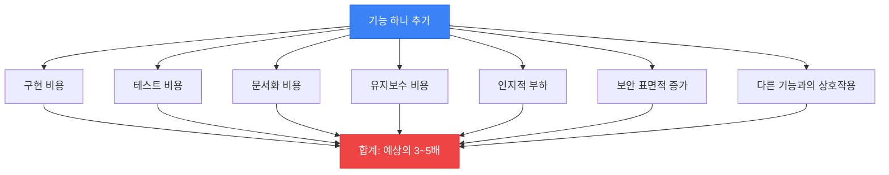
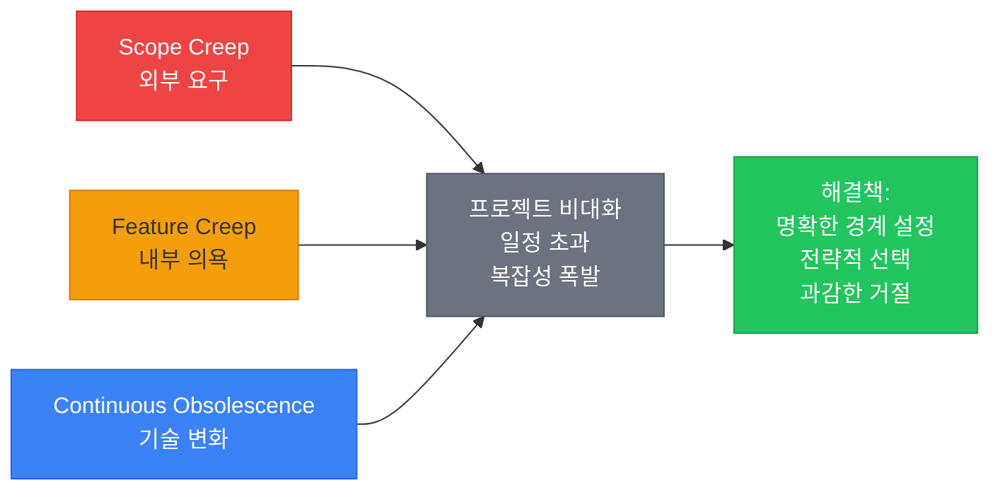

# 스코프와 피처 크립: 끝없이 커지는 프로젝트

*"이것만 추가하면 돼" — 그 말을 500번째 듣는 중*

---

"간단한 기능 하나만 추가해줘." 이 문장은 개발자의 수명을 가장 많이 깎는 문장 중 하나다. 한 번은 괜찮다. 두 번도 괜찮다. 근데 이게 50번, 100번 반복되면? 처음에 "게시판 하나 만들어줘"였던 프로젝트가 어느새 "소셜 미디어 플랫폼"이 되어 있음.

이번 글에서는 프로젝트가 끝없이 커지는 세 가지 안티패턴을 다룬다. Scope Creep(외부에서 요구사항이 밀려옴), Feature Creep(내부에서 기능이 자라남), 그리고 Continuous Obsolescence(기술 자체가 변해서 따라가지 못함).

---

## 1. Scope Creep (스코프 크립)

### 이게 뭔데

<Callout type="warning" title="Scope Creep이란">
프로젝트 진행 중 요구사항이 공식적인 변경 관리 프로세스 없이 점진적으로 확장되는 현상. "크립(creep)"이라는 단어가 핵심인데, 한 번에 확 커지는 게 아니라 조금씩, 살금살금, 눈치 못 채게 커진다. 각각의 추가 요청은 "별거 아닌" 것처럼 보이지만, 누적되면 원래 프로젝트와 완전히 다른 것이 됨.
</Callout>

스코프 크립의 무서운 점은 **각각의 변경이 합리적으로 보인다**는 것이다. "댓글 기능? 당연히 필요하죠." "좋아요? 요즘 다 있잖아요." "알림? 사용자 경험을 위해 필수죠." 개별적으로 보면 다 맞는 말이다. 근데 이걸 전부 합치면 일정이 3배가 되고, 예산도 3배가 됨.

### 실제 시나리오: "간단한 게시판"의 진화

이건 실제로 너무나 자주 벌어지는 시나리오다:

**Week 1** — "간단한 게시판 만들어줘. 글 쓰고 읽기만 되면 돼."
- 추정: 2주

**Week 3** — "아, 댓글도 추가해줘. 게시판에 댓글은 기본이잖아."
- PM: "이건 원래 있어야 하는 건데 빠진 거죠." (아닌데?)
- 추가 일정: +1주

**Week 5** — "좋아요 기능도 넣어줘. 사용자 반응을 볼 수 있어야지."
- 좋아요 + 좋아요 카운트 + 좋아요 취소 + 중복 방지
- 추가 일정: +3일

**Week 7** — "실시간 알림이 필요해. 내 글에 댓글 달리면 알려줘야지."
- WebSocket 설정, 알림 서비스, 알림 목록 UI, 읽음 처리...
- 추가 일정: +2주

**Week 9** — "관리자 패널도 만들어줘. 신고된 글 관리해야 하니까."
- 신고 기능, 관리자 권한, 관리 UI, 차단/삭제 기능...
- 추가 일정: +2주

**Week 12** — "모바일에서도 써야 하니까 반응형으로 해줘. 아, 그리고 앱도..."
- 개발자: (혼이 빠져나간 눈으로 모니터를 바라봄)



원래 스코프(20%)가 전체의 1/5도 안 된다. 나머지 80%는 "간단한 추가 요청"들이 누적된 것. 일정도 원래 2주에서 10주 이상으로 5배가 됨. 그리고 추가된 기능들에 대한 테스트, 문서화, 유지보수 비용은 아직 계산에도 들어가지 않았다.

### 왜 이 지경이 되나

**"어차피 개발 중이니까" 마인드.** 프로젝트가 진행 중일 때가 기능 추가하기 가장 쉬운 시기라고 생각함. 맞긴 한데, 그렇다고 무한정 추가하면 프로젝트가 끝나지 않는다.

**비용 인식 부재.** 기능을 요청하는 사람은 구현 비용을 모르는 경우가 많다. "좋아요 버튼 하나 추가하는 게 뭐가 어려워?"라고 생각함. 하지만 좋아요 하나에도 DB 스키마 변경, API 엔드포인트, 상태 관리, 중복 방지 로직, 카운트 집계, UI 애니메이션 등이 필요하다.

**명확한 변경 관리 프로세스 부재.** "이것도 해줘"라는 말이 공식적인 변경 요청인지, 비공식적인 의견인지 구분이 안 됨. 이메일 한 줄, 슬랙 메시지 하나가 곧바로 요구사항이 되는 환경.

### 방지법

<Callout type="success" title="스코프 관리 실천법">
1. **요구사항 변경 프로세스 수립**: Change Request(CR) 양식을 만들어라. "추가 기능은 CR을 작성하고, 영향도를 분석한 후 승인을 받아야 합니다."
2. **추가 기능 = 추가 일정/비용 명확화**: "이 기능을 추가하면 일정이 2주 늘어나고 비용이 500만원 추가됩니다"를 매번 명확히 전달.
3. **MVP 정의 후 추가는 다음 스프린트로**: "이건 v1.0에는 안 들어갑니다. v1.1 백로그에 넣겠습니다."
4. **"v2에서 하자" 목록 관리**: 모든 추가 요청을 거부하는 게 아니라, 기록하되 현재 릴리스에는 포함하지 않겠다고 합의.
5. **일정과 스코프 중 하나를 선택하게 해라**: "기능을 추가하면 일정이 밀립니다. 일정을 지키려면 기능을 빼야 합니다. 어느 쪽을 선택하시겠습니까?"
</Callout>

---

## 2. Feature Creep (피처 크립)

### 이게 뭔데

<Callout type="warning" title="Feature Creep이란">
사용자가 요청하지 않은 기능이 내부(개발팀, PM, 디자이너)에 의해 계속 추가되어 제품이 불필요하게 복잡해지는 현상. Scope Creep이 외부 요인이라면, Feature Creep은 내부 요인. "이것도 있으면 좋겠다"가 무한히 반복됨.
</Callout>

Scope Creep은 고객이나 경영진이 "이거 추가해줘"라고 하는 거고, Feature Creep은 개발팀 스스로가 "이것도 넣으면 좋겠다"고 하는 거다. 어떻게 보면 Feature Creep이 더 위험할 수 있는데, 왜냐하면 개발자 자신이 주체이기 때문에 "이건 좋은 기능이니까" 하면서 자기 합리화가 쉽기 때문.

<Callout type="info" title="Scope Creep vs Feature Creep">
- **Scope Creep** = 외부(고객/경영진)가 요구사항을 추가. "클라이언트가 이 기능도 원합니다."
- **Feature Creep** = 내부(개발팀)가 기능을 추가. "이 기능 있으면 사용자가 좋아할 거예요."
- **결과는 같음**: 프로젝트가 비대해지고, 복잡해지고, 일정이 밀림.
- **원인은 다름**: 하나는 통제 부재, 다른 하나는 과도한 의욕.
</Callout>

### Feature Creep의 전형적 패턴

**"설정에 옵션 하나만 더"** — 설정 화면에 옵션이 하나씩 추가되다가, 어느새 옵션이 200개. 사용자는 99%의 옵션이 뭔지 모르고, 1%의 옵션만 건드린다. MS Word의 리본 메뉴를 보라. 기능이 수천 개인데 대부분의 사용자는 볼드, 이탤릭, 글꼴 크기만 쓴다.

**"경쟁사에 있으니까 우리도"** — 경쟁사 제품 분석하면서 "이 기능 우리도 있어야 하지 않나?"가 반복됨. 우리 제품의 정체성은 사라지고 경쟁사 기능의 짝퉁 모음이 됨.

**"나중에 필요할 수도 있으니까"** — 지금 아무도 안 쓰지만, "나중에 필요할 수도 있으니까 미리 만들어두자." YAGNI(You Ain't Gonna Need It) 원칙의 정면 위반. 이전 글에서 다룬 Speculative Generality와도 연결됨.

**"기술적으로 재미있으니까"** — 솔직히 인정하자. 개발자가 기능을 추가하는 이유 중 하나는 "만들어보고 싶어서"다. 기술적 호기심은 좋은 것이지만, 제품에 불필요한 복잡성을 추가하는 건 별개의 문제.

### Feature Creep의 비용

기능 하나를 추가하는 건 구현 비용만이 아니다:



기능 하나의 진짜 비용은 구현의 3~5배다. 테스트, 문서화, 다른 기능과의 상호작용 테스트, 장기 유지보수, 보안 검토, 사용자 교육... 이런 것들을 전부 합치면 "간단한 기능 하나"가 결코 간단하지 않다.

### 해결법

"추가하기 전에 빼는 걸 먼저 생각해라." 기능을 추가할 때마다 물어봐야 하는 질문:

1. **사용자가 실제로 요청했는가?** (추측이 아니라 데이터로)
2. **이 기능 없이 제품이 동작하는가?** (핵심 가치와 관련 있는가)
3. **유지보수 비용을 감당할 수 있는가?** (지금뿐 아니라 2년 후에도)
4. **이 기능이 제품을 더 복잡하게 만드는가?** (사용자 경험에 부정적 영향?)

<Callout type="note" title="빼기의 미학">
"완벽함이란 더 이상 추가할 것이 없는 상태가 아니라, 더 이상 뺄 것이 없는 상태다." — Antoine de Saint-Exupery. 기능을 추가하는 것보다 기능을 빼는 데 더 큰 용기가 필요하다. 하지만 성공한 제품들의 공통점은 "적은 기능을 잘 하는 것"이지 "많은 기능을 대충 하는 것"이 아니다.
</Callout>

---

## 3. Continuous Obsolescence (지속적 구식화)

### 이게 뭔데

<Callout type="warning" title="Continuous Obsolescence란">
기술 스택이 너무 빠르게 변화하여 팀의 학습 속도가 따라가지 못하고, 시스템이 항상 "현재 기준으로 구식"인 상태에 놓이는 현상. 업그레이드를 완료하기도 전에 새로운 버전이 나오고, 마이그레이션 중에 또 다른 마이그레이션이 필요해짐.
</Callout>

앞의 두 안티패턴(Scope Creep, Feature Creep)이 "우리가 만든 것이 너무 커지는" 문제라면, Continuous Obsolescence는 "우리가 사용하는 것이 너무 빨리 변하는" 문제다. 이건 개발팀의 잘못이라기보다는, 기술 생태계 자체의 진화 속도에서 오는 구조적인 문제.

### JavaScript 생태계: 구식화의 교과서

JavaScript/Node.js 생태계는 이 문제의 극단적인 예시다:

```
2015: "Angular 1으로 만들었어요"
2016: "Angular 2가 나왔어요. 완전히 다른 프레임워크예요. 마이그레이션 해야 해요."
2017: "React가 대세래요. Angular 말고 React로 다시 만들어요?"
2018: "React Hooks가 나왔어요. Class 컴포넌트 다 바꿔야 해요."
2019: "Next.js 써야 SSR이 된대요."
2020: "Svelte가 더 낫다던데?"
2021: "Next.js 12에 Middleware가... Remix도 괜찮고..."
2022: "React 18 Server Components... 패러다임이 바뀌었어요."
2023: "App Router로 마이그레이션 해야 해요."
2024: "Bun이 Node.js보다 빠르대요. 런타임 바꿀까요?"
2025: "React 19... 서버 액션... 폼 액션... 또 바뀌었어요."
```

이건 과장이 아님. 실제로 이렇게 빠르게 변한다. 그리고 매번 "이제 이게 표준이에요"라고 말한다.

### 왜 문제인가

**영원한 마이그레이션.** Angular 8에서 9로 올리는 데 3개월 걸렸는데, 올리고 나니 Angular 11이 나와 있음. 마이그레이션이 끝나지 않는 무한 루프. 마이그레이션에 시간을 쓰느라 정작 비즈니스 기능 개발을 못 하게 됨.

**학습 피로.** 매년 새로운 프레임워크, 새로운 패러다임, 새로운 도구를 학습해야 함. 개발자의 시간과 에너지는 유한한데, 학습해야 할 것은 무한히 늘어남.

**채용 어려움.** "우리 Angular 8인데요, 지금 Angular 8 할 줄 아는 사람 구하기가 어려워요." 기술이 구식이 되면 해당 기술을 쓸 줄 아는 개발자를 구하기 점점 어려워짐. 새로 오는 개발자는 최신 기술만 배운 상태.

**보안 위험.** 구버전의 라이브러리/프레임워크는 보안 패치가 중단됨. 업그레이드를 안 하면 알려진 취약점이 방치됨. 업그레이드를 하면 위의 문제들이 발생. 진퇴양난.

<Callout type="note" title="기술 부채 vs 지속적 구식화">
**기술 부채**는 "빠른 출시를 위해 의도적으로 품질을 희생한" 결과. 팀이 선택한 것이다.

**지속적 구식화**는 "기술 생태계가 너무 빠르게 변해서 가만히 있어도 뒤처지는" 현상. 팀이 선택한 것이 아니다.

기술 부채는 갚을 수 있다. 하지만 지속적 구식화는 "모든 것을 최신으로 유지하는 것"이 불가능하기 때문에, 전략적으로 관리해야 한다.
</Callout>

### 전략적 관리법

<Callout type="success" title="지속적 구식화 대응 전략">
1. **LTS(Long Term Support) 버전 사용**: 최신 버전이 아닌 안정 버전을 선택. Node.js LTS, Java LTS, .NET LTS 등.
2. **"충분히 좋은" 기술 선택**: 최신 = 최선이 아님. 커뮤니티가 크고, 문서가 풍부하고, 안정적인 기술이 "최선"일 때가 많다.
3. **업그레이드 주기 설정**: "매 분기 마이너 업그레이드, 매년 메이저 업그레이드"처럼 계획적으로.
4. **추상화 레이어**: 특정 프레임워크/라이브러리에 직접 의존하지 말고, 추상화를 통해 교체 가능하게 설계.
5. **모든 것을 따라가지 마라**: 새 기술이 나올 때마다 점프하는 건 가장 비용이 큰 전략. "이 기술이 3년 후에도 살아있을까?"를 물어봐라.
</Callout>

---

## 세 가지의 공통 교훈

Scope Creep, Feature Creep, Continuous Obsolescence. 이 세 가지는 방향은 다르지만 결과는 같다: **프로젝트가 감당할 수 없을 만큼 커지거나 변한다.**



공통 해결책은 **경계를 설정하고 지키는 것**이다:

- Scope Creep에는 변경 관리 프로세스로 경계를
- Feature Creep에는 "이 기능이 정말 필요한가?"라는 질문으로 경계를
- Continuous Obsolescence에는 "이 업그레이드가 정말 필요한가?"라는 질문으로 경계를

"NO"라고 말하는 것은 부정적인 게 아니다. 프로젝트를 살리기 위한 가장 건설적인 행동일 수 있다.

---

_← [이전 글: 프로젝트의 죽음](/docs/articles/anti-patterns/17.project-death) | [다음 글: 카우보이와 히어로](/docs/articles/anti-patterns/19.cowboy-and-hero) →_