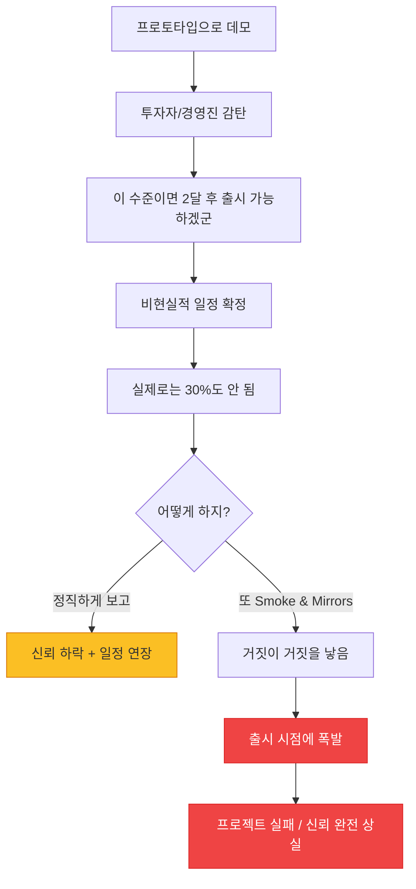
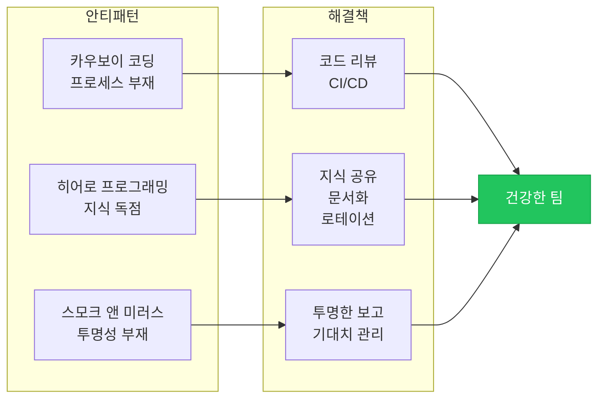

# 카우보이와 히어로: 개인 플레이의 폐해

*혼자서 다 해결하는 시대는 끝났다*

---

팀 프로젝트에서 가장 위험한 사람은 누굴까? 실력이 부족한 사람? 아니다. **혼자서 다 하려는 사람**이다. 실력이 부족한 건 학습으로 해결할 수 있지만, "내가 다 알아서 할게"는 구조적인 문제를 만든다. 그리고 그 구조적 문제는 그 사람이 떠나는 순간 폭발함.

이번 글에서 다루는 세 가지 안티패턴 — Cowboy Coding, Hero Programming, Smoke and Mirrors — 은 모두 "개인에게 의존하는 프로세스"에서 비롯된다. 그리고 이런 패턴이 자리 잡은 팀은 겉보기에는 잘 돌아가는 것 같지만, 내부적으로는 매우 취약하다.

---

## 1. Cowboy Coding (카우보이 코딩)

### 이게 뭔데

<Callout type="warning" title="Cowboy Coding이란">
계획, 검토, 프로세스 없이 개인의 판단만으로 개발하는 방식. 코딩 컨벤션 무시, PR 리뷰 스킵, 브랜치 전략 없이 main에 직접 push, 테스트 없이 배포. "내 코드는 내가 제일 잘 알아"라는 마인드셋. 서부 개척시대의 카우보이처럼 규칙 없이 자유롭게 행동.
</Callout>

카우보이 코딩은 초기 스타트업에서 특히 자주 보인다. 혼자 또는 2~3명이 빠르게 프로토타입을 만들 때는 이게 효율적인 것처럼 느껴진다. PR 리뷰? 나 혼자인데. 브랜치? main 하나면 되지. 테스트? 돌아가면 됐잖아.

문제는 팀이 커져도 이 습관을 버리지 못할 때 발생한다. 5명, 10명, 50명이 되어도 여전히 main에 직접 push하고, 코드 리뷰 없이 배포하고, "내 PC에서는 되는데"를 반복함.

### 카우보이의 특성

카우보이 개발자를 식별하는 방법:

- **main에 직접 push**: 브랜치? 그게 뭔데. 귀찮아. 바로 main에 올리면 되지.
- **PR 없이 배포**: "지금 핫픽스해야 하니까" — 항상 핫픽스 상태. 정규 배포 프로세스를 거치는 일이 없음.
- **코딩 컨벤션 무시**: ESLint 설정? 귀찮아서 끔. 탭/스페이스? 내 맘대로. 네이밍? 나만 알면 됨.
- **"내 PC에서는 되는데"**: 환경 설정을 공유하지 않고 자기 로컬에서만 동작하는 코드를 작성.
- **문서화? "코드가 문서다"**: 근데 그 코드를 다른 사람이 읽을 수 있느냐고.
- **테스트 코드 없음**: "수동으로 확인했어." 근데 모든 케이스를 확인한 건 아님.

### 카우보이 코딩이 발생하는 상황

혼자서 하는 개인 프로젝트라면 카우보이 코딩은 문제가 되지 않는다. 문제는 팀 프로젝트에서다.

**"빠른 속도가 필요한" 환경.** 스타트업 초기, 데드라인이 코앞인 프로젝트, "어제까지 해야 했는데" 같은 상황에서 프로세스를 생략하게 됨. 단기적으로는 빠르지만, 장기적으로는 기술 부채가 누적되어 오히려 느려진다.

**리뷰 문화가 없는 팀.** PR 리뷰를 "비판"으로 받아들이는 문화. "왜 내 코드를 검사해?"라는 반응. 코드 리뷰는 비판이 아니라 품질 보장과 지식 공유의 수단인데, 이걸 이해하지 못하는 환경.

**시니어 한 명이 모든 결정을 내리는 팀.** "그 사람이 결정하니까 리뷰가 필요 없어"라는 분위기. 그 시니어가 카우보이라면 팀 전체가 카우보이가 됨.

<Callout type="error" title="카우보이 코딩의 대가">
- **코드 품질 일관성 없음**: 같은 프로젝트인데 파일마다 스타일이 다름. 어떤 파일은 세미콜론이 있고, 어떤 파일은 없고.
- **버그가 프로덕션에서 발견됨**: 테스트와 리뷰가 없으니 당연한 결과.
- **팀원이 코드를 이해할 수 없음**: "이 함수가 뭐 하는 거야?"에 대한 답이 "그건 나만 알아"
- **인수인계 불가능**: 카우보이가 퇴사하면 그가 작성한 코드는 블랙박스가 됨.
- **배포 후 장애 빈발**: 리뷰 없이 배포하니 사소한 실수가 그대로 프로덕션으로.
</Callout>

### 카우보이를 길들이는 법

카우보이 코딩을 막는 건 기술적 해결책보다는 프로세스와 문화의 문제다:

1. **브랜치 보호 규칙 설정**: main 브랜치에 직접 push를 금지하고, PR을 통해서만 병합. GitHub/GitLab에서 설정 가능.
2. **PR 리뷰 의무화**: 최소 1명의 승인 없이는 merge 불가. 이건 기술적으로 강제할 수 있음.
3. **CI/CD 파이프라인**: 린트, 테스트, 빌드가 자동으로 돌아가게 설정. 실패하면 merge 차단.
4. **코딩 컨벤션 도구화**: ESLint, Prettier 같은 도구로 스타일을 자동 적용. 의견 차이가 아니라 도구가 결정하게.
5. **페어 프로그래밍 도입**: 혼자 코딩하는 습관을 깨는 가장 효과적인 방법.

---

## 2. Hero Programming (히어로 프로그래밍)

### 이게 뭔데

<Callout type="warning" title="Hero Programming이란">
특정 개발자 한 명(또는 소수)이 시스템의 핵심을 혼자 이해하고, 혼자 유지하고, 혼자 장애를 해결하는 구조. 표면적으로는 "뛰어난 개발자"로 보이지만, 실제로는 지식이 공유되지 않아 팀 전체가 그 한 명에게 의존하는 취약한 구조.
</Callout>

"김 과장님 없으면 배포를 못 해요." "이건 박 대리만 알아요." "장애 나면 최 선임한테 전화해야 해요." — 이런 말이 나오는 팀이면 히어로 프로그래밍에 빠져 있는 거다.

중요한 건, 이건 그 "히어로"의 실력이 뛰어나서가 아니라 **지식 공유가 안 되기 때문에** 발생하는 구조적 문제라는 점이다. 히어로가 의도적으로 지식을 독점하는 경우도 있고(자기 존재 가치를 높이기 위해), 히어로 본인도 원치 않는데 팀이 의존해버리는 경우도 있음.

### Bus Factor

<Callout type="warning" title="Bus Factor (트럭 계수)">
"팀에서 몇 명이 버스에 치이면(= 갑자기 빠지면) 프로젝트가 멈추는가?" Bus Factor가 1이면, 그 한 명이 퇴사, 병가, 또는 장기 여행을 가면 프로젝트가 중단된다. 건강한 팀의 Bus Factor는 최소 3 이상이어야 한다.
</Callout>

Bus Factor 1인 팀의 일상:

```mermaid
flowchart TD
    A[장애 발생!] --> B{히어로가 가용한가?}
    B -->|"출근 중"| C[히어로가 해결<br/>팀은 구경]
    B -->|"휴가 중"| D[아무도 해결 못 함]
    B -->|"퇴사함"| E[프로젝트 위기]

    C --> F[히어로에 대한 의존 심화]
    F --> G[다른 팀원의 학습 기회 박탈]
    G --> H[Bus Factor 계속 1로 유지]
    H --> A

    D --> I[히어로에게 전화<br/>"휴가 중 죄송한데..."]
    E --> J[코드 고고학 시작<br/>"이 코드가 뭘 하는 거야..."]

    style D fill:#ef4444,stroke:#dc2626,color:#fff
    style E fill:#ef4444,stroke:#dc2626,color:#fff
    style H fill:#fbbf24,stroke:#d97706
```

히어로가 장애를 해결하면 → 팀은 "역시 저분은 다르다"며 존경함 → 히어로에 대한 의존이 심화 → 다른 팀원은 배울 기회를 얻지 못함 → Bus Factor는 계속 1 → 다음 장애에도 히어로만 해결 가능 → 무한 반복.

이건 악순환이고, 히어로 본인에게도 나쁘다. 히어로는 휴가를 못 가고, 야근이 잦고, 번아웃이 온다. "저만 알고 있어서 제가 해야 해요"가 자부심에서 시작하지만, 결국 짐이 됨.

### 히어로가 만들어지는 과정

1단계: 팀에 경험 많은 개발자 A가 입사. 기존 시스템의 문제를 빠르게 파악하고 해결.
2단계: 팀이 A에게 점점 더 많은 것을 맡김. "A가 하면 빠르니까."
3단계: A가 핵심 모듈 대부분을 혼자 작성/유지. 다른 팀원은 그 모듈을 모름.
4단계: A 없이는 배포, 장애 대응, 아키텍처 결정이 불가능한 상태.
5단계: A가 번아웃으로 퇴사. 팀 패닉.

이 과정은 보통 6개월~1년에 걸쳐 점진적으로 진행됨. 그리고 이 과정에서 아무도 위험 신호를 인식하지 못한다.

### 히어로 의존을 깨는 법

<Callout type="success" title="Bus Factor 높이기">
1. **페어 프로그래밍 / 코드 리뷰 의무화**: 모든 코드에 최소 2명이 관여. "이 코드는 나만 알아"가 불가능하게.
2. **문서화, 특히 "왜"**: 코드의 "what"은 코드 자체가 말해주지만, "왜 이렇게 했는가"는 문서가 필요함. 아키텍처 결정 기록(ADR)을 남겨라.
3. **담당 영역 로테이션**: 한 사람이 같은 모듈을 1년 이상 전담하지 않도록. 분기마다 담당을 교체.
4. **온콜 교대**: 장애 대응을 한 명이 아닌 팀이 번갈아 담당. 자연스럽게 시스템 전체를 이해하게 됨.
5. **지식 공유 세션**: 주 1회, 히어로가 자기 영역을 팀에게 설명. "이 모듈은 이렇게 동작하고, 장애 시 이렇게 대응해요."
6. **Run Book 작성**: 장애 대응 매뉴얼. "X 에러가 나면 Y를 확인하고 Z를 실행해라." 히어로의 머릿속 지식을 문서로.
</Callout>

---

## 3. Smoke and Mirrors (연막과 거울)

### 이게 뭔데

<Callout type="warning" title="Smoke and Mirrors란">
실제 동작하는 구현 없이 데모와 프로토타입으로 완성된 것처럼 보이게 하면서 프로젝트를 진행하는 것. 마술에서 연막과 거울로 환상을 만들듯, 프로젝트의 실제 상태를 속이는 행위. "시연에서는 완벽했는데 실제로는 하드코딩이었어요."
</Callout>

스모크 앤 미러스는 다른 안티패턴들과 좀 다르다. 앞의 두 가지(카우보이, 히어로)가 무의식적으로 발생하는 것이라면, 이건 어느 정도 **의도적**인 경우가 많다. 투자자 데모를 위해, 경영진 보고를 위해, 고객 시연을 위해 "동작하는 것처럼 보이는" 프로토타입을 만드는 것.

### 시연 전날의 풍경

이런 장면을 본 적 있을 거다:

> "내일 투자자 데모인데, 이 부분은 아직 안 돼서 일단 하드코딩으로 넣어놓자."
> "로그인은 아직 안 되니까 데모 계정을 미리 만들어두고, 데모 시나리오대로만 보여주자."
> "검색은 아직 구현 안 됐으니까 미리 정해진 키워드만 동작하게 해놓자."
> "데이터는 실시간이 아니라 어제 캡처한 JSON을 보여주는 거야."

개별적으로 보면 합리적인 결정일 수 있다. 프로토타입은 검증 도구이고, 모든 기능이 완성되기 전에 방향성을 확인하는 건 좋은 일이다. **문제는 이게 투명하지 않을 때** 발생한다.

### Smoke and Mirrors의 유형

**데모 하드코딩.** 데모 시나리오에 맞춰서 모든 데이터와 응답을 하드코딩. 시나리오를 벗어나면 아무것도 동작하지 않음.

**화면만 있는 프로토타입.** 예쁜 UI가 있지만 백엔드 로직은 없음. 버튼을 누르면 미리 준비된 화면으로 전환될 뿐. Figma 프로토타입과 다를 바 없는데, "거의 완성됐습니다"라고 보고함.

**선택적 시연.** 동작하는 부분만 보여주고, 안 되는 부분은 교묘하게 건너뜀. "시간 관계상 이 부분은 넘어가겠습니다" — 실제로는 구현이 안 돼서 넘어가는 것.

**메트릭 조작.** 테스트 결과, 성능 수치, 사용자 수 등을 실제보다 좋게 보고. "활성 사용자 1만 명"인데 실제로는 봇 계정 포함.

### 왜 이 지경이 되나

**비현실적인 기대.** 경영진이나 투자자가 기대하는 진행 속도와 실제 개발 속도 사이의 갭. 그 갭을 메우기 위해 "동작하는 척"을 하게 됨.

**나쁜 소식을 전할 수 없는 문화.** "아직 안 됩니다"라고 말하면 "왜 안 돼?"라는 추궁이 따라옴. 차라리 "거의 됐습니다"라고 말하고 시간을 벌자는 유혹.

**데모 주도 개발(Demo-Driven Development).** 제품의 실제 품질보다 데모에서 얼마나 인상적으로 보이는지가 중요한 환경. 투자를 받아야 하는 초기 스타트업에서 특히 빈번.

### Smoke and Mirrors의 위험



가장 큰 위험은 **거짓이 거짓을 낳는 것**이다. 한 번 실제보다 좋게 보고하면, 다음에는 그 기대치에 맞춰야 하니까 더 큰 거짓이 필요해진다. 눈덩이가 굴러가다가 결국 출시 시점에서 "실제로는 아무것도 준비 안 됐다"는 사실이 드러남.

<Callout type="note" title="프로토타입은 나쁜 게 아니다">
문제는 프로토타입 자체가 아니라, **프로토타입을 프로덕션으로 착각하거나 착각하게 만드는 것**이다.

좋은 프로토타입 활용:
- "이건 검증용 프로토타입이고, 실제 구현은 3개월 더 필요합니다" — 투명한 커뮤니케이션
- "이 방향이 맞는지 확인하기 위한 것이지, 완성품이 아닙니다" — 기대치 관리

나쁜 프로토타입 활용:
- "거의 다 됐습니다" (실제 완성도 20%)
- "이 데모가 실제 동작하는 제품입니다" (하드코딩 투성이)
</Callout>

### 투명성을 위한 실천

**진행 상황을 투명하게 공유.** 실제 완성도를 정직하게 보고해라. "로그인 기능: 완료, 검색: 50%, 결제: 미착수"처럼 구체적으로.

**데모에서 한계를 명확히.** "이 데모는 핵심 플로우만 보여드리는 것이고, 에러 처리/보안/성능 최적화는 아직 진행 중입니다."

**프로토타입과 프로덕션 코드 분리.** 데모용 코드를 별도 브랜치에서 관리하고, 프로덕션 코드와 섞지 않기. "데모 코드를 그대로 프로덕션에 넣자"는 유혹에 빠지지 않기.

**나쁜 소식을 빨리 전하는 문화.** "문제가 있으면 빨리 말해라. 늦게 알수록 해결 비용이 커진다." — 이건 경영진이 만들어야 하는 문화.

---

## 세 가지의 공통점

카우보이 코딩, 히어로 프로그래밍, 스모크 앤 미러스. 이 세 가지는 모두 **개인에게 의존하는 구조**에서 비롯된다.

- 카우보이는 **프로세스 없이 개인의 판단에 의존**
- 히어로는 **지식을 개인이 독점**
- 스모크 앤 미러스는 **투명성 없이 개인의 연출에 의존**

해결책도 공통된다: **팀 기반의 프로세스와 투명한 커뮤니케이션**.



소프트웨어 개발은 팀 스포츠다. 혼자서 모든 걸 해결하는 천재 개발자는 영화에서나 나오는 거고, 현실에서는 팀이 함께 성장하는 환경이 훨씬 강력하다. "그 사람이 없으면 안 돼"가 아니라 "누가 빠져도 프로젝트는 돌아간다"가 건강한 팀의 모습이다.

---

_← [이전 글: 스코프와 피처 크립](/docs/articles/anti-patterns/18.scope-and-feature-creep) | [다음 글: 보안 안티패턴](/docs/articles/anti-patterns/20.security-antipatterns) →_