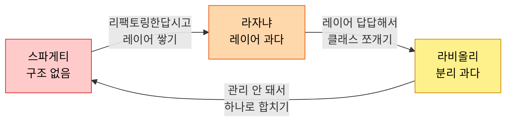

# 파스타 코드 3형제: 스파게티, 라자냐, 라비올리

*코드 구조의 세 가지 실패 방식*

---

개발자들이 코드 구조 문제를 설명할 때 유독 음식 비유를 좋아한다. 그 중에서도 파스타 비유가 압도적으로 많은데, 아마 코드의 꼬임과 층을 음식으로 표현하기 딱 좋아서일 거다. 스파게티 코드는 너무 유명해서 비개발자도 아는 단어가 됐고, 라자냐와 라비올리는 "스파게티는 알겠는데 그건 뭔데?"라는 반응을 자주 받는다. 세 가지를 한번에 다루는 이유는, 이것들이 **코드 구조의 세 가지 실패 축**을 대표하기 때문이다.

스파게티는 구조가 **아예 없는** 상태. 라자냐는 구조가 **너무 많은** 상태. 라비올리는 구조가 **너무 잘게 쪼개진** 상태. 결국 셋 다 "적절한 구조"를 못 찾아서 생기는 문제인데, 가장 아이러니한 건 **하나를 고치려다 다른 하나가 되는** 경우가 부지기수라는 거다. 스파게티 코드를 리팩토링한답시고 레이어를 왕창 쌓으면 라자냐가 되고, 라자냐가 답답해서 클래스를 잘게 쪼개면 라비올리가 된다. 그래서 이 세 개를 같이 이해해야 균형점을 찾을 수 있음.

이번 글에서는 각 안티패턴의 정의, 실제 코드 예시, 그리고 개선 방법을 순서대로 살펴본다. 코드는 전부 TypeScript로 작성했고, 실무에서 흔히 볼 수 있는 패턴들로 구성했다. 내 코드에서 이런 냄새가 나면... 축하한다, 리팩토링 시간이다.

---

## 1. 스파게티 코드 (Spaghetti Code)

### 이게 뭔데

<Callout type="warning" title="정의">
제어 흐름(control flow)이 복잡하게 얽혀서 코드의 실행 순서와 구조를 파악하기 극도로 어려운 코드. 면발이 서로 엉켜있는 스파게티처럼 어디서 시작해서 어디서 끝나는지 추적이 불가능하다.
</Callout>

고전적인 원인은 GOTO문이었다. 코드가 위아래로 점프하면서 로직이 꼬이는 거. 하지만 현대 프로그래밍에서 GOTO를 쓰는 사람은 거의 없으니 안심... 할 줄 알았는데, 사실 현대판 스파게티는 더 교묘한 형태로 살아있다. 콜백 지옥, 깊은 조건문 중첩, 하나의 함수에 모든 로직을 때려넣기, 이벤트 체인이 꼬리에 꼬리를 무는 구조. 형태만 바뀌었지 본질은 같음 — **흐름을 따라갈 수 없다.**

스파게티 코드의 핵심 증상은 이거다: 함수 하나가 수백 줄이고, 그 안에서 검증, DB 호출, 이메일 발송, 로깅, 에러 처리가 전부 한 곳에서 일어난다. 변수 하나를 바꾸면 어디가 깨질지 예측 불가. 테스트? 함수를 분리할 수 없으니 유닛 테스트도 불가능.

### 이런 코드

```typescript
// 주문 처리 함수 — 전형적인 스파게티
async function processOrder(data: any) {
  let result: any = {};
  let emailSent = false;

  if (data && data.items && data.items.length > 0) {
    let total = 0;
    for (let i = 0; i < data.items.length; i++) {
      if (data.items[i].price > 0 && data.items[i].quantity > 0) {
        total += data.items[i].price * data.items[i].quantity;
        if (data.items[i].discount) {
          if (data.items[i].discount > 0 && data.items[i].discount <= 100) {
            total -= (data.items[i].price * data.items[i].quantity * data.items[i].discount) / 100;
          } else {
            console.log("잘못된 할인율: " + data.items[i].discount);
            // 할인 무시하고 계속 진행... 하는 게 맞나?
          }
        }
      } else {
        console.log("유효하지 않은 상품: " + JSON.stringify(data.items[i]));
        // 에러인데 계속 진행함
      }
    }

    if (total > 0) {
      try {
        const db = await connectDB();
        const order = await db.collection("orders").insertOne({
          userId: data.userId, items: data.items, total,
          status: "pending", createdAt: new Date()
        });
        result.orderId = order.insertedId;

        // 결제 처리도 여기서
        try {
          const payment = await fetch("https://payment-api.com/charge", {
            method: "POST",
            body: JSON.stringify({ amount: total, orderId: result.orderId })
          });
          if (payment.ok) {
            await db.collection("orders").updateOne(
              { _id: result.orderId },
              { $set: { status: "paid" } }
            );
            // 이메일도 여기서 보냄
            try {
              await fetch("https://email-api.com/send", {
                method: "POST",
                body: JSON.stringify({
                  to: data.email,
                  subject: "주문 확인",
                  body: `주문번호 ${result.orderId}, 금액 ${total}원`
                })
              });
              emailSent = true;
              console.log("이메일 발송 성공");
            } catch (e) {
              console.log("이메일 실패했는데 주문은 됐으니까 일단 넘어감");
              // TODO: 나중에 재시도 로직 넣기 (2023년 작성)
            }
          } else {
            await db.collection("orders").updateOne(
              { _id: result.orderId },
              { $set: { status: "payment_failed" } }
            );
            result.error = "결제 실패";
          }
        } catch (e) {
          result.error = "결제 시스템 오류: " + (e as Error).message;
          console.error(e);
        }
      } catch (e) {
        result.error = "DB 오류: " + (e as Error).message;
        console.error(e);
      }
    } else {
      result.error = "총액이 0 이하";
    }
  } else {
    result.error = "상품이 없음";
  }

  result.emailSent = emailSent;
  return result;
}
```

<Callout type="error" title="뭐가 문제인가">
- 하나의 함수에서 검증, 계산, DB, 결제, 이메일까지 전부 처리
- try-catch가 3단으로 중첩 — 에러 발생 시 어디서 잡히는지 추적 불가
- `any` 타입 남발로 타입 안전성 제로
- 부분 실패 시 상태가 어떻게 되는지 예측 불가 (결제는 됐는데 DB 업데이트 실패하면?)
- 테스트 작성 불가능 — DB, 결제 API, 이메일 API를 전부 목킹해야 함
</Callout>

### 고친 코드

```typescript
// 관심사 분리 + async/await + Early Return

interface OrderItem {
  price: number;
  quantity: number;
  discount?: number;
}

interface OrderRequest {
  userId: string;
  email: string;
  items: OrderItem[];
}

function validateItems(items: OrderItem[]): void {
  if (!items?.length) throw new Error("상품이 없음");

  for (const item of items) {
    if (item.price <= 0 || item.quantity <= 0) {
      throw new Error(`유효하지 않은 상품: ${JSON.stringify(item)}`);
    }
    if (item.discount && (item.discount < 0 || item.discount > 100)) {
      throw new Error(`잘못된 할인율: ${item.discount}`);
    }
  }
}

function calculateTotal(items: OrderItem[]): number {
  return items.reduce((sum, item) => {
    const subtotal = item.price * item.quantity;
    const discountAmount = item.discount ? (subtotal * item.discount) / 100 : 0;
    return sum + subtotal - discountAmount;
  }, 0);
}

async function processOrder(request: OrderRequest) {
  validateItems(request.items);

  const total = calculateTotal(request.items);
  if (total <= 0) throw new Error("총액이 0 이하");

  const orderId = await orderRepository.create(request.userId, request.items, total);
  const paymentResult = await paymentService.charge(total, orderId);

  if (!paymentResult.success) {
    await orderRepository.updateStatus(orderId, "payment_failed");
    throw new Error("결제 실패");
  }

  await orderRepository.updateStatus(orderId, "paid");

  // 이메일은 실패해도 주문에 영향 없음
  const emailSent = await notificationService
    .sendOrderConfirmation(request.email, orderId, total)
    .catch(() => false);

  return { orderId, emailSent };
}
```

<Callout type="success" title="개선 포인트">
- 검증, 계산, 저장, 결제, 알림이 각각 분리됨
- 타입이 명확해서 잘못된 데이터가 들어올 수 없음
- 각 함수를 독립적으로 테스트 가능
- 에러 흐름이 명확 — 실패하면 throw, 비필수 작업은 catch로 무시
</Callout>

---

## 2. 라자냐 코드 (Lasagna Code)

### 이게 뭔데

<Callout type="warning" title="정의">
레이어(계층)가 과도하게 많아서, 단순한 변경 하나를 위해서도 여러 계층을 관통해야 하는 코드 구조. 라자냐처럼 층층이 쌓여있는데, 각 층이 별 역할 없이 아래 층에 위임만 한다.
</Callout>

"추상화를 해라", "관심사를 분리해라", "계층을 나눠라." 다 맞는 말이다. 문제는 이걸 **과도하게** 적용했을 때 생긴다. 단순한 CRUD 하나를 처리하는데 Controller → Service → Repository → DataAccessLayer → EntityMapper → DTO → Validator → ... 7개 계층을 타야 하는 상황. 각 계층은 아래 계층을 호출하는 것 말고는 하는 일이 없다.

이런 구조가 생기는 원인은 보통 두 가지다. 첫째, 엔터프라이즈 아키텍처 패턴을 맹목적으로 따르는 경우. Spring이나 .NET 같은 프레임워크의 관례를 모든 프로젝트에 동일하게 적용하는 것. 둘째, "나중에 확장할 수 있도록" 미리 레이어를 쌓아놓는 경우. 하지만 그 "나중"은 보통 오지 않는다.

<Callout type="info" title="라자냐 코드의 징후">
- "이 필드 하나 추가하는데 몇 개 파일을 수정해야 해요?" → "7개요"
- 각 레이어의 코드가 거의 동일한 구조 (복붙 수준)
- 레이어 간 데이터 변환만 하는 Mapper/Converter 클래스가 대량 존재
- 새로운 개발자가 "여기서 실제 로직은 어디에 있어요?"라고 물어봄
</Callout>

### 이런 코드

```typescript
// "유저 조회" 하나를 위한 장대한 여정

// 1. Controller
class UserController {
  constructor(private userService: UserService) {}

  async getUser(req: Request): Promise<Response> {
    const id = req.params.id;
    const userDto = await this.userService.getUserById(id);
    return new Response(JSON.stringify(userDto));
  }
}

// 2. Service
class UserService {
  constructor(private userRepository: UserRepository) {}

  async getUserById(id: string): Promise<UserResponseDto> {
    const userEntity = await this.userRepository.findById(id);
    if (!userEntity) throw new NotFoundError("User not found");
    return UserMapper.toResponseDto(userEntity);  // 변환만 하고 넘김
  }
}

// 3. Repository
class UserRepository {
  constructor(private dataAccess: UserDataAccessLayer) {}

  async findById(id: string): Promise<UserEntity | null> {
    const rawData = await this.dataAccess.selectById(id);
    if (!rawData) return null;
    return UserEntityMapper.toEntity(rawData);  // 또 변환
  }
}

// 4. Data Access Layer
class UserDataAccessLayer {
  constructor(private db: Database) {}

  async selectById(id: string): Promise<UserRawData | null> {
    const row = await this.db.query("SELECT * FROM users WHERE id = ?", [id]);
    return row[0] ?? null;
  }
}

// 5. Entity Mapper (DB Row → Entity)
class UserEntityMapper {
  static toEntity(raw: UserRawData): UserEntity {
    return {
      id: raw.id,
      name: raw.user_name,       // snake_case → camelCase
      email: raw.email_address,
      createdAt: new Date(raw.created_at),
    };
  }
}

// 6. Response Mapper (Entity → DTO)
class UserMapper {
  static toResponseDto(entity: UserEntity): UserResponseDto {
    return {
      id: entity.id,
      name: entity.name,
      email: entity.email,
      createdAt: entity.createdAt.toISOString(),
    };
  }
}

// 7. 타입 정의들
interface UserRawData {
  id: string;
  user_name: string;
  email_address: string;
  created_at: string;
}

interface UserEntity {
  id: string;
  name: string;
  email: string;
  createdAt: Date;
}

interface UserResponseDto {
  id: string;
  name: string;
  email: string;
  createdAt: string;
}
```

<Callout type="error" title="뭐가 문제인가">
- **7개 파일, 60줄 이상의 코드** — 하는 일은 "DB에서 유저 하나 읽기"
- Service는 Repository를 호출하고, Repository는 DataAccess를 호출하고, 각 단계에서 Mapper로 타입을 변환
- `UserRawData`, `UserEntity`, `UserResponseDto` — 사실상 같은 데이터의 3가지 표현
- 필드 하나 추가하면? **7곳** 전부 수정해야 함
- 각 레이어가 독자적인 로직이 거의 없음 — "패스스루" 계층
</Callout>

### 고친 코드

```typescript
// 적절한 수준의 계층화 — 레이어에 의미가 있을 때만

interface User {
  id: string;
  name: string;
  email: string;
  createdAt: Date;
}

// Repository가 직접 DB 접근 + 매핑 담당
class UserRepository {
  constructor(private db: Database) {}

  async findById(id: string): Promise<User | null> {
    const row = await this.db.query("SELECT * FROM users WHERE id = ?", [id]);
    if (!row[0]) return null;

    return {
      id: row[0].id,
      name: row[0].user_name,
      email: row[0].email_address,
      createdAt: new Date(row[0].created_at),
    };
  }
}

// Controller가 직접 Repository 사용 — 중간 Service가 불필요한 경우
class UserController {
  constructor(private userRepo: UserRepository) {}

  async getUser(req: Request): Promise<Response> {
    const user = await this.userRepo.findById(req.params.id);
    if (!user) return new Response("Not found", { status: 404 });
    return Response.json(user);
  }
}
```

<Callout type="success" title="개선 포인트">
- 타입 하나(`User`), 클래스 둘 — 역할이 명확
- Repository가 DB 접근과 매핑을 모두 처리 (이 정도 복잡도에서는 분리 불필요)
- Service 레이어는 비즈니스 로직이 **실제로 생길 때** 추가하면 됨
- 필드 추가 시 수정 파일: **2개** (타입 정의 + Repository)
</Callout>

<Callout type="note" title="레이어를 추가해도 되는 시점">
Service 레이어는 무조건 나쁜 게 아님. 비즈니스 로직이 존재할 때 — 예를 들어 "유저 조회 시 마지막 접속 시간을 업데이트하고, 비활성 계정이면 경고 이메일을 보내야 하는" 경우 — 에는 Service가 정당화된다. 문제는 "있어야 하니까" 만드는 것.
</Callout>

---

## 3. 라비올리 코드 (Ravioli Code)

### 이게 뭔데

<Callout type="warning" title="정의">
클래스/모듈이 너무 잘게 쪼개져 있어서, 각각은 단순하고 깔끔하지만 전체 흐름을 파악하기 극도로 어려운 코드. 라비올리 하나하나는 예쁘게 만들어져 있지만, 접시 위에 50개가 흩어져 있으면 뭘 먹고 있는 건지 모르겠는 상태.
</Callout>

라비올리 코드는 보통 SOLID 원칙, 특히 **단일 책임 원칙(SRP)**을 극단적으로 적용한 결과다. "하나의 클래스는 하나의 책임만"이라는 원칙 자체는 맞지만, "책임"의 단위를 너무 작게 잡으면 생기는 문제다. 알림을 보내는 기능 하나를 이해하기 위해 `NotificationFactory`, `NotificationValidator`, `NotificationFormatter`, `NotificationSender`, `NotificationRetryHandler`, `NotificationLogger` 6개 파일을 열어야 한다면? 그건 SRP가 아니라 고문이다.

이런 코드의 특징은 개별 클래스를 보면 완벽하다는 것. 짧고, 이름도 명확하고, 테스트도 쉽다. 하지만 기능 하나의 **전체 흐름**을 이해하려면 파일을 20개씩 열어서 호출 관계를 추적해야 한다. IDE의 "Go to Definition"을 누르다 보면 어느새 5번째 파일에 와 있고, "내가 원래 뭘 보고 있었지?" 싶은 상황이 된다.

### 이런 코드

```typescript
// 알림 하나 보내는데 필요한 클래스들...

// 1. 알림 생성
class NotificationFactory {
  create(type: string, userId: string, message: string): Notification {
    return { id: crypto.randomUUID(), type, userId, message, createdAt: new Date() };
  }
}

// 2. 알림 유효성 검증
class NotificationValidator {
  validate(notification: Notification): ValidationResult {
    const errors: string[] = [];
    if (!notification.userId) errors.push("userId 필수");
    if (!notification.message) errors.push("message 필수");
    if (notification.message?.length > 500) errors.push("message 500자 초과");
    return { isValid: errors.length === 0, errors };
  }
}

// 3. 알림 포맷팅
class NotificationFormatter {
  format(notification: Notification): FormattedNotification {
    return {
      ...notification,
      message: notification.message.trim(),
      formattedDate: notification.createdAt.toLocaleDateString("ko-KR"),
    };
  }
}

// 4. 알림 전송
class NotificationSender {
  constructor(private transport: NotificationTransport) {}
  async send(formatted: FormattedNotification): Promise<SendResult> {
    return this.transport.deliver(formatted);
  }
}

// 5. 재시도 핸들러
class NotificationRetryHandler {
  constructor(private sender: NotificationSender, private maxRetries = 3) {}
  async sendWithRetry(formatted: FormattedNotification): Promise<SendResult> {
    for (let attempt = 1; attempt <= this.maxRetries; attempt++) {
      const result = await this.sender.send(formatted);
      if (result.success) return result;
      await new Promise((r) => setTimeout(r, attempt * 1000));
    }
    return { success: false, error: "Max retries exceeded" };
  }
}

// 6. 알림 로깅
class NotificationLogger {
  log(notification: Notification, result: SendResult): void {
    console.log(`[Notification] ${notification.id}: ${result.success ? "성공" : "실패"}`);
  }
}

// 이걸 조합하는 오케스트레이터 (7번째 클래스!)
class NotificationOrchestrator {
  constructor(
    private factory: NotificationFactory,
    private validator: NotificationValidator,
    private formatter: NotificationFormatter,
    private retryHandler: NotificationRetryHandler,
    private logger: NotificationLogger
  ) {}

  async notify(type: string, userId: string, message: string): Promise<SendResult> {
    const notification = this.factory.create(type, userId, message);
    const validation = this.validator.validate(notification);
    if (!validation.isValid) throw new Error(validation.errors.join(", "));
    const formatted = this.formatter.format(notification);
    const result = await this.retryHandler.sendWithRetry(formatted);
    this.logger.log(notification, result);
    return result;
  }
}
```

<Callout type="error" title="뭐가 문제인가">
- **7개 클래스**, 각각은 10줄 이하 — 하는 일은 "알림 하나 보내기"
- `NotificationFactory`가 하는 일: 객체 리터럴 생성. **이게 클래스가 되어야 하나?**
- `NotificationFormatter`가 하는 일: `trim()`과 날짜 포맷. 이것도 별도 클래스?
- `NotificationSender`는 그냥 `transport.deliver()`를 감싼 것뿐
- DI 컨테이너 설정만 해도 20줄 — 실제 로직보다 배관 코드가 더 많음
- 새로운 팀원이 "알림 어떻게 보내요?"라고 물으면 7개 파일을 설명해야 함
</Callout>

### 고친 코드

```typescript
// 응집도 높은 단일 클래스 — 관련 로직을 합리적으로 묶기

class NotificationService {
  constructor(
    private transport: NotificationTransport,
    private maxRetries = 3
  ) {}

  async send(type: string, userId: string, message: string): Promise<SendResult> {
    // 검증
    if (!userId || !message) throw new Error("userId와 message는 필수");
    if (message.length > 500) throw new Error("message 500자 초과");

    const notification: Notification = {
      id: crypto.randomUUID(),
      type,
      userId,
      message: message.trim(),
      createdAt: new Date(),
    };

    // 재시도 포함 전송
    let lastError: string | undefined;
    for (let attempt = 1; attempt <= this.maxRetries; attempt++) {
      const result = await this.transport.deliver(notification);
      if (result.success) {
        console.log(`[Notification] ${notification.id}: 성공`);
        return result;
      }
      lastError = result.error;
      await new Promise((r) => setTimeout(r, attempt * 1000));
    }

    console.log(`[Notification] ${notification.id}: 실패`);
    return { success: false, error: lastError ?? "Max retries exceeded" };
  }
}
```

<Callout type="success" title="개선 포인트">
- **1개 클래스, 30줄** — 검증, 생성, 전송, 재시도, 로깅이 자연스럽게 한 흐름
- `transport`만 외부 의존성으로 분리 — 이건 실제로 교체 가능해야 하니까 정당함
- 새 팀원에게 "이 파일 하나 보세요"로 설명 끝
- 나중에 복잡해지면? **그때** 분리해도 늦지 않음
</Callout>

---

## 비교: 셋의 차이

|  | Spaghetti | Lasagna | Ravioli |
|---|---|---|---|
| **핵심 문제** | 구조 없음 | 레이어 과다 | 분리 과다 |
| **원인** | 설계 없이 코딩 | 과도한 계층화 | 과도한 SRP 적용 |
| **증상** | 함수 하나가 500줄 | CRUD에 7개 레이어 | 기능 하나에 20개 파일 |
| **수정 비용** | 한 곳 고치면 여러 곳 깨짐 | 한 줄 추가에 5개 파일 수정 | 전체 흐름 파악이 불가 |
| **해결 방향** | 구조화/분리 | 불필요한 레이어 제거 | 응집도 높은 모듈로 병합 |



<Callout type="note" title="균형의 기술">
스파게티를 고치려다 라자냐가 되고, 라자냐를 고치려다 라비올리가 되는 악순환. 적절한 추상화 수준을 찾는 것이 핵심이다. "이 레이어가 정말 필요한가?", "이 클래스를 분리하면 전체 이해가 쉬워지는가?"를 항상 자문해야 함. 정답은 없지만, **각 모듈이 독립적으로 이해 가능하면서도 전체 흐름이 추적 가능한 수준**이 목표다. 켄트 벡이 말한 것처럼 — "Make it work, make it right, make it fast." 여기서 "right"가 바로 이 균형점을 찾는 것이다.
</Callout>

---

_← [이전 글: God Object](/docs/articles/anti-patterns/1.god-object) | [다음 글: 죽은 코드 3종](/docs/articles/anti-patterns/3.zombie-code) →_