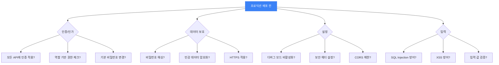

# 보안 안티패턴: 숨기면 안전할까?

*"비밀번호를 코드에 넣어도 아무도 모를 거야" — 아, GitHub가 알아요*

---

시리즈의 마지막 파트다. 지금까지 코드 안티패턴, 아키텍처 안티패턴, 프로세스 안티패턴을 다뤘다면, 마지막은 가장 결과가 심각한 영역인 보안 안티패턴이다. 코드가 더러우면 유지보수가 어렵고, 아키텍처가 나쁘면 확장이 어렵지만, 보안이 뚫리면? 데이터 유출, 서비스 중단, 법적 소송, 기업 이미지 추락. 한 번의 보안 사고가 회사를 망하게 할 수 있다.

이번 글에서는 가장 흔하면서도 가장 위험한 보안 안티패턴 두 가지를 다룬다: Security through Obscurity(모호함을 통한 보안)와 Insecure Defaults(안전하지 않은 기본값).

---

## 1. Security through Obscurity (모호함을 통한 보안)

### 이게 뭔데

<Callout type="warning" title="Security through Obscurity란">
구현을 숨기는 것 자체를 보안 수단으로 삼는 접근법. "공격자가 우리 시스템의 내부 구조를 모르면 공격할 수 없을 것"이라는 가정. 이 가정은 거의 항상 틀리다. Kerckhoffs의 원칙(1883): "암호 시스템의 안전성은 알고리즘의 비밀성이 아니라 키의 비밀성에 의존해야 한다."
</Callout>

"소스코드를 공개하지 않으면 취약점을 모를 거야." "API 엔드포인트를 복잡하게 만들면 아무도 못 찾을 거야." "관리자 페이지 URL을 `/admin-secret-page-xyz`로 하면 되지."

이런 생각을 해본 적 있다면, 또는 이런 코드를 본 적 있다면, 그게 바로 Security through Obscurity다. "숨기면 안전하다"는 환상.

### 이런 코드

**난독화된 URL로 인증 대체:**

```typescript
// "아무도 이 URL을 모를 거야"
app.get("/api/x7k9m2p4q/users", async (req, res) => {
  // 인증 체크 없음! URL이 복잡하니까 안전하다고?
  const users = await db.users.findAll();
  res.json(users); // 모든 사용자 정보 반환 (비밀번호 포함)
});

// "관리자 페이지는 URL을 모르면 접근 못 해"
app.get("/super-secret-admin-dashboard-2024", (req, res) => {
  // 인증 체크 없음!
  res.render("admin-dashboard");
});
```

브라우저의 네트워크 탭, 서버 로그, URL 히스토리, 자동 스캐너(dirb, gobuster)... URL을 숨기는 건 보안이 아니다. 5분이면 찾는다.

**인코딩으로 암호화 흉내:**

```typescript
// "Base64로 인코딩하면 아무도 못 읽겠지"
function "storePassword"(password: string): string {
  return Buffer.from(password).toString("base64");
  // admin123 → YWRtaW4xMjM=
  // Base64는 인코딩이지 암호화가 아님!
  // 아무 디코더에 넣으면 원문 그대로 나옴
}

// "비밀 키를 환경변수가 아니라 코드에 넣어도 괜찮아. 어차피 컴파일되니까"
const JWT_SECRET = "my-super-secret-key-2024";
// git에 올라감. GitHub 검색하면 나옴. 끝.
```

**클라이언트 사이드에서만 검증:**

```typescript
// 프론트엔드
function handleAdminAccess() {
  if (currentUser.role === "admin") {
    // 관리자 메뉴 보여주기
    showAdminPanel();
  }
}

// 백엔드 API
app.delete("/api/users/:id", async (req, res) => {
  // 서버에서 권한 체크 없음!
  // "프론트에서 관리자만 이 버튼을 볼 수 있으니까 괜찮아"
  await db.users.delete(req.params.id);
  res.json({ success: true });
});
// curl로 직접 호출하면? 누구나 삭제 가능.
```

### 제대로 된 보안

같은 시나리오를 올바르게 구현하면:

```typescript
// JWT 인증 + RBAC(역할 기반 접근 제어)
import jwt from "jsonwebtoken";
import bcrypt from "bcrypt";

// 미들웨어: 모든 보호된 라우트에 적용
function authenticate(req: Request, res: Response, next: NextFunction) {
  const token = req.headers.authorization?.replace("Bearer ", "");
  if (!token) return res.status(401).json({ error: "인증 필요" });

  try {
    const payload = jwt.verify(token, process.env.JWT_SECRET!);
    req.user = payload;
    next();
  } catch {
    return res.status(401).json({ error: "유효하지 않은 토큰" });
  }
}

// 역할 기반 권한 체크
function authorize(...roles: string[]) {
  return (req: Request, res: Response, next: NextFunction) => {
    if (!roles.includes(req.user.role)) {
      return res.status(403).json({ error: "권한 없음" });
    }
    next();
  };
}

// 비밀번호는 bcrypt로 해싱 (단방향, 복호화 불가)
async function hashPassword(password: string): Promise<string> {
  return bcrypt.hash(password, 12);
}

// API 라우트: 인증 + 권한 체크 필수
app.get("/api/users", authenticate, authorize("admin"), async (req, res) => {
  const users = await db.users.findAll({
    select: { id: true, name: true, email: true }, // 비밀번호 제외!
  });
  res.json(users);
});

app.delete("/api/users/:id", authenticate, authorize("admin"), async (req, res) => {
  // 서버에서 반드시 권한 확인
  await db.users.delete(req.params.id);
  res.json({ success: true });
});
```

<Callout type="error" title="모호함은 보안이 아닌 이유">
- **소스코드 비공개는 보안이 아님**: Kerckhoffs의 원칙 — 시스템은 소스코드가 공개되어도 안전해야 한다. Linux, OpenSSL은 오픈소스인데도 세계에서 가장 많이 사용되는 보안 시스템의 기반.
- **URL을 복잡하게 만드는 건 보안이 아님**: 자동 스캐너가 몇 분이면 모든 엔드포인트를 찾아냄.
- **인코딩(Base64)은 암호화가 아님**: 디코딩 도구에 넣으면 원문 그대로 나옴. 누구나 알고 있는 "비밀".
- **클라이언트 사이드 검증만으로는 보안이 아님**: 프론트엔드 코드는 브라우저 개발자 도구로 누구나 볼 수 있고 수정할 수 있음.
- **비밀 키를 코드에 넣는 건 재앙**: git 히스토리에 영원히 남음. GitHub의 secret scanning이 감지해서 알려주기도 함.
</Callout>

<Callout type="info" title="Kerckhoffs의 원칙 (1883)">
"암호 시스템은 시스템의 모든 것이 공개되어 있어도, 키만 비밀이면 안전해야 한다." 140년 전의 원칙인데 아직도 보안의 근간이다. 이 원칙을 현대적으로 해석하면: 소스코드가 공개되어도, API 구조가 알려져도, 시스템은 안전해야 한다. 보안은 "숨기기"가 아니라 "올바른 설계"에서 나온다.
</Callout>

### 모호함이 쓸모없는 건 아니다

한 가지 주의할 점. "모호함 = 완전히 쓸모없다"는 아니다. 모호함은 보안의 **유일한** 수단이 되면 안 되지만, **추가적인** 레이어로는 의미가 있을 수 있다. 예를 들어:

- 서버의 버전 정보를 응답 헤더에서 제거하는 것 (공격자에게 정보를 덜 주는 것)
- 에러 메시지에서 내부 구조를 노출하지 않는 것 (스택 트레이스를 프로덕션에서 숨기기)
- 관리자 페이지의 URL을 예측 불가능하게 만드는 것 (인증과 함께 사용할 때)

이런 것들은 "Defense in Depth"(다층 방어)의 일부로서 의미가 있다. 핵심은 "모호함이 유일한 보호 수단이면 안 된다"는 것.

---

## 2. Insecure Defaults (안전하지 않은 기본값)

### 이게 뭔데

<Callout type="warning" title="Insecure Defaults란">
시스템의 기본 설정이 안전하지 않아서, 사용자/개발자가 별도의 보안 조치를 취하지 않으면 취약한 상태로 운영되는 것. "Out of the box" 상태가 곧 위험 상태. 보안은 기본값이어야 하는데, 현실에서는 편의가 기본값인 경우가 너무 많다.
</Callout>

프레임워크, 라이브러리, 서버를 처음 설치하면 기본 설정이 있다. 이 기본 설정이 "안전"하면 개발자가 의도적으로 보안을 낮추지 않는 한 안전하다. 하지만 기본 설정이 "편리하지만 안전하지 않은" 경우, 보안에 대해 잘 모르는 개발자가 그대로 프로덕션에 배포하게 됨.

### 이런 설정

**CORS: 모든 출처 허용:**

```typescript
// 이러면 전 세계 어디서든 API 호출 가능
app.use(cors({
  origin: "*",
  credentials: true, // 쿠키까지 전달 허용? 재앙.
}));
```

**Express: 보안 헤더 미설정:**

```typescript
// 기본 Express는 보안 헤더가 거의 없음
const app = express();
app.listen(3000);
// X-Content-Type-Options? 없음
// X-Frame-Options? 없음
// Content-Security-Policy? 없음
// Strict-Transport-Security? 없음
```

**기본 인증 정보:**

```yaml
# Docker로 MongoDB 띄우기 — 인증 없이 접근 가능
services:
  mongodb:
    image: mongo:latest
    ports:
      - "27017:27017"
    # 인증 설정? 없음. 누구나 접속 가능.
```

**JWT 알고리즘 미지정:**

```typescript
// alg: "none"을 허용하면 토큰 위조 가능
const payload = jwt.verify(token, secret);
// 공격자가 alg을 "none"으로 변경하면 시그니처 검증을 건너뜀
```

**디버그 모드 프로덕션 노출:**

```typescript
// 개발 중에는 편리하지만...
app.use(errorHandler({
  showStackTrace: true, // 스택 트레이스가 사용자에게 노출
  showSQLQueries: true, // SQL 쿼리가 에러 페이지에 표시
}));
// 이걸 프로덕션에 그대로 배포하면?
// 공격자에게 내부 구조, 파일 경로, DB 스키마를 알려주는 꼴
```

**기본 관리자 계정:**

```
admin / admin
admin / password
root / root
admin / 1234

// "나중에 바꾸자"
// "나중"은 오지 않는다. 그리고 Shodan이 찾아온다.
```

### 안전한 기본값

같은 설정을 안전하게:

```typescript
// CORS: 허용 출처를 명시적으로 지정
app.use(cors({
  origin: ["https://myapp.com", "https://admin.myapp.com"],
  methods: ["GET", "POST", "PUT", "DELETE"],
  credentials: true,
}));

// Helmet: 보안 헤더 자동 설정
import helmet from "helmet";
app.use(helmet()); // 한 줄이면 됨
// X-Content-Type-Options: nosniff
// X-Frame-Options: DENY
// Content-Security-Policy: ...
// Strict-Transport-Security: ...

// JWT: 알고리즘 명시적 지정
const payload = jwt.verify(token, secret, {
  algorithms: ["HS256"], // 허용 알고리즘을 명시. "none" 차단.
});

// 에러 핸들러: 환경별 분기
app.use((err: Error, req: Request, res: Response, next: NextFunction) => {
  console.error(err); // 로그에는 상세 정보

  res.status(500).json({
    error: process.env.NODE_ENV === "production"
      ? "Internal Server Error" // 프로덕션에서는 일반적인 메시지만
      : err.message,            // 개발 환경에서만 상세 정보
  });
});
```

```yaml
# MongoDB: 인증 활성화
services:
  mongodb:
    image: mongo:latest
    ports:
      - "27017:27017"
    environment:
      MONGO_INITDB_ROOT_USERNAME: ${MONGO_USER}
      MONGO_INITDB_ROOT_PASSWORD: ${MONGO_PASSWORD}
    command: ["--auth"]
```

<Callout type="success" title="보안 기본 원칙">
- **Deny by default**: 기본값은 "거부"여야 함. 필요한 것만 명시적으로 허용.
- **최소 권한 원칙(Principle of Least Privilege)**: 사용자/서비스에게 필요한 최소한의 권한만 부여. admin 권한을 기본으로 주지 않는다.
- **방어 in depth(Defense in Depth)**: 하나의 보안 레이어가 뚫려도 다음 레이어가 막아주는 다층 방어. CORS + 인증 + 권한 체크 + 입력 검증 + 암호화.
- **보안은 기능이다**: "나중에 보안 추가"는 없다. 보안은 처음부터 설계에 포함되어야 한다. 나중에 추가하면 비용이 10배.
- **설정을 검증하라**: 프로덕션 배포 전에 보안 설정을 체크리스트로 검증. 자동화할 수 있으면 더 좋음.
</Callout>

### 현실적인 보안 체크리스트

모든 보안 위협을 막을 수는 없지만, 기본적인 것들은 지켜야 한다:



이건 최소한의 체크리스트다. 실제 보안은 이보다 훨씬 넓고 깊은 영역이지만, 최소한 이 정도는 지켜야 "기본적인 보안 수준"이라고 할 수 있다.

---

## 시리즈를 마치며

20편에 걸쳐 52가지 안티패턴을 다뤘다. God Object에서 시작해서 Security through Obscurity로 마무리. 코드 레벨에서 프로세스 레벨까지, 개인의 습관에서 팀의 문화까지 폭넓게 훑었다.

이 시리즈를 다 읽었다면, 한 가지만 기억해라:

**"안티패턴을 아는 것"이 핵심이 아니라 "왜 이런 안티패턴이 생기는지 이해하는 것"이 핵심이다.**

대부분의 안티패턴은 세 가지 원인 중 하나에서 비롯된다:

1. **시간 압박**: "빨리 해야 하니까" — 데스마치, 카우보이 코딩, 스모크 앤 미러스
2. **무지**: "몰라서" — Security through Obscurity, 카고 컬트, 매직 넘버
3. **과도한 의욕**: "이것도 넣으면 좋겠다" — Feature Creep, Speculative Generality, 불필요한 추상화

패턴을 외우지 말고, 코드를 의심하는 습관을 기르자. "이 코드가 왜 이렇게 생겼지?" "이 설계가 정말 필요한가?" "이 프로세스가 올바른 방향인가?"

그리고 가장 중요한 건: **안티패턴을 발견했을 때 부끄러워하지 마라.** 모든 개발자가 안티패턴을 만든다. 중요한 건 인식하고 개선하는 것이지, 처음부터 완벽한 코드를 짜는 게 아님. 완벽한 코드는 존재하지 않는다. "어제보다 나은 코드"만 있을 뿐이다.

<Callout type="note" title="마지막 한 마디">
"The only way to go fast, is to go well." — Robert C. Martin

빠르게 가는 유일한 방법은 잘 하는 것이다. 안티패턴을 피하는 게 느린 것처럼 보일 수 있지만, 장기적으로는 가장 빠른 길이다.
</Callout>

---

_← [이전 글: 카우보이와 히어로](/docs/articles/anti-patterns/19.cowboy-and-hero) | [다음 글: N+1 쿼리와 지수적 복사](/docs/articles/anti-patterns/21.hidden-performance-traps) →_