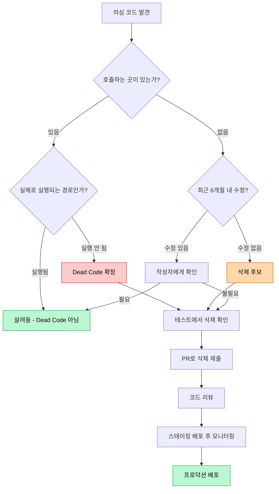

# 죽은 코드 3종: 용암, 시체, 닻

*제거해야 하는데 아무도 건드리지 못하는 코드들*

---

모든 코드베이스에는 유령이 살고 있다. 아무도 부르지 않는 함수, 절대 실행되지 않는 조건문, "나중에 쓸 것 같아서" 남겨둔 추상화 레이어. 이런 코드들은 그 자체로 에러를 일으키지 않기 때문에 오히려 더 위험하다. 조용히 코드베이스를 오염시키면서, 새로운 개발자를 혼란에 빠뜨리고, 빌드 시간을 늘리고, "이거 뭔데?"라는 질문만 양산한다.

이번 글에서 다루는 세 가지 안티패턴은 공통점이 있다 — **제거해야 하는 코드가 제거되지 않는다.** 하지만 제거되지 않는 이유는 각각 다름. Lava Flow는 **두려움** 때문에, Dead Code는 **무관심** 때문에, Boat Anchor는 **미련** 때문에 살아남는다. 이유는 달라도 해결법은 같다: **과감하게 지워라.** Git이 기억해주니까.

코드를 작성하는 것보다 삭제하는 것이 더 어렵다는 건 모든 시니어 개발자가 동의할 거다. 하지만 코드를 지우는 건 기술 부채를 갚는 가장 확실한 방법이기도 하다. 지금부터 그 "지워야 하는" 코드들의 정체를 하나씩 파헤쳐보자.

---

## 1. Lava Flow (용암 흐름)

### 이게 뭔데

<Callout type="warning" title="정의">
원래 목적을 잃었지만, 사이드이펙트가 두려워서 아무도 제거하지 못하는 코드. 화산에서 분출된 용암이 굳어서 지형의 일부가 된 것처럼, 코드베이스의 일부로 굳어버린 정체불명의 코드 덩어리.
</Callout>

Lava Flow의 전형적인 시나리오: 프로토타입이나 급한 핫픽스로 작성된 코드가 프로덕션에 들어간다. 시간이 지나면서 원래 작성자가 퇴사하거나 맥락을 잊어버린다. 이제 아무도 이 코드가 왜 있는지 모르지만, 삭제하면 뭔가 깨질 것 같아서 건드리지 않는다. 이 코드 위에 새로운 코드가 쌓이고, 시간이 더 지나면 "이건 원래부터 있던 거야"라는 인식이 생긴다. 용암이 굳어서 바위가 된 것이다.

가장 무서운 건 Lava Flow가 **자기 강화**된다는 점이다. 아무도 건드리지 않으니 테스트도 없고, 테스트가 없으니 더 건드리기 무섭고, 건드리기 무서우니 그 위에 우회하는 코드를 쌓는다. 그러면 의존성이 생기면서 삭제가 더 어려워지고... 악순환이다.

### 이런 코드

```typescript
// payment-utils.ts — 누구도 건드리지 못하는 "유산"

/**
 * @deprecated 새 결제 시스템으로 마이그레이션 완료... 했을 수도 있음
 * @author 김대리 (2019년 퇴사)
 */
export function legacyProcessPaymentV2(amount: number, type: string): any {
  // V1은 어디 갔냐고? 아무도 모름
  if (type === "SPECIAL_CLIENT_123") {
    // 이거 삭제하면 결제 안 됨 - 2019년 김대리
    return { processed: true, gateway: "old_pg", amount: amount * 1.033 };
  }
  return processPaymentInternal(amount, type);
}

// TODO: 임시 코드 (2020-03-15)
// ↑ 2년이 지났지만 여전히 "임시"
function processPaymentInternal(amount: number, type: string): any {
  const result = { processed: false, gateway: "", amount: 0 };
  // eslint-disable-next-line no-constant-condition
  if (false) {
    // 이 블록은 실행 안 되지만 지우면 안 됨
    // 2020년 12월 장애 때 이거 지웠다가 롤백했음
    result.gateway = "emergency_pg";
  }
  result.gateway = "main_pg";
  result.amount = amount;
  result.processed = true;
  return result;
}

// fixForClient123 — 이름 그대로. 123번 클라이언트를 위한 핫픽스
// 123번 클라이언트가 아직 있는지조차 불명
export function fixForClient123(data: any): any {
  if (data?.clientId === 123) {
    data.discount = 0.15; // 구두 약속이라 계약서 없음
    data.skipValidation = true; // "검증 건너뛰기" — 왜??
  }
  return data;
}

// handleEdgeCase_DO_NOT_REMOVE
// 이름에 "삭제 금지"가 들어가 있음. 이유는 git blame에도 없음
export function handleEdgeCase_DO_NOT_REMOVE(input: Record<string, any>): Record<string, any> {
  if (input.amount === 0 && input.type === "refund") {
    input.amount = 0.01; // 0원 환불 시 PG사 에러 방지... 인 것 같음
  }
  return input;
}

// ===== 아래 코드는 주석 처리했지만 삭제는 못 함 =====
// function oldCalculateTax(amount: number): number {
//   // 2019년 세율 기준
//   return amount * 0.1;  // VAT 10%
// }
//
// function processRefundV1(orderId: string): Promise<void> {
//   // 이 함수 삭제하면 processRefundV3에 영향 있을 수 있음
//   // (확인 안 해봄)
//   return fetch(`/api/refund/${orderId}`, { method: "POST" });
// }
```

<Callout type="error" title="뭐가 문제인가">
- 함수명에 `legacy`, `V2`, `fix`, `DO_NOT_REMOVE` 같은 경고 표시가 가득
- 주석이 코드보다 많고, 대부분 "왜 있는지 모르겠지만 지우지 마" 류
- `if (false)` 블록 — 실행 안 되지만 삭제하면 안 된다는 전설
- 주석 처리된 코드가 "혹시 모르니까" 남아있음
- `any` 타입 범벅 — 당시에는 급해서, 이제는 무서워서 타입을 못 달음
</Callout>

### 감지하는 법

- `git blame` 찍어보면 마지막 수정이 2년 이상 전
- 함수명에 `legacy`, `old`, `temp`, `hack`, `workaround`, `DO_NOT_REMOVE` 포함
- 주석에 "삭제 금지", "이유는 모르겠지만 필요함", "건드리지 마", "임시" 류
- `@deprecated` 태그가 달려있지만 여전히 호출되고 있음
- 주석 처리된 코드 블록이 수십 줄씩 존재
- 특정 클라이언트/날짜/사람 이름이 하드코딩되어 있음

<Callout type="info" title="용암 흐름의 진짜 원인">
Lava Flow는 기술적 문제가 아니라 **조직적 문제**다. 문서화 없이 퇴사, 인수인계 부재, "돌아가면 건드리지 마" 문화가 원인이다. 코드 리뷰에서 "이거 왜 있어요?"라는 질문을 하는 문화가 없으면 용암은 계속 쌓인다.
</Callout>

---

## 2. Dead Code (죽은 코드)

### 이게 뭔데

<Callout type="warning" title="정의">
어떤 실행 경로(execution path)로도 도달할 수 없는 코드. Unreachable code. 프로그램이 실행될 때 절대로 실행되지 않지만, 코드베이스에 존재하면서 혼란을 일으키는 코드.
</Callout>

Lava Flow와 비슷해 보이지만 핵심 차이가 있다. Lava Flow는 "실행될 수도 있지만 확인할 수 없어서" 못 지우는 거고, Dead Code는 **확실하게 실행되지 않는** 코드다. 리팩토링 후 호출처가 사라진 함수, 피처 플래그로 영원히 꺼진 기능, 절대 true가 될 수 없는 조건문 안의 코드. 차이는 **확실성**에 있음. Dead Code는 분석하면 "이거 안 쓰인다"고 증명할 수 있다.

Dead Code가 무해해 보이지만 실제 피해는 상당하다. 새 팀원이 코드를 읽다가 "이 함수 뭐 하는 거지?"라며 30분을 허비하고, 리팩토링할 때 "이것도 같이 바꿔야 하나?" 고민하느라 시간을 쓰고, IDE 검색 결과에 노이즈로 나타나서 진짜 코드를 찾기 어렵게 만든다. 빌드 시간에도 영향을 주고, 번들 사이즈도 키운다.

### 이런 코드

```typescript
// user-service.ts — 죽은 코드 박물관

import { sendEmail } from "./email"; // 이 import는 아래에서 안 쓰임
import { Logger } from "./logger";   // 이것도 안 쓰임

interface UserPreferencesV1 {
  // 이 인터페이스를 구현하는 곳이 없음
  theme: "light" | "dark";
  language: string;
  notifications: boolean;
}

export class UserService {
  // 이 메서드를 호출하는 곳이 프로젝트 어디에도 없음
  async migrateUserData(userId: string): Promise<void> {
    const oldData = await this.fetchLegacyData(userId);
    const newData = this.transformData(oldData);
    await this.saveMigratedData(userId, newData);
  }

  private async fetchLegacyData(userId: string): Promise<any> {
    return fetch(`/api/legacy/users/${userId}`).then((r) => r.json());
  }

  private transformData(data: any): any {
    return { ...data, migrated: true, migratedAt: new Date() };
  }

  private async saveMigratedData(userId: string, data: any): Promise<void> {
    await fetch(`/api/users/${userId}/migrate`, {
      method: "POST",
      body: JSON.stringify(data),
    });
  }

  async getUser(userId: string): Promise<User> {
    const user = await this.fetchUser(userId);

    // 이 조건은 절대 true가 될 수 없음 (getUser는 항상 string을 받으니까)
    if (typeof userId === "number") {
      return this.getUserByNumericId(userId as unknown as number);
    }

    const isActive = true; // 항상 true
    if (!isActive) {
      // 여기 코드는 절대 실행 안 됨
      await this.deactivateUser(userId);
      return { ...user, status: "inactive" };
    }

    return user;
  }

  // 위의 unreachable 코드에서만 호출됨 → 결국 이것도 dead code
  private async deactivateUser(userId: string): Promise<void> {
    await fetch(`/api/users/${userId}/deactivate`, { method: "POST" });
  }

  // 숫자 ID는 3년 전에 폐기됨
  private async getUserByNumericId(id: number): Promise<User> {
    return fetch(`/api/users/legacy/${id}`).then((r) => r.json());
  }

  private async fetchUser(userId: string): Promise<User> {
    return fetch(`/api/users/${userId}`).then((r) => r.json());
  }
}

// 이 상수는 어디서도 참조 안 됨
const MAX_RETRY_COUNT = 5;
const DEFAULT_TIMEOUT = 3000;
const LEGACY_API_BASE = "https://old-api.example.com";
```

<Callout type="error" title="뭐가 문제인가">
- 사용하지 않는 import 2개
- 구현체가 없는 인터페이스 (`UserPreferencesV1`)
- 외부에서 호출되지 않는 public 메서드 (`migrateUserData`)와 그 헬퍼 메서드 3개
- `typeof userId === "number"` — string 파라미터를 number로 체크하는 무의미한 조건
- `isActive`가 항상 `true`라서 아래 블록이 dead code
- dead code에서만 호출되는 메서드들도 연쇄적으로 dead code
- 참조되지 않는 상수 3개
</Callout>

### 감지하는 법

- IDE의 **unused** 경고 — 대부분의 IDE가 사용하지 않는 import, 변수, 함수를 표시해줌
- **테스트 커버리지** 0%인 코드 — 테스트도 안 하는 코드는 안 쓰는 코드일 확률이 높음
- `export`되지 않고 같은 파일에서도 호출되지 않는 private 함수
- TypeScript 컴파일러의 `noUnusedLocals`, `noUnusedParameters` 옵션 활성화
- ESLint의 `no-unused-vars`, `no-unreachable` 규칙
- 번들 분석기(webpack-bundle-analyzer 등)에서 tree-shaking 후에도 남는 코드

<Callout type="note" title="Dead Code vs Lava Flow 구분법">
확신이 있으면 Dead Code, 확신이 없으면 Lava Flow. "이 함수 호출하는 곳이 없는데?" → Dead Code. "이 함수가 뭔지는 모르겠는데 지우면 뭔가 깨질 것 같아" → Lava Flow. Dead Code는 도구로 감지 가능하지만, Lava Flow는 맥락 파악이 필요함.
</Callout>

---

## 3. Boat Anchor (닻)

### 이게 뭔데

<Callout type="warning" title="정의">
현재는 사용되지 않지만 "나중에 필요할 것 같아서" 만들어 놓거나 남겨둔 코드. 배에서 내린 닻처럼 코드베이스를 무겁게 만들고, 진행을 방해한다. YAGNI(You Aren't Gonna Need It) 원칙의 정면 위반.
</Callout>

Boat Anchor의 핵심은 **미련**이다. "이 추상화 레이어, 나중에 데이터베이스 변경할 때 유용할 거야." "이 Generic 인터페이스, 다른 구현체가 생기면 쓸 거야." "이 피처 플래그 뒤의 기능, 다음 분기에 켤 거야." 그런데 그 "나중"은 거의 오지 않는다. 통계적으로 "나중에 필요할 것 같아서" 만든 코드의 80% 이상은 결국 사용되지 않는다는 연구 결과도 있다.

Dead Code와의 차이점이 뭐냐면, Dead Code는 **원래 쓰였다가 안 쓰이게 된** 코드고, Boat Anchor는 **처음부터 쓰이지 않을 코드를 미리 만들어 놓은** 것이다. 의도가 다른 거. Dead Code는 실수로 남은 잔해지만, Boat Anchor는 의식적으로 만든 "미래를 위한 투자"다. 문제는 그 투자가 거의 항상 손실로 끝난다는 것.

### 이런 코드

```typescript
// "미래를 위한" 코드들

// Generic 인터페이스 — 구현체는 하나뿐
interface IRepository<T, ID = string> {
  findById(id: ID): Promise<T | null>;
  findAll(filter?: Partial<T>): Promise<T[]>;
  create(entity: Omit<T, "id">): Promise<T>;
  update(id: ID, entity: Partial<T>): Promise<T>;
  delete(id: ID): Promise<boolean>;
  count(filter?: Partial<T>): Promise<number>;
  exists(id: ID): Promise<boolean>;
  findByIds(ids: ID[]): Promise<T[]>;
  createBatch(entities: Omit<T, "id">[]): Promise<T[]>;
  // 위 9개 메서드 중 실제 사용되는 건 findById, create, update 3개뿐
}

// 유일한 구현체
class PostgresUserRepository implements IRepository<User> {
  async findById(id: string): Promise<User | null> { /* 구현 */ return null; }
  async findAll(): Promise<User[]> { return []; }
  async create(entity: Omit<User, "id">): Promise<User> { /* 구현 */ return {} as User; }
  async update(id: string, entity: Partial<User>): Promise<User> { /* 구현 */ return {} as User; }
  async delete(id: string): Promise<boolean> { return false; }  // 호출하는 곳 없음
  async count(): Promise<number> { return 0; }                  // 호출하는 곳 없음
  async exists(id: string): Promise<boolean> { return false; }  // 호출하는 곳 없음
  async findByIds(ids: string[]): Promise<User[]> { return []; } // 호출하는 곳 없음
  async createBatch(entities: Omit<User, "id">[]): Promise<User[]> { return []; } // 호출하는 곳 없음
}

// "다른 DB로 바꿀 수 있도록" 만든 추상화 — 3년째 PostgreSQL만 사용 중
class DatabaseAbstractionLayer {
  private strategy: "postgres" | "mysql" | "mongodb" = "postgres";

  getRepository<T>(entityName: string): IRepository<T> {
    switch (this.strategy) {
      case "postgres":
        return this.getPostgresRepo(entityName);
      case "mysql":
        throw new Error("MySQL은 아직 미구현"); // 3년째 "아직"
      case "mongodb":
        throw new Error("MongoDB는 아직 미구현"); // 이것도 3년째
    }
  }

  private getPostgresRepo<T>(entityName: string): IRepository<T> {
    // 실제로는 UserRepository만 반환
    return new PostgresUserRepository() as unknown as IRepository<T>;
  }
}

// Feature flag 뒤에 숨은 완성된 기능 — 1년째 OFF
const FEATURE_FLAGS = {
  ENABLE_AI_RECOMMENDATIONS: false,    // "다음 분기에 켤 예정" (4분기 전)
  ENABLE_SOCIAL_LOGIN: false,          // "법무팀 검토 중" (1년 전)
  ENABLE_REALTIME_NOTIFICATIONS: false, // "인프라 준비되면" (인프라팀 해체됨)
};

// AI 추천 기능 — 완전히 구현되어 있지만 한 번도 활성화된 적 없음
class AIRecommendationEngine {
  async getRecommendations(userId: string): Promise<Product[]> {
    if (!FEATURE_FLAGS.ENABLE_AI_RECOMMENDATIONS) return [];
    // 아래 코드는 한 번도 실행된 적 없음
    const userData = await this.analyzeUserBehavior(userId);
    const model = await this.loadModel("recommendation-v2");
    return model.predict(userData);
  }

  private async analyzeUserBehavior(userId: string): Promise<any> {
    // 300줄의 정교한 분석 로직... 한 번도 실행된 적 없음
    return {};
  }

  private async loadModel(modelName: string): Promise<any> {
    // ML 모델 로딩 로직... 한 번도 실행된 적 없음
    return { predict: () => [] };
  }
}
```

<Callout type="error" title="뭐가 문제인가">
- `IRepository` 인터페이스에 메서드 9개, 실제 사용은 3개 — 나머지 6개는 "나중을 위해"
- 구현체가 `PostgresUserRepository` 하나뿐인데 Generic 인터페이스로 도배
- `DatabaseAbstractionLayer`가 "MySQL, MongoDB 대비"인데 3년째 PostgreSQL만 사용
- Feature flag 뒤에 완성된 코드가 1년째 잠들어 있음 — 유지보수 비용만 발생
- AI 추천 엔진 300줄이 한 번도 실행된 적 없지만, 관련 의존성은 번들에 포함됨
</Callout>

### 감지하는 법

- 커밋 메시지에 "나중에 필요할 수도 있으니까", "확장성을 위해", "미래 대비" 포함
- 구현은 완성인데 호출하는 곳이 없음
- interface에 구현체가 하나뿐인데 Generic으로 도배
- Feature flag가 `false`인 채로 3개월 이상 방치
- `throw new Error("미구현")` 또는 `// TODO: implement` 가 6개월 이상 된 코드
- 의존성(npm 패키지)은 설치되어 있는데 import하는 파일이 없음

<Callout type="note" title="YAGNI vs 확장성 설계">
"미래를 대비하지 말라"는 말이 아님. **현재 요구사항에 맞는 깔끔한 코드**를 작성하되, **변경하기 쉬운 구조**로 만들라는 것. `IRepository`를 미리 만드는 대신, PostgresUserRepository를 직접 쓰되 클래스로 캡슐화해두면 나중에 인터페이스 추출이 5분이면 된다. 추상화의 비용은 지금 지불하지만, 그 이점은 미래에 발생할지 모를 일에 달려있다. 미래가 불확실하면 비용을 지불하지 마라.
</Callout>

---

## 공통 해결법

이 세 가지 안티패턴의 해결법은 결국 하나로 귀결된다: **과감하게 삭제해라.** 물론 쉽지 않다. "이거 지우면 프로덕션 터지면 어쩌지?"라는 공포는 자연스러운 반응이다. 그래서 안전하게 삭제하기 위한 전략이 필요함.

<Callout type="success" title="죽은 코드 퇴치법">
1. **Git이 기억한다**: 삭제해도 git history에 남아있다. 정말 필요하면 되살릴 수 있으니 과감하게 지워라. `git log --diff-filter=D --summary` 한 줄이면 삭제된 파일을 찾을 수 있다.
2. **테스트 커버리지 확인**: 커버리지 0%인 코드는 삭제 후보 1순위. 테스트가 없다는 건 아무도 이 코드의 동작을 보장하지 않는다는 뜻이다.
3. **정기적인 코드 청소 스프린트**: "Dead Code Day"를 분기마다 진행해라. 하루를 잡고 팀 전체가 죽은 코드를 사냥하는 것.
4. **IDE 경고를 무시하지 마라**: unused import, unused variable 경고가 시작점이다. ESLint `no-unused-vars`를 error로 설정해라.
5. **YAGNI**: "You Aren't Gonna Need It." 필요할 때 만들어라. 미래를 예측하는 능력을 과대평가하지 마라.
</Callout>

### 안전한 삭제를 위한 프로세스



### 도구 활용

| 목적 | 도구 | 설명 |
|---|---|---|
| 미사용 코드 탐지 | `ts-prune` | TypeScript 프로젝트에서 export되었지만 import 안 된 코드 탐지 |
| 미사용 의존성 | `depcheck` | package.json에는 있지만 코드에서 안 쓰는 패키지 탐지 |
| 번들 분석 | `webpack-bundle-analyzer` | 번들에 포함된 불필요한 코드 시각화 |
| 커버리지 분석 | `c8`, `istanbul` | 실행되지 않는 코드 영역 식별 |
| 코드 검색 | `grep -r "함수명"` | 특정 함수/변수가 어디서 참조되는지 전체 검색 |

### 세 가지의 핵심 차이 정리

| | Lava Flow | Dead Code | Boat Anchor |
|---|---|---|---|
| **생존 이유** | 두려움 | 무관심 | 미련 |
| **만들어진 시점** | 과거 (핫픽스, 프로토타입) | 과거 (리팩토링 잔해) | 현재 (미래 대비) |
| **특징** | 목적을 아는 사람이 없음 | 실행 경로가 없음 | 실행은 가능하나 호출 안 됨 |
| **감지 난이도** | 높음 (맥락 필요) | 낮음 (도구로 감지) | 중간 (의도 파악 필요) |
| **삭제 위험도** | 높음 (사이드이펙트 불명) | 낮음 (안 쓰이니까) | 낮음 (안 쓰이니까) |
| **예방법** | 문서화, 인수인계 | 린팅, 커버리지 | YAGNI 원칙 |

<Callout type="note" title="삭제는 기능이다">
코드를 지우는 것도 프로덕션에 가치를 더하는 작업이다. 줄 수가 적은 코드베이스는 읽기 쉽고, 유지보수하기 쉽고, 버그가 적다. "오늘 200줄 삭제했습니다"는 "오늘 200줄 작성했습니다"만큼 — 어쩌면 그 이상으로 — 자랑스러운 성과다. 코드 리뷰에서 삭제 PR이 올라오면 박수를 쳐주자.
</Callout>

---

_← [이전 글: 파스타 코드 3형제](/docs/articles/anti-patterns/2.pasta-code) | [다음 글: 매직 넘버와 하드코딩](/docs/articles/anti-patterns/4.magic-and-hardcoding) →_