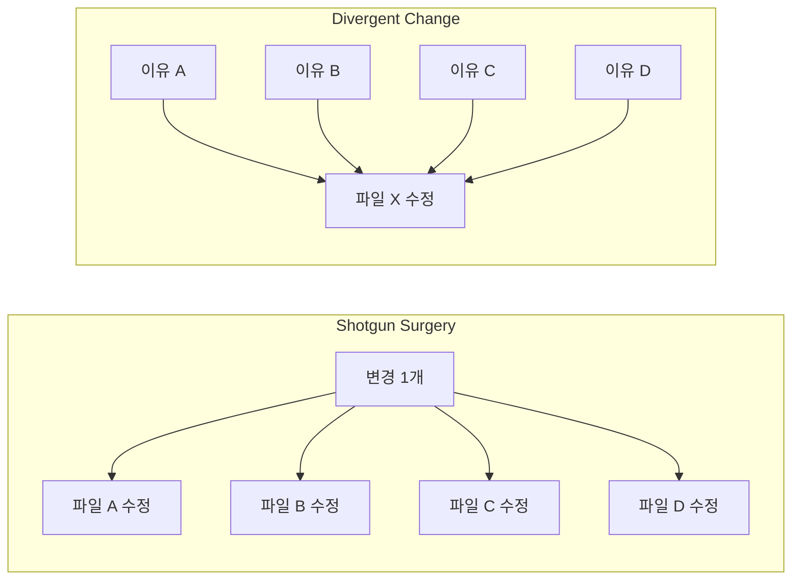

# 변경 전파 쌍: Shotgun Surgery와 Divergent Change

*하나를 고치면 열 개가 깨지거나, 열 가지 이유로 하나를 고치거나*

---

Martin Fowler의 리팩토링 책에서 나온 유명한 코드 냄새 한 쌍이다. Shotgun Surgery(산탄총 수술)와 Divergent Change(확산적 변경). 이름만 들으면 뭔가 비슷한 것 같은데, 실제로는 정확히 역관계에 있다. 하나는 변경이 사방으로 퍼지는 문제이고, 다른 하나는 변경이 한 곳으로 몰리는 문제다.

둘 다 단일 책임 원칙(SRP) 위반이라는 같은 뿌리에서 나왔지만, 방향이 정반대라서 해결 방법도 정반대다. 하나는 "모아라"이고 다른 하나는 "나눠라"임. 이번 글에서 이 쌍둥이를 함께 뜯어보자.

## 1. Shotgun Surgery (산탄총 수술)

### 이게 뭔데

하나의 기능 변경이 여러 클래스/파일에 동시에 수정을 요구하는 구조. 산탄총을 쏘면 탄환이 사방으로 퍼지듯이, 변경 하나가 코드베이스 여기저기로 퍼져나간다. "로그 포맷 하나 바꾸려면 47개 파일을 수정해야 합니다"가 이거다.

<Callout type="warning" title="Shotgun Surgery란">
하나의 변경 요구가 발생했을 때, 여러 개의 서로 다른 클래스/모듈을 동시에 수정해야 하는 코드 냄새. 관련 로직이 시스템 전체에 분산되어 있기 때문에 발생한다. 변경 누락이 곧 버그가 된다.
</Callout>

이 안티패턴의 가장 무서운 점은 **변경 누락**이다. 10개 파일을 수정해야 하는데 9개만 수정하면? 나머지 1개에서 버그가 터진다. 그리고 그 버그는 보통 프로덕션에서 발견됨.

### 이런 코드

시나리오: 유저에 `phoneNumber` 필드를 추가해야 한다. 얼마나 많은 파일을 건드려야 하는지 보자.

```typescript
// 1. Entity 수정
class UserEntity {
  id: string;
  name: string;
  email: string;
  phoneNumber: string; // ← 추가
}

// 2. DTO 수정
interface UserDTO {
  id: string;
  name: string;
  email: string;
  phoneNumber: string; // ← 추가
}

// 3. 생성 요청 수정
interface CreateUserRequest {
  name: string;
  email: string;
  phoneNumber: string; // ← 추가
}

// 4. 수정 요청 수정
interface UpdateUserRequest {
  name?: string;
  email?: string;
  phoneNumber?: string; // ← 추가
}

// 5. 검증 로직 수정
class UserValidator {
  validate(data: CreateUserRequest): string[] {
    const errors: string[] = [];
    if (!data.name) errors.push("이름 필수");
    if (!data.email) errors.push("이메일 필수");
    if (data.phoneNumber && !/^01\d{8,9}$/.test(data.phoneNumber)) {
      errors.push("전화번호 형식 오류"); // ← 추가
    }
    return errors;
  }
}

// 6. Mapper 수정
class UserMapper {
  toDTO(entity: UserEntity): UserDTO {
    return {
      id: entity.id,
      name: entity.name,
      email: entity.email,
      phoneNumber: entity.phoneNumber, // ← 추가
    };
  }

  toEntity(dto: CreateUserRequest): Partial<UserEntity> {
    return {
      name: dto.name,
      email: dto.email,
      phoneNumber: dto.phoneNumber, // ← 추가
    };
  }
}

// 7. Repository 수정
class UserRepository {
  async create(data: Partial<UserEntity>): Promise<UserEntity> {
    return db.query(
      "INSERT INTO users (name, email, phone_number) VALUES ($1, $2, $3)", // ← 수정
      [data.name, data.email, data.phoneNumber], // ← 수정
    );
  }
}

// 8. Service 수정
class UserService {
  async createUser(req: CreateUserRequest): Promise<UserDTO> {
    // phoneNumber 관련 로직 추가...
  }
}

// 9. Controller 수정
class UserController {
  async create(req: Request, res: Response) {
    // phoneNumber 파싱 추가...
  }
}

// 10. 테스트 수정
describe("UserService", () => {
  it("should create user with phone number", () => {
    // phoneNumber 관련 테스트 추가...
  });
});
```

필드 하나 추가하는데 **10개 파일**을 동시에 수정해야 한다. 하나라도 빠뜨리면 컴파일 에러가 나면 그나마 다행이고, 런타임에 `undefined`가 되면 프로덕션에서 터진다.

<Callout type="error" title="뭐가 문제냐면">
- **변경 비용 폭발**: 간단한 필드 추가 하나에 10개 파일 수정. 개발 시간보다 수정할 파일 찾는 시간이 더 걸림
- **변경 누락 위험**: 수정해야 할 파일 하나를 놓치면 그대로 버그. 코드 리뷰에서도 놓치기 쉬움
- **불필요한 레이어 증식**: Entity, DTO, Request, Response, Mapper가 모두 거의 같은 구조를 반복하고 있음
- **변경 충돌**: 여러 개발자가 각각 다른 필드를 추가하면 모든 파일에서 merge conflict 발생
</Callout>

### 고친 코드

```typescript
// 핵심 원칙: 변경의 이유가 같은 것들은 한 곳에 모은다

// User 모듈 — 유저 관련 정의가 한 곳에
interface User {
  id: string;
  name: string;
  email: string;
  phoneNumber?: string;
}

// 스키마 기반 검증 — 타입 정의와 검증이 하나의 소스에서 파생
const userSchema = z.object({
  name: z.string().min(1, "이름 필수"),
  email: z.string().email("이메일 형식 오류"),
  phoneNumber: z.string().regex(/^01\d{8,9}$/, "전화번호 형식 오류").optional(),
});

type CreateUserInput = z.infer<typeof userSchema>;

// Repository — DB 매핑을 자동화
class UserRepository {
  async create(input: CreateUserInput): Promise<User> {
    // ORM이 필드 매핑을 자동으로 처리
    return this.orm.user.create({ data: input });
  }

  async findById(id: string): Promise<User | null> {
    return this.orm.user.findUnique({ where: { id } });
  }
}

// Service — 비즈니스 로직만
class UserService {
  constructor(private repo: UserRepository) {}

  async createUser(input: CreateUserInput): Promise<User> {
    return this.repo.create(input);
  }
}
```

`phoneNumber` 필드를 추가하려면? `User` 인터페이스에 필드 추가하고, `userSchema`에 검증 규칙 추가하면 끝이다. 2개 파일, 2줄 수정. 타입은 스키마에서 자동 추론되고, ORM이 DB 매핑을 자동으로 처리하니까.

<Callout type="success" title="개선 핵심">
- **Single Source of Truth**: 스키마 하나에서 타입, 검증, 직렬화가 파생됨
- **ORM 활용**: 수동 SQL 매핑 대신 ORM이 필드 추가를 자동 처리
- **불필요한 레이어 제거**: Entity ≠ DTO ≠ Request ≠ Response가 정말 필요한지 질문하라. 대부분은 같은 구조의 복사본일 뿐이다
</Callout>

---

## 2. Divergent Change (확산적 변경)

### 이게 뭔데

Shotgun Surgery의 정확한 역관계. 하나의 클래스가 서로 다른 여러 이유로 자주 변경되는 구조. "이 파일은 DB 스키마 바뀔 때도 고치고, API 스펙 바뀔 때도 고치고, 비즈니스 룰 바뀔 때도 고쳐야 해요"가 이거다.

<Callout type="warning" title="Divergent Change란">
하나의 클래스/모듈이 서로 관련 없는 여러 종류의 변경 요구에 의해 반복적으로 수정되는 코드 냄새. 단일 책임 원칙(SRP)의 정면 위반. 클래스에 여러 개의 변경 축(axis of change)이 존재한다.
</Callout>

이건 God Object의 동생 같은 거임. God Object만큼 거대하진 않지만, 한 클래스 안에 관련 없는 책임이 여러 개 뒤섞여 있어서 다양한 이유로 변경이 발생한다.

### 이런 코드

```typescript
// 모든 걸 다 하는 리포트 서비스
class ReportService {
  // ---- 변경 이유 1: 데이터 소스가 바뀔 때 ----
  async fetchSalesData(startDate: Date, endDate: Date): Promise<SalesRow[]> {
    const query = `
      SELECT p.name, SUM(o.quantity) as total_qty, SUM(o.amount) as total_amount
      FROM orders o
      JOIN products p ON o.product_id = p.id
      WHERE o.created_at BETWEEN $1 AND $2
      GROUP BY p.name
      ORDER BY total_amount DESC
    `;
    return db.query(query, [startDate, endDate]);
  }

  async fetchUserActivityData(userId: string): Promise<ActivityRow[]> {
    return db.query("SELECT * FROM user_activities WHERE user_id = $1", [userId]);
  }

  // ---- 변경 이유 2: 리포트 포맷이 바뀔 때 ----
  formatAsHTML(data: SalesRow[]): string {
    let html = "<table><tr><th>상품명</th><th>수량</th><th>금액</th></tr>";
    for (const row of data) {
      html += `<tr><td>${row.name}</td><td>${row.total_qty}</td><td>${row.total_amount}</td></tr>`;
    }
    html += "</table>";
    return html;
  }

  formatAsCSV(data: SalesRow[]): string {
    const header = "상품명,수량,금액\n";
    const rows = data.map(r => `${r.name},${r.total_qty},${r.total_amount}`).join("\n");
    return header + rows;
  }

  // ---- 변경 이유 3: 내보내기 방식이 바뀔 때 ----
  async exportToPDF(html: string, filename: string): Promise<Buffer> {
    const browser = await puppeteer.launch();
    const page = await browser.newPage();
    await page.setContent(html);
    const pdf = await page.pdf({ format: "A4" });
    await browser.close();
    return pdf;
  }

  async exportToExcel(data: SalesRow[], filename: string): Promise<Buffer> {
    const workbook = new ExcelJS.Workbook();
    const sheet = workbook.addWorksheet("Sales");
    sheet.addRow(["상품명", "수량", "금액"]);
    for (const row of data) {
      sheet.addRow([row.name, row.total_qty, row.total_amount]);
    }
    return workbook.xlsx.writeBuffer() as Promise<Buffer>;
  }

  // ---- 변경 이유 4: 발송 방식이 바뀔 때 ----
  async sendByEmail(to: string, subject: string, attachment: Buffer, filename: string): Promise<void> {
    await transporter.sendMail({
      to,
      subject,
      attachments: [{ filename, content: attachment }],
    });
  }

  async uploadToS3(buffer: Buffer, key: string): Promise<string> {
    await s3.putObject({ Bucket: "reports", Key: key, Body: buffer });
    return `https://reports.s3.amazonaws.com/${key}`;
  }

  // ---- 변경 이유 5: 필터링 로직이 바뀔 때 ----
  filterByCategory(data: SalesRow[], category: string): SalesRow[] {
    return data.filter(row => row.category === category);
  }

  filterByMinAmount(data: SalesRow[], minAmount: number): SalesRow[] {
    return data.filter(row => row.total_amount >= minAmount);
  }
}
```

이 클래스를 git log로 살펴보면 이런 커밋 히스토리가 보인다.

```
a3f2c1d  "리포트 SQL 쿼리 최적화" (데이터 소스)
b7e4a8f  "PDF 리포트 폰트 변경" (내보내기)
c9d1e3g  "CSV에 카테고리 컬럼 추가" (포맷)
d2f8b6h  "S3 업로드에 ACL 설정 추가" (발송)
e5a9c7i  "매출 최소 금액 필터 조건 수정" (필터링)
```

5가지 완전히 다른 이유로 같은 파일이 수정되고 있다. 이건 SRP 위반의 교과서적 사례임.

<Callout type="error" title="뭐가 문제냐면">
- **변경 충돌**: SQL 최적화하는 사람과 PDF 폰트 바꾸는 사람이 같은 파일에서 충돌
- **불안정성**: 이메일 발송 로직 수정했는데 엉뚱하게 CSV 포맷이 깨짐 (같은 클래스라 사이드 이펙트)
- **테스트 범위 과잉**: 필터링 로직 하나 바꿨는데 ReportService 전체 테스트를 돌려야 함
- **확장 어려움**: 새 포맷(JSON) 추가하려면 이미 거대한 이 클래스를 더 키워야 함
</Callout>

### 고친 코드

```typescript
// 변경 이유별로 클래스를 분리한다

// 1. 데이터 소스 담당
class ReportDataFetcher {
  async fetchSalesData(startDate: Date, endDate: Date): Promise<SalesRow[]> {
    return db.query("SELECT ... FROM orders ... WHERE ...", [startDate, endDate]);
  }

  async fetchUserActivity(userId: string): Promise<ActivityRow[]> {
    return db.query("SELECT * FROM user_activities WHERE user_id = $1", [userId]);
  }
}

// 2. 포맷 담당 (Strategy 패턴)
interface ReportFormatter {
  format(data: SalesRow[]): string;
}

class HTMLReportFormatter implements ReportFormatter {
  format(data: SalesRow[]): string {
    let html = "<table><tr><th>상품명</th><th>수량</th><th>금액</th></tr>";
    for (const row of data) {
      html += `<tr><td>${row.name}</td><td>${row.total_qty}</td><td>${row.total_amount}</td></tr>`;
    }
    return html + "</table>";
  }
}

class CSVReportFormatter implements ReportFormatter {
  format(data: SalesRow[]): string {
    const header = "상품명,수량,금액\n";
    return header + data.map(r => `${r.name},${r.total_qty},${r.total_amount}`).join("\n");
  }
}

// 3. 내보내기 담당
interface ReportExporter {
  export(content: string, filename: string): Promise<Buffer>;
}

class PDFExporter implements ReportExporter {
  async export(html: string, filename: string): Promise<Buffer> {
    const browser = await puppeteer.launch();
    const page = await browser.newPage();
    await page.setContent(html);
    const pdf = await page.pdf({ format: "A4" });
    await browser.close();
    return pdf;
  }
}

// 4. 발송 담당
interface ReportSender {
  send(buffer: Buffer, destination: string, filename: string): Promise<void>;
}

class EmailReportSender implements ReportSender {
  async send(buffer: Buffer, to: string, filename: string): Promise<void> {
    await transporter.sendMail({ to, subject: "리포트", attachments: [{ filename, content: buffer }] });
  }
}

// 5. 오케스트레이션 — 위 모듈들을 조합
class ReportPipeline {
  constructor(
    private fetcher: ReportDataFetcher,
    private formatter: ReportFormatter,
    private exporter: ReportExporter,
    private sender: ReportSender,
  ) {}

  async generate(params: ReportParams): Promise<void> {
    const data = await this.fetcher.fetchSalesData(params.startDate, params.endDate);
    const formatted = this.formatter.format(data);
    const exported = await this.exporter.export(formatted, params.filename);
    await this.sender.send(exported, params.destination, params.filename);
  }
}
```

이제 변경 이유별로 파일이 분리되어 있다. PDF 폰트를 바꾸고 싶으면 `PDFExporter`만 수정하면 됨. SQL을 최적화하고 싶으면 `ReportDataFetcher`만 건드리면 된다. 새 포맷(JSON)을 추가하고 싶으면? `ReportFormatter` 인터페이스를 구현하는 새 클래스를 만들면 되고, 기존 코드는 한 줄도 안 건드려도 된다.

---

## 역관계 비교

이 두 코드 냄새가 정확히 역관계라는 걸 시각적으로 보자.



| | Shotgun Surgery | Divergent Change |
|---|---|---|
| **패턴** | 1개 변경 → N개 파일 수정 | N개 이유 → 1개 파일 수정 |
| **근본 원인** | 관련 로직이 너무 흩어져 있음 | 무관한 로직이 한 곳에 모여 있음 |
| **SRP 위반 방향** | 하나의 책임이 여러 클래스에 분산 | 여러 책임이 하나의 클래스에 집중 |
| **해결 방향** | 흩어진 로직을 **한 곳으로 모아라** | 뒤섞인 로직을 **책임별로 나눠라** |
| **리팩토링 기법** | Move Method, Move Field, Inline Class | Extract Class, Extract Module |
| **신호** | "이 기능 바꾸려면 몇 개 파일 건드려야 해?" | "이 파일 왜 또 수정해?" (git log 확인) |

<Callout type="note" title="핵심">
Shotgun Surgery는 관련 로직이 너무 흩어져 있어서 생긴다. 해결책은 **모아라**.

Divergent Change는 무관한 로직이 한 곳에 모여 있어서 생긴다. 해결책은 **나눠라**.

둘 다 결국 "변경의 이유가 같은 것들끼리 모아놓아라"는 SRP의 다른 표현이다.
</Callout>

## 실무에서 감지하는 법

두 냄새 모두 git 히스토리에서 명확하게 감지할 수 있다.

**Shotgun Surgery 감지:**

```bash
# 특정 커밋에서 수정된 파일 수 확인
git log --oneline --name-only | head -50

# 커밋당 수정 파일 수가 평균 5개 이상이면 의심
git log --shortstat --oneline | head -30
```

커밋 하나에 항상 5~10개 파일이 같이 수정되는 패턴이 보이면 Shotgun Surgery다. 특히 커밋 메시지가 "add phoneNumber field to user"인데 수정된 파일이 10개면 확실함.

**Divergent Change 감지:**

```bash
# 특정 파일의 수정 빈도와 수정 이유 확인
git log --oneline -- src/services/report-service.ts | head -20
```

한 파일의 커밋 빈도가 비정상적으로 높고, 커밋 메시지가 서로 다른 도메인을 언급하면 Divergent Change다. "fix SQL query", "update PDF template", "add email CC" 같은 무관한 커밋들이 같은 파일에 몰려 있으면 빨간불.

<Callout type="info" title="이상적인 상태">
이상적으로는, 하나의 기능 변경이 하나의 모듈 수정으로 완료되어야 한다. 그리고 하나의 모듈은 하나의 이유로만 변경되어야 한다. 이게 바로 SRP가 말하는 "변경의 축(axis of change)을 기준으로 모듈을 나눠라"의 의미다. 현실에서 100% 달성은 어렵지만, 방향은 항상 이쪽이어야 한다.
</Callout>

---

_← [이전 글: Anemic과 Fat](/docs/articles/anti-patterns/7.anemic-and-fat) | [다음 글: 커플링 냄새](/docs/articles/anti-patterns/9.coupling-smells) →_
