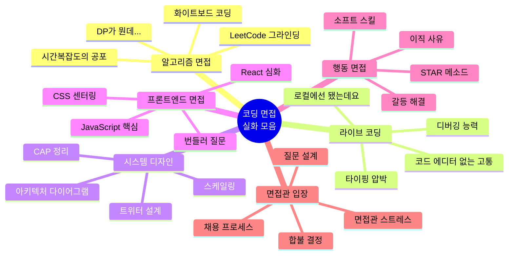

코딩 면접. 이 두 글자만 들어도 PTSD 오는 개발자들 많을 거임.

LeetCode 500문제 풀었는데 면접장에서 이진탐색도 못 짜고,
시스템 디자인하라니까 "음... 서버가 있고... DB가 있고..." 하다가 시간 다 가고,
"CSS로 가운데 정렬 해보세요" 했더니 머리가 하얘지는 경험.

**다 겪어봤음. 그리고 이 시리즈는 그 처참한 경험들의 기록임.**

---

## 이 시리즈는 뭔가

면접 준비 가이드? 아님. 그런 거 원하면 Cracking the Coding Interview 사면 됨.

이건 **면접장에서 실제로 벌어지는 일들**에 대한 솔직한 이야기임.
알고리즘 면접에서 멘탈 터지는 것부터, 면접관이 되어서야 알게 되는 것까지.

웃기면서도 뼈 때리는 내용으로 채웠음. 면접 준비하면서 읽으면 좋고,
면접 끝나고 자괴감 올 때 읽으면 "아 나만 이런 거 아니었구나" 하고 위안이 될 거임.



---

## 시리즈 목차

| # | 제목 | 핵심 내용 |
|---|------|----------|
| 1 | [알고리즘 면접](/docs/articles/coding-interview-stories/1.algorithm-interview) | 화이트보드 앞에서 멘탈 나간 썰 |
| 2 | [라이브 코딩](/docs/articles/coding-interview-stories/2.live-coding) | "제 로컬에선 됐는데요" |
| 3 | [시스템 디자인](/docs/articles/coding-interview-stories/3.system-design) | "트위터를 설계해보세요" 앞에서 멈춘 사람들 |
| 4 | [프론트엔드 면접](/docs/articles/coding-interview-stories/4.frontend-interview) | CSS 센터링도 모르면서 리액트 고수라고? |
| 5 | [행동 면접](/docs/articles/coding-interview-stories/5.behavioral-interview) | "팀원과 갈등이 있었던 경험을 말해보세요" |
| 6 | [면접관 입장](/docs/articles/coding-interview-stories/6.interviewer-side) | 면접 보는 것보다 면접 보게 하는 게 더 힘든 이유 |

---

## 이 시리즈가 필요한 사람

- **면접 준비 중인 개발자** — 뭘 준비해야 하는지 감 잡고 싶은 사람
- **면접 끝나고 자괴감 오는 개발자** — 나만 이런 거 아니라는 위안이 필요한 사람
- **면접관이 된 시니어 개발자** — 어떻게 면접을 진행해야 할지 고민인 사람
- **취준생** — 코딩 면접이 뭔지 아예 모르는 사람

<Callout type="warning" title="주의사항">
이 시리즈는 특정 회사의 면접 문제를 유출하는 것이 아님.
일반적으로 알려진 면접 유형과 패턴에 대한 이야기임.
실제 면접 경험은 각색되었으며, 개인이나 회사를 특정하지 않음.
그냥 공감하면서 읽으면 됨 ㅋㅋ
</Callout>

---

## 면접 준비의 현실

면접 준비는 크게 3단계로 나뉨:

**1단계: "아 이번엔 제대로 준비해야지"**
- LeetCode Premium 결제함
- System Design Primer 북마크함
- 알고리즘 책 새로 삼

**2단계: "이거 언제 다 하냐"**
- Easy 문제 3개 풀고 벽 느낌
- Medium 문제 보다가 해설 먼저 봄
- "이걸 45분 안에 풀라고?"

**3단계: "그냥 면접 가자"**
- 준비 절반도 못 함
- "실력으로 부딪혀보자" (= 포기)
- 면접장에서 후회함

<Callout type="info" title="통계가 말해주는 것">
평균적으로 개발자들은 이직 면접 준비에 **2-4주**를 쓴다고 함.
하지만 실제로 "제대로" 준비하는 시간은 그 중 **30% 미만**이라는 설문 결과가 있음.
나머지 70%는 유튜브에서 면접 후기 영상 보면서 불안해하는 시간임 ㅋㅋ
</Callout>

---

## 면접 유형별 난이도 체감

```
알고리즘 면접:   ████████░░ 8/10  (준비 가능하지만 운 요소 큼)
라이브 코딩:     ███████░░░ 7/10  (실력이 그대로 드러남)
시스템 디자인:   █████████░ 9/10  (경험 없으면 답이 없음)
프론트엔드:      ██████░░░░ 6/10  (범위가 넓어서 문제)
행동 면접:       █████░░░░░ 5/10  (준비하면 쉬운데 안 함)
면접관 입장:     ██████████ 10/10 (아무도 가르쳐주지 않음)
```

각 유형별로 뭐가 힘든지, 어떻게 대처하면 되는지 하나씩 파헤쳐볼 거임.

그럼 시작해보자. 첫 번째는 모든 개발자의 공포, **알고리즘 면접**부터.
