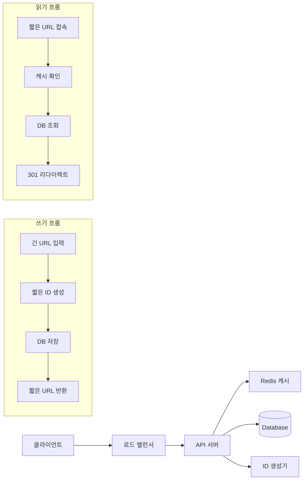
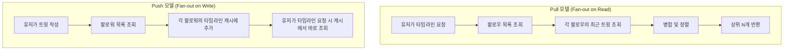

시스템 디자인 면접은 **경험치 게임**임.

알고리즘은 패턴 외우면 어떻게든 되고, 라이브 코딩은 연습하면 늘지만,
시스템 디자인은 **실제로 큰 시스템을 운영해본 경험**이 없으면 진짜 답이 없음.

그래서 주니어한테는 잘 안 물어봄. 근데 3년차 넘어가면 슬슬 나오기 시작하고,
5년차부터는 면접의 메인이 됨. 그리고 이때부터 멘탈이 나가기 시작함.

"트위터를 설계해보세요."

이 한 마디 앞에서 수많은 시니어 개발자들이 멈춤.

---

## 시스템 디자인 면접의 구조

보통 45분~1시간 동안 진행되는데, 4단계로 나뉨:

### 1단계: 요구사항 정리 (5-10분)

**이 단계를 건너뛰면 무조건 감점.** 근데 긴장하면 바로 설계부터 시작함.

```
면접관: "URL 단축 서비스를 설계해보세요."

나쁜 응답: "네, 일단 서버를 만들고 DB에 URL을 저장하면..."

좋은 응답:
"몇 가지 확인하고 싶은 게 있습니다."
- "하루에 URL 생성 요청이 얼마나 되나요?" (트래픽 규모)
- "단축 URL의 만료 기간이 있나요?" (데이터 생명주기)
- "커스텀 단축 URL을 지원해야 하나요?" (기능 범위)
- "읽기와 쓰기 비율이 어떻게 되나요?" (읽기 최적화 vs 쓰기 최적화)
- "분석 기능(클릭 수 등)이 필요한가요?" (부가 기능)
```

<Callout type="warning" title="요구사항 정리를 왜 해야 하는가">
면접관은 **모호한 문제를 일부러 줌.**
"트위터를 설계해보세요"는 답이 수백 가지임.

실제 트위터의 모든 기능을 45분 안에 설계할 수는 없으니까,
**범위를 좁히는 것**이 첫 번째 과제임.

이 과정에서 면접관은 "이 사람이 프로덕트 요구사항을 분석할 줄 아는가?"를 봄.
코드만 짤 줄 아는 개발자 vs 비즈니스를 이해하는 개발자의 차이가 여기서 드러남.
</Callout>

> 다만 현실은 위의 "좋은 응답" 만큼 깔끔하지 않음. 긴장하면 질문 5개 중 2개만 떠오르고 바로 설계로 직진하게 됨. 그래도 *완벽한 질문 리스트* 보다 중요한 건 "이 문제는 범위가 넓으니 좁히겠다" 는 **태도를 먼저 보이는 것**. "트래픽 규모부터 확인하겠습니다" 한마디로 시작하면 나머지는 설계하면서 채워도 됨. 면접관이 보는 건 질문의 완성도가 아니라 *무작정 코딩부터 안 하는 습관* 임.

### 2단계: 고수준 설계 (10-15분)

큰 그림을 그리는 단계. 컴포넌트 간 관계를 보여줘야 함.

### 3단계: 상세 설계 (15-20분)

핵심 컴포넌트를 깊게 파고드는 단계. 여기서 실력이 드러남.

### 4단계: 병목 분석 & 스케일링 (5-10분)

"트래픽 10배 늘면 어떻게 할 건가요?" 같은 질문.

---

## 실전 예시 1: URL 단축 서비스

가장 클래식한 시스템 디자인 문제. TinyURL, bit.ly 같은 서비스를 만들어보라는 거.

### 요구사항 정리

```
- 긴 URL → 짧은 URL 변환
- 짧은 URL → 원래 URL로 리다이렉트
- DAU 100만, 하루 URL 생성 10만 건
- 읽기:쓰기 비율 = 10:1
- URL 만료 기간 5년
- 분석 기능 불필요 (스코프 축소)
```

### 용량 추정 (Back-of-the-Envelope)

면접관이 이걸 좋아함. 숫자로 규모를 추정하는 능력.

```
쓰기: 10만/일 = ~1.2/초 (피크 시 x5 = 6/초)
읽기: 100만/일 = ~12/초 (피크 시 x5 = 60/초)

5년간 저장: 10만 x 365 x 5 = 1.825억 URL
각 URL 평균 500 bytes → 약 91GB
```

이 숫자들을 *그냥 계산하고 넘기면* 의미가 없음. 핵심은 **숫자가 설계 결정을 어떻게 바꾸는가** 임:

- **91GB** → 단일 서버 디스크에 들어감. 그래서 *처음부터 샤딩할 필요가 없음*. 여기서 "확장 가능하게 샤딩하겠습니다" 라고 하면 오히려 오버엔지니어링으로 보임.
- **읽기 60/초** → 우습게 낮음. DB 한 대로도 충분. *그런데도 캐시를 쓰는 이유* 는 부하 때문이 아니라 *지연시간* — 리다이렉트는 체감상 즉각이어야 하니까.
- **읽기:쓰기 = 10:1** → 이 비율이 *Read Replica를 정당화* 함. 5:5였으면 복제 매력이 확 떨어짐.

같은 "URL 단축기" 라도 91GB냐 91TB냐에 따라 완전히 다른 시스템이 됨. Back-of-the-Envelope의 목적은 *숫자 자랑* 이 아니라 **어떤 복잡도가 정당화되고 어떤 게 과한지를 가르는 잣대** 를 만드는 것.

<Callout type="info" title="Back-of-the-Envelope 계산 팁">
면접에서 정확한 숫자를 기대하지 않음. **자릿수가 맞으면 됨.**

기억해두면 좋은 숫자들:
- 1일 = 약 86,400초 ≈ 10만 초
- 1년 ≈ 3,000만 초
- QPS 1,000 = 하루 약 8,640만 요청
- 1GB = 10억 바이트
- 1TB = 1조 바이트
</Callout>

### 고수준 설계



### 핵심 설계: 단축 ID 생성

이게 이 문제의 **핵심**임. 어떻게 유니크한 짧은 ID를 만들 것인가?

```typescript
// 방법 1: 해시 기반
// MD5/SHA256의 앞 7자리 사용
function generateShortUrl(longUrl: string): string {
  const hash = md5(longUrl);
  return hash.substring(0, 7);  // 예: "a3f2b1c"
}
// 문제: 충돌 가능성! 다른 URL이 같은 7자리 해시를 가질 수 있음
// 해결: 충돌 시 뒤에 문자 추가하거나 다른 해시 함수 사용

// 방법 2: Base62 인코딩
// auto-increment ID를 Base62로 변환
const CHARS = '0123456789abcdefghijklmnopqrstuvwxyzABCDEFGHIJKLMNOPQRSTUVWXYZ';

function toBase62(id: number): string {
  let result = '';
  while (id > 0) {
    result = CHARS[id % 62] + result;
    id = Math.floor(id / 62);
  }
  return result || '0';
}
// 62^7 = 약 3.5조 → 충분히 많은 고유 ID 생성 가능
// 문제: auto-increment는 단일 DB에서만 가능. 분산 환경에서는?

// 방법 3: 분산 ID 생성 (Snowflake 방식)
// Twitter의 Snowflake에서 영감 받은 방식
// 64bit: [1bit 사인] [41bit 타임스탬프] [10bit 워커ID] [12bit 시퀀스]
function generateSnowflakeId(workerId: number, sequence: number): bigint {
  const timestamp = BigInt(Date.now() - 1288834974657); // 커스텀 에폭
  const wId = BigInt(workerId);
  const seq = BigInt(sequence);

  return (timestamp << 22n) | (wId << 12n) | seq;
}
```

면접관이 "어떤 방법을 선택하실 건가요?" 물어보면:

```
규모가 작으면 → Base62 + auto-increment (간단함)
규모가 크면 → Snowflake 스타일 분산 ID (충돌 없음, 수평 확장 가능)
해시 방식은 → 충돌 처리가 번거로워서 추천하지 않음
```

### 데이터베이스 선택

```
면접관: "어떤 DB를 쓸 건가요?"

RDB (PostgreSQL, MySQL):
✅ ACID 보장, 관계형 쿼리
❌ 수평 확장이 어려움

NoSQL (DynamoDB, Cassandra):
✅ 수평 확장 쉬움, 쓰기 성능 좋음
❌ 일관성 보장이 어려움 (eventual consistency)

이 서비스의 특성:
- 키-값 조회가 대부분 (shortUrl → longUrl)
- 복잡한 쿼리 불필요
- 읽기 비율이 높음

→ NoSQL이 적합. DynamoDB나 Redis + RDB 조합 추천.
```

### 캐싱 전략

```
읽기 비율이 높으니까 캐싱이 중요함.

캐시: Redis
전략: Cache-Aside (Lazy Loading)

1. 짧은 URL로 요청이 옴
2. 캐시에서 먼저 조회
3. 캐시 히트 → 바로 리다이렉트
4. 캐시 미스 → DB 조회 → 캐시에 저장 → 리다이렉트

캐시 만료: LRU (Least Recently Used) + TTL 24시간
캐시 크기: 상위 20%의 URL이 트래픽의 80%를 차지 (파레토 법칙)
→ 전체 URL의 20%만 캐싱해도 충분
```

<Callout type="success" title="URL 단축 서비스 핵심 포인트 정리">
1. **ID 생성 방식** — Base62 vs 해시 vs Snowflake 비교 가능해야 함
2. **301 vs 302 리다이렉트** — 301은 영구(브라우저 캐싱), 302는 임시(분석 가능)
3. **캐싱** — Redis Cache-Aside 패턴
4. **DB** — NoSQL 키-값 저장소가 적합
5. **스케일링** — 읽기 무거우니 Read Replica + CDN 활용
</Callout>

---

## 실전 예시 2: 트위터 (소셜 피드)

"트위터를 설계해보세요" — 시스템 디자인 면접의 본 게임.

### 요구사항 정리

```
핵심 기능 (면접 시간 내 가능한 범위):
- 트윗 작성
- 타임라인 (홈 피드)
- 팔로우/언팔로우
- 트윗 검색 (시간 되면)

스코프 밖:
- DM, 알림, 트렌딩, 미디어 업로드 등

규모:
- DAU 1억
- 하루 트윗 5억 건
- 평균 팔로우 200명
- 일부 유저(셀럽)는 팔로워 수백만
```

### 가장 어려운 부분: 타임라인 생성

이게 트위터 설계의 **핵심 문제**임. 두 가지 접근 방식이 있음.



```typescript
// Pull 모델 (읽을 때 계산)
async function getTimeline(userId: string): Promise<Tweet[]> {
  // 1. 팔로우 목록 가져오기
  const following = await getFollowing(userId); // O(1)

  // 2. 각 팔로우의 최근 트윗 가져오기
  const tweets: Tweet[] = [];
  for (const followId of following) {
    const userTweets = await getRecentTweets(followId); // 200명이면 200번 쿼리!
    tweets.push(...userTweets);
  }

  // 3. 시간순 정렬 후 상위 N개 반환
  tweets.sort((a, b) => b.createdAt - a.createdAt);
  return tweets.slice(0, 20);
}
// 문제: 팔로우가 200명이면 200번 DB 쿼리 → 느림!
```

```typescript
// Push 모델 (쓸 때 미리 배포)
async function postTweet(userId: string, content: string): Promise<void> {
  // 1. 트윗 저장
  const tweet = await saveTweet(userId, content);

  // 2. 팔로워 목록 가져오기
  const followers = await getFollowers(userId);

  // 3. 각 팔로워의 타임라인 캐시에 추가
  for (const followerId of followers) {
    await addToTimelineCache(followerId, tweet); // 팔로워가 100만이면?!
  }
}

async function getTimeline(userId: string): Promise<Tweet[]> {
  // 캐시에서 바로 읽기 — 빠름!
  return await getTimelineCache(userId);
}
// 문제: 셀럽이 트윗하면 팔로워 수백만 명한테 다 써야 함 → 쓰기 폭발!
```

<Callout type="error" title="Pull vs Push의 딜레마">
**Pull 모델:**
- 읽기가 느림 (매번 계산)
- 쓰기가 빠름 (저장만 하면 됨)
- 셀럽한테 유리 (팔로워 많아도 쓰기 부담 없음)

**Push 모델:**
- 읽기가 빠름 (미리 계산해놨으니까)
- 쓰기가 느림 (팔로워한테 다 배포해야 함)
- 일반 유저한테 유리 (팔로워 적으니까 쓰기 부담 적음)

**실제 트위터의 해결책: 하이브리드!**
- 일반 유저 → Push 모델 (팔로워 적으니까)
- 셀럽 (팔로워 10만 이상) → Pull 모델 (읽을 때 합침)
- 타임라인 = Push로 받은 트윗 + 팔로우하는 셀럽의 최근 트윗 병합

다만 "하이브리드" 라는 한 단어는 면접에선 *마법의 정답* 처럼 들리지만, 진짜 어려움은 여기서 시작됨:
- **경계를 어디서 긋나** — 기준이 "팔로워 10만" 인데, 9만 9천에서 10만 1천이 되는 순간 모델이 바뀜. 그 전환을 어떻게 매끄럽게?
- **셀럽 판정이 동적** — 어제 일반 유저가 오늘 떡상하면? 실시간으로 모델을 갈아끼워야 함.
- **병합 비용** — 읽을 때마다 "Push 캐시 + 셀럽 Pull" 을 합치고 다시 정렬해야 함. 이게 또 다른 지연 요인.

"하이브리드요" 로 끝내면 표면만 아는 것. *"하이브리드인데, 경계값 근처 유저를 어떻게 다룰지가 진짜 어려운 부분입니다"* 까지 가면 깊이가 다르게 보임.
</Callout>

### 데이터 모델

```typescript
// 핵심 테이블 설계
interface Tweet {
  tweetId: string;        // Snowflake ID (시간순 정렬 가능)
  userId: string;
  content: string;        // 280자 제한
  createdAt: number;      // 타임스탬프
  mediaUrls?: string[];   // 이미지/동영상 URL
}

interface User {
  userId: string;
  username: string;
  displayName: string;
  followerCount: number;
  followingCount: number;
}

interface Follow {
  followerId: string;     // 팔로우 하는 사람
  followeeId: string;     // 팔로우 당하는 사람
  createdAt: number;
}

// 타임라인 캐시 (Redis Sorted Set)
// Key: timeline:{userId}
// Score: tweetId (Snowflake라 시간순 정렬됨)
// Value: 직렬화된 트윗 데이터
```

### 스케일링 전략

```
1. 데이터베이스:
   - 트윗 테이블: userId로 샤딩 (같은 유저의 트윗은 같은 샤드)
   - 팔로우 테이블: followerId로 샤딩
   - Read Replica로 읽기 분산

2. 캐싱:
   - 타임라인: Redis Sorted Set (메모리에 최근 800개 트윗 유지)
   - 유저 정보: Redis Hash
   - 핫 트윗: CDN + Redis

3. 메시지 큐:
   - 트윗 작성 → Kafka → 비동기로 팔로워에게 배포
   - 실시간성: 수 초 이내 타임라인에 반영

4. 검색:
   - Elasticsearch로 트윗 전문 검색
   - 실시간 인덱싱 (Kafka Consumer)
```

---

## 시스템 디자인 면접에서 꼭 알아야 하는 개념들

### 1. 스케일링

```
수직 확장 (Scale Up): 서버 사양을 올림
- CPU, RAM, SSD 업그레이드
- 한계가 있음 (물리적 한계)
- 비쌈

수평 확장 (Scale Out): 서버를 더 추가함
- 로드 밸런서로 분산
- 이론상 무한 확장
- 복잡함 (데이터 동기화, 세션 관리 등)

면접에서는 거의 항상 수평 확장을 기대함.
```

### 2. 로드 밸런싱

```
L4 로드 밸런서: TCP/UDP 레벨 (IP, 포트 기반)
- 빠름, 단순함
- 요청 내용을 볼 수 없음

L7 로드 밸런서: HTTP/HTTPS 레벨 (URL, 헤더 기반)
- URL 패턴별 라우팅 가능 (/api → API 서버, /static → 정적 서버)
- 느리지만 유연함

분배 알고리즘:
- Round Robin: 순서대로 돌아가면서
- Weighted Round Robin: 서버 성능에 따라 가중치
- Least Connections: 연결 수 가장 적은 서버로
- Consistent Hashing: 같은 키는 항상 같은 서버로 (캐시 효율!)
```

### 3. 캐싱

```typescript
// Cache-Aside (가장 흔한 패턴)
async function getData(key: string): Promise<Data> {
  // 1. 캐시에서 조회
  const cached = await redis.get(key);
  if (cached) return JSON.parse(cached);

  // 2. 캐시 미스 → DB 조회
  const data = await db.query(key);

  // 3. 캐시에 저장
  await redis.setex(key, 3600, JSON.stringify(data)); // TTL 1시간

  return data;
}

// Write-Through (쓸 때 캐시도 같이 업데이트)
async function setData(key: string, data: Data): Promise<void> {
  await db.save(key, data);
  await redis.setex(key, 3600, JSON.stringify(data));
}

// Write-Behind (쓸 때 캐시만, DB는 나중에 비동기로)
// 빠르지만 데이터 유실 위험
```

<Callout type="note" title="캐시 관련 면접 질문">
**"캐시 무효화(invalidation)는 어떻게 하나요?"**

컴퓨터 과학에서 2개의 어려운 문제가 있음:
1. 캐시 무효화
2. 이름 짓기
3. Off-by-one 에러

농담이 아님. 캐시 무효화는 진짜 어려운 문제임.

일반적인 전략:
- **TTL**: 시간이 지나면 자동 만료 (가장 단순)
- **이벤트 기반**: 데이터 변경 시 캐시 삭제 (복잡하지만 정확)
- **버전**: 캐시 키에 버전 넣기 (배포 시 유용)
</Callout>

### 4. 데이터베이스 샤딩

```
샤딩: 데이터를 여러 DB 서버에 분산 저장

샤딩 키 선택이 핵심:
- userId로 샤딩 → 같은 유저의 데이터는 같은 DB에
  ✅ 유저별 쿼리가 빠름
  ❌ 유저마다 데이터 양이 다름 (핫스팟 문제)

- 지역별 샤딩 → 같은 지역의 데이터는 같은 DB에
  ✅ 지역별 쿼리 빠름
  ❌ 서울에 유저가 몰리면 불균형

- 해시 기반 샤딩 → hash(key) % N 으로 분배
  ✅ 균등 분배
  ❌ 범위 쿼리 어려움

Consistent Hashing:
- 샤드 추가/제거 시 최소한의 데이터만 이동
- 대부분의 분산 시스템이 사용
```

### 5. CAP 정리

```
Consistency (일관성): 모든 노드가 같은 데이터를 봄
Availability (가용성): 항상 응답함
Partition tolerance (분할 내성): 네트워크 분할이 생겨도 동작함

CAP 정리: 분산 시스템은 셋 중 최대 둘만 보장 가능

현실적으로 네트워크 분할(P)은 반드시 발생하므로:
- CP: 일관성 + 분할 내성 (예: 은행 시스템)
  → 네트워크 문제 시 응답 거부 (가용성 포기)
- AP: 가용성 + 분할 내성 (예: SNS, 쇼핑몰)
  → 네트워크 문제 시 오래된 데이터라도 보여줌 (일관성 포기)

면접관: "트위터는 CP인가요 AP인가요?"
나: "AP입니다. 타임라인이 1-2초 늦게 반영되는 건 괜찮지만,
     서비스가 안 되는 건 안 되니까요."
면접관: (고개 끄덕)
```

> *교과서 CAP 과 실전 CAP 의 간극*: 교과서는 "셋 중 둘" 이라고 깔끔하게 말하지만, 실무에선 P(분할 내성)는 *선택지가 아니라 전제* 임 — 네트워크는 반드시 끊김. 그래서 진짜 결정은 "C냐 A냐" 의 이분법조차 아님. **어느 데이터냐에 따라 다름.** 같은 트위터 안에서도 *팔로워 수 카운트* 는 좀 틀려도 되지만(AP), 만약 결제·송금이 있다면 그 경로는 정확해야 함(CP). 그래서 노련한 답은 "트위터는 AP입니다" 가 아니라 **"기능별로 다릅니다 — 타임라인은 AP, 결제가 있다면 그 경로만 CP로"** 임. CAP은 시스템 전체에 한 번 붙이는 라벨이 아니라 *데이터 흐름마다 따로 거는 선택* 임.

---

## 시스템 디자인 면접에서 자주 하는 실수

### 실수 1: 바로 기술 스택부터 말하기

```
❌ "Kubernetes 위에 마이크로서비스를 올리고, Kafka로 이벤트 드리븐하고,
    Redis Cluster로 캐싱하고..."

✅ "먼저 요구사항을 정리하면, 핵심 기능은 X, Y, Z이고,
    트래픽은 하루에 약 N건 예상되고,
    이 규모면 이런 아키텍처가 적합할 것 같습니다."
```

기술은 요구사항에 따라 선택하는 거지, 기술을 먼저 정하고 끼워맞추는 게 아님.

### 실수 2: 세부사항에 너무 빠지기

```
45분 중 20분을 DB 인덱스 설계에만 쓰면 안 됨.
면접관이 원하는 건 전체 그림임.

시간 배분:
- 요구사항 정리: 5분
- 고수준 설계: 10분
- 핵심 컴포넌트 상세: 15분
- 스케일링 & 병목: 10분
- 질의응답: 5분
```

### 실수 3: 트레이드오프를 말하지 않기

```
면접관이 듣고 싶은 건 "정답"이 아니라 "왜 그 선택을 했는가"임.

❌ "Redis를 쓰겠습니다"

✅ "캐싱에는 Redis를 쓰겠습니다. Memcached도 옵션인데,
    Redis가 Sorted Set을 지원해서 타임라인 정렬에 유리하고,
    지속성(persistence) 옵션도 있어서 캐시 워밍업 시간을 줄일 수 있습니다.
    다만 Memcached보다 메모리를 좀 더 쓰는 단점이 있습니다."
```

<Callout type="success" title="시스템 디자인에서 빛나는 키워드들">
이 키워드들을 자연스럽게 언급하면 인상 좋음:

- **SLA/SLO**: "이 서비스의 SLA는 99.9%로 잡겠습니다"
- **P99 레이턴시**: "P99 레이턴시를 200ms 이하로 맞추려면..."
- **CQRS**: "읽기와 쓰기를 분리하면..."
- **이벤트 소싱**: "상태 변경을 이벤트로 기록하면..."
- **Circuit Breaker**: "외부 서비스 장애 시 fallback..."
- **Rate Limiting**: "API abuse 방지를 위해..."
- **Idempotency**: "중복 요청에 안전하게..."

주의: 아는 척하다가 "그게 정확히 뭔가요?" 물어보면 설명 못 하면 역효과.
확실히 아는 것만 언급하기.
</Callout>

---

## 시스템 디자인 면접 준비 전략

### 읽어야 하는 것들

```
필독:
1. System Design Interview (Alex Xu) — 바이블
2. Designing Data-Intensive Applications (Martin Kleppmann) — 깊은 이해
3. System Design Primer (GitHub) — 무료

실제 사례 분석:
- Netflix: "어떻게 수억 명에게 영상을 스트리밍하는가"
- Uber: "어떻게 실시간 위치를 추적하는가"
- Instagram: "어떻게 수십억 장의 사진을 저장하는가"
- Discord: "어떻게 수백만 동시 접속을 처리하는가"

각 회사의 기술 블로그를 읽으면 실제 아키텍처를 알 수 있음.
```

### 연습 방법

```
1. 문제 선택 (예: "채팅 서비스 설계")
2. 타이머 45분 설정
3. 혼자 화이트보드(또는 종이)에 그리면서 설명
4. 목소리를 내서 말하기 (혼잣말이라도)
5. 끝나면 참고 자료와 비교
6. 놓친 부분 정리

이걸 주 2-3회, 4주면 대부분의 시스템 디자인 면접에 대응 가능함.
```

*어떤 10개를 고를 것인가* 가 막막한데, 핵심은 **패턴이 안 겹치게** 고르는 것. 비슷한 거 10개 하면 1개 한 것과 같음:

| 패턴 | 대표 문제 | 핵심 학습 |
|---|---|---|
| 키-값 + 캐시 | URL 단축기 | ID 생성, 캐싱, 리다이렉트 |
| 팬아웃 | 트위터/인스타 피드 | Pull/Push, 하이브리드 |
| 실시간 통신 | 채팅(WhatsApp) | WebSocket, 메시지 순서, 읽음 표시 |
| 지리 공간 | 우버/배달 | geohash, 근접 검색 |
| 읽기 폭주 | 뉴스피드/유튜브 | CDN, Read Replica |
| 쓰기 폭주 | 로그 수집/메트릭 | 시계열 DB, 배치 |
| 강한 일관성 | 결제/예약/티켓팅 | 분산 락, 멱등성, 동시성 |
| 검색 | 자동완성/검색 | 트라이, 역색인, Elasticsearch |

이 8개 패턴만 손에 익히면 어떤 변형이 나와도 *"아 이건 팬아웃 + 검색이네"* 로 분해됨. 시스템 디자인은 암기가 아니라 **패턴 조합** 임.

---

## 시스템 디자인 면접의 숨겨진 평가 포인트

면접관이 정말 보는 것들:

### 1. 커뮤니케이션 능력
- 기술적 내용을 명확하게 설명할 수 있는가?
- 다이어그램을 효과적으로 사용하는가?
- 질문에 정확하게 답하는가?

### 2. 문제 해결 능력
- 모호한 문제를 구체화할 수 있는가?
- 트레이드오프를 인식하는가?
- 제약 조건을 고려하는가?

### 3. 기술적 깊이
- 핵심 개념을 정확히 이해하는가?
- 특정 기술을 선택한 이유를 설명할 수 있는가?
- 병목이 어디인지 파악하는가?

### 4. 실무 감각
- 현실적인 숫자를 제시하는가?
- 모니터링, 로깅, 알럿을 고려하는가?
- 장애 시나리오를 생각하는가?

<Callout type="warning" title="시스템 디자인 면접의 불편한 진실">
시스템 디자인 면접은 **경험을 사는 면접**임.

대규모 시스템을 운영해본 적 없는 개발자가
"DAU 1억 서비스의 캐싱 전략"을 말하는 건 교과서 내용을 읊는 것에 불과함.

면접관도 이걸 알고 있음. 그래서 실제 경험이 있는 사람과 공부만 한 사람을
**follow-up 질문**으로 구분함.

"캐시 hit rate가 낮으면 어떻게 하나요?"
"DB 마이그레이션 중에 서비스는 어떻게 유지하나요?"
"이 아키텍처에서 가장 먼저 장애가 날 곳은 어디인가요?"

이런 질문에 실경험 기반으로 답하면 합격 가능성이 확 올라감.
</Callout>

---

## 결론

시스템 디자인 면접은 개발자 면접 중 가장 "준비하기 어려운" 유형임.

알고리즘은 문제를 많이 풀면 되고,
라이브 코딩은 연습하면 되는데,
시스템 디자인은 **경험**이 필요하니까.

근데 경험이 없어도 방법이 있음:
- 다른 회사의 기술 블로그 읽기
- 오픈소스 프로젝트 아키텍처 분석하기
- 모의 면접에서 반복 연습하기

"트위터를 설계해보세요" 앞에서 멈추지 않으려면,
적어도 10개 정도의 시스템을 머릿속에서 설계해본 경험이 있어야 함.

연습 없이 가면? 서버 있고... DB 있고... 그리고 멈춤. 그게 현실임 ㅋㅋ
