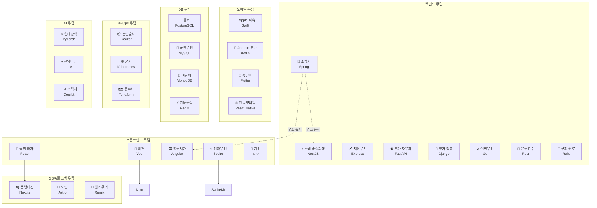

# 개발 무림 세계관 — 프레임워크와 언어를 무협으로 설명한다면

프로그래밍 세계의 문파 싸움, 전설의 무공, 신흥 세력을 무협 세계관으로 풀어내는 시리즈.

> **"10년 공들인 내공이 신기술 하나에 쓸모없어지는 순간."**

---

## 무림 세력도

---

## 시리즈 목차

### 서장: 왜 개발판은 무림인가

*문파 자존심 싸움, 사라진 전설 무공, 그리고 평생 수련의 숙명*

- 개발 세계와 무협 세계의 구조적 유사성
- jQuery 고수의 비극으로 보는 기술 도태의 법칙
- 오픈소스라는 무기가 바꾼 게임의 규칙

### 1부: 백엔드 무림

*정통 내공부터 은둔고수까지, 서버 세계의 문파 지도*

- Spring 소림사, NestJS 속성과정, Express 재야무인
- FastAPI/Django 도가, Go 실전무인, Rust 은둔고수
- Rails 전설의 원로

### 2부: 프론트엔드 무림

*종교전쟁 수준의 문파 싸움, 그리고 빌드툴/상태관리/CSS 내전*

- React vs Vue vs Angular vs Svelte — 사대문파 대전
- Webpack에서 Vite까지 — 빌드툴 천하통일전
- Redux vs Zustand — 상태관리 내전
- Tailwind vs CSS Modules — CSS 종교전쟁

### 3부: SSR/풀스택 무림

*"어디서 싸울 거냐"의 전략 선택*

- Next.js 팔방미인 용병대장
- Astro 정적 세계의 도인
- Remix, SvelteKit, Nuxt

### 4부: 모바일 무림

*iOS vs Android, 그리고 통일을 꿈꾸는 크로스플랫폼*

- iOS: Objective-C → Swift → SwiftUI 무공 진화사
- Android: Java → Kotlin → Compose 혁명
- Flutter, React Native, KMP — 크로스플랫폼 삼파전

### 5부: DB 무림

*한 번 선택하면 갈아타기 제일 힘든 파트*

- PostgreSQL 원로, MySQL 국민무인, MongoDB 이단아
- Redis 기문둔갑, SQLite 어디에나 있는 자객
- ORM 전쟁: "SQL 직접 써라" vs "귀찮게 왜 그래"

### 6부: DevOps/인프라 무림

*코드 바깥의 전쟁터*

- Docker 봉인술, Kubernetes 만군 지휘
- CI/CD 자동화 병기창
- AWS/GCP/Azure 삼대 천하 세력
- Terraform 풍수사

### 7부: AI 무림

*갑자기 판을 뒤집은 신흥 세력*

- PyTorch/TensorFlow 양대 산맥
- LLM 천외마공의 등장
- LangChain, Hugging Face, Cursor/Copilot

### 결론: 무림 생존법

*시장에서 살아남는 놈이 제일 강하다*

---

_"어떤 문파가 최강이냐고? 시장에서 이기는 놈이 강한 거야."_
