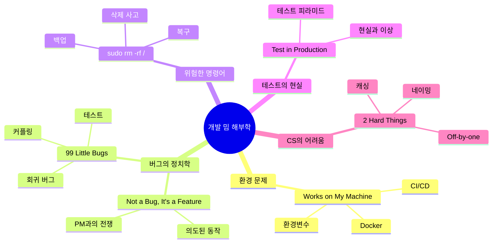

# 개발 밈 해부학: 웃기지만 슬픈 개발자의 자화상

*밈은 거짓말을 하지 않음. 우리가 웃는 이유는 그게 사실이기 때문임.*

---

개발자 밈이라는 게 있음. 트위터에서, 레딧에서, 디스코드에서 매일같이 돌아다니는 그 짤들.

근데 웃기면서도 뭔가 가슴 한구석이 아린 이유가 뭐냐면, **다 실화**이기 때문임.

"내 컴퓨터에선 되는데?" — 실화임.
"버그 아니고 기능입니다" — 실화임.
"sudo rm -rf /" — 이것도 실화임. 진짜로.

이 시리즈는 개발자 밈들을 하나하나 해부해서, 왜 이게 밈이 됐는지, 그 뒤에 어떤 기술적 원인이 있는지, 그리고 어떻게 하면 이 밈의 주인공이 되지 않을 수 있는지를 다룸.

## 시리즈 구조

## 목차

| # | 제목 | 핵심 키워드 |
|---|------|------------|
| 1 | ['Works on my machine' — 환경 차이의 과학](/docs/articles/dev-meme-anatomy/1.works-on-my-machine) | Docker, CI/CD, 환경변수, OS 차이 |
| 2 | ["It's not a bug, it's a feature" — 버그와 기능의 경계](/docs/articles/dev-meme-anatomy/2.not-a-bug) | 기능 요청, 버그 리포트, PM 정치학 |
| 3 | ['99 little bugs in the code' — 버그 수정이 버그를 낳는 이유](/docs/articles/dev-meme-anatomy/3.99-little-bugs) | 회귀 버그, 사이드 이펙트, 테스트 |
| 4 | ['sudo rm -rf /' — 삭제 사고의 역사](/docs/articles/dev-meme-anatomy/4.sudo-rm-rf) | 삭제 사고, 백업, 복구 전략 |
| 5 | ['I don't always test' — 테스트의 현실](/docs/articles/dev-meme-anatomy/5.test-in-production) | 테스트 피라미드, E2E, 프로덕션 |
| 6 | ['2 hard things in CS' — 캐싱, 네이밍, Off-by-one](/docs/articles/dev-meme-anatomy/6.two-hard-things) | 캐시 무효화, 변수명, 펜스포스트 |

## 이 시리즈의 대상

- 밈은 많이 봤는데 왜 웃긴지 기술적으로 설명 못하는 사람
- 신입인데 선배들이 하는 밈 드립을 이해하고 싶은 사람
- 시니어인데 밈이 본인 실화인 사람
- 그냥 웃고 싶은 사람

<Callout type="warning" title="주의사항">
이 시리즈를 읽다 보면 과거의 자신이 떠올라 PTSD가 올 수 있음. 특히 4편(sudo rm -rf)은 심장이 약한 분들은 주의 바람.
</Callout>

## 밈이 가르쳐주는 것

밈은 단순한 유머가 아님. 밈은 **집단 경험의 압축**임.

"Works on my machine"이 밈이 된 건 전 세계 수백만 개발자가 동시에 고개를 끄덕였기 때문임. 이건 문화 현상이자, 동시에 **아직 해결되지 않은 기술적 문제의 증거**임.

Docker가 나온 이유? "Works on my machine" 때문임.
CI/CD가 발전한 이유? "프로덕션에서 테스트합니다" 때문임.
Git이 만들어진 이유? Linus가 빡쳐서... 이건 좀 다른 얘기긴 함.

요점은, 밈을 이해하면 기술의 발전 방향이 보인다는 거임. 개발자들이 가장 많이 고통받는 지점에서 가장 혁신적인 도구가 탄생함.

<Callout type="info" title="시리즈 읽는 법">
순서대로 읽어도 좋고, 관심 가는 밈부터 골라 읽어도 됨. 각 편은 독립적이지만, 시리즈 전체를 읽으면 개발이라는 행위의 본질적인 어려움이 왜 존재하는지 큰 그림이 보일 거임.
</Callout>

---

*"개발은 쉽지 않지만, 적어도 웃으면서 할 수는 있음."*
