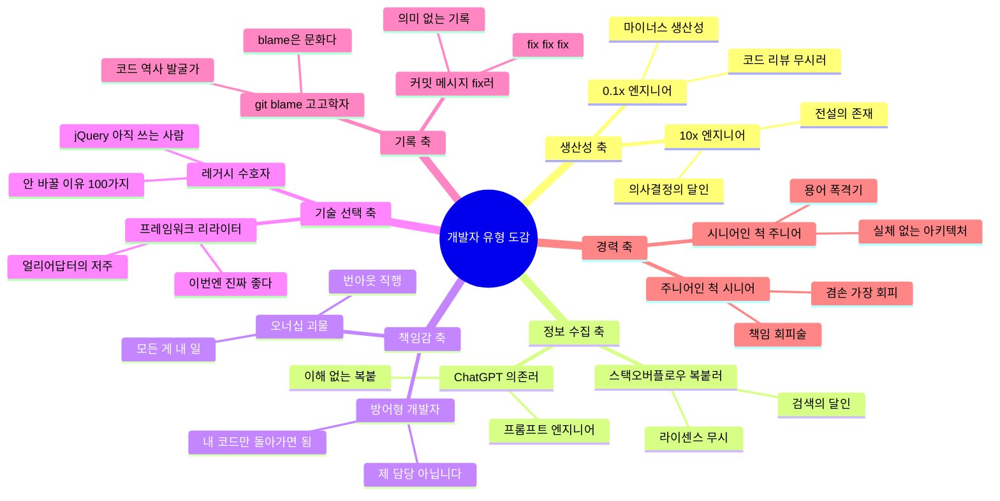

# 개발자 유형 도감: 당신은 어떤 타입인가

*"회사에 한 명씩은 꼭 있음. 아니, 니가 그 사람일 수도 있음."*

---

개발자라는 직업은 겉보기엔 모니터 앞에 앉아서 코드 치는 단일 종족 같지만,
사실 그 안에는 수십 가지 아종이 존재함.

마치 포켓몬 도감처럼, 개발자 세계에도 분류 체계가 있음.
불 타입, 물 타입이 있듯이 개발자에게도 유형이 있는 거임.

다만 포켓몬과 다른 점은, 한 사람이 여러 유형을 동시에 보유할 수 있다는 것.
월요일엔 10x 엔지니어였다가 금요일엔 스택오버플로우 복붙러가 되는 게 일상임.

<Callout type="warning" title="면책 조항">
이 시리즈에 등장하는 모든 유형은 실존 인물을 기반으로 함.
본인이 해당된다고 느껴도 그건 착각이 아니라 현실 인식임.
HR에 신고하지 말 것.
</Callout>

## 개발자 유형 분류 체계

## 목차

이 시리즈는 총 6편으로 구성됨. 각 편은 독립적으로 읽을 수 있지만,
순서대로 읽으면 개발자 생태계의 전체 그림이 보임.

| # | 제목 | 핵심 키워드 |
|---|------|------------|
| 1 | [10x 엔지니어 vs 0.1x 엔지니어](/docs/articles/developer-taxonomy/1.10x-vs-01x) | 생산성, 의사결정, 코드 품질 |
| 2 | [스택오버플로우 복붙러 & ChatGPT 의존러](/docs/articles/developer-taxonomy/2.stackoverflow-copypaster) | 검색, AI 코딩, 복붙 문화 |
| 3 | ['그건 제 담당이 아닙니다'](/docs/articles/developer-taxonomy/3.not-my-job) | 오너십, 방어, 조직 문화 |
| 4 | [새 프레임워크 나오면 리라이트하는 사람](/docs/articles/developer-taxonomy/4.framework-rewriter) | 기술 FOMO, 리라이트, 기술 선택 |
| 5 | [git blame 고고학자 & 커밋 메시지 'fix'](/docs/articles/developer-taxonomy/5.git-blame-archaeologist) | git, 커밋 메시지, 코드 고고학 |
| 6 | [시니어인 척하는 주니어 & 주니어인 척하는 시니어](/docs/articles/developer-taxonomy/6.fake-seniority) | 경력, 성장, 역할 |

## 이 시리즈를 읽기 전에

<Callout type="info" title="자가 진단 안내">
각 글을 읽으면서 "아 이거 나인데..."라는 생각이 3번 이상 들면,
이미 해당 유형에 깊이 빠져 있는 것임.
자각이 치료의 첫 걸음이라는 말이 있듯이, 일단 인정하는 것부터 시작하면 됨.
</Callout>

이 시리즈의 목적은 누군가를 비난하는 게 아님.
모든 개발자는 상황에 따라 다른 유형이 될 수 있고,
중요한 건 자기가 지금 어떤 유형인지 인식하는 것임.

인식하면 바꿀 수 있음.
인식 못 하면? 그냥 "fix" 커밋 메시지를 평생 쓰게 되는 거임.

---

*"개발자를 이해하려면, 먼저 개발자를 분류해야 한다." — 린네가 개발자였다면*
