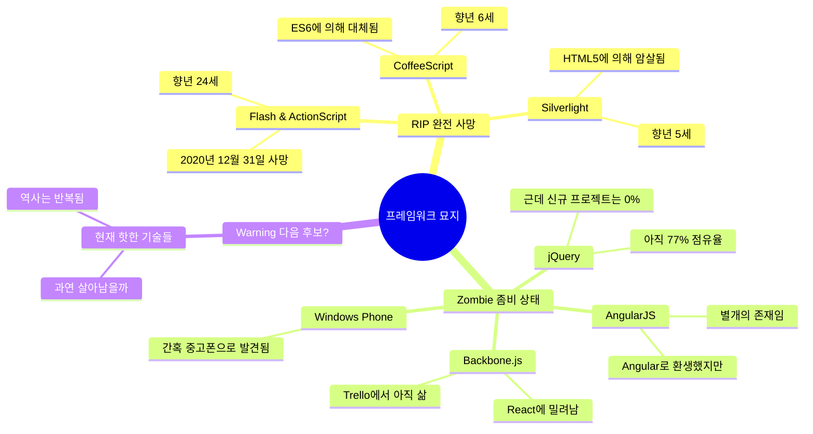
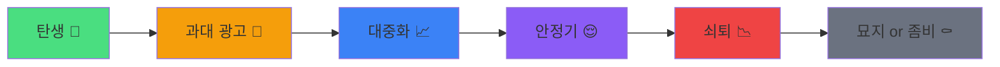

# 프레임워크 묘지: 한때 잘나갔던 기술들의 안식처

*"여기 잠든 기술들은 한때 세상을 지배했음. 지금 니가 쓰는 것도 언젠간 여기 올 거임."*

---

여기는 프레임워크 묘지임.

한때 GitHub 스타 수만 개를 자랑하고, 컨퍼런스마다 키노트를 장식하고,
"이거 안 쓰면 뒤처진다"는 소리를 듣던 기술들이 잠들어 있는 곳임.

근데 웃긴 건 이 기술들이 진짜 죽은 게 아니라는 거임.
좀비처럼 레거시 코드 속에서 영원히 살아있음.
지금 이 순간에도 누군가는 jQuery 플러그인을 디버깅하고 있을 거임. ㅋㅋ

## 묘지 지도

## 시리즈 목차

| # | 제목 | 상태 |
|---|------|------|
| 1 | [Flash & ActionScript — 웹의 황금기를 만들고 사라진 전설](/docs/articles/framework-graveyard/1.flash-actionscript) | RIP |
| 2 | [AngularJS → Angular — 같은 이름, 완전히 다른 프레임워크](/docs/articles/framework-graveyard/2.angularjs-to-angular) | 환생 |
| 3 | [jQuery → 쇠퇴와 유산 — 아직도 인터넷의 77%에 깔려있는 좀비](/docs/articles/framework-graveyard/3.jquery-decline) | 좀비 |
| 4 | [CoffeeScript & Backbone.js — ES6가 오기 전의 구세주들](/docs/articles/framework-graveyard/4.coffeescript-backbone) | RIP |
| 5 | [Silverlight & Windows Phone — 마이크로소프트의 잃어버린 10년](/docs/articles/framework-graveyard/5.silverlight-windows-phone) | RIP |
| 6 | [다음 묘지의 주인공은? — 지금 핫한 기술의 생존 확률](/docs/articles/framework-graveyard/6.next-graveyard-candidate) | TBD |

## 왜 이 시리즈를 쓰는가

솔직히 말하면 **경고**하려고 씀.

지금 "React 최고!" "Next.js 짱!" 하는 거 보면
2012년에 "AngularJS 안 쓰는 놈 없음" 하던 거랑 똑같음.

<Callout type="warning" title="역사는 반복됨">
2008: "jQuery 없이 웹 개발? 불가능ㅋ"
2013: "AngularJS가 프론트엔드의 미래임"
2015: "React가 다 먹을 거임"
2020: "Next.js 이외의 선택지가 있나?"
2025: "???"

패턴이 보이지 않음? 약 3~5년 주기로 "절대 강자"가 바뀜.
</Callout>

## 기술의 수명 곡선

모든 기술은 비슷한 생애 주기를 가짐:

재밌는 건 **과대 광고** 단계에서 대부분의 개발자가 올인한다는 거임.
그리고 **쇠퇴** 단계에서 "아 이거 배운 시간이..." 하면서 후회함.

근데 이게 꼭 나쁜 건 아님. 죽은 기술에서 배운 개념은 살아남거든.

- Flash에서 배운 **애니메이션 원리** → CSS Animation, Web Animations API에서 씀
- AngularJS에서 배운 **양방향 바인딩** → Vue.js가 계승함
- jQuery에서 배운 **DOM 조작 패턴** → 브라우저 네이티브 API가 흡수함
- CoffeeScript에서 배운 **함수형 문법** → ES6 화살표 함수, 디스트럭처링이 됨

<Callout type="success" title="핵심 교훈">
프레임워크는 죽어도 개념은 살아남음.
기술을 배울 때 "이 도구의 사용법"이 아니라 "이 도구가 해결하는 문제"를 이해하면
다음 기술로 넘어가는 게 훨씬 쉬워짐.
</Callout>

## 각 묘비에 적힌 것들

이 시리즈의 각 글에서는 다음을 다룸:

1. **전성기** — 왜 그렇게 인기 있었는지, 어떤 문제를 해결했는지
2. **몰락의 원인** — 기술적 한계? 정치적 결정? 더 나은 대안?
3. **코드로 보는 역사** — 실제 코드 예시로 당시의 개발 경험을 체험
4. **유산** — 이 기술이 현대 개발에 남긴 것들
5. **교훈** — 같은 실수를 반복하지 않기 위한 통찰

자 그러면 첫 번째 묘비로 가보자.

**Flash & ActionScript**의 이야기부터 시작함.

2020년 12월 31일, 어도비가 공식적으로 사망 선고를 내린 그 기술.
한때 인터넷의 28.5%를 차지했던 전설의 시작임.

<Callout type="info" title="읽는 순서">
순서대로 읽어도 되고, 관심 가는 기술부터 읽어도 됨.
다만 마지막 6편 "다음 묘지의 주인공은?"은 1~5편을 읽은 후에 보면 더 재밌음.
패턴이 보이기 시작하거든.
</Callout>

---

*묘지의 문이 열렸음. 조심해서 들어오셈.*
