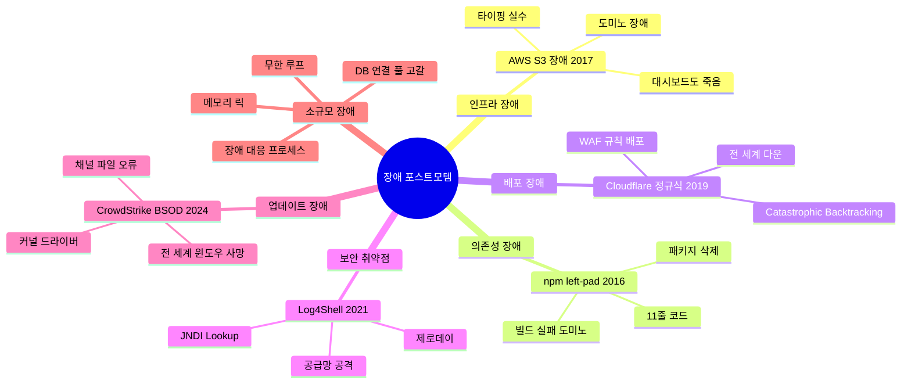

# 장애 포스트모템 열전: 세상을 멈춘 버그들

*타이핑 실수, 11줄 코드, 정규식 하나가 인터넷을 멈춘 실화들*

---

개발자라면 누구나 한 번쯤은 "에이 설마 이 정도 변경이 문제가 되겠어?"라고 생각하고 엔터를 누른 적이 있을 거임. 대부분은 운 좋게 넘어가지만, 가끔 그 엔터 하나가 전 세계 인터넷의 절반을 날려버리기도 한다. 이 시리즈에서 다루는 건 그 "가끔"에 해당하는 실화들임.

AWS 엔지니어의 오타 하나가 S3를 4시간 동안 먹통으로 만든 사건, npm에서 11줄짜리 패키지가 삭제되자 React와 Babel이 동시에 빌드 실패한 사건, Cloudflare WAF에 배포된 정규식 하나가 CPU를 100%로 올려서 전 세계 트래픽을 차단한 사건. 하나같이 "이게 실화냐?"라는 반응이 나오는 것들인데, 진짜 실화임. 그것도 IT 역사에 기록된 공식 포스트모템이 있는 사건들.

흥미로운 건 이 사건들의 근본 원인이 대부분 비슷하다는 점임. 단일 장애점(SPOF), 의존성 지옥, 배포 프로세스의 부재, "설마 이게?" 하는 방심. 대기업이든 스타트업이든 똑같은 실수를 반복하고, 그래서 우리도 남의 포스트모템을 읽고 배워야 하는 거다.

이 시리즈는 실제 사건의 타임라인, 기술적 원인, 그리고 교훈을 정리한 것임. 남의 장애 보고서를 읽고 웃되, 결국 배워야 할 건 "우리 시스템에서도 이런 일이 일어날 수 있다"는 자각임. 시작하자.

## 장애 포스트모템 전체 지도

---

## 목차

| # | 사건 | 연도 | 핵심 키워드 |
|---|------|------|------------|
| 1 | [AWS S3 장애 — 타이핑 실수로 인터넷 절반이 죽은 날](/docs/articles/incident-postmortems/1.aws-s3-outage) | 2017 | SPOF, 의존성, 타이포 |
| 2 | [npm left-pad 사태 — 11줄 코드가 세상을 멈추다](/docs/articles/incident-postmortems/2.npm-leftpad) | 2016 | 의존성 관리, OSS 거버넌스 |
| 3 | [Cloudflare 정규식 장애 — 정규식 하나가 전 세계를 다운시킨 날](/docs/articles/incident-postmortems/3.cloudflare-regex) | 2019 | 정규식, 카나리 배포, WAF |
| 4 | [Log4Shell — 역사상 최악의 제로데이](/docs/articles/incident-postmortems/4.log4shell) | 2021 | 제로데이, JNDI, 공급망 |
| 5 | [CrowdStrike 블루스크린 — 보안 업데이트가 전 세계 윈도우를 죽이다](/docs/articles/incident-postmortems/5.crowdstrike-bsod) | 2024 | 커널 드라이버, staged rollout |
| 6 | [우리 회사에서도 터진다 — 소규모 장애 생존기와 교훈](/docs/articles/incident-postmortems/6.small-company-incidents) | - | DB, 메모리, 프로세스 |

---

## 장애에서 배우는 공통 교훈

모든 대형 장애를 분석해보면 반복되는 패턴이 있음:

1. **단일 장애점(SPOF)은 반드시 터진다** — "이건 절대 안 죽어"라고 한 시스템이 제일 먼저 죽음
2. **의존성은 무기가 될 수 있다** — 내가 안 짠 코드가 내 서비스를 죽이는 세상
3. **배포 프로세스가 곧 안전망이다** — 카나리 없는 글로벌 배포는 러시안 룰렛
4. **모니터링이 죽으면 아무것도 모른다** — 장애 대시보드가 장애에 포함되는 아이러니
5. **포스트모템 문화가 조직을 살린다** — 같은 실수를 반복하지 않는 유일한 방법

이 시리즈를 다 읽고 나면, 최소한 "아 이건 이전에 어디서 터진 패턴이랑 비슷한데..."라는 직감은 생길 거임. 그 직감이 새벽 3시 장애 대응 때 당신을 구원할 수도 있다.