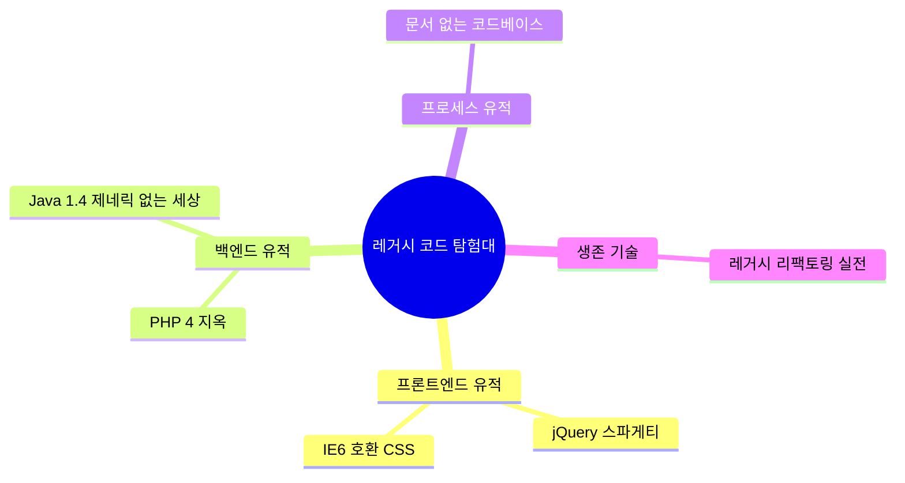

# 레거시 코드 탐험대: 과거의 유적을 발굴하다

*"이 코드 짠 사람 누구야?" — git blame 찍었더니 퇴사한 사람이었던 그 순간*

---

개발자의 커리어에서 피할 수 없는 순간이 있음. 바로 레거시 코드와의 조우. 새 프로젝트만 하고 싶다고? ㅋㅋ 현실은 기존 코드 유지보수가 업무의 70%인 세계에 온 걸 환영함. 10년 전 jQuery로 떡칠된 프론트엔드, PHP 4 시절 register_globals 켜놓고 짠 백엔드, IE6 호환이라는 이름 아래 자행된 CSS 전쟁범죄... 이것들은 단순한 "옛날 코드"가 아님. 그 시대를 살아남은 개발자들의 흔적이자, 당시에는 "최선의 선택"이었던 유적임.

이 시리즈는 레거시 코드의 고고학적 발굴 프로젝트임. 각 편에서 특정 기술 스택의 레거시 유적을 탐험하고, 왜 그렇게 짰는지 시대적 맥락을 이해하고, 어떻게 현대적으로 마이그레이션하는지를 다룸. "옛날 코드 까기"가 아니라 "역사에서 배우기"에 가까움. 물론 까는 것도 좀 할 거임. 재밌으니까.

레거시 코드를 만나면 세 가지 반응이 있음:
1. "이게 뭐야 다 새로 짜자" → 보통 실패함
2. "건드리지 말자 돌아가니까" → 기술 부채가 이자를 낳음
3. "이해하고 점진적으로 개선하자" → 정답이지만 어려움

이 시리즈는 3번을 할 수 있는 힘을 기르는 것이 목표임. 각 유적지를 탐험하면서 과거의 실수를 웃으면서 배우고, 현재의 코드에서 미래의 레거시를 만들지 않는 방법을 익혀보자.

## 레거시 코드 탐험 지도



---

## 시리즈 목차

| # | 제목 | 핵심 주제 |
|---|------|-----------|
| 1 | [jQuery 스파게티](/docs/articles/legacy-code-expedition/1.jquery-spaghetti) | 2010년대 프론트엔드의 유적 발굴 |
| 2 | [PHP 4 시절 코드](/docs/articles/legacy-code-expedition/2.php4-hell) | include 지옥과 글로벌 변수의 향연 |
| 3 | [IE6 호환 CSS](/docs/articles/legacy-code-expedition/3.ie6-css) | 조건부 주석과 핵의 고고학 |
| 4 | [Java 1.4 제네릭 없던 시절](/docs/articles/legacy-code-expedition/4.java14-generics) | Object 캐스팅의 공포 |
| 5 | [문서 없는 코드베이스 생존기](/docs/articles/legacy-code-expedition/5.no-documentation) | '이 코드 짠 사람 퇴사했는데요' |
| 6 | [레거시 리팩토링 실전](/docs/articles/legacy-code-expedition/6.legacy-refactoring) | 칼을 뽑았으면 무라도 썰어야지 |

---

## 이 시리즈를 읽으면 좋은 사람

- 회사에서 "이 프로젝트 좀 봐줘"라는 말을 들은 사람
- `git log --oneline | wc -l` 찍었더니 5000이 넘는 프로젝트를 맡은 사람
- "리팩토링 해야 하는데..." 라고 3개월째 말만 하고 있는 사람
- 레거시 코드를 보면서 "나는 절대 이렇게 안 짤 거야"라고 다짐했지만, 6개월 후 자기 코드가 레거시가 된 사람
- 그냥 옛날 기술 이야기가 재밌는 사람

<Callout type="info" title="레거시의 정의">
레거시 코드란 "테스트가 없는 코드"라는 Michael Feathers의 정의가 유명하지만, 현실에서는 "아무도 완전히 이해하지 못하지만 돌아가고 있는 코드"가 더 정확한 정의임. 코드가 얼마나 오래됐는지보다, 얼마나 이해 가능한지가 중요함. 어제 짠 코드도 테스트와 문서가 없으면 레거시임.
</Callout>

## 레거시 코드의 타임라인

```
1995 ─── PHP 탄생, JavaScript 탄생 (10일 만에)
1996 ─── CSS 1.0, IE 3.0
1998 ─── PHP 3, CSS 2.0
2000 ─── PHP 4 (register_globals의 시대)
2001 ─── IE 6 출시 (5년간 독점)
2004 ─── Java 5 (드디어 제네릭!)
2006 ─── jQuery 1.0 출시 (구원자 등장)
2008 ─── Chrome 출시 (브라우저 전쟁 재개)
2009 ─── Node.js 등장
2010 ─── AngularJS (프레임워크 시대 개막)
2012 ─── IE 6 점유율 드디어 한 자릿수
2013 ─── React 출시
2014 ─── Vue.js 출시
2015 ─── ES6 (JavaScript 현대화)
2016 ─── TypeScript 대중화
2020 ─── jQuery 점유율 여전히 77% (ㅋㅋ)
2024 ─── jQuery 점유율 여전히 75% (ㅋㅋㅋ)
```

이 타임라인을 보면 알겠지만, 기술은 점진적으로 바뀌는 거지 한순간에 교체되는 게 아님. jQuery가 "레거시"라고 까지만 아직도 전 세계 웹사이트의 75%가 쓰고 있음. 레거시는 죽지 않음. 은퇴도 안 함. 그냥 거기 있음. 돌아가고 있음.

<Callout type="warning" title="시리즈 주의사항">
이 시리즈에 등장하는 레거시 코드 예시를 보고 "누가 이따구로 짜?" 라고 하면 안 됨. 당시에는 그것이 최선이었고, 지금 우리가 짜는 코드도 10년 후에는 똑같이 까일 예정임. 겸손해지자. 미래의 후배 개발자가 이 글을 보면서 "2020년대에는 React로 떡칠했다며? ㅋㅋ" 할 수도 있음.
</Callout>
