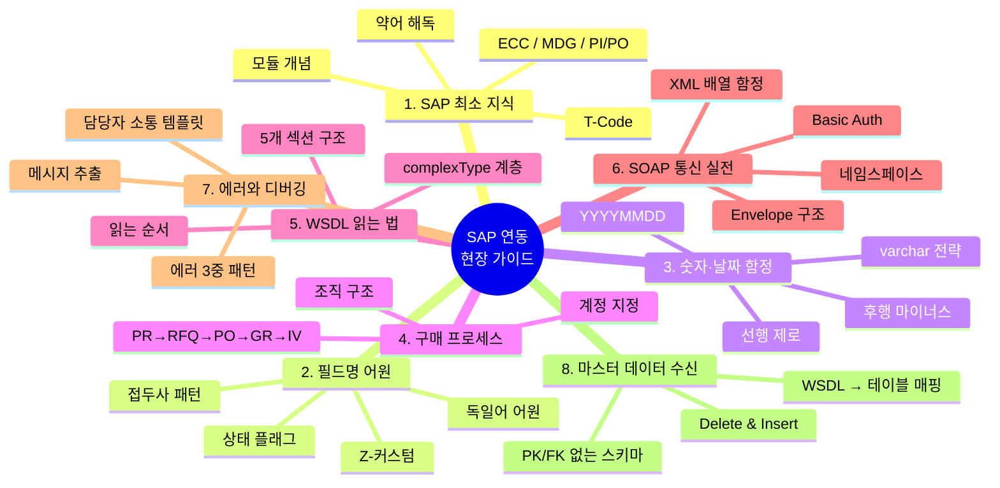

# SAP 연동 현장 가이드 — SAP 개발자가 아닌 개발자를 위한

*"WSDL 던져줄 테니 붙여주세요" 받고 화면이 멈춘 사람들을 위한 시리즈*

---

어느 날 팀장이 "이번 프로젝트에서 SAP과 붙는 부분을 맡아줬으면 한다"고 한다. 지라 티켓에 WSDL 파일 하나가 첨부돼 있고, `<xs:element name="LIFNR" type="xs:string"/>` 같은 줄이 300개쯤 이어진다. 슬랙으로 "SAP 담당자분께 문의드립니다" 하고 물어봤더니 "PI/PO에서 ME21N 결과를 인바운드로 쏴드릴 테니 IDoc 받아서 ECC에 확인 요청 주세요"라는 답이 온다.

한 줄도 이해가 안 되는 순간, 이 시리즈의 독자가 된다.

---

## 이 시리즈의 정체성

SAP 공식 가이드? 아님. 그런 건 SAP Help Portal에 이미 방대하게 있다. 문제는 그 방대한 자료가 전부 **SAP 내부 개발자(ABAP, FI, MM 컨설턴트) 관점**으로 쓰여 있다는 것이다.

이 시리즈는 반대편 관점에서 쓴다. **"SAP 바깥에서 SOAP으로 SAP에 붙어야 하는 웹/백엔드 개발자가 매일 마주치는 문제"**만 골라서 정리했다. 필드 이름이 왜 이렇게 생겼는지, 왜 숫자가 문자열로 오는지, WSDL의 어떤 부분만 읽으면 되는지, XML 파서가 어느 지점에서 배신하는지, 에러 메시지는 어디서 찾아야 하는지, SAP 담당자에게 뭘 어떻게 물어야 답이 오는지.

SAP 개발자가 아니어도 SAP에 붙을 수는 있다. 단, 최소한의 지도가 필요하다. 이 시리즈가 그 지도다.

---

## 시리즈 전체 지도

---

## 목차

| # | 제목 | 핵심 메시지 |
|---|------|-------------|
| 1 | [SAP이 뭔지 최소한만 알기](/docs/articles/sap-integration-field-guide/1.what-is-sap) | SAP은 한 덩어리가 아니라 여러 레이어의 묶음이다. 외부 개발자는 그 중 PI/PO와만 만난다. |
| 2 | [왜 SAP 필드명은 이렇게 생겼나](/docs/articles/sap-integration-field-guide/2.why-field-names-look-weird) | 독일어 축약과 1970년대 DB 제약의 유산. 패턴을 알면 처음 보는 필드도 추측 가능. |
| 3 | [SAP이 보내주는 숫자·날짜의 함정](/docs/articles/sap-integration-field-guide/3.numbers-dates-pitfalls) | SAP은 숫자를 문자열처럼 보낸다. 자료형을 믿지 말고 파싱 계층에서 방어해야 한다. |
| 4 | [구매 프로세스 흐름 이해하기](/docs/articles/sap-integration-field-guide/4.procurement-flow) | 문서 흐름(PR→RFQ→PO→GR→IV)을 모르면 필드가 왜 필요한지 이해할 수 없다. |
| 5 | [WSDL 읽는 법](/docs/articles/sap-integration-field-guide/5.reading-wsdl) | WSDL은 무섭게 생겼지만 구조는 고정돼 있다. 5개 섹션만 읽으면 된다. |
| 6 | [SAP과 SOAP으로 붙기](/docs/articles/sap-integration-field-guide/6.soap-integration) | PI/PO 경유 SOAP은 정해진 패턴이 있다. Envelope·네임스페이스·배열 함정만 알면 90%는 해결. |
| 7 | [에러 패턴과 디버깅](/docs/articles/sap-integration-field-guide/7.errors-and-debugging) | SAP은 에러를 3가지 방식으로 알려준다. HTTP만 보면 절반 놓친다. |
| 8 | [마스터 데이터 수신 설계](/docs/articles/sap-integration-field-guide/8.receiving-master-data) | SAP 마스터 수신은 CRUD가 아니다. Delete & Insert가 기본이며, UPSERT를 피해야 하는 이유가 있다. |

---

## 이 시리즈의 독자

**이런 독자를 염두에 두고 썼다:**

- 경력 3~10년 백엔드·풀스택 개발자
- 처음으로 SAP 연동 프로젝트에 투입됐거나, 중간에 들어와 컨텍스트가 부족한 상황
- SOAP·XML·HTTP는 알지만 SAP 고유의 관습이 낯선 사람
- SAP 담당자와 회의에서 말이 안 통해본 경험이 있는 사람

**이 시리즈가 다루지 않는 것:**

- ABAP 프로그래밍 — 이 시리즈에서 ABAP은 "SAP 담당자가 다루는 것"으로만 언급
- Fiori, CDS View, OData — 신세대 SAP 인터페이스지만 SOAP 맥락과 다른 주제
- IDoc — 간략 언급만, 상세는 스코프 밖
- FI 모듈의 회계 처리 — 세금코드 같은 회계 실무는 다루지 않음

---

## 읽는 순서

순서대로 읽는 것을 권장한다. 2편·3편은 4편 이후의 예제를 이해하기 위한 배경이고, 5편·6편·7편은 실전 3부작으로 함께 묶여 있다.

급하면 다음 순서로 건너뛰어도 된다:

- **당장 WSDL 해석이 급하다** → 2편 (필드명) → 5편 (WSDL)
- **INBOUND/OUTBOUND 코드부터 짜야 한다** → 6편 (SOAP) → 7편 (에러)
- **DB 스키마 설계부터 필요하다** → 8편 (마스터 데이터) → 3편 (숫자·날짜)

---

## 시리즈 공통 가정

모든 글은 다음 환경을 가정한다. 실제로는 SAP 연동의 대부분이 이 조합이다.

- SAP 측: ECC + MDG + PI/PO (이 셋의 역할 분리는 1편에서 설명)
- 외부 시스템: 웹 백엔드 (Node.js/Java/Python 등, 언어 중립)
- 통신: SOAP 1.1 over HTTPS, Basic Authentication
- XML 파싱: `fast-xml-parser` 또는 유사 라이브러리 (샘플 코드는 TypeScript 기준)
- 데이터 형식: WSDL에 정의된 XML, 응답에는 MSGTY/EV_TYPE 기반 에러 코드

각 편의 코드 예제는 이 조합을 전제로 한다. 다른 프로토콜(RFC, IDoc, OData)이나 다른 SAP 구성은 별도 언급이 없는 한 범위 밖이다.

---

그럼 시작하자. 첫 편은 모든 것의 전제, **SAP이 뭔지 최소한만 알기**다.
