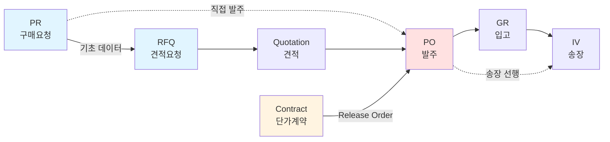

# 구매 프로세스 흐름 이해하기

*PR → RFQ → PO → GR → IV, 구매 도메인의 문서 지도*

---

SAP MM 모듈에서 오는 데이터를 다루는 프로젝트는 거의 예외 없이 **구매 프로세스**를 다룬다. 그리고 구매 프로세스는 여러 문서가 연쇄적으로 생성·연결되는 **문서 흐름(document flow)**이라는 구조를 따른다.

이 흐름을 모르면 다음과 같은 상황이 매번 당황스럽다.

- PO 데이터에 `BANFN`이 있는데 비어 있을 수도, 채워져 있을 수도 있다. 왜?
- `ANFNR` 필드가 있는 PO도 있고 없는 PO도 있다. 왜?
- RFQ 없이 PO가 만들어지는 경우는 뭔가?
- PO 항목(`EBELP`)이 10, 20, 30처럼 10단위로 증가하는데 가끔 11도 있다. 왜?

답은 하나같이 "**그 문서가 어느 단계를 거쳐서 만들어졌는지**"에 달려 있다. 이 글은 문서 흐름의 지도다.

---

## 전체 흐름 한눈에

표준 구매 프로세스는 다음 6단계를 거친다.

```
[구매요청]    [견적요청]    [견적]       [발주]       [입고]     [송장검증]
   PR    ──▶   RFQ    ──▶  Quotation ─▶   PO    ──▶   GR   ──▶   IV
  ME51N       ME41       ME47/ME41      ME21N       MIGO      MIRO
```

각 단계에서 **새로운 SAP 문서**가 생성되고, 이전 단계의 문서와 참조로 연결된다. 문서마다 고유 번호, 항목 번호, 상태값이 있고, 앞뒤 단계의 번호를 자기 필드에 들고 있다.

외부 시스템이 연동되는 영역은 대개 **PR ~ PO 구간**이다. 입찰·RFQ·견적 처리를 외부 플랫폼으로 뺀 경우가 많아서다. GR(입고)과 IV(송장)는 SAP 내부 또는 현장 시스템에서 처리되는 경우가 많아 외부 연동 범위 밖이다.



점선 경로는 "건너뛰는 경우"다. 표준 프로세스는 직선이지만 실제 기업은 생각보다 다양한 단축 경로를 쓴다.

---

## 1. PR (Purchase Requisition, 구매요청)

**"이 자재가 필요하다"는 내부 요청**. 아직 돈이 나가지 않는다. 현장이나 사용 부서에서 발행하고, 구매 조직이 검토해서 RFQ나 PO로 연결한다.

| 필드 | 의미 |
|------|------|
| `BANFN` | 구매요청 번호 (10자리 숫자) |
| `BANPO` | 항목 번호 (5자리, 보통 10 단위로 증가) |
| `MATNR` | 자재 번호 |
| `MENGE` | 수량 |
| `LFDAT` | 납기일 |
| `EKGRP` | 담당 구매그룹 |
| `WERKS` | 플랜트(공장) |
| `KNTTP` | 계정 지정 유형 (K=코스트센터, P=프로젝트 등) |
| `DISMM` | MRP 유형 |
| `FRGKZ` | 승인 지시자 |

<Callout type="info" title="왜 항목 번호가 10, 20, 30인가">
PR·PO 같은 SAP 문서의 항목 번호(`BANPO`, `EBELP`, `ANFPS`)는 **보통 10 단위로 증가**한다. 이건 문서 중간에 항목을 끼워 넣을 여유 공간을 두기 위한 관례다. 나중에 항목 2와 3 사이에 뭔가 추가하고 싶으면 25 같은 중간 값을 쓸 수 있다.

다만 회사 설정에 따라 1 단위로 증가하게 바꿀 수도 있고, 기존 문서 수정 시 이상한 번호가 섞여 들어오기도 한다. 외부 시스템은 **항목 번호의 증가 규칙에 의존하면 안 된다.** 문서 내에서 unique한 식별자로만 취급하는 게 안전하다.
</Callout>

### 외부 개발자 관점

PR은 보통 **SAP → 외부 시스템** 방향으로 전달된다. 사용 부서가 PR을 SAP에서 생성하면, PI/PO가 그걸 외부 입찰·조달 시스템으로 보내준다. 외부 시스템은 PR을 받아서 RFQ 생성이나 입찰 개시의 기초 데이터로 쓴다.

---

## 2. RFQ (Request for Quotation, 견적요청)

**벤더에게 "이 자재를 얼마에 공급할 수 있나?"를 묻는 문서**. 아직 발주가 아니다. 여러 벤더에게 동시에 보내서 견적을 받는다.

| 필드 | 의미 |
|------|------|
| `ANFNR` | RFQ 번호 (10자리) |
| `ANFPS` | RFQ 항목 번호 |
| `LIFNR` | 견적을 받을 벤더 |
| `KDATB` / `KDATE` | 견적 유효 기간 |
| `BANFN` / `BANPO` | 참조하는 PR 정보 |

### 외부 개발자 관점

외부 입찰 시스템은 RFQ 단계에서 가장 많은 일을 한다. 여러 벤더에게 동시에 견적을 요청하고, 견적서를 회수하고, 낙찰자를 결정하고, 결과를 SAP으로 돌려보낸다. "RFQ 결과로 PO 생성 요청"이 외부 시스템 → SAP 방향의 가장 흔한 통신이다.

---

## 3. PO (Purchase Order, 발주)

**실제로 벤더에게 자재를 주문하는 문서**. **돈이 걸리는 핵심 문서**. 여기서부터 법적 효력이 있는 거래다.

| 필드 | 의미 |
|------|------|
| `EBELN` | 발주 번호 (10자리, 보통 4xxxxxxxxx) |
| `EBELP` | 항목 번호 |
| `LIFNR` | 벤더 |
| `MATNR` | 자재 |
| `MENGE` | 수량 |
| `NETPR` / `NETWR` | 단가 / 순 금액 |
| `WAERS` | 통화 |
| `MWSKZ` | 세금 코드 |
| `BANFN` / `BANPO` | 참조 PR |
| `ANFNR` / `ANFPS` | 참조 RFQ (있으면) |
| `KONNR` / `KTPNR` | 참조 계약 (있으면) |
| `LOEKZ` | 삭제 지시자 |

### 외부 개발자 관점

PO는 SAP **양방향**으로 오간다. 외부 시스템이 RFQ 결과로 PO 생성을 요청하면 SAP이 PO를 만들어서 번호를 돌려주고, 이후 SAP이 PO 정보를 외부에 INBOUND로도 쏴 준다(다른 인터페이스를 통해). 동일 PO가 여러 인터페이스로 전달되는 이유는 단계별로 다른 데이터가 필요하기 때문이다.

<Callout type="warning" title="PO 문서 유형(BSTYP)의 구분">
`BSTYP` 필드 값은 구매 문서의 종류를 구분한다.

- `F` = Purchase Order (일반 발주)
- `K` = Contract (단가계약)
- `L` = Scheduling Agreement (스케줄링 협정)
- `A` = RFQ / Quotation

같은 `EBELN` 네임스페이스를 공유하므로 숫자만 보고 PO인지 계약인지 판단할 수 없다. **항상 `BSTYP`로 구분**해야 한다.
</Callout>

---

## 4. Contract (단가계약)

**특정 기간 동안 합의된 단가로 공급하겠다는 장기 계약**. PO가 아니라 **계약의 틀**이고, 실제 발주는 계약을 참조하는 Release Order(Release PO)로 따로 만든다.

| 필드 | 의미 |
|------|------|
| `EBELN` | 계약 번호 (PO와 같은 체계) |
| `KDATB` | 계약 시작일 |
| `KDATE` | 계약 종료일 |
| `KTMNG` | 목표 수량 |
| `BSTYP` | `K` (계약 구분) |

계약이 있으면 실제 PO에는 `KONNR`(계약 번호)과 `KTPNR`(계약 항목 번호) 필드가 채워진다. "이 발주는 계약 X의 항목 Y를 참조한다"는 뜻이다.

---

## 문서 간 참조 관계 정리

문서는 서로 **참조 필드**로 연결된다. 이 연결 그래프를 이해하면 데이터가 왜 비어 있거나 채워져 있는지 예측할 수 있다.

```
PR (BANFN, BANPO)
    │
    ├──▶  RFQ (ANFNR, ANFPS)
    │       참조: BANFN, BANPO
    │
    │         ──▶  Quotation ──▶  PO 생성 시 반영
    │
    └──▶  PO (EBELN, EBELP)  ← PR에서 직접 PO로 가는 경로
            참조: BANFN, BANPO (있을 수도 없을 수도)
            참조: ANFNR, ANFPS (있을 수도 없을 수도)
            참조: KONNR, KTPNR (있을 수도 없을 수도)

Contract (EBELN, BSTYP=K)
    │
    └──▶  PO (EBELN, BSTYP=F)
            참조: KONNR, KTPNR
```

<Callout type="error" title="참조 필드가 비어 있는 건 버그가 아니다">
PO 데이터에 `BANFN`이 비어 있다고 "PR이 누락됐다"는 뜻이 아니다. **현장에서 PR 없이 PO를 직접 생성한 경우**일 수 있다(긴급 구매, 소액 구매 등). 마찬가지로 `ANFNR`이 비어 있으면 RFQ 없이 PO를 낸 경우다.

외부 시스템에서 참조 필드의 null을 "데이터 오류"로 처리하면 정상 케이스에서 장애가 난다. **선택적(optional) 참조로 취급**하는 것이 맞다.
</Callout>

---

## 조직 구조 — 모든 문서가 소속되는 계층

SAP MM의 모든 데이터는 항상 **조직 단위**에 귀속된다. 계층 구조가 있다.

```
회사코드 (BUKRS: Company Code)          ← 법인 단위
  └── 구매조직 (EKORG: Purchasing Organization)  ← 구매 책임 단위
        └── 구매그룹 (EKGRP: Purchasing Group)   ← 실무 팀 단위
              └── 플랜트 (WERKS: Plant)           ← 사업장·공장 단위
                    └── 저장위치 (LGORT: Storage Location) ← 창고 단위
```

| 필드 | 의미 | 예시 |
|------|------|------|
| `BUKRS` | 회사코드 | 법인 (예: `1000` = 한국 법인) |
| `EKORG` | 구매조직 | 중앙 구매 조직 |
| `EKGRP` | 구매그룹 | 품목별 구매팀 (예: 기계·전기·강재·도장) |
| `WERKS` | 플랜트 | 공장·사업장 |
| `LGORT` | 저장위치 | 공장 내 창고 위치 |

### 실전 의미

- **가격은 구매조직+플랜트 조합으로 결정된다.** 같은 벤더라도 구매조직·플랜트가 바뀌면 다른 단가가 적용될 수 있다.
- **권한은 구매그룹 단위로 관리된다.** `EKGRP` 값으로 "이 PR/PO는 우리 팀 소속"을 판단한다.
- **재고는 플랜트+저장위치 조합으로 관리된다.** 자재 마스터는 전사 공유지만 재고·가격은 플랜트별로 달라진다.

---

## 계정 지정(Account Assignment)

구매할 때 **그 비용을 회계상 어디로 귀속시킬 것인가**를 결정하는 것이 계정 지정이다. PR·PO 항목마다 설정된다.

| `KNTTP` 값 | 의미 | 함께 오는 필드 |
|------------|------|----------------|
| (빈 값) | 재고 구매 — 창고로 입고 후 출고 시점에 비용 처리 | 없음 |
| `K` | 코스트센터 귀속 | `KOSTL` (코스트센터 번호) |
| `P` | 프로젝트(WBS) 귀속 | `POSID` (WBS 요소) |
| `F` | 생산 오더 귀속 | `AUFNR` (오더 번호) |
| `A` | 자산 귀속 | `ANLN1`/`ANLN2` (자산 번호) |
| `U` | 미지정 (주문 생성 시점에 결정 연기) | 없음 |

**핵심**: `KNTTP`가 비어 있으면 재고 구매이고, 값이 있으면 **직접 비용 처리 구매**다. 외부 시스템에서 구매 데이터를 보여줄 때 이 구분이 UI에 드러나야 사용자가 성격을 알 수 있다.

<Callout type="info" title="계정 지정이 여러 개인 경우">
한 PO 항목의 비용을 여러 코스트센터나 프로젝트에 **분할 배부**하는 경우가 있다. 이 경우 항목 아래 "계정 지정 항목(Account Assignment Line)" 테이블이 하위로 붙는다(WSDL에서 `ZMM_KN` 같은 이름의 하위 테이블). 외부 시스템도 이 계층을 DB에 그대로 반영해야 합계가 맞다.
</Callout>

---

## 자재 유형과 MRP

### 자재그룹 (MATKL)

자재를 분류하는 카테고리. 예: 강재·배관·전기·기계·도장. 마스터 데이터로 별도 관리되며 8편에서 더 다룬다.

### MRP 유형 (DISMM)

자재의 수급 관리 방식을 결정하는 코드다. PR 생성이 자동인지 수동인지에 영향을 준다.

| 값 | 의미 |
|----|------|
| `VB` | 수동 주문점 방식 (Manual reorder point) |
| `PD` | MRP (자동 소요량 계산) |
| `ND` | MRP 비대상 (No MRP) |

외부 시스템은 `DISMM`을 직접 처리하는 일은 드물지만, 자재별로 "자동 발주 대상인지"를 구분할 때 참고한다.

---

## 정리

- SAP 구매 프로세스는 **PR → RFQ → PO → GR → IV**의 문서 체인이다. 각 단계가 새 문서를 만들고 이전 문서를 참조로 연결한다.
- 외부 연동은 **PR ~ PO 구간**이 대부분이다. GR·IV는 내부/현장 처리가 많다.
- 참조 필드(`BANFN`·`ANFNR`·`KONNR`)가 비어 있는 건 **정상 케이스**다. 건너뛰는 경로가 여럿 있다.
- 문서 구분은 **`BSTYP` 필드**로 한다. `EBELN` 값만으로는 PO인지 계약인지 모른다.
- 모든 데이터는 **조직 계층(BUKRS → EKORG → EKGRP → WERKS → LGORT)**에 귀속된다.
- 계정 지정(`KNTTP`)은 비용이 어디로 귀속되는지를 결정한다. 빈 값이면 재고, 값이 있으면 직접 비용.

다음 편부터는 실전 3부작이다. 먼저 **WSDL 읽는 법** — SAP과 붙는 첫날 주어지는 그 두려운 XML 문서의 구조를 해부한다.
