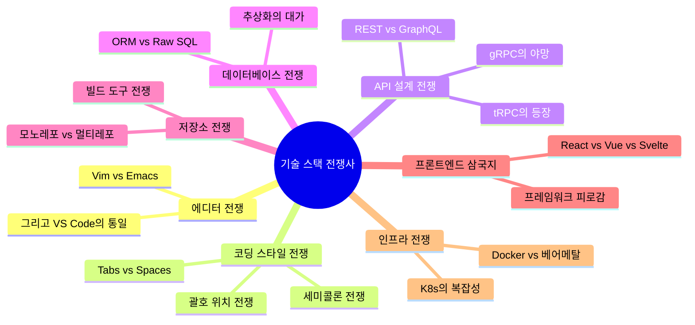

# 기술 스택 전쟁사: 개발자들의 끝나지 않는 성전

*"니가 쓰는 기술이 틀렸다" — 모든 개발자 커뮤니티의 영원한 떡밥*

---

개발자라는 종족은 참 신기한 존재임.
코드 한 줄 한 줄에 자아를 투영하고, 자기가 선택한 기술 스택을 마치 종교처럼 믿음.
그리고 다른 종교를 믿는 자들과 끝없는 성전을 벌임.

이 시리즈는 그런 개발자들의 역사적인 전쟁들을 기록한 연대기임.
누가 이겼는지, 누가 졌는지, 그리고 왜 아무도 진짜로 이기지 못했는지를 다룸.

<Callout type="warning" title="주의사항">
이 시리즈를 읽고 회사 슬랙에서 기술 토론을 시작하면 발생하는 모든 불이익에 대해 필자는 책임지지 않음.
"그 기술 왜 쓰세요?"라는 말은 개발자 사회에서 "싸우자"와 동의어임.
</Callout>

## 전쟁의 연대기

## 목차

| # | 전쟁 | 시대 | 승자 |
|---|------|------|------|
| 1 | [Vim vs Emacs](/docs/articles/tech-stack-wars/1.vim-vs-emacs) | 1970s~ | VS Code (어부지리) |
| 2 | [Tabs vs Spaces](/docs/articles/tech-stack-wars/2.tabs-vs-spaces) | 1990s~ | Prettier (강제 종전) |
| 3 | [REST vs GraphQL](/docs/articles/tech-stack-wars/3.rest-vs-graphql) | 2015~ | 공존 (냉전 체제) |
| 4 | [ORM vs Raw SQL](/docs/articles/tech-stack-wars/4.orm-vs-raw-sql) | 2000s~ | 쿼리 빌더 (절충안) |
| 5 | [모노레포 vs 멀티레포](/docs/articles/tech-stack-wars/5.monorepo-vs-multirepo) | 2010s~ | 규모에 따라 다름 (외교적 답변) |
| 6 | [React vs Vue vs Svelte](/docs/articles/tech-stack-wars/6.react-vs-vue-vs-svelte) | 2013~ | React (숫자의 힘) |
| 7 | [Docker vs 베어메탈](/docs/articles/tech-stack-wars/7.docker-vs-baremetal) | 2013~ | Docker (하지만 대가가...) |

## 이 시리즈를 읽어야 하는 사람

- 회사에서 기술 스택 선정 회의를 앞두고 있는 사람
- 레딧/HN에서 기술 토론을 구경하는 게 취미인 사람
- "그거 왜 쓰세요?"라는 질문에 감정적으로 반응한 적 있는 사람
- 자기가 쓰는 기술이 최고라고 믿는 사람 (현실 직시 필요)
- 주니어 개발자 (이 전쟁들의 맥락을 알아야 살아남음)

<Callout type="info" title="시리즈 컨셉">
각 글은 독립적으로 읽을 수 있음. 순서대로 읽을 필요 없고, 관심 있는 전쟁부터 골라서 읽으면 됨.
다만 전부 읽으면 개발자 커뮤니티에서 "아 이거 알지~" 하면서 고개를 끄덕일 수 있는 교양이 생김.
</Callout>

## 전쟁의 패턴

모든 기술 스택 전쟁에는 공통된 패턴이 있음:

1. **혁신가의 등장**: 기존 방식에 불만을 가진 누군가가 새로운 도구를 만듦
2. **얼리 어답터의 전파**: "이거 진짜 좋음 ㄹㅇ"
3. **메인스트림 도입**: 대기업이 쓰기 시작하면서 "우리도 해야 하나?"
4. **종교 전쟁 발발**: "기존 거 > 새로운 거" vs "새로운 거 > 기존 거"
5. **제3의 도구 등장**: 양쪽 다 피곤해질 때쯤 새로운 게 나옴
6. **1번으로 돌아감**

이게 개발자 생태계의 영원한 순환임.

<Callout type="note" title="면책 조항">
이 시리즈의 모든 의견은 필자 개인의 의견이며, 특정 기술을 비하하거나 폄하하려는 의도는 없음.
...이라고 쓰지만 사실 좀 있음. 하지만 모든 기술에 공평하게 까니까 괜찮음.
</Callout>

---

*그럼 첫 번째 전쟁, 에디터 전쟁부터 시작해보자.*
*이 전쟁은 1970년대에 시작되어 아직도 끝나지 않았다.*
*아니 사실 끝나긴 했는데 양쪽 다 인정을 안 한다.*
