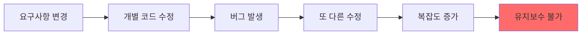
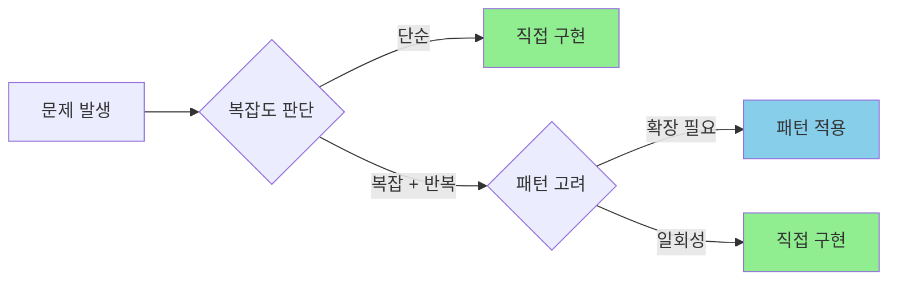

# SI 실전 디자인 패턴 시리즈

## "알면 빠르고, 모르면 느리다"

<Callout type="info" title="시리즈 개요">
웹 SI 프로젝트에서 **개발 생산성을 극대화**하는 디자인 패턴들을 현실적인 시나리오와 함께 다룹니다. 
이론이 아닌, 실제 프로젝트에서 당장 적용 가능한 패턴들만 선정했습니다.
</Callout>

---

## 왜 디자인 패턴인가?

### SI 현장의 현실

SI 프로젝트는 다른 개발과 다릅니다. 

- **촉박한 일정** 속에서 수십 개의 화면과 API를 개발해야 합니다
- **요구사항 변경**이 잦고, 클라이언트의 "이것도 추가해주세요"가 끝없이 이어집니다
- **다양한 개발자**들이 투입되고 이탈하면서 코드 일관성 유지가 어렵습니다
- **유사한 로직**이 반복되는데, 매번 새로 작성하면 유지보수 지옥이 시작됩니다

### 패턴이 해결하는 것

잘 설계된 디자인 패턴은 다음을 가능하게 합니다:

  

    <h4 className="font-bold mb-2">재사용성</h4>
    

      한 번 잘 만들어두면 유사한 기능을 빠르게 구현
    

  

  
  

    <h4 className="font-bold mb-2">이해하기 쉬움</h4>
    

      새로운 팀원이 코드를 빠르게 파악 (인지적 비용 감소)
    

  

  
  

    <h4 className="font-bold mb-2">변경 대응</h4>
    

      요구사항 변경 시 최소한의 수정으로 대응
    

  

  
  

    <h4 className="font-bold mb-2">일관성</h4>
    

      팀 전체가 동일한 구조로 개발하여 품질 향상
    

  

<Callout type="warning" title="실제 사례">
**결재(Approval) 시스템**을 예로 들어볼까요?

패턴 없이 개발하면: 각 화면마다 결재선 조회, 결재 요청, 상태 변경, 알림 발송 로직을 반복 작성 → 30개 화면이면 30번 작성

**Saga 패턴**을 적용하면: 공통 트랜잭션 관리 모듈 하나로 모든 결재 흐름 처리 → 신규 화면 추가 시 설정만 변경
</Callout>

---

## 시리즈 구성

이 시리즈에서는 **SI 프로젝트에서 반드시 만나게 되는 시나리오**를 중심으로 패턴을 소개합니다.

### Part 1: 아키텍처 패턴 (Backend)

복잡한 비즈니스 로직과 데이터 흐름을 관리하는 구조적 패턴들

#### 1. Saga 패턴: 분산 트랜잭션 관리의 정석

_결재, 주문, 예약 등 여러 단계를 거치는 프로세스 관리_

- **현실 시나리오**: 
  - 전자결재 시스템: 결재 요청 → 결재선 생성 → 승인자 알림 → 승인 → 최종 처리. 중간에 승인 거부되면 이전 단계들 모두 취소 필요
  - 구매 프로세스: 재고 확인 → 결제 처리 → 배송 예약 → 포인트 적립. 결제 실패 시 확보한 재고 다시 풀어줘야 함
  - 호텔 예약: 객실 예약 → 결제 → 이메일 발송 → 제휴사 API 호출. 어느 한 단계 실패 시 모두 되돌려야 함
- **해결하는 문제**: 중간 단계 실패 시 보상 트랜잭션 처리, 분산 환경에서의 데이터 일관성
- **기대효과**: 
  - 각 단계별 실패 시 어떻게 되돌릴지(보상 트랜잭션) 미리 정의해두면, 중간에 문제가 생겨도 자동으로 이전 단계 취소
  - 30개 화면에서 비슷한 프로세스를 각각 만들 필요 없이, Saga 설정만 추가하면 재사용 가능
  - 복잡한 try-catch 분기 대신 "정상 흐름"과 "보상 흐름"을 명확히 분리하여 코드 가독성 향상

#### 2. Repository 패턴: 데이터 접근 계층의 추상화

_ORM에 종속되지 않는 유연한 데이터 계층_

- **현실 시나리오**: 
  - 클라이언트 요구로 DB를 Oracle에서 PostgreSQL로 전환해야 하는 상황
  - TypeORM의 성능 이슈로 Prisma로 ORM을 교체해야 하는 경우
  - 특정 테이블만 Redis 캐시로 먼저 조회하도록 변경해야 할 때
  - 단위 테스트를 위해 실제 DB 대신 Mock 데이터로 테스트하고 싶을 때
- **해결하는 문제**: 비즈니스 로직과 데이터 접근 로직의 결합
- **기대효과**: 
  - Service 계층은 "User를 가져온다"만 알면 되고, 실제로 MySQL에서 가져오는지 MongoDB에서 가져오는지 몰라도 됨
  - ORM을 바꿔도 Repository 구현체만 교체하면 되고, 비즈니스 로직 코드는 수정할 필요 없음
  - 테스트 시 MockRepository로 바꿔치기만 하면 DB 없이도 로직 검증 가능

#### 3. CQRS: 명령과 조회의 분리

_복잡한 조회 화면과 간단한 등록/수정의 조화_

- **현실 시나리오**: 
  - 관리자 대시보드: 여러 테이블 JOIN하고 집계하는 복잡한 통계 쿼리 vs 게시글 등록은 단순 INSERT
  - 주문 내역 조회: 주문/상품/사용자/배송 정보를 모두 조합한 화면 vs 주문 생성은 간단한 데이터 저장
  - 실시간 모니터링: 초당 수백 건의 읽기 요청 vs 설정 변경은 가끔 발생
  - 엑셀 다운로드용 대량 데이터 조회 vs 한 건씩 수정하는 CRUD
- **해결하는 문제**: 하나의 모델로 읽기/쓰기를 모두 처리하는 복잡도
- **기대효과**: 
  - 조회용 API는 읽기 전용 복제본(Read Replica)에서 가져오고, 등록/수정은 Master DB에 저장하여 부하 분산
  - 복잡한 조회는 미리 만들어둔 View나 별도 집계 테이블에서 빠르게 조회
  - 등록/수정 로직은 검증과 저장만 집중하면 되어 단순해지고, 조회 로직은 성능 최적화에만 집중

#### 4. Strategy 패턴: 알고리즘의 동적 교체

_같은 목적, 다른 방법_

- **현실 시나리오**: 
  - 결제 수단 처리: 신용카드/계좌이체/카카오페이/네이버페이/토스페이 - 각각 다른 API를 호출하지만 "결제한다"는 목적은 동일
  - 포인트 적립 정책: 일반회원 1%, VIP 3%, VVIP 5%, 프로모션 기간엔 2배 - 회원 등급과 기간에 따라 계산 방식이 다름
  - 배송비 계산: 기본배송/무료배송/제주도 추가비용/해외배송 - 주문 금액과 지역에 따라 로직이 다름
  - 파일 업로드: 로컬 저장/AWS S3/Azure Blob/자체 CDN - 환경에 따라 저장소가 다름
- **해결하는 문제**: if-else 지옥, 새로운 전략 추가 시 기존 코드 수정
- **기대효과**: 
  - 새로운 결제 수단(예: Apple Pay) 추가 시 기존 코드 수정 없이 Strategy만 추가하면 됨
  - 각 전략이 독립적이어서 한 결제 수단의 버그가 다른 결제 수단에 영향 안 줌
  - 테스트 시 Mock 전략으로 쉽게 교체 가능

#### 5. Chain of Responsibility: 요청 처리의 연쇄

_승인 체인, 검증 파이프라인_

- **현실 시나리오**: 
  - 다단계 결재: 팀장 승인 → 부서장 승인 → 임원 승인 → 대표 승인. 금액에 따라 어디까지 올라갈지 동적으로 결정
  - 요청 데이터 검증: 필수값 체크 → 형식 검증 → 권한 확인 → 비즈니스 룰 검증. 하나라도 실패하면 즉시 리턴
  - 고객 지원 티켓: 일반 상담원 → 선임 상담원 → 팀장 → 매니저. 처리 가능한 사람이 나올 때까지 전달
  - API 미들웨어: 로깅 → 인증 → 권한 체크 → Rate Limiting → 실제 핸들러
- **해결하는 문제**: 여러 핸들러를 거쳐야 하는 요청 처리
- **기대효과**: 
  - 새로운 승인 단계나 검증 로직 추가 시 체인에 끼워넣기만 하면 되고 기존 코드 수정 불필요
  - 각 핸들러가 독립적이라 순서 변경이나 특정 핸들러 제거가 자유로움
  - "내가 처리할 수 있으면 처리, 아니면 다음으로" 로직이 명확해져 복잡한 if-else 분기 제거

---

### Part 2: AOP와 횡단 관심사

모든 비즈니스 로직에 공통으로 적용되는 기능들

#### 6. AOP (Aspect-Oriented Programming): 횡단 관심사의 분리

_로깅, 권한, 트랜잭션 - 모든 곳에 필요하지만 핵심은 아닌 것들_

- **현실 시나리오**: 
  - API 호출 로깅: 모든 API에서 "누가, 언제, 무엇을" 요청했는지 로그로 남기기. 각 API마다 로깅 코드 추가하면 중복 지옥
  - 권한 체크: 관리자 전용 API 50개에 모두 권한 검증 코드 추가? 한 줄이라도 빠뜨리면 보안 구멍
  - 트랜잭션 관리: 함수 시작에 `beginTransaction()`, 끝에 `commit()`, 에러 시 `rollback()` - 모든 서비스 함수마다 반복
  - 실행 시간 측정: 성능 모니터링을 위해 모든 함수에 `startTime`, `endTime` 측정 코드 추가
  - 캐시 처리: 자주 조회되는 데이터는 Redis에 캐싱. 매번 "캐시 확인 → 있으면 리턴, 없으면 DB 조회 → 캐시 저장" 반복
- **해결하는 문제**: 비즈니스 로직과 인프라 관심사의 혼재
- **기대효과**: 
  - `@Log`, `@Auth`, `@Transaction` 같은 데코레이터만 붙이면 자동으로 로깅/권한/트랜잭션 처리
  - 비즈니스 로직 함수는 핵심 로직만 담고, 부가 기능은 AOP가 자동으로 끼워 넣음
  - 로깅 정책 변경 시 100개 파일 수정할 필요 없이 AOP 설정 한 곳만 변경

#### 7. Decorator 패턴: 기능의 동적 확장

_원본을 수정하지 않고 기능 추가하기_

- **현실 시나리오**: 
  - API 응답 가공: 기본 데이터 조회 API에 → 캐싱 추가 → 암호화 추가 → 압축 추가. 각 기능을 독립적으로 on/off
  - 알림 발송: 기본 이메일 발송에 → 재시도 로직 추가 → 실패 시 SMS 폴백 추가 → 발송 이력 로깅 추가
  - 파일 스트림 처리: 파일 읽기에 → 버퍼링 추가 → 압축 추가 → 암호화 추가. 필요한 기능만 껴서 사용
  - HTTP 클라이언트: 기본 요청에 → 타임아웃 추가 → 재시도 추가 → 로깅 추가 → 인증 헤더 추가
- **해결하는 문제**: 기존 클래스 수정 없이 새로운 기능 추가
- **기대효과**: 
  - 원본 클래스는 건드리지 않고 Decorator로 감싸기만 하면 기능 추가 (개방-폐쇄 원칙)
  - 필요한 기능만 골라서 조합 가능. "압축만", "암호화만", "압축+암호화" 등 자유자재
  - 각 Decorator가 독립적이라 테스트하기 쉽고, 한 기능의 버그가 다른 기능에 영향 안 줌

---

### Part 3: 생성과 구성의 지혜

복잡한 객체 생성을 우아하게

#### 8. Factory 패턴: 객체 생성의 캡슐화

_무엇을 만들지는 알지만, 어떻게 만드는지는 숨기기_

- **현실 시나리오**: 
  - 알림 발송: type이 "email"이면 EmailSender, "sms"면 SmsSender, "push"면 PushSender 생성. 각각 초기화 로직이 복잡함
  - 리포트 생성: "excel" → ExcelReportGenerator, "pdf" → PdfReportGenerator, "csv" → CsvReportGenerator
  - 결제 처리기: 결제 수단에 따라 KakaoPayment, NaverPayment, TossPayment 객체 생성
  - 차트 렌더러: "bar" → BarChart, "line" → LineChart, "pie" → PieChart. 각각 다른 라이브러리와 설정 필요
- **해결하는 문제**: 복잡한 생성 로직, 타입에 따른 객체 생성 분기
- **기대효과**: 
  - "알림 보내줘"만 요청하면 Factory가 알아서 적절한 Sender 만들어줌. 호출하는 쪽은 생성 로직 몰라도 됨
  - 새로운 타입(예: Slack 알림) 추가 시 Factory에만 case 추가하면 되고, 호출 코드는 수정 불필요
  - 복잡한 초기화 로직(API 키, 연결 설정 등)을 Factory에서 한 곳에 관리

#### 9. Builder 패턴: 복잡한 객체의 단계별 조립

_많은 옵션, 깔끔한 생성_

- **현실 시나리오**: 
  - SQL 쿼리 빌더: `SELECT * FROM users WHERE age > 20 AND city = 'Seoul' ORDER BY name LIMIT 10` - 조건과 정렬이 동적으로 추가됨
  - HTTP 요청 생성: URL, 헤더, 쿼리 파라미터, 바디, 타임아웃, 재시도 옵션 등 수십 개 옵션 조합
  - 이메일 발송: 받는 사람, 참조, 숨은 참조, 제목, 본문, 첨부파일, 발송 예약 시간, 우선순위 등
  - 대시보드 리포트 설정: 기간, 그룹핑, 필터, 정렬, 차트 타입, 색상, 범례 표시 여부 등
- **해결하는 문제**: 생성자 파라미터가 너무 많은 경우, 선택적 속성이 많은 경우
- **기대효과**: 
  - `new User(name, age, email, phone, address, ...)` 대신 `User.builder().name("홍길동").age(30).email("...").build()` - 어떤 값이 무엇인지 명확
  - 필수 항목과 선택 항목을 명확히 구분. 필수 항목 빠지면 컴파일 타임에 에러
  - 한 번에 완성하지 않고 단계적으로 조립 가능. "일단 기본 설정 → 조건에 따라 옵션 추가" 패턴

#### 10. Adapter 패턴: 레거시와의 동행

_오래된 시스템과 새로운 시스템의 다리_

- **현실 시나리오**: 
  - 레거시 API 연동: 10년 전 구축한 SOAP API를 새로운 RESTful 시스템에서 호출해야 함. XML ↔ JSON 변환 필요
  - 외부 결제 서비스: 여러 PG사마다 다른 API 인터페이스를 우리 시스템의 통일된 인터페이스로 통합
  - 라이브러리 교체: moment.js에서 dayjs로 교체 준비. 모든 코드를 한 번에 바꿀 수 없어 Adapter로 점진적 전환
  - ERP 시스템 연동: 외주 개발한 ERP의 복잡한 인터페이스를 우리 팀이 이해하기 쉬운 간단한 인터페이스로 감싸기
- **해결하는 문제**: 호환되지 않는 인터페이스 간 통신
- **기대효과**: 
  - 레거시 시스템은 건드리지 않고 Adapter만 만들어서 신규 시스템과 연결
  - 외부 서비스 변경 시 Adapter만 수정하면 되고 비즈니스 로직은 영향 없음
  - 복잡한 외부 인터페이스를 단순한 우리 도메인 인터페이스로 변환하여 팀원들의 학습 비용 감소

---

### Part 4: 프론트엔드 패턴

React/Vue 생태계에서의 컴포넌트 설계

#### 11. Higher-Order Component (HOC): 컴포넌트 로직의 재사용

_인증, 권한, 로딩 - 반복되는 UI 로직 처리_

- **현실 시나리오**: 
  - 로그인 체크: 30개 관리자 페이지마다 "로그인 안 되어있으면 로그인 페이지로 리다이렉트" 로직 반복
  - 권한별 렌더링: "관리자만 보기", "VIP만 보기", "본인만 보기" - 각 페이지마다 권한 체크 코드 중복
  - 로딩 상태 처리: 모든 데이터 페칭 컴포넌트에서 "로딩 중이면 스피너, 에러면 에러 메시지, 성공하면 내용" 반복
  - 분석 추적: GA나 Mixpanel로 페이지 뷰 추적하는 코드를 모든 페이지에 추가
- **해결하는 문제**: 여러 컴포넌트에서 반복되는 로직
- **기대효과**: 
  - `withAuth(MyPage)` 한 줄이면 로그인 체크 자동 적용. 30개 페이지에 일일이 복붙할 필요 없음
  - 인증 로직 변경(예: 토큰 검증 방식 변경) 시 HOC 하나만 수정하면 모든 페이지에 반영
  - 핵심 컴포넌트는 본연의 역할(UI 렌더링)만 집중하고, 부가 기능은 HOC가 담당

#### 12. Render Props & Custom Hooks: 로직 공유의 현대적 접근

_HOC의 대안이자 보완_

- **현실 시나리오**: 
  - 데이터 페칭: `useFetch('/api/users')` - 로딩, 에러, 데이터 상태를 모든 API 호출에서 재사용
  - 폼 상태 관리: `useForm()` - 입력값 변경, 검증, 제출 로직을 여러 폼에서 공유
  - 무한 스크롤: `useInfiniteScroll()` - 스크롤 이벤트 감지와 페이지 로딩을 여러 목록 화면에서 재사용
  - 모달 제어: `useModal()` - 모달 열기/닫기 상태를 여러 컴포넌트에서 사용
  - 타이머/인터벌: `useInterval(callback, delay)` - setInterval 로직을 안전하게 재사용
- **해결하는 문제**: HOC의 wrapper hell, props 네이밍 충돌
- **기대효과**: 
  - HOC처럼 컴포넌트를 감싸지 않아도 로직 재사용 가능. `withAuth(withLoading(withTracking(MyPage)))` 같은 중첩 제거
  - Custom Hook은 그냥 함수라서 여러 개 조합하기 쉽고, 타입스크립트 추론도 잘 됨
  - 컴포넌트 구조가 간단해지고, 어떤 로직을 사용하는지 코드 읽을 때 바로 파악 가능

#### 13. Compound Components: 복잡한 UI의 유연한 구성

_사용자에게 제어권을 주는 컴포넌트 설계_

- **현실 시나리오**: 
  - Dropdown: `<Dropdown><Trigger>클릭</Trigger><Menu><Item>항목1</Item></Menu></Dropdown>` - 트리거와 메뉴를 자유롭게 배치
  - Accordion: 각 아코디언 아이템의 헤더와 내용을 개별적으로 커스터마이징
  - Tabs: 탭 버튼과 탭 패널을 원하는 위치에 배치 (탭 상단, 하단, 좌측 등)
  - Modal: 헤더, 바디, 푸터를 선택적으로 구성하고 각각 다른 스타일 적용
- **해결하는 문제**: 과도하게 많은 props, 제한된 커스터마이징
- **기대효과**: 
  - `<Select title="..." options={[...]} renderOption={...} showSearch={...} />` 같은 수십 개 props 대신, 구조적으로 조립
  - 컴포넌트 제작자가 예상 못한 디자인도 사용자가 자유롭게 구현 가능
  - 각 서브 컴포넌트가 독립적이라 부분 교체나 확장이 쉬움

#### 14. Container/Presenter 패턴: 로직과 뷰의 분리

_비즈니스 로직과 UI를 각자의 자리에_

- **현실 시나리오**: 
  - 사용자 목록: Container는 API 호출, 필터링, 정렬 담당 / Presenter는 순수하게 받은 데이터를 테이블로 렌더링만
  - 제품 카드: Container는 장바구니 담기, 찜하기 로직 담당 / Presenter는 이미지, 가격, 버튼 UI만 그림
  - 차트 컴포넌트: Container는 데이터 가공, 옵션 계산 담당 / Presenter는 Chart.js 라이브러리로 그리기만
  - Storybook 활용: Presenter만 분리하면 실제 API 없이도 모든 UI 케이스 미리보기 가능
- **해결하는 문제**: 비즈니스 로직과 렌더링 로직의 혼재
- **기대효과**: 
  - Presenter는 props만 받아서 렌더링하므로 다른 페이지에서도 재사용 가능
  - Presenter는 순수 함수처럼 동작해서 테스트하기 쉬움. "이 props 넣으면 이렇게 나온다" 검증
  - 디자이너가 Presenter의 스타일만 수정하고, 개발자는 Container의 로직만 수정하여 협업 효율 향상

---

### Part 5: API와 상태 관리

프론트엔드-백엔드 연결의 기술

#### 15. Repository 패턴 (Frontend): API 호출의 추상화

_axios에서 fetch로, 또는 GraphQL로 - 쉽게 교체하기_

- **현실 시나리오**: 
  - API 클라이언트 교체: axios에서 fetch API로, 또는 GraphQL로 전환. 100개 컴포넌트에 직접 호출 코드가 있으면 지옥
  - 모킹 테스트: 실제 API 없이 컴포넌트 테스트하려면 API 호출 부분을 Mock으로 교체해야 함
  - API 엔드포인트 변경: `/api/v1/users`가 `/api/v2/users`로 변경될 때 모든 호출 위치 찾아서 수정
  - 공통 에러 처리: 401 에러면 로그아웃, 500 에러면 에러 페이지 - 모든 API 호출마다 반복
  - 인증 토큰 갱신: 토큰 만료 시 자동 갱신 로직을 모든 API 호출에 적용
- **해결하는 문제**: 컴포넌트가 HTTP 라이브러리에 직접 의존
- **기대효과**: 
  - 컴포넌트는 `userRepository.getUsers()`만 호출하면 되고, 내부가 axios인지 fetch인지 몰라도 됨
  - Repository만 교체하면 API 클라이언트 변경이 한 번에 처리
  - 테스트 시 MockRepository 주입하면 실제 서버 없이도 모든 시나리오 테스트 가능

#### 16. Observer 패턴: 상태 변경의 전파

_한 곳의 변경이 여러 곳에 자동 반영_

- **현실 시나리오**: 
  - 장바구니 카운트: 상품 추가하면 → 헤더의 장바구니 아이콘 숫자, 장바구니 페이지, 주문 요약 - 3곳이 자동 업데이트
  - 사용자 프로필 변경: 이름 수정하면 → 네비게이션 바, 사이드바, 댓글 목록의 내 이름 - 모든 곳에 반영
  - 실시간 알림: WebSocket으로 새 메시지 도착 → 알림 배지, 메시지 목록, 사이드바 - 동시에 업데이트
  - 테마 변경: 다크모드 토글 → 모든 컴포넌트가 자동으로 색상 변경
- **해결하는 문제**: 상태 변경 시 수동으로 여러 곳 업데이트
- **기대효과**: 
  - 상태를 구독(subscribe)한 컴포넌트들이 변경을 자동 감지해서 리렌더링
  - 상태 변경 로직과 UI 업데이트 로직이 분리되어 각각 독립적으로 관리
  - Redux, MobX 같은 상태 관리 라이브러리가 이 패턴 기반. "한 곳에서 상태 변경, 여러 곳에서 자동 반영"

---

### Part 6: 실전 조합 패턴

실제 프로젝트에서 패턴들을 함께 사용하기

#### 17. 결재 시스템 설계: Saga + Chain of Responsibility

_실무 시나리오로 보는 패턴 조합_

**시나리오**: 인하우스 전자결재 시스템 구축

- **요구사항**: 부서별 결재선 자동 생성, 금액별 승인 단계 차등, 중간 단계 실패 시 자동 롤백, 알림 발송
- **Saga 패턴**: 결재 요청 → 결재선 생성 → 1차 승인 → 2차 승인 → 최종 처리. 거부 시 이전 단계들 자동 취소
- **Chain of Responsibility**: 금액에 따라 팀장 → 부서장 → 임원 → 대표. 각 단계에서 승인/거부/다음 단계 결정
- **실전 포인트**: 두 패턴을 어떻게 조합하는가, 상태 관리는 어떻게 하는가, 알림은 어디서 보내는가
- **트레이드오프**: 패턴 적용으로 얻는 이점 vs 초기 구축 비용

#### 18. 어드민 대시보드 설계: CQRS + Repository + HOC

_복잡한 조회와 간단한 CRUD의 조화_

**시나리오**: 관리자 대시보드 + 회원 관리

- **요구사항**: 통계 대시보드 (복잡한 집계), 회원 목록 조회 (검색/필터), 회원 정보 수정 (단순 CRUD)
- **CQRS**: 조회는 Read Model (캐시, View), 수정은 Write Model (검증, 저장) 분리
- **Repository (Backend)**: ORM 변경이나 캐시 추가 시 서비스 계층 수정 불필요
- **Repository (Frontend)**: API 클라이언트 교체나 엔드포인트 변경에 대응
- **HOC**: `withAuth`, `withLoading` - 모든 관리자 페이지에 자동 적용
- **실전 포인트**: 프론트-백 전체를 패턴으로 일관되게 설계하는 방법

---

## 이 시리즈가 제시하는 것

<Callout type="success" title="학습 목표">
각 패턴마다 다음을 다룹니다:

1. **현실적 시나리오**: "이런 상황에서 쓰입니다"
2. **Before/After 코드**: 패턴 적용 전후 비교
3. **트레이드오프**: 장단점과 사용 시점 판단
4. **실제 구현**: 바로 복사해서 쓸 수 있는 코드
5. **함정 주의**: 잘못 사용하면 오히려 복잡해지는 경우
</Callout>

---

## 이 시리즈의 철학

### 패턴은 은탄환이 아닙니다

<Callout type="warning" title="주의">
디자인 패턴은 **도구**입니다. 

- 모든 곳에 적용할 필요 없습니다
- 과도한 추상화는 오히려 복잡도를 높입니다
- "지금 당장 필요한가?"를 항상 질문하세요
</Callout>

### 언제 패턴을 적용해야 할까?

다음 신호가 보이면 패턴 적용을 고려하세요:

- 같은 코드를 3번 이상 복사-붙여넣기했다
- 새로운 기능 추가 시 기존 코드를 매번 수정해야 한다
- 요구사항 변경이 여러 파일에 걸쳐 영향을 미친다
- 신규 개발자가 코드를 이해하는 데 오래 걸린다
- 테스트 작성이 너무 어렵다

<Blockquote author="Kent Beck" cite="Extreme Programming">
Make it work, make it right, make it fast.

동작하게 만들고, 올바르게 만들고, 그다음에 빠르게 만들어라.
</Blockquote>

### 망치를 든 사람에게는 모든 것이 못으로 보인다

<Callout type="error" title="오버엔지니어링의 함정">
디자인 패턴을 배웠다고 해서 모든 문제를 디자인 패턴으로 접근하면, **80%는 오버엔지니어링**으로 간단한 문제를 복잡하게 만들게 됩니다.
</Callout>

디자인 패턴은 **문제 해결의 노하우**입니다. 

이 노하우를 배우는 것은 당연히 도움이 되지만, 중요한 사실이 있습니다. 디자인 패턴은 누군가 "발명"한 것이 아니라 **"발견"**한 것입니다. 수많은 개발자들이 비슷한 문제를 각자의 방식으로 해결하다가, 그 중 효과적인 해법들이 패턴으로 정리된 것이죠.

#### 먼저 부딪혀보는 경험이 필수입니다

패턴을 진짜 이해하려면:

1. **일단 생각나는 대로 구현해보세요**
2. **똑같은 문제를 여러 번 마주쳐보세요**
3. **그때 비로소 패턴이 보입니다**

그래야 진짜 튀어나온 못에만 망치를 칠 수 있습니다. 그냥 망치를 휘두르면 벽만 깨질 것입니다.

<Callout type="info" title="경험이 부족한 개발자라면">
이러한 디자인 패턴 공부를 **"무엇이 진짜 튀어나온 못인지 알아보는 훈련"**이라고 생각하세요.

- 패턴을 암기하는 것이 목표가 아닙니다
- "아, 이런 상황에서 이 패턴이 필요하구나"를 체득하는 것이 목표입니다
- 실제 프로젝트에서 비슷한 상황을 만나면 "어디서 본 것 같은데?"라는 감각을 키우는 것입니다
</Callout>

#### 실무에서의 균형

좋은 개발자는 언제 패턴을 **적용하지 말아야 하는지**도 압니다.

---

## 시리즈 읽는 법

<Steps>
  <Step title="현재 프로젝트의 문제점 파악">
    지금 개발 중인 프로젝트에서 반복되거나 복잡한 부분을 메모하세요.
  </Step>
  
  <Step title="관련 패턴 찾기">
    위 목록에서 비슷한 시나리오를 가진 패턴을 선택하세요.
  </Step>
  
  <Step title="작은 부분부터 적용">
    전체 시스템을 리팩토링하지 말고, 작은 모듈 하나부터 시작하세요.
  </Step>
  
  <Step title="팀과 공유">
    적용한 패턴을 팀원들과 공유하고 피드백을 받으세요.
  </Step>
</Steps>

---

## 시작하기

<Callout type="info" title="권장 학습 순서">
**백엔드 개발자**: Part 1 → Part 2 → Part 3 → Part 6

**프론트엔드 개발자**: Part 4 → Part 5 → Part 6

**풀스택 개발자**: 순서대로 전체 학습
</Callout>

각 패턴은 독립적으로 학습 가능하지만, Part 6에서는 여러 패턴을 조합하므로 개별 패턴을 먼저 이해하는 것을 권장합니다.

---

## 마치며

SI 프로젝트는 빠르게 개발하면서도 안정적이어야 하는, 언뜻 모순된 요구사항을 충족해야 합니다. 

디자인 패턴은 선배 개발자들이 수많은 시행착오 끝에 찾아낸 해결책입니다. 바퀴를 다시 발명하지 마세요. 검증된 패턴을 이해하고 적용하는 것이 가장 빠른 길입니다.

<Callout type="success" title="다음 글에서">
**Part 1: Saga 패턴**으로 시작합니다. 

결재 시스템을 예제로 분산 트랜잭션을 우아하게 관리하는 방법을 알아봅니다.
</Callout>

---

_"좋은 개발자는 코드를 작성하고, 위대한 개발자는 코드를 작성하지 않습니다. 패턴을 활용해 문제를 해결합니다."_

