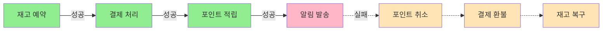

# Saga 패턴: 분산 트랜잭션 관리의 정석

## 시작하며

SI 프로젝트에서 빠질 수 없는 요구사항이 하나 있습니다. 바로 **여러 단계를 거치는 업무 프로세스**입니다.

전자결재 시스템을 만들어본 적이 있다면 공감하실 겁니다. 결재 요청이 들어오면 결재선을 생성하고, 첫 번째 승인자에게 알림을 보내고, 승인이 완료되면 다음 단계로 넘어가고... 그런데 중간에 승인이 거부되면? 이미 처리된 단계들을 어떻게 되돌릴까요?

이런 상황에서 Saga 패턴이 답을 제시합니다.

---

## 문제 상황: 복잡한 프로세스의 실패 처리

### 전형적인 SI 시나리오

고객사로부터 이런 요구사항을 받았다고 가정해봅시다:

<Callout type="info" title="요구사항: 구매 요청 시스템">
1. 사용자가 상품 구매를 요청한다
2. 재고를 확인하고 예약한다
3. 결제를 처리한다
4. 포인트를 적립한다
5. 구매 확정 알림을 발송한다

**단, 중간에 실패하면 이전 단계를 모두 취소해야 한다.**
</Callout>

### 순진한 접근: Try-Catch 지옥

처음엔 이렇게 작성하게 됩니다:

```typescript
async function purchaseProduct(userId: string, productId: string) {
  let reservedInventory = null;
  let payment = null;
  let points = null;
  
  try {
    // 1. 재고 예약
    reservedInventory = await inventoryService.reserve(productId);
    
    try {
      // 2. 결제 처리
      payment = await paymentService.process(userId, reservedInventory.amount);
      
      try {
        // 3. 포인트 적립
        points = await pointService.add(userId, reservedInventory.amount * 0.01);
        
        try {
          // 4. 알림 발송
          await notificationService.send(userId, '구매가 완료되었습니다');
          
          return { success: true };
        } catch (notificationError) {
          // 알림 실패 - 포인트 취소
          await pointService.cancel(points.id);
          throw notificationError;
        }
      } catch (pointError) {
        // 포인트 실패 - 결제 취소
        await paymentService.refund(payment.id);
        throw pointError;
      }
    } catch (paymentError) {
      // 결제 실패 - 재고 복구
      await inventoryService.release(reservedInventory.id);
      throw paymentError;
    }
  } catch (inventoryError) {
    // 재고 부족
    throw inventoryError;
  }
}
```

이 코드의 문제점:

- **가독성**: 중첩된 try-catch로 로직 파악이 어렵습니다
- **확장성**: 새로운 단계 추가 시 전체 구조를 수정해야 합니다
- **재사용성**: 비슷한 프로세스마다 같은 구조를 반복 작성해야 합니다
- **누락 위험**: 어떤 단계의 보상 트랜잭션을 빠뜨리기 쉽습니다

<Callout type="warning" title="실제 프로젝트에서">
처음엔 3단계 정도라 괜찮아 보이다가, 요구사항이 추가되면서 7~8단계로 늘어나면... 유지보수가 불가능해집니다.
</Callout>

---

## Saga 패턴이란?

Saga 패턴은 **긴 비즈니스 프로세스를 작은 로컬 트랜잭션들의 연속으로 나누고, 각 트랜잭션마다 보상(Compensation) 로직을 정의**하는 패턴입니다.

### 핵심 개념



각 단계는:
1. **Transaction**: 실제 비즈니스 로직 수행
2. **Compensation**: 실패 시 이전 상태로 되돌리는 로직

---

## 실전 구현: NestJS로 만드는 Saga

### 1단계: Saga Step 정의

먼저 각 단계의 인터페이스를 정의합니다:

```typescript
// saga/saga-step.interface.ts
export interface SagaStep<TInput = any, TOutput = any> {
  name: string;
  execute(context: SagaContext): Promise<TOutput>;
  compensate(context: SagaContext): Promise<void>;
}

export interface SagaContext {
  data: Record<string, any>;
  history: Array<{ step: string; result: any }>;
}
```

### 2단계: Saga Orchestrator 구현

Saga를 실행하고 실패 시 보상을 처리하는 오케스트레이터를 만듭니다:

```typescript
// saga/saga-orchestrator.ts
import { Injectable, Logger } from '@nestjs/common';

@Injectable()
export class SagaOrchestrator {
  private readonly logger = new Logger(SagaOrchestrator.name);

  async execute(steps: SagaStep[], initialData: any = {}) {
    const context: SagaContext = {
      data: initialData,
      history: [],
    };

    let currentStepIndex = 0;

    try {
      // 각 단계를 순차적으로 실행
      for (let i = 0; i < steps.length; i++) {
        currentStepIndex = i;
        const step = steps[i];
        
        this.logger.log(`Executing step: ${step.name}`);
        const result = await step.execute(context);
        
        // 결과를 컨텍스트에 저장
        context.data[step.name] = result;
        context.history.push({ step: step.name, result });
        
        this.logger.log(`Step ${step.name} completed successfully`);
      }

      return {
        success: true,
        data: context.data,
      };
    } catch (error) {
      this.logger.error(`Step ${steps[currentStepIndex].name} failed: ${error.message}`);
      
      // 실패한 시점부터 역순으로 보상 실행
      await this.compensate(steps, currentStepIndex, context);
      
      throw error;
    }
  }

  private async compensate(
    steps: SagaStep[],
    failedStepIndex: number,
    context: SagaContext,
  ) {
    this.logger.warn('Starting compensation...');

    // 실패한 단계의 이전 단계들을 역순으로 보상
    for (let i = failedStepIndex - 1; i >= 0; i--) {
      const step = steps[i];
      
      try {
        this.logger.log(`Compensating step: ${step.name}`);
        await step.compensate(context);
        this.logger.log(`Step ${step.name} compensated successfully`);
      } catch (compensationError) {
        this.logger.error(
          `Failed to compensate step ${step.name}: ${compensationError.message}`,
        );
        // 보상 실패는 로깅만 하고 계속 진행
        // 실무에서는 별도의 에러 처리 큐에 넣거나 관리자 알림을 보냅니다
      }
    }

    this.logger.warn('Compensation completed');
  }
}
```

### 3단계: 구체적인 Step 구현

이제 실제 비즈니스 로직을 담은 Step들을 구현합니다:

```typescript
// purchase/steps/reserve-inventory.step.ts
import { Injectable } from '@nestjs/common';
import { SagaStep, SagaContext } from '../saga/saga-step.interface';
import { InventoryService } from '../inventory/inventory.service';

@Injectable()
export class ReserveInventoryStep implements SagaStep {
  name = 'reserveInventory';

  constructor(private readonly inventoryService: InventoryService) {}

  async execute(context: SagaContext) {
    const { productId, quantity } = context.data;
    
    const reservation = await this.inventoryService.reserve(productId, quantity);
    
    return reservation;
  }

  async compensate(context: SagaContext) {
    const reservation = context.data[this.name];
    
    if (reservation) {
      await this.inventoryService.release(reservation.id);
    }
  }
}
```

```typescript
// purchase/steps/process-payment.step.ts
import { Injectable } from '@nestjs/common';
import { SagaStep, SagaContext } from '../saga/saga-step.interface';
import { PaymentService } from '../payment/payment.service';

@Injectable()
export class ProcessPaymentStep implements SagaStep {
  name = 'processPayment';

  constructor(private readonly paymentService: PaymentService) {}

  async execute(context: SagaContext) {
    const { userId, amount } = context.data;
    const reservation = context.data.reserveInventory;
    
    const payment = await this.paymentService.charge(
      userId,
      reservation.totalAmount,
    );
    
    return payment;
  }

  async compensate(context: SagaContext) {
    const payment = context.data[this.name];
    
    if (payment) {
      await this.paymentService.refund(payment.id);
    }
  }
}
```

```typescript
// purchase/steps/add-points.step.ts
import { Injectable } from '@nestjs/common';
import { SagaStep, SagaContext } from '../saga/saga-step.interface';
import { PointService } from '../point/point.service';

@Injectable()
export class AddPointsStep implements SagaStep {
  name = 'addPoints';

  constructor(private readonly pointService: PointService) {}

  async execute(context: SagaContext) {
    const { userId } = context.data;
    const payment = context.data.processPayment;
    
    const pointAmount = Math.floor(payment.amount * 0.01); // 1% 적립
    const points = await this.pointService.add(userId, pointAmount);
    
    return points;
  }

  async compensate(context: SagaContext) {
    const points = context.data[this.name];
    
    if (points) {
      await this.pointService.deduct(points.userId, points.amount);
    }
  }
}
```

```typescript
// purchase/steps/send-notification.step.ts
import { Injectable } from '@nestjs/common';
import { SagaStep, SagaContext } from '../saga/saga-step.interface';
import { NotificationService } from '../notification/notification.service';

@Injectable()
export class SendNotificationStep implements SagaStep {
  name = 'sendNotification';

  constructor(private readonly notificationService: NotificationService) {}

  async execute(context: SagaContext) {
    const { userId } = context.data;
    
    await this.notificationService.send(userId, {
      title: '구매 완료',
      message: '상품 구매가 정상적으로 처리되었습니다.',
    });
    
    return { sent: true };
  }

  async compensate(context: SagaContext) {
    // 알림은 보상이 불가능하므로 빈 로직
    // 필요하다면 "취소 알림"을 보낼 수도 있습니다
  }
}
```

### 4단계: Service에서 Saga 사용

이제 서비스에서 이 Saga를 사용합니다:

```typescript
// purchase/purchase.service.ts
import { Injectable } from '@nestjs/common';
import { SagaOrchestrator } from '../saga/saga-orchestrator';
import { ReserveInventoryStep } from './steps/reserve-inventory.step';
import { ProcessPaymentStep } from './steps/process-payment.step';
import { AddPointsStep } from './steps/add-points.step';
import { SendNotificationStep } from './steps/send-notification.step';

@Injectable()
export class PurchaseService {
  constructor(
    private readonly sagaOrchestrator: SagaOrchestrator,
    private readonly reserveInventoryStep: ReserveInventoryStep,
    private readonly processPaymentStep: ProcessPaymentStep,
    private readonly addPointsStep: AddPointsStep,
    private readonly sendNotificationStep: SendNotificationStep,
  ) {}

  async purchaseProduct(userId: string, productId: string, quantity: number) {
    const steps = [
      this.reserveInventoryStep,
      this.processPaymentStep,
      this.addPointsStep,
      this.sendNotificationStep,
    ];

    return await this.sagaOrchestrator.execute(steps, {
      userId,
      productId,
      quantity,
    });
  }
}
```

---

## Before vs After

### Before: Try-Catch 지옥

- 중첩된 try-catch로 가독성 최악
- 새로운 단계 추가 시 전체 구조 수정 필요
- 보상 로직이 흩어져 있어 누락 가능성 높음

### After: Saga 패턴

```typescript
// 새로운 단계 추가가 간단합니다
async purchaseProduct(userId: string, productId: string, quantity: number) {
  const steps = [
    this.reserveInventoryStep,
    this.processPaymentStep,
    this.addPointsStep,
    this.sendCouponStep,        // ← 새로운 단계 추가
    this.sendNotificationStep,
  ];

  return await this.sagaOrchestrator.execute(steps, {
    userId,
    productId,
    quantity,
  });
}
```

장점:
- **명확한 구조**: 각 단계가 독립적인 클래스로 분리
- **쉬운 테스트**: 각 Step을 개별적으로 테스트 가능
- **재사용성**: 같은 Step을 다른 Saga에서도 사용 가능
- **확장성**: 새로운 단계 추가가 기존 코드 수정 없이 가능

---

## 실전 팁

### 1. 보상 불가능한 단계는 어떻게?

알림 발송처럼 보상이 불가능한 단계는 **가장 마지막**에 배치하세요.

```typescript
const steps = [
  this.reserveInventoryStep,     // 보상 가능
  this.processPaymentStep,       // 보상 가능
  this.addPointsStep,            // 보상 가능
  this.sendNotificationStep,     // 보상 불가 - 마지막에 배치
];
```

### 2. 보상 실패는 어떻게 처리?

보상 자체가 실패할 수도 있습니다. 이 경우:

```typescript
private async compensate(steps: SagaStep[], failedStepIndex: number, context: SagaContext) {
  const failedCompensations = [];

  for (let i = failedStepIndex - 1; i >= 0; i--) {
    const step = steps[i];
    
    try {
      await step.compensate(context);
    } catch (error) {
      failedCompensations.push({
        step: step.name,
        error: error.message,
        context: context.data,
      });
    }
  }

  if (failedCompensations.length > 0) {
    // 별도 큐에 저장하여 수동 처리하거나 재시도
    await this.compensationFailureQueue.add(failedCompensations);
    
    // 관리자에게 알림
    await this.alertService.notifyAdmin(
      '보상 트랜잭션 실패',
      failedCompensations,
    );
  }
}
```

### 3. 동시성 문제 해결

재고 예약 같은 경우 동시성 제어가 필요합니다:

```typescript
@Injectable()
export class ReserveInventoryStep implements SagaStep {
  async execute(context: SagaContext) {
    const { productId, quantity } = context.data;
    
    // 비관적 락 또는 낙관적 락 사용
    return await this.inventoryService.reserveWithLock(productId, quantity);
  }
}
```

### 4. 장기 실행 Saga는 이벤트 기반으로

결재 시스템처럼 승인 대기 시간이 긴 경우, 동기식 Saga가 아닌 **이벤트 기반 Saga**를 사용하세요:

```typescript
// 각 단계마다 이벤트를 발행하고, 다음 단계가 이를 구독
@EventPattern('approval.requested')
async handleApprovalRequest(data: ApprovalRequestEvent) {
  // Step 1 실행 후 다음 이벤트 발행
  await this.createApprovalLineStep.execute(data);
  this.eventEmitter.emit('approval.line.created', data);
}

@EventPattern('approval.line.created')
async handleLineCreated(data: ApprovalLineCreatedEvent) {
  // Step 2 실행
  await this.notifyFirstApproverStep.execute(data);
}
```

---

## 트레이드오프

### 장점

- **명확한 실패 처리**: 보상 로직이 각 단계에 명시적으로 정의됨
- **가독성**: 복잡한 프로세스를 단계별로 이해하기 쉬움
- **재사용성**: Step을 다른 Saga에서도 재사용 가능
- **확장성**: 새로운 단계 추가가 간단함
- **테스트**: 각 단계를 독립적으로 테스트 가능

### 단점

- **초기 구축 비용**: 간단한 로직에는 오버엔지니어링
- **복잡도 증가**: 파일 수가 늘어남
- **디버깅**: 단계가 많아지면 흐름 추적이 어려울 수 있음
- **완벽한 보상 불가능**: 일부 작업은 되돌릴 수 없음

<Callout type="warning" title="언제 Saga를 피해야 할까?">
- **3단계 이하의 간단한 프로세스**: 일반 try-catch가 더 직관적입니다
- **보상이 불가능한 단계가 많은 경우**: Saga의 장점을 살리기 어렵습니다
- **실시간성이 중요한 경우**: Saga는 추가 오버헤드가 있습니다
</Callout>

---

## 실무 적용 사례

### 전자결재 시스템

```typescript
const approvalSteps = [
  this.createApprovalDocumentStep,    // 결재 문서 생성
  this.generateApprovalLineStep,      // 결재선 자동 생성
  this.notifyFirstApproverStep,       // 첫 번째 승인자 알림
  this.waitForApprovalStep,           // 승인 대기 (이벤트 기반)
];
```

중간에 승인이 거부되면:
- 결재선 삭제
- 문서 상태를 "반려"로 변경
- 요청자에게 반려 알림

### 호텔 예약 시스템

```typescript
const reservationSteps = [
  this.checkAvailabilityStep,         // 객실 확인
  this.reserveRoomStep,               // 객실 예약
  this.processPaymentStep,            // 결제 처리
  this.sendConfirmationEmailStep,     // 예약 확인 이메일
  this.notifyPartnerAPIStep,          // 제휴사 API 호출
];
```

결제 실패 시:
- 예약된 객실 다시 풀어주기
- 제휴사 API 호출 취소
- 사용자에게 실패 알림

---

## 마치며

Saga 패턴은 **복잡한 비즈니스 프로세스를 관리 가능한 단계로 나누고, 실패에 안전하게 대응**할 수 있게 해줍니다.

처음엔 "이게 필요할까?" 싶을 수 있습니다. 하지만 3단계였던 프로세스가 5단계, 7단계로 늘어나고, 중간에 외부 API 호출이 추가되고, 실패 시나리오가 복잡해지면... Saga 패턴의 진가를 느끼게 될 것입니다.

<Callout type="success" title="실전 적용 체크리스트">
- [ ] 3단계 이상의 복잡한 프로세스인가?
- [ ] 중간 단계 실패 시 이전 단계를 되돌려야 하는가?
- [ ] 이 프로세스가 여러 곳에서 재사용되는가?
- [ ] 새로운 단계가 추가될 가능성이 높은가?

4개 중 2개 이상 "예"라면 Saga 패턴을 고려하세요.
</Callout>

다음 글에서는 **Repository 패턴**을 다룹니다. ORM에 종속되지 않는 유연한 데이터 계층을 만드는 방법을 알아봅니다.

---

<Reference 
  title="Saga Pattern - Microservices.io"
  url="https://microservices.io/patterns/data/saga.html"
  description="마이크로서비스 아키텍처에서의 Saga 패턴 공식 문서"
/>

