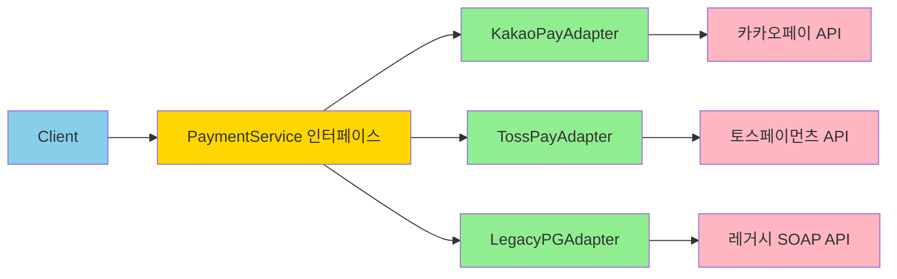

# Adapter 패턴: 레거시와의 동행

## 시작하며

SI 프로젝트에서는 새로운 시스템을 구축하면서도 기존 시스템과 연동해야 하는 상황이 끊임없이 발생합니다.

- 10년 전에 구축한 SOAP API를 새로운 RESTful 시스템에서 호출해야 함
- 여러 PG사의 서로 다른 결제 API를 통일된 인터페이스로 사용하고 싶음
- moment.js에서 dayjs로 라이브러리를 교체하려는데 수백 개 파일을 한 번에 바꿀 수 없음
- 외주 개발한 ERP의 복잡한 인터페이스를 우리 팀이 이해하기 쉽게 만들고 싶음

이런 상황에서 "기존 시스템을 싹 다 갈아엎자"는 현실적이지 않습니다. 운영 중인 시스템을 건드리는 것은 위험하고, 외부 서비스는 우리 마음대로 바꿀 수 없습니다.

**Adapter 패턴**은 기존 코드를 수정하지 않고, 호환되지 않는 인터페이스 사이에 번역기를 끼워 넣는 패턴입니다.

---

## 문제 상황: 호환되지 않는 인터페이스들

<Callout type="warning" title="흔한 요구사항 (결제 시스템 통합)">
결제 기능을 추가해야 하는데, 클라이언트가 여러 PG사를 동시에 지원하길 원합니다:

- **카카오페이**: REST API, JSON 응답, `transaction_id` 필드
- **토스페이먼츠**: REST API, JSON 응답, `paymentKey` 필드
- **레거시 PG**: SOAP API, XML 응답, `trxId` 필드

각 PG사마다 API 형식, 데이터 구조, 에러 처리 방식이 모두 다릅니다.
</Callout>

순진하게 구현하면 이렇게 됩니다:

```typescript
// ❌ 호출하는 곳마다 PG사별 분기 처리
async function processPayment(pgType: string, amount: number) {
  if (pgType === 'kakao') {
    const kakaoResponse = await axios.post('https://kapi.kakao.com/v1/payment/ready', {
      cid: process.env.KAKAO_CID,
      partner_order_id: generateOrderId(),
      partner_user_id: userId,
      item_name: '상품명',
      quantity: 1,
      total_amount: amount,
      tax_free_amount: 0,
    });
    
    return {
      transactionId: kakaoResponse.data.tid,
      status: kakaoResponse.data.status === 'ready' ? 'pending' : 'failed',
      approvalUrl: kakaoResponse.data.next_redirect_pc_url,
    };
  } else if (pgType === 'toss') {
    const tossResponse = await axios.post('https://api.tosspayments.com/v1/payments', {
      amount: amount,
      orderId: generateOrderId(),
      orderName: '상품명',
      customerEmail: userEmail,
      customerName: userName,
    }, {
      headers: { Authorization: `Basic ${process.env.TOSS_SECRET_KEY}` },
    });
    
    return {
      transactionId: tossResponse.data.paymentKey,
      status: tossResponse.data.status === 'READY' ? 'pending' : 'failed',
      approvalUrl: tossResponse.data.checkout.url,
    };
  } else if (pgType === 'legacy') {
    const soapClient = await soap.createClientAsync(process.env.LEGACY_WSDL_URL);
    const xmlResponse = await soapClient.RequestPaymentAsync({
      merchantId: process.env.LEGACY_MERCHANT_ID,
      orderAmount: amount,
      productName: '상품명',
      buyerName: userName,
    });
    
    const parsed = await xml2js.parseStringPromise(xmlResponse[0]);
    return {
      transactionId: parsed.response.trxId[0],
      status: parsed.response.resultCode[0] === '0000' ? 'pending' : 'failed',
      approvalUrl: parsed.response.payUrl[0],
    };
  }
}
```

이제 이 로직이 **주문 API, 정기결제 API, 관리자 수동 결제** 등 10곳에서 반복된다고 상상해 보세요:

- 새로운 PG사(네이버페이) 추가 시 10곳을 찾아 수정
- 카카오페이 API 스펙 변경 시 10곳을 모두 업데이트
- 각 PG사의 에러 응답 형식이 달라 에러 처리도 각각 다르게 구현
- 테스트 시 실제 PG사 API를 호출해야 해서 느리고 불안정

---

## Adapter 패턴 한눈에 보기

<Callout type="info" title="정의">
**기존 클래스의 인터페이스를 클라이언트가 기대하는 인터페이스로 변환**하여, 호환되지 않는 인터페이스 때문에 함께 동작할 수 없는 클래스들이 협력할 수 있게 만드는 패턴입니다.
</Callout>



### 핵심 개념

- **Target**: 클라이언트가 사용하는 우리 시스템의 인터페이스
- **Adaptee**: 변환이 필요한 기존 클래스 (외부 API, 레거시 시스템)
- **Adapter**: Adaptee를 Target 인터페이스로 변환하는 중간 계층
- **Client**: Target 인터페이스만 알고 있으면 되는 비즈니스 로직

### 패턴의 두 가지 형태

#### 1. Class Adapter (상속 기반)

```typescript
// Target 인터페이스
interface PaymentService {
  processPayment(amount: number): Promise<PaymentResult>;
}

// Adaptee (변경할 수 없는 외부 클래스)
class KakaoPayAPI {
  async ready(params: KakaoPayParams): Promise<KakaoPayResponse> {
    // 카카오페이 API 호출
  }
}

// Class Adapter: 상속으로 구현
class KakaoPayAdapter extends KakaoPayAPI implements PaymentService {
  async processPayment(amount: number): Promise<PaymentResult> {
    // 부모 클래스의 메서드를 호출하여 변환
    const kakaoResponse = await this.ready({
      cid: process.env.KAKAO_CID,
      total_amount: amount,
      // ...
    });
    
    return {
      transactionId: kakaoResponse.tid,
      status: this.convertStatus(kakaoResponse.status),
    };
  }
}
```

#### 2. Object Adapter (합성 기반) ⭐ 권장

```typescript
// Object Adapter: 합성(Composition)으로 구현
class KakaoPayAdapter implements PaymentService {
  constructor(private readonly kakaoPayAPI: KakaoPayAPI) {}
  
  async processPayment(amount: number): Promise<PaymentResult> {
    // 주입받은 객체의 메서드를 호출하여 변환
    const kakaoResponse = await this.kakaoPayAPI.ready({
      cid: process.env.KAKAO_CID,
      total_amount: amount,
      // ...
    });
    
    return {
      transactionId: kakaoResponse.tid,
      status: this.convertStatus(kakaoResponse.status),
    };
  }
}
```

<Callout type="success" title="Object Adapter를 권장하는 이유">
- **유연성**: 다중 Adaptee를 조합할 수 있음
- **느슨한 결합**: 상속보다 합성이 변경에 유연
- **테스트 용이**: Mock 객체를 주입하기 쉬움
- **단일 책임**: Adapter는 변환만 담당, Adaptee는 기능만 담당
</Callout>

---

## 실전 시나리오 1: 여러 PG사 통합

### 1단계: 공통 인터페이스 정의 (Target)

```typescript
// payments/payment-service.interface.ts
export interface PaymentService {
  processPayment(request: PaymentRequest): Promise<PaymentResult>;
  checkStatus(transactionId: string): Promise<PaymentStatus>;
  cancelPayment(transactionId: string, reason: string): Promise<void>;
}

export interface PaymentRequest {
  amount: number;
  orderId: string;
  orderName: string;
  customerEmail: string;
  customerName: string;
}

export interface PaymentResult {
  transactionId: string;
  status: 'pending' | 'completed' | 'failed' | 'cancelled';
  approvalUrl?: string;
  message?: string;
}

export interface PaymentStatus {
  transactionId: string;
  status: 'pending' | 'completed' | 'failed' | 'cancelled';
  amount: number;
  completedAt?: Date;
}
```

### 2단계: 카카오페이 Adapter

```typescript
// payments/adapters/kakaopay.adapter.ts
import axios from 'axios';

interface KakaoPayReadyResponse {
  tid: string;
  next_redirect_pc_url: string;
  created_at: string;
}

interface KakaoPayApproveResponse {
  tid: string;
  partner_order_id: string;
  payment_method_type: string;
  amount: {
    total: number;
    tax_free: number;
  };
  approved_at: string;
}

export class KakaoPayAdapter implements PaymentService {
  private readonly baseURL = 'https://kapi.kakao.com';
  private readonly cid = process.env.KAKAO_CID;
  
  constructor(
    private readonly config: {
      adminKey: string;
    },
  ) {}

  async processPayment(request: PaymentRequest): Promise<PaymentResult> {
    try {
      const response = await axios.post<KakaoPayReadyResponse>(
        `${this.baseURL}/v1/payment/ready`,
        {
          cid: this.cid,
          partner_order_id: request.orderId,
          partner_user_id: request.customerEmail,
          item_name: request.orderName,
          quantity: 1,
          total_amount: request.amount,
          tax_free_amount: 0,
          approval_url: `${process.env.APP_URL}/payment/success`,
          cancel_url: `${process.env.APP_URL}/payment/cancel`,
          fail_url: `${process.env.APP_URL}/payment/fail`,
        },
        {
          headers: {
            Authorization: `KakaoAK ${this.config.adminKey}`,
            'Content-Type': 'application/x-www-form-urlencoded;charset=utf-8',
          },
        },
      );

      return {
        transactionId: response.data.tid,
        status: 'pending',
        approvalUrl: response.data.next_redirect_pc_url,
      };
    } catch (error) {
      return this.handleError(error);
    }
  }

  async checkStatus(transactionId: string): Promise<PaymentStatus> {
    // 카카오페이는 별도 조회 API가 없어 로컬 DB에서 조회
    const payment = await this.findPaymentByTid(transactionId);
    
    return {
      transactionId: payment.tid,
      status: this.convertStatus(payment.status),
      amount: payment.amount,
      completedAt: payment.approved_at ? new Date(payment.approved_at) : undefined,
    };
  }

  async cancelPayment(transactionId: string, reason: string): Promise<void> {
    await axios.post(
      `${this.baseURL}/v1/payment/cancel`,
      {
        cid: this.cid,
        tid: transactionId,
        cancel_amount: 0, // 전액 취소
        cancel_tax_free_amount: 0,
      },
      {
        headers: {
          Authorization: `KakaoAK ${this.config.adminKey}`,
        },
      },
    );
  }

  private convertStatus(kakaoStatus: string): 'pending' | 'completed' | 'failed' | 'cancelled' {
    const statusMap: Record<string, PaymentResult['status']> = {
      READY: 'pending',
      SEND_TMS: 'pending',
      OPEN_PAYMENT: 'pending',
      SELECT_METHOD: 'pending',
      ARS_WAITING: 'pending',
      AUTH_PASSWORD: 'pending',
      ISSUED_SID: 'completed',
      SUCCESS_PAYMENT: 'completed',
      PART_CANCEL_PAYMENT: 'cancelled',
      CANCEL_PAYMENT: 'cancelled',
      FAIL_AUTH_PASSWORD: 'failed',
      QUIT_PAYMENT: 'failed',
      FAIL_PAYMENT: 'failed',
    };
    
    return statusMap[kakaoStatus] || 'failed';
  }

  private handleError(error: any): PaymentResult {
    const message = error.response?.data?.msg || '결제 처리 중 오류가 발생했습니다.';
    
    return {
      transactionId: '',
      status: 'failed',
      message,
    };
  }

  private async findPaymentByTid(tid: string) {
    // DB 조회 로직
    throw new Error('Method not implemented');
  }
}
```

### 3단계: 토스페이먼츠 Adapter

```typescript
// payments/adapters/tosspayments.adapter.ts
import axios from 'axios';

interface TossPaymentsResponse {
  paymentKey: string;
  orderId: string;
  status: string;
  totalAmount: number;
  approvedAt?: string;
  receipt?: {
    url: string;
  };
}

export class TossPaymentsAdapter implements PaymentService {
  private readonly baseURL = 'https://api.tosspayments.com/v1';
  
  constructor(
    private readonly config: {
      secretKey: string;
      clientKey: string;
    },
  ) {}

  async processPayment(request: PaymentRequest): Promise<PaymentResult> {
    try {
      // 토스는 클라이언트에서 SDK로 결제창을 띄우고, 서버는 승인만 처리
      // 여기서는 결제 준비 단계만 처리
      return {
        transactionId: `TOSS_${request.orderId}`,
        status: 'pending',
        approvalUrl: `${process.env.APP_URL}/payment/toss?orderId=${request.orderId}&amount=${request.amount}`,
        message: '토스페이먼츠 결제창으로 이동합니다.',
      };
    } catch (error) {
      return this.handleError(error);
    }
  }

  async checkStatus(transactionId: string): Promise<PaymentStatus> {
    try {
      const response = await axios.get<TossPaymentsResponse>(
        `${this.baseURL}/payments/${transactionId}`,
        {
          headers: {
            Authorization: `Basic ${Buffer.from(`${this.config.secretKey}:`).toString('base64')}`,
          },
        },
      );

      return {
        transactionId: response.data.paymentKey,
        status: this.convertStatus(response.data.status),
        amount: response.data.totalAmount,
        completedAt: response.data.approvedAt ? new Date(response.data.approvedAt) : undefined,
      };
    } catch (error) {
      throw new Error('결제 상태 조회에 실패했습니다.');
    }
  }

  async cancelPayment(transactionId: string, reason: string): Promise<void> {
    await axios.post(
      `${this.baseURL}/payments/${transactionId}/cancel`,
      {
        cancelReason: reason,
      },
      {
        headers: {
          Authorization: `Basic ${Buffer.from(`${this.config.secretKey}:`).toString('base64')}`,
          'Content-Type': 'application/json',
        },
      },
    );
  }

  private convertStatus(tossStatus: string): 'pending' | 'completed' | 'failed' | 'cancelled' {
    const statusMap: Record<string, PaymentResult['status']> = {
      READY: 'pending',
      IN_PROGRESS: 'pending',
      WAITING_FOR_DEPOSIT: 'pending',
      DONE: 'completed',
      CANCELED: 'cancelled',
      PARTIAL_CANCELED: 'cancelled',
      ABORTED: 'failed',
      EXPIRED: 'failed',
    };
    
    return statusMap[tossStatus] || 'failed';
  }

  private handleError(error: any): PaymentResult {
    const message = error.response?.data?.message || '결제 처리 중 오류가 발생했습니다.';
    
    return {
      transactionId: '',
      status: 'failed',
      message,
    };
  }
}
```

### 4단계: 레거시 SOAP API Adapter

```typescript
// payments/adapters/legacy-pg.adapter.ts
import * as soap from 'soap';
import * as xml2js from 'xml2js';

interface LegacyPGResponse {
  response: {
    trxId: string[];
    resultCode: string[];
    resultMsg: string[];
    payUrl: string[];
  };
}

export class LegacyPGAdapter implements PaymentService {
  private soapClient?: soap.Client;
  
  constructor(
    private readonly config: {
      wsdlUrl: string;
      merchantId: string;
      merchantKey: string;
    },
  ) {}

  private async getClient(): Promise<soap.Client> {
    if (!this.soapClient) {
      this.soapClient = await soap.createClientAsync(this.config.wsdlUrl);
    }
    return this.soapClient;
  }

  async processPayment(request: PaymentRequest): Promise<PaymentResult> {
    try {
      const client = await this.getClient();
      
      const [xmlResponse] = await client.RequestPaymentAsync({
        merchantId: this.config.merchantId,
        merchantKey: this.config.merchantKey,
        orderNo: request.orderId,
        orderAmount: request.amount,
        productName: request.orderName,
        buyerName: request.customerName,
        buyerEmail: request.customerEmail,
        returnUrl: `${process.env.APP_URL}/payment/return`,
        cancelUrl: `${process.env.APP_URL}/payment/cancel`,
      });

      const parsed: LegacyPGResponse = await xml2js.parseStringPromise(xmlResponse);
      const resultCode = parsed.response.resultCode[0];
      
      if (resultCode !== '0000') {
        return {
          transactionId: '',
          status: 'failed',
          message: parsed.response.resultMsg[0],
        };
      }

      return {
        transactionId: parsed.response.trxId[0],
        status: 'pending',
        approvalUrl: parsed.response.payUrl[0],
      };
    } catch (error) {
      return this.handleError(error);
    }
  }

  async checkStatus(transactionId: string): Promise<PaymentStatus> {
    const client = await this.getClient();
    
    const [xmlResponse] = await client.QueryPaymentAsync({
      merchantId: this.config.merchantId,
      merchantKey: this.config.merchantKey,
      trxId: transactionId,
    });

    const parsed = await xml2js.parseStringPromise(xmlResponse);
    
    return {
      transactionId: parsed.response.trxId[0],
      status: this.convertStatus(parsed.response.status[0]),
      amount: parseInt(parsed.response.amount[0], 10),
      completedAt: parsed.response.completeDate[0] 
        ? new Date(parsed.response.completeDate[0]) 
        : undefined,
    };
  }

  async cancelPayment(transactionId: string, reason: string): Promise<void> {
    const client = await this.getClient();
    
    const [xmlResponse] = await client.CancelPaymentAsync({
      merchantId: this.config.merchantId,
      merchantKey: this.config.merchantKey,
      trxId: transactionId,
      cancelReason: reason,
    });

    const parsed = await xml2js.parseStringPromise(xmlResponse);
    
    if (parsed.response.resultCode[0] !== '0000') {
      throw new Error(parsed.response.resultMsg[0]);
    }
  }

  private convertStatus(legacyStatus: string): 'pending' | 'completed' | 'failed' | 'cancelled' {
    const statusMap: Record<string, PaymentResult['status']> = {
      '01': 'pending',
      '02': 'completed',
      '03': 'cancelled',
      '04': 'failed',
    };
    
    return statusMap[legacyStatus] || 'failed';
  }

  private handleError(error: any): PaymentResult {
    return {
      transactionId: '',
      status: 'failed',
      message: error.message || '결제 처리 중 오류가 발생했습니다.',
    };
  }
}
```

### 5단계: 사용

```typescript
// orders/order.service.ts
import { Injectable } from '@nestjs/common';

@Injectable()
export class OrderService {
  constructor(
    private readonly paymentService: PaymentService, // DI로 주입
  ) {}

  async createOrder(orderDto: CreateOrderDto) {
    const order = await this.saveOrder(orderDto);
    
    // Adapter 덕분에 PG사가 무엇이든 동일한 인터페이스로 호출
    const paymentResult = await this.paymentService.processPayment({
      amount: order.totalAmount,
      orderId: order.id,
      orderName: order.productName,
      customerEmail: order.customerEmail,
      customerName: order.customerName,
    });

    if (paymentResult.status === 'failed') {
      throw new BadRequestException(paymentResult.message);
    }

    await this.updateOrderPaymentInfo(order.id, paymentResult.transactionId);

    return {
      orderId: order.id,
      approvalUrl: paymentResult.approvalUrl,
    };
  }

  async checkPaymentStatus(orderId: string) {
    const order = await this.findOrder(orderId);
    
    // 어떤 PG사든 동일한 방식으로 상태 조회
    const status = await this.paymentService.checkStatus(order.transactionId);
    
    return {
      orderId: order.id,
      paymentStatus: status.status,
      amount: status.amount,
      completedAt: status.completedAt,
    };
  }

  async cancelOrder(orderId: string, reason: string) {
    const order = await this.findOrder(orderId);
    
    // 어떤 PG사든 동일한 방식으로 취소
    await this.paymentService.cancelPayment(order.transactionId, reason);
    
    await this.updateOrderStatus(orderId, 'cancelled');
  }

  private async saveOrder(dto: CreateOrderDto) {
    // 주문 저장 로직
    throw new Error('Method not implemented');
  }

  private async findOrder(orderId: string) {
    // 주문 조회 로직
    throw new Error('Method not implemented');
  }

  private async updateOrderPaymentInfo(orderId: string, transactionId: string) {
    // 결제 정보 업데이트
    throw new Error('Method not implemented');
  }

  private async updateOrderStatus(orderId: string, status: string) {
    // 주문 상태 업데이트
    throw new Error('Method not implemented');
  }
}
```

---

## Before / After

```typescript
// ❌ Adapter 없이: PG사별 분기 처리가 모든 곳에 반복
async function processPayment(pgType: string, amount: number) {
  if (pgType === 'kakao') {
    const response = await kakaoPayAPI.ready({...});
    return { tid: response.tid, status: convertKakaoStatus(response.status) };
  } else if (pgType === 'toss') {
    const response = await tossPayAPI.request({...});
    return { tid: response.paymentKey, status: convertTossStatus(response.status) };
  } else if (pgType === 'legacy') {
    const xmlResponse = await soapClient.RequestPayment({...});
    const parsed = await parseXML(xmlResponse);
    return { tid: parsed.trxId, status: convertLegacyStatus(parsed.status) };
  }
}

async function checkStatus(pgType: string, tid: string) {
  if (pgType === 'kakao') {
    // 카카오페이 상태 조회 로직
  } else if (pgType === 'toss') {
    // 토스 상태 조회 로직
  } else if (pgType === 'legacy') {
    // 레거시 상태 조회 로직
  }
}

// 다른 서비스에서도 동일한 분기문 반복...
```

```typescript
// ✅ Adapter 적용: 통일된 인터페이스로 깔끔하게 처리
@Injectable()
export class OrderService {
  constructor(
    private readonly paymentService: PaymentService, // Adapter 주입
  ) {}

  async processPayment(request: PaymentRequest) {
    // PG사가 무엇이든 동일한 방식으로 호출
    return await this.paymentService.processPayment(request);
  }

  async checkStatus(transactionId: string) {
    // PG사가 무엇이든 동일한 방식으로 조회
    return await this.paymentService.checkStatus(transactionId);
  }
}
```

**비교**:
- **중복 제거**: 10곳에 흩어진 PG사별 처리 로직 → Adapter 하나에 집중
- **새 PG사 추가**: Adapter만 추가하면 되고, 비즈니스 로직은 수정 불필요
- **API 스펙 변경**: Adapter만 수정하면 모든 호출부에 반영
- **테스트 용이**: Mock Adapter 주입으로 실제 PG 호출 없이 테스트

---

## 실전 시나리오 2: 라이브러리 교체 (moment.js → dayjs)

moment.js는 무겁고 더 이상 업데이트되지 않아 dayjs로 교체하려고 합니다. 하지만 프로젝트 전체에서 moment를 사용하고 있어 한 번에 바꾸기 어렵습니다.

### Adapter로 점진적 전환

```typescript
// utils/date/date.interface.ts
export interface DateLibrary {
  now(): Date;
  format(date: Date, format: string): string;
  parse(dateString: string, format: string): Date;
  add(date: Date, amount: number, unit: 'days' | 'months' | 'years'): Date;
  subtract(date: Date, amount: number, unit: 'days' | 'months' | 'years'): Date;
  diff(date1: Date, date2: Date, unit: 'days' | 'months' | 'years'): number;
  isAfter(date1: Date, date2: Date): boolean;
  isBefore(date1: Date, date2: Date): boolean;
}
```

```typescript
// utils/date/moment.adapter.ts
import * as moment from 'moment';

export class MomentAdapter implements DateLibrary {
  now(): Date {
    return moment().toDate();
  }

  format(date: Date, format: string): string {
    return moment(date).format(format);
  }

  parse(dateString: string, format: string): Date {
    return moment(dateString, format).toDate();
  }

  add(date: Date, amount: number, unit: 'days' | 'months' | 'years'): Date {
    return moment(date).add(amount, unit).toDate();
  }

  subtract(date: Date, amount: number, unit: 'days' | 'months' | 'years'): Date {
    return moment(date).subtract(amount, unit).toDate();
  }

  diff(date1: Date, date2: Date, unit: 'days' | 'months' | 'years'): number {
    return moment(date1).diff(moment(date2), unit);
  }

  isAfter(date1: Date, date2: Date): boolean {
    return moment(date1).isAfter(moment(date2));
  }

  isBefore(date1: Date, date2: Date): boolean {
    return moment(date1).isBefore(moment(date2));
  }
}
```

```typescript
// utils/date/dayjs.adapter.ts
import dayjs from 'dayjs';

export class DayjsAdapter implements DateLibrary {
  now(): Date {
    return dayjs().toDate();
  }

  format(date: Date, format: string): string {
    return dayjs(date).format(format);
  }

  parse(dateString: string, format: string): Date {
    return dayjs(dateString, format).toDate();
  }

  add(date: Date, amount: number, unit: 'days' | 'months' | 'years'): Date {
    return dayjs(date).add(amount, unit).toDate();
  }

  subtract(date: Date, amount: number, unit: 'days' | 'months' | 'years'): Date {
    return dayjs(date).subtract(amount, unit).toDate();
  }

  diff(date1: Date, date2: Date, unit: 'days' | 'months' | 'years'): number {
    return dayjs(date1).diff(dayjs(date2), unit);
  }

  isAfter(date1: Date, date2: Date): boolean {
    return dayjs(date1).isAfter(dayjs(date2));
  }

  isBefore(date1: Date, date2: Date): boolean {
    return dayjs(date1).isBefore(dayjs(date2));
  }
}
```

```typescript
// utils/date/date.module.ts
import { Module } from '@nestjs/common';
import { ConfigService } from '@nestjs/config';

@Module({
  providers: [
    {
      provide: 'DateLibrary',
      useFactory: (config: ConfigService) => {
        // 환경 변수로 라이브러리 선택
        const useDayjs = config.get('USE_DAYJS', false);
        return useDayjs ? new DayjsAdapter() : new MomentAdapter();
      },
      inject: [ConfigService],
    },
  ],
  exports: ['DateLibrary'],
})
export class DateModule {}
```

```typescript
// services/report.service.ts
import { Injectable, Inject } from '@nestjs/common';

@Injectable()
export class ReportService {
  constructor(
    @Inject('DateLibrary')
    private readonly dateLib: DateLibrary,
  ) {}

  async generateMonthlyReport() {
    // 내부 라이브러리가 moment든 dayjs든 신경 쓰지 않음
    const now = this.dateLib.now();
    const startOfMonth = this.dateLib.subtract(now, 1, 'months');
    const formattedDate = this.dateLib.format(startOfMonth, 'YYYY-MM-DD');
    
    return `${formattedDate}부터 ${this.dateLib.format(now, 'YYYY-MM-DD')}까지의 리포트`;
  }
}
```

**효과**:
- 환경 변수 `USE_DAYJS=true`로 설정만 바꾸면 전체 프로젝트가 dayjs로 전환
- 문제 발생 시 즉시 rollback 가능
- 비즈니스 로직 코드는 한 줄도 수정하지 않음
- 두 라이브러리를 부분적으로 병행 사용하며 점진적 전환 가능

---

## 실전 시나리오 3: 외부 ERP 시스템 연동

외주 개발한 ERP 시스템의 API가 복잡하고 이해하기 어렵습니다. 우리 팀이 사용하기 쉬운 인터페이스로 감싸야 합니다.

```typescript
// erp/erp-service.interface.ts
// 우리가 원하는 간단한 인터페이스
export interface ERPService {
  createEmployee(employee: EmployeeInfo): Promise<string>;
  updateEmployee(id: string, employee: Partial<EmployeeInfo>): Promise<void>;
  getEmployee(id: string): Promise<EmployeeInfo>;
  approveLeave(employeeId: string, leaveRequest: LeaveRequest): Promise<void>;
}

export interface EmployeeInfo {
  id?: string;
  name: string;
  email: string;
  department: string;
  position: string;
  joinDate: Date;
}

export interface LeaveRequest {
  startDate: Date;
  endDate: Date;
  type: 'annual' | 'sick' | 'personal';
  reason: string;
}
```

```typescript
// erp/legacy-erp.adapter.ts
import { Injectable } from '@nestjs/common';
import axios from 'axios';

// 실제 ERP API의 복잡한 인터페이스
interface LegacyERPEmployeeRequest {
  EMP_INFO: {
    BASIC_INFO: {
      EMP_NAME: string;
      EMP_EMAIL: string;
      EMP_DEPT_CD: string;
      EMP_POS_CD: string;
      EMP_JOIN_DT: string; // YYYYMMDD 형식
    };
    WORK_INFO: {
      WORK_TYPE_CD: string;
      WORK_START_TIME: string;
      WORK_END_TIME: string;
    };
    SYSTEM_INFO: {
      USE_YN: string;
      REG_DT: string;
      REG_USER_ID: string;
    };
  };
}

interface LegacyERPLeaveRequest {
  LEAVE_REQ_INFO: {
    EMP_NO: string;
    LEAVE_TYPE_CD: string;
    LEAVE_START_DT: string;
    LEAVE_END_DT: string;
    LEAVE_REASON: string;
    APPR_LINE: Array<{
      APPR_SEQ: number;
      APPR_EMP_NO: string;
      APPR_TYPE_CD: string;
    }>;
  };
}

@Injectable()
export class LegacyERPAdapter implements ERPService {
  private readonly baseURL = process.env.ERP_API_URL;
  private readonly apiKey = process.env.ERP_API_KEY;

  async createEmployee(employee: EmployeeInfo): Promise<string> {
    // 우리의 간단한 모델을 ERP의 복잡한 모델로 변환
    const legacyRequest: LegacyERPEmployeeRequest = {
      EMP_INFO: {
        BASIC_INFO: {
          EMP_NAME: employee.name,
          EMP_EMAIL: employee.email,
          EMP_DEPT_CD: this.mapDepartmentToCode(employee.department),
          EMP_POS_CD: this.mapPositionToCode(employee.position),
          EMP_JOIN_DT: this.formatDate(employee.joinDate, 'YYYYMMDD'),
        },
        WORK_INFO: {
          WORK_TYPE_CD: '01', // 정규직
          WORK_START_TIME: '0900',
          WORK_END_TIME: '1800',
        },
        SYSTEM_INFO: {
          USE_YN: 'Y',
          REG_DT: this.formatDate(new Date(), 'YYYYMMDD'),
          REG_USER_ID: 'SYSTEM',
        },
      },
    };

    const response = await axios.post(
      `${this.baseURL}/api/v1/emp/create`,
      legacyRequest,
      {
        headers: {
          'X-API-KEY': this.apiKey,
          'Content-Type': 'application/json',
        },
      },
    );

    // ERP의 응답을 우리 형식으로 변환
    return response.data.RESULT.EMP_NO;
  }

  async updateEmployee(id: string, employee: Partial<EmployeeInfo>): Promise<void> {
    const updateRequest: any = {
      EMP_NO: id,
      UPD_INFO: {},
    };

    if (employee.name) {
      updateRequest.UPD_INFO.EMP_NAME = employee.name;
    }
    if (employee.email) {
      updateRequest.UPD_INFO.EMP_EMAIL = employee.email;
    }
    if (employee.department) {
      updateRequest.UPD_INFO.EMP_DEPT_CD = this.mapDepartmentToCode(employee.department);
    }
    if (employee.position) {
      updateRequest.UPD_INFO.EMP_POS_CD = this.mapPositionToCode(employee.position);
    }

    await axios.post(
      `${this.baseURL}/api/v1/emp/update`,
      updateRequest,
      {
        headers: {
          'X-API-KEY': this.apiKey,
        },
      },
    );
  }

  async getEmployee(id: string): Promise<EmployeeInfo> {
    const response = await axios.post(
      `${this.baseURL}/api/v1/emp/inquiry`,
      {
        EMP_NO: id,
        INQ_TYPE: 'DETAIL',
      },
      {
        headers: {
          'X-API-KEY': this.apiKey,
        },
      },
    );

    const empData = response.data.RESULT.EMP_INFO.BASIC_INFO;

    // ERP의 복잡한 응답을 우리의 간단한 모델로 변환
    return {
      id: response.data.RESULT.EMP_NO,
      name: empData.EMP_NAME,
      email: empData.EMP_EMAIL,
      department: this.mapCodeToDepartment(empData.EMP_DEPT_CD),
      position: this.mapCodeToPosition(empData.EMP_POS_CD),
      joinDate: this.parseDate(empData.EMP_JOIN_DT, 'YYYYMMDD'),
    };
  }

  async approveLeave(employeeId: string, leaveRequest: LeaveRequest): Promise<void> {
    // 결재선 자동 생성 (ERP는 수동으로 결재선을 지정해야 함)
    const approvalLine = await this.buildApprovalLine(employeeId);

    const legacyRequest: LegacyERPLeaveRequest = {
      LEAVE_REQ_INFO: {
        EMP_NO: employeeId,
        LEAVE_TYPE_CD: this.mapLeaveTypeToCode(leaveRequest.type),
        LEAVE_START_DT: this.formatDate(leaveRequest.startDate, 'YYYYMMDD'),
        LEAVE_END_DT: this.formatDate(leaveRequest.endDate, 'YYYYMMDD'),
        LEAVE_REASON: leaveRequest.reason,
        APPR_LINE: approvalLine,
      },
    };

    await axios.post(
      `${this.baseURL}/api/v1/leave/request`,
      legacyRequest,
      {
        headers: {
          'X-API-KEY': this.apiKey,
        },
      },
    );
  }

  // 변환 헬퍼 메서드들
  private mapDepartmentToCode(department: string): string {
    const mapping: Record<string, string> = {
      '개발': 'DEPT001',
      '영업': 'DEPT002',
      '인사': 'DEPT003',
      '재무': 'DEPT004',
    };
    return mapping[department] || 'DEPT999';
  }

  private mapCodeToDepartment(code: string): string {
    const mapping: Record<string, string> = {
      'DEPT001': '개발',
      'DEPT002': '영업',
      'DEPT003': '인사',
      'DEPT004': '재무',
    };
    return mapping[code] || '기타';
  }

  private mapPositionToCode(position: string): string {
    const mapping: Record<string, string> = {
      '사원': 'POS01',
      '주임': 'POS02',
      '대리': 'POS03',
      '과장': 'POS04',
      '차장': 'POS05',
      '부장': 'POS06',
    };
    return mapping[position] || 'POS01';
  }

  private mapCodeToPosition(code: string): string {
    const mapping: Record<string, string> = {
      'POS01': '사원',
      'POS02': '주임',
      'POS03': '대리',
      'POS04': '과장',
      'POS05': '차장',
      'POS06': '부장',
    };
    return mapping[code] || '사원';
  }

  private mapLeaveTypeToCode(type: LeaveRequest['type']): string {
    const mapping: Record<string, string> = {
      annual: 'LEAVE01',
      sick: 'LEAVE02',
      personal: 'LEAVE03',
    };
    return mapping[type];
  }

  private formatDate(date: Date, format: string): string {
    // 간단한 날짜 포맷팅
    const year = date.getFullYear();
    const month = String(date.getMonth() + 1).padStart(2, '0');
    const day = String(date.getDate()).padStart(2, '0');
    
    if (format === 'YYYYMMDD') {
      return `${year}${month}${day}`;
    }
    return date.toISOString();
  }

  private parseDate(dateString: string, format: string): Date {
    if (format === 'YYYYMMDD') {
      const year = parseInt(dateString.substring(0, 4), 10);
      const month = parseInt(dateString.substring(4, 6), 10) - 1;
      const day = parseInt(dateString.substring(6, 8), 10);
      return new Date(year, month, day);
    }
    return new Date(dateString);
  }

  private async buildApprovalLine(employeeId: string) {
    // 결재선 자동 생성 로직
    return [
      { APPR_SEQ: 1, APPR_EMP_NO: 'MANAGER001', APPR_TYPE_CD: '01' },
      { APPR_SEQ: 2, APPR_EMP_NO: 'DIRECTOR001', APPR_TYPE_CD: '02' },
    ];
  }
}
```

```typescript
// employees/employee.service.ts
import { Injectable } from '@nestjs/common';

@Injectable()
export class EmployeeService {
  constructor(
    private readonly erpService: ERPService, // Adapter 주입
  ) {}

  async registerNewEmployee(dto: CreateEmployeeDto) {
    // Adapter 덕분에 ERP의 복잡함을 신경 쓰지 않음
    const employeeId = await this.erpService.createEmployee({
      name: dto.name,
      email: dto.email,
      department: dto.department,
      position: dto.position,
      joinDate: new Date(dto.joinDate),
    });

    return { employeeId };
  }

  async requestLeave(employeeId: string, dto: LeaveRequestDto) {
    // 간단한 인터페이스로 휴가 신청
    await this.erpService.approveLeave(employeeId, {
      startDate: new Date(dto.startDate),
      endDate: new Date(dto.endDate),
      type: dto.type,
      reason: dto.reason,
    });

    return { success: true };
  }
}
```

**효과**:
- ERP의 복잡한 인터페이스(`EMP_INFO.BASIC_INFO.EMP_NAME`)를 간단하게(`employee.name`)
- 코드와 ID 매핑 로직을 Adapter에 집중
- ERP API 스펙 변경 시 Adapter만 수정하면 비즈니스 로직은 영향 없음
- 팀원들은 ERP 매뉴얼을 읽지 않아도 됨

---

## NestJS에서의 Adapter: DI와 함께

Adapter를 Provider로 등록하여 의존성 주입을 활용합니다.

```typescript
// payments/payment.module.ts
import { Module } from '@nestjs/common';
import { ConfigService } from '@nestjs/config';

@Module({
  providers: [
    {
      provide: 'PaymentService',
      useFactory: (config: ConfigService) => {
        const pgProvider = config.get('PG_PROVIDER', 'kakao');
        
        switch (pgProvider) {
          case 'kakao':
            return new KakaoPayAdapter({
              adminKey: config.get('KAKAO_ADMIN_KEY'),
            });
          case 'toss':
            return new TossPaymentsAdapter({
              secretKey: config.get('TOSS_SECRET_KEY'),
              clientKey: config.get('TOSS_CLIENT_KEY'),
            });
          case 'legacy':
            return new LegacyPGAdapter({
              wsdlUrl: config.get('LEGACY_PG_WSDL_URL'),
              merchantId: config.get('LEGACY_PG_MERCHANT_ID'),
              merchantKey: config.get('LEGACY_PG_MERCHANT_KEY'),
            });
          default:
            throw new Error(`Unknown PG provider: ${pgProvider}`);
        }
      },
      inject: [ConfigService],
    },
  ],
  exports: ['PaymentService'],
})
export class PaymentModule {}
```

### 테스트를 위한 Mock Adapter

```typescript
// payments/__tests__/mock-payment.adapter.ts
export class MockPaymentAdapter implements PaymentService {
  async processPayment(request: PaymentRequest): Promise<PaymentResult> {
    return {
      transactionId: 'MOCK_TXN_123',
      status: 'completed',
      approvalUrl: 'https://mock.payment.url',
    };
  }

  async checkStatus(transactionId: string): Promise<PaymentStatus> {
    return {
      transactionId,
      status: 'completed',
      amount: 10000,
      completedAt: new Date(),
    };
  }

  async cancelPayment(transactionId: string, reason: string): Promise<void> {
    // Mock: 아무것도 하지 않음
  }
}
```

```typescript
// orders/__tests__/order.service.spec.ts
import { Test } from '@nestjs/testing';

describe('OrderService', () => {
  let orderService: OrderService;
  let paymentService: PaymentService;

  beforeEach(async () => {
    const module = await Test.createTestingModule({
      providers: [
        OrderService,
        {
          provide: 'PaymentService',
          useClass: MockPaymentAdapter, // Mock으로 교체
        },
      ],
    }).compile();

    orderService = module.get(OrderService);
    paymentService = module.get('PaymentService');
  });

  it('should create order with payment', async () => {
    // 실제 PG 호출 없이 테스트 가능
    const result = await orderService.createOrder({
      productName: 'Test Product',
      amount: 10000,
      customerEmail: 'test@example.com',
      customerName: 'Tester',
    });

    expect(result.orderId).toBeDefined();
    expect(result.approvalUrl).toBe('https://mock.payment.url');
  });
});
```

---

## Next.js에서의 Adapter: API Route와 함께

Next.js에서는 Server Actions나 API Routes에서 Adapter를 사용합니다.

```typescript
// lib/payments/adapter.factory.ts
export function createPaymentAdapter(provider: string): PaymentService {
  switch (provider) {
    case 'kakao':
      return new KakaoPayAdapter({
        adminKey: process.env.KAKAO_ADMIN_KEY!,
      });
    case 'toss':
      return new TossPaymentsAdapter({
        secretKey: process.env.TOSS_SECRET_KEY!,
        clientKey: process.env.TOSS_CLIENT_KEY!,
      });
    default:
      throw new Error(`Unknown provider: ${provider}`);
  }
}
```

```typescript
// app/api/payments/route.ts
import { NextRequest, NextResponse } from 'next/server';
import { createPaymentAdapter } from '@/lib/payments/adapter.factory';

export async function POST(request: NextRequest) {
  const body = await request.json();
  const { provider, amount, orderId, orderName, customerEmail, customerName } = body;

  try {
    // Factory로 Adapter 생성
    const paymentService = createPaymentAdapter(provider);

    // 통일된 인터페이스로 결제 처리
    const result = await paymentService.processPayment({
      amount,
      orderId,
      orderName,
      customerEmail,
      customerName,
    });

    return NextResponse.json(result);
  } catch (error) {
    return NextResponse.json(
      { error: error.message },
      { status: 500 },
    );
  }
}
```

```typescript
// app/actions/process-payment.ts
'use server';

import { createPaymentAdapter } from '@/lib/payments/adapter.factory';

export async function processPaymentAction(formData: FormData) {
  const provider = formData.get('provider') as string;
  const amount = parseInt(formData.get('amount') as string, 10);
  
  const paymentService = createPaymentAdapter(provider);
  
  const result = await paymentService.processPayment({
    amount,
    orderId: generateOrderId(),
    orderName: formData.get('orderName') as string,
    customerEmail: formData.get('email') as string,
    customerName: formData.get('name') as string,
  });

  return result;
}
```

---

## 적용 체크리스트

<Steps>
  <Step title="Target 인터페이스 정의">
    클라이언트(비즈니스 로직)가 사용할 통일된 인터페이스를 먼저 정의하세요. 이 인터페이스는 도메인 용어를 사용하고, 사용하기 쉬워야 합니다.
  </Step>
  
  <Step title="Adaptee 파악">
    변환이 필요한 기존 시스템이나 라이브러리의 인터페이스를 파악하세요. API 문서, 레거시 코드, 외부 라이브러리 문서를 확인합니다.
  </Step>
  
  <Step title="Adapter 구현">
    Object Adapter(합성) 방식을 우선 고려하세요. Adaptee를 주입받아 Target 인터페이스의 메서드를 구현합니다.
  </Step>
  
  <Step title="변환 로직 캡슐화">
    데이터 포맷 변환, 에러 변환, 상태 매핑 등 모든 변환 로직을 Adapter 내부에 숨기세요.
  </Step>
  
  <Step title="클라이언트 코드 수정">
    비즈니스 로직은 Target 인터페이스만 의존하도록 수정하세요. 구체적인 Adapter는 DI나 Factory로 주입합니다.
  </Step>
</Steps>

---

## 언제 쓰면 안 될까?

<Callout type="warning" title="주의">
다음 상황에서는 Adapter를 쓰지 않는 것이 더 좋습니다:
</Callout>

- **인터페이스가 거의 동일할 때**: 변환이 단순하면 Adapter는 불필요한 레이어입니다.
- **한 곳에서만 사용할 때**: 재사용성이 없다면 직접 호출이 더 간단합니다.
- **성능이 중요할 때**: Adapter는 추가 레이어이므로 약간의 오버헤드가 있습니다.
- **Adaptee를 직접 수정할 수 있을 때**: 소스 코드를 고칠 수 있다면 직접 수정하는 것이 낫습니다.

```typescript
// ❌ 이런 경우는 Adapter가 오버엔지니어링
interface UserService {
  getUser(id: string): Promise<User>;
}

class UserRepositoryAdapter implements UserService {
  constructor(private repo: UserRepository) {}
  
  async getUser(id: string): Promise<User> {
    // 그냥 그대로 전달만 함
    return this.repo.findById(id);
  }
}

// ✅ 이렇게 직접 쓰는 게 낫습니다
const user = await userRepository.findById(id);
```

---

## 실무 팁

### 1. 양방향 변환 제공

```typescript
export class DataFormatAdapter {
  // Target → Adaptee
  toExternal(internal: InternalFormat): ExternalFormat {
    return {
      ext_id: internal.id,
      ext_name: internal.name,
      ext_created_at: internal.createdAt.toISOString(),
    };
  }

  // Adaptee → Target
  fromExternal(external: ExternalFormat): InternalFormat {
    return {
      id: external.ext_id,
      name: external.ext_name,
      createdAt: new Date(external.ext_created_at),
    };
  }
}
```

### 2. 에러 변환도 Adapter의 책임

```typescript
export class PaymentAdapter implements PaymentService {
  async processPayment(request: PaymentRequest): Promise<PaymentResult> {
    try {
      const result = await this.externalAPI.pay(request);
      return this.convertResult(result);
    } catch (error) {
      // 외부 API의 에러를 우리 도메인 에러로 변환
      throw this.convertError(error);
    }
  }

  private convertError(error: any): Error {
    if (error.code === 'INSUFFICIENT_BALANCE') {
      return new PaymentFailedError('잔액이 부족합니다.');
    }
    if (error.code === 'INVALID_CARD') {
      return new PaymentFailedError('유효하지 않은 카드입니다.');
    }
    return new PaymentFailedError('결제 처리 중 오류가 발생했습니다.');
  }
}
```

### 3. 캐싱으로 성능 최적화

```typescript
export class CachedPaymentAdapter implements PaymentService {
  private statusCache = new Map<string, { status: PaymentStatus; expireAt: number }>();

  constructor(private readonly adapter: PaymentService) {}

  async checkStatus(transactionId: string): Promise<PaymentStatus> {
    // 캐시 확인
    const cached = this.statusCache.get(transactionId);
    if (cached && cached.expireAt > Date.now()) {
      return cached.status;
    }

    // 실제 조회
    const status = await this.adapter.checkStatus(transactionId);

    // 캐시 저장 (5분)
    this.statusCache.set(transactionId, {
      status,
      expireAt: Date.now() + 5 * 60 * 1000,
    });

    return status;
  }

  async processPayment(request: PaymentRequest): Promise<PaymentResult> {
    return this.adapter.processPayment(request);
  }

  async cancelPayment(transactionId: string, reason: string): Promise<void> {
    await this.adapter.cancelPayment(transactionId, reason);
    // 캐시 무효화
    this.statusCache.delete(transactionId);
  }
}
```

### 4. Adapter Chaining

여러 Adapter를 연쇄적으로 적용할 수 있습니다.

```typescript
// 로깅 Adapter
export class LoggingPaymentAdapter implements PaymentService {
  constructor(
    private readonly adapter: PaymentService,
    private readonly logger: Logger,
  ) {}

  async processPayment(request: PaymentRequest): Promise<PaymentResult> {
    this.logger.log(`결제 시작: ${request.orderId}`);
    const result = await this.adapter.processPayment(request);
    this.logger.log(`결제 완료: ${result.transactionId}`);
    return result;
  }

  // 다른 메서드들도 동일하게 로깅 추가
}

// 재시도 Adapter
export class RetryPaymentAdapter implements PaymentService {
  constructor(
    private readonly adapter: PaymentService,
    private readonly maxRetries: number = 3,
  ) {}

  async processPayment(request: PaymentRequest): Promise<PaymentResult> {
    let lastError: Error;
    
    for (let i = 0; i < this.maxRetries; i++) {
      try {
        return await this.adapter.processPayment(request);
      } catch (error) {
        lastError = error;
        await this.delay(1000 * (i + 1)); // 점진적 지연
      }
    }
    
    throw lastError!;
  }

  private delay(ms: number): Promise<void> {
    return new Promise(resolve => setTimeout(resolve, ms));
  }

  // 다른 메서드들은 재시도 없이 그대로 전달
}

// 사용: Adapter들을 체이닝
const baseAdapter = new KakaoPayAdapter({ adminKey: '...' });
const cachedAdapter = new CachedPaymentAdapter(baseAdapter);
const retryAdapter = new RetryPaymentAdapter(cachedAdapter);
const loggingAdapter = new LoggingPaymentAdapter(retryAdapter, logger);

// 최종적으로 로깅 + 재시도 + 캐싱 + 실제 API 호출
const paymentService = loggingAdapter;
```

---

## 프레임워크별 고찰

### NestJS: DI 기반 Adapter의 강점

<Callout type="success" title="NestJS에서의 장점">
- **Provider 교체**: 환경이나 설정에 따라 Adapter를 동적으로 선택
- **의존성 주입**: Adapter가 필요로 하는 다른 서비스를 자동 주입
- **테스트 용이성**: Mock Adapter로 쉽게 교체
- **Global Module**: 모든 모듈에서 동일한 Adapter 사용
</Callout>

```typescript
// NestJS 권장 패턴: Factory Provider
@Module({
  providers: [
    {
      provide: PaymentService,
      useFactory: (config: ConfigService, logger: Logger) => {
        const provider = config.get('PG_PROVIDER');
        const baseAdapter = createAdapter(provider, config);
        const cachedAdapter = new CachedPaymentAdapter(baseAdapter);
        return new LoggingPaymentAdapter(cachedAdapter, logger);
      },
      inject: [ConfigService, Logger],
    },
  ],
})
export class PaymentModule {}
```

### Next.js: 함수형 Adapter의 단순함

<Callout type="info" title="Next.js에서의 특징">
- **함수형**: 클래스 없이 함수로 Adapter 구현 가능
- **서버 전용**: 외부 API 호출은 서버 컴포넌트나 API Route에서만
- **캐싱**: Next.js의 `unstable_cache`와 조합
- **경량화**: DI 컨테이너 없이 직접 생성
</Callout>

```typescript
// Next.js 권장 패턴: 함수형 Adapter
import { unstable_cache } from 'next/cache';

export function createPaymentAdapter(provider: string) {
  const baseAdapter = createBaseAdapter(provider);
  
  return {
    processPayment: baseAdapter.processPayment,
    
    // Next.js 캐싱 활용
    checkStatus: unstable_cache(
      async (transactionId: string) => {
        return baseAdapter.checkStatus(transactionId);
      },
      ['payment-status'],
      { revalidate: 300 }, // 5분 캐싱
    ),
    
    cancelPayment: baseAdapter.cancelPayment,
  };
}
```

### 트레이드오프

| 측면 | NestJS | Next.js |
|------|--------|---------|
| **복잡도** | 높음 (DI 시스템) | 낮음 (직접 생성) |
| **타입 안전성** | 매우 높음 | 높음 |
| **테스트** | Mock Provider 주입 | 함수 교체 |
| **캐싱** | 직접 구현 | Next.js 기본 제공 |
| **확장성** | Provider Chaining | 함수 조합 |

---

## 두 가지 Adapter 스타일 비교

### 1. Full Adapter: 완전한 인터페이스 구현

모든 메서드를 구현하여 외부 시스템을 완전히 감쌉니다.

```typescript
// 장점: 일관성, 타입 안전성
// 단점: 초기 구현 비용
export class FullPaymentAdapter implements PaymentService {
  async processPayment(request: PaymentRequest): Promise<PaymentResult> {
    // 완전한 변환 로직
  }
  
  async checkStatus(transactionId: string): Promise<PaymentStatus> {
    // 완전한 변환 로직
  }
  
  async cancelPayment(transactionId: string, reason: string): Promise<void> {
    // 완전한 변환 로직
  }
}
```

### 2. Facade Adapter: 필요한 부분만 노출

자주 사용하는 기능만 간단한 인터페이스로 제공합니다.

```typescript
// 장점: 빠른 구현, 단순함
// 단점: 확장성 제한
export class SimplifiedPaymentFacade {
  constructor(private readonly complexAPI: ComplexPaymentAPI) {}
  
  // 자주 쓰는 기능만 간단하게
  async pay(amount: number, orderId: string): Promise<string> {
    const result = await this.complexAPI.initiateTransaction({
      transactionInfo: {
        amount: { value: amount, currency: 'KRW' },
        orderId: { value: orderId, type: 'ORDER' },
      },
      merchantInfo: { /* ... */ },
    });
    
    return result.data.transaction.id;
  }
}
```

**언제 어떤 것을 선택할까?**
- **Full Adapter**: 장기 프로젝트, 외부 시스템을 광범위하게 사용, 타입 안전성 중요
- **Facade Adapter**: 프로토타입, 특정 기능만 사용, 빠른 구현 필요

---

## 마치며

Adapter 패턴은 **"이미 존재하는 것들을 함께 동작하게 만드는"** 패턴입니다.

SI 프로젝트에서:
- 레거시 시스템과 신규 시스템을 **통합**해야 할 때
- 여러 외부 서비스를 **통일된 인터페이스**로 사용하고 싶을 때
- 라이브러리를 **점진적으로 교체**하고 싶을 때
- 복잡한 외부 API를 **단순하게 감싸고** 싶을 때

Adapter 패턴을 도입해 보세요. 기존 시스템을 건드리지 않고도 새로운 시스템과 연결할 수 있고, 외부 변경으로부터 비즈니스 로직을 보호할 수 있습니다.

하지만 인터페이스가 거의 동일하거나 한 곳에서만 사용한다면, 굳이 Adapter를 만들지 말고 직접 호출하는 것도 좋은 판단입니다. **필요할 때만** 사용하세요.

<Callout type="info" title="다음 글에서">
**Part 4: HOC (Higher-Order Component) 패턴**으로 이어집니다.

프론트엔드에서 인증, 권한, 로딩 처리 같은 반복 로직을 재사용하는 방법을 알아봅니다.
</Callout>

