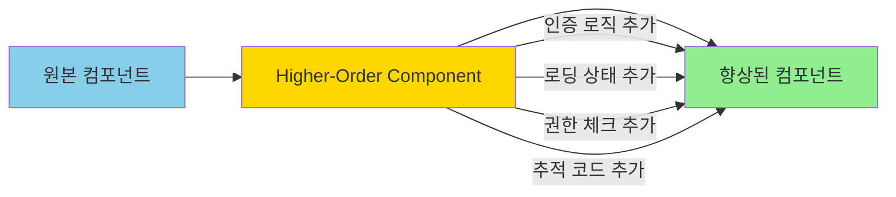

# HOC 패턴: 컴포넌트 로직의 재사용

## 시작하며

프론트엔드 개발을 하다 보면 여러 컴포넌트에서 동일한 로직이 반복되는 상황을 자주 만납니다.

- 30개 관리자 페이지마다 "로그인 안 되어있으면 로그인 페이지로 리다이렉트" 로직 복붙
- 모든 데이터 조회 컴포넌트에서 "로딩 중이면 스피너, 에러면 에러 메시지, 성공하면 내용" 반복
- VIP 전용 기능, 관리자 전용 기능마다 권한 체크 코드 중복
- Google Analytics나 Mixpanel로 페이지 뷰를 추적하는 코드를 모든 페이지에 추가

이런 코드를 각 컴포넌트마다 작성하면 다음 문제가 발생합니다:

- 인증 로직이 바뀌면 30개 파일을 모두 수정해야 함
- 한 곳이라도 빠뜨리면 보안 구멍 발생
- 핵심 비즈니스 로직이 부가 기능(인증, 로딩 등)에 묻힘
- 코드 중복으로 유지보수 비용 증가

**Higher-Order Component (HOC) 패턴**은 컴포넌트를 인자로 받아 새로운 컴포넌트를 반환하는 함수로, 반복되는 로직을 재사용 가능한 형태로 추출하는 패턴입니다.

---

## 문제 상황: 모든 곳에 반복되는 인증 체크

<Callout type="warning" title="흔한 요구사항 (관리자 페이지 구축)">
관리자 전용 페이지를 만들어야 합니다. 요구사항:

- **로그인 체크**: 비로그인 사용자는 로그인 페이지로 리다이렉트
- **권한 체크**: 관리자 권한이 없으면 403 에러 페이지
- **로딩 상태**: 인증 정보를 확인하는 동안 로딩 스피너 표시
- **페이지 추적**: 모든 페이지 접속을 Google Analytics에 기록

이런 로직이 관리자 페이지 30개에 모두 필요합니다.
</Callout>

순진하게 구현하면 이렇게 됩니다:

```tsx
// ❌ 모든 페이지마다 동일한 로직 반복
'use client';

import { useEffect, useState } from 'react';
import { useRouter } from 'next/navigation';

export default function AdminDashboard() {
  const router = useRouter();
  const [isLoading, setIsLoading] = useState(true);
  const [user, setUser] = useState(null);

  useEffect(() => {
    // 1. 로그인 체크
    const checkAuth = async () => {
      const token = localStorage.getItem('token');
      if (!token) {
        router.push('/login');
        return;
      }

      try {
        // 2. 사용자 정보 조회
        const response = await fetch('/api/auth/me', {
          headers: { Authorization: `Bearer ${token}` },
        });
        
        if (!response.ok) {
          router.push('/login');
          return;
        }

        const userData = await response.json();

        // 3. 권한 체크
        if (userData.role !== 'admin') {
          router.push('/403');
          return;
        }

        setUser(userData);
      } catch (error) {
        router.push('/login');
      } finally {
        setIsLoading(false);
      }
    };

    checkAuth();

    // 4. 페이지 뷰 추적
    if (typeof window !== 'undefined' && window.gtag) {
      window.gtag('event', 'page_view', {
        page_path: window.location.pathname,
      });
    }
  }, [router]);

  // 5. 로딩 중이면 스피너
  if (isLoading) {
    return (
      <div className="flex items-center justify-center h-screen">
        <div className="animate-spin rounded-full h-12 w-12 border-b-2 border-gray-900" />
      </div>
    );
  }

  // 6. 실제 컴포넌트 내용
  return (
    <div>
      <h1>관리자 대시보드</h1>
      <p>환영합니다, {user.name}님</p>
      {/* 실제 대시보드 내용 */}
    </div>
  );
}
```

이제 이 코드를 **사용자 관리, 주문 관리, 통계, 설정** 등 30개 페이지에 복사-붙여넣기 한다고 상상해 보세요:

- 토큰 검증 방식이 바뀌면 30개 파일 수정
- 한 페이지라도 권한 체크를 빠뜨리면 보안 위험
- 핵심 UI 로직이 인증 로직에 묻혀서 가독성 저하
- 로딩 스피너 디자인 변경 시 30개 파일 수정

---

## HOC 패턴 한눈에 보기

<Callout type="info" title="정의">
**컴포넌트를 인자로 받아 새로운 기능이 추가된 컴포넌트를 반환하는 함수**입니다. 컴포넌트의 로직을 재사용하고, 횡단 관심사(Cross-Cutting Concerns)를 처리하는 강력한 패턴입니다.
</Callout>



### 핵심 개념

```typescript
// HOC의 기본 구조
function withEnhancement<P extends object>(
  Component: React.ComponentType<P>
): React.ComponentType<P> {
  return function EnhancedComponent(props: P) {
    // 1. 추가 로직 실행
    const enhancedData = useSomeLogic();
    
    // 2. 원본 컴포넌트에 props 전달
    return <Component {...props} enhancedData={enhancedData} />;
  };
}

// 사용
const EnhancedMyComponent = withEnhancement(MyComponent);
```

### HOC의 특징

- **컴포넌트를 인자로 받음**: `withAuth(Dashboard)`
- **새로운 컴포넌트를 반환**: 원본은 수정하지 않음
- **Props 전달**: 원본 컴포넌트의 모든 props를 유지
- **추가 Props 주입**: 새로운 데이터나 함수를 props로 전달
- **조합 가능**: `withAuth(withLoading(Dashboard))`

### 명명 규칙

HOC는 관례적으로 `with`로 시작합니다:
- `withAuth`: 인증 체크
- `withLoading`: 로딩 상태 처리
- `withRole`: 권한 체크
- `withTracking`: 분석 추적

---

## 실전 시나리오 1: 인증 체크 HOC

### 1단계: withAuth HOC 구현

```tsx
// components/hoc/withAuth.tsx
'use client';

import { useEffect, useState, ComponentType } from 'react';
import { useRouter } from 'next/navigation';

interface User {
  id: string;
  name: string;
  email: string;
  role: string;
}

interface WithAuthProps {
  user: User;
}

export function withAuth<P extends WithAuthProps>(
  Component: ComponentType<P>
) {
  return function AuthenticatedComponent(props: Omit<P, keyof WithAuthProps>) {
    const router = useRouter();
    const [isLoading, setIsLoading] = useState(true);
    const [user, setUser] = useState<User | null>(null);

    useEffect(() => {
      const checkAuth = async () => {
        try {
          const token = localStorage.getItem('token');
          
          if (!token) {
            router.push('/login');
            return;
          }

          const response = await fetch('/api/auth/me', {
            headers: {
              Authorization: `Bearer ${token}`,
            },
          });

          if (!response.ok) {
            localStorage.removeItem('token');
            router.push('/login');
            return;
          }

          const userData = await response.json();
          setUser(userData);
        } catch (error) {
          console.error('Auth check failed:', error);
          router.push('/login');
        } finally {
          setIsLoading(false);
        }
      };

      checkAuth();
    }, [router]);

    if (isLoading) {
      return (
        <div className="flex items-center justify-center h-screen">
          <div className="animate-spin rounded-full h-12 w-12 border-b-2 border-gray-900" />
        </div>
      );
    }

    if (!user) {
      return null;
    }

    // 원본 컴포넌트에 user를 props로 전달
    return <Component {...(props as P)} user={user} />;
  };
}
```

### 2단계: withRole HOC 구현 (권한 체크)

```tsx
// components/hoc/withRole.tsx
'use client';

import { ComponentType } from 'react';
import { useRouter } from 'next/navigation';

interface User {
  id: string;
  name: string;
  email: string;
  role: string;
}

interface WithRoleProps {
  user: User;
}

export function withRole<P extends WithRoleProps>(
  Component: ComponentType<P>,
  allowedRoles: string[]
) {
  return function RoleCheckedComponent(props: P) {
    const router = useRouter();
    const { user } = props;

    if (!allowedRoles.includes(user.role)) {
      router.push('/403');
      return null;
    }

    return <Component {...props} />;
  };
}
```

### 3단계: withLoading HOC 구현

```tsx
// components/hoc/withLoading.tsx
'use client';

import { ComponentType, useState, useEffect } from 'react';

interface WithLoadingProps {
  isLoading?: boolean;
}

interface LoadingComponentProps {
  message?: string;
}

const DefaultLoadingComponent: React.FC<LoadingComponentProps> = ({ message }) => (
  <div className="flex flex-col items-center justify-center h-screen">
    <div className="animate-spin rounded-full h-12 w-12 border-b-2 border-gray-900 mb-4" />
    {message && <p className="text-gray-600">{message}</p>}
  </div>
);

export function withLoading<P extends object>(
  Component: ComponentType<P>,
  fetchData?: () => Promise<any>,
  LoadingComponent: ComponentType<LoadingComponentProps> = DefaultLoadingComponent
) {
  return function LoadingComponent(props: P & WithLoadingProps) {
    const [isLoading, setIsLoading] = useState(!!fetchData);
    const [data, setData] = useState<any>(null);
    const [error, setError] = useState<Error | null>(null);

    useEffect(() => {
      if (!fetchData) return;

      const loadData = async () => {
        try {
          setIsLoading(true);
          const result = await fetchData();
          setData(result);
        } catch (err) {
          setError(err as Error);
        } finally {
          setIsLoading(false);
        }
      };

      loadData();
    }, []);

    if (isLoading || props.isLoading) {
      return <LoadingComponent />;
    }

    if (error) {
      return (
        <div className="flex items-center justify-center h-screen">
          <div className="text-red-600">
            <h2 className="text-xl font-bold mb-2">오류가 발생했습니다</h2>
            <p>{error.message}</p>
          </div>
        </div>
      );
    }

    return <Component {...props} data={data} />;
  };
}
```

### 4단계: withTracking HOC 구현

```tsx
// components/hoc/withTracking.tsx
'use client';

import { ComponentType, useEffect } from 'react';
import { usePathname } from 'next/navigation';

interface TrackingOptions {
  eventName?: string;
  includeProps?: boolean;
}

export function withTracking<P extends object>(
  Component: ComponentType<P>,
  options: TrackingOptions = {}
) {
  return function TrackedComponent(props: P) {
    const pathname = usePathname();

    useEffect(() => {
      // Google Analytics 추적
      if (typeof window !== 'undefined' && window.gtag) {
        window.gtag('event', options.eventName || 'page_view', {
          page_path: pathname,
          ...(options.includeProps ? props : {}),
        });
      }

      // Mixpanel 추적 (예시)
      if (typeof window !== 'undefined' && (window as any).mixpanel) {
        (window as any).mixpanel.track(options.eventName || 'Page View', {
          page: pathname,
        });
      }

      console.log(`[Analytics] ${pathname} viewed`);
    }, [pathname]);

    return <Component {...props} />;
  };
}
```

### 5단계: 사용 - HOC 조합

```tsx
// app/admin/dashboard/page.tsx
'use client';

import { withAuth } from '@/components/hoc/withAuth';
import { withRole } from '@/components/hoc/withRole';
import { withTracking } from '@/components/hoc/withTracking';

interface DashboardProps {
  user: {
    id: string;
    name: string;
    email: string;
    role: string;
  };
}

function Dashboard({ user }: DashboardProps) {
  // 핵심 비즈니스 로직만 집중
  return (
    <div className="p-8">
      <h1 className="text-3xl font-bold mb-4">관리자 대시보드</h1>
      <p className="text-gray-600 mb-8">환영합니다, {user.name}님</p>
      
      <div className="grid grid-cols-1 md:grid-cols-3 gap-6">
        <div className="bg-white p-6 rounded-lg shadow">
          <h3 className="text-lg font-semibold mb-2">총 사용자</h3>
          <p className="text-3xl font-bold">1,234</p>
        </div>
        <div className="bg-white p-6 rounded-lg shadow">
          <h3 className="text-lg font-semibold mb-2">총 주문</h3>
          <p className="text-3xl font-bold">5,678</p>
        </div>
        <div className="bg-white p-6 rounded-lg shadow">
          <h3 className="text-lg font-semibold mb-2">매출</h3>
          <p className="text-3xl font-bold">₩12,345,678</p>
        </div>
      </div>
    </div>
  );
}

// HOC 조합: 인증 → 권한 → 추적
export default withTracking(
  withRole(
    withAuth(Dashboard),
    ['admin', 'manager']
  ),
  { eventName: 'admin_dashboard_view' }
);
```

**다른 페이지에서도 재사용**:

```tsx
// app/admin/users/page.tsx
'use client';

import { withAuth } from '@/components/hoc/withAuth';
import { withRole } from '@/components/hoc/withRole';

function UserManagement({ user }: { user: User }) {
  return (
    <div>
      <h1>사용자 관리</h1>
      {/* 사용자 목록 */}
    </div>
  );
}

// 동일한 HOC를 다른 페이지에 적용
export default withRole(
  withAuth(UserManagement),
  ['admin']
);
```

```tsx
// app/admin/orders/page.tsx
'use client';

import { withAuth } from '@/components/hoc/withAuth';
import { withRole } from '@/components/hoc/withRole';

function OrderManagement({ user }: { user: User }) {
  return (
    <div>
      <h1>주문 관리</h1>
      {/* 주문 목록 */}
    </div>
  );
}

export default withRole(
  withAuth(OrderManagement),
  ['admin', 'manager']
);
```

---

## Before / After

```tsx
// ❌ HOC 없이: 모든 페이지에 인증 로직 반복
function Dashboard() {
  const [user, setUser] = useState(null);
  const [isLoading, setIsLoading] = useState(true);
  const router = useRouter();

  useEffect(() => {
    // 30줄의 인증 로직...
    const checkAuth = async () => {
      const token = localStorage.getItem('token');
      if (!token) {
        router.push('/login');
        return;
      }
      // ...
    };
    checkAuth();

    // 추적 코드
    if (window.gtag) {
      window.gtag('event', 'page_view', {});
    }
  }, []);

  if (isLoading) return <LoadingSpinner />;

  return <div>대시보드 내용</div>;
}

// 다른 30개 페이지에도 동일한 코드 복붙...
```

```tsx
// ✅ HOC 적용: 한 줄로 인증 + 권한 + 추적 추가
function Dashboard({ user }) {
  // 핵심 로직만 집중
  return <div>대시보드 내용</div>;
}

export default withTracking(
  withRole(
    withAuth(Dashboard),
    ['admin']
  )
);
```

**비교**:
- **코드 중복**: 30개 파일 × 50줄 → HOC 3개 파일
- **변경 영향도**: 인증 로직 변경 시 30개 파일 → HOC 1개 파일
- **가독성**: 부가 기능에 묻힌 핵심 로직 → 핵심 로직만 남음
- **테스트**: 각 페이지마다 인증 테스트 → HOC만 테스트하면 됨

---

## 실전 시나리오 2: 데이터 페칭 HOC

API 호출과 로딩/에러 상태를 자동으로 처리하는 HOC입니다.

```tsx
// components/hoc/withDataFetching.tsx
'use client';

import { ComponentType, useState, useEffect } from 'react';

interface WithDataFetchingOptions<T> {
  fetchData: () => Promise<T>;
  loadingComponent?: ComponentType;
  errorComponent?: ComponentType<{ error: Error; retry: () => void }>;
}

interface InjectedProps<T> {
  data: T;
  isLoading: boolean;
  error: Error | null;
  refetch: () => void;
}

export function withDataFetching<T, P extends InjectedProps<T>>(
  Component: ComponentType<P>,
  options: WithDataFetchingOptions<T>
) {
  const {
    fetchData,
    loadingComponent: LoadingComponent,
    errorComponent: ErrorComponent,
  } = options;

  return function DataFetchingComponent(props: Omit<P, keyof InjectedProps<T>>) {
    const [data, setData] = useState<T | null>(null);
    const [isLoading, setIsLoading] = useState(true);
    const [error, setError] = useState<Error | null>(null);

    const loadData = async () => {
      try {
        setIsLoading(true);
        setError(null);
        const result = await fetchData();
        setData(result);
      } catch (err) {
        setError(err as Error);
      } finally {
        setIsLoading(false);
      }
    };

    useEffect(() => {
      loadData();
    }, []);

    if (isLoading && LoadingComponent) {
      return <LoadingComponent />;
    }

    if (isLoading) {
      return (
        <div className="flex items-center justify-center p-8">
          <div className="animate-spin rounded-full h-8 w-8 border-b-2 border-gray-900" />
        </div>
      );
    }

    if (error && ErrorComponent) {
      return <ErrorComponent error={error} retry={loadData} />;
    }

    if (error) {
      return (
        <div className="flex flex-col items-center justify-center p-8">
          <p className="text-red-600 mb-4">데이터를 불러오는 중 오류가 발생했습니다.</p>
          <button
            onClick={loadData}
            className="px-4 py-2 bg-blue-600 text-white rounded hover:bg-blue-700"
          >
            다시 시도
          </button>
        </div>
      );
    }

    return (
      <Component
        {...(props as P)}
        data={data!}
        isLoading={isLoading}
        error={error}
        refetch={loadData}
      />
    );
  };
}
```

### 사용 예시

```tsx
// app/products/page.tsx
'use client';

import { withDataFetching } from '@/components/hoc/withDataFetching';

interface Product {
  id: string;
  name: string;
  price: number;
  image: string;
}

interface ProductListProps {
  data: Product[];
  refetch: () => void;
}

function ProductList({ data, refetch }: ProductListProps) {
  return (
    <div className="p-8">
      <div className="flex justify-between items-center mb-6">
        <h1 className="text-3xl font-bold">상품 목록</h1>
        <button
          onClick={refetch}
          className="px-4 py-2 bg-blue-600 text-white rounded hover:bg-blue-700"
        >
          새로고침
        </button>
      </div>
      
      <div className="grid grid-cols-1 md:grid-cols-3 gap-6">
        {data.map((product) => (
          <div key={product.id} className="bg-white p-4 rounded-lg shadow">
            
            <h3 className="text-lg font-semibold mb-2">{product.name}</h3>
            <p className="text-2xl font-bold text-blue-600">
              ₩{product.price.toLocaleString()}
            </p>
          </div>
        ))}
      </div>
    </div>
  );
}

// HOC 적용: 자동으로 데이터 페칭, 로딩, 에러 처리
export default withDataFetching<Product[], ProductListProps>(ProductList, {
  fetchData: async () => {
    const response = await fetch('/api/products');
    if (!response.ok) {
      throw new Error('상품 목록을 불러올 수 없습니다.');
    }
    return response.json();
  },
});
```

---

## 실전 시나리오 3: 조건부 렌더링 HOC

특정 조건을 만족할 때만 컴포넌트를 렌더링합니다.

```tsx
// components/hoc/withConditionalRender.tsx
'use client';

import { ComponentType, ReactNode } from 'react';

interface WithConditionalRenderOptions {
  condition: () => boolean;
  fallback?: ReactNode;
}

export function withConditionalRender<P extends object>(
  Component: ComponentType<P>,
  options: WithConditionalRenderOptions
) {
  return function ConditionalComponent(props: P) {
    const { condition, fallback = null } = options;

    if (!condition()) {
      return <>{fallback}</>;
    }

    return <Component {...props} />;
  };
}

// 특정 시간대에만 표시
export function withTimeRange<P extends object>(
  Component: ComponentType<P>,
  startHour: number,
  endHour: number
) {
  return withConditionalRender(Component, {
    condition: () => {
      const hour = new Date().getHours();
      return hour >= startHour && hour < endHour;
    },
    fallback: (
      <div className="p-4 bg-yellow-100 border border-yellow-400 rounded">
        이 기능은 {startHour}시부터 {endHour}시까지만 이용 가능합니다.
      </div>
    ),
  });
}

// 피처 플래그에 따라 표시
export function withFeatureFlag<P extends object>(
  Component: ComponentType<P>,
  flagName: string
) {
  return withConditionalRender(Component, {
    condition: () => {
      // 환경 변수나 API로 피처 플래그 확인
      return process.env[`NEXT_PUBLIC_FEATURE_${flagName.toUpperCase()}`] === 'true';
    },
    fallback: null,
  });
}
```

### 사용 예시

```tsx
// app/promotion/page.tsx
'use client';

import { withTimeRange } from '@/components/hoc/withConditionalRender';

function FlashSale() {
  return (
    <div className="p-8 bg-red-100">
      <h1 className="text-4xl font-bold text-red-600 mb-4">⚡ 타임 세일 ⚡</h1>
      <p className="text-lg">지금만 50% 할인!</p>
    </div>
  );
}

// 오전 10시부터 오후 2시까지만 표시
export default withTimeRange(FlashSale, 10, 14);
```

```tsx
// app/experimental/new-feature/page.tsx
'use client';

import { withFeatureFlag } from '@/components/hoc/withConditionalRender';

function NewFeature() {
  return (
    <div className="p-8">
      <h1>새로운 실험 기능</h1>
      <p>베타 테스트 중입니다.</p>
    </div>
  );
}

// 피처 플래그가 활성화된 경우에만 표시
export default withFeatureFlag(NewFeature, 'NEW_DASHBOARD');
```

---

## HOC vs Custom Hooks

React Hooks가 등장한 이후, HOC의 많은 사용 사례가 Custom Hooks로 대체되었습니다.

### HOC 방식

```tsx
function withAuth(Component) {
  return function AuthComponent(props) {
    const [user, setUser] = useState(null);
    // 인증 로직...
    
    return <Component {...props} user={user} />;
  };
}

const ProtectedPage = withAuth(MyPage);
```

### Custom Hook 방식

```tsx
function useAuth() {
  const [user, setUser] = useState(null);
  // 인증 로직...
  
  return { user };
}

function MyPage() {
  const { user } = useAuth();
  
  return <div>...</div>;
}
```

### 비교

| 측면 | HOC | Custom Hooks |
|------|-----|--------------|
| **문법** | 컴포넌트 감싸기 | 함수 호출 |
| **Props 전달** | 자동 | 명시적 |
| **컴포넌트 계층** | 중첩 증가 | 중첩 없음 |
| **타입 추론** | 복잡 | 간단 |
| **유연성** | 컴포넌트 교체 | 로직만 재사용 |
| **디버깅** | 어려움 (Wrapper Hell) | 쉬움 |
| **사용 시점** | 클래스 컴포넌트, 로직 + UI | 함수 컴포넌트, 로직만 |

<Callout type="info" title="언제 HOC를, 언제 Custom Hooks를?">
**HOC를 사용해야 하는 경우**:
- 렌더링 자체를 제어해야 할 때 (조건부 렌더링, 로딩 화면)
- 컴포넌트를 완전히 다른 컴포넌트로 교체해야 할 때
- 외부 라이브러리와 통합 (React Router, Redux)
- 레거시 클래스 컴포넌트 지원

**Custom Hooks를 사용해야 하는 경우**:
- 로직만 재사용하고 렌더링은 컴포넌트가 결정할 때
- 여러 상태와 effect를 조합할 때
- 타입 안전성이 중요할 때
- 디버깅과 가독성이 중요할 때
</Callout>

### 하이브리드 접근: HOC + Hooks

두 가지를 조합하면 장점을 모두 얻을 수 있습니다.

```tsx
// Custom Hook으로 로직 분리
function useAuth() {
  const [user, setUser] = useState(null);
  const [isLoading, setIsLoading] = useState(true);
  const router = useRouter();

  useEffect(() => {
    // 인증 로직
  }, []);

  return { user, isLoading };
}

// HOC는 렌더링 제어만 담당
export function withAuth<P extends { user: User }>(
  Component: ComponentType<P>
) {
  return function AuthComponent(props: Omit<P, 'user'>) {
    const { user, isLoading } = useAuth(); // Hook 사용

    if (isLoading) {
      return <LoadingSpinner />;
    }

    if (!user) {
      return null;
    }

    return <Component {...(props as P)} user={user} />;
  };
}
```

---

## Next.js App Router에서의 HOC

Next.js 13+ App Router에서는 Server Components와 Client Components를 구분해야 합니다.

### Server Component HOC

```tsx
// components/hoc/withServerAuth.tsx
import { redirect } from 'next/navigation';
import { cookies } from 'next/headers';

interface User {
  id: string;
  name: string;
  email: string;
}

async function getUser(): Promise<User | null> {
  const cookieStore = cookies();
  const token = cookieStore.get('token');

  if (!token) {
    return null;
  }

  try {
    const response = await fetch(`${process.env.API_URL}/auth/me`, {
      headers: {
        Authorization: `Bearer ${token.value}`,
      },
      cache: 'no-store',
    });

    if (!response.ok) {
      return null;
    }

    return response.json();
  } catch {
    return null;
  }
}

export function withServerAuth<P extends { user: User }>(
  Component: React.ComponentType<P>
) {
  return async function ServerAuthComponent(props: Omit<P, 'user'>) {
    const user = await getUser();

    if (!user) {
      redirect('/login');
    }

    return <Component {...(props as P)} user={user} />;
  };
}
```

### 사용

```tsx
// app/admin/dashboard/page.tsx
import { withServerAuth } from '@/components/hoc/withServerAuth';

interface DashboardProps {
  user: User;
}

async function Dashboard({ user }: DashboardProps) {
  // Server Component: 서버에서 데이터 페칭
  const stats = await fetch(`${process.env.API_URL}/admin/stats`).then(r => r.json());

  return (
    <div className="p-8">
      <h1 className="text-3xl font-bold mb-4">관리자 대시보드</h1>
      <p className="text-gray-600 mb-8">환영합니다, {user.name}님</p>
      
      <div className="grid grid-cols-3 gap-6">
        <div className="bg-white p-6 rounded-lg shadow">
          <h3 className="text-lg font-semibold mb-2">총 사용자</h3>
          <p className="text-3xl font-bold">{stats.totalUsers}</p>
        </div>
      </div>
    </div>
  );
}

export default withServerAuth(Dashboard);
```

---

## 적용 체크리스트

<Steps>
  <Step title="반복 패턴 식별">
    여러 컴포넌트에서 반복되는 로직을 찾으세요. 인증, 로딩, 권한, 추적 등이 대표적입니다.
  </Step>
  
  <Step title="로직 분리">
    핵심 비즈니스 로직과 부가 기능(횡단 관심사)을 명확히 구분하세요. 부가 기능만 HOC로 추출합니다.
  </Step>
  
  <Step title="Props 인터페이스 정의">
    HOC가 주입할 props의 타입을 명확히 정의하세요. TypeScript를 사용하면 타입 안전성을 확보할 수 있습니다.
  </Step>
  
  <Step title="원본 Props 유지">
    HOC는 원본 컴포넌트의 모든 props를 그대로 전달해야 합니다. `{...props}` 스프레드 연산자를 사용하세요.
  </Step>
  
  <Step title="Display Name 설정">
    디버깅을 위해 HOC가 반환하는 컴포넌트에 `displayName`을 설정하세요.
  </Step>
</Steps>

---

## 언제 쓰면 안 될까?

<Callout type="warning" title="주의">
다음 상황에서는 HOC보다 다른 패턴이 더 적합합니다:
</Callout>

- **한 곳에서만 사용할 때**: 재사용하지 않는다면 HOC는 불필요한 추상화입니다.
- **로직만 재사용할 때**: UI 제어가 필요 없다면 Custom Hooks가 더 간단합니다.
- **Props가 자주 바뀔 때**: HOC는 props 변경에 따른 타입 추론이 복잡해집니다.
- **너무 많이 중첩될 때**: `withA(withB(withC(Component)))` 같은 Wrapper Hell은 피하세요.

```tsx
// ❌ 이런 경우는 HOC가 오버엔지니어링
// 한 곳에서만 쓰는 로직을 HOC로 만들 필요 없음
function MyPage() {
  const [count, setCount] = useState(0);
  
  return (
    <div>
      <p>Count: {count}</p>
      <button onClick={() => setCount(count + 1)}>증가</button>
    </div>
  );
}

// ❌ Wrapper Hell
export default withA(
  withB(
    withC(
      withD(
        withE(MyPage)
      )
    )
  )
);

// ✅ Custom Hooks로 로직만 재사용
function MyPage() {
  const { count, increment } = useCounter();
  
  return (
    <div>
      <p>Count: {count}</p>
      <button onClick={increment}>증가</button>
    </div>
  );
}
```

---

## 실무 팁

### 1. Display Name 설정

React DevTools에서 디버깅하기 쉽게 만듭니다.

```tsx
export function withAuth<P extends object>(Component: ComponentType<P>) {
  const AuthComponent = function (props: P) {
    // HOC 로직...
    return <Component {...props} />;
  };

  // Display Name 설정
  AuthComponent.displayName = `withAuth(${Component.displayName || Component.name || 'Component'})`;

  return AuthComponent;
}
```

### 2. Ref Forwarding

ref를 원본 컴포넌트로 전달해야 할 때가 있습니다.

```tsx
import { forwardRef, ComponentType, Ref } from 'react';

export function withAuth<P extends object>(Component: ComponentType<P>) {
  const AuthComponent = forwardRef((props: P, ref: Ref<any>) => {
    const { user, isLoading } = useAuth();

    if (isLoading) return <LoadingSpinner />;
    if (!user) return null;

    return <Component {...props} ref={ref} user={user} />;
  });

  AuthComponent.displayName = `withAuth(${Component.displayName || Component.name})`;

  return AuthComponent;
}
```

### 3. Static Methods 복사

원본 컴포넌트의 static methods를 HOC가 반환하는 컴포넌트에 복사합니다.

```tsx
import hoistNonReactStatics from 'hoist-non-react-statics';

export function withAuth<P extends object>(Component: ComponentType<P>) {
  const AuthComponent = function (props: P) {
    // HOC 로직...
    return <Component {...props} />;
  };

  // Static methods 복사
  hoistNonReactStatics(AuthComponent, Component);

  return AuthComponent;
}
```

### 4. 조합 가능한 HOC 만들기

여러 HOC를 쉽게 조합할 수 있는 헬퍼 함수를 만듭니다.

```tsx
// utils/compose-hocs.ts
export function compose(...hocs: Array<(component: any) => any>) {
  return (component: any) => {
    return hocs.reduceRight((acc, hoc) => hoc(acc), component);
  };
}

// 사용
const enhance = compose(
  withAuth,
  withRole(['admin']),
  withTracking({ eventName: 'dashboard_view' }),
  withLoading
);

export default enhance(Dashboard);
```

### 5. 타입 안전한 HOC

TypeScript로 타입 안전성을 보장합니다.

```tsx
type Omit<T, K extends keyof T> = Pick<T, Exclude<keyof T, K>>;

interface InjectedProps {
  user: User;
}

export function withAuth<P extends InjectedProps>(
  Component: ComponentType<P>
): ComponentType<Omit<P, keyof InjectedProps>> {
  return function AuthComponent(props: Omit<P, keyof InjectedProps>) {
    const { user, isLoading } = useAuth();

    if (isLoading) return <LoadingSpinner />;
    if (!user) return null;

    return <Component {...(props as P)} user={user} />;
  };
}

// 사용: user prop은 자동으로 주입되므로 전달하지 않아도 됨
interface MyPageProps extends InjectedProps {
  title: string;
}

function MyPage({ user, title }: MyPageProps) {
  return (
    <div>
      <h1>{title}</h1>
      <p>Hello, {user.name}</p>
    </div>
  );
}

const Enhanced = withAuth(MyPage);

// ✅ user를 전달하지 않아도 타입 에러 없음
<Enhanced title="My Page" />

// ❌ user를 전달하면 타입 에러
<Enhanced title="My Page" user={someUser} />
```

---

## 실전 예시: 다단계 권한 HOC

실제 프로젝트에서는 복잡한 권한 체계가 필요할 수 있습니다.

```tsx
// components/hoc/withPermission.tsx
'use client';

import { ComponentType } from 'react';
import { useRouter } from 'next/navigation';

interface User {
  id: string;
  role: string;
  permissions: string[];
}

interface WithPermissionOptions {
  requiredPermissions?: string[];
  requiredRoles?: string[];
  requireAll?: boolean; // true: AND 조건, false: OR 조건
  fallback?: ComponentType<{ user: User }>;
  redirectTo?: string;
}

export function withPermission<P extends { user: User }>(
  Component: ComponentType<P>,
  options: WithPermissionOptions
) {
  const {
    requiredPermissions = [],
    requiredRoles = [],
    requireAll = true,
    fallback: Fallback,
    redirectTo,
  } = options;

  return function PermissionComponent(props: P) {
    const router = useRouter();
    const { user } = props;

    // 권한 체크
    const hasPermission = () => {
      if (requiredPermissions.length === 0 && requiredRoles.length === 0) {
        return true;
      }

      const hasRole = requiredRoles.length === 0 || 
        requiredRoles.includes(user.role);

      const hasPerms = requiredPermissions.length === 0 ||
        (requireAll
          ? requiredPermissions.every(p => user.permissions.includes(p))
          : requiredPermissions.some(p => user.permissions.includes(p)));

      return requireAll ? (hasRole && hasPerms) : (hasRole || hasPerms);
    };

    if (!hasPermission()) {
      if (redirectTo) {
        router.push(redirectTo);
        return null;
      }

      if (Fallback) {
        return <Fallback user={user} />;
      }

      return (
        <div className="flex flex-col items-center justify-center h-screen">
          <h1 className="text-2xl font-bold mb-4">접근 권한이 없습니다</h1>
          <p className="text-gray-600 mb-4">
            이 페이지에 접근할 권한이 없습니다.
          </p>
          <button
            onClick={() => router.back()}
            className="px-4 py-2 bg-blue-600 text-white rounded hover:bg-blue-700"
          >
            이전 페이지로
          </button>
        </div>
      );
    }

    return <Component {...props} />;
  };
}
```

### 사용 예시

```tsx
// app/admin/users/delete/page.tsx
import { withAuth } from '@/components/hoc/withAuth';
import { withPermission } from '@/components/hoc/withPermission';

function UserDeletePage({ user }: { user: User }) {
  return (
    <div className="p-8">
      <h1 className="text-2xl font-bold text-red-600">사용자 삭제</h1>
      <p className="text-gray-600 mb-4">주의: 이 작업은 되돌릴 수 없습니다.</p>
      {/* 삭제 UI */}
    </div>
  );
}

// 관리자 역할 + 사용자 삭제 권한 필요
export default withPermission(
  withAuth(UserDeletePage),
  {
    requiredRoles: ['admin', 'super_admin'],
    requiredPermissions: ['user.delete'],
    requireAll: true,
    redirectTo: '/403',
  }
);
```

```tsx
// app/reports/financial/page.tsx
function FinancialReport({ user }: { user: User }) {
  return (
    <div>
      <h1>재무 리포트</h1>
      {/* 민감한 재무 정보 */}
    </div>
  );
}

// 재무 관련 권한 중 하나라도 있으면 접근 가능
export default withPermission(
  withAuth(FinancialReport),
  {
    requiredPermissions: ['finance.read', 'finance.admin'],
    requireAll: false, // OR 조건
  }
);
```

---

## 프레임워크별 고찰

### React (CRA, Vite): HOC의 전통적 영역

<Callout type="success" title="전통적 React에서의 HOC">
- **클래스 컴포넌트 지원**: Hooks를 쓸 수 없는 클래스 컴포넌트에서 유용
- **라이브러리 통합**: Redux `connect`, React Router `withRouter`
- **레거시 코드베이스**: 기존 HOC를 유지하면서 점진적 마이그레이션
</Callout>

```tsx
// Redux HOC (레거시 패턴)
import { connect } from 'react-redux';

function mapStateToProps(state) {
  return { user: state.user };
}

export default connect(mapStateToProps)(MyComponent);
```

### Next.js: Server/Client 경계를 고려한 HOC

<Callout type="info" title="Next.js에서의 특징">
- **Server Components**: 서버에서 실행되는 HOC는 async 가능
- **Client Components**: `'use client'` 디렉티브 필요
- **Middleware**: 인증은 HOC보다 Middleware가 더 적합할 수 있음
- **App Router**: 레이아웃과 조합하여 사용
</Callout>

```tsx
// Next.js 권장 패턴: Layout + HOC 조합
// app/admin/layout.tsx
import { withServerAuth } from '@/components/hoc/withServerAuth';

async function AdminLayout({ children, user }: { children: React.ReactNode; user: User }) {
  return (
    <div>
      <nav>
        <p>관리자: {user.name}</p>
      </nav>
      <main>{children}</main>
    </div>
  );
}

export default withServerAuth(AdminLayout);
```

### Vue.js: HOC 대신 Composables

Vue 3에서는 HOC 대신 Composition API의 composables을 사용합니다.

```typescript
// Vue 3 Composable (HOC의 Vue 버전)
export function useAuth() {
  const user = ref(null);
  const isLoading = ref(true);

  onMounted(async () => {
    // 인증 로직
  });

  return { user, isLoading };
}

// 사용
<script setup>
import { useAuth } from '@/composables/useAuth';

const { user, isLoading } = useAuth();
</script>
```

---

## HOC 라이브러리들

실무에서 자주 사용하는 HOC 라이브러리들입니다.

### 1. recompose (레거시)

```bash
npm install recompose
```

```tsx
import { compose, withState, withHandlers } from 'recompose';

const enhance = compose(
  withState('counter', 'setCounter', 0),
  withHandlers({
    increment: ({ counter, setCounter }) => () => setCounter(counter + 1),
    decrement: ({ counter, setCounter }) => () => setCounter(counter - 1),
  })
);

export default enhance(Counter);
```

<Callout type="warning" title="참고">
recompose는 더 이상 유지보수되지 않습니다. React Hooks로 마이그레이션하는 것을 권장합니다.
</Callout>

### 2. hoist-non-react-statics

HOC가 원본 컴포넌트의 static methods를 유지하도록 돕습니다.

```bash
npm install hoist-non-react-statics
```

```tsx
import hoistNonReactStatics from 'hoist-non-react-statics';

function withAuth(Component) {
  const AuthComponent = (props) => {
    // HOC 로직
    return <Component {...props} />;
  };

  // Static methods 복사
  hoistNonReactStatics(AuthComponent, Component);

  return AuthComponent;
}
```

---

## 마치며

HOC 패턴은 **여러 컴포넌트에서 반복되는 로직을 재사용**하고, **횡단 관심사를 처리**하는 강력한 패턴입니다.

SI 프로젝트에서:
- 수십 개 페이지에서 **인증 체크**가 필요할 때
- 모든 관리자 페이지에 **권한 체크**를 추가해야 할 때
- 데이터 페칭의 **로딩/에러 처리**를 통일하고 싶을 때
- 모든 페이지에 **분석 추적**을 자동으로 추가하고 싶을 때

HOC 패턴을 도입해 보세요. 중복 코드가 사라지고, 변경이 한 곳에서 처리되며, 핵심 비즈니스 로직에 집중할 수 있습니다.

하지만 React Hooks가 등장한 이후, 많은 경우 **Custom Hooks가 더 간단하고 유연한 해결책**입니다. HOC는 다음 경우에만 사용하세요:

- 렌더링 자체를 제어해야 할 때 (조건부 렌더링, 로딩 화면)
- 컴포넌트를 다른 컴포넌트로 교체해야 할 때
- 레거시 코드베이스나 외부 라이브러리 통합

<Callout type="success" title="실무 권장사항">
**새 프로젝트**: Custom Hooks 우선, 필요시 HOC

**레거시 프로젝트**: 기존 HOC 유지, 신규는 Custom Hooks

**하이브리드**: HOC 내부에서 Custom Hooks 사용
</Callout>

<Callout type="info" title="다음 글에서">
**Part 4: Render Props & Custom Hooks 패턴**으로 이어집니다.

HOC의 대안이자 보완책인 현대적 React 패턴을 알아봅니다.
</Callout>

