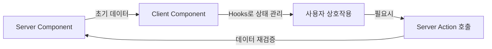

# Render Props & Custom Hooks: 로직 공유의 현대적 접근

<Callout type="info" title="핵심 요약">
  **Render Props**와 **Custom Hooks**는 컴포넌트 간에 **상태 관련 로직**을 재사용하기 위한 패턴입니다. 
  HOC(Higher-Order Components)가 겪었던 'Wrapper Hell'과 '이름 충돌' 문제를 해결하며, 더 직관적이고 유연한 코드 작성을 도와줍니다.
</Callout>

리액트 개발자들의 영원한 숙제는 "어떻게 하면 이 로직을 깔끔하게 재사용할까?"입니다. 
Mixin에서 시작해 HOC를 거쳐, 이제는 **Render Props**와 **Custom Hooks**가 그 해답이 되었습니다.

특히 Custom Hooks는 리액트 16.8(Hooks 도입) 이후 사실상 **표준(Standard)**이 되었죠. 왜 그럴까요?

## 1. Render Props: "무엇을 그릴지 네가 정해"

Render Props는 컴포넌트의 prop으로 **함수**를 전달하고, 그 함수가 무엇을 렌더링할지 결정하게 하는 패턴입니다.
이름 그대로 '렌더링을 위한 Props'인 셈이죠.

### 기본 개념

컴포넌트가 데이터를 가지고 있지만, 그 데이터로 **어떤 UI를 그릴지**는 부모에게 맡깁니다.

```tsx
// MouseTracker.tsx
interface MouseTrackerProps {
  render: (position: { x: number; y: number }) => React.ReactNode;
}

const MouseTracker = ({ render }: MouseTrackerProps) => {
  const [position, setPosition] = useState({ x: 0, y: 0 });

  // ... 마우스 이벤트 리스너 로직 (생략) ...

  // UI 렌더링을 'render' prop 함수에게 위임!
  return <div>{render(position)}</div>;
};

// 사용처
<MouseTracker render={({ x, y }) => (
  <h1>마우스 위치: {x}, {y}</h1>
)} />
```

<Callout type="success" title="장점">
  - **유연성**: 데이터를 어떻게 표현할지 사용자가 완벽하게 제어할 수 있습니다.
  - **명시성**: 데이터가 어디서 오는지 코드상에서 바로 보입니다 (`render` 함수의 인자).
  - **이름 충돌 없음**: HOC처럼 props 이름이 겹칠 걱정이 없습니다.
</Callout>

하지만 Render Props도 과하게 사용하면 **Callback Hell** 처럼 코드가 깊어질 수 있습니다.

```tsx
<UserProvider render={user => (
  <ThemeProvider render={theme => (
    <Router render={route => (
      <App user={user} theme={theme} route={route} />
    )} />
  )} />
)} />
```

이런 모양새, 썩 달갑지 않죠? 😅

## 2. Custom Hooks: "그냥 함수 쓰듯이"

Hooks의 등장은 게임 체인저였습니다. 컴포넌트 계층 구조를 건드리지 않고도 상태 로직을 마법처럼 꺼내 쓸 수 있게 되었으니까요.

### Hooks로의 전환

위의 `MouseTracker` 로직을 Hook으로 옮기면 어떻게 될까요?

```tsx
// useMousePosition.ts
const useMousePosition = () => {
  const [position, setPosition] = useState({ x: 0, y: 0 });

  useEffect(() => {
    const updateMouse = (e: MouseEvent) => {
      setPosition({ x: e.clientX, y: e.clientY });
    };
    window.addEventListener('mousemove', updateMouse);
    return () => window.removeEventListener('mousemove', updateMouse);
  }, []);

  return position;
};

// 사용처
const App = () => {
  const { x, y } = useMousePosition(); // 그냥 함수 호출!
  return <h1>마우스 위치: {x}, {y}</h1>;
};
```

<div className="grid grid-cols-1 md:grid-cols-2 gap-4 my-6">
  <Card title="구조의 단순화" icon={<Icon name="Layout" className="text-blue-500" />}>
    컴포넌트 트리를 감싸거나 중첩할 필요가 없습니다. 로직이 필요한 곳에서 함수를 호출하기만 하면 됩니다.
  </Card>
  <Card title="타입스크립트 친화적" icon={<Icon name="FileCode" className="text-blue-500" />}>
    일반 함수이므로 타입 추론이 자연스럽고, 제네릭을 활용하기도 훨씬 쉽습니다.
  </Card>
</div>

## 3. 비교: HOC vs Render Props vs Custom Hooks

같은 문제를 해결하는 세 가지 방법의 차이를 코드로 느껴보세요.

<Tabs defaultValue="hooks">
  <TabsList>
    <TabsTrigger value="hoc">HOC (과거)</TabsTrigger>
    <TabsTrigger value="render-props">Render Props</TabsTrigger>
    <TabsTrigger value="hooks">Custom Hooks (현대)</TabsTrigger>
  </TabsList>
  
  <TabsContent value="hoc">
    ```tsx
    // 데이터가 어디서 왔는지 props만 보고는 알기 어려움
    // props 네이밍 충돌 가능성 있음
    const MyComponent = ({ data, isLoading }) => {
      if (isLoading) return <Spinner />;
      return <div>{data}</div>;
    };

    export default withAuth(withData(MyComponent));
    ```
  </TabsContent>
  
  <TabsContent value="render-props">
    ```tsx
    // 데이터의 출처는 명확하지만 코드가 오른쪽으로 밀려남
    const MyComponent = () => (
      <DataProvider render={({ data, isLoading }) => (
        <AuthProvider render={({ user }) => (
           isLoading ? <Spinner /> : <div>{user.name}: {data}</div>
        )} />
      )} />
    );
    ```
  </TabsContent>
  
  <TabsContent value="hooks">
    ```tsx
    // 평탄한 구조(Flat), 명시적 출처, 변수명 변경 자유로움
    const MyComponent = () => {
      const { user } = useAuth();
      const { data, isLoading } = useData();

      if (isLoading) return <Spinner />;
      return <div>{user.name}: {data}</div>;
    };
    ```
  </TabsContent>
</Tabs>

## 4. 현실 시나리오 (Real-world Scenarios)

현업에서 Custom Hooks는 어디에 쓰일까요? 단순히 `useState` 몇 개 묶는 것을 넘어선 패턴들입니다.

### 🛠️ 데이터 페칭 (Data Fetching)
가장 흔한 패턴입니다. 로딩 상태, 에러 처리, 데이터 캐싱을 캡슐화합니다.
`React Query`나 `SWR`이 바로 이 패턴의 정점에 있는 라이브러리들이죠.

```tsx
const { data, error, isLoading } = useFetch('/api/users');
```

### 📝 폼 관리 (Form Management)
입력값 상태, 유효성 검사, 제출 처리를 하나로 묶습니다.
`react-hook-form`처럼요.

```tsx
const { register, handleSubmit, errors } = useForm();
```

### 🎮 복잡한 UI 제어 (UI Logic)
모달, 드롭다운, 토스트 메시지 등의 상태 로직을 분리하여 UI 컴포넌트는 오직 '그리기'에만 집중하게 합니다.

```tsx
// 모달 로직을 분리
const loginModal = useModal();
const signupModal = useModal();

return (
  <>
    <button onClick={loginModal.open}>로그인</button>
    <button onClick={signupModal.open}>회원가입</button>
    
    <Modal {...loginModal.props}>로그인 폼...</Modal>
    <Modal {...signupModal.props}>회원가입 폼...</Modal>
  </>
);
```

## 5. 실전 Custom Hooks 구현

추상적인 이야기는 이쯤 하고, 실제로 유용한 Hook들을 만들어 봅시다.

### useDebounce: 검색창의 필수품

검색창에서 사용자가 타이핑할 때마다 API를 호출하면 서버가 죽습니다. 
입력이 멈춘 후 일정 시간(예: 500ms)이 지나면 그때 검색하는 것이 좋죠.

```tsx
function useDebounce<T>(value: T, delay: number = 500): T {
  const [debouncedValue, setDebouncedValue] = useState<T>(value);

  useEffect(() => {
    // 타이머 설정: delay 후에 값 업데이트
    const timer = setTimeout(() => {
      setDebouncedValue(value);
    }, delay);

    // cleanup: 값이 변경되면 이전 타이머 취소
    return () => clearTimeout(timer);
  }, [value, delay]);

  return debouncedValue;
}

// 사용 예시
function SearchInput() {
  const [searchTerm, setSearchTerm] = useState('');
  const debouncedSearch = useDebounce(searchTerm, 500);

  useEffect(() => {
    if (debouncedSearch) {
      // 실제 API 호출은 여기서만!
      fetchSearchResults(debouncedSearch);
    }
  }, [debouncedSearch]);

  return <input value={searchTerm} onChange={(e) => setSearchTerm(e.target.value)} />;
}
```

<Callout type="note" title="타이밍이 전부">
  `useDebounce`는 **사용자 경험**과 **서버 부하** 사이의 균형을 잡아줍니다. 
  검색창, 자동완성, 실시간 유효성 검사 등 입력 이벤트가 빈번한 곳에서 필수입니다.
</Callout>

### useLocalStorage: 상태를 브라우저에 저장

테마 설정, 사용자 환경설정 등을 페이지를 새로고침해도 유지하고 싶을 때 사용합니다.

```tsx
function useLocalStorage<T>(key: string, initialValue: T) {
  // 초기값: localStorage에서 읽어오거나 initialValue 사용
  const [storedValue, setStoredValue] = useState<T>(() => {
    if (typeof window === 'undefined') return initialValue; // SSR 대응
    
    try {
      const item = window.localStorage.getItem(key);
      return item ? JSON.parse(item) : initialValue;
    } catch (error) {
      console.error(`Error loading localStorage key "${key}":`, error);
      return initialValue;
    }
  });

  // 값 업데이트 시 localStorage에도 저장
  const setValue = (value: T | ((val: T) => T)) => {
    try {
      const valueToStore = value instanceof Function ? value(storedValue) : value;
      setStoredValue(valueToStore);
      
      if (typeof window !== 'undefined') {
        window.localStorage.setItem(key, JSON.stringify(valueToStore));
      }
    } catch (error) {
      console.error(`Error setting localStorage key "${key}":`, error);
    }
  };

  return [storedValue, setValue] as const;
}

// 사용 예시
function ThemeToggle() {
  const [theme, setTheme] = useLocalStorage<'light' | 'dark'>('theme', 'light');

  return (
    <button onClick={() => setTheme(theme === 'light' ? 'dark' : 'light')}>
      현재 테마: {theme}
    </button>
  );
}
```

### useIntersectionObserver: 무한 스크롤의 핵심

스크롤이 특정 지점에 도달했는지 감지하는 로직입니다. 무한 스크롤, Lazy Loading 이미지 등에 사용됩니다.

```tsx
function useIntersectionObserver(
  elementRef: RefObject<Element>,
  options?: IntersectionObserverInit
) {
  const [isIntersecting, setIsIntersecting] = useState(false);

  useEffect(() => {
    const element = elementRef.current;
    if (!element) return;

    const observer = new IntersectionObserver(([entry]) => {
      setIsIntersecting(entry.isIntersecting);
    }, options);

    observer.observe(element);

    return () => observer.disconnect();
  }, [elementRef, options]);

  return isIntersecting;
}

// 사용 예시: 무한 스크롤
function InfiniteList() {
  const [items, setItems] = useState<Item[]>([]);
  const [page, setPage] = useState(1);
  const bottomRef = useRef<HTMLDivElement>(null);
  
  const isBottom = useIntersectionObserver(bottomRef, {
    threshold: 1.0, // 100% 보일 때 트리거
  });

  useEffect(() => {
    if (isBottom) {
      loadMoreItems(page).then(newItems => {
        setItems(prev => [...prev, ...newItems]);
        setPage(p => p + 1);
      });
    }
  }, [isBottom]);

  return (
    <div>
      {items.map(item => <ItemCard key={item.id} {...item} />)}
      <div ref={bottomRef} style={{ height: 20 }} />
    </div>
  );
}
```

<Callout type="success" title="성능 최적화의 기본">
  `IntersectionObserver`는 스크롤 이벤트 리스너보다 훨씬 효율적입니다. 
  브라우저가 최적화된 방식으로 화면 내 요소를 감지하기 때문이죠.
</Callout>

## 6. Custom Hooks의 안티패턴과 올바른 처리법

Hook이 만능은 아닙니다. 잘못 사용하면 오히려 코드를 더 복잡하게 만들죠.

### 안티패턴 1: 신이 된 Hook (God Hook)

**문제:** 하나의 Hook에 너무 많은 책임을 부여하는 경우입니다.

```tsx
// ❌ 나쁜 예: 모든 것을 하는 Hook
function useEverything() {
  const [user, setUser] = useState(null);
  const [theme, setTheme] = useState('light');
  const [notifications, setNotifications] = useState([]);
  const [cart, setCart] = useState([]);
  const [preferences, setPreferences] = useState({});
  
  // 100줄이 넘는 로직...
  
  return { user, theme, notifications, cart, preferences, /* 수많은 함수들... */ };
}
```

**해결:** **단일 책임 원칙(SRP)** 을 따르세요. Hook도 함수입니다. 하나의 일만 잘하면 됩니다.

```tsx
// ✅ 좋은 예: 책임을 분리
function useAuth() {
  const [user, setUser] = useState(null);
  // 인증 관련 로직만
  return { user, login, logout };
}

function useTheme() {
  const [theme, setTheme] = useLocalStorage('theme', 'light');
  // 테마 관련 로직만
  return { theme, toggleTheme };
}

function useCart() {
  const [items, setItems] = useState([]);
  // 장바구니 로직만
  return { items, addToCart, removeFromCart };
}
```

<Callout type="warning" title="리팩토링 시점">
  Hook이 **50줄을 넘어가거나**, **반환값이 5개 이상**이라면 분리를 고려하세요. 
  "이 Hook은 정확히 무엇을 담당하는가?"를 한 문장으로 설명할 수 없다면 너무 많은 일을 하고 있는 겁니다.
</Callout>

### 안티패턴 2: 조건부 Hook 호출

**문제:** Hook을 조건문 안에서 호출하면 React의 Hook 규칙을 위반합니다.

```tsx
// ❌ 나쁜 예: 조건부 Hook
function UserProfile({ userId }) {
  if (!userId) return null; // ⚠️ 여기서 리턴하면...
  
  const user = useUser(userId); // Hook이 건너뛰어질 수 있음!
  return <div>{user.name}</div>;
}
```

**해결:** Hook은 **항상 최상위 레벨**에서 호출하고, 조건은 그 안에서 처리하세요.

```tsx
// ✅ 좋은 예
function UserProfile({ userId }) {
  const user = useUser(userId); // 항상 호출
  
  if (!userId || !user) return null; // 조건은 나중에
  return <div>{user.name}</div>;
}

// 또는 Hook 내부에서 처리
function useUser(userId: string | null) {
  const [user, setUser] = useState(null);
  
  useEffect(() => {
    if (!userId) return; // Hook 내부에서의 조건은 OK
    fetchUser(userId).then(setUser);
  }, [userId]);
  
  return user;
}
```

### 안티패턴 3: 과도한 추상화

**문제:** 2줄짜리 로직을 Hook으로 만들면 오히려 코드가 복잡해집니다.

```tsx
// ❌ 나쁜 예: 불필요한 추상화
function useCounter() {
  const [count, setCount] = useState(0);
  return { count, setCount };
}

// 이건 그냥 useState를 직접 쓰는 게 나아요!
```

**해결:** **재사용성**과 **복잡성**을 고려하세요.

<Tabs defaultValue="when-extract">
  <TabsList>
    <TabsTrigger value="when-extract">Hook으로 추출해야 할 때</TabsTrigger>
    <TabsTrigger value="when-not">추출하지 말아야 할 때</TabsTrigger>
  </TabsList>
  
  <TabsContent value="when-extract">
    - **3개 이상의 컴포넌트**에서 같은 로직을 사용할 때
    - **복잡한 상태 관리**가 필요할 때 (여러 `useState`, `useEffect` 조합)
    - **부수효과(Side Effect)** 가 있고, cleanup이 필요할 때
    - **비즈니스 로직**과 **UI 로직**을 분리하고 싶을 때
    
    ```tsx
    // ✅ 이런 경우는 추출하세요
    function useWebSocket(url: string) {
      const [data, setData] = useState(null);
      const [status, setStatus] = useState('disconnected');
      
      useEffect(() => {
        const ws = new WebSocket(url);
        ws.onopen = () => setStatus('connected');
        ws.onmessage = (e) => setData(JSON.parse(e.data));
        ws.onerror = () => setStatus('error');
        ws.onclose = () => setStatus('disconnected');
        
        return () => ws.close(); // cleanup 필요
      }, [url]);
      
      return { data, status };
    }
    ```
  </TabsContent>
  
  <TabsContent value="when-not">
    - **한 곳에서만** 사용하는 로직
    - **단순한 상태**만 다룰 때 (useState 1~2개)
    - **부수효과가 없는** 단순 계산
    
    ```tsx
    // ❌ 이런 건 그냥 인라인으로 두세요
    function MyComponent() {
      // 굳이 useToggle() 같은 Hook 만들 필요 없음
      const [isOpen, setIsOpen] = useState(false);
      const toggle = () => setIsOpen(prev => !prev);
      
      return <button onClick={toggle}>{isOpen ? '열림' : '닫힘'}</button>;
    }
    ```
  </TabsContent>
</Tabs>

### 안티패턴 4: 의존성 배열 무시하기

**문제:** ESLint 경고를 무시하고 의존성 배열을 비우거나 잘못 설정하는 경우입니다.

```tsx
// ❌ 나쁜 예
function UserList() {
  const [users, setUsers] = useState([]);
  const [filter, setFilter] = useState('');

  useEffect(() => {
    fetchUsers(filter).then(setUsers);
    // eslint-disable-next-line react-hooks/exhaustive-deps
  }, []); // ⚠️ filter가 변경되어도 재실행 안 됨!

  return <div>{/* ... */}</div>;
}
```

**해결:** 의존성 배열을 정직하게 작성하거나, 함수를 Hook 내부로 이동하세요.

```tsx
// ✅ 좋은 예 1: 의존성 명시
useEffect(() => {
  fetchUsers(filter).then(setUsers);
}, [filter]); // filter 변경 시 재실행

// ✅ 좋은 예 2: useCallback 활용
const fetchData = useCallback(() => {
  fetchUsers(filter).then(setUsers);
}, [filter]);

useEffect(() => {
  fetchData();
}, [fetchData]);
```

## 7. Next.js와 Server Components 시대의 Hooks

Next.js 13+ (App Router)는 React의 패러다임을 바꿨습니다. 
**Server Components**가 기본이 되면서, Hooks 사용에도 변화가 생겼죠.

### 핵심 규칙: Hooks는 Client에서만

Server Components에서는 **Hook을 사용할 수 없습니다**. 
왜냐하면 서버는 상태(state)를 가질 수 없기 때문이죠.

```tsx
// ❌ 나쁜 예: Server Component에서 Hook 사용
// app/page.tsx (기본적으로 Server Component)
export default function Page() {
  const [count, setCount] = useState(0); // 🚨 에러!
  return <div>{count}</div>;
}
```

**해결:** `'use client'` 지시어를 사용하여 Client Component로 명시하세요.

```tsx
// ✅ 좋은 예: Client Component로 분리
// app/components/Counter.tsx
'use client';

export default function Counter() {
  const [count, setCount] = useState(0); // ✅ OK
  return <button onClick={() => setCount(c => c + 1)}>{count}</button>;
}
```

<Callout type="note" title="Server vs Client 경계 설정">
  모든 컴포넌트를 Client Component로 만들 필요는 없습니다. 
  **상호작용이 필요한 부분만** `'use client'`로 분리하고, 나머지는 Server Component로 두는 것이 성능상 유리합니다.
</Callout>

### 패턴: Server에서 데이터, Client에서 상호작용

가장 효율적인 구조는 다음과 같습니다:

```tsx
// app/users/page.tsx (Server Component)
async function UsersPage() {
  // 서버에서 데이터 페칭 (Hook 없이 직접 fetch)
  const users = await fetch('https://api.example.com/users').then(r => r.json());
  
  // Client Component에 데이터 전달
  return <UserList initialUsers={users} />;
}

// app/users/UserList.tsx (Client Component)
'use client';

export function UserList({ initialUsers }) {
  // Client에서만 상태 관리
  const [users, setUsers] = useState(initialUsers);
  const [filter, setFilter] = useState('');
  
  const filteredUsers = users.filter(u => u.name.includes(filter));
  
  return (
    <>
      <input value={filter} onChange={e => setFilter(e.target.value)} />
      {filteredUsers.map(user => <UserCard key={user.id} {...user} />)}
    </>
  );
}
```

<div className="my-6">



</div>

### Server Actions와 Custom Hooks의 조합

Server Actions(서버 함수)와 Custom Hooks를 조합하면 강력합니다.

```tsx
// app/actions/user.ts (Server Action)
'use server';

export async function createUser(formData: FormData) {
  const name = formData.get('name');
  // DB 저장 로직
  await db.user.create({ data: { name } });
  revalidatePath('/users');
}

// hooks/useFormSubmit.ts (Client Hook)
'use client';

export function useFormSubmit(action: (data: FormData) => Promise<void>) {
  const [isPending, setIsPending] = useState(false);
  const [error, setError] = useState<string | null>(null);

  const handleSubmit = async (e: React.FormEvent<HTMLFormElement>) => {
    e.preventDefault();
    setIsPending(true);
    setError(null);

    try {
      const formData = new FormData(e.currentTarget);
      await action(formData);
    } catch (err) {
      setError(err instanceof Error ? err.message : 'Unknown error');
    } finally {
      setIsPending(false);
    }
  };

  return { handleSubmit, isPending, error };
}

// components/CreateUserForm.tsx (Client Component)
'use client';

import { createUser } from '@/app/actions/user';
import { useFormSubmit } from '@/hooks/useFormSubmit';

export function CreateUserForm() {
  const { handleSubmit, isPending, error } = useFormSubmit(createUser);

  return (
    <form onSubmit={handleSubmit}>
      <input name="name" required />
      <button disabled={isPending}>
        {isPending ? '저장 중...' : '저장'}
      </button>
      {error && <p className="error">{error}</p>}
    </form>
  );
}
```

<Callout type="success" title="Best Practice">
  - **서버**: 데이터 페칭, DB 접근, 인증 확인 (Server Components, Server Actions)
  - **클라이언트**: 사용자 입력, 애니메이션, 즉각적인 피드백 (Client Components, Custom Hooks)
  
  이 경계를 명확히 하면 성능과 보안을 동시에 잡을 수 있습니다.
</Callout>

## 8. Render Props는 죽었나요?

아니요! Hooks가 대세지만 Render Props는 여전히 유용한 패턴입니다.
특히 **라이브러리 제작자**에게는 강력한 도구입니다.

예를 들어, 리스트 가상화 라이브러리(`react-window`)나 드래그 앤 드롭 라이브러리(`react-beautiful-dnd`)를 보세요.
이들은 **"내부 로직은 내가 처리할게, 각 항목을 어떻게 그릴지는 네가 정해"** 라는 철학이 필요할 때 Render Props를 사용합니다.

```tsx
// 여전히 유효한 Render Props 패턴 예시 (List Virtualization)
<FixedSizeList
  height={150}
  itemCount={1000}
  itemSize={35}
  width={300}
>
  {/* 각 아이템을 어떻게 렌더링할지는 사용자에게 위임 */}
  {({ index, style }) => (
    <div style={style}>Row {index}</div>
  )}
</FixedSizeList>
```

### Render Props의 안티패턴

#### 안티패턴 1: 매 렌더마다 새로운 함수 생성

```tsx
// ❌ 나쁜 예
function App() {
  const [count, setCount] = useState(0);
  
  return (
    <DataProvider 
      render={(data) => (
        <ExpensiveComponent data={data} count={count} />
      )} 
    />
  );
  // render prop이 매번 새로 생성되어 ExpensiveComponent가 불필요하게 리렌더링됨
}
```

**해결책:**

<Tabs defaultValue="useCallback">
  <TabsList>
    <TabsTrigger value="useCallback">useCallback 사용</TabsTrigger>
    <TabsTrigger value="component">별도 컴포넌트로 분리</TabsTrigger>
  </TabsList>
  
  <TabsContent value="useCallback">
    ```tsx
    // ✅ 좋은 예: useCallback으로 메모이제이션
    function App() {
      const [count, setCount] = useState(0);
      
      const renderData = useCallback((data) => (
        <ExpensiveComponent data={data} count={count} />
      ), [count]); // count가 바뀔 때만 함수 재생성
      
      return <DataProvider render={renderData} />;
    }
    ```
  </TabsContent>
  
  <TabsContent value="component">
    ```tsx
    // ✅ 더 좋은 예: 아예 별도 컴포넌트로
    function DataDisplay({ data, count }) {
      return <ExpensiveComponent data={data} count={count} />;
    }

    function App() {
      const [count, setCount] = useState(0);
      
      return (
        <DataProvider>
          {(data) => <DataDisplay data={data} count={count} />}
        </DataProvider>
      );
    }
    ```
  </TabsContent>
</Tabs>

#### 안티패턴 2: Children as Function의 혼란

`render` prop 대신 `children`을 함수로 받는 패턴도 있지만, 이는 직관성이 떨어질 수 있습니다.

```tsx
// 헷갈리는 패턴
<Toggle>
  {({ on, toggle }) => (
    <button onClick={toggle}>
      {on ? 'ON' : 'OFF'}
    </button>
  )}
</Toggle>
```

**언제 사용하는가?**

- **UI 제어권을 100% 위임**하고 싶을 때 (라이브러리)
- **Hook으로 변환하기 어려운 로직**일 때 (예: DOM 측정)
- **렌더링 최적화**가 중요할 때 (React.memo와 조합)

<Callout type="warning" title="Render Props vs Hooks, 무엇을 선택할까?">
  - **애플리케이션 코드**: Custom Hooks 우선 (더 간결하고 조합하기 쉬움)
  - **라이브러리 개발**: Render Props 고려 (더 유연하고, UI에 대한 가정이 없음)
  - **복잡한 조건부 렌더링**: Render Props가 유리할 수 있음
</Callout>

### Render Props + Hooks의 하이브리드

둘을 섞어 쓸 수도 있습니다. Hook으로 로직을 제공하고, Render Props로 세밀한 제어를 추가하는 식이죠.

```tsx
// Hook으로 기본 기능 제공
function useToggle(initialValue = false) {
  const [on, setOn] = useState(initialValue);
  const toggle = () => setOn(prev => !prev);
  const setOff = () => setOn(false);
  const setOn = () => setOn(true);
  
  return { on, toggle, setOff, setOn };
}

// Render Props로 복잡한 UI 제어
function Toggle({ children, defaultOn = false }) {
  const toggleState = useToggle(defaultOn);
  
  return <>{children(toggleState)}</>;
}

// 사용처에서 선택
function SimpleUsage() {
  const { on, toggle } = useToggle(); // Hook만 사용
  return <button onClick={toggle}>{on ? 'ON' : 'OFF'}</button>;
}

function ComplexUsage() {
  // Render Props로 더 복잡한 UI
  return (
    <Toggle defaultOn={false}>
      {({ on, toggle, setOff }) => (
        <div>
          <button onClick={toggle}>토글</button>
          <button onClick={setOff}>강제 OFF</button>
          <div className={on ? 'active' : 'inactive'}>
            상태: {on ? '활성' : '비활성'}
          </div>
        </div>
      )}
    </Toggle>
  );
}
```

## 9. 성능 최적화: Hooks와 리렌더링

Custom Hooks가 성능 문제를 일으키는 경우도 있습니다. 특히 **불필요한 리렌더링**이 주범이죠.

### 문제: Hook이 객체/배열을 반환할 때

```tsx
// ❌ 매번 새로운 객체를 생성
function useUser(id: string) {
  const [user, setUser] = useState(null);
  // ... fetch 로직 ...
  
  // 🚨 매 렌더마다 새로운 객체!
  return {
    user,
    isLoading: !user,
    refetch: () => fetchUser(id)
  };
}

function UserProfile({ userId }) {
  const userState = useUser(userId);
  
  useEffect(() => {
    console.log('리렌더링!');
  }, [userState]); // userState가 매번 새 객체라서 계속 실행됨
}
```

**해결책: useMemo와 useCallback**

```tsx
// ✅ 메모이제이션으로 최적화
function useUser(id: string) {
  const [user, setUser] = useState(null);
  
  const refetch = useCallback(() => {
    fetchUser(id).then(setUser);
  }, [id]);
  
  const result = useMemo(() => ({
    user,
    isLoading: !user,
    refetch
  }), [user, refetch]); // 의존성이 바뀔 때만 새 객체 생성
  
  return result;
}
```

<Callout type="note" title="언제 최적화해야 하나?">
  **조기 최적화는 악의 근원**입니다. 다음 경우에만 `useMemo`/`useCallback`을 사용하세요:
  - Hook이 **자주 호출되는 컴포넌트**에서 사용될 때
  - 반환값이 다른 Hook의 **의존성 배열**에 들어갈 때
  - 자식 컴포넌트에 **props로 전달**되고, 그 컴포넌트가 `React.memo`로 감싸져 있을 때
  
  그 외의 경우, 가독성을 위해 최적화를 미루는 것이 낫습니다.
</Callout>

### React DevTools Profiler로 측정하기

성능 문제를 **체감**이 아닌 **측정**으로 파악하세요.

<Steps>
  <Step title="React DevTools 설치">
    크롬 확장 프로그램 "React Developer Tools" 설치
  </Step>
  <Step title="Profiler 탭 열기">
    개발자 도구에서 Profiler 탭 선택 후 녹화 시작
  </Step>
  <Step title="의심되는 동작 수행">
    버튼 클릭, 입력 등 느리다고 생각되는 동작 실행
  </Step>
  <Step title="결과 분석">
    어떤 컴포넌트가 얼마나 자주, 오래 렌더링되는지 확인
  </Step>
</Steps>

## 10. 실전 체크리스트

Custom Hooks를 만들 때 이 리스트를 참고하세요.

<div className="space-y-4 my-6">

### 📋 설계 단계

<Callout type="note" title="질문 목록">
  - [ ] 이 로직이 **3곳 이상**에서 사용되는가?
  - [ ] Hook의 책임을 **한 문장**으로 설명할 수 있는가?
  - [ ] 반환값이 **5개 이하**인가?
  - [ ] Hook 이름이 `use`로 시작하는가?
  - [ ] TypeScript 타입이 명확한가?
</Callout>

### 🔍 구현 단계

<Callout type="warning" title="주의사항">
  - [ ] **조건부로** Hook을 호출하지 않았는가?
  - [ ] 의존성 배열을 **정직하게** 작성했는가?
  - [ ] ESLint 경고를 **무시하지 않았는가**?
  - [ ] cleanup 함수가 필요한 `useEffect`는 **반환**하고 있는가?
  - [ ] SSR을 고려했는가? (`typeof window` 체크)
</Callout>

### ⚡ 최적화 단계

<Callout type="success" title="성능 체크">
  - [ ] 객체/배열을 반환한다면 `useMemo`를 고려했는가?
  - [ ] 콜백 함수를 반환한다면 `useCallback`을 사용했는가?
  - [ ] React DevTools Profiler로 **측정**했는가?
  - [ ] 불필요한 조기 최적화를 하지 않았는가?
</Callout>

</div>

## 11. 프레임워크별 특이사항 정리

<Tabs defaultValue="nextjs">
  <TabsList>
    <TabsTrigger value="nextjs">Next.js</TabsTrigger>
    <TabsTrigger value="remix">Remix</TabsTrigger>
    <TabsTrigger value="react-native">React Native</TabsTrigger>
  </TabsList>
  
  <TabsContent value="nextjs">
    ### Next.js (App Router)
    
    **Server Components 기본:**
    - Hooks는 **Client Components**에서만 사용 가능
    - `'use client'` 지시어 필수
    - Server Actions와 조합하여 사용
    
    **주의사항:**
    ```tsx
    // ❌ Server Component에서 Hook 불가
    export default function Page() {
      const [state, setState] = useState(0); // 에러!
    }
    
    // ✅ Client Component로 분리
    'use client';
    export default function ClientPage() {
      const [state, setState] = useState(0); // OK
    }
    ```
    
    **데이터 페칭:**
    - Server: `fetch` 또는 `async/await` 직접 사용
    - Client: `useQuery` (React Query), `useSWR` (SWR) 추천
  </TabsContent>
  
  <TabsContent value="remix">
    ### Remix
    
    **Loader 기반 데이터 페칭:**
    - `useLoaderData()`: 서버에서 페칭한 데이터를 받아옴
    - `useActionData()`: Form Action의 결과를 받아옴
    - `useNavigation()`: 페이지 전환 상태 확인
    
    ```tsx
    // Remix 스타일
    export async function loader() {
      return json({ users: await db.user.findMany() });
    }
    
    export default function UsersPage() {
      const { users } = useLoaderData<typeof loader>();
      // 이미 서버에서 페칭 완료!
    }
    ```
    
    **Custom Hooks와의 조합:**
    - 클라이언트 상태 관리용으로 Custom Hooks 사용
    - 서버 데이터는 Loader에서 처리
  </TabsContent>
  
  <TabsContent value="react-native">
    ### React Native
    
    **플랫폼 특화 Hooks:**
    - `useWindowDimensions()`: 화면 크기 (반응형)
    - `useColorScheme()`: 다크모드 감지
    - `BackHandler`: Android 뒷버튼 처리
    
    **주의사항:**
    - `window`, `document` 같은 웹 API 없음
    - `localStorage` 대신 `AsyncStorage` 사용
    - 네이티브 모듈 접근 시 비동기 처리 필요
    
    ```tsx
    // React Native 전용 Hook 예시
    function useKeyboard() {
      const [isVisible, setIsVisible] = useState(false);
      
      useEffect(() => {
        const showListener = Keyboard.addListener('keyboardDidShow', () => {
          setIsVisible(true);
        });
        const hideListener = Keyboard.addListener('keyboardDidHide', () => {
          setIsVisible(false);
        });
        
        return () => {
          showListener.remove();
          hideListener.remove();
        };
      }, []);
      
      return isVisible;
    }
    ```
  </TabsContent>
</Tabs>

## 마치며

Custom Hooks는 리액트가 추구하는 **"합성(Composition)"**의 철학을 가장 잘 보여주는 기능입니다. 
UI와 로직을 완벽하게 분리할 수 있게 해주기 때문이죠.

### 핵심 요약

<div className="grid grid-cols-1 md:grid-cols-3 gap-4 my-6">
  <Card title="UI의 재사용" icon={<Icon name="Component" className="text-blue-500" />}>
    컴포넌트로 시각적 요소를 재사용합니다.
  </Card>
  <Card title="로직의 재사용" icon={<Icon name="Code2" className="text-green-500" />}>
    Custom Hooks로 상태 로직을 재사용합니다.
  </Card>
  <Card title="제어권의 위임" icon={<Icon name="Workflow" className="text-purple-500" />}>
    Render Props로 렌더링 제어를 위임합니다.
  </Card>
</div>

이 세 가지 도구를 적재적소에 꺼내 쓸 줄 아는 것이 숙련된 리액트 개발자의 증거입니다.

### 기억해야 할 원칙들

1. **DRY (Don't Repeat Yourself)**: 같은 로직이 3번 반복되면 Hook으로 추출하라
2. **KISS (Keep It Simple, Stupid)**: 2줄짜리 로직까지 Hook으로 만들지는 말라
3. **SRP (Single Responsibility)**: Hook 하나는 한 가지 일만 하라
4. **측정 후 최적화**: 체감이 아닌 Profiler로 측정하라
5. **Server와 Client 구분**: Next.js에서는 어디서 Hook을 쓰는지가 중요하다

<Blockquote author="Dan Abramov" cite="React Hooks RFC">
  Hooks let you use state and other React features without writing a class. They're the future of React.
</Blockquote>

Hook은 클래스 없이 리액트의 모든 기능을 사용하게 해줍니다. 그리고 그것이 리액트의 미래입니다.

<Steps>
  <Step title="반복되는 로직 찾기">
    `useState`와 `useEffect`가 여러 컴포넌트에서 똑같이 쓰이고 있나요?
  </Step>
  <Step title="Hook으로 추출하기">
    `use`로 시작하는 함수를 만들고 로직을 옮기세요. 책임은 하나만!
  </Step>
  <Step title="타입과 에러 처리">
    TypeScript로 타입을 명확히 하고, 에러 케이스를 처리하세요.
  </Step>
  <Step title="단순해진 컴포넌트 즐기기">
    이제 컴포넌트는 UI 렌더링이라는 본연의 임무에만 집중하면 됩니다.
  </Step>
</Steps>

<Callout type="success" title="다음 단계">
  이제 여러분의 프로젝트에서 반복되는 로직을 찾아보세요. 
  `useState`와 `useEffect`가 여러 곳에서 똑같이 쓰이고 있다면, 그것이 바로 Custom Hook으로 추출할 타이밍입니다.
</Callout>

