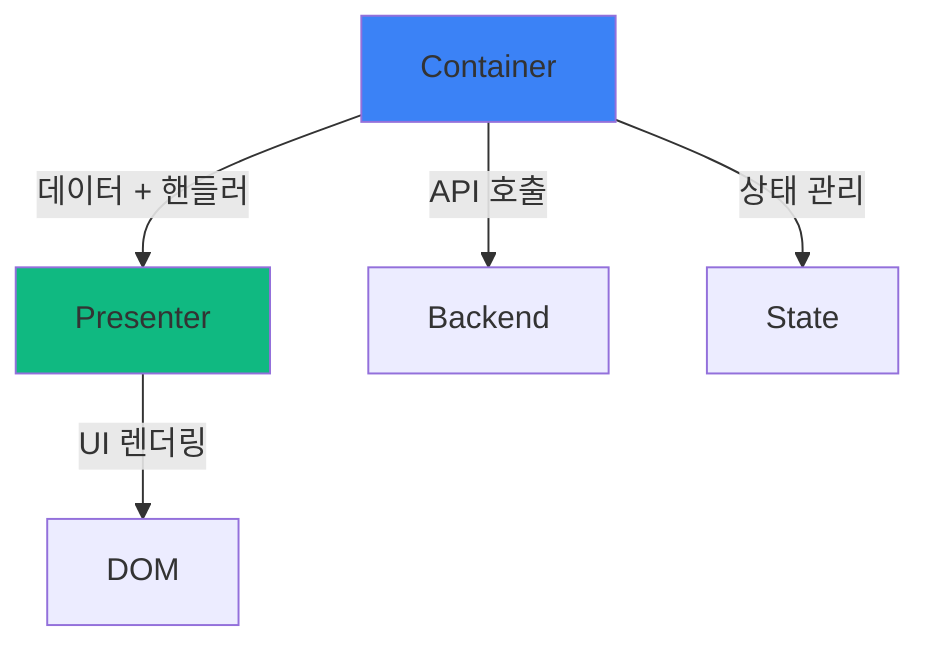

# Container/Presenter: 로직과 뷰의 분리

<Callout type="info" title="핵심 요약">
  **Container/Presenter 패턴**은 비즈니스 로직(데이터 처리, API 호출, 상태 관리)과 프레젠테이션 로직(UI 렌더링, 스타일링)을 분리하는 아키텍처 패턴입니다.
  Container는 "어떻게 동작하는가"를, Presenter는 "어떻게 보이는가"를 담당합니다.
</Callout>

컴포넌트를 만들다 보면 이런 괴물 같은 코드를 마주하게 됩니다:

```tsx
function UserList() {
  // 1. 상태 관리
  const [users, setUsers] = useState<User[]>([]);
  const [loading, setLoading] = useState(true);
  const [error, setError] = useState<string | null>(null);
  const [searchTerm, setSearchTerm] = useState('');
  const [sortBy, setSortBy] = useState<'name' | 'email'>('name');
  const [page, setPage] = useState(1);
  
  // 2. API 호출
  useEffect(() => {
    async function fetchUsers() {
      try {
        setLoading(true);
        const response = await fetch(`/api/users?page=${page}`);
        const data = await response.json();
        setUsers(data);
      } catch (e) {
        setError(e.message);
      } finally {
        setLoading(false);
      }
    }
    fetchUsers();
  }, [page]);
  
  // 3. 데이터 가공
  const filteredUsers = users.filter(user => 
    user.name.toLowerCase().includes(searchTerm.toLowerCase())
  );
  
  const sortedUsers = [...filteredUsers].sort((a, b) => 
    a[sortBy].localeCompare(b[sortBy])
  );
  
  // 4. 이벤트 핸들러
  const handleDelete = async (userId: string) => {
    if (!confirm('정말 삭제하시겠습니까?')) return;
    await fetch(`/api/users/${userId}`, { method: 'DELETE' });
    setUsers(users.filter(u => u.id !== userId));
  };
  
  const handleEdit = (user: User) => {
    // ... 편집 로직
  };
  
  // 5. 렌더링 (100줄이 넘는 JSX)
  if (loading) {
    return (
      <div className="flex justify-center items-center h-screen">
        <Spinner size="large" />
        <p className="ml-2 text-gray-600">로딩 중...</p>
      </div>
    );
  }
  
  if (error) {
    return (
      <div className="bg-red-50 border border-red-200 rounded-lg p-4">
        <h3 className="text-red-800 font-bold">오류 발생</h3>
        <p className="text-red-600">{error}</p>
        <button 
          onClick={() => window.location.reload()}
          className="mt-2 px-4 py-2 bg-red-600 text-white rounded"
        >
          다시 시도
        </button>
      </div>
    );
  }
  
  return (
    <div className="container mx-auto px-4 py-8">
      <div className="mb-6 flex gap-4">
        <input
          type="text"
          placeholder="검색..."
          value={searchTerm}
          onChange={(e) => setSearchTerm(e.target.value)}
          className="flex-1 px-4 py-2 border rounded-lg"
        />
        <select 
          value={sortBy} 
          onChange={(e) => setSortBy(e.target.value as 'name' | 'email')}
          className="px-4 py-2 border rounded-lg"
        >
          <option value="name">이름순</option>
          <option value="email">이메일순</option>
        </select>
      </div>
      
      <div className="grid grid-cols-1 md:grid-cols-2 lg:grid-cols-3 gap-4">
        {sortedUsers.map(user => (
          <div key={user.id} className="bg-white rounded-lg shadow-md p-6">
            
            <h3 className="text-lg font-bold text-center">{user.name}</h3>
            <p className="text-gray-600 text-center">{user.email}</p>
            <div className="mt-4 flex gap-2">
              <button 
                onClick={() => handleEdit(user)}
                className="flex-1 px-3 py-2 bg-blue-500 text-white rounded"
              >
                수정
              </button>
              <button 
                onClick={() => handleDelete(user.id)}
                className="flex-1 px-3 py-2 bg-red-500 text-white rounded"
              >
                삭제
              </button>
            </div>
          </div>
        ))}
      </div>
      
      <div className="mt-6 flex justify-center gap-2">
        <button 
          onClick={() => setPage(p => Math.max(1, p - 1))}
          disabled={page === 1}
          className="px-4 py-2 bg-gray-200 rounded disabled:opacity-50"
        >
          이전
        </button>
        <span className="px-4 py-2">{page}</span>
        <button 
          onClick={() => setPage(p => p + 1)}
          className="px-4 py-2 bg-gray-200 rounded"
        >
          다음
        </button>
      </div>
    </div>
  );
}
```

이 컴포넌트의 문제점은 무엇일까요?

- **300줄이 넘는 파일**: 스크롤이 끝없이 내려갑니다
- **역할이 불분명**: API 호출도 하고, 정렬도 하고, 스타일도 지정하고...
- **재사용 불가능**: 같은 UI를 다른 곳에서 쓰려면? 전체를 복사해야 합니다
- **테스트 어려움**: UI 테스트하려면 API 모킹이 필요하고, 로직 테스트하려면 DOM 렌더링이 필요합니다
- **협업 비효율**: 디자이너가 스타일을 수정하려면 비즈니스 로직까지 이해해야 합니다

Container/Presenter 패턴은 이 고통을 **"관심사의 분리"**로 해결합니다.

## 1. 관심사의 분리: CS 관점에서

Container/Presenter 패턴은 컴퓨터 과학의 근본 원칙인 **관심사의 분리(Separation of Concerns, SoC)**를 구현한 것입니다.

### 관심사의 분리란?

시스템을 독립적인 부분들로 나누어, 각 부분이 하나의 "관심사"만 다루도록 하는 설계 원칙입니다.

<div className="grid grid-cols-1 md:grid-cols-2 gap-4 my-6">
  <Card title="MVC 패턴" icon={<Icon name="Layers" className="text-blue-500" />}>
    - **Model**: 데이터와 비즈니스 로직
    - **View**: 사용자에게 보여지는 UI
    - **Controller**: 사용자 입력 처리
    
    각각의 역할이 명확히 분리되어 있습니다.
  </Card>
  <Card title="OSI 7계층" icon={<Icon name="Network" className="text-green-500" />}>
    네트워크 통신을 7개 계층으로 분리:
    - Physical, Data Link, Network, Transport...
    
    각 계층은 자신의 역할만 수행하고, 다른 계층의 세부사항은 몰라도 됩니다.
  </Card>
</div>

Container/Presenter는 이 원칙을 React 컴포넌트에 적용한 것입니다:

<Tabs defaultValue="container">
  <TabsList>
    <TabsTrigger value="container">Container</TabsTrigger>
    <TabsTrigger value="presenter">Presenter</TabsTrigger>
  </TabsList>
  
  <TabsContent value="container">
    **관심사: "어떻게 동작하는가?"**
    
    - 데이터 페칭 (API 호출)
    - 상태 관리 (useState, useReducer)
    - 비즈니스 로직 (필터링, 정렬, 계산)
    - 이벤트 처리 (CRUD 작업)
    - 사이드 이펙트 (useEffect)
    
    **렌더링은 하지 않습니다**. Presenter에게 데이터와 콜백을 전달하기만 합니다.
  </TabsContent>
  
  <TabsContent value="presenter">
    **관심사: "어떻게 보이는가?"**
    
    - UI 렌더링 (JSX)
    - 스타일링 (CSS, Tailwind)
    - 레이아웃 구성
    - 사용자 인터랙션 표시 (호버, 포커스)
    
    **로직은 포함하지 않습니다**. props로 받은 데이터를 화면에 그리기만 합니다.
  </TabsContent>
</Tabs>

### 순수 함수와 Presenter

Presenter는 CS의 **순수 함수(Pure Function)** 개념과 유사합니다:

```typescript
// 순수 함수: 같은 입력 -> 항상 같은 출력
function add(a: number, b: number): number {
  return a + b;
}

// Presenter: 같은 props -> 항상 같은 UI
function UserCardPresenter({ user, onEdit, onDelete }: Props) {
  return (
    <div className="card">
      <h3>{user.name}</h3>
      <button onClick={onEdit}>수정</button>
      <button onClick={onDelete}>삭제</button>
    </div>
  );
}
```

<Callout type="success" title="순수 함수의 장점 = Presenter의 장점">
  - **예측 가능성**: 입력이 같으면 출력도 같습니다
  - **테스트 용이성**: 복잡한 setup 없이 props만 넣어서 테스트
  - **디버깅 편의성**: 버그가 있다면 props를 확인하면 됩니다
  - **캐싱 가능**: React.memo로 최적화하기 쉽습니다
</Callout>

## 2. 패턴의 기본 구조

Container/Presenter 패턴을 적용하면 하나의 거대한 컴포넌트가 두 개의 작은 컴포넌트로 분리됩니다.

### Before: 모놀리식 컴포넌트

```tsx
// ❌ 모든 것이 한 곳에
function UserList() {
  // 로직 (50줄)
  // ...
  
  // 렌더링 (100줄)
  return <div>...</div>;
}
```

### After: Container + Presenter

```tsx
// ✅ Container: 로직 담당
function UserListContainer() {
  const [users, setUsers] = useState<User[]>([]);
  const [loading, setLoading] = useState(true);
  
  useEffect(() => {
    fetchUsers().then(setUsers).finally(() => setLoading(false));
  }, []);
  
  const handleDelete = async (id: string) => {
    await deleteUser(id);
    setUsers(users.filter(u => u.id !== id));
  };
  
  // Presenter에게 데이터와 핸들러 전달
  return (
    <UserListPresenter 
      users={users}
      loading={loading}
      onDelete={handleDelete}
    />
  );
}

// ✅ Presenter: UI 담당
interface UserListPresenterProps {
  users: User[];
  loading: boolean;
  onDelete: (id: string) => void;
}

function UserListPresenter({ users, loading, onDelete }: UserListPresenterProps) {
  if (loading) {
    return <LoadingSpinner />;
  }
  
  return (
    <div className="grid grid-cols-3 gap-4">
      {users.map(user => (
        <UserCard 
          key={user.id}
          user={user}
          onDelete={() => onDelete(user.id)}
        />
      ))}
    </div>
  );
}
```

<div className="my-6">

</div>

## 3. 현실 시나리오: 실전 예제

Container/Presenter 패턴이 빛을 발하는 실제 상황들을 살펴봅시다.

### 🛒 시나리오 1: 제품 카드

전자상거래 사이트에서 제품 카드를 만든다고 가정해봅시다.

**요구사항:**
- 찜하기 버튼 (로그인 필요)
- 장바구니 담기
- 재고 확인 후 품절 표시
- 할인율 계산
- 로그 전송 (클릭 추적)

#### Container: 비즈니스 로직

```tsx
// ProductCardContainer.tsx
import { useState } from 'react';
import { useAuth } from '@/hooks/useAuth';
import { useCart } from '@/hooks/useCart';
import { useWishlist } from '@/hooks/useWishlist';
import { trackEvent } from '@/lib/analytics';
import { ProductCardPresenter } from './ProductCardPresenter';

interface ProductCardContainerProps {
  product: Product;
}

export function ProductCardContainer({ product }: ProductCardContainerProps) {
  const { user } = useAuth();
  const { addToCart, isInCart } = useCart();
  const { addToWishlist, removeFromWishlist, isInWishlist } = useWishlist();
  const [isAdding, setIsAdding] = useState(false);
  
  // 할인율 계산
  const discount = product.originalPrice 
    ? Math.round((1 - product.price / product.originalPrice) * 100)
    : 0;
  
  // 재고 확인
  const isOutOfStock = product.stock === 0;
  const isLowStock = product.stock > 0 && product.stock <= 5;
  
  // 찜하기 핸들러
  const handleWishlistToggle = async () => {
    if (!user) {
      alert('로그인이 필요합니다');
      return;
    }
    
    if (isInWishlist(product.id)) {
      await removeFromWishlist(product.id);
      trackEvent('wishlist_remove', { productId: product.id });
    } else {
      await addToWishlist(product.id);
      trackEvent('wishlist_add', { productId: product.id });
    }
  };
  
  // 장바구니 담기 핸들러
  const handleAddToCart = async () => {
    if (isOutOfStock) return;
    
    setIsAdding(true);
    try {
      await addToCart(product.id);
      trackEvent('add_to_cart', { 
        productId: product.id, 
        price: product.price 
      });
    } catch (error) {
      alert('장바구니 담기에 실패했습니다');
    } finally {
      setIsAdding(false);
    }
  };
  
  // 클릭 추적
  const handleProductClick = () => {
    trackEvent('product_click', { 
      productId: product.id,
      position: 'card'
    });
  };
  
  // Presenter에 전달
  return (
    <ProductCardPresenter
      product={product}
      discount={discount}
      isOutOfStock={isOutOfStock}
      isLowStock={isLowStock}
      isInWishlist={isInWishlist(product.id)}
      isInCart={isInCart(product.id)}
      isAdding={isAdding}
      onWishlistToggle={handleWishlistToggle}
      onAddToCart={handleAddToCart}
      onClick={handleProductClick}
    />
  );
}
```

#### Presenter: UI 렌더링

```tsx
// ProductCardPresenter.tsx
import { Heart, ShoppingCart, AlertCircle } from 'lucide-react';

interface ProductCardPresenterProps {
  product: Product;
  discount: number;
  isOutOfStock: boolean;
  isLowStock: boolean;
  isInWishlist: boolean;
  isInCart: boolean;
  isAdding: boolean;
  onWishlistToggle: () => void;
  onAddToCart: () => void;
  onClick: () => void;
}

export function ProductCardPresenter({
  product,
  discount,
  isOutOfStock,
  isLowStock,
  isInWishlist,
  isInCart,
  isAdding,
  onWishlistToggle,
  onAddToCart,
  onClick,
}: ProductCardPresenterProps) {
  return (
    <div 
      className="group relative bg-white rounded-lg shadow-md overflow-hidden hover:shadow-xl transition-shadow"
      onClick={onClick}
    >
      {/* 할인 뱃지 */}
      {discount > 0 && (
        <div className="absolute top-2 left-2 z-10 bg-red-500 text-white px-2 py-1 rounded-md font-bold text-sm">
          {discount}% OFF
        </div>
      )}
      
      {/* 찜하기 버튼 */}
      <button
        onClick={(e) => {
          e.stopPropagation();
          onWishlistToggle();
        }}
        className="absolute top-2 right-2 z-10 p-2 rounded-full bg-white/80 hover:bg-white transition-colors"
      >
        <Heart 
          className={`w-5 h-5 ${isInWishlist ? 'fill-red-500 text-red-500' : 'text-gray-600'}`}
        />
      </button>
      
      {/* 상품 이미지 */}
      <div className="relative aspect-square overflow-hidden">
        
        
        {/* 품절 오버레이 */}
        {isOutOfStock && (
          <div className="absolute inset-0 bg-black/60 flex items-center justify-center">
            <span className="text-white font-bold text-xl">SOLD OUT</span>
          </div>
        )}
      </div>
      
      {/* 상품 정보 */}
      <div className="p-4">
        <h3 className="font-semibold text-lg mb-2 line-clamp-2">
          {product.name}
        </h3>
        
        {/* 가격 */}
        <div className="flex items-center gap-2 mb-3">
          {product.originalPrice && (
            <span className="text-gray-400 line-through text-sm">
              {product.originalPrice.toLocaleString()}원
            </span>
          )}
          <span className="text-xl font-bold">
            {product.price.toLocaleString()}원
          </span>
        </div>
        
        {/* 재고 경고 */}
        {isLowStock && (
          <div className="flex items-center gap-1 text-orange-600 text-sm mb-3">
            <AlertCircle className="w-4 h-4" />
            <span>재고 {product.stock}개 남음</span>
          </div>
        )}
        
        {/* 장바구니 버튼 */}
        <button
          onClick={(e) => {
            e.stopPropagation();
            onAddToCart();
          }}
          disabled={isOutOfStock || isAdding}
          className={`
            w-full py-2 rounded-lg font-semibold transition-colors
            flex items-center justify-center gap-2
            ${isInCart 
              ? 'bg-green-500 text-white' 
              : 'bg-blue-500 text-white hover:bg-blue-600'
            }
            disabled:bg-gray-300 disabled:cursor-not-allowed
          `}
        >
          <ShoppingCart className="w-4 h-4" />
          {isAdding ? '담는 중...' : isInCart ? '장바구니에 담김' : '장바구니 담기'}
        </button>
      </div>
    </div>
  );
}
```

<Callout type="success" title="분리의 이점">
  - **Container**: 비즈니스 로직만 보면 됩니다. 로그인 체크, 재고 확인, 분석 추적 등
  - **Presenter**: 순수한 UI. Storybook에서 모든 케이스(품절, 할인, 찜, 재고 부족)를 미리 볼 수 있습니다
  - **재사용**: `ProductCardPresenter`를 검색 결과, 추천 상품, 관련 상품 등 어디서든 사용 가능
  - **테스트**: Presenter는 props만 넣어서 스냅샷 테스트, Container는 API 모킹으로 로직 테스트
</Callout>

### 📊 시나리오 2: 대시보드 차트

관리자 대시보드에서 매출 차트를 표시하는 컴포넌트를 만들어봅시다.

#### Container: 데이터 가공 및 옵션 계산

```tsx
// SalesChartContainer.tsx
import { useEffect, useState } from 'react';
import { useQuery } from '@tanstack/react-query';
import { SalesChartPresenter } from './SalesChartPresenter';
import type { ChartData, ChartOptions } from 'chart.js';

interface SalesChartContainerProps {
  startDate: Date;
  endDate: Date;
  granularity: 'daily' | 'weekly' | 'monthly';
}

export function SalesChartContainer({ 
  startDate, 
  endDate, 
  granularity 
}: SalesChartContainerProps) {
  // API 호출
  const { data: rawData, isLoading, error } = useQuery({
    queryKey: ['sales', startDate, endDate, granularity],
    queryFn: () => fetchSalesData(startDate, endDate, granularity),
  });
  
  // 차트 데이터 가공
  const chartData: ChartData<'line'> | null = rawData ? {
    labels: rawData.map(d => formatDate(d.date, granularity)),
    datasets: [
      {
        label: '매출액',
        data: rawData.map(d => d.revenue),
        borderColor: 'rgb(59, 130, 246)',
        backgroundColor: 'rgba(59, 130, 246, 0.1)',
        fill: true,
      },
      {
        label: '주문 수',
        data: rawData.map(d => d.orderCount),
        borderColor: 'rgb(16, 185, 129)',
        backgroundColor: 'rgba(16, 185, 129, 0.1)',
        fill: true,
        yAxisID: 'y1',
      },
    ],
  } : null;
  
  // 차트 옵션 계산
  const chartOptions: ChartOptions<'line'> = {
    responsive: true,
    interaction: {
      mode: 'index',
      intersect: false,
    },
    plugins: {
      title: {
        display: true,
        text: `매출 분석 (${formatDateRange(startDate, endDate)})`,
      },
      tooltip: {
        callbacks: {
          label: (context) => {
            const label = context.dataset.label || '';
            const value = context.parsed.y;
            return context.datasetIndex === 0 
              ? `${label}: ${value.toLocaleString()}원`
              : `${label}: ${value}건`;
          },
        },
      },
    },
    scales: {
      y: {
        type: 'linear',
        display: true,
        position: 'left',
        title: {
          display: true,
          text: '매출액 (원)',
        },
      },
      y1: {
        type: 'linear',
        display: true,
        position: 'right',
        title: {
          display: true,
          text: '주문 수 (건)',
        },
        grid: {
          drawOnChartArea: false,
        },
      },
    },
  };
  
  // 통계 계산
  const stats = rawData ? {
    totalRevenue: rawData.reduce((sum, d) => sum + d.revenue, 0),
    totalOrders: rawData.reduce((sum, d) => sum + d.orderCount, 0),
    avgOrderValue: rawData.reduce((sum, d) => sum + d.revenue, 0) / 
                   rawData.reduce((sum, d) => sum + d.orderCount, 0),
    peakDay: rawData.reduce((max, d) => d.revenue > max.revenue ? d : max),
  } : null;
  
  return (
    <SalesChartPresenter
      chartData={chartData}
      chartOptions={chartOptions}
      stats={stats}
      loading={isLoading}
      error={error?.message}
    />
  );
}
```

#### Presenter: 차트 렌더링

```tsx
// SalesChartPresenter.tsx
import { Line } from 'react-chartjs-2';
import { TrendingUp, ShoppingBag, DollarSign, Calendar } from 'lucide-react';
import type { ChartData, ChartOptions } from 'chart.js';

interface SalesChartPresenterProps {
  chartData: ChartData<'line'> | null;
  chartOptions: ChartOptions<'line'>;
  stats: {
    totalRevenue: number;
    totalOrders: number;
    avgOrderValue: number;
    peakDay: { date: string; revenue: number };
  } | null;
  loading: boolean;
  error?: string;
}

export function SalesChartPresenter({
  chartData,
  chartOptions,
  stats,
  loading,
  error,
}: SalesChartPresenterProps) {
  if (loading) {
    return (
      <div className="bg-white rounded-lg shadow-md p-6">
        <div className="animate-pulse">
          <div className="h-8 bg-gray-200 rounded w-1/3 mb-4"></div>
          <div className="h-64 bg-gray-200 rounded mb-4"></div>
          <div className="grid grid-cols-4 gap-4">
            {[...Array(4)].map((_, i) => (
              <div key={i} className="h-24 bg-gray-200 rounded"></div>
            ))}
          </div>
        </div>
      </div>
    );
  }
  
  if (error) {
    return (
      <div className="bg-red-50 border border-red-200 rounded-lg p-6">
        <h3 className="text-red-800 font-bold mb-2">데이터를 불러올 수 없습니다</h3>
        <p className="text-red-600">{error}</p>
      </div>
    );
  }
  
  if (!chartData || !stats) {
    return (
      <div className="bg-gray-50 rounded-lg p-6 text-center text-gray-600">
        데이터가 없습니다
      </div>
    );
  }
  
  return (
    <div className="bg-white rounded-lg shadow-md p-6">
      {/* 차트 */}
      <div className="mb-6">
        <Line data={chartData} options={chartOptions} />
      </div>
      
      {/* 통계 카드 */}
      <div className="grid grid-cols-1 md:grid-cols-2 lg:grid-cols-4 gap-4">
        <StatCard
          icon={<DollarSign className="w-6 h-6 text-blue-500" />}
          label="총 매출"
          value={`${stats.totalRevenue.toLocaleString()}원`}
        />
        <StatCard
          icon={<ShoppingBag className="w-6 h-6 text-green-500" />}
          label="총 주문"
          value={`${stats.totalOrders.toLocaleString()}건`}
        />
        <StatCard
          icon={<TrendingUp className="w-6 h-6 text-purple-500" />}
          label="평균 주문액"
          value={`${Math.round(stats.avgOrderValue).toLocaleString()}원`}
        />
        <StatCard
          icon={<Calendar className="w-6 h-6 text-orange-500" />}
          label="최고 매출일"
          value={stats.peakDay.date}
          subValue={`${stats.peakDay.revenue.toLocaleString()}원`}
        />
      </div>
    </div>
  );
}

// 통계 카드 서브 컴포넌트
function StatCard({ 
  icon, 
  label, 
  value, 
  subValue 
}: { 
  icon: React.ReactNode;
  label: string;
  value: string;
  subValue?: string;
}) {
  return (
    <div className="bg-gray-50 rounded-lg p-4">
      <div className="flex items-center gap-3 mb-2">
        {icon}
        <span className="text-sm text-gray-600">{label}</span>
      </div>
      <div className="text-2xl font-bold">{value}</div>
      {subValue && <div className="text-sm text-gray-500 mt-1">{subValue}</div>}
    </div>
  );
}
```

<Callout type="info" title="Storybook에서 모든 케이스 확인">
  Presenter를 분리했으므로, Storybook에서 다양한 케이스를 미리 볼 수 있습니다:
  - 로딩 상태
  - 에러 상태
  - 데이터 없음
  - 정상 데이터 (일간/주간/월간)
  - 극단적인 값 (매출 급증, 주문 없는 날)
  
  API 없이도 모든 UI 상태를 확인하고 디자인할 수 있습니다!
</Callout>

### 👥 시나리오 3: 사용자 목록 (페이지네이션 + 필터링)

복잡한 상태 관리가 필요한 사용자 목록 페이지입니다.

#### Container: 복잡한 상태 관리

```tsx
// UserListContainer.tsx
import { useState, useEffect, useCallback } from 'react';
import { useSearchParams } from 'next/navigation';
import { UserListPresenter } from './UserListPresenter';

export function UserListContainer() {
  const searchParams = useSearchParams();
  
  // URL에서 초기 상태 복원
  const [users, setUsers] = useState<User[]>([]);
  const [loading, setLoading] = useState(true);
  const [page, setPage] = useState(Number(searchParams.get('page')) || 1);
  const [search, setSearch] = useState(searchParams.get('search') || '');
  const [role, setRole] = useState<Role | 'all'>(
    (searchParams.get('role') as Role) || 'all'
  );
  const [sort, setSort] = useState<SortOption>(
    (searchParams.get('sort') as SortOption) || 'name'
  );
  const [totalPages, setTotalPages] = useState(1);
  
  // 데이터 페칭 (의존성 배열의 값이 바뀔 때마다 실행)
  useEffect(() => {
    const fetchData = async () => {
      setLoading(true);
      try {
        const response = await fetch(
          `/api/users?page=${page}&search=${search}&role=${role}&sort=${sort}`
        );
        const data = await response.json();
        setUsers(data.users);
        setTotalPages(data.totalPages);
      } catch (error) {
        console.error('Failed to fetch users:', error);
      } finally {
        setLoading(false);
      }
    };
    
    fetchData();
  }, [page, search, role, sort]);
  
  // URL 동기화
  useEffect(() => {
    const params = new URLSearchParams();
    if (page > 1) params.set('page', String(page));
    if (search) params.set('search', search);
    if (role !== 'all') params.set('role', role);
    if (sort !== 'name') params.set('sort', sort);
    
    const newUrl = params.toString() 
      ? `${window.location.pathname}?${params}`
      : window.location.pathname;
    
    window.history.replaceState({}, '', newUrl);
  }, [page, search, role, sort]);
  
  // 검색어 변경 (디바운스 처리는 별도 hook으로)
  const handleSearchChange = useCallback((newSearch: string) => {
    setSearch(newSearch);
    setPage(1); // 검색 시 첫 페이지로
  }, []);
  
  // 필터 변경
  const handleRoleChange = useCallback((newRole: Role | 'all') => {
    setRole(newRole);
    setPage(1);
  }, []);
  
  // 정렬 변경
  const handleSortChange = useCallback((newSort: SortOption) => {
    setSort(newSort);
  }, []);
  
  // 페이지 변경
  const handlePageChange = useCallback((newPage: number) => {
    setPage(newPage);
    window.scrollTo({ top: 0, behavior: 'smooth' });
  }, []);
  
  // 사용자 삭제
  const handleDelete = useCallback(async (userId: string) => {
    if (!confirm('정말 삭제하시겠습니까?')) return;
    
    try {
      await fetch(`/api/users/${userId}`, { method: 'DELETE' });
      setUsers(users.filter(u => u.id !== userId));
    } catch (error) {
      alert('삭제에 실패했습니다');
    }
  }, [users]);
  
  // 사용자 역할 변경
  const handleRoleUpdate = useCallback(async (userId: string, newRole: Role) => {
    try {
      await fetch(`/api/users/${userId}`, {
        method: 'PATCH',
        headers: { 'Content-Type': 'application/json' },
        body: JSON.stringify({ role: newRole }),
      });
      
      setUsers(users.map(u => 
        u.id === userId ? { ...u, role: newRole } : u
      ));
    } catch (error) {
      alert('역할 변경에 실패했습니다');
    }
  }, [users]);
  
  return (
    <UserListPresenter
      users={users}
      loading={loading}
      page={page}
      totalPages={totalPages}
      search={search}
      role={role}
      sort={sort}
      onSearchChange={handleSearchChange}
      onRoleChange={handleRoleChange}
      onSortChange={handleSortChange}
      onPageChange={handlePageChange}
      onDelete={handleDelete}
      onRoleUpdate={handleRoleUpdate}
    />
  );
}
```

#### Presenter: UI 렌더링

```tsx
// UserListPresenter.tsx
import { Search, Filter, ArrowUpDown, Trash2, Edit } from 'lucide-react';

interface UserListPresenterProps {
  users: User[];
  loading: boolean;
  page: number;
  totalPages: number;
  search: string;
  role: Role | 'all';
  sort: SortOption;
  onSearchChange: (search: string) => void;
  onRoleChange: (role: Role | 'all') => void;
  onSortChange: (sort: SortOption) => void;
  onPageChange: (page: number) => void;
  onDelete: (userId: string) => void;
  onRoleUpdate: (userId: string, role: Role) => void;
}

export function UserListPresenter({
  users,
  loading,
  page,
  totalPages,
  search,
  role,
  sort,
  onSearchChange,
  onRoleChange,
  onSortChange,
  onPageChange,
  onDelete,
  onRoleUpdate,
}: UserListPresenterProps) {
  return (
    <div className="container mx-auto px-4 py-8">
      <h1 className="text-3xl font-bold mb-6">사용자 관리</h1>
      
      {/* 필터 바 */}
      <div className="bg-white rounded-lg shadow-md p-4 mb-6">
        <div className="grid grid-cols-1 md:grid-cols-3 gap-4">
          {/* 검색 */}
          <div className="relative">
            <Search className="absolute left-3 top-1/2 transform -translate-y-1/2 text-gray-400 w-5 h-5" />
            <input
              type="text"
              placeholder="이름, 이메일 검색..."
              value={search}
              onChange={(e) => onSearchChange(e.target.value)}
              className="w-full pl-10 pr-4 py-2 border rounded-lg focus:outline-none focus:ring-2 focus:ring-blue-500"
            />
          </div>
          
          {/* 역할 필터 */}
          <div className="relative">
            <Filter className="absolute left-3 top-1/2 transform -translate-y-1/2 text-gray-400 w-5 h-5" />
            <select
              value={role}
              onChange={(e) => onRoleChange(e.target.value as Role | 'all')}
              className="w-full pl-10 pr-4 py-2 border rounded-lg focus:outline-none focus:ring-2 focus:ring-blue-500"
            >
              <option value="all">모든 역할</option>
              <option value="admin">관리자</option>
              <option value="user">사용자</option>
              <option value="guest">게스트</option>
            </select>
          </div>
          
          {/* 정렬 */}
          <div className="relative">
            <ArrowUpDown className="absolute left-3 top-1/2 transform -translate-y-1/2 text-gray-400 w-5 h-5" />
            <select
              value={sort}
              onChange={(e) => onSortChange(e.target.value as SortOption)}
              className="w-full pl-10 pr-4 py-2 border rounded-lg focus:outline-none focus:ring-2 focus:ring-blue-500"
            >
              <option value="name">이름순</option>
              <option value="email">이메일순</option>
              <option value="createdAt">가입일순</option>
            </select>
          </div>
        </div>
      </div>
      
      {/* 사용자 목록 */}
      {loading ? (
        <LoadingSkeleton />
      ) : users.length === 0 ? (
        <EmptyState search={search} />
      ) : (
        <>
          <div className="bg-white rounded-lg shadow-md overflow-hidden mb-6">
            <table className="w-full">
              <thead className="bg-gray-50">
                <tr>
                  <th className="px-6 py-3 text-left text-xs font-medium text-gray-500 uppercase tracking-wider">
                    사용자
                  </th>
                  <th className="px-6 py-3 text-left text-xs font-medium text-gray-500 uppercase tracking-wider">
                    역할
                  </th>
                  <th className="px-6 py-3 text-left text-xs font-medium text-gray-500 uppercase tracking-wider">
                    가입일
                  </th>
                  <th className="px-6 py-3 text-right text-xs font-medium text-gray-500 uppercase tracking-wider">
                    작업
                  </th>
                </tr>
              </thead>
              <tbody className="divide-y divide-gray-200">
                {users.map((user) => (
                  <tr key={user.id} className="hover:bg-gray-50">
                    <td className="px-6 py-4 whitespace-nowrap">
                      <div className="flex items-center">
                        
                        <div className="ml-4">
                          <div className="text-sm font-medium text-gray-900">
                            {user.name}
                          </div>
                          <div className="text-sm text-gray-500">
                            {user.email}
                          </div>
                        </div>
                      </div>
                    </td>
                    <td className="px-6 py-4 whitespace-nowrap">
                      <select
                        value={user.role}
                        onChange={(e) => onRoleUpdate(user.id, e.target.value as Role)}
                        className="text-sm border rounded px-2 py-1"
                      >
                        <option value="admin">관리자</option>
                        <option value="user">사용자</option>
                        <option value="guest">게스트</option>
                      </select>
                    </td>
                    <td className="px-6 py-4 whitespace-nowrap text-sm text-gray-500">
                      {new Date(user.createdAt).toLocaleDateString()}
                    </td>
                    <td className="px-6 py-4 whitespace-nowrap text-right text-sm font-medium">
                      <button
                        onClick={() => onDelete(user.id)}
                        className="text-red-600 hover:text-red-900 ml-4"
                      >
                        <Trash2 className="w-4 h-4" />
                      </button>
                    </td>
                  </tr>
                ))}
              </tbody>
            </table>
          </div>
          
          {/* 페이지네이션 */}
          <Pagination
            currentPage={page}
            totalPages={totalPages}
            onPageChange={onPageChange}
          />
        </>
      )}
    </div>
  );
}

// 로딩 스켈레톤
function LoadingSkeleton() {
  return (
    <div className="bg-white rounded-lg shadow-md p-6 animate-pulse">
      {[...Array(5)].map((_, i) => (
        <div key={i} className="flex items-center gap-4 mb-4">
          <div className="w-10 h-10 bg-gray-200 rounded-full"></div>
          <div className="flex-1">
            <div className="h-4 bg-gray-200 rounded w-1/4 mb-2"></div>
            <div className="h-3 bg-gray-200 rounded w-1/3"></div>
          </div>
        </div>
      ))}
    </div>
  );
}

// 빈 상태
function EmptyState({ search }: { search: string }) {
  return (
    <div className="bg-white rounded-lg shadow-md p-12 text-center">
      <div className="text-6xl mb-4">🔍</div>
      <h3 className="text-xl font-semibold mb-2">
        {search ? '검색 결과가 없습니다' : '사용자가 없습니다'}
      </h3>
      <p className="text-gray-600">
        {search ? `"${search}"에 대한 결과를 찾을 수 없습니다` : '첫 사용자를 초대해보세요'}
      </p>
    </div>
  );
}

// 페이지네이션
function Pagination({ 
  currentPage, 
  totalPages, 
  onPageChange 
}: { 
  currentPage: number;
  totalPages: number;
  onPageChange: (page: number) => void;
}) {
  const pages = Array.from({ length: totalPages }, (_, i) => i + 1);
  
  // 5개씩만 표시
  const visiblePages = pages.filter(p => 
    p === 1 || 
    p === totalPages || 
    Math.abs(p - currentPage) <= 2
  );
  
  return (
    <div className="flex justify-center items-center gap-2">
      <button
        onClick={() => onPageChange(currentPage - 1)}
        disabled={currentPage === 1}
        className="px-4 py-2 border rounded-lg disabled:opacity-50 disabled:cursor-not-allowed hover:bg-gray-50"
      >
        이전
      </button>
      
      {visiblePages.map((p, i) => {
        const prevPage = visiblePages[i - 1];
        const showEllipsis = prevPage && p - prevPage > 1;
        
        return (
          <React.Fragment key={p}>
            {showEllipsis && <span className="px-2">...</span>}
            <button
              onClick={() => onPageChange(p)}
              className={`
                px-4 py-2 border rounded-lg
                ${p === currentPage 
                  ? 'bg-blue-500 text-white border-blue-500' 
                  : 'hover:bg-gray-50'
                }
              `}
            >
              {p}
            </button>
          </React.Fragment>
        );
      })}
      
      <button
        onClick={() => onPageChange(currentPage + 1)}
        disabled={currentPage === totalPages}
        className="px-4 py-2 border rounded-lg disabled:opacity-50 disabled:cursor-not-allowed hover:bg-gray-50"
      >
        다음
      </button>
    </div>
  );
}
```

## 4. 장점: 왜 이 패턴을 써야 할까?

<div className="grid grid-cols-1 md:grid-cols-2 gap-4 my-6">
  <Card title="재사용성 (Reusability)" icon={<Icon name="Repeat" className="text-blue-500" />}>
    Presenter는 순수하게 props만 받아서 렌더링하므로, **다른 페이지나 다른 데이터 소스**와 함께 사용할 수 있습니다.
    
    예: `ProductCardPresenter`를 검색 결과, 추천 상품, 관련 상품에서 모두 사용
  </Card>
  
  <Card title="테스트 용이성 (Testability)" icon={<Icon name="CheckCircle" className="text-green-500" />}>
    Presenter는 props만 넣으면 되므로 **단위 테스트가 쉽습니다**. Container는 비즈니스 로직만 테스트하면 됩니다.
    
    예: Presenter는 스냅샷 테스트, Container는 로직 테스트
  </Card>
  
  <Card title="Storybook 활용 (Design System)" icon={<Icon name="BookOpen" className="text-purple-500" />}>
    Presenter는 API 없이도 **모든 UI 상태를 Storybook에서 미리 볼 수 있습니다**.
    
    예: 로딩, 에러, 빈 상태, 정상 상태 모두 확인 가능
  </Card>
  
  <Card title="협업 효율성 (Collaboration)" icon={<Icon name="Users" className="text-orange-500" />}>
    디자이너는 Presenter의 스타일만, 개발자는 Container의 로직만 수정하여 **역할 분담**이 명확해집니다.
    
    예: 디자이너가 Tailwind 클래스만 수정, 개발자는 API 로직만 수정
  </Card>
</div>

### 테스트 예제

#### Presenter 테스트: 간단한 스냅샷 테스트

```tsx
// ProductCardPresenter.test.tsx
import { render } from '@testing-library/react';
import { ProductCardPresenter } from './ProductCardPresenter';

describe('ProductCardPresenter', () => {
  const mockProduct = {
    id: '1',
    name: 'Test Product',
    price: 10000,
    originalPrice: 15000,
    image: '/test.jpg',
    stock: 10,
  };
  
  it('정상 상태를 렌더링한다', () => {
    const { container } = render(
      <ProductCardPresenter
        product={mockProduct}
        discount={33}
        isOutOfStock={false}
        isLowStock={false}
        isInWishlist={false}
        isInCart={false}
        isAdding={false}
        onWishlistToggle={() => {}}
        onAddToCart={() => {}}
        onClick={() => {}}
      />
    );
    
    expect(container).toMatchSnapshot();
  });
  
  it('품절 상태를 렌더링한다', () => {
    const { getByText } = render(
      <ProductCardPresenter
        {...mockProps}
        isOutOfStock={true}
      />
    );
    
    expect(getByText('SOLD OUT')).toBeInTheDocument();
  });
  
  it('할인 뱃지를 표시한다', () => {
    const { getByText } = render(
      <ProductCardPresenter
        {...mockProps}
        discount={33}
      />
    );
    
    expect(getByText('33% OFF')).toBeInTheDocument();
  });
});
```

#### Container 테스트: 비즈니스 로직 테스트

```tsx
// ProductCardContainer.test.tsx
import { render, fireEvent, waitFor } from '@testing-library/react';
import { ProductCardContainer } from './ProductCardContainer';
import * as analytics from '@/lib/analytics';

jest.mock('@/lib/analytics');
jest.mock('@/hooks/useAuth', () => ({
  useAuth: () => ({ user: { id: '1', name: 'Test User' } }),
}));

describe('ProductCardContainer', () => {
  it('장바구니 담기 시 분석 이벤트를 전송한다', async () => {
    const { getByText } = render(
      <ProductCardContainer product={mockProduct} />
    );
    
    const addButton = getByText('장바구니 담기');
    fireEvent.click(addButton);
    
    await waitFor(() => {
      expect(analytics.trackEvent).toHaveBeenCalledWith('add_to_cart', {
        productId: mockProduct.id,
        price: mockProduct.price,
      });
    });
  });
  
  it('재고가 없으면 할인율을 0으로 계산한다', () => {
    const { getByText } = render(
      <ProductCardContainer 
        product={{ ...mockProduct, stock: 0 }} 
      />
    );
    
    expect(getByText('SOLD OUT')).toBeInTheDocument();
  });
});
```

<Callout type="success" title="테스트 격리">
  Presenter 테스트는 **API, Hook, 라우터 등에 의존하지 않습니다**. Container 테스트는 **DOM 렌더링에 의존하지 않습니다**.
  
  각각을 독립적으로 테스트할 수 있어, 테스트 속도가 빠르고 유지보수가 쉽습니다.
</Callout>

## 5. Storybook과의 완벽한 조합

Presenter는 Storybook과 찰떡궁합입니다. API 없이도 모든 UI 상태를 미리 볼 수 있습니다.

```tsx
// ProductCardPresenter.stories.tsx
import type { Meta, StoryObj } from '@storybook/react';
import { ProductCardPresenter } from './ProductCardPresenter';

const meta: Meta<typeof ProductCardPresenter> = {
  title: 'Components/ProductCard',
  component: ProductCardPresenter,
  parameters: {
    layout: 'padded',
  },
};

export default meta;
type Story = StoryObj<typeof ProductCardPresenter>;

const mockProduct = {
  id: '1',
  name: 'MacBook Pro 16" M3 Max',
  price: 4690000,
  originalPrice: 5690000,
  image: '/macbook.jpg',
  stock: 5,
};

// 기본 상태
export const Default: Story = {
  args: {
    product: mockProduct,
    discount: 18,
    isOutOfStock: false,
    isLowStock: true,
    isInWishlist: false,
    isInCart: false,
    isAdding: false,
    onWishlistToggle: () => console.log('Wishlist toggled'),
    onAddToCart: () => console.log('Added to cart'),
    onClick: () => console.log('Product clicked'),
  },
};

// 품절 상태
export const OutOfStock: Story = {
  args: {
    ...Default.args,
    product: { ...mockProduct, stock: 0 },
    isOutOfStock: true,
  },
};

// 찜한 상태
export const InWishlist: Story = {
  args: {
    ...Default.args,
    isInWishlist: true,
  },
};

// 장바구니에 담긴 상태
export const InCart: Story = {
  args: {
    ...Default.args,
    isInCart: true,
  },
};

// 장바구니에 담는 중
export const Adding: Story = {
  args: {
    ...Default.args,
    isAdding: true,
  },
};

// 할인 없음
export const NoDiscount: Story = {
  args: {
    ...Default.args,
    product: { ...mockProduct, originalPrice: undefined },
    discount: 0,
  },
};

// 재고 충분
export const InStock: Story = {
  args: {
    ...Default.args,
    product: { ...mockProduct, stock: 100 },
    isLowStock: false,
  },
};
```

<Callout type="info" title="디자이너와 협업">
  디자이너가 Storybook을 열어서 **모든 상태의 UI를 확인**하고, 피드백을 줄 수 있습니다. 
  개발자는 API를 구축하지 않아도, 디자이너는 실제 데이터가 없어도 협업할 수 있습니다.
</Callout>

## 6. Next.js 15와 Server Components

Next.js 15의 Server Components 환경에서 Container/Presenter 패턴은 어떻게 적용될까요?

### 패턴 1: Server Component Container + Client Component Presenter

서버에서 데이터를 페칭하고, 클라이언트에서 인터랙션을 처리합니다.

```tsx
// app/products/[id]/page.tsx (Server Component Container)
import { ProductDetailPresenter } from '@/components/ProductDetailPresenter';
import { fetchProduct, fetchRelatedProducts } from '@/lib/api';

interface ProductPageProps {
  params: { id: string };
}

export default async function ProductPage({ params }: ProductPageProps) {
  // 서버에서 데이터 페칭 (병렬 처리)
  const [product, relatedProducts] = await Promise.all([
    fetchProduct(params.id),
    fetchRelatedProducts(params.id),
  ]);
  
  // 할인율 계산 (서버에서)
  const discount = product.originalPrice
    ? Math.round((1 - product.price / product.originalPrice) * 100)
    : 0;
  
  // Client Component에 전달
  return (
    <ProductDetailPresenter
      product={product}
      relatedProducts={relatedProducts}
      discount={discount}
    />
  );
}
```

```tsx
// components/ProductDetailPresenter.tsx (Client Component)
'use client';

import { useState, useTransition } from 'react';
import { useRouter } from 'next/navigation';
import { addToCart } from '@/app/actions/cart';

interface ProductDetailPresenterProps {
  product: Product;
  relatedProducts: Product[];
  discount: number;
}

export function ProductDetailPresenter({
  product,
  relatedProducts,
  discount,
}: ProductDetailPresenterProps) {
  const router = useRouter();
  const [isPending, startTransition] = useTransition();
  const [quantity, setQuantity] = useState(1);
  
  const handleAddToCart = () => {
    startTransition(async () => {
      await addToCart(product.id, quantity);
      router.refresh(); // 서버 데이터 갱신
    });
  };
  
  return (
    <div className="container mx-auto px-4 py-8">
      <div className="grid grid-cols-1 lg:grid-cols-2 gap-8">
        {/* 상품 이미지 */}
        <div>
          
        </div>
        
        {/* 상품 정보 */}
        <div>
          <h1 className="text-3xl font-bold mb-4">{product.name}</h1>
          
          {discount > 0 && (
            <div className="bg-red-500 text-white inline-block px-3 py-1 rounded-md font-bold mb-2">
              {discount}% OFF
            </div>
          )}
          
          <div className="flex items-center gap-3 mb-6">
            {product.originalPrice && (
              <span className="text-gray-400 line-through text-xl">
                {product.originalPrice.toLocaleString()}원
              </span>
            )}
            <span className="text-3xl font-bold">
              {product.price.toLocaleString()}원
            </span>
          </div>
          
          <p className="text-gray-600 mb-6">{product.description}</p>
          
          {/* 수량 선택 */}
          <div className="flex items-center gap-4 mb-6">
            <label className="font-semibold">수량:</label>
            <div className="flex items-center border rounded-lg">
              <button
                onClick={() => setQuantity(Math.max(1, quantity - 1))}
                className="px-4 py-2 hover:bg-gray-100"
              >
                -
              </button>
              <span className="px-4 py-2 min-w-[60px] text-center">
                {quantity}
              </span>
              <button
                onClick={() => setQuantity(quantity + 1)}
                className="px-4 py-2 hover:bg-gray-100"
              >
                +
              </button>
            </div>
          </div>
          
          {/* 장바구니 버튼 */}
          <button
            onClick={handleAddToCart}
            disabled={isPending}
            className="w-full py-3 bg-blue-500 text-white rounded-lg font-semibold hover:bg-blue-600 disabled:opacity-50"
          >
            {isPending ? '담는 중...' : '장바구니 담기'}
          </button>
        </div>
      </div>
      
      {/* 관련 상품 */}
      <div className="mt-12">
        <h2 className="text-2xl font-bold mb-6">관련 상품</h2>
        <div className="grid grid-cols-2 md:grid-cols-4 gap-4">
          {relatedProducts.map(p => (
            <RelatedProductCard key={p.id} product={p} />
          ))}
        </div>
      </div>
    </div>
  );
}
```

### 패턴 2: Server Action과 통합

Server Action을 사용하여 서버 로직과 클라이언트 UI를 연결합니다.

```tsx
// app/actions/product.ts
'use server';

import { revalidatePath } from 'next/cache';
import { db } from '@/lib/db';
import { auth } from '@/lib/auth';

export async function addToWishlist(productId: string) {
  const user = await auth();
  
  if (!user) {
    throw new Error('로그인이 필요합니다');
  }
  
  await db.wishlist.create({
    data: {
      userId: user.id,
      productId,
    },
  });
  
  revalidatePath('/products');
  return { success: true };
}

export async function removeFromWishlist(productId: string) {
  const user = await auth();
  
  if (!user) {
    throw new Error('로그인이 필요합니다');
  }
  
  await db.wishlist.deleteMany({
    where: {
      userId: user.id,
      productId,
    },
  });
  
  revalidatePath('/products');
  return { success: true };
}
```

```tsx
// components/WishlistButton.tsx (Client Component)
'use client';

import { useTransition } from 'react';
import { Heart } from 'lucide-react';
import { addToWishlist, removeFromWishlist } from '@/app/actions/product';

interface WishlistButtonProps {
  productId: string;
  isInWishlist: boolean;
}

export function WishlistButton({ productId, isInWishlist }: WishlistButtonProps) {
  const [isPending, startTransition] = useTransition();
  
  const handleToggle = () => {
    startTransition(async () => {
      try {
        if (isInWishlist) {
          await removeFromWishlist(productId);
        } else {
          await addToWishlist(productId);
        }
      } catch (error) {
        alert(error.message);
      }
    });
  };
  
  return (
    <button
      onClick={handleToggle}
      disabled={isPending}
      className="p-2 rounded-full bg-white/80 hover:bg-white transition-colors disabled:opacity-50"
    >
      <Heart
        className={`w-5 h-5 ${
          isInWishlist ? 'fill-red-500 text-red-500' : 'text-gray-600'
        }`}
      />
    </button>
  );
}
```

<Callout type="success" title="Server Components의 장점 활용">
  - **Container는 Server Component**: 데이터 페칭이 서버에서 이루어져 초기 로딩이 빠릅니다
  - **Presenter는 Client Component**: 인터랙션이 필요한 부분만 클라이언트로
  - **Server Action**: 폼 제출, CRUD 작업을 타입 안전하게 처리
</Callout>

## 7. 안티패턴과 주의사항

Container/Presenter 패턴도 잘못 사용하면 오히려 복잡도만 증가합니다.

### 안티패턴 1: 과도한 분리

**문제:** 단순한 컴포넌트도 무조건 Container/Presenter로 분리

```tsx
// ❌ 나쁜 예: 과도한 분리
// ButtonContainer.tsx
export function ButtonContainer({ onClick, children }) {
  const handleClick = () => {
    onClick();
  };
  
  return <ButtonPresenter onClick={handleClick}>{children}</ButtonPresenter>;
}

// ButtonPresenter.tsx
export function ButtonPresenter({ onClick, children }) {
  return <button onClick={onClick}>{children}</button>;
}
```

**해결:**

```tsx
// ✅ 좋은 예: 단순한 컴포넌트는 그냥 하나로
export function Button({ onClick, children }) {
  return (
    <button 
      onClick={onClick}
      className="px-4 py-2 bg-blue-500 text-white rounded"
    >
      {children}
    </button>
  );
}
```

<Callout type="warning" title="분리 기준">
  다음 조건 중 2개 이상 해당될 때만 분리를 고려하세요:
  - API 호출이나 복잡한 상태 관리가 필요할 때
  - 같은 UI를 다른 데이터 소스와 함께 사용해야 할 때
  - Storybook에서 다양한 케이스를 미리 보고 싶을 때
  - 비즈니스 로직과 UI 로직이 각각 50줄 이상일 때
</Callout>

### 안티패턴 2: Presenter에 로직 넣기

**문제:** Presenter에 데이터 가공이나 비즈니스 로직 포함

```tsx
// ❌ 나쁜 예: Presenter에 로직이 섞임
export function UserListPresenter({ users, onDelete }) {
  // Presenter에서 필터링 (❌)
  const activeUsers = users.filter(u => u.status === 'active');
  
  // Presenter에서 정렬 (❌)
  const sortedUsers = [...activeUsers].sort((a, b) => 
    a.name.localeCompare(b.name)
  );
  
  return (
    <div>
      {sortedUsers.map(user => (
        <UserCard key={user.id} user={user} onDelete={onDelete} />
      ))}
    </div>
  );
}
```

**해결:**

```tsx
// ✅ 좋은 예: Container에서 처리
export function UserListContainer() {
  const [users, setUsers] = useState([]);
  
  // Container에서 필터링 및 정렬
  const processedUsers = useMemo(() => {
    const active = users.filter(u => u.status === 'active');
    return active.sort((a, b) => a.name.localeCompare(b.name));
  }, [users]);
  
  return (
    <UserListPresenter 
      users={processedUsers} 
      onDelete={handleDelete}
    />
  );
}

// ✅ Presenter는 순수하게 렌더링만
export function UserListPresenter({ users, onDelete }) {
  return (
    <div>
      {users.map(user => (
        <UserCard key={user.id} user={user} onDelete={onDelete} />
      ))}
    </div>
  );
}
```

### 안티패턴 3: Props Drilling

**문제:** 중간 Presenter들이 불필요한 props를 계속 전달

```tsx
// ❌ 나쁜 예: Props Drilling
export function ProductListPresenter({ 
  products, 
  onEdit, 
  onDelete, 
  onWishlist,
  onCompare,
  onShare,
  // ... 10개의 핸들러
}) {
  return (
    <div>
      {products.map(product => (
        <ProductCard
          product={product}
          onEdit={onEdit}
          onDelete={onDelete}
          onWishlist={onWishlist}
          onCompare={onCompare}
          onShare={onShare}
          // ... 계속 전달
        />
      ))}
    </div>
  );
}
```

**해결: Context 사용**

```tsx
// ✅ 좋은 예: Context로 해결
const ProductActionsContext = createContext(null);

export function ProductListContainer() {
  const actions = {
    onEdit: handleEdit,
    onDelete: handleDelete,
    onWishlist: handleWishlist,
    onCompare: handleCompare,
    onShare: handleShare,
  };
  
  return (
    <ProductActionsContext.Provider value={actions}>
      <ProductListPresenter products={products} />
    </ProductActionsContext.Provider>
  );
}

// Presenter는 단순하게
export function ProductListPresenter({ products }) {
  return (
    <div>
      {products.map(product => (
        <ProductCard key={product.id} product={product} />
      ))}
    </div>
  );
}

// 필요한 곳에서만 useContext
function ProductCard({ product }) {
  const { onEdit, onDelete } = useContext(ProductActionsContext);
  // ...
}
```

### 안티패턴 4: 잘못된 명명

**문제:** Container와 Presenter의 역할이 명확하지 않은 이름

```tsx
// ❌ 나쁜 예
UserListLogic.tsx    // 뭘 하는 파일인지 불명확
UserListUI.tsx       // 너무 일반적
UserListView.tsx     // MVC 패턴과 혼동

// ✅ 좋은 예
UserListContainer.tsx   // 로직 담당 명확
UserListPresenter.tsx   // 프레젠테이션 담당 명확

// 또는
UserList.tsx           // Container
UserList.presenter.tsx // Presenter
```

## 8. 실무 팁과 Best Practices

### 팁 1: Props 타입 명확히 정의

Presenter의 props는 **인터페이스로 명확히 정의**하세요.

```tsx
// Presenter Props는 별도 파일로 export
export interface UserCardPresenterProps {
  user: {
    id: string;
    name: string;
    email: string;
    avatar: string;
  };
  isSelected: boolean;
  onSelect: (userId: string) => void;
  onDelete: (userId: string) => void;
}

export function UserCardPresenter({
  user,
  isSelected,
  onSelect,
  onDelete,
}: UserCardPresenterProps) {
  // ...
}
```

이렇게 하면:
- Storybook에서 타입 자동완성
- 다른 Container에서 재사용 시 타입 체크
- Props 문서화가 쉬움

### 팁 2: 폴더 구조

```
components/
  ProductCard/
    index.tsx                    # Container (export)
    ProductCard.presenter.tsx    # Presenter
    ProductCard.stories.tsx      # Storybook
    ProductCard.test.tsx         # Container 테스트
    ProductCard.presenter.test.tsx  # Presenter 테스트
    types.ts                     # 공통 타입
```

### 팁 3: React.memo로 최적화

Presenter는 순수하므로 `React.memo`로 쉽게 최적화할 수 있습니다.

```tsx
export const UserCardPresenter = React.memo<UserCardPresenterProps>(
  function UserCardPresenter({ user, isSelected, onSelect, onDelete }) {
    return (
      <div className={isSelected ? 'selected' : ''}>
        <h3>{user.name}</h3>
        <p>{user.email}</p>
        <button onClick={() => onSelect(user.id)}>선택</button>
        <button onClick={() => onDelete(user.id)}>삭제</button>
      </div>
    );
  }
);
```

### 팁 4: Custom Hook으로 로직 추출

Container가 너무 복잡하면, 로직을 Custom Hook으로 분리하세요.

```tsx
// hooks/useUserListLogic.ts
export function useUserListLogic() {
  const [users, setUsers] = useState<User[]>([]);
  const [loading, setLoading] = useState(true);
  const [search, setSearch] = useState('');
  
  useEffect(() => {
    fetchUsers().then(setUsers).finally(() => setLoading(false));
  }, []);
  
  const filteredUsers = useMemo(() => 
    users.filter(u => u.name.includes(search)),
    [users, search]
  );
  
  const handleDelete = useCallback(async (id: string) => {
    await deleteUser(id);
    setUsers(users.filter(u => u.id !== id));
  }, [users]);
  
  return {
    users: filteredUsers,
    loading,
    search,
    setSearch,
    handleDelete,
  };
}

// Container는 단순해집니다
export function UserListContainer() {
  const props = useUserListLogic();
  return <UserListPresenter {...props} />;
}
```

## 9. 다른 패턴과의 비교

<Tabs defaultValue="hookPattern">
  <TabsList>
    <TabsTrigger value="hookPattern">Custom Hook Pattern</TabsTrigger>
    <TabsTrigger value="hocPattern">HOC Pattern</TabsTrigger>
    <TabsTrigger value="compoundPattern">Compound Components</TabsTrigger>
  </TabsList>
  
  <TabsContent value="hookPattern">
    **Custom Hook Pattern**
    
    로직을 Hook으로 분리하고, 컴포넌트는 UI만 담당합니다.
    
    ```tsx
    // Custom Hook
    function useProductCard(product: Product) {
      const [isInCart, setIsInCart] = useState(false);
      
      const handleAddToCart = async () => {
        await addToCart(product.id);
        setIsInCart(true);
      };
      
      return { isInCart, handleAddToCart };
    }
    
    // Component
    function ProductCard({ product }: { product: Product }) {
      const { isInCart, handleAddToCart } = useProductCard(product);
      
      return (
        <div>
          <h3>{product.name}</h3>
          <button onClick={handleAddToCart}>
            {isInCart ? '담김' : '담기'}
          </button>
        </div>
      );
    }
    ```
    
    **차이점:**
    - Hook은 로직만 분리, UI는 같은 파일에
    - Container/Presenter는 파일 자체를 분리
    - Hook은 여러 컴포넌트에서 로직 재사용, Presenter는 UI 재사용
    
    **언제 쓸까?**
    - Hook: 로직만 재사용하고 싶을 때
    - Container/Presenter: UI도 재사용하고 싶을 때
  </TabsContent>
  
  <TabsContent value="hocPattern">
    **HOC (Higher-Order Component) Pattern**
    
    컴포넌트를 받아서 새로운 컴포넌트를 반환합니다.
    
    ```tsx
    function withLoading<P>(Component: React.ComponentType<P>) {
      return function WithLoading(props: P & { loading: boolean }) {
        if (props.loading) {
          return <Spinner />;
        }
        return <Component {...props} />;
      };
    }
    
    const UserListWithLoading = withLoading(UserList);
    ```
    
    **차이점:**
    - HOC는 횡단 관심사(logging, auth, loading)를 처리
    - Container/Presenter는 비즈니스 로직과 UI를 분리
    
    **언제 쓸까?**
    - HOC: 여러 컴포넌트에 공통 기능 추가 (로딩, 에러 핸들링)
    - Container/Presenter: 특정 컴포넌트의 로직/UI 분리
  </TabsContent>
  
  <TabsContent value="compoundPattern">
    **Compound Components Pattern**
    
    여러 서브 컴포넌트가 Context를 통해 상태를 공유합니다.
    
    ```tsx
    <Dropdown>
      <Dropdown.Trigger>선택</Dropdown.Trigger>
      <Dropdown.Content>
        <Dropdown.Item value="1">항목 1</Dropdown.Item>
        <Dropdown.Item value="2">항목 2</Dropdown.Item>
      </Dropdown.Content>
    </Dropdown>
    ```
    
    **차이점:**
    - Compound는 컴포넌트 간 암묵적 상태 공유
    - Container/Presenter는 명시적 props 전달
    
    **언제 쓸까?**
    - Compound: 복잡한 UI 구조를 유연하게 (Dropdown, Modal, Tabs)
    - Container/Presenter: 데이터 페칭과 UI 분리 (목록, 카드, 차트)
  </TabsContent>
</Tabs>

## 10. 실전 체크리스트

<Steps>
  <Step title="분리 필요성 판단">
    - [ ] API 호출이나 복잡한 상태 관리가 있나요?
    - [ ] 같은 UI를 다른 데이터로 재사용할 가능성이 있나요?
    - [ ] Storybook에서 다양한 케이스를 보고 싶나요?
    - [ ] 비즈니스 로직과 UI 로직이 각각 50줄 이상인가요?
    
    **2개 이상 "예"라면 분리를 고려하세요.**
  </Step>
  
  <Step title="Container 구현">
    - [ ] 데이터 페칭 (useQuery, fetch, Server Component)
    - [ ] 상태 관리 (useState, useReducer, Zustand)
    - [ ] 비즈니스 로직 (필터링, 정렬, 계산)
    - [ ] 이벤트 핸들러 (CRUD 작업)
    - [ ] Presenter에 props 전달
  </Step>
  
  <Step title="Presenter 구현">
    - [ ] props 타입 정의 (interface export)
    - [ ] 순수하게 렌더링만 (로직 없음)
    - [ ] 로딩/에러/빈 상태 처리
    - [ ] 스타일링 (Tailwind, CSS)
    - [ ] React.memo 최적화 (필요시)
  </Step>
  
  <Step title="Storybook 작성">
    - [ ] 정상 상태
    - [ ] 로딩 상태
    - [ ] 에러 상태
    - [ ] 빈 상태
    - [ ] 극단적인 케이스 (데이터 많을 때, 없을 때)
  </Step>
  
  <Step title="테스트 작성">
    - [ ] Presenter: 스냅샷 테스트, UI 상태 테스트
    - [ ] Container: 로직 테스트, API 모킹 테스트
  </Step>
</Steps>

## 마치며

Container/Presenter 패턴은 **관심사의 분리**를 통해 유지보수성, 재사용성, 테스트 용이성을 높이는 강력한 패턴입니다.

### 핵심 요약

<div className="grid grid-cols-1 md:grid-cols-3 gap-4 my-6">
  <Card title="분리의 원칙" icon={<Icon name="Split" className="text-blue-500" />}>
    Container는 "어떻게 동작하는가", Presenter는 "어떻게 보이는가"를 담당합니다. 두 관심사를 섞지 마세요.
  </Card>
  <Card title="순수성 유지" icon={<Icon name="Sparkles" className="text-green-500" />}>
    Presenter는 순수 함수처럼 동작해야 합니다. 같은 props면 항상 같은 UI를 렌더링하세요.
  </Card>
  <Card title="과도한 분리 주의" icon={<Icon name="AlertTriangle" className="text-orange-500" />}>
    단순한 컴포넌트는 분리하지 마세요. 복잡도가 높을 때만 패턴을 적용하세요.
  </Card>
</div>

### 언제 사용하고, 언제 피할까?

<Tabs defaultValue="use">
  <TabsList>
    <TabsTrigger value="use">사용해야 할 때</TabsTrigger>
    <TabsTrigger value="avoid">피해야 할 때</TabsTrigger>
  </TabsList>
  
  <TabsContent value="use">
    **Container/Presenter를 사용하세요:**
    
    - ✅ 복잡한 데이터 페칭과 상태 관리가 있을 때
    - ✅ 같은 UI를 다른 데이터 소스와 사용해야 할 때
    - ✅ Storybook으로 모든 UI 케이스를 미리 보고 싶을 때
    - ✅ 디자이너와 개발자가 독립적으로 작업해야 할 때
    - ✅ 비즈니스 로직과 UI 로직이 각각 50줄 이상일 때
  </TabsContent>
  
  <TabsContent value="avoid">
    **Container/Presenter를 피하세요:**
    
    - ❌ 버튼, 입력창 같은 단순한 UI 컴포넌트
    - ❌ 한 곳에서만 사용하는 일회성 컴포넌트
    - ❌ API 호출이나 복잡한 로직이 없는 정적 페이지
    - ❌ 팀원들이 패턴에 익숙하지 않고 학습 시간이 부족할 때
    - ❌ 프로젝트 규모가 작아서 파일 분리가 오히려 복잡도를 높일 때
  </TabsContent>
</Tabs>

<Blockquote author="Robert C. Martin (Uncle Bob)" cite="Clean Architecture">
  The separation of concerns is the most important principle in software design. It allows us to understand, maintain, and extend our systems with minimal cognitive load.
</Blockquote>

관심사의 분리는 소프트웨어 설계에서 가장 중요한 원칙입니다. 이를 통해 시스템을 이해하고, 유지보수하고, 확장할 때 인지 부하를 최소화할 수 있습니다.

<Callout type="success" title="다음 단계">
  현재 프로젝트에서 가장 복잡한 컴포넌트 하나를 골라보세요. 
  그것을 Container/Presenter로 리팩토링하면서 이 패턴의 진가를 체감할 수 있을 것입니다.
  
  특히 다음과 같은 컴포넌트가 좋은 후보입니다:
  - 사용자 목록/상품 목록 (필터링, 정렬, 페이지네이션)
  - 대시보드 위젯 (차트, 통계, 데이터 시각화)
  - 복잡한 폼 (다단계, 유효성 검사, API 연동)
  - 상세 페이지 (탭, 관련 항목, 인터랙션)
</Callout>

---

Container/Presenter 패턴은 **"각자의 역할에 집중"**하는 철학입니다. Container는 데이터를, Presenter는 UI를. 
두 역할을 명확히 분리하면, 코드는 더 깔끔해지고, 협업은 더 효율적이며, 유지보수는 더 쉬워집니다.

