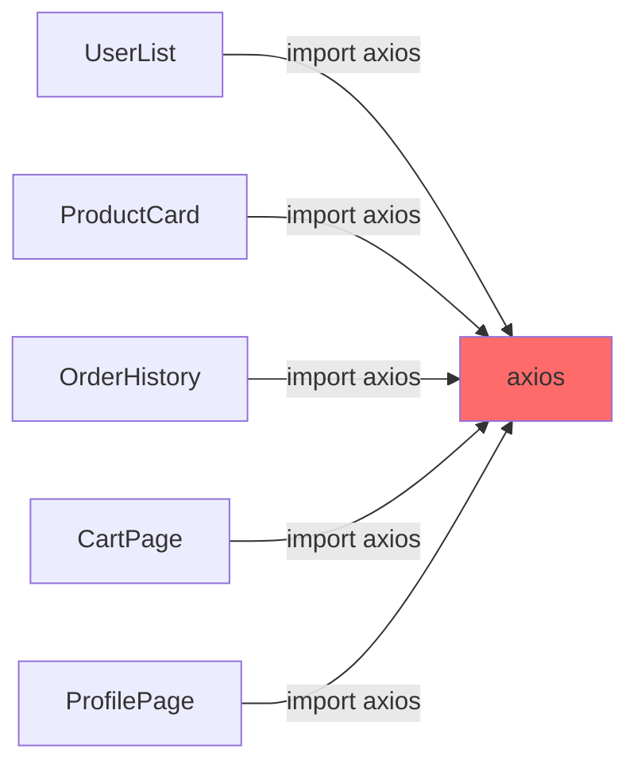
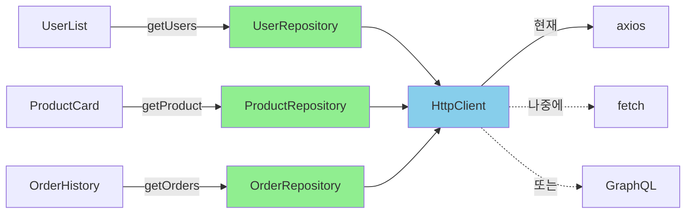

# Repository 패턴 (Frontend): API 호출의 추상화

<Callout type="info" title="핵심 요약">
  **Repository 패턴**은 데이터 접근 로직을 캡슐화하여 비즈니스 로직과 데이터 소스 사이에 추상화 계층을 두는 패턴입니다.
  프론트엔드에서는 API 호출을 추상화하여 컴포넌트가 HTTP 라이브러리(axios, fetch 등)에 직접 의존하지 않도록 합니다.
</Callout>

어느 날 팀장님이 말합니다.

> "axios 보안 취약점이 발견됐대. fetch로 전환하자."

그리고 여러분은 100개가 넘는 컴포넌트 파일을 뒤지기 시작합니다.

```tsx
// UserList.tsx
import axios from 'axios';

const users = await axios.get('/api/users');

// ProductCard.tsx
import axios from 'axios';

const product = await axios.get(`/api/products/${id}`);

// OrderHistory.tsx
import axios from 'axios';

const orders = await axios.get('/api/orders', {
  headers: { Authorization: `Bearer ${token}` }
});

// ... 그리고 97개의 파일이 더 있습니다
```

한 파일씩 열어서 `axios`를 `fetch`로 바꾸고, 응답 처리 방식을 수정하고, 에러 핸들링을 고치고... 일주일이 지나도 끝이 보이지 않습니다. 그리고 세 달 뒤, 또 다른 소식이 들려옵니다.

> "GraphQL 도입하기로 했어. REST API 점진적으로 교체해야 해."

Repository 패턴은 이런 악몽에서 해방시켜줍니다.

## 1. 문제의 핵심: 직접 의존

컴포넌트가 HTTP 라이브러리에 **직접 의존**하면 무슨 일이 벌어질까요?

<div className="my-6">

</div>

**변경의 파급 효과가 치명적입니다:**

1. **라이브러리 교체**: axios → fetch 전환 시 모든 파일 수정
2. **API 버전 변경**: `/api/v1/` → `/api/v2/` 전환 시 수십 개 파일 수정
3. **인증 로직 변경**: 토큰 갱신 방식 변경 시 모든 API 호출 위치 수정
4. **에러 처리 표준화**: 공통 에러 핸들링 추가 시 전체 코드베이스 순회
5. **테스트 작성**: 컴포넌트 테스트마다 HTTP 요청 모킹 필요

### 실제 코드의 냄새

한 컴포넌트에서 API 호출이 어떻게 퍼져나가는지 봅시다.

```tsx
// components/UserManagement.tsx - 악취가 나는 코드
import axios from 'axios';
import { useAuth } from '@/hooks/useAuth';

export function UserManagement() {
  const { token, refreshToken } = useAuth();
  const [users, setUsers] = useState<User[]>([]);
  const [loading, setLoading] = useState(true);
  const [error, setError] = useState<string | null>(null);

  const fetchUsers = async () => {
    try {
      setLoading(true);
      const response = await axios.get('/api/v1/users', {
        headers: { Authorization: `Bearer ${token}` }
      });
      setUsers(response.data);
    } catch (err) {
      if (axios.isAxiosError(err)) {
        if (err.response?.status === 401) {
          // 토큰 만료 - 갱신 시도
          try {
            await refreshToken();
            // 재시도... (또 axios 호출)
            const retryResponse = await axios.get('/api/v1/users', {
              headers: { Authorization: `Bearer ${token}` }
            });
            setUsers(retryResponse.data);
          } catch (refreshErr) {
            setError('세션이 만료되었습니다. 다시 로그인해주세요.');
          }
        } else if (err.response?.status === 500) {
          setError('서버 오류가 발생했습니다.');
        } else {
          setError('알 수 없는 오류가 발생했습니다.');
        }
      }
    } finally {
      setLoading(false);
    }
  };

  const deleteUser = async (userId: string) => {
    try {
      await axios.delete(`/api/v1/users/${userId}`, {
        headers: { Authorization: `Bearer ${token}` }
      });
      // 동일한 에러 처리 로직 반복...
    } catch (err) {
      // 또 똑같은 에러 처리...
    }
  };

  const updateUser = async (userId: string, data: Partial<User>) => {
    try {
      await axios.patch(`/api/v1/users/${userId}`, data, {
        headers: { Authorization: `Bearer ${token}` }
      });
      // 또또 똑같은 에러 처리...
    } catch (err) {
      // 언제까지 복붙할 건가요...
    }
  };

  // ... 렌더링 로직
}
```

이 코드의 문제점:

- **axios에 직접 의존**: 라이브러리 교체 시 이 파일도 수정 필요
- **인증 로직 중복**: 모든 API 호출마다 헤더 설정 반복
- **에러 처리 중복**: 401, 500 처리가 함수마다 복붙
- **API 버전 하드코딩**: `/api/v1/`이 곳곳에 박혀있음
- **테스트 어려움**: axios를 직접 모킹해야 함

## 2. Repository 패턴의 구조

Repository 패턴을 적용하면 **추상화 계층**이 생깁니다.

<div className="my-6">

</div>

**핵심 구성요소:**

<div className="grid grid-cols-1 md:grid-cols-3 gap-4 my-6">
  <Card title="Repository" icon={<Icon name="Database" className="text-green-500" />}>
    도메인별 데이터 접근 로직을 캡슐화합니다. `UserRepository`, `ProductRepository` 등

    컴포넌트는 이것만 알면 됩니다.
  </Card>
  <Card title="HttpClient" icon={<Icon name="Globe" className="text-blue-500" />}>
    HTTP 요청의 공통 로직을 담당합니다. 인증, 에러 처리, 인터셉터 등

    실제 라이브러리를 감싸는 래퍼입니다.
  </Card>
  <Card title="Interface" icon={<Icon name="FileCode" className="text-purple-500" />}>
    Repository와 HttpClient의 계약을 정의합니다.

    구현체 교체 시 이 인터페이스만 맞추면 됩니다.
  </Card>
</div>

## 3. 단계별 구현

### Step 1: HttpClient 추상화

먼저 HTTP 요청을 추상화하는 클라이언트를 만듭니다.

```typescript
// lib/http/types.ts
export interface HttpRequestConfig {
  headers?: Record<string, string>;
  params?: Record<string, string | number>;
  timeout?: number;
}

export interface HttpResponse<T> {
  data: T;
  status: number;
  headers: Record<string, string>;
}

export interface IHttpClient {
  get<T>(url: string, config?: HttpRequestConfig): Promise<HttpResponse<T>>;
  post<T>(url: string, data?: unknown, config?: HttpRequestConfig): Promise<HttpResponse<T>>;
  put<T>(url: string, data?: unknown, config?: HttpRequestConfig): Promise<HttpResponse<T>>;
  patch<T>(url: string, data?: unknown, config?: HttpRequestConfig): Promise<HttpResponse<T>>;
  delete<T>(url: string, config?: HttpRequestConfig): Promise<HttpResponse<T>>;
}
```

```typescript
// lib/http/axios-client.ts
import axios, { AxiosInstance, AxiosError } from 'axios';
import type { IHttpClient, HttpRequestConfig, HttpResponse } from './types';

export class AxiosHttpClient implements IHttpClient {
  private client: AxiosInstance;

  constructor(baseURL: string) {
    this.client = axios.create({
      baseURL,
      timeout: 10000,
    });

    this.setupInterceptors();
  }

  private setupInterceptors() {
    // 요청 인터셉터: 인증 토큰 자동 추가
    this.client.interceptors.request.use((config) => {
      const token = this.getToken();
      if (token) {
        config.headers.Authorization = `Bearer ${token}`;
      }
      return config;
    });

    // 응답 인터셉터: 공통 에러 처리
    this.client.interceptors.response.use(
      (response) => response,
      async (error: AxiosError) => {
        if (error.response?.status === 401) {
          // 토큰 갱신 로직
          const refreshed = await this.tryRefreshToken();
          if (refreshed && error.config) {
            // 원래 요청 재시도
            return this.client.request(error.config);
          }
          // 갱신 실패 - 로그아웃 처리
          this.handleAuthFailure();
        }
        throw this.normalizeError(error);
      }
    );
  }

  private getToken(): string | null {
    if (typeof window === 'undefined') return null;
    return localStorage.getItem('accessToken');
  }

  private async tryRefreshToken(): Promise<boolean> {
    try {
      const refreshToken = localStorage.getItem('refreshToken');
      if (!refreshToken) return false;

      const response = await axios.post('/api/auth/refresh', { refreshToken });
      localStorage.setItem('accessToken', response.data.accessToken);
      return true;
    } catch {
      return false;
    }
  }

  private handleAuthFailure() {
    localStorage.removeItem('accessToken');
    localStorage.removeItem('refreshToken');
    window.location.href = '/login';
  }

  private normalizeError(error: AxiosError): Error {
    if (error.response) {
      const message = (error.response.data as any)?.message || '요청 처리에 실패했습니다.';
      return new Error(message);
    }
    if (error.request) {
      return new Error('서버에 연결할 수 없습니다.');
    }
    return new Error('요청을 보내는 중 오류가 발생했습니다.');
  }

  async get<T>(url: string, config?: HttpRequestConfig): Promise<HttpResponse<T>> {
    const response = await this.client.get<T>(url, config);
    return {
      data: response.data,
      status: response.status,
      headers: response.headers as Record<string, string>,
    };
  }

  async post<T>(url: string, data?: unknown, config?: HttpRequestConfig): Promise<HttpResponse<T>> {
    const response = await this.client.post<T>(url, data, config);
    return {
      data: response.data,
      status: response.status,
      headers: response.headers as Record<string, string>,
    };
  }

  async put<T>(url: string, data?: unknown, config?: HttpRequestConfig): Promise<HttpResponse<T>> {
    const response = await this.client.put<T>(url, data, config);
    return {
      data: response.data,
      status: response.status,
      headers: response.headers as Record<string, string>,
    };
  }

  async patch<T>(url: string, data?: unknown, config?: HttpRequestConfig): Promise<HttpResponse<T>> {
    const response = await this.client.patch<T>(url, data, config);
    return {
      data: response.data,
      status: response.status,
      headers: response.headers as Record<string, string>,
    };
  }

  async delete<T>(url: string, config?: HttpRequestConfig): Promise<HttpResponse<T>> {
    const response = await this.client.delete<T>(url, config);
    return {
      data: response.data,
      status: response.status,
      headers: response.headers as Record<string, string>,
    };
  }
}
```

<Callout type="success" title="인터셉터의 힘">
  인증 토큰 추가, 토큰 갱신, 에러 정규화 등 **모든 API 호출에 공통으로 적용되어야 하는 로직**이 한 곳에 모였습니다.
  더 이상 각 컴포넌트에서 이 로직을 반복할 필요가 없습니다.
</Callout>

### Step 2: Repository 인터페이스 정의

도메인별로 Repository 인터페이스를 정의합니다.

```typescript
// repositories/user/types.ts
export interface User {
  id: string;
  name: string;
  email: string;
  role: 'admin' | 'user' | 'guest';
  avatar?: string;
  createdAt: string;
}

export interface CreateUserDto {
  name: string;
  email: string;
  password: string;
  role?: 'admin' | 'user' | 'guest';
}

export interface UpdateUserDto {
  name?: string;
  email?: string;
  role?: 'admin' | 'user' | 'guest';
}

export interface UserFilter {
  role?: 'admin' | 'user' | 'guest';
  search?: string;
  page?: number;
  limit?: number;
}

export interface PaginatedResponse<T> {
  data: T[];
  total: number;
  page: number;
  totalPages: number;
}

export interface IUserRepository {
  getUsers(filter?: UserFilter): Promise<PaginatedResponse<User>>;
  getUserById(id: string): Promise<User>;
  createUser(data: CreateUserDto): Promise<User>;
  updateUser(id: string, data: UpdateUserDto): Promise<User>;
  deleteUser(id: string): Promise<void>;
}
```

### Step 3: Repository 구현

```typescript
// repositories/user/user.repository.ts
import type { IHttpClient } from '@/lib/http/types';
import type {
  IUserRepository,
  User,
  CreateUserDto,
  UpdateUserDto,
  UserFilter,
  PaginatedResponse
} from './types';

export class UserRepository implements IUserRepository {
  constructor(private httpClient: IHttpClient) {}

  async getUsers(filter?: UserFilter): Promise<PaginatedResponse<User>> {
    const params: Record<string, string | number> = {};

    if (filter?.role) params.role = filter.role;
    if (filter?.search) params.search = filter.search;
    if (filter?.page) params.page = filter.page;
    if (filter?.limit) params.limit = filter.limit;

    const response = await this.httpClient.get<PaginatedResponse<User>>(
      '/users',
      { params }
    );
    return response.data;
  }

  async getUserById(id: string): Promise<User> {
    const response = await this.httpClient.get<User>(`/users/${id}`);
    return response.data;
  }

  async createUser(data: CreateUserDto): Promise<User> {
    const response = await this.httpClient.post<User>('/users', data);
    return response.data;
  }

  async updateUser(id: string, data: UpdateUserDto): Promise<User> {
    const response = await this.httpClient.patch<User>(`/users/${id}`, data);
    return response.data;
  }

  async deleteUser(id: string): Promise<void> {
    await this.httpClient.delete(`/users/${id}`);
  }
}
```

### Step 4: Repository 팩토리

Repository 인스턴스를 생성하고 관리하는 팩토리를 만듭니다.

```typescript
// repositories/index.ts
import { AxiosHttpClient } from '@/lib/http/axios-client';
import { UserRepository } from './user/user.repository';
import { ProductRepository } from './product/product.repository';
import { OrderRepository } from './order/order.repository';

// HttpClient 싱글톤
const httpClient = new AxiosHttpClient(
  process.env.NEXT_PUBLIC_API_URL || '/api/v1'
);

// Repository 싱글톤
export const userRepository = new UserRepository(httpClient);
export const productRepository = new ProductRepository(httpClient);
export const orderRepository = new OrderRepository(httpClient);

// 타입 export
export type { IUserRepository, User, CreateUserDto, UpdateUserDto } from './user/types';
export type { IProductRepository, Product } from './product/types';
export type { IOrderRepository, Order } from './order/types';
```

### Step 5: 컴포넌트에서 사용

이제 컴포넌트는 깔끔해집니다.

```tsx
// components/UserManagement.tsx - 리팩토링 후
import { userRepository } from '@/repositories';
import type { User, UserFilter } from '@/repositories';

export function UserManagement() {
  const [users, setUsers] = useState<User[]>([]);
  const [loading, setLoading] = useState(true);
  const [error, setError] = useState<string | null>(null);
  const [filter, setFilter] = useState<UserFilter>({ page: 1, limit: 10 });

  const fetchUsers = async () => {
    try {
      setLoading(true);
      setError(null);
      const result = await userRepository.getUsers(filter);
      setUsers(result.data);
    } catch (err) {
      setError(err instanceof Error ? err.message : '오류가 발생했습니다.');
    } finally {
      setLoading(false);
    }
  };

  const handleDelete = async (userId: string) => {
    try {
      await userRepository.deleteUser(userId);
      setUsers(users.filter(u => u.id !== userId));
    } catch (err) {
      setError(err instanceof Error ? err.message : '삭제에 실패했습니다.');
    }
  };

  const handleUpdate = async (userId: string, data: Partial<User>) => {
    try {
      const updated = await userRepository.updateUser(userId, data);
      setUsers(users.map(u => u.id === userId ? updated : u));
    } catch (err) {
      setError(err instanceof Error ? err.message : '수정에 실패했습니다.');
    }
  };

  useEffect(() => {
    fetchUsers();
  }, [filter]);

  // ... 렌더링 로직
}
```

<Callout type="success" title="변화된 점">
  - **axios 직접 의존 제거**: `import axios` 사라짐
  - **인증 로직 제거**: HttpClient 인터셉터가 처리
  - **에러 처리 단순화**: 정규화된 에러만 처리하면 됨
  - **API 버전 하드코딩 제거**: Repository가 알아서 처리
  - **테스트 용이**: Repository만 모킹하면 됨
</Callout>

## 4. React Query와 통합

실제 프로젝트에서는 React Query(TanStack Query)와 함께 사용하는 경우가 많습니다.

### Custom Hook으로 래핑

```typescript
// hooks/useUsers.ts
import { useQuery, useMutation, useQueryClient } from '@tanstack/react-query';
import { userRepository } from '@/repositories';
import type { UserFilter, CreateUserDto, UpdateUserDto } from '@/repositories';

// 쿼리 키 상수
const QUERY_KEYS = {
  users: ['users'] as const,
  user: (id: string) => ['users', id] as const,
};

// 목록 조회
export function useUsers(filter?: UserFilter) {
  return useQuery({
    queryKey: [...QUERY_KEYS.users, filter],
    queryFn: () => userRepository.getUsers(filter),
  });
}

// 단건 조회
export function useUser(id: string) {
  return useQuery({
    queryKey: QUERY_KEYS.user(id),
    queryFn: () => userRepository.getUserById(id),
    enabled: !!id,
  });
}

// 생성
export function useCreateUser() {
  const queryClient = useQueryClient();

  return useMutation({
    mutationFn: (data: CreateUserDto) => userRepository.createUser(data),
    onSuccess: () => {
      queryClient.invalidateQueries({ queryKey: QUERY_KEYS.users });
    },
  });
}

// 수정
export function useUpdateUser() {
  const queryClient = useQueryClient();

  return useMutation({
    mutationFn: ({ id, data }: { id: string; data: UpdateUserDto }) =>
      userRepository.updateUser(id, data),
    onSuccess: (_, { id }) => {
      queryClient.invalidateQueries({ queryKey: QUERY_KEYS.users });
      queryClient.invalidateQueries({ queryKey: QUERY_KEYS.user(id) });
    },
  });
}

// 삭제
export function useDeleteUser() {
  const queryClient = useQueryClient();

  return useMutation({
    mutationFn: (id: string) => userRepository.deleteUser(id),
    onSuccess: () => {
      queryClient.invalidateQueries({ queryKey: QUERY_KEYS.users });
    },
  });
}
```

### 컴포넌트에서 사용

```tsx
// components/UserManagement.tsx - React Query 버전
import { useUsers, useDeleteUser, useUpdateUser } from '@/hooks/useUsers';
import type { UserFilter } from '@/repositories';

export function UserManagement() {
  const [filter, setFilter] = useState<UserFilter>({ page: 1, limit: 10 });

  const { data, isLoading, error } = useUsers(filter);
  const deleteUser = useDeleteUser();
  const updateUser = useUpdateUser();

  const handleDelete = async (userId: string) => {
    if (!confirm('정말 삭제하시겠습니까?')) return;

    try {
      await deleteUser.mutateAsync(userId);
    } catch (err) {
      alert(err instanceof Error ? err.message : '삭제에 실패했습니다.');
    }
  };

  const handleRoleChange = async (userId: string, role: 'admin' | 'user' | 'guest') => {
    try {
      await updateUser.mutateAsync({ id: userId, data: { role } });
    } catch (err) {
      alert(err instanceof Error ? err.message : '수정에 실패했습니다.');
    }
  };

  if (isLoading) return <LoadingSkeleton />;
  if (error) return <ErrorMessage message={error.message} />;

  return (
    <div>
      <UserFilter value={filter} onChange={setFilter} />
      <UserTable
        users={data?.data || []}
        onDelete={handleDelete}
        onRoleChange={handleRoleChange}
        isDeleting={deleteUser.isPending}
        isUpdating={updateUser.isPending}
      />
      <Pagination
        page={data?.page || 1}
        totalPages={data?.totalPages || 1}
        onPageChange={(page) => setFilter({ ...filter, page })}
      />
    </div>
  );
}
```

<Callout type="info" title="React Query의 이점">
  - **캐싱**: 같은 데이터 재요청 시 캐시에서 반환
  - **자동 리페칭**: 포커스 복귀, 네트워크 재연결 시 자동 갱신
  - **낙관적 업데이트**: UI 먼저 업데이트하고 서버 동기화
  - **에러 재시도**: 실패 시 자동 재시도

  Repository 패턴과 조합하면 **데이터 접근 추상화**와 **캐싱/동기화** 모두를 얻습니다.
</Callout>

## 5. 테스트가 쉬워집니다

Repository 패턴의 큰 장점 중 하나는 **테스트 용이성**입니다.

### Mock Repository 생성

```typescript
// __mocks__/repositories/user.repository.mock.ts
import type { IUserRepository, User, PaginatedResponse } from '@/repositories';

export const mockUsers: User[] = [
  { id: '1', name: '홍길동', email: 'hong@example.com', role: 'admin', createdAt: '2024-01-01' },
  { id: '2', name: '김철수', email: 'kim@example.com', role: 'user', createdAt: '2024-01-02' },
  { id: '3', name: '이영희', email: 'lee@example.com', role: 'guest', createdAt: '2024-01-03' },
];

export const createMockUserRepository = (): IUserRepository => ({
  getUsers: jest.fn().mockResolvedValue({
    data: mockUsers,
    total: mockUsers.length,
    page: 1,
    totalPages: 1,
  } as PaginatedResponse<User>),

  getUserById: jest.fn().mockImplementation((id: string) =>
    Promise.resolve(mockUsers.find(u => u.id === id))
  ),

  createUser: jest.fn().mockImplementation((data) =>
    Promise.resolve({ id: '4', ...data, createdAt: new Date().toISOString() })
  ),

  updateUser: jest.fn().mockImplementation((id, data) => {
    const user = mockUsers.find(u => u.id === id);
    return Promise.resolve({ ...user, ...data });
  }),

  deleteUser: jest.fn().mockResolvedValue(undefined),
});
```

### 컴포넌트 테스트

```typescript
// __tests__/UserManagement.test.tsx
import { render, screen, fireEvent, waitFor } from '@testing-library/react';
import { QueryClient, QueryClientProvider } from '@tanstack/react-query';
import { UserManagement } from '@/components/UserManagement';
import { createMockUserRepository, mockUsers } from '@/__mocks__/repositories/user.repository.mock';

// Repository 모킹
jest.mock('@/repositories', () => ({
  userRepository: createMockUserRepository(),
}));

describe('UserManagement', () => {
  const queryClient = new QueryClient({
    defaultOptions: {
      queries: { retry: false },
    },
  });

  const renderWithProvider = (ui: React.ReactElement) => {
    return render(
      <QueryClientProvider client={queryClient}>
        {ui}
      </QueryClientProvider>
    );
  };

  beforeEach(() => {
    queryClient.clear();
  });

  it('사용자 목록을 표시한다', async () => {
    renderWithProvider(<UserManagement />);

    await waitFor(() => {
      expect(screen.getByText('홍길동')).toBeInTheDocument();
      expect(screen.getByText('김철수')).toBeInTheDocument();
      expect(screen.getByText('이영희')).toBeInTheDocument();
    });
  });

  it('삭제 버튼 클릭 시 확인 다이얼로그를 표시한다', async () => {
    const confirmSpy = jest.spyOn(window, 'confirm').mockReturnValue(false);
    renderWithProvider(<UserManagement />);

    await waitFor(() => {
      expect(screen.getByText('홍길동')).toBeInTheDocument();
    });

    const deleteButtons = screen.getAllByRole('button', { name: /삭제/i });
    fireEvent.click(deleteButtons[0]);

    expect(confirmSpy).toHaveBeenCalledWith('정말 삭제하시겠습니까?');
    confirmSpy.mockRestore();
  });

  it('역할 변경 시 updateUser가 호출된다', async () => {
    const { userRepository } = require('@/repositories');
    renderWithProvider(<UserManagement />);

    await waitFor(() => {
      expect(screen.getByText('홍길동')).toBeInTheDocument();
    });

    const roleSelect = screen.getAllByRole('combobox')[0];
    fireEvent.change(roleSelect, { target: { value: 'user' } });

    await waitFor(() => {
      expect(userRepository.updateUser).toHaveBeenCalledWith('1', { role: 'user' });
    });
  });
});
```

<Callout type="success" title="테스트의 이점">
  - **HTTP 모킹 불필요**: axios나 fetch를 직접 모킹할 필요 없음
  - **빠른 테스트**: 실제 네트워크 요청 없이 순수 로직 테스트
  - **시나리오 테스트**: 다양한 응답 상황(에러, 빈 데이터 등)을 쉽게 시뮬레이션
  - **격리된 테스트**: 각 테스트가 독립적으로 실행
</Callout>

## 6. HTTP 클라이언트 교체하기

이제 axios에서 fetch로 교체해봅시다. **HttpClient 구현체만 바꾸면 됩니다.**

```typescript
// lib/http/fetch-client.ts
import type { IHttpClient, HttpRequestConfig, HttpResponse } from './types';

export class FetchHttpClient implements IHttpClient {
  constructor(private baseURL: string) {}

  private getToken(): string | null {
    if (typeof window === 'undefined') return null;
    return localStorage.getItem('accessToken');
  }

  private async request<T>(
    method: string,
    url: string,
    data?: unknown,
    config?: HttpRequestConfig
  ): Promise<HttpResponse<T>> {
    const token = this.getToken();

    const headers: Record<string, string> = {
      'Content-Type': 'application/json',
      ...config?.headers,
    };

    if (token) {
      headers['Authorization'] = `Bearer ${token}`;
    }

    // URL 파라미터 처리
    let fullUrl = `${this.baseURL}${url}`;
    if (config?.params) {
      const searchParams = new URLSearchParams();
      Object.entries(config.params).forEach(([key, value]) => {
        searchParams.append(key, String(value));
      });
      fullUrl += `?${searchParams.toString()}`;
    }

    const response = await fetch(fullUrl, {
      method,
      headers,
      body: data ? JSON.stringify(data) : undefined,
      signal: config?.timeout
        ? AbortSignal.timeout(config.timeout)
        : undefined,
    });

    // 401 처리
    if (response.status === 401) {
      const refreshed = await this.tryRefreshToken();
      if (refreshed) {
        // 재시도
        return this.request(method, url, data, config);
      }
      this.handleAuthFailure();
    }

    if (!response.ok) {
      const errorData = await response.json().catch(() => ({}));
      throw new Error(errorData.message || `HTTP ${response.status}`);
    }

    const responseData = await response.json();

    return {
      data: responseData,
      status: response.status,
      headers: Object.fromEntries(response.headers.entries()),
    };
  }

  private async tryRefreshToken(): Promise<boolean> {
    // 토큰 갱신 로직...
    return false;
  }

  private handleAuthFailure() {
    localStorage.removeItem('accessToken');
    localStorage.removeItem('refreshToken');
    window.location.href = '/login';
  }

  get<T>(url: string, config?: HttpRequestConfig) {
    return this.request<T>('GET', url, undefined, config);
  }

  post<T>(url: string, data?: unknown, config?: HttpRequestConfig) {
    return this.request<T>('POST', url, data, config);
  }

  put<T>(url: string, data?: unknown, config?: HttpRequestConfig) {
    return this.request<T>('PUT', url, data, config);
  }

  patch<T>(url: string, data?: unknown, config?: HttpRequestConfig) {
    return this.request<T>('PATCH', url, data, config);
  }

  delete<T>(url: string, config?: HttpRequestConfig) {
    return this.request<T>('DELETE', url, undefined, config);
  }
}
```

### 클라이언트 교체

```typescript
// repositories/index.ts - 변경된 부분
import { FetchHttpClient } from '@/lib/http/fetch-client';
// import { AxiosHttpClient } from '@/lib/http/axios-client'; // 주석 처리

const httpClient = new FetchHttpClient(
  process.env.NEXT_PUBLIC_API_URL || '/api/v1'
);

// 나머지는 그대로!
export const userRepository = new UserRepository(httpClient);
export const productRepository = new ProductRepository(httpClient);
export const orderRepository = new OrderRepository(httpClient);
```

<Callout type="success" title="변경 범위">
  **단 한 줄**만 바꾸면 전체 애플리케이션의 HTTP 클라이언트가 교체됩니다.

  100개의 컴포넌트를 수정할 필요도, 테스트를 다시 작성할 필요도 없습니다.
</Callout>

## 7. GraphQL로 전환하기

REST API에서 GraphQL로 전환하는 경우도 마찬가지입니다.

```typescript
// lib/http/graphql-client.ts
import { GraphQLClient } from 'graphql-request';
import type { IHttpClient, HttpRequestConfig, HttpResponse } from './types';

export class GraphQLHttpClient implements IHttpClient {
  private client: GraphQLClient;

  constructor(endpoint: string) {
    this.client = new GraphQLClient(endpoint);
    this.setupAuth();
  }

  private setupAuth() {
    const token = localStorage.getItem('accessToken');
    if (token) {
      this.client.setHeader('Authorization', `Bearer ${token}`);
    }
  }

  // GraphQL에서는 모든 요청이 POST
  async get<T>(url: string, config?: HttpRequestConfig): Promise<HttpResponse<T>> {
    // URL에서 리소스 타입 추출 (예: /users -> users)
    const resource = url.split('/').filter(Boolean)[0];
    const id = url.split('/')[2]; // /users/123 -> 123

    const query = id
      ? this.getDetailQuery(resource, id)
      : this.getListQuery(resource, config?.params);

    const data = await this.client.request<T>(query);

    return { data, status: 200, headers: {} };
  }

  async post<T>(url: string, data?: unknown): Promise<HttpResponse<T>> {
    const resource = url.split('/').filter(Boolean)[0];
    const mutation = this.getCreateMutation(resource, data);

    const result = await this.client.request<T>(mutation);
    return { data: result, status: 201, headers: {} };
  }

  // ... 나머지 메서드들

  private getListQuery(resource: string, params?: Record<string, string | number>) {
    // 리소스별 쿼리 매핑
    const queries: Record<string, string> = {
      users: `
        query GetUsers($filter: UserFilter) {
          users(filter: $filter) {
            data { id name email role createdAt }
            total page totalPages
          }
        }
      `,
      products: `
        query GetProducts($filter: ProductFilter) {
          products(filter: $filter) {
            data { id name price stock }
            total page totalPages
          }
        }
      `,
    };

    return queries[resource] || '';
  }

  // ... 나머지 쿼리/뮤테이션 빌더
}
```

물론 GraphQL은 REST와 패러다임이 다르므로, Repository 인터페이스 자체를 GraphQL에 맞게 설계하는 것이 더 나을 수 있습니다. 하지만 **점진적 전환**이 필요한 경우, 이런 어댑터 방식이 유용합니다.

## 8. Next.js Server Actions와 통합

Next.js 15의 Server Actions와도 Repository 패턴을 활용할 수 있습니다.

```typescript
// app/actions/users.ts
'use server';

import { revalidatePath } from 'next/cache';
import { userRepository } from '@/repositories/server';
import type { CreateUserDto, UpdateUserDto, UserFilter } from '@/repositories';

export async function getUsers(filter?: UserFilter) {
  return userRepository.getUsers(filter);
}

export async function getUserById(id: string) {
  return userRepository.getUserById(id);
}

export async function createUser(data: CreateUserDto) {
  const user = await userRepository.createUser(data);
  revalidatePath('/users');
  return user;
}

export async function updateUser(id: string, data: UpdateUserDto) {
  const user = await userRepository.updateUser(id, data);
  revalidatePath('/users');
  revalidatePath(`/users/${id}`);
  return user;
}

export async function deleteUser(id: string) {
  await userRepository.deleteUser(id);
  revalidatePath('/users');
}
```

```typescript
// repositories/server/index.ts
// 서버 전용 Repository (DB 직접 접근)
import { prisma } from '@/lib/prisma';
import type { IUserRepository, User, CreateUserDto, UpdateUserDto, UserFilter, PaginatedResponse } from '../user/types';

class ServerUserRepository implements IUserRepository {
  async getUsers(filter?: UserFilter): Promise<PaginatedResponse<User>> {
    const page = filter?.page || 1;
    const limit = filter?.limit || 10;
    const skip = (page - 1) * limit;

    const where = {
      ...(filter?.role && { role: filter.role }),
      ...(filter?.search && {
        OR: [
          { name: { contains: filter.search, mode: 'insensitive' } },
          { email: { contains: filter.search, mode: 'insensitive' } },
        ],
      }),
    };

    const [users, total] = await Promise.all([
      prisma.user.findMany({ where, skip, take: limit }),
      prisma.user.count({ where }),
    ]);

    return {
      data: users,
      total,
      page,
      totalPages: Math.ceil(total / limit),
    };
  }

  async getUserById(id: string): Promise<User> {
    const user = await prisma.user.findUnique({ where: { id } });
    if (!user) throw new Error('사용자를 찾을 수 없습니다.');
    return user;
  }

  async createUser(data: CreateUserDto): Promise<User> {
    return prisma.user.create({ data });
  }

  async updateUser(id: string, data: UpdateUserDto): Promise<User> {
    return prisma.user.update({ where: { id }, data });
  }

  async deleteUser(id: string): Promise<void> {
    await prisma.user.delete({ where: { id } });
  }
}

export const userRepository = new ServerUserRepository();
```

<Callout type="info" title="서버/클라이언트 Repository 분리">
  - **클라이언트 Repository**: HTTP 요청으로 API 호출
  - **서버 Repository**: DB 직접 접근 (Prisma 등)

  같은 인터페이스(`IUserRepository`)를 구현하므로 타입 안전성은 유지됩니다.
</Callout>

## 9. API 버전 관리

API 버전이 변경될 때도 Repository 패턴이 빛을 발합니다.

```typescript
// lib/http/versioned-client.ts
export class VersionedHttpClient implements IHttpClient {
  constructor(
    private baseURL: string,
    private version: 'v1' | 'v2' = 'v1'
  ) {}

  private getVersionedUrl(url: string): string {
    // v2에서 변경된 엔드포인트 매핑
    const v2Mappings: Record<string, string> = {
      '/users': '/members',           // users -> members로 변경됨
      '/orders': '/purchases',        // orders -> purchases로 변경됨
    };

    if (this.version === 'v2') {
      for (const [oldPath, newPath] of Object.entries(v2Mappings)) {
        if (url.startsWith(oldPath)) {
          return url.replace(oldPath, newPath);
        }
      }
    }

    return url;
  }

  async get<T>(url: string, config?: HttpRequestConfig): Promise<HttpResponse<T>> {
    const versionedUrl = this.getVersionedUrl(url);
    const fullUrl = `${this.baseURL}/${this.version}${versionedUrl}`;
    // ... 요청 로직
  }

  // ... 나머지 메서드
}
```

```typescript
// repositories/index.ts
const API_VERSION = process.env.NEXT_PUBLIC_API_VERSION as 'v1' | 'v2' || 'v1';

const httpClient = new VersionedHttpClient(
  process.env.NEXT_PUBLIC_API_URL || '/api',
  API_VERSION
);
```

환경 변수 하나로 전체 앱의 API 버전을 전환할 수 있습니다.

## 10. 정리: Repository 패턴의 장단점

<Tabs defaultValue="pros">
  <TabsList>
    <TabsTrigger value="pros">장점</TabsTrigger>
    <TabsTrigger value="cons">단점</TabsTrigger>
    <TabsTrigger value="when">언제 사용?</TabsTrigger>
  </TabsList>

  <TabsContent value="pros">
    ### 장점

    <div className="grid grid-cols-1 md:grid-cols-2 gap-4">
      <Card title="의존성 역전" icon={<Icon name="GitBranch" className="text-blue-500" />}>
        컴포넌트가 구체적인 HTTP 라이브러리가 아닌 **추상화된 인터페이스**에 의존합니다.
      </Card>
      <Card title="변경 용이성" icon={<Icon name="RefreshCw" className="text-green-500" />}>
        라이브러리 교체, API 버전 변경 시 **영향 범위가 최소화**됩니다.
      </Card>
      <Card title="테스트 용이성" icon={<Icon name="TestTube" className="text-purple-500" />}>
        Repository만 모킹하면 되므로 **단위 테스트 작성이 쉽습니다**.
      </Card>
      <Card title="관심사 분리" icon={<Icon name="Layers" className="text-orange-500" />}>
        데이터 접근 로직이 컴포넌트에서 분리되어 **코드가 깔끔**해집니다.
      </Card>
    </div>
  </TabsContent>

  <TabsContent value="cons">
    ### 단점

    <div className="space-y-4">
      <Callout type="warning" title="초기 설정 비용">
        인터페이스 정의, HttpClient 구현, Repository 클래스 작성 등 **초기 boilerplate가 많습니다**.

        작은 프로젝트에서는 과도한 추상화일 수 있습니다.
      </Callout>

      <Callout type="warning" title="학습 곡선">
        팀원들이 패턴을 이해하고 일관되게 사용해야 합니다.

        "그냥 axios 쓰면 되는데 왜 이렇게 복잡하게?"라는 반발이 있을 수 있습니다.
      </Callout>

      <Callout type="warning" title="간접 계층 추가">
        요청 흐름이 복잡해지면 디버깅이 어려워질 수 있습니다.

        Component → Hook → Repository → HttpClient → axios
      </Callout>
    </div>
  </TabsContent>

  <TabsContent value="when">
    ### 언제 사용해야 할까?

    **Repository 패턴이 적합한 경우:**

    - API 호출이 **10개 이상**인 프로젝트
    - **여러 명의 개발자**가 협업하는 프로젝트
    - **장기간 유지보수**가 예상되는 프로젝트
    - HTTP 클라이언트 **교체 가능성**이 있는 경우
    - **테스트 커버리지**가 중요한 프로젝트
    - **API 버전 관리**가 필요한 경우

    **Repository 패턴이 과한 경우:**

    - 소규모 프로젝트 (API 5개 이하)
    - 프로토타입이나 MVP
    - 단기 프로젝트 (3개월 이하)
    - 혼자 개발하는 사이드 프로젝트
  </TabsContent>
</Tabs>

## 11. 체크리스트

Repository 패턴을 도입할 때 참고하세요.

<Steps>
  <Step title="인터페이스 정의">
    `IHttpClient`와 `I[Domain]Repository` 인터페이스를 먼저 정의합니다.

    구현체보다 계약(Contract)이 먼저입니다.
  </Step>

  <Step title="HttpClient 구현">
    인증, 에러 처리, 인터셉터 등 공통 로직을 HttpClient에 집중시킵니다.

    이 단계에서 보안 관련 로직도 함께 구현합니다.
  </Step>

  <Step title="Repository 구현">
    도메인별로 Repository를 구현합니다. User, Product, Order 등

    각 Repository는 해당 도메인의 CRUD만 담당합니다.
  </Step>

  <Step title="팩토리/DI 설정">
    Repository 인스턴스를 생성하고 export하는 진입점을 만듭니다.

    나중에 DI 컨테이너로 교체할 수 있습니다.
  </Step>

  <Step title="Custom Hook 래핑 (선택)">
    React Query와 통합하여 캐싱, 낙관적 업데이트 등을 추가합니다.

    이 단계는 선택사항이지만 권장됩니다.
  </Step>

  <Step title="Mock Repository 작성">
    테스트용 Mock Repository를 작성합니다.

    이것만 있으면 컴포넌트 테스트가 훨씬 쉬워집니다.
  </Step>
</Steps>

## 마치며

Repository 패턴은 "지금 당장"의 편리함보다 "나중에"의 유연함을 선택하는 것입니다.

<Blockquote author="Martin Fowler" cite="Patterns of Enterprise Application Architecture">
  A Repository mediates between the domain and data mapping layers, acting like an in-memory domain object collection.
</Blockquote>

물론 모든 프로젝트에 Repository 패턴이 필요한 것은 아닙니다. 하지만 다음과 같은 상황을 한 번이라도 겪어봤다면, 이 패턴의 가치를 알게 될 것입니다:

- axios에서 fetch로 전환하느라 일주일을 썼다
- API 버전 업그레이드에 모든 파일을 수정했다
- 컴포넌트 테스트를 위해 복잡한 HTTP 모킹을 설정했다
- 인증 토큰 갱신 로직이 여기저기 흩어져 있다

이런 고통을 겪었다면, Repository 패턴이 그 해방감을 줄 것입니다.

<Callout type="success" title="핵심 정리">
  - **컴포넌트**는 `userRepository.getUsers()`만 알면 됩니다
  - **Repository**만 교체하면 HTTP 클라이언트가 바뀝니다
  - **MockRepository**만 주입하면 테스트가 쉬워집니다

  추상화 계층 하나가 미래의 수많은 변경을 막아줍니다.
</Callout>
