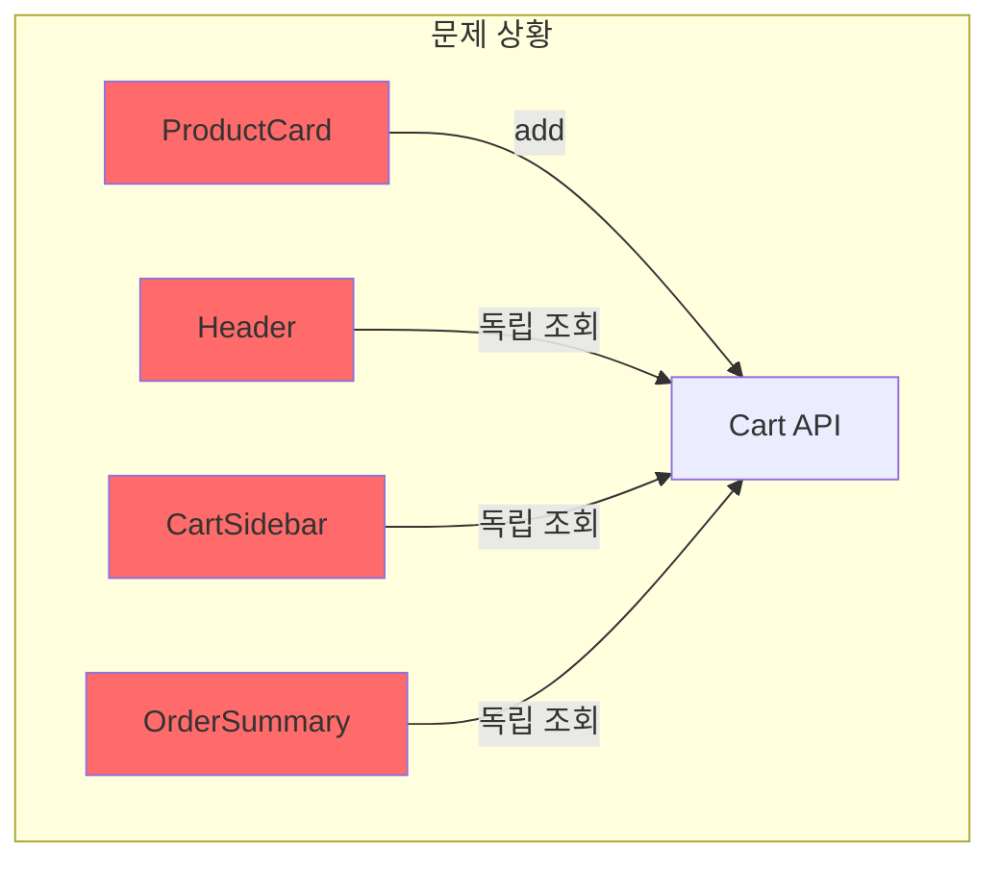
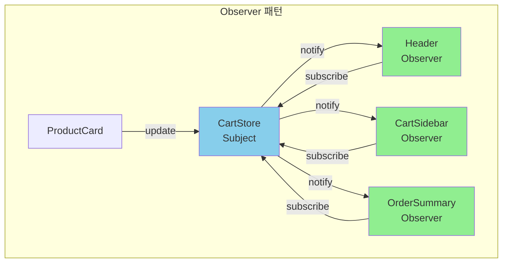
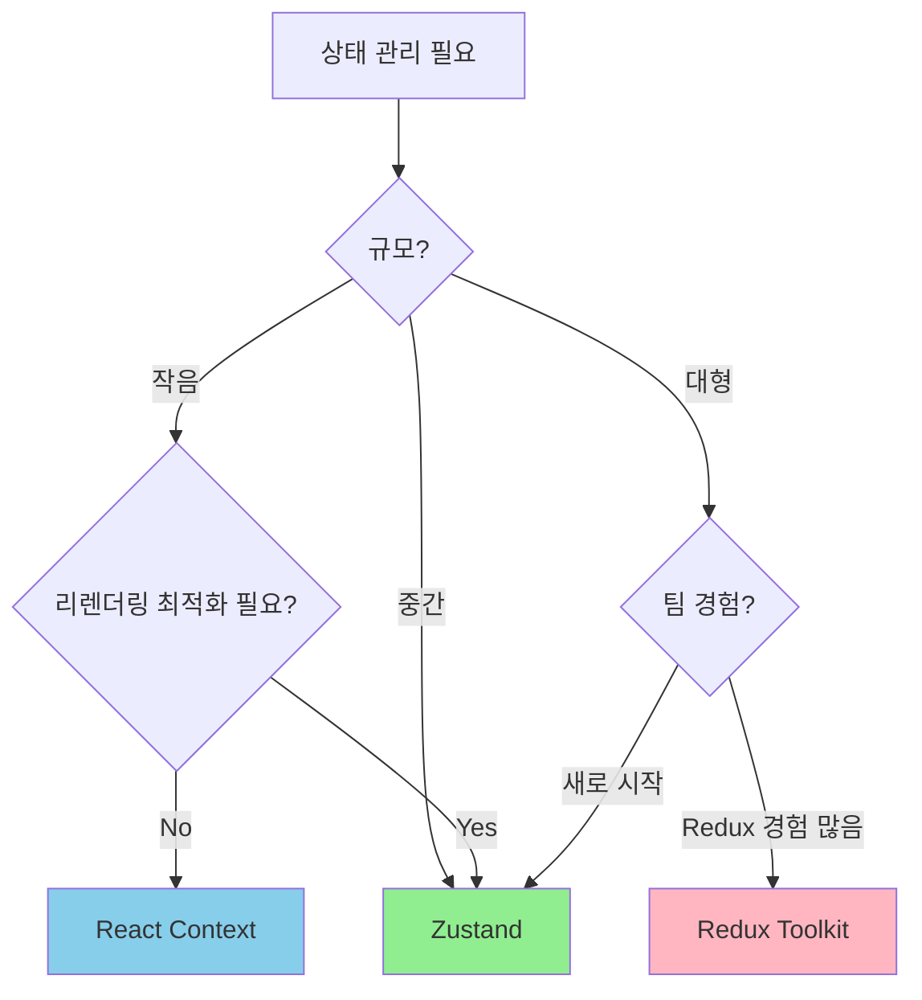

# Observer 패턴: 상태 변경의 전파

<Callout type="info" title="핵심 요약">
  **Observer 패턴**은 객체의 상태 변경을 관찰하고 있는 다른 객체들에게 자동으로 알려주는 패턴입니다.
  프론트엔드에서는 **한 곳에서 상태가 변경되면 여러 UI 컴포넌트가 자동으로 업데이트**되는 반응형 시스템의 핵심입니다.
</Callout>

장바구니에 상품을 담았습니다. 그런데 이상합니다.

> "분명 담았는데 헤더의 장바구니 아이콘 숫자가 안 바뀌네?"

새로고침하면 바뀝니다. 하지만 사용자는 새로고침을 하지 않습니다. 그리고 항의 전화가 옵니다.

```tsx
// Header.tsx
const Header = () => {
  const [cartCount, setCartCount] = useState(0);

  useEffect(() => {
    // 페이지 로드 시 한 번만 가져옴
    fetchCartCount().then(setCartCount);
  }, []);

  return <CartIcon count={cartCount} />;
};

// ProductCard.tsx
const ProductCard = ({ product }) => {
  const addToCart = async () => {
    await cartApi.add(product.id);
    alert('장바구니에 담았습니다!');
    // Header의 cartCount를 어떻게 업데이트하지...?
  };

  return <button onClick={addToCart}>장바구니 담기</button>;
};

// CartSidebar.tsx
const CartSidebar = () => {
  const [items, setItems] = useState([]);

  useEffect(() => {
    fetchCartItems().then(setItems);
  }, []);

  // ProductCard에서 담으면 여기도 안 바뀜...
  return <div>{items.map(item => <CartItem key={item.id} {...item} />)}</div>;
};
```

Header, ProductCard, CartSidebar - 세 컴포넌트가 각자 자기 상태만 알고 있습니다. 한 곳에서 변경이 일어나도 다른 곳은 모릅니다.

Observer 패턴은 이 문제를 해결합니다.

## 1. 문제의 핵심: 상태 동기화

여러 컴포넌트가 **같은 데이터**에 의존할 때, 그 데이터가 변경되면 **모든 컴포넌트가 알아야** 합니다.

<div className="my-6">

</div>

각 컴포넌트가 독립적으로 API를 호출하면:

1. **데이터 불일치**: 한 컴포넌트는 최신, 다른 컴포넌트는 옛날 데이터
2. **불필요한 API 호출**: 같은 데이터를 여러 번 요청
3. **복잡한 동기화 로직**: props drilling이나 콜백 지옥
4. **유지보수 악몽**: 새 컴포넌트 추가 시 또 동기화 고려

### 임시방편의 한계

흔히 시도하는 해결책들과 그 한계입니다.

```tsx
// 방법 1: Props Drilling - 깊어지면 지옥
const App = () => {
  const [cart, setCart] = useState([]);

  return (
    <Layout
      cart={cart}
      setCart={setCart} // props 전달 시작
    >
      <ProductSection
        cart={cart}
        setCart={setCart} // 또 전달
      >
        <ProductCard
          cart={cart}
          setCart={setCart} // 계속 전달...
        />
      </ProductSection>
    </Layout>
  );
};
```

```tsx
// 방법 2: 콜백 전달 - 복잡해지면 추적 불가
const ProductCard = ({ onCartChange }) => {
  const addToCart = async () => {
    await cartApi.add(product.id);
    onCartChange(); // 부모한테 알림
  };
};

const ProductSection = ({ onCartChange }) => {
  return <ProductCard onCartChange={onCartChange} />;
};

const App = () => {
  const handleCartChange = async () => {
    // 모든 장바구니 관련 상태를 여기서 갱신?
    await refreshHeader();
    await refreshSidebar();
    await refreshSummary();
    // 새 컴포넌트 추가되면 여기도 수정...
  };
};
```

```tsx
// 방법 3: 강제 리렌더링 - 성능 최악
const ProductCard = () => {
  const addToCart = async () => {
    await cartApi.add(product.id);
    window.location.reload(); // 진짜로 이러는 코드 봤습니다
  };
};
```

## 2. Observer 패턴의 구조

Observer 패턴은 **발행-구독(Pub-Sub)** 모델입니다.

<div className="my-6">

</div>

**핵심 구성요소:**

<div className="grid grid-cols-1 md:grid-cols-3 gap-4 my-6">
  <Card title="Subject (발행자)" icon={<Icon name="Radio" className="text-blue-500" />}>
    상태를 가지고 있으며, 변경 시 모든 Observer에게 알립니다.

    `CartStore`, `UserStore` 등
  </Card>
  <Card title="Observer (구독자)" icon={<Icon name="Eye" className="text-green-500" />}>
    Subject의 변경을 관찰하고, 알림을 받으면 자신을 업데이트합니다.

    `Header`, `CartSidebar` 등
  </Card>
  <Card title="Subscribe/Unsubscribe" icon={<Icon name="Link" className="text-purple-500" />}>
    Observer가 Subject에 등록/해제하는 메커니즘입니다.

    메모리 누수 방지를 위해 해제가 중요합니다.
  </Card>
</div>

## 3. 바닐라 JavaScript로 구현하기

먼저 패턴의 본질을 이해하기 위해 순수 JavaScript로 구현해봅니다.

```typescript
// store/observable.ts
type Listener<T> = (state: T) => void;

export class Observable<T> {
  private state: T;
  private listeners: Set<Listener<T>> = new Set();

  constructor(initialState: T) {
    this.state = initialState;
  }

  // 현재 상태 조회
  getState(): T {
    return this.state;
  }

  // 상태 변경 및 알림
  setState(newState: T | ((prev: T) => T)): void {
    const nextState = typeof newState === 'function'
      ? (newState as (prev: T) => T)(this.state)
      : newState;

    // 상태가 실제로 변경된 경우만 알림
    if (this.state !== nextState) {
      this.state = nextState;
      this.notify();
    }
  }

  // 구독
  subscribe(listener: Listener<T>): () => void {
    this.listeners.add(listener);

    // 구독 해제 함수 반환
    return () => {
      this.listeners.delete(listener);
    };
  }

  // 모든 구독자에게 알림
  private notify(): void {
    this.listeners.forEach(listener => listener(this.state));
  }
}
```

```typescript
// store/cart.store.ts
import { Observable } from './observable';

interface CartItem {
  id: string;
  name: string;
  price: number;
  quantity: number;
}

interface CartState {
  items: CartItem[];
  totalCount: number;
  totalPrice: number;
}

const initialState: CartState = {
  items: [],
  totalCount: 0,
  totalPrice: 0,
};

class CartStore extends Observable<CartState> {
  constructor() {
    super(initialState);
  }

  addItem(item: Omit<CartItem, 'quantity'>) {
    this.setState(prev => {
      const existingIndex = prev.items.findIndex(i => i.id === item.id);

      let newItems: CartItem[];
      if (existingIndex >= 0) {
        // 이미 있으면 수량 증가
        newItems = prev.items.map((i, index) =>
          index === existingIndex
            ? { ...i, quantity: i.quantity + 1 }
            : i
        );
      } else {
        // 없으면 새로 추가
        newItems = [...prev.items, { ...item, quantity: 1 }];
      }

      return {
        items: newItems,
        totalCount: newItems.reduce((sum, i) => sum + i.quantity, 0),
        totalPrice: newItems.reduce((sum, i) => sum + i.price * i.quantity, 0),
      };
    });
  }

  removeItem(itemId: string) {
    this.setState(prev => {
      const newItems = prev.items.filter(i => i.id !== itemId);
      return {
        items: newItems,
        totalCount: newItems.reduce((sum, i) => sum + i.quantity, 0),
        totalPrice: newItems.reduce((sum, i) => sum + i.price * i.quantity, 0),
      };
    });
  }

  updateQuantity(itemId: string, quantity: number) {
    if (quantity <= 0) {
      return this.removeItem(itemId);
    }

    this.setState(prev => {
      const newItems = prev.items.map(i =>
        i.id === itemId ? { ...i, quantity } : i
      );
      return {
        items: newItems,
        totalCount: newItems.reduce((sum, i) => sum + i.quantity, 0),
        totalPrice: newItems.reduce((sum, i) => sum + i.price * i.quantity, 0),
      };
    });
  }

  clear() {
    this.setState(initialState);
  }
}

// 싱글톤 인스턴스
export const cartStore = new CartStore();
```

### React와 연동

```tsx
// hooks/useCartStore.ts
import { useState, useEffect } from 'react';
import { cartStore } from '@/store/cart.store';

export function useCartStore() {
  const [state, setState] = useState(cartStore.getState());

  useEffect(() => {
    // 구독
    const unsubscribe = cartStore.subscribe(setState);

    // 클린업: 구독 해제
    return unsubscribe;
  }, []);

  return {
    ...state,
    addItem: cartStore.addItem.bind(cartStore),
    removeItem: cartStore.removeItem.bind(cartStore),
    updateQuantity: cartStore.updateQuantity.bind(cartStore),
    clear: cartStore.clear.bind(cartStore),
  };
}
```

```tsx
// components/Header.tsx
import { useCartStore } from '@/hooks/useCartStore';

export function Header() {
  const { totalCount } = useCartStore();

  return (
    <header>
      <nav>
        {/* ... */}
        <CartIcon count={totalCount} />
      </nav>
    </header>
  );
}
```

```tsx
// components/ProductCard.tsx
import { useCartStore } from '@/hooks/useCartStore';

export function ProductCard({ product }) {
  const { addItem } = useCartStore();

  const handleAddToCart = () => {
    addItem({
      id: product.id,
      name: product.name,
      price: product.price,
    });
    // 끝! Header, CartSidebar 등이 자동으로 업데이트됨
  };

  return (
    <div className="product-card">
      <h3>{product.name}</h3>
      <p>{product.price.toLocaleString()}원</p>
      <button onClick={handleAddToCart}>장바구니 담기</button>
    </div>
  );
}
```

```tsx
// components/CartSidebar.tsx
import { useCartStore } from '@/hooks/useCartStore';

export function CartSidebar() {
  const { items, totalPrice, updateQuantity, removeItem } = useCartStore();

  return (
    <aside className="cart-sidebar">
      <h2>장바구니</h2>
      {items.map(item => (
        <div key={item.id} className="cart-item">
          <span>{item.name}</span>
          <input
            type="number"
            value={item.quantity}
            onChange={(e) => updateQuantity(item.id, Number(e.target.value))}
            min={1}
          />
          <button onClick={() => removeItem(item.id)}>삭제</button>
        </div>
      ))}
      <div className="total">
        총 {totalPrice.toLocaleString()}원
      </div>
    </aside>
  );
}
```

<Callout type="success" title="변화된 점">
  - **ProductCard**에서 장바구니에 담으면
  - **Header**의 카운트가 자동 업데이트
  - **CartSidebar**의 목록도 자동 업데이트
  - 서로를 전혀 모르는 컴포넌트들이 **같은 상태를 공유**합니다
</Callout>

## 4. 셀렉터로 성능 최적화

지금 구현에는 문제가 있습니다. 상태의 어떤 부분이 바뀌어도 **모든 구독자가 리렌더링**됩니다.

```tsx
// 문제: Header는 totalCount만 필요한데
// items가 바뀔 때도 리렌더링됨
export function Header() {
  const { totalCount } = useCartStore(); // 전체 상태를 구독 중
  // ...
}
```

**셀렉터**를 도입해 필요한 부분만 구독하도록 개선합니다.

```typescript
// store/observable-with-selector.ts
type Listener<T> = (state: T) => void;
type Selector<T, S> = (state: T) => S;

export class ObservableWithSelector<T> {
  private state: T;
  private listeners: Set<Listener<T>> = new Set();

  constructor(initialState: T) {
    this.state = initialState;
  }

  getState(): T {
    return this.state;
  }

  setState(newState: T | ((prev: T) => T)): void {
    const nextState = typeof newState === 'function'
      ? (newState as (prev: T) => T)(this.state)
      : newState;

    if (this.state !== nextState) {
      this.state = nextState;
      this.notify();
    }
  }

  subscribe(listener: Listener<T>): () => void {
    this.listeners.add(listener);
    return () => this.listeners.delete(listener);
  }

  // 셀렉터를 사용한 구독
  subscribeWithSelector<S>(
    selector: Selector<T, S>,
    listener: (selected: S) => void,
    equalityFn: (a: S, b: S) => boolean = Object.is
  ): () => void {
    let previousSelected = selector(this.state);

    const wrappedListener = (state: T) => {
      const nextSelected = selector(state);

      // 선택된 값이 변경된 경우만 알림
      if (!equalityFn(previousSelected, nextSelected)) {
        previousSelected = nextSelected;
        listener(nextSelected);
      }
    };

    this.listeners.add(wrappedListener);
    return () => this.listeners.delete(wrappedListener);
  }

  private notify(): void {
    this.listeners.forEach(listener => listener(this.state));
  }
}
```

```tsx
// hooks/useCartStore.ts - 셀렉터 지원 버전
import { useState, useEffect, useRef, useCallback } from 'react';
import { cartStore } from '@/store/cart.store';
import type { CartState } from '@/store/cart.store';

export function useCartSelector<S>(
  selector: (state: CartState) => S,
  equalityFn: (a: S, b: S) => boolean = Object.is
): S {
  const [selectedState, setSelectedState] = useState(() =>
    selector(cartStore.getState())
  );

  const selectorRef = useRef(selector);
  const equalityFnRef = useRef(equalityFn);

  useEffect(() => {
    selectorRef.current = selector;
    equalityFnRef.current = equalityFn;
  });

  useEffect(() => {
    const unsubscribe = cartStore.subscribeWithSelector(
      (state) => selectorRef.current(state),
      setSelectedState,
      (a, b) => equalityFnRef.current(a, b)
    );

    return unsubscribe;
  }, []);

  return selectedState;
}

// 편의 셀렉터들
export const selectTotalCount = (state: CartState) => state.totalCount;
export const selectTotalPrice = (state: CartState) => state.totalPrice;
export const selectItems = (state: CartState) => state.items;
export const selectItemById = (id: string) => (state: CartState) =>
  state.items.find(item => item.id === id);
```

```tsx
// components/Header.tsx - 최적화 버전
import { useCartSelector, selectTotalCount } from '@/hooks/useCartStore';

export function Header() {
  // totalCount가 변경될 때만 리렌더링
  const totalCount = useCartSelector(selectTotalCount);

  return (
    <header>
      <nav>
        <CartIcon count={totalCount} />
      </nav>
    </header>
  );
}
```

```tsx
// components/CartItemRow.tsx - 개별 아이템 최적화
import { useCartSelector, selectItemById } from '@/hooks/useCartStore';
import { cartStore } from '@/store/cart.store';

export function CartItemRow({ itemId }: { itemId: string }) {
  // 이 아이템이 변경될 때만 리렌더링
  const item = useCartSelector(selectItemById(itemId));

  if (!item) return null;

  return (
    <div className="cart-item-row">
      <span>{item.name}</span>
      <span>{item.quantity}개</span>
      <span>{(item.price * item.quantity).toLocaleString()}원</span>
      <button onClick={() => cartStore.removeItem(itemId)}>삭제</button>
    </div>
  );
}
```

<Callout type="info" title="셀렉터의 이점">
  - **Header**: `totalCount`만 구독 → items 변경 시 리렌더링 안 함
  - **CartItemRow**: 특정 item만 구독 → 다른 item 변경 시 리렌더링 안 함
  - **성능 최적화**와 **코드 가독성**을 동시에 확보
</Callout>

## 5. Zustand로 더 간단하게

직접 구현하는 것도 좋지만, 실무에서는 검증된 라이브러리를 사용하는 것이 효율적입니다. **Zustand**는 Observer 패턴을 우아하게 구현한 경량 상태 관리 라이브러리입니다.

```bash
npm install zustand
```

```typescript
// store/cart.store.ts - Zustand 버전
import { create } from 'zustand';
import { devtools, persist } from 'zustand/middleware';

interface CartItem {
  id: string;
  name: string;
  price: number;
  quantity: number;
}

interface CartState {
  items: CartItem[];
  totalCount: number;
  totalPrice: number;
}

interface CartActions {
  addItem: (item: Omit<CartItem, 'quantity'>) => void;
  removeItem: (itemId: string) => void;
  updateQuantity: (itemId: string, quantity: number) => void;
  clear: () => void;
}

// 헬퍼: 총계 계산
const calculateTotals = (items: CartItem[]) => ({
  totalCount: items.reduce((sum, i) => sum + i.quantity, 0),
  totalPrice: items.reduce((sum, i) => sum + i.price * i.quantity, 0),
});

export const useCartStore = create<CartState & CartActions>()(
  devtools(
    persist(
      (set) => ({
        // 초기 상태
        items: [],
        totalCount: 0,
        totalPrice: 0,

        // 액션들
        addItem: (item) =>
          set((state) => {
            const existingIndex = state.items.findIndex(i => i.id === item.id);

            const newItems = existingIndex >= 0
              ? state.items.map((i, idx) =>
                  idx === existingIndex
                    ? { ...i, quantity: i.quantity + 1 }
                    : i
                )
              : [...state.items, { ...item, quantity: 1 }];

            return {
              items: newItems,
              ...calculateTotals(newItems),
            };
          }),

        removeItem: (itemId) =>
          set((state) => {
            const newItems = state.items.filter(i => i.id !== itemId);
            return {
              items: newItems,
              ...calculateTotals(newItems),
            };
          }),

        updateQuantity: (itemId, quantity) =>
          set((state) => {
            if (quantity <= 0) {
              const newItems = state.items.filter(i => i.id !== itemId);
              return {
                items: newItems,
                ...calculateTotals(newItems),
              };
            }

            const newItems = state.items.map(i =>
              i.id === itemId ? { ...i, quantity } : i
            );
            return {
              items: newItems,
              ...calculateTotals(newItems),
            };
          }),

        clear: () =>
          set({
            items: [],
            totalCount: 0,
            totalPrice: 0,
          }),
      }),
      {
        name: 'cart-storage', // localStorage 키
      }
    ),
    { name: 'CartStore' } // DevTools 이름
  )
);
```

### Zustand의 자동 셀렉터

```tsx
// components/Header.tsx
import { useCartStore } from '@/store/cart.store';

export function Header() {
  // 이렇게 특정 값만 선택하면 해당 값이 변경될 때만 리렌더링
  const totalCount = useCartStore((state) => state.totalCount);

  return (
    <header>
      <CartIcon count={totalCount} />
    </header>
  );
}
```

```tsx
// components/ProductCard.tsx
import { useCartStore } from '@/store/cart.store';

export function ProductCard({ product }) {
  // 액션만 가져오면 상태 변경 시 리렌더링 안 함
  const addItem = useCartStore((state) => state.addItem);

  return (
    <button onClick={() => addItem(product)}>
      장바구니 담기
    </button>
  );
}
```

```tsx
// components/CartSidebar.tsx
import { useCartStore } from '@/store/cart.store';
import { shallow } from 'zustand/shallow';

export function CartSidebar() {
  // 여러 값을 선택할 때는 shallow 비교 사용
  const { items, totalPrice, removeItem, updateQuantity } = useCartStore(
    (state) => ({
      items: state.items,
      totalPrice: state.totalPrice,
      removeItem: state.removeItem,
      updateQuantity: state.updateQuantity,
    }),
    shallow
  );

  return (
    <aside>
      {items.map(item => (
        <CartItem
          key={item.id}
          item={item}
          onQuantityChange={(q) => updateQuantity(item.id, q)}
          onRemove={() => removeItem(item.id)}
        />
      ))}
      <div>총 {totalPrice.toLocaleString()}원</div>
    </aside>
  );
}
```

<Callout type="success" title="Zustand의 장점">
  - **자동 셀렉터 최적화**: 선택한 값이 변경될 때만 리렌더링
  - **미들웨어 지원**: `devtools`, `persist`, `immer` 등
  - **TypeScript 지원**: 완벽한 타입 추론
  - **번들 크기**: ~1.5KB (gzipped)
  - **학습 곡선**: React useState와 유사한 사용법
</Callout>

## 6. 실시간 데이터와 Observer 패턴

WebSocket을 통한 실시간 업데이트도 Observer 패턴으로 우아하게 처리할 수 있습니다.

```typescript
// store/notification.store.ts
import { create } from 'zustand';

interface Notification {
  id: string;
  type: 'info' | 'success' | 'warning' | 'error';
  title: string;
  message: string;
  read: boolean;
  createdAt: string;
}

interface NotificationState {
  notifications: Notification[];
  unreadCount: number;
}

interface NotificationActions {
  addNotification: (notification: Omit<Notification, 'id' | 'read' | 'createdAt'>) => void;
  markAsRead: (id: string) => void;
  markAllAsRead: () => void;
  removeNotification: (id: string) => void;
  clearAll: () => void;
}

export const useNotificationStore = create<NotificationState & NotificationActions>()(
  (set) => ({
    notifications: [],
    unreadCount: 0,

    addNotification: (notification) =>
      set((state) => {
        const newNotification: Notification = {
          ...notification,
          id: crypto.randomUUID(),
          read: false,
          createdAt: new Date().toISOString(),
        };
        const newNotifications = [newNotification, ...state.notifications];
        return {
          notifications: newNotifications,
          unreadCount: newNotifications.filter(n => !n.read).length,
        };
      }),

    markAsRead: (id) =>
      set((state) => {
        const newNotifications = state.notifications.map(n =>
          n.id === id ? { ...n, read: true } : n
        );
        return {
          notifications: newNotifications,
          unreadCount: newNotifications.filter(n => !n.read).length,
        };
      }),

    markAllAsRead: () =>
      set((state) => ({
        notifications: state.notifications.map(n => ({ ...n, read: true })),
        unreadCount: 0,
      })),

    removeNotification: (id) =>
      set((state) => {
        const newNotifications = state.notifications.filter(n => n.id !== id);
        return {
          notifications: newNotifications,
          unreadCount: newNotifications.filter(n => !n.read).length,
        };
      }),

    clearAll: () =>
      set({
        notifications: [],
        unreadCount: 0,
      }),
  })
);
```

```typescript
// lib/websocket.ts
import { useNotificationStore } from '@/store/notification.store';
import { useCartStore } from '@/store/cart.store';

class WebSocketService {
  private socket: WebSocket | null = null;
  private reconnectAttempts = 0;
  private maxReconnectAttempts = 5;

  connect(url: string) {
    this.socket = new WebSocket(url);

    this.socket.onmessage = (event) => {
      const data = JSON.parse(event.data);
      this.handleMessage(data);
    };

    this.socket.onclose = () => {
      this.attemptReconnect(url);
    };

    this.socket.onerror = (error) => {
      console.error('WebSocket error:', error);
    };
  }

  private handleMessage(data: any) {
    switch (data.type) {
      case 'NOTIFICATION':
        // 새 알림이 오면 Store에 추가
        useNotificationStore.getState().addNotification({
          type: data.payload.type,
          title: data.payload.title,
          message: data.payload.message,
        });
        break;

      case 'CART_UPDATED':
        // 다른 탭/기기에서 장바구니가 변경되면 동기화
        // 실제로는 서버에서 전체 장바구니 상태를 받아와야 함
        break;

      case 'PRICE_CHANGED':
        // 가격 변경 알림
        useNotificationStore.getState().addNotification({
          type: 'warning',
          title: '가격 변경',
          message: `${data.payload.productName}의 가격이 변경되었습니다.`,
        });
        break;

      default:
        console.log('Unknown message type:', data.type);
    }
  }

  private attemptReconnect(url: string) {
    if (this.reconnectAttempts < this.maxReconnectAttempts) {
      this.reconnectAttempts++;
      setTimeout(() => this.connect(url), 1000 * this.reconnectAttempts);
    }
  }

  disconnect() {
    this.socket?.close();
    this.socket = null;
  }
}

export const webSocketService = new WebSocketService();
```

```tsx
// components/NotificationBell.tsx
import { useNotificationStore } from '@/store/notification.store';

export function NotificationBell() {
  const unreadCount = useNotificationStore((state) => state.unreadCount);
  const [isOpen, setIsOpen] = useState(false);

  return (
    <div className="relative">
      <button onClick={() => setIsOpen(!isOpen)}>
        <BellIcon />
        {unreadCount > 0 && (
          <span className="absolute -top-1 -right-1 bg-red-500 text-white text-xs rounded-full w-5 h-5 flex items-center justify-center">
            {unreadCount > 99 ? '99+' : unreadCount}
          </span>
        )}
      </button>

      {isOpen && <NotificationDropdown onClose={() => setIsOpen(false)} />}
    </div>
  );
}
```

```tsx
// components/NotificationDropdown.tsx
import { useNotificationStore } from '@/store/notification.store';

export function NotificationDropdown({ onClose }: { onClose: () => void }) {
  const { notifications, markAsRead, markAllAsRead, removeNotification } =
    useNotificationStore();

  return (
    <div className="absolute right-0 mt-2 w-80 bg-white shadow-lg rounded-lg">
      <div className="flex justify-between items-center p-3 border-b">
        <h3 className="font-semibold">알림</h3>
        <button
          onClick={markAllAsRead}
          className="text-sm text-blue-600 hover:underline"
        >
          모두 읽음
        </button>
      </div>

      <div className="max-h-96 overflow-y-auto">
        {notifications.length === 0 ? (
          <p className="p-4 text-center text-gray-500">알림이 없습니다</p>
        ) : (
          notifications.map((notification) => (
            <div
              key={notification.id}
              className={`p-3 border-b hover:bg-gray-50 ${
                !notification.read ? 'bg-blue-50' : ''
              }`}
              onClick={() => markAsRead(notification.id)}
            >
              <div className="flex justify-between">
                <span className="font-medium">{notification.title}</span>
                <button
                  onClick={(e) => {
                    e.stopPropagation();
                    removeNotification(notification.id);
                  }}
                >
                  <XIcon className="w-4 h-4" />
                </button>
              </div>
              <p className="text-sm text-gray-600">{notification.message}</p>
              <span className="text-xs text-gray-400">
                {new Date(notification.createdAt).toLocaleString()}
              </span>
            </div>
          ))
        )}
      </div>
    </div>
  );
}
```

<Callout type="info" title="실시간 데이터 흐름">
  1. **WebSocket**에서 메시지 수신
  2. **Store**의 상태 업데이트 (addNotification)
  3. 구독 중인 **모든 컴포넌트** 자동 리렌더링 (NotificationBell, NotificationDropdown)

  컴포넌트는 WebSocket의 존재를 알 필요 없이, Store만 구독하면 됩니다.
</Callout>

## 7. 다크모드 토글 예제

테마 변경도 Observer 패턴의 좋은 예시입니다.

```typescript
// store/theme.store.ts
import { create } from 'zustand';
import { persist } from 'zustand/middleware';

type Theme = 'light' | 'dark' | 'system';

interface ThemeState {
  theme: Theme;
  resolvedTheme: 'light' | 'dark';
}

interface ThemeActions {
  setTheme: (theme: Theme) => void;
  toggleTheme: () => void;
}

const getSystemTheme = (): 'light' | 'dark' => {
  if (typeof window === 'undefined') return 'light';
  return window.matchMedia('(prefers-color-scheme: dark)').matches
    ? 'dark'
    : 'light';
};

const resolveTheme = (theme: Theme): 'light' | 'dark' => {
  if (theme === 'system') return getSystemTheme();
  return theme;
};

export const useThemeStore = create<ThemeState & ThemeActions>()(
  persist(
    (set, get) => ({
      theme: 'system',
      resolvedTheme: getSystemTheme(),

      setTheme: (theme) =>
        set({
          theme,
          resolvedTheme: resolveTheme(theme),
        }),

      toggleTheme: () => {
        const current = get().resolvedTheme;
        const next = current === 'light' ? 'dark' : 'light';
        set({
          theme: next,
          resolvedTheme: next,
        });
      },
    }),
    {
      name: 'theme-storage',
      onRehydrateStorage: () => (state) => {
        // 스토리지에서 복원 후 resolvedTheme 재계산
        if (state) {
          state.resolvedTheme = resolveTheme(state.theme);
        }
      },
    }
  )
);

// 시스템 테마 변경 감지
if (typeof window !== 'undefined') {
  window
    .matchMedia('(prefers-color-scheme: dark)')
    .addEventListener('change', (e) => {
      const state = useThemeStore.getState();
      if (state.theme === 'system') {
        useThemeStore.setState({
          resolvedTheme: e.matches ? 'dark' : 'light',
        });
      }
    });
}
```

```tsx
// components/ThemeProvider.tsx
'use client';

import { useEffect } from 'react';
import { useThemeStore } from '@/store/theme.store';

export function ThemeProvider({ children }: { children: React.ReactNode }) {
  const resolvedTheme = useThemeStore((state) => state.resolvedTheme);

  useEffect(() => {
    // document에 테마 클래스 적용
    document.documentElement.classList.remove('light', 'dark');
    document.documentElement.classList.add(resolvedTheme);
  }, [resolvedTheme]);

  return <>{children}</>;
}
```

```tsx
// components/ThemeToggle.tsx
import { useThemeStore } from '@/store/theme.store';
import { SunIcon, MoonIcon } from '@/components/icons';

export function ThemeToggle() {
  const { resolvedTheme, toggleTheme } = useThemeStore();

  return (
    <button
      onClick={toggleTheme}
      className="p-2 rounded-lg hover:bg-gray-200 dark:hover:bg-gray-700"
      aria-label="테마 변경"
    >
      {resolvedTheme === 'light' ? (
        <MoonIcon className="w-5 h-5" />
      ) : (
        <SunIcon className="w-5 h-5" />
      )}
    </button>
  );
}
```

```tsx
// 어떤 컴포넌트에서든 테마에 반응
import { useThemeStore } from '@/store/theme.store';

export function Chart({ data }) {
  const resolvedTheme = useThemeStore((state) => state.resolvedTheme);

  const chartColors = resolvedTheme === 'dark'
    ? { background: '#1f2937', text: '#f9fafb', grid: '#374151' }
    : { background: '#ffffff', text: '#111827', grid: '#e5e7eb' };

  return (
    <div style={{ backgroundColor: chartColors.background }}>
      {/* 차트 렌더링 */}
    </div>
  );
}
```

## 8. 폼 상태 공유 예제

복잡한 멀티스텝 폼에서도 Observer 패턴이 유용합니다.

```typescript
// store/checkout.store.ts
import { create } from 'zustand';

interface ShippingInfo {
  name: string;
  phone: string;
  address: string;
  detailAddress: string;
  zipCode: string;
}

interface PaymentInfo {
  method: 'card' | 'bank' | 'kakao' | 'naver';
  cardNumber?: string;
  expiryDate?: string;
}

interface CheckoutState {
  step: number;
  shipping: ShippingInfo;
  payment: PaymentInfo;
  isValid: {
    shipping: boolean;
    payment: boolean;
  };
}

interface CheckoutActions {
  setStep: (step: number) => void;
  nextStep: () => void;
  prevStep: () => void;
  updateShipping: (data: Partial<ShippingInfo>) => void;
  updatePayment: (data: Partial<PaymentInfo>) => void;
  setShippingValid: (valid: boolean) => void;
  setPaymentValid: (valid: boolean) => void;
  reset: () => void;
}

const initialState: CheckoutState = {
  step: 1,
  shipping: {
    name: '',
    phone: '',
    address: '',
    detailAddress: '',
    zipCode: '',
  },
  payment: {
    method: 'card',
  },
  isValid: {
    shipping: false,
    payment: false,
  },
};

export const useCheckoutStore = create<CheckoutState & CheckoutActions>()(
  (set) => ({
    ...initialState,

    setStep: (step) => set({ step }),

    nextStep: () =>
      set((state) => ({
        step: Math.min(state.step + 1, 3),
      })),

    prevStep: () =>
      set((state) => ({
        step: Math.max(state.step - 1, 1),
      })),

    updateShipping: (data) =>
      set((state) => ({
        shipping: { ...state.shipping, ...data },
      })),

    updatePayment: (data) =>
      set((state) => ({
        payment: { ...state.payment, ...data },
      })),

    setShippingValid: (valid) =>
      set((state) => ({
        isValid: { ...state.isValid, shipping: valid },
      })),

    setPaymentValid: (valid) =>
      set((state) => ({
        isValid: { ...state.isValid, payment: valid },
      })),

    reset: () => set(initialState),
  })
);
```

```tsx
// components/CheckoutStepper.tsx
import { useCheckoutStore } from '@/store/checkout.store';

export function CheckoutStepper() {
  const { step, isValid } = useCheckoutStore();

  const steps = [
    { label: '배송 정보', valid: isValid.shipping },
    { label: '결제 정보', valid: isValid.payment },
    { label: '주문 확인', valid: true },
  ];

  return (
    <div className="flex justify-between mb-8">
      {steps.map((s, index) => (
        <div
          key={s.label}
          className={`flex items-center ${
            index + 1 <= step ? 'text-blue-600' : 'text-gray-400'
          }`}
        >
          <div
            className={`w-8 h-8 rounded-full flex items-center justify-center ${
              index + 1 < step
                ? 'bg-blue-600 text-white'
                : index + 1 === step
                ? 'border-2 border-blue-600'
                : 'border-2 border-gray-300'
            }`}
          >
            {index + 1 < step && s.valid ? '✓' : index + 1}
          </div>
          <span className="ml-2">{s.label}</span>
          {index < steps.length - 1 && (
            <div className="w-16 h-0.5 mx-4 bg-gray-300" />
          )}
        </div>
      ))}
    </div>
  );
}
```

```tsx
// components/ShippingForm.tsx
import { useCheckoutStore } from '@/store/checkout.store';
import { useEffect } from 'react';

export function ShippingForm() {
  const { shipping, updateShipping, setShippingValid, nextStep } = useCheckoutStore();

  // 유효성 검사
  useEffect(() => {
    const isValid =
      shipping.name.length > 0 &&
      shipping.phone.length >= 10 &&
      shipping.address.length > 0 &&
      shipping.zipCode.length === 5;

    setShippingValid(isValid);
  }, [shipping, setShippingValid]);

  return (
    <form
      onSubmit={(e) => {
        e.preventDefault();
        nextStep();
      }}
    >
      <div className="space-y-4">
        <input
          value={shipping.name}
          onChange={(e) => updateShipping({ name: e.target.value })}
          placeholder="받는 분"
        />
        <input
          value={shipping.phone}
          onChange={(e) => updateShipping({ phone: e.target.value })}
          placeholder="연락처"
        />
        {/* ... 나머지 필드 */}
      </div>
      <button type="submit">다음</button>
    </form>
  );
}
```

```tsx
// components/OrderSummary.tsx - 마지막 단계에서 모든 정보 확인
import { useCheckoutStore } from '@/store/checkout.store';
import { useCartStore } from '@/store/cart.store';

export function OrderSummary() {
  const { shipping, payment } = useCheckoutStore();
  const { items, totalPrice } = useCartStore();

  return (
    <div className="space-y-6">
      <section>
        <h3 className="font-bold mb-2">배송 정보</h3>
        <p>{shipping.name} / {shipping.phone}</p>
        <p>{shipping.address} {shipping.detailAddress}</p>
      </section>

      <section>
        <h3 className="font-bold mb-2">결제 정보</h3>
        <p>결제 수단: {payment.method}</p>
      </section>

      <section>
        <h3 className="font-bold mb-2">주문 상품</h3>
        {items.map(item => (
          <div key={item.id} className="flex justify-between">
            <span>{item.name} x {item.quantity}</span>
            <span>{(item.price * item.quantity).toLocaleString()}원</span>
          </div>
        ))}
        <div className="border-t pt-2 mt-2 font-bold">
          총 {totalPrice.toLocaleString()}원
        </div>
      </section>

      <button className="w-full py-3 bg-blue-600 text-white rounded-lg">
        결제하기
      </button>
    </div>
  );
}
```

<Callout type="success" title="멀티스텝 폼의 이점">
  - **CheckoutStepper**: 현재 단계와 유효성 상태를 실시간 표시
  - **ShippingForm**: 배송 정보 입력 및 유효성 검사
  - **OrderSummary**: 장바구니 + 체크아웃 Store 모두 구독하여 최종 확인

  각 컴포넌트가 필요한 상태만 구독하므로 **불필요한 리렌더링이 없습니다**.
</Callout>

## 9. React Context vs Zustand vs Redux

Observer 패턴을 구현하는 여러 방법을 비교해봅니다.

<Tabs defaultValue="context">
  <TabsList>
    <TabsTrigger value="context">React Context</TabsTrigger>
    <TabsTrigger value="zustand">Zustand</TabsTrigger>
    <TabsTrigger value="redux">Redux Toolkit</TabsTrigger>
  </TabsList>

  <TabsContent value="context">
    ### React Context

    ```tsx
    // React 기본 제공. 추가 라이브러리 불필요
    const CartContext = createContext<CartState | null>(null);

    export function CartProvider({ children }) {
      const [state, dispatch] = useReducer(cartReducer, initialState);

      return (
        <CartContext.Provider value={{ state, dispatch }}>
          {children}
        </CartContext.Provider>
      );
    }

    // 사용
    const { state, dispatch } = useContext(CartContext);
    ```

    **장점:**
    - 추가 의존성 없음
    - React 공식 API
    - 간단한 상태에 적합

    **단점:**
    - 상태 변경 시 모든 Consumer 리렌더링 (셀렉터 미지원)
    - Provider 중첩 시 복잡해짐
    - DevTools 미지원
  </TabsContent>

  <TabsContent value="zustand">
    ### Zustand

    ```tsx
    // 미니멀한 API
    const useCartStore = create((set) => ({
      items: [],
      addItem: (item) => set((state) => ({
        items: [...state.items, item]
      })),
    }));

    // 사용 - 셀렉터로 최적화
    const items = useCartStore((state) => state.items);
    ```

    **장점:**
    - 매우 작은 번들 크기 (~1.5KB)
    - 자동 셀렉터 최적화
    - Provider 불필요
    - DevTools 지원
    - TypeScript 친화적

    **단점:**
    - 외부 의존성
    - Redux 대비 생태계 작음
  </TabsContent>

  <TabsContent value="redux">
    ### Redux Toolkit

    ```tsx
    // 구조화된 상태 관리
    const cartSlice = createSlice({
      name: 'cart',
      initialState: { items: [] },
      reducers: {
        addItem: (state, action) => {
          state.items.push(action.payload);
        },
      },
    });

    // 사용
    const items = useSelector((state) => state.cart.items);
    const dispatch = useDispatch();
    dispatch(cartSlice.actions.addItem(item));
    ```

    **장점:**
    - 강력한 DevTools
    - 미들웨어 생태계 (redux-saga, redux-thunk)
    - 대규모 앱에 적합
    - 시간 여행 디버깅

    **단점:**
    - 보일러플레이트 많음
    - 학습 곡선 높음
    - 번들 크기 큼
  </TabsContent>
</Tabs>

### 선택 가이드

<div className="my-6">

</div>

## 10. 정리: Observer 패턴의 장단점

<Tabs defaultValue="pros">
  <TabsList>
    <TabsTrigger value="pros">장점</TabsTrigger>
    <TabsTrigger value="cons">단점</TabsTrigger>
    <TabsTrigger value="when">언제 사용?</TabsTrigger>
  </TabsList>

  <TabsContent value="pros">
    ### 장점

    <div className="grid grid-cols-1 md:grid-cols-2 gap-4">
      <Card title="느슨한 결합" icon={<Icon name="Unlink" className="text-blue-500" />}>
        Subject와 Observer가 서로를 직접 알 필요 없이 **인터페이스로만 통신**합니다.
      </Card>
      <Card title="자동 동기화" icon={<Icon name="RefreshCw" className="text-green-500" />}>
        상태 변경 시 **구독자들이 자동으로 업데이트**됩니다. 수동 동기화 불필요.
      </Card>
      <Card title="확장성" icon={<Icon name="GitBranch" className="text-purple-500" />}>
        새 Observer 추가 시 **기존 코드 수정 없이** 구독만 추가하면 됩니다.
      </Card>
      <Card title="관심사 분리" icon={<Icon name="Layers" className="text-orange-500" />}>
        상태 관리 로직과 UI 로직이 **명확히 분리**됩니다.
      </Card>
    </div>
  </TabsContent>

  <TabsContent value="cons">
    ### 단점

    <div className="space-y-4">
      <Callout type="warning" title="메모리 누수 위험">
        구독 해제를 잊으면 컴포넌트가 언마운트되어도 리스너가 남아 **메모리 누수**가 발생합니다.

        항상 `useEffect` cleanup에서 `unsubscribe()`를 호출하세요.
      </Callout>

      <Callout type="warning" title="디버깅 어려움">
        어떤 Observer가 어떤 Subject를 구독하는지 추적하기 어려울 수 있습니다.

        DevTools 활용이 중요합니다.
      </Callout>

      <Callout type="warning" title="순서 의존성">
        Observer 호출 순서에 의존하면 예측 불가능한 버그가 발생할 수 있습니다.

        각 Observer는 **독립적**으로 동작해야 합니다.
      </Callout>

      <Callout type="warning" title="성능 고려">
        상태 변경이 빈번하면 많은 Observer가 계속 호출됩니다.

        **셀렉터와 메모이제이션**으로 최적화하세요.
      </Callout>
    </div>
  </TabsContent>

  <TabsContent value="when">
    ### 언제 사용해야 할까?

    **Observer 패턴이 적합한 경우:**

    - **여러 컴포넌트**가 같은 데이터에 의존하는 경우
    - **실시간 업데이트**가 필요한 경우 (알림, 채팅, 주식 시세)
    - **전역 상태**가 필요한 경우 (로그인 상태, 테마, 장바구니)
    - **이벤트 기반 아키텍처**를 구현할 때
    - **컴포넌트 간 통신**이 복잡해질 때

    **Observer 패턴이 과한 경우:**

    - 부모-자식 간 단순 데이터 전달 (props로 충분)
    - 한 컴포넌트 내부 상태 (useState로 충분)
    - 서버 상태 (React Query/SWR이 더 적합)
    - 단순 토글 상태 (로컬 상태로 충분)
  </TabsContent>
</Tabs>

## 11. 체크리스트

Observer 패턴을 도입할 때 참고하세요.

<Steps>
  <Step title="공유 상태 식별">
    여러 컴포넌트에서 필요한 상태를 파악합니다.

    장바구니, 로그인 상태, 테마, 알림 등
  </Step>

  <Step title="Store 설계">
    상태의 구조와 액션을 정의합니다.

    불변성을 유지하는 업데이트 로직을 설계합니다.
  </Step>

  <Step title="셀렉터 정의">
    각 컴포넌트가 필요한 상태의 일부만 구독하도록 셀렉터를 만듭니다.

    성능 최적화의 핵심입니다.
  </Step>

  <Step title="구독 해제 확인">
    컴포넌트 언마운트 시 구독이 해제되는지 확인합니다.

    `useEffect` cleanup 또는 라이브러리 자동 관리를 활용합니다.
  </Step>

  <Step title="DevTools 설정">
    개발 환경에서 상태 변화를 추적할 수 있도록 DevTools를 설정합니다.

    Zustand, Redux 모두 훌륭한 DevTools를 제공합니다.
  </Step>

  <Step title="테스트 작성">
    Store 로직을 독립적으로 테스트합니다.

    UI 없이 상태 변화를 검증할 수 있어 테스트가 쉽습니다.
  </Step>
</Steps>

## 마치며

Observer 패턴은 현대 프론트엔드 개발의 **핵심 패턴**입니다.

<Blockquote author="Gang of Four" cite="Design Patterns">
  Define a one-to-many dependency between objects so that when one object changes state, all its dependents are notified and updated automatically.

  객체 사이에 일대다 의존 관계를 정의하여, 어떤 객체의 상태가 변할 때 의존하는 모든 객체에게 알리고 자동으로 업데이트되게 한다.
</Blockquote>

React의 `useState`, Redux, Zustand, MobX, Vue의 반응형 시스템, Svelte의 스토어 - 모든 현대 프레임워크와 상태 관리 라이브러리가 이 패턴을 기반으로 합니다.

패턴의 본질을 이해하면, 어떤 라이브러리를 사용하더라도 **원리가 보입니다**. 그리고 필요하다면 **직접 구현**할 수도 있습니다.

<Callout type="success" title="핵심 정리">
  - **한 곳에서 변경**, **여러 곳에서 반응** - 이것이 Observer 패턴의 본질
  - **셀렉터**로 필요한 부분만 구독하여 성능 최적화
  - **구독 해제**를 잊지 않아 메모리 누수 방지
  - 상태 관리 라이브러리(Zustand, Redux)는 이 패턴의 **세련된 구현**

  복잡한 UI 동기화 문제? Observer 패턴이 해결합니다.
</Callout>
