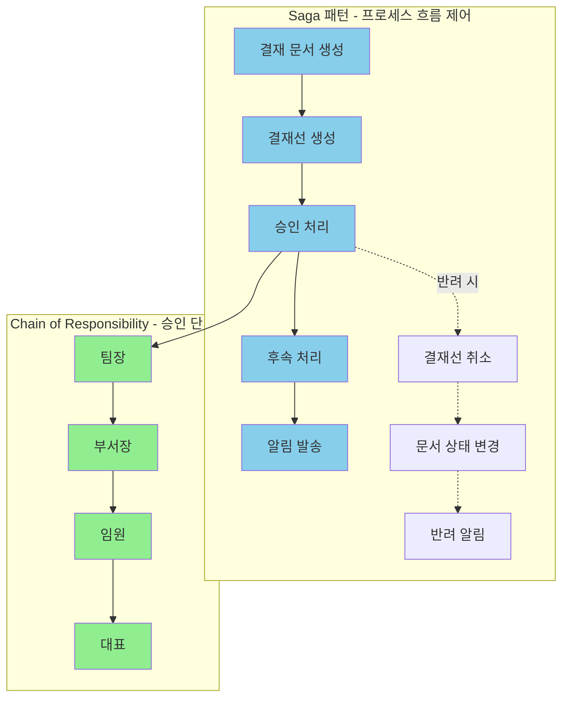
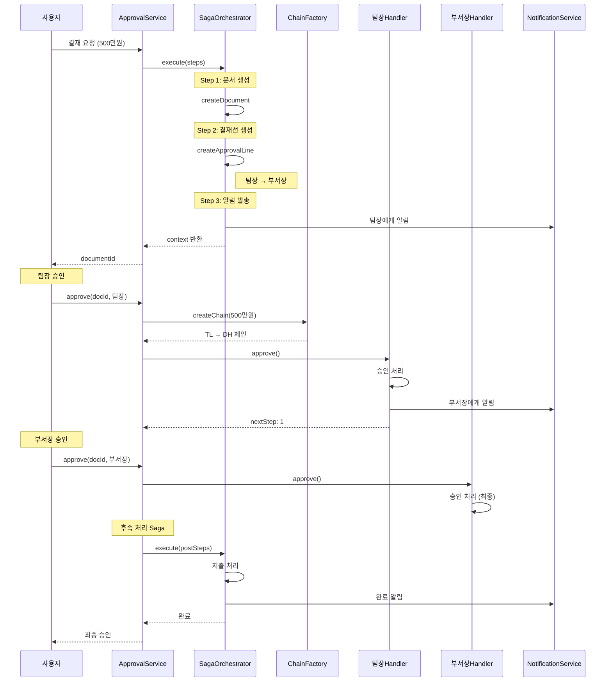

# 결재 시스템 설계: Saga + Chain of Responsibility

<Callout type="info" title="이 글에서 다루는 것">
  지금까지 배운 패턴들을 **실제 전자결재 시스템**에 적용합니다.

  - **Saga 패턴**: 결재 프로세스 전체의 트랜잭션 관리
  - **Chain of Responsibility**: 다단계 승인 체인 구현

  두 패턴을 어떻게 조합하는지, 실무에서 마주치는 문제들을 어떻게 해결하는지 알아봅니다.
</Callout>

"결재 시스템 만들어본 적 있어요?"

SI 프로젝트 면접에서 자주 나오는 질문입니다. 전자결재는 SI의 단골 메뉴입니다. 그리고 제대로 만들기 가장 어려운 시스템 중 하나이기도 합니다.

요구사항은 단순해 보입니다.

> "결재 요청하면 팀장이 승인하고, 금액 크면 부서장도 승인하고, 다 승인되면 처리해주세요."

하지만 실제로 들어가보면...

- 중간에 반려되면 이전 단계들은 어떻게?
- 결재자가 휴가면?
- 긴급 결재로 단계를 건너뛰려면?
- 결재선이 부서마다 다르면?
- 결재 중에 시스템이 죽으면?

이 글에서는 **Saga 패턴**과 **Chain of Responsibility 패턴**을 조합해 이 모든 문제를 우아하게 해결하는 방법을 알아봅니다.

---

## 시나리오: 인하우스 전자결재 시스템

### 요구사항

고객사로부터 다음과 같은 요구사항을 받았습니다.

<Callout type="warning" title="고객 요구사항">
1. **결재 유형**: 지출 결의, 휴가 신청, 구매 요청
2. **금액별 결재선**:
   - 100만원 이하: 팀장
   - 500만원 이하: 팀장 → 부서장
   - 1000만원 이하: 팀장 → 부서장 → 임원
   - 1000만원 초과: 팀장 → 부서장 → 임원 → 대표
3. **반려 처리**: 어느 단계에서든 반려 가능, 반려 시 신청자에게 알림
4. **부재 대응**: 결재자 부재 시 대리 결재자 자동 지정
5. **긴급 결재**: 특정 조건에서 단계 스킵 가능
6. **이력 관리**: 모든 결재 행위 로깅
7. **알림**: 각 단계마다 관련자에게 알림 발송
</Callout>

### 아키텍처 설계

두 패턴의 역할을 나눠봅시다.

<div className="my-6">

</div>

**역할 분담:**

<div className="grid grid-cols-1 md:grid-cols-2 gap-4 my-6">
  <Card title="Saga 패턴" icon={<Icon name="GitBranch" className="text-blue-500" />}>
    **전체 프로세스의 트랜잭션 관리**

    - 결재 문서 생성 → 결재선 생성 → 승인 → 후속 처리 → 알림
    - 중간 단계 실패 시 보상 트랜잭션 실행
    - 각 단계의 상태 추적
  </Card>
  <Card title="Chain of Responsibility" icon={<Icon name="Link" className="text-green-500" />}>
    **다단계 승인 로직**

    - 금액에 따른 동적 결재선
    - 각 결재자의 승인/반려 처리
    - 결재자 부재 시 대리 결재자 탐색
  </Card>
</div>

---

## 1단계: 도메인 모델 정의

먼저 결재 시스템의 핵심 도메인을 정의합니다.

```typescript
// domain/approval.types.ts

// 결재 문서
export interface ApprovalDocument {
  id: string;
  type: ApprovalType;
  title: string;
  content: string;
  amount: number;
  requesterId: string;
  requesterName: string;
  departmentId: string;
  status: ApprovalStatus;
  createdAt: Date;
  updatedAt: Date;
}

export type ApprovalType = 'EXPENSE' | 'LEAVE' | 'PURCHASE';

export type ApprovalStatus =
  | 'DRAFT'           // 임시저장
  | 'PENDING'         // 결재 대기
  | 'IN_PROGRESS'     // 결재 진행 중
  | 'APPROVED'        // 최종 승인
  | 'REJECTED'        // 반려
  | 'CANCELLED';      // 취소

// 결재선
export interface ApprovalLine {
  id: string;
  documentId: string;
  approvers: ApproverInfo[];
  currentStep: number;
  createdAt: Date;
}

// 결재자 정보
export interface ApproverInfo {
  step: number;
  approverId: string;
  approverName: string;
  role: ApproverRole;
  status: ApproverStatus;
  comment?: string;
  decidedAt?: Date;
  isSubstitute?: boolean;        // 대리 결재 여부
  originalApproverId?: string;   // 원래 결재자 (대리 결재 시)
}

export type ApproverRole =
  | 'TEAM_LEADER'
  | 'DEPT_HEAD'
  | 'EXECUTIVE'
  | 'CEO';

export type ApproverStatus =
  | 'WAITING'    // 대기
  | 'APPROVED'   // 승인
  | 'REJECTED'   // 반려
  | 'SKIPPED';   // 건너뜀

// 결재 요청
export interface ApprovalRequest {
  documentId: string;
  currentStep: number;
  amount: number;
  isUrgent?: boolean;
}

// 결재 결과
export interface ApprovalResult {
  success: boolean;
  handledBy: string;
  status: ApproverStatus;
  message?: string;
  nextStep?: number;
}

// 결재 이력
export interface ApprovalHistory {
  id: string;
  documentId: string;
  action: ApprovalAction;
  actorId: string;
  actorName: string;
  comment?: string;
  timestamp: Date;
  metadata?: Record<string, unknown>;
}

export type ApprovalAction =
  | 'CREATED'
  | 'SUBMITTED'
  | 'APPROVED'
  | 'REJECTED'
  | 'CANCELLED'
  | 'DELEGATED';
```

---

## 2단계: Chain of Responsibility - 결재 핸들러

### 핸들러 인터페이스

```typescript
// handlers/approval-handler.interface.ts

import { ApprovalRequest, ApprovalResult, ApproverRole } from '@/domain/approval.types';

export interface IApprovalHandler {
  readonly role: ApproverRole;
  readonly approvalLimit: number;

  setNext(handler: IApprovalHandler): IApprovalHandler;
  handle(request: ApprovalRequest): Promise<ApprovalResult>;

  // 이 핸들러가 처리할 수 있는지
  canHandle(request: ApprovalRequest): boolean;

  // 승인 처리
  approve(request: ApprovalRequest, comment?: string): Promise<ApprovalResult>;

  // 반려 처리
  reject(request: ApprovalRequest, reason: string): Promise<ApprovalResult>;
}
```

### 추상 핸들러 구현

```typescript
// handlers/base-approval-handler.ts

import {
  IApprovalHandler
} from './approval-handler.interface';
import {
  ApprovalRequest,
  ApprovalResult,
  ApproverRole
} from '@/domain/approval.types';

export abstract class BaseApprovalHandler implements IApprovalHandler {
  protected nextHandler: IApprovalHandler | null = null;

  abstract readonly role: ApproverRole;
  abstract readonly approvalLimit: number;

  constructor(
    protected readonly approverId: string,
    protected readonly approverName: string,
    protected readonly approvalRepository: ApprovalRepository,
    protected readonly notificationService: NotificationService,
    protected readonly historyService: ApprovalHistoryService,
  ) {}

  setNext(handler: IApprovalHandler): IApprovalHandler {
    this.nextHandler = handler;
    return handler;
  }

  canHandle(request: ApprovalRequest): boolean {
    // 기본: 금액이 한도 이내면 처리 가능
    return request.amount <= this.approvalLimit;
  }

  async handle(request: ApprovalRequest): Promise<ApprovalResult> {
    // 내가 처리할 수 있으면 현재 단계 승인 후 다음으로
    if (this.canHandle(request)) {
      // 이 결재자의 승인 처리
      const approveResult = await this.processApproval(request);

      if (!approveResult.success) {
        return approveResult;
      }

      // 최종 승인인지 확인
      if (!this.nextHandler || this.isLastApprover(request)) {
        return {
          success: true,
          handledBy: this.approverName,
          status: 'APPROVED',
          message: '최종 승인 완료',
        };
      }
    }

    // 다음 핸들러로 전달
    if (this.nextHandler) {
      return this.nextHandler.handle({
        ...request,
        currentStep: request.currentStep + 1,
      });
    }

    return {
      success: false,
      handledBy: this.approverName,
      status: 'WAITING',
      message: '결재 권한이 있는 결재자를 찾을 수 없습니다.',
    };
  }

  protected abstract processApproval(
    request: ApprovalRequest
  ): Promise<ApprovalResult>;

  protected isLastApprover(request: ApprovalRequest): boolean {
    // 금액이 현재 결재자의 한도 이내이고
    // 다음 결재자가 없거나 다음 결재자의 한도보다 작으면 최종
    if (request.amount <= this.approvalLimit) {
      if (!this.nextHandler) return true;
      return request.amount <= this.approvalLimit;
    }
    return false;
  }

  async approve(request: ApprovalRequest, comment?: string): Promise<ApprovalResult> {
    // 승인 저장
    await this.approvalRepository.updateApproverStatus(
      request.documentId,
      request.currentStep,
      'APPROVED',
      comment,
    );

    // 이력 저장
    await this.historyService.log({
      documentId: request.documentId,
      action: 'APPROVED',
      actorId: this.approverId,
      actorName: this.approverName,
      comment,
    });

    // 다음 단계로 진행
    return this.handle(request);
  }

  async reject(request: ApprovalRequest, reason: string): Promise<ApprovalResult> {
    // 반려 저장
    await this.approvalRepository.updateApproverStatus(
      request.documentId,
      request.currentStep,
      'REJECTED',
      reason,
    );

    // 문서 상태 변경
    await this.approvalRepository.updateDocumentStatus(
      request.documentId,
      'REJECTED',
    );

    // 이력 저장
    await this.historyService.log({
      documentId: request.documentId,
      action: 'REJECTED',
      actorId: this.approverId,
      actorName: this.approverName,
      comment: reason,
    });

    // 신청자에게 반려 알림
    const document = await this.approvalRepository.getDocument(request.documentId);
    await this.notificationService.send(document.requesterId, {
      title: '결재 반려',
      message: `${this.approverName}님이 결재를 반려했습니다. 사유: ${reason}`,
    });

    return {
      success: false,
      handledBy: this.approverName,
      status: 'REJECTED',
      message: reason,
    };
  }
}
```

### 구체적 핸들러 구현

```typescript
// handlers/team-leader-handler.ts

import { BaseApprovalHandler } from './base-approval-handler';
import { ApprovalRequest, ApprovalResult } from '@/domain/approval.types';

export class TeamLeaderHandler extends BaseApprovalHandler {
  readonly role = 'TEAM_LEADER' as const;
  readonly approvalLimit = 1_000_000; // 100만원

  protected async processApproval(
    request: ApprovalRequest
  ): Promise<ApprovalResult> {
    // 팀장 승인 로직
    await this.approvalRepository.updateApproverStatus(
      request.documentId,
      request.currentStep,
      'APPROVED',
    );

    await this.historyService.log({
      documentId: request.documentId,
      action: 'APPROVED',
      actorId: this.approverId,
      actorName: this.approverName,
    });

    // 다음 결재자에게 알림 (있는 경우)
    if (this.nextHandler && request.amount > this.approvalLimit) {
      const nextApprover = await this.approvalRepository.getApprover(
        request.documentId,
        request.currentStep + 1,
      );

      if (nextApprover) {
        await this.notificationService.send(nextApprover.approverId, {
          title: '결재 요청',
          message: `${this.approverName}님이 승인한 결재가 도착했습니다.`,
        });
      }
    }

    return {
      success: true,
      handledBy: this.approverName,
      status: 'APPROVED',
      message: '팀장 승인 완료',
      nextStep: request.currentStep + 1,
    };
  }
}
```

```typescript
// handlers/department-head-handler.ts

import { BaseApprovalHandler } from './base-approval-handler';
import { ApprovalRequest, ApprovalResult } from '@/domain/approval.types';

export class DepartmentHeadHandler extends BaseApprovalHandler {
  readonly role = 'DEPT_HEAD' as const;
  readonly approvalLimit = 5_000_000; // 500만원

  protected async processApproval(
    request: ApprovalRequest
  ): Promise<ApprovalResult> {
    // 부서장은 추가 검토 로직이 있을 수 있음
    const document = await this.approvalRepository.getDocument(request.documentId);

    // 예: 특정 유형은 추가 서류 필요
    if (document.type === 'PURCHASE' && request.amount > 3_000_000) {
      const hasRequiredDocs = await this.checkRequiredDocuments(request.documentId);
      if (!hasRequiredDocs) {
        return {
          success: false,
          handledBy: this.approverName,
          status: 'WAITING',
          message: '구매 요청 300만원 초과 시 견적서 첨부가 필요합니다.',
        };
      }
    }

    await this.approvalRepository.updateApproverStatus(
      request.documentId,
      request.currentStep,
      'APPROVED',
    );

    await this.historyService.log({
      documentId: request.documentId,
      action: 'APPROVED',
      actorId: this.approverId,
      actorName: this.approverName,
    });

    if (this.nextHandler && request.amount > this.approvalLimit) {
      const nextApprover = await this.approvalRepository.getApprover(
        request.documentId,
        request.currentStep + 1,
      );

      if (nextApprover) {
        await this.notificationService.send(nextApprover.approverId, {
          title: '결재 요청',
          message: `${this.approverName}님이 승인한 결재가 도착했습니다.`,
        });
      }
    }

    return {
      success: true,
      handledBy: this.approverName,
      status: 'APPROVED',
      message: '부서장 승인 완료',
      nextStep: request.currentStep + 1,
    };
  }

  private async checkRequiredDocuments(documentId: string): Promise<boolean> {
    const attachments = await this.approvalRepository.getAttachments(documentId);
    return attachments.some(a => a.type === 'QUOTATION');
  }
}
```

```typescript
// handlers/executive-handler.ts

import { BaseApprovalHandler } from './base-approval-handler';
import { ApprovalRequest, ApprovalResult } from '@/domain/approval.types';

export class ExecutiveHandler extends BaseApprovalHandler {
  readonly role = 'EXECUTIVE' as const;
  readonly approvalLimit = 10_000_000; // 1000만원

  constructor(
    approverId: string,
    approverName: string,
    approvalRepository: ApprovalRepository,
    notificationService: NotificationService,
    historyService: ApprovalHistoryService,
    private readonly financeService: FinanceService,
  ) {
    super(approverId, approverName, approvalRepository, notificationService, historyService);
  }

  protected async processApproval(
    request: ApprovalRequest
  ): Promise<ApprovalResult> {
    // 임원 결재는 재무팀 사전 검토 연동
    if (request.amount > 7_000_000) {
      const financeReview = await this.financeService.requestReview(request.documentId);

      if (!financeReview.approved) {
        return {
          success: false,
          handledBy: this.approverName,
          status: 'WAITING',
          message: `재무팀 검토 필요: ${financeReview.comment}`,
        };
      }
    }

    await this.approvalRepository.updateApproverStatus(
      request.documentId,
      request.currentStep,
      'APPROVED',
    );

    await this.historyService.log({
      documentId: request.documentId,
      action: 'APPROVED',
      actorId: this.approverId,
      actorName: this.approverName,
      metadata: {
        financeReviewed: request.amount > 7_000_000,
      },
    });

    return {
      success: true,
      handledBy: this.approverName,
      status: 'APPROVED',
      message: '임원 승인 완료',
      nextStep: request.currentStep + 1,
    };
  }
}
```

```typescript
// handlers/ceo-handler.ts

import { BaseApprovalHandler } from './base-approval-handler';
import { ApprovalRequest, ApprovalResult } from '@/domain/approval.types';

export class CEOHandler extends BaseApprovalHandler {
  readonly role = 'CEO' as const;
  readonly approvalLimit = Infinity; // 무제한

  // 대표는 모든 요청 처리 가능
  canHandle(request: ApprovalRequest): boolean {
    return true;
  }

  protected async processApproval(
    request: ApprovalRequest
  ): Promise<ApprovalResult> {
    // 대표 결재는 이사회 보고 연동 (5천만원 초과)
    if (request.amount > 50_000_000) {
      await this.notifyBoardOfDirectors(request);
    }

    await this.approvalRepository.updateApproverStatus(
      request.documentId,
      request.currentStep,
      'APPROVED',
    );

    // 문서 최종 승인 처리
    await this.approvalRepository.updateDocumentStatus(
      request.documentId,
      'APPROVED',
    );

    await this.historyService.log({
      documentId: request.documentId,
      action: 'APPROVED',
      actorId: this.approverId,
      actorName: this.approverName,
      metadata: {
        isFinalApproval: true,
        boardNotified: request.amount > 50_000_000,
      },
    });

    return {
      success: true,
      handledBy: this.approverName,
      status: 'APPROVED',
      message: '대표이사 최종 승인 완료',
    };
  }

  private async notifyBoardOfDirectors(request: ApprovalRequest): Promise<void> {
    // 이사회 보고 로직
  }
}
```

### 대리 결재 처리 (Decorator 패턴 활용)

```typescript
// handlers/substitute-handler-decorator.ts

import { IApprovalHandler } from './approval-handler.interface';
import { ApprovalRequest, ApprovalResult, ApproverRole } from '@/domain/approval.types';

export class SubstituteHandlerDecorator implements IApprovalHandler {
  constructor(
    private readonly wrappedHandler: IApprovalHandler,
    private readonly userService: UserService,
    private readonly approvalRepository: ApprovalRepository,
  ) {}

  get role(): ApproverRole {
    return this.wrappedHandler.role;
  }

  get approvalLimit(): number {
    return this.wrappedHandler.approvalLimit;
  }

  setNext(handler: IApprovalHandler): IApprovalHandler {
    return this.wrappedHandler.setNext(handler);
  }

  canHandle(request: ApprovalRequest): boolean {
    return this.wrappedHandler.canHandle(request);
  }

  async handle(request: ApprovalRequest): Promise<ApprovalResult> {
    // 현재 결재자가 부재인지 확인
    const currentApprover = await this.approvalRepository.getApprover(
      request.documentId,
      request.currentStep,
    );

    if (!currentApprover) {
      return this.wrappedHandler.handle(request);
    }

    const isOnLeave = await this.userService.isOnLeave(currentApprover.approverId);

    if (isOnLeave) {
      // 대리 결재자 찾기
      const substitute = await this.userService.getSubstitute(currentApprover.approverId);

      if (substitute) {
        // 대리 결재자로 교체
        await this.approvalRepository.updateApproverAsSubstitute(
          request.documentId,
          request.currentStep,
          substitute.id,
          substitute.name,
          currentApprover.approverId,
        );

        // 대리 결재 알림
        await this.notifySubstitution(
          request.documentId,
          currentApprover.approverName,
          substitute.name,
        );
      } else {
        // 대리 결재자가 없으면 다음 단계로 스킵
        await this.approvalRepository.updateApproverStatus(
          request.documentId,
          request.currentStep,
          'SKIPPED',
          `${currentApprover.approverName} 부재, 대리 결재자 없음`,
        );

        // 다음 핸들러로 전달
        const nextHandler = (this.wrappedHandler as any).nextHandler;
        if (nextHandler) {
          return nextHandler.handle({
            ...request,
            currentStep: request.currentStep + 1,
          });
        }
      }
    }

    return this.wrappedHandler.handle(request);
  }

  async approve(request: ApprovalRequest, comment?: string): Promise<ApprovalResult> {
    return this.wrappedHandler.approve(request, comment);
  }

  async reject(request: ApprovalRequest, reason: string): Promise<ApprovalResult> {
    return this.wrappedHandler.reject(request, reason);
  }

  private async notifySubstitution(
    documentId: string,
    originalName: string,
    substituteName: string,
  ): Promise<void> {
    // 대리 결재 알림 발송
  }
}
```

---

## 3단계: Saga 패턴 - 결재 프로세스 관리

### Saga Step 인터페이스

```typescript
// saga/saga-step.interface.ts

export interface SagaContext {
  documentId: string;
  requesterId: string;
  amount: number;
  type: ApprovalType;
  departmentId: string;

  // 각 Step에서 저장하는 결과
  results: Record<string, any>;

  // 메타데이터
  metadata: Record<string, unknown>;
}

export interface SagaStep {
  readonly name: string;

  execute(context: SagaContext): Promise<void>;
  compensate(context: SagaContext): Promise<void>;
}
```

### Saga Orchestrator

```typescript
// saga/approval-saga-orchestrator.ts

import { Injectable, Logger } from '@nestjs/common';
import { SagaStep, SagaContext } from './saga-step.interface';

@Injectable()
export class ApprovalSagaOrchestrator {
  private readonly logger = new Logger(ApprovalSagaOrchestrator.name);

  async execute(steps: SagaStep[], initialContext: Partial<SagaContext>): Promise<SagaContext> {
    const context: SagaContext = {
      documentId: initialContext.documentId!,
      requesterId: initialContext.requesterId!,
      amount: initialContext.amount!,
      type: initialContext.type!,
      departmentId: initialContext.departmentId!,
      results: {},
      metadata: initialContext.metadata || {},
    };

    let executedSteps: SagaStep[] = [];

    try {
      for (const step of steps) {
        this.logger.log(`Executing step: ${step.name}`);

        await step.execute(context);
        executedSteps.push(step);

        this.logger.log(`Step ${step.name} completed`);
      }

      return context;
    } catch (error) {
      this.logger.error(`Step failed: ${error.message}`);

      // 보상 트랜잭션 실행
      await this.compensate(executedSteps, context);

      throw error;
    }
  }

  private async compensate(executedSteps: SagaStep[], context: SagaContext): Promise<void> {
    this.logger.warn('Starting compensation...');

    // 역순으로 보상
    for (let i = executedSteps.length - 1; i >= 0; i--) {
      const step = executedSteps[i];

      try {
        this.logger.log(`Compensating step: ${step.name}`);
        await step.compensate(context);
        this.logger.log(`Step ${step.name} compensated`);
      } catch (compensationError) {
        this.logger.error(
          `Failed to compensate ${step.name}: ${compensationError.message}`
        );
        // 보상 실패는 로깅 후 계속 진행
        await this.logCompensationFailure(step.name, compensationError, context);
      }
    }

    this.logger.warn('Compensation completed');
  }

  private async logCompensationFailure(
    stepName: string,
    error: Error,
    context: SagaContext,
  ): Promise<void> {
    // 보상 실패 로깅 (관리자 알림 등)
  }
}
```

### Saga Steps 구현

```typescript
// saga/steps/create-document.step.ts

import { Injectable } from '@nestjs/common';
import { SagaStep, SagaContext } from '../saga-step.interface';

@Injectable()
export class CreateDocumentStep implements SagaStep {
  readonly name = 'createDocument';

  constructor(
    private readonly approvalRepository: ApprovalRepository,
    private readonly historyService: ApprovalHistoryService,
  ) {}

  async execute(context: SagaContext): Promise<void> {
    // 결재 문서 생성
    const document = await this.approvalRepository.createDocument({
      id: context.documentId,
      type: context.type,
      amount: context.amount,
      requesterId: context.requesterId,
      departmentId: context.departmentId,
      status: 'PENDING',
    });

    context.results[this.name] = document;

    // 이력 저장
    await this.historyService.log({
      documentId: context.documentId,
      action: 'CREATED',
      actorId: context.requesterId,
      actorName: await this.getRequesterName(context.requesterId),
    });
  }

  async compensate(context: SagaContext): Promise<void> {
    // 문서 삭제 또는 취소 상태로 변경
    await this.approvalRepository.updateDocumentStatus(
      context.documentId,
      'CANCELLED',
    );

    await this.historyService.log({
      documentId: context.documentId,
      action: 'CANCELLED',
      actorId: 'SYSTEM',
      actorName: 'System',
      comment: '결재 프로세스 실패로 인한 자동 취소',
    });
  }

  private async getRequesterName(requesterId: string): Promise<string> {
    // 사용자 이름 조회
    return 'Unknown';
  }
}
```

```typescript
// saga/steps/create-approval-line.step.ts

import { Injectable } from '@nestjs/common';
import { SagaStep, SagaContext } from '../saga-step.interface';

@Injectable()
export class CreateApprovalLineStep implements SagaStep {
  readonly name = 'createApprovalLine';

  constructor(
    private readonly approvalRepository: ApprovalRepository,
    private readonly approvalLineFactory: ApprovalLineFactory,
  ) {}

  async execute(context: SagaContext): Promise<void> {
    // 금액과 부서에 따른 결재선 생성
    const approvers = await this.approvalLineFactory.createLine(
      context.departmentId,
      context.amount,
      context.type,
    );

    const approvalLine = await this.approvalRepository.createApprovalLine({
      documentId: context.documentId,
      approvers,
      currentStep: 0,
    });

    context.results[this.name] = approvalLine;
  }

  async compensate(context: SagaContext): Promise<void> {
    // 결재선 삭제
    await this.approvalRepository.deleteApprovalLine(context.documentId);
  }
}
```

```typescript
// saga/steps/notify-first-approver.step.ts

import { Injectable } from '@nestjs/common';
import { SagaStep, SagaContext } from '../saga-step.interface';

@Injectable()
export class NotifyFirstApproverStep implements SagaStep {
  readonly name = 'notifyFirstApprover';

  constructor(
    private readonly approvalRepository: ApprovalRepository,
    private readonly notificationService: NotificationService,
  ) {}

  async execute(context: SagaContext): Promise<void> {
    const approvalLine = context.results['createApprovalLine'];

    if (!approvalLine || approvalLine.approvers.length === 0) {
      throw new Error('결재선이 없습니다.');
    }

    const firstApprover = approvalLine.approvers[0];

    // 첫 번째 결재자에게 알림
    await this.notificationService.send(firstApprover.approverId, {
      title: '결재 요청',
      message: `새로운 결재 요청이 도착했습니다. (금액: ${context.amount.toLocaleString()}원)`,
      data: {
        documentId: context.documentId,
        type: 'APPROVAL_REQUEST',
      },
    });

    context.results[this.name] = {
      notifiedTo: firstApprover.approverId,
      notifiedAt: new Date(),
    };
  }

  async compensate(context: SagaContext): Promise<void> {
    const notifyResult = context.results[this.name];

    if (notifyResult) {
      // 취소 알림 발송
      await this.notificationService.send(notifyResult.notifiedTo, {
        title: '결재 요청 취소',
        message: '이전에 요청된 결재가 취소되었습니다.',
        data: {
          documentId: context.documentId,
          type: 'APPROVAL_CANCELLED',
        },
      });
    }
  }
}
```

```typescript
// saga/steps/process-approval-chain.step.ts

import { Injectable } from '@nestjs/common';
import { SagaStep, SagaContext } from '../saga-step.interface';

@Injectable()
export class ProcessApprovalChainStep implements SagaStep {
  readonly name = 'processApprovalChain';

  constructor(
    private readonly approvalChainFactory: ApprovalChainFactory,
    private readonly approvalRepository: ApprovalRepository,
  ) {}

  async execute(context: SagaContext): Promise<void> {
    // Chain of Responsibility 체인 생성
    const chain = await this.approvalChainFactory.createChain(
      context.departmentId,
      context.amount,
    );

    // 체인 실행 (첫 번째 결재자부터)
    const result = await chain.handle({
      documentId: context.documentId,
      currentStep: 0,
      amount: context.amount,
      isUrgent: context.metadata.isUrgent as boolean,
    });

    context.results[this.name] = result;

    // 최종 승인이면 문서 상태 업데이트
    if (result.success && result.status === 'APPROVED') {
      await this.approvalRepository.updateDocumentStatus(
        context.documentId,
        'APPROVED',
      );
    }
  }

  async compensate(context: SagaContext): Promise<void> {
    // 승인 상태 롤백
    const approvalLine = context.results['createApprovalLine'];

    if (approvalLine) {
      // 모든 결재자 상태를 WAITING으로 복원
      for (const approver of approvalLine.approvers) {
        await this.approvalRepository.updateApproverStatus(
          context.documentId,
          approver.step,
          'WAITING',
          '시스템 롤백',
        );
      }
    }

    // 문서 상태 복원
    await this.approvalRepository.updateDocumentStatus(
      context.documentId,
      'PENDING',
    );
  }
}
```

```typescript
// saga/steps/execute-post-approval.step.ts

import { Injectable } from '@nestjs/common';
import { SagaStep, SagaContext } from '../saga-step.interface';

@Injectable()
export class ExecutePostApprovalStep implements SagaStep {
  readonly name = 'executePostApproval';

  constructor(
    private readonly expenseService: ExpenseService,
    private readonly leaveService: LeaveService,
    private readonly purchaseService: PurchaseService,
  ) {}

  async execute(context: SagaContext): Promise<void> {
    const chainResult = context.results['processApprovalChain'];

    // 최종 승인된 경우만 후속 처리
    if (!chainResult?.success || chainResult.status !== 'APPROVED') {
      context.results[this.name] = { skipped: true };
      return;
    }

    // 결재 유형별 후속 처리
    switch (context.type) {
      case 'EXPENSE':
        const expense = await this.expenseService.process(context.documentId);
        context.results[this.name] = { type: 'expense', result: expense };
        break;

      case 'LEAVE':
        const leave = await this.leaveService.register(context.documentId);
        context.results[this.name] = { type: 'leave', result: leave };
        break;

      case 'PURCHASE':
        const purchase = await this.purchaseService.createOrder(context.documentId);
        context.results[this.name] = { type: 'purchase', result: purchase };
        break;
    }
  }

  async compensate(context: SagaContext): Promise<void> {
    const postResult = context.results[this.name];

    if (postResult?.skipped) {
      return;
    }

    // 유형별 후속 처리 취소
    switch (postResult?.type) {
      case 'expense':
        await this.expenseService.cancel(postResult.result.id);
        break;

      case 'leave':
        await this.leaveService.cancel(postResult.result.id);
        break;

      case 'purchase':
        await this.purchaseService.cancelOrder(postResult.result.id);
        break;
    }
  }
}
```

```typescript
// saga/steps/send-completion-notification.step.ts

import { Injectable } from '@nestjs/common';
import { SagaStep, SagaContext } from '../saga-step.interface';

@Injectable()
export class SendCompletionNotificationStep implements SagaStep {
  readonly name = 'sendCompletionNotification';

  constructor(
    private readonly notificationService: NotificationService,
    private readonly approvalRepository: ApprovalRepository,
  ) {}

  async execute(context: SagaContext): Promise<void> {
    const chainResult = context.results['processApprovalChain'];

    if (!chainResult?.success) {
      return;
    }

    const document = await this.approvalRepository.getDocument(context.documentId);

    // 신청자에게 완료 알림
    await this.notificationService.send(context.requesterId, {
      title: '결재 완료',
      message: `${document.title} 결재가 최종 승인되었습니다.`,
      data: {
        documentId: context.documentId,
        type: 'APPROVAL_COMPLETED',
      },
    });

    context.results[this.name] = { sent: true };
  }

  async compensate(context: SagaContext): Promise<void> {
    // 알림은 보상 불필요 (이미 보낸 알림 취소 불가)
    // 필요시 "결재 취소" 알림을 추가로 보낼 수 있음
  }
}
```

---

## 4단계: 서비스 통합

### Approval Chain Factory

```typescript
// factories/approval-chain-factory.ts

import { Injectable } from '@nestjs/common';
import { IApprovalHandler } from '@/handlers/approval-handler.interface';
import { TeamLeaderHandler } from '@/handlers/team-leader-handler';
import { DepartmentHeadHandler } from '@/handlers/department-head-handler';
import { ExecutiveHandler } from '@/handlers/executive-handler';
import { CEOHandler } from '@/handlers/ceo-handler';
import { SubstituteHandlerDecorator } from '@/handlers/substitute-handler-decorator';

@Injectable()
export class ApprovalChainFactory {
  constructor(
    private readonly userService: UserService,
    private readonly approvalRepository: ApprovalRepository,
    private readonly notificationService: NotificationService,
    private readonly historyService: ApprovalHistoryService,
    private readonly financeService: FinanceService,
  ) {}

  async createChain(
    departmentId: string,
    amount: number,
  ): Promise<IApprovalHandler> {
    const handlers: IApprovalHandler[] = [];

    // 팀장 (필수)
    const teamLeader = await this.userService.getTeamLeader(departmentId);
    handlers.push(
      this.wrapWithSubstitute(
        new TeamLeaderHandler(
          teamLeader.id,
          teamLeader.name,
          this.approvalRepository,
          this.notificationService,
          this.historyService,
        )
      )
    );

    // 부서장 (100만원 초과)
    if (amount > 1_000_000) {
      const deptHead = await this.userService.getDepartmentHead(departmentId);
      handlers.push(
        this.wrapWithSubstitute(
          new DepartmentHeadHandler(
            deptHead.id,
            deptHead.name,
            this.approvalRepository,
            this.notificationService,
            this.historyService,
          )
        )
      );
    }

    // 임원 (500만원 초과)
    if (amount > 5_000_000) {
      const executive = await this.userService.getExecutive(departmentId);
      handlers.push(
        this.wrapWithSubstitute(
          new ExecutiveHandler(
            executive.id,
            executive.name,
            this.approvalRepository,
            this.notificationService,
            this.historyService,
            this.financeService,
          )
        )
      );
    }

    // 대표 (1000만원 초과)
    if (amount > 10_000_000) {
      const ceo = await this.userService.getCEO();
      handlers.push(
        new CEOHandler(
          ceo.id,
          ceo.name,
          this.approvalRepository,
          this.notificationService,
          this.historyService,
        )
      );
    }

    // 체인 연결
    for (let i = 0; i < handlers.length - 1; i++) {
      handlers[i].setNext(handlers[i + 1]);
    }

    return handlers[0];
  }

  private wrapWithSubstitute(handler: IApprovalHandler): IApprovalHandler {
    return new SubstituteHandlerDecorator(
      handler,
      this.userService,
      this.approvalRepository,
    );
  }
}
```

### Approval Line Factory

```typescript
// factories/approval-line-factory.ts

import { Injectable } from '@nestjs/common';
import { ApproverInfo, ApprovalType } from '@/domain/approval.types';

@Injectable()
export class ApprovalLineFactory {
  constructor(private readonly userService: UserService) {}

  async createLine(
    departmentId: string,
    amount: number,
    type: ApprovalType,
  ): Promise<ApproverInfo[]> {
    const approvers: ApproverInfo[] = [];
    let step = 0;

    // 팀장 (필수)
    const teamLeader = await this.userService.getTeamLeader(departmentId);
    approvers.push({
      step: step++,
      approverId: teamLeader.id,
      approverName: teamLeader.name,
      role: 'TEAM_LEADER',
      status: 'WAITING',
    });

    // 부서장 (100만원 초과)
    if (amount > 1_000_000) {
      const deptHead = await this.userService.getDepartmentHead(departmentId);
      approvers.push({
        step: step++,
        approverId: deptHead.id,
        approverName: deptHead.name,
        role: 'DEPT_HEAD',
        status: 'WAITING',
      });
    }

    // 임원 (500만원 초과)
    if (amount > 5_000_000) {
      const executive = await this.userService.getExecutive(departmentId);
      approvers.push({
        step: step++,
        approverId: executive.id,
        approverName: executive.name,
        role: 'EXECUTIVE',
        status: 'WAITING',
      });
    }

    // 대표 (1000만원 초과)
    if (amount > 10_000_000) {
      const ceo = await this.userService.getCEO();
      approvers.push({
        step: step++,
        approverId: ceo.id,
        approverName: ceo.name,
        role: 'CEO',
        status: 'WAITING',
      });
    }

    return approvers;
  }
}
```

### Approval Service

```typescript
// services/approval.service.ts

import { Injectable } from '@nestjs/common';
import { ApprovalSagaOrchestrator } from '@/saga/approval-saga-orchestrator';
import { CreateDocumentStep } from '@/saga/steps/create-document.step';
import { CreateApprovalLineStep } from '@/saga/steps/create-approval-line.step';
import { NotifyFirstApproverStep } from '@/saga/steps/notify-first-approver.step';
import { ProcessApprovalChainStep } from '@/saga/steps/process-approval-chain.step';
import { ExecutePostApprovalStep } from '@/saga/steps/execute-post-approval.step';
import { SendCompletionNotificationStep } from '@/saga/steps/send-completion-notification.step';
import { ApprovalChainFactory } from '@/factories/approval-chain-factory';

@Injectable()
export class ApprovalService {
  constructor(
    private readonly sagaOrchestrator: ApprovalSagaOrchestrator,
    private readonly createDocumentStep: CreateDocumentStep,
    private readonly createApprovalLineStep: CreateApprovalLineStep,
    private readonly notifyFirstApproverStep: NotifyFirstApproverStep,
    private readonly processApprovalChainStep: ProcessApprovalChainStep,
    private readonly executePostApprovalStep: ExecutePostApprovalStep,
    private readonly sendCompletionNotificationStep: SendCompletionNotificationStep,
    private readonly approvalChainFactory: ApprovalChainFactory,
    private readonly approvalRepository: ApprovalRepository,
  ) {}

  // 결재 요청 제출
  async submitApproval(data: {
    type: ApprovalType;
    title: string;
    content: string;
    amount: number;
    requesterId: string;
    departmentId: string;
    isUrgent?: boolean;
  }) {
    const documentId = crypto.randomUUID();

    const steps = [
      this.createDocumentStep,
      this.createApprovalLineStep,
      this.notifyFirstApproverStep,
    ];

    const context = await this.sagaOrchestrator.execute(steps, {
      documentId,
      requesterId: data.requesterId,
      amount: data.amount,
      type: data.type,
      departmentId: data.departmentId,
      metadata: {
        title: data.title,
        content: data.content,
        isUrgent: data.isUrgent,
      },
    });

    return {
      documentId: context.documentId,
      approvalLine: context.results['createApprovalLine'],
    };
  }

  // 결재 승인
  async approve(documentId: string, approverId: string, comment?: string) {
    const document = await this.approvalRepository.getDocument(documentId);
    const approvalLine = await this.approvalRepository.getApprovalLine(documentId);

    // 현재 결재자 확인
    const currentStep = approvalLine.currentStep;
    const currentApprover = approvalLine.approvers[currentStep];

    if (currentApprover.approverId !== approverId) {
      throw new Error('현재 결재 순서가 아닙니다.');
    }

    // Chain of Responsibility로 승인 처리
    const chain = await this.approvalChainFactory.createChain(
      document.departmentId,
      document.amount,
    );

    const result = await chain.approve(
      {
        documentId,
        currentStep,
        amount: document.amount,
      },
      comment,
    );

    // 최종 승인인 경우 후속 처리
    if (result.success && result.status === 'APPROVED' && !result.nextStep) {
      await this.executePostApprovalProcessing(documentId, document);
    }

    return result;
  }

  // 결재 반려
  async reject(documentId: string, approverId: string, reason: string) {
    const document = await this.approvalRepository.getDocument(documentId);
    const approvalLine = await this.approvalRepository.getApprovalLine(documentId);

    const currentStep = approvalLine.currentStep;
    const currentApprover = approvalLine.approvers[currentStep];

    if (currentApprover.approverId !== approverId) {
      throw new Error('현재 결재 순서가 아닙니다.');
    }

    const chain = await this.approvalChainFactory.createChain(
      document.departmentId,
      document.amount,
    );

    return chain.reject(
      {
        documentId,
        currentStep,
        amount: document.amount,
      },
      reason,
    );
  }

  private async executePostApprovalProcessing(
    documentId: string,
    document: ApprovalDocument,
  ) {
    const steps = [
      this.executePostApprovalStep,
      this.sendCompletionNotificationStep,
    ];

    await this.sagaOrchestrator.execute(steps, {
      documentId,
      requesterId: document.requesterId,
      amount: document.amount,
      type: document.type,
      departmentId: document.departmentId,
      results: {
        processApprovalChain: { success: true, status: 'APPROVED' },
      },
    } as any);
  }
}
```

---

## 5단계: API 엔드포인트

### Next.js Server Actions

```typescript
// app/approvals/actions.ts
'use server';

import { revalidatePath } from 'next/cache';
import { ApprovalService } from '@/services/approval.service';
import { getServerSession } from 'next-auth';

const approvalService = new ApprovalService(/* ... DI ... */);

export async function submitApprovalRequest(formData: FormData) {
  const session = await getServerSession();

  if (!session?.user) {
    throw new Error('로그인이 필요합니다.');
  }

  const result = await approvalService.submitApproval({
    type: formData.get('type') as ApprovalType,
    title: formData.get('title') as string,
    content: formData.get('content') as string,
    amount: parseInt(formData.get('amount') as string),
    requesterId: session.user.id,
    departmentId: session.user.departmentId,
    isUrgent: formData.get('isUrgent') === 'true',
  });

  revalidatePath('/approvals');

  return result;
}

export async function approveDocument(documentId: string, comment?: string) {
  const session = await getServerSession();

  if (!session?.user) {
    throw new Error('로그인이 필요합니다.');
  }

  const result = await approvalService.approve(
    documentId,
    session.user.id,
    comment,
  );

  revalidatePath('/approvals');
  revalidatePath(`/approvals/${documentId}`);

  return result;
}

export async function rejectDocument(documentId: string, reason: string) {
  const session = await getServerSession();

  if (!session?.user) {
    throw new Error('로그인이 필요합니다.');
  }

  if (!reason.trim()) {
    throw new Error('반려 사유를 입력해주세요.');
  }

  const result = await approvalService.reject(
    documentId,
    session.user.id,
    reason,
  );

  revalidatePath('/approvals');
  revalidatePath(`/approvals/${documentId}`);

  return result;
}
```

### React 컴포넌트

```tsx
// components/ApprovalForm.tsx
'use client';

import { useFormState } from 'react-dom';
import { submitApprovalRequest } from '@/app/approvals/actions';

export function ApprovalForm() {
  const [state, formAction] = useFormState(submitApprovalRequest, null);

  return (
    <form action={formAction} className="space-y-4">
      <div>
        <label>결재 유형</label>
        <select name="type" required>
          <option value="EXPENSE">지출 결의</option>
          <option value="LEAVE">휴가 신청</option>
          <option value="PURCHASE">구매 요청</option>
        </select>
      </div>

      <div>
        <label>제목</label>
        <input type="text" name="title" required />
      </div>

      <div>
        <label>금액</label>
        <input type="number" name="amount" required min={0} />
      </div>

      <div>
        <label>내용</label>
        <textarea name="content" required rows={5} />
      </div>

      <div className="flex items-center gap-2">
        <input type="checkbox" name="isUrgent" id="isUrgent" value="true" />
        <label htmlFor="isUrgent">긴급 결재</label>
      </div>

      <button type="submit" className="btn-primary">
        결재 요청
      </button>

      {state?.documentId && (
        <p className="text-green-600">
          결재가 요청되었습니다. (문서 ID: {state.documentId})
        </p>
      )}
    </form>
  );
}
```

```tsx
// components/ApprovalDetail.tsx
'use client';

import { approveDocument, rejectDocument } from '@/app/approvals/actions';
import { useState } from 'react';

interface Props {
  document: ApprovalDocument;
  approvalLine: ApprovalLine;
  currentUserId: string;
}

export function ApprovalDetail({ document, approvalLine, currentUserId }: Props) {
  const [comment, setComment] = useState('');
  const [rejectReason, setRejectReason] = useState('');
  const [isSubmitting, setIsSubmitting] = useState(false);

  const currentApprover = approvalLine.approvers[approvalLine.currentStep];
  const isCurrentApprover = currentApprover?.approverId === currentUserId;
  const canApprove = isCurrentApprover && currentApprover?.status === 'WAITING';

  const handleApprove = async () => {
    setIsSubmitting(true);
    try {
      await approveDocument(document.id, comment);
    } catch (error) {
      alert(error.message);
    } finally {
      setIsSubmitting(false);
    }
  };

  const handleReject = async () => {
    if (!rejectReason.trim()) {
      alert('반려 사유를 입력해주세요.');
      return;
    }

    setIsSubmitting(true);
    try {
      await rejectDocument(document.id, rejectReason);
    } catch (error) {
      alert(error.message);
    } finally {
      setIsSubmitting(false);
    }
  };

  return (
    <div className="space-y-6">
      {/* 문서 정보 */}
      <section>
        <h2 className="text-xl font-bold">{document.title}</h2>
        <p className="text-gray-600">{document.content}</p>
        <p className="text-lg font-semibold">
          금액: {document.amount.toLocaleString()}원
        </p>
      </section>

      {/* 결재선 현황 */}
      <section>
        <h3 className="font-bold mb-4">결재 현황</h3>
        <ApprovalLineStatus approvers={approvalLine.approvers} />
      </section>

      {/* 승인/반려 버튼 */}
      {canApprove && (
        <section className="space-y-4 border-t pt-4">
          <div>
            <label>코멘트 (선택)</label>
            <textarea
              value={comment}
              onChange={(e) => setComment(e.target.value)}
              rows={2}
              className="w-full border rounded p-2"
            />
          </div>

          <div className="flex gap-4">
            <button
              onClick={handleApprove}
              disabled={isSubmitting}
              className="btn-primary"
            >
              승인
            </button>

            <button
              onClick={() => setShowRejectDialog(true)}
              disabled={isSubmitting}
              className="btn-danger"
            >
              반려
            </button>
          </div>

          {/* 반려 사유 입력 */}
          <div>
            <label>반려 사유</label>
            <textarea
              value={rejectReason}
              onChange={(e) => setRejectReason(e.target.value)}
              rows={3}
              className="w-full border rounded p-2"
              placeholder="반려 사유를 입력해주세요..."
            />
            <button
              onClick={handleReject}
              disabled={isSubmitting || !rejectReason.trim()}
              className="btn-danger mt-2"
            >
              반려 확정
            </button>
          </div>
        </section>
      )}
    </div>
  );
}

function ApprovalLineStatus({ approvers }: { approvers: ApproverInfo[] }) {
  return (
    <div className="flex items-center gap-2">
      {approvers.map((approver, index) => (
        <div key={approver.step} className="flex items-center">
          <div
            className={`
              w-12 h-12 rounded-full flex items-center justify-center text-sm
              ${approver.status === 'APPROVED' ? 'bg-green-500 text-white' : ''}
              ${approver.status === 'REJECTED' ? 'bg-red-500 text-white' : ''}
              ${approver.status === 'WAITING' ? 'bg-gray-200' : ''}
              ${approver.status === 'SKIPPED' ? 'bg-yellow-200' : ''}
            `}
          >
            {approver.status === 'APPROVED' && '✓'}
            {approver.status === 'REJECTED' && '✗'}
            {approver.status === 'WAITING' && index + 1}
            {approver.status === 'SKIPPED' && '→'}
          </div>
          <div className="ml-2 text-sm">
            <div className="font-medium">{approver.approverName}</div>
            <div className="text-gray-500">{approver.role}</div>
            {approver.isSubstitute && (
              <div className="text-xs text-orange-500">대리</div>
            )}
          </div>
          {index < approvers.length - 1 && (
            <div className="w-8 h-0.5 bg-gray-300 mx-2" />
          )}
        </div>
      ))}
    </div>
  );
}
```

---

## 전체 흐름 시각화

<div className="my-6">

</div>

---

## 트레이드오프와 고려사항

### 장점

<div className="grid grid-cols-1 md:grid-cols-2 gap-4 my-6">
  <Card title="명확한 책임 분리" icon={<Icon name="Layers" className="text-blue-500" />}>
    - **Saga**: 전체 프로세스 흐름과 실패 복구
    - **Chain**: 각 결재 단계의 승인 로직

    두 관심사가 분리되어 유지보수가 쉬움
  </Card>
  <Card title="유연한 확장" icon={<Icon name="GitBranch" className="text-green-500" />}>
    - 새 결재 단계: Handler 추가
    - 새 후속 처리: Saga Step 추가
    - 기존 코드 수정 최소화
  </Card>
  <Card title="실패 대응" icon={<Icon name="Shield" className="text-purple-500" />}>
    - Saga의 보상 트랜잭션으로 일관성 유지
    - 중간 실패 시 자동 롤백
  </Card>
  <Card title="테스트 용이성" icon={<Icon name="TestTube" className="text-orange-500" />}>
    - 각 Handler/Step 독립 테스트
    - Mock 교체가 쉬움
  </Card>
</div>

### 단점 및 주의사항

<Callout type="warning" title="복잡도 증가">
  - 클래스/파일 수가 많아짐
  - 간단한 결재는 오버엔지니어링일 수 있음
  - 팀원들의 패턴 이해가 필요함
</Callout>

<Callout type="warning" title="디버깅">
  - 체인/Saga 흐름 추적이 어려울 수 있음
  - **충분한 로깅**이 필수
  - 각 단계에서 상태 변화를 명확히 기록
</Callout>

<Callout type="warning" title="보상 한계">
  - 외부 시스템 연동(이메일, 외부 API)은 보상 불가
  - 이런 단계는 **Saga 끝에 배치**
  - 또는 보상 대신 "취소 알림" 등의 대안
</Callout>

---

## 언제 이 조합을 사용할까?

### 적합한 경우

- **다단계 승인 프로세스**가 있는 시스템
- **금액/조건에 따라 결재선이 동적**으로 결정됨
- **중간 실패 시 롤백**이 필요함
- 요구사항 변경이 잦아 **확장성**이 중요함
- **부재/대리 결재** 등 예외 처리가 많음

### 과한 경우

- 단순 승인/반려만 있는 시스템
- 결재 단계가 고정된 경우 (2단계 이하)
- 롤백 필요 없는 단순 상태 변경
- 팀이 작고 빠른 개발이 우선일 때

---

## 체크리스트

<Steps>
  <Step title="도메인 모델 정의">
    결재 문서, 결재선, 결재자, 이력 등 핵심 엔티티를 명확히 정의합니다.
  </Step>

  <Step title="Chain of Responsibility 구현">
    각 결재 단계를 Handler로 분리하고 체인으로 연결합니다.
    대리 결재는 Decorator로 처리합니다.
  </Step>

  <Step title="Saga Steps 구현">
    문서 생성, 결재선 생성, 알림, 후속 처리 등을 Step으로 분리합니다.
    각 Step에 보상 로직을 명확히 정의합니다.
  </Step>

  <Step title="Factory 패턴 적용">
    조건(금액, 부서)에 따라 동적으로 체인/결재선을 생성하는 Factory를 구현합니다.
  </Step>

  <Step title="Service 통합">
    Saga Orchestrator와 Chain을 조합해 결재 서비스를 완성합니다.
  </Step>

  <Step title="충분한 로깅">
    모든 결재 행위와 상태 변화를 이력으로 남깁니다.
    디버깅과 감사(Audit)를 위해 필수입니다.
  </Step>
</Steps>

---

## 마치며

전자결재 시스템은 SI 프로젝트의 단골 메뉴이자, 제대로 만들기 어려운 시스템입니다. 하지만 **Saga 패턴**과 **Chain of Responsibility 패턴**을 적절히 조합하면:

- 복잡한 다단계 승인을 **깔끔하게 구현**할 수 있고
- 중간 실패 시 **자동으로 롤백**되며
- 새로운 결재 단계나 후속 처리를 **쉽게 추가**할 수 있습니다

<Callout type="success" title="핵심 정리">
  - **Saga 패턴**: 전체 프로세스의 트랜잭션 관리 + 실패 시 보상
  - **Chain of Responsibility**: 다단계 승인 로직의 유연한 구현
  - **조합의 핵심**: Saga의 한 Step에서 Chain을 실행

  두 패턴의 역할을 명확히 나누면, 복잡한 결재 시스템도 우아하게 설계할 수 있습니다.
</Callout>

다음 글에서는 **어드민 대시보드 설계: CQRS + Repository + HOC** 패턴 조합을 다룹니다. 복잡한 조회와 간단한 CRUD가 공존하는 관리자 화면을 설계해봅니다.
