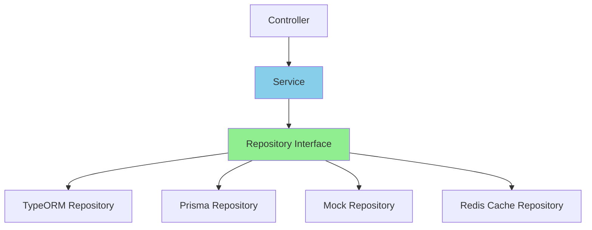

# Repository 패턴: ORM에 종속되지 않는 유연한 데이터 계층

## 시작하며

SI 프로젝트를 진행하다 보면 예상치 못한 변경이 생깁니다.

프로젝트 중반에 클라이언트가 "Oracle 라이선스 비용이 너무 비싸니 PostgreSQL로 바꾸자"고 합니다. 혹은 "TypeORM의 성능 이슈가 있으니 Prisma로 전환하자"는 이야기가 나옵니다. 아니면 "이 테이블은 조회가 많으니 Redis 캐시를 먼저 확인하게 해주세요"라는 요구사항이 추가됩니다.

이때 Service 계층 곳곳에 ORM 코드가 직접 박혀있다면? 전체를 다시 뜯어고쳐야 합니다.

Repository 패턴은 이런 상황에서 빛을 발합니다.

---

## 문제 상황: ORM에 종속된 비즈니스 로직

### 전형적인 안티패턴

많은 프로젝트에서 이렇게 작성합니다:

```typescript
// user.service.ts
import { Injectable } from '@nestjs/common';
import { InjectRepository } from '@nestjs/typeorm';
import { Repository } from 'typeorm';
import { User } from './user.entity';

@Injectable()
export class UserService {
  constructor(
    @InjectRepository(User)
    private readonly userRepository: Repository<User>,
  ) {}

  async findActiveUsers() {
    // Service에 TypeORM 쿼리 로직이 직접 들어감
    return await this.userRepository
      .createQueryBuilder('user')
      .where('user.isActive = :isActive', { isActive: true })
      .andWhere('user.deletedAt IS NULL')
      .leftJoinAndSelect('user.profile', 'profile')
      .orderBy('user.createdAt', 'DESC')
      .getMany();
  }

  async findUserWithPosts(userId: string) {
    return await this.userRepository
      .createQueryBuilder('user')
      .where('user.id = :userId', { userId })
      .leftJoinAndSelect('user.posts', 'posts')
      .leftJoinAndSelect('posts.comments', 'comments')
      .getOne();
  }

  async updateUserStatus(userId: string, isActive: boolean) {
    return await this.userRepository.update(userId, { isActive });
  }
}
```

### 이 코드의 문제점

<Callout type="warning" title="ORM 종속성의 문제">
1. **ORM 교체 불가능**: TypeORM을 Prisma로 바꾸려면 모든 Service 코드를 수정해야 합니다
2. **테스트 어려움**: Service 테스트를 위해 TypeORM의 복잡한 Mock을 만들어야 합니다
3. **비즈니스 로직 혼재**: "활성 사용자를 찾는다"는 비즈니스 로직이 SQL 쿼리와 섞여있습니다
4. **중복 쿼리**: 비슷한 쿼리를 여러 Service에서 반복 작성하게 됩니다
</Callout>

### 변경 요구사항이 들어온다면?

클라이언트: "사용자 조회 시 캐시를 먼저 확인하고, 없으면 DB를 조회해주세요"

이 경우 `findActiveUsers`, `findUserWithPosts` 등 모든 메서드에 캐시 로직을 추가해야 합니다. Service 코드가 난잡해집니다.

---

## Repository 패턴이란?

Repository 패턴은 **데이터 접근 로직을 별도의 계층으로 분리**하는 패턴입니다. Service는 "무엇을 가져올지"만 알고, "어떻게 가져오는지"는 Repository에 위임합니다.

### 계층 구조



핵심 아이디어:
1. **Interface로 계약 정의**: Repository가 제공할 메서드를 인터페이스로 선언
2. **구현체 분리**: 실제 데이터 접근 로직은 구현체에서 처리
3. **의존성 역전**: Service는 인터페이스에만 의존하고, 구현체는 교체 가능

---

## 실전 구현: NestJS + TypeORM

### 1단계: Repository Interface 정의

먼저 데이터 접근 계약을 정의합니다:

```typescript
// user/user.repository.interface.ts
export interface IUserRepository {
  findById(id: string): Promise<User | null>;
  findByEmail(email: string): Promise<User | null>;
  findActiveUsers(): Promise<User[]>;
  findUserWithPosts(userId: string): Promise<User | null>;
  create(data: CreateUserDto): Promise<User>;
  update(id: string, data: Partial<User>): Promise<User>;
  delete(id: string): Promise<void>;
  existsByEmail(email: string): Promise<boolean>;
}
```

<Callout type="info" title="Interface의 이점">
Interface는 "무엇을 할 수 있는가"만 정의합니다. Service는 이 계약만 보고 Repository를 사용하면 됩니다.
</Callout>

### 2단계: TypeORM 구현체 작성

이제 실제 TypeORM으로 구현합니다:

```typescript
// user/infrastructure/typeorm-user.repository.ts
import { Injectable } from '@nestjs/common';
import { InjectRepository } from '@nestjs/typeorm';
import { Repository } from 'typeorm';
import { IUserRepository } from '../user.repository.interface';
import { User } from '../user.entity';
import { CreateUserDto } from '../dto/create-user.dto';

@Injectable()
export class TypeOrmUserRepository implements IUserRepository {
  constructor(
    @InjectRepository(User)
    private readonly ormRepository: Repository<User>,
  ) {}

  async findById(id: string): Promise<User | null> {
    return await this.ormRepository.findOne({
      where: { id },
    });
  }

  async findByEmail(email: string): Promise<User | null> {
    return await this.ormRepository.findOne({
      where: { email },
    });
  }

  async findActiveUsers(): Promise<User[]> {
    return await this.ormRepository
      .createQueryBuilder('user')
      .where('user.isActive = :isActive', { isActive: true })
      .andWhere('user.deletedAt IS NULL')
      .leftJoinAndSelect('user.profile', 'profile')
      .orderBy('user.createdAt', 'DESC')
      .getMany();
  }

  async findUserWithPosts(userId: string): Promise<User | null> {
    return await this.ormRepository
      .createQueryBuilder('user')
      .where('user.id = :userId', { userId })
      .leftJoinAndSelect('user.posts', 'posts')
      .leftJoinAndSelect('posts.comments', 'comments')
      .getOne();
  }

  async create(data: CreateUserDto): Promise<User> {
    const user = this.ormRepository.create(data);
    return await this.ormRepository.save(user);
  }

  async update(id: string, data: Partial<User>): Promise<User> {
    await this.ormRepository.update(id, data);
    return await this.findById(id);
  }

  async delete(id: string): Promise<void> {
    await this.ormRepository.softDelete(id);
  }

  async existsByEmail(email: string): Promise<boolean> {
    const count = await this.ormRepository.count({
      where: { email },
    });
    return count > 0;
  }
}
```

### 3단계: Service에서 Repository 사용

Service는 이제 깔끔해집니다:

```typescript
// user/user.service.ts
import { Injectable, Inject } from '@nestjs/common';
import { IUserRepository } from './user.repository.interface';
import { CreateUserDto } from './dto/create-user.dto';

@Injectable()
export class UserService {
  constructor(
    @Inject('IUserRepository')
    private readonly userRepository: IUserRepository,
  ) {}

  async getActiveUsers() {
    // ORM 세부사항은 몰라도 됨
    return await this.userRepository.findActiveUsers();
  }

  async getUserWithPosts(userId: string) {
    const user = await this.userRepository.findUserWithPosts(userId);
    
    if (!user) {
      throw new NotFoundException('User not found');
    }
    
    return user;
  }

  async createUser(data: CreateUserDto) {
    // 이메일 중복 체크
    const exists = await this.userRepository.existsByEmail(data.email);
    
    if (exists) {
      throw new ConflictException('Email already exists');
    }
    
    return await this.userRepository.create(data);
  }

  async updateUserStatus(userId: string, isActive: boolean) {
    return await this.userRepository.update(userId, { isActive });
  }
}
```

<Callout type="success" title="Service 계층의 변화">
Service는 이제 순수한 비즈니스 로직만 담습니다. "사용자를 생성하되, 이메일이 중복되면 예외를 던진다"는 로직이 명확하게 보입니다.
</Callout>

### 4단계: Module에서 Provider 등록

```typescript
// user/user.module.ts
import { Module } from '@nestjs/common';
import { TypeOrmModule } from '@nestjs/typeorm';
import { User } from './user.entity';
import { UserService } from './user.service';
import { UserController } from './user.controller';
import { TypeOrmUserRepository } from './infrastructure/typeorm-user.repository';

@Module({
  imports: [TypeOrmModule.forFeature([User])],
  controllers: [UserController],
  providers: [
    UserService,
    {
      provide: 'IUserRepository',
      useClass: TypeOrmUserRepository,
    },
  ],
  exports: [UserService],
})
export class UserModule {}
```

---

## 다양한 구현체: ORM 교체하기

### Prisma로 교체

이제 Prisma를 사용하고 싶다면? Repository 구현체만 바꾸면 됩니다:

```typescript
// user/infrastructure/prisma-user.repository.ts
import { Injectable } from '@nestjs/common';
import { PrismaService } from '@/prisma/prisma.service';
import { IUserRepository } from '../user.repository.interface';
import { User } from '../user.entity';
import { CreateUserDto } from '../dto/create-user.dto';

@Injectable()
export class PrismaUserRepository implements IUserRepository {
  constructor(private readonly prisma: PrismaService) {}

  async findById(id: string): Promise<User | null> {
    return await this.prisma.user.findUnique({
      where: { id },
    });
  }

  async findByEmail(email: string): Promise<User | null> {
    return await this.prisma.user.findUnique({
      where: { email },
    });
  }

  async findActiveUsers(): Promise<User[]> {
    return await this.prisma.user.findMany({
      where: {
        isActive: true,
        deletedAt: null,
      },
      include: {
        profile: true,
      },
      orderBy: {
        createdAt: 'desc',
      },
    });
  }

  async findUserWithPosts(userId: string): Promise<User | null> {
    return await this.prisma.user.findUnique({
      where: { id: userId },
      include: {
        posts: {
          include: {
            comments: true,
          },
        },
      },
    });
  }

  async create(data: CreateUserDto): Promise<User> {
    return await this.prisma.user.create({
      data,
    });
  }

  async update(id: string, data: Partial<User>): Promise<User> {
    return await this.prisma.user.update({
      where: { id },
      data,
    });
  }

  async delete(id: string): Promise<void> {
    await this.prisma.user.update({
      where: { id },
      data: { deletedAt: new Date() },
    });
  }

  async existsByEmail(email: string): Promise<boolean> {
    const count = await this.prisma.user.count({
      where: { email },
    });
    return count > 0;
  }
}
```

Module에서 Provider만 변경:

```typescript
@Module({
  providers: [
    UserService,
    {
      provide: 'IUserRepository',
      useClass: PrismaUserRepository, // ← 이것만 바꾸면 됨!
    },
  ],
})
export class UserModule {}
```

<Callout type="success" title="ORM 교체 완료">
Service 코드는 단 한 줄도 수정하지 않았습니다. Repository 구현체만 바꿨을 뿐입니다.
</Callout>

---

## 캐시 레이어 추가하기

클라이언트 요구사항: "사용자 조회 시 Redis 캐시를 먼저 확인하세요"

Repository 패턴이 있다면? Decorator 패턴으로 간단히 추가할 수 있습니다:

```typescript
// user/infrastructure/cached-user.repository.ts
import { Injectable, Inject } from '@nestjs/common';
import { CACHE_MANAGER } from '@nestjs/cache-manager';
import { Cache } from 'cache-manager';
import { IUserRepository } from '../user.repository.interface';
import { User } from '../user.entity';
import { CreateUserDto } from '../dto/create-user.dto';

@Injectable()
export class CachedUserRepository implements IUserRepository {
  constructor(
    @Inject('IUserRepository')
    private readonly repository: IUserRepository,
    @Inject(CACHE_MANAGER)
    private readonly cacheManager: Cache,
  ) {}

  async findById(id: string): Promise<User | null> {
    const cacheKey = `user:${id}`;
    
    // 캐시에서 먼저 확인
    const cached = await this.cacheManager.get<User>(cacheKey);
    if (cached) {
      return cached;
    }
    
    // 캐시 미스 - DB에서 조회
    const user = await this.repository.findById(id);
    
    if (user) {
      // 캐시에 저장 (TTL 5분)
      await this.cacheManager.set(cacheKey, user, 300);
    }
    
    return user;
  }

  async findByEmail(email: string): Promise<User | null> {
    return await this.repository.findByEmail(email);
  }

  async findActiveUsers(): Promise<User[]> {
    const cacheKey = 'users:active';
    
    const cached = await this.cacheManager.get<User[]>(cacheKey);
    if (cached) {
      return cached;
    }
    
    const users = await this.repository.findActiveUsers();
    await this.cacheManager.set(cacheKey, users, 60); // 1분
    
    return users;
  }

  async findUserWithPosts(userId: string): Promise<User | null> {
    return await this.repository.findUserWithPosts(userId);
  }

  async create(data: CreateUserDto): Promise<User> {
    const user = await this.repository.create(data);
    
    // 캐시 무효화
    await this.cacheManager.del('users:active');
    
    return user;
  }

  async update(id: string, data: Partial<User>): Promise<User> {
    const user = await this.repository.update(id, data);
    
    // 캐시 무효화
    await this.cacheManager.del(`user:${id}`);
    await this.cacheManager.del('users:active');
    
    return user;
  }

  async delete(id: string): Promise<void> {
    await this.repository.delete(id);
    
    // 캐시 무효화
    await this.cacheManager.del(`user:${id}`);
    await this.cacheManager.del('users:active');
  }

  async existsByEmail(email: string): Promise<boolean> {
    return await this.repository.existsByEmail(email);
  }
}
```

Module 설정:

```typescript
@Module({
  providers: [
    UserService,
    // 실제 DB Repository
    {
      provide: 'BaseUserRepository',
      useClass: TypeOrmUserRepository,
    },
    // 캐시 Decorator
    {
      provide: 'IUserRepository',
      useClass: CachedUserRepository,
    },
  ],
})
export class UserModule {}
```

Service는? 여전히 수정 없음!

---

## 다른 프레임워크: Express + Prisma

NestJS만 있는 게 아닙니다. Express에서도 Repository 패턴을 사용할 수 있습니다:

```typescript
// repositories/user.repository.interface.ts
export interface IUserRepository {
  findById(id: string): Promise<User | null>;
  findByEmail(email: string): Promise<User | null>;
  findActiveUsers(): Promise<User[]>;
  create(data: CreateUserDto): Promise<User>;
  update(id: string, data: Partial<User>): Promise<User>;
  delete(id: string): Promise<void>;
}
```

```typescript
// repositories/prisma-user.repository.ts
import { PrismaClient } from '@prisma/client';
import { IUserRepository } from './user.repository.interface';

export class PrismaUserRepository implements IUserRepository {
  constructor(private readonly prisma: PrismaClient) {}

  async findById(id: string) {
    return await this.prisma.user.findUnique({ where: { id } });
  }

  async findByEmail(email: string) {
    return await this.prisma.user.findUnique({ where: { email } });
  }

  async findActiveUsers() {
    return await this.prisma.user.findMany({
      where: { isActive: true, deletedAt: null },
      orderBy: { createdAt: 'desc' },
    });
  }

  async create(data) {
    return await this.prisma.user.create({ data });
  }

  async update(id: string, data) {
    return await this.prisma.user.update({ where: { id }, data });
  }

  async delete(id: string) {
    await this.prisma.user.update({
      where: { id },
      data: { deletedAt: new Date() },
    });
  }
}
```

```typescript
// services/user.service.ts
export class UserService {
  constructor(private readonly userRepository: IUserRepository) {}

  async getActiveUsers() {
    return await this.userRepository.findActiveUsers();
  }

  async createUser(data) {
    const exists = await this.userRepository.findByEmail(data.email);
    
    if (exists) {
      throw new Error('Email already exists');
    }
    
    return await this.userRepository.create(data);
  }
}
```

```typescript
// app.ts
import express from 'express';
import { PrismaClient } from '@prisma/client';
import { PrismaUserRepository } from './repositories/prisma-user.repository';
import { UserService } from './services/user.service';
import { UserController } from './controllers/user.controller';

const app = express();
const prisma = new PrismaClient();

// Dependency Injection
const userRepository = new PrismaUserRepository(prisma);
const userService = new UserService(userRepository);
const userController = new UserController(userService);

app.get('/users', (req, res) => userController.getUsers(req, res));
app.post('/users', (req, res) => userController.createUser(req, res));

app.listen(3000);
```

---

## Before vs After

### Before: Service에 ORM 코드 직접 작성

```typescript
class UserService {
  constructor(private readonly userRepo: Repository<User>) {}
  
  async getUser(id: string) {
    // TypeORM에 종속됨
    return await this.userRepo
      .createQueryBuilder('user')
      .where('user.id = :id', { id })
      .getOne();
  }
}
```

문제점:
- ORM 교체 시 전체 수정 필요
- 테스트하기 어려움
- 비즈니스 로직과 데이터 접근 로직 혼재

### After: Repository 패턴

```typescript
// Interface
interface IUserRepository {
  findById(id: string): Promise<User | null>;
}

// Service
class UserService {
  constructor(private readonly userRepo: IUserRepository) {}
  
  async getUser(id: string) {
    return await this.userRepo.findById(id);
  }
}
```

장점:
- **ORM 독립적**: 구현체만 바꾸면 ORM 교체 가능
- **테스트 용이**: Mock Repository로 쉽게 테스트
- **명확한 책임**: Service는 비즈니스 로직만, Repository는 데이터 접근만
- **재사용성**: 같은 Repository를 여러 Service에서 사용

---

## 실전 팁

### 1. Repository는 도메인 로직을 담지 않습니다

```typescript
// ❌ 나쁜 예: Repository에 비즈니스 로직
class UserRepository {
  async findAndValidateUser(id: string) {
    const user = await this.findById(id);
    
    if (!user.isActive) {
      throw new Error('User is not active');
    }
    
    return user;
  }
}

// ✅ 좋은 예: Repository는 데이터만 가져옴
class UserRepository {
  async findById(id: string) {
    return await this.ormRepo.findOne({ where: { id } });
  }
}

// Service에서 검증
class UserService {
  async getActiveUser(id: string) {
    const user = await this.userRepo.findById(id);
    
    if (!user || !user.isActive) {
      throw new UnauthorizedException('User is not active');
    }
    
    return user;
  }
}
```

<Callout type="info" title="Repository의 역할">
Repository는 "데이터를 가져오고, 저장하고, 수정하고, 삭제하는" 것만 담당합니다. "어떤 데이터가 유효한지" 판단하는 것은 Service의 책임입니다.
</Callout>

### 2. 복잡한 쿼리는 메서드로 분리

```typescript
interface IUserRepository {
  // 단순 조회
  findById(id: string): Promise<User | null>;
  findByEmail(email: string): Promise<User | null>;
  
  // 복잡한 조회는 명시적 메서드로
  findActiveUsersWithProfiles(): Promise<User[]>;
  findUsersByRole(role: string): Promise<User[]>;
  findUsersCreatedBetween(start: Date, end: Date): Promise<User[]>;
  
  // 집계 쿼리
  countActiveUsers(): Promise<number>;
  countUsersByRole(role: string): Promise<number>;
}
```

### 3. Generic Repository는 신중하게

많은 튜토리얼에서 Generic Repository를 소개하지만, 실무에서는 신중해야 합니다:

```typescript
// ❌ 과도한 일반화
interface IGenericRepository<T> {
  findAll(): Promise<T[]>;
  findById(id: string): Promise<T | null>;
  create(data: T): Promise<T>;
  update(id: string, data: T): Promise<T>;
  delete(id: string): Promise<void>;
}

// 문제: 모든 엔티티가 같은 메서드를 갖지 않음
// User는 findByEmail이 필요하고
// Post는 findByAuthor가 필요한데
// Generic으로는 표현 불가
```

```typescript
// ✅ 도메인별로 명시적 Interface
interface IUserRepository {
  findById(id: string): Promise<User | null>;
  findByEmail(email: string): Promise<User | null>;
  findActiveUsers(): Promise<User[]>;
  // ... User에 특화된 메서드들
}

interface IPostRepository {
  findById(id: string): Promise<Post | null>;
  findByAuthor(authorId: string): Promise<Post[]>;
  findPublishedPosts(): Promise<Post[]>;
  // ... Post에 특화된 메서드들
}
```

### 4. 테스트는 Mock Repository로

Repository 패턴의 진가는 테스트에서 드러납니다:

```typescript
// user.service.spec.ts
describe('UserService', () => {
  let service: UserService;
  let mockRepository: jest.Mocked<IUserRepository>;

  beforeEach(() => {
    mockRepository = {
      findById: jest.fn(),
      findByEmail: jest.fn(),
      create: jest.fn(),
      update: jest.fn(),
      delete: jest.fn(),
      existsByEmail: jest.fn(),
    } as any;

    service = new UserService(mockRepository);
  });

  describe('createUser', () => {
    it('이메일이 중복되면 예외를 던진다', async () => {
      // Given
      mockRepository.existsByEmail.mockResolvedValue(true);

      // When & Then
      await expect(
        service.createUser({ email: 'test@example.com', name: 'Test' }),
      ).rejects.toThrow('Email already exists');
    });

    it('정상적으로 사용자를 생성한다', async () => {
      // Given
      mockRepository.existsByEmail.mockResolvedValue(false);
      mockRepository.create.mockResolvedValue({
        id: '1',
        email: 'test@example.com',
        name: 'Test',
      } as User);

      // When
      const user = await service.createUser({
        email: 'test@example.com',
        name: 'Test',
      });

      // Then
      expect(user.id).toBe('1');
      expect(mockRepository.create).toHaveBeenCalledTimes(1);
    });
  });
});
```

<Callout type="success" title="테스트의 이점">
실제 DB 없이도 Service 로직을 완벽하게 테스트할 수 있습니다. Mock Repository로 원하는 시나리오를 자유롭게 설정할 수 있습니다.
</Callout>

---

## 트레이드오프

### 장점

- **ORM 독립성**: ORM 교체 시 구현체만 변경
- **테스트 용이성**: Mock Repository로 쉽게 단위 테스트
- **명확한 책임 분리**: Service는 비즈니스 로직, Repository는 데이터 접근
- **재사용성**: 같은 Repository를 여러 곳에서 사용
- **유지보수성**: 데이터 접근 로직 변경 시 한 곳만 수정

### 단점

- **초기 구축 비용**: Interface와 구현체를 모두 작성해야 함
- **파일 수 증가**: 한 엔티티당 최소 3개 파일 (Interface, 구현체, Service)
- **러닝 커브**: 의존성 주입과 추상화 개념 이해 필요
- **과도한 추상화 위험**: 간단한 CRUD에도 Repository를 만들면 오버엔지니어링

<Callout type="warning" title="언제 Repository 패턴을 피해야 할까?">
- **단순 CRUD만 있는 프로젝트**: 추상화의 이점보다 복잡도 증가가 더 큼
- **팀원들이 DI에 익숙하지 않은 경우**: 학습 비용이 개발 속도를 늦출 수 있음
- **빠른 프로토타입**: MVP 단계에서는 과도한 추상화가 불필요
</Callout>

---

## 실무 적용 사례

### SI 프로젝트: ORM 교체

프로젝트 중반, 클라이언트가 TypeORM에서 Prisma로 전환을 요구했습니다.

**Repository 패턴이 없었다면:**
- 50개 Service 파일의 모든 쿼리 수정
- 예상 작업 기간: 2주
- 버그 발생 가능성: 높음

**Repository 패턴을 사용한 결과:**
- 각 Repository 구현체만 교체
- 실제 작업 기간: 3일
- Service 코드는 단 한 줄도 수정 안 함

```typescript
// Before
@Module({
  providers: [
    {
      provide: 'IUserRepository',
      useClass: TypeOrmUserRepository,
    },
  ],
})

// After - 이것만 바꿈
@Module({
  providers: [
    {
      provide: 'IUserRepository',
      useClass: PrismaUserRepository,
    },
  ],
})
```

### 캐시 레이어 추가

조회 성능 개선을 위해 Redis 캐시를 추가해야 했습니다.

**Repository 패턴 덕분에:**
- Decorator 패턴으로 캐시 Repository 추가
- 기존 코드 수정 없음
- 캐시 로직이 한 곳에 집중됨

```typescript
// 캐시 없는 버전
{
  provide: 'IUserRepository',
  useClass: TypeOrmUserRepository,
}

// 캐시 추가 버전 - Provider만 변경
{
  provide: 'BaseUserRepository',
  useClass: TypeOrmUserRepository,
},
{
  provide: 'IUserRepository',
  useClass: CachedUserRepository,
}
```

### 테스트 커버리지 향상

Repository 패턴 도입 후:
- Service 단위 테스트가 쉬워짐
- 실제 DB 없이도 모든 시나리오 테스트 가능
- 테스트 실행 속도 10배 향상 (DB 접근 없이 Mock 사용)

---

## 마치며

Repository 패턴은 **데이터 접근 로직을 추상화하여 유연하고 테스트 가능한 아키텍처**를 만듭니다.

처음엔 "Interface를 만들고 구현체를 만들고... 너무 복잡한 거 아닌가?" 싶을 수 있습니다. 하지만 프로젝트 중반에 ORM을 바꾸거나, 캐시를 추가하거나, 테스트를 작성해야 할 때... Repository 패턴의 가치를 실감하게 됩니다.

<Callout type="success" title="실전 적용 체크리스트">
- [ ] Service에 ORM 쿼리가 직접 들어가 있는가?
- [ ] ORM을 교체할 가능성이 있는가?
- [ ] 캐시나 로깅 같은 횡단 관심사를 추가할 가능성이 있는가?
- [ ] Service 로직을 단위 테스트하고 싶은가?
- [ ] 같은 쿼리를 여러 Service에서 반복 작성하고 있는가?

3개 이상 "예"라면 Repository 패턴을 고려하세요.
</Callout>

다음 글에서는 **Factory 패턴**을 다룹니다. 복잡한 객체 생성 로직을 깔끔하게 분리하는 방법을 알아봅니다.

---

<Reference 
  title="Repository Pattern - Martin Fowler"
  url="https://martinfowler.com/eaaCatalog/repository.html"
  description="Repository 패턴의 창시자인 Martin Fowler의 공식 문서"
/>

<Reference 
  title="NestJS Custom Providers"
  url="https://docs.nestjs.com/fundamentals/custom-providers"
  description="NestJS에서 의존성 주입과 커스텀 Provider 사용법"
/>


