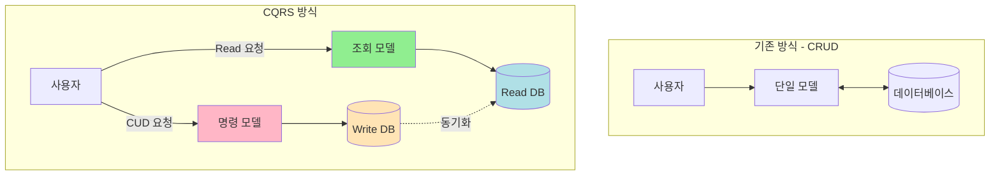

# CQRS 패턴: 복잡한 조회와 단순한 명령의 분리

## "화면은 복잡한데 저장은 단순하다면?"

SI 프로젝트의 꽃, **관리자 대시보드**를 개발하던 때였습니다.

<Callout type="warning" title="흔한 SI 현장의 대화">
**PM**: "김대리님, 주문 목록 조회 화면이 너무 느리다는 민원이 들어왔어요. 5초나 걸린대요."

**개발자**: "아... 거기 주문 정보랑 회원 정보, 상품 정보, 배송 상태, 결제 내역까지 한 번에 다 보여줘야 해서 조인이 10개나 걸려 있어서요."

**PM**: "그럼 쿼리 튜닝 좀 하면 빨라지나요?"

**개발자**: "그게 문제인 게... 이 테이블들이 주문 생성할 때 트랜잭션 락이 걸려서, 주문이 몰리면 조회도 같이 느려져요. 그리고 조회용으로 인덱스를 더 걸자니 저장 속도가 느려질까 봐 걱정이고요."
</Callout>

우리는 습관적으로 **하나의 모델(Entity)**로 데이터를 저장하고, 수정하고, 조회합니다. 하지만 곰곰이 생각해보면 "데이터를 변경하는 패턴"과 "데이터를 조회하는 패턴"은 완전히 다릅니다.

이 괴리에서 오는 복잡함을 해결하는 것이 바로 **CQRS(Command Query Responsibility Segregation)** 패턴입니다.

---

## CQRS란 무엇인가?

이름이 거창해서 어렵게 느껴지지만, 핵심은 아주 단순합니다.

<Callout type="info" title="핵심 개념">
**명령(Command)**과 **조회(Query)**의 책임을 분리한다.

- **Command (Create, Update, Delete)**: 데이터의 상태를 변경합니다. 리턴값은 없거나 성공 여부 정도만 반환합니다.
- **Query (Read)**: 데이터를 반환합니다. 데이터의 상태를 변경하지 않습니다(Side-effect Free).
</Callout>



---

## 왜 나누어야 할까요?

### 1. 명령과 조회의 '생김새'가 다릅니다

SI 프로젝트에서 흔히 겪는 **"Nullable 지옥"**을 떠올려보세요.

- **저장할 때**: `created_at`, `updated_at`은 DB가 알아서 하니까 필요 없고, `id`도 자동 생성이라 필요 없습니다.
- **조회할 때**: `password` 같은 민감 정보는 필요 없고, `join`된 `userName`이 필요합니다.

하나의 DTO나 Entity로 이걸 다 처리하려니 `user.name?` 처럼 모든 필드가 Nullable이 되고, 코드는 지저분해집니다.

### 2. 트래픽의 비율이 다릅니다

대부분의 시스템은 **읽기(Read)가 쓰기(Write)보다 압도적으로 많습니다.** (보통 100:1 이상)

- 쓰기 모델은 데이터 무결성과 트랜잭션이 중요합니다. (정규화)
- 읽기 모델은 빠른 조회와 편리한 화면 구성이 중요합니다. (반정규화, 캐싱)

이 둘을 억지로 하나로 묶어두니, 조회 성능을 높이려고 정규화를 깨뜨리거나, 쓰기 무결성을 지키려고 조회를 희생하게 됩니다.

---

## 단계별 적용 가이드

CQRS라고 해서 무조건 DB를 쪼개고 카프카(Kafka)를 도입해야 하는 건 아닙니다. SI 환경에 맞춰 단계별로 적용할 수 있습니다.

<Steps>
  <Step title="Level 1: 코드 레벨의 분리">
    가장 쉽고 효과가 좋은 단계입니다. DB는 하나지만, 내부 로직을 나눕니다.
    
    - **CommandService**: `createOrder()`, `cancelOrder()` 등 상태 변경만 담당.
    - **QueryService**: `getOrderList()`, `getDashboardStats()` 등 조회만 담당.
    
    이것만 해도 "이 함수가 데이터를 바꾸는지 안 바꾸는지" 명확해져서 유지보수가 훨씬 쉬워집니다.
  </Step>
  
  <Step title="Level 2: 모델(DTO)의 분리">
    읽기용 객체와 쓰기용 객체를 철저히 나눕니다.
    
    - `CreateOrderRequest`: 주문 생성에 딱 필요한 필드만 있음.
    - `OrderListView`: 화면에 뿌려줄 데이터(주문자명, 배송상태 한글명 등)가 이미 가공된 상태.
    
    JPA를 쓴다면 Command는 Entity를 그대로 쓰고, Query는 DTO Projection이나 MyBatis/QueryDSL을 적극 활용합니다.
  </Step>
  
  <Step title="Level 3: 물리적 저장소의 분리">
    성능 이슈가 심각할 때 고려합니다.
    
    - **Write DB**: MySQL (Master) - 정규화된 테이블.
    - **Read DB**: MySQL (Slave/Replica) 또는 Redis, ElasticSearch - 조회 전용 역정규화 데이터.
    
    이때부터는 "데이터 동기화(Sync)" 문제가 발생하므로 신중해야 합니다.
  </Step>
</Steps>

---

## 실전 코드 예제 (Next.js 15 + Server Actions)

SI 프로젝트에서 흔히 보는 코드를 리팩토링 해봅시다.

### Before: 만능 서비스 (God Service)

하나의 서비스가 너무 많은 일을 합니다. 조회 로직 때문에 Entity에 화면용 필드가 덕지덕지 붙습니다.

```typescript
// ❌ 나쁜 예: 읽기와 쓰기가 뒤섞임
class OrderService {
  async getOrder(id: string) {
    // ... 복잡한 조인 로직 ...
    // ... 조회수 증가 로직(쓰기)이 숨어있음! ...
    return order;
  }

  async createOrder(data: OrderDto) {
    // ... 유효성 검사 ...
    // ... 저장 ...
    // ... 이메일 발송(오래 걸림) ...
    return savedOrder; // 리턴값으로 조회를 겸함
  }
}
```

### After: CQRS 적용

Next.js 15의 기능을 십분 활용해 봅시다. **Server Actions**는 Command에, **RSC(React Server Component)**는 Query에 최적화되어 있습니다.

#### 1. Command (Server Action)

```typescript
// ⭕ actions/order-command.ts
'use server';

import { db } from '@/lib/db';
import { revalidatePath } from 'next/cache';

// 명령은 "행위"에 집중합니다. 리턴값은 최소화합니다.
export async function createOrder(formData: FormData) {
  const command = parseCommand(formData);
  
  await db.transaction(async (tx) => {
    // 1. 핵심 비즈니스 로직 (쓰기 모델 사용)
    const order = await tx.order.create({
      data: {
        userId: command.userId,
        productId: command.productId,
        status: 'PENDING',
        // ...
      }
    });
    
    // 2. 이벤트 발행 (선택적)
    // await eventBus.publish('order.created', order);
  });

  // 3. 캐시 갱신 (CQRS의 핵심: 명령 후 조회를 위해 갱신)
  revalidatePath('/orders');
  
  return { success: true };
}
```

#### 2. Query (Data Access Layer)

```typescript
// ⭕ queries/order-query.ts
import { db } from '@/lib/db';

// 조회 전용 DTO (화면에 딱 맞는 형태)
export type OrderListItem = {
  id: string;
  productName: string; // 조인된 결과
  customerName: string; // 조인된 결과
  orderedAtFormatted: string; // 포맷팅된 날짜
  statusLabel: string; // "배송중" 같은 한글 표기
};

// 조회는 최적화된 쿼리(SQL, DTO Projection)를 사용합니다.
export async function getOrderList(): Promise<OrderListItem[]> {
  // ORM의 무거운 객체 대신 가벼운 쿼리 사용
  const orders = await db.order.findMany({
    select: {
      id: true,
      createdAt: true,
      status: true,
      product: { select: { name: true } },
      user: { select: { name: true } },
    },
    orderBy: { createdAt: 'desc' }
  });

  return orders.map(mapToListItem);
}
```

---

## 3단계 (Advanced): 조회 전용 뷰 테이블 만들기

SI 프로젝트에서 가장 효과적인 CQRS 적용 방식입니다. DB는 하나지만, 조회 전용 테이블을 따로 만듭니다.

### 문제 상황

주문 대시보드에서 이런 화면을 보여줘야 한다고 가정해봅시다:

```typescript
// 화면에 필요한 데이터
{
  orderId: "ORD-123",
  productName: "맥북 프로 14인치",
  customerName: "홍길동",
  customerPhone: "010-1234-5678",
  orderDate: "2025년 11월 28일 14:30",
  statusLabel: "배송중",
  deliveryCompany: "CJ대한통운",
  trackingNumber: "123456789",
  totalAmount: "2,390,000원",
  paymentMethod: "신용카드",
}
```

이걸 정규화된 테이블에서 가져오려면?

```sql
SELECT 
  o.id,
  p.name,
  u.name,
  u.phone,
  o.created_at,
  o.status,
  d.company_name,
  d.tracking_number,
  o.total_amount,
  pm.method_name
FROM orders o
  JOIN products p ON o.product_id = p.id
  JOIN users u ON o.user_id = u.id
  LEFT JOIN deliveries d ON o.id = d.order_id
  JOIN payment_methods pm ON o.payment_method_id = pm.id
WHERE o.deleted_at IS NULL
ORDER BY o.created_at DESC
LIMIT 50;
```

조인이 5개나 걸립니다. 목록 조회 때마다 이 쿼리가 실행되면 느려질 수밖에 없습니다.

### 해결책: 조회 전용 테이블

```typescript
// ⭕ 조회 전용 테이블 (역정규화)
CREATE TABLE order_list_view (
  id VARCHAR(36) PRIMARY KEY,
  product_name VARCHAR(255),
  customer_name VARCHAR(100),
  customer_phone VARCHAR(20),
  order_date DATETIME,
  status_label VARCHAR(50),
  delivery_company VARCHAR(100),
  tracking_number VARCHAR(100),
  total_amount DECIMAL(10, 2),
  payment_method VARCHAR(50),
  created_at DATETIME,
  updated_at DATETIME,
  INDEX idx_order_date (order_date),
  INDEX idx_customer_name (customer_name)
);
```

이 테이블은 **Command가 실행될 때마다 업데이트**됩니다:

```typescript
// ⭕ actions/order-command.ts
'use server';

export async function createOrder(formData: FormData) {
  const command = parseCommand(formData);
  
  await db.transaction(async (tx) => {
    // 1. 명령 처리 (정규화된 테이블에 저장)
    const order = await tx.order.create({
      data: {
        userId: command.userId,
        productId: command.productId,
        status: 'PENDING',
      }
    });
    
    // 2. 조회용 뷰 테이블 업데이트 (역정규화)
    const product = await tx.product.findUnique({ 
      where: { id: command.productId } 
    });
    const user = await tx.user.findUnique({ 
      where: { id: command.userId } 
    });
    
    await tx.orderListView.create({
      data: {
        id: order.id,
        productName: product.name,
        customerName: user.name,
        customerPhone: user.phone,
        orderDate: order.createdAt,
        statusLabel: getStatusLabel(order.status),
        totalAmount: order.totalAmount,
        paymentMethod: order.paymentMethod,
      }
    });
  });

  revalidatePath('/orders');
  return { success: true };
}
```

이제 조회는? **단순 SELECT 한 방**:

```typescript
// ⭕ queries/order-query.ts
export async function getOrderList() {
  // 조인 없는 단순 조회
  return await db.orderListView.findMany({
    orderBy: { orderDate: 'desc' },
    take: 50,
  });
}
```

<Callout type="success" title="성능 개선 효과">
- **조회 속도**: 5개 조인 → 단일 테이블 조회 (약 10배 향상)
- **인덱스 최적화**: 조회 패턴에 맞춘 인덱스 설계 가능
- **DB 부하 감소**: 복잡한 조인이 사라져 CPU 사용량 감소
</Callout>

### 동기화 전략

뷰 테이블은 항상 최신 상태를 유지해야 합니다. 3가지 전략이 있습니다:

<Steps>
  <Step title="동기 업데이트 (Synchronous)">
    Command와 같은 트랜잭션 안에서 뷰 테이블을 업데이트합니다.
    
    **장점**: 즉시 일관성 보장 (Immediate Consistency)
    **단점**: Command 처리 시간이 약간 늘어남
    
    **권장 상황**: 실시간 반영이 중요한 주문, 결제, 재고 등
  </Step>
  
  <Step title="비동기 업데이트 (Asynchronous)">
    Command 처리 후 이벤트를 발행하고, 별도 워커가 뷰 테이블을 업데이트합니다.
    
    **장점**: Command가 빠르게 완료됨
    **단점**: 약간의 지연 발생 (Eventual Consistency)
    
    **권장 상황**: 통계, 대시보드, 리포트 등 약간의 지연이 허용되는 경우
  </Step>
  
  <Step title="배치 업데이트 (Batch)">
    주기적으로 뷰 테이블을 재생성합니다.
    
    **장점**: 실시간 부하 없음
    **단점**: 최신 데이터가 아닐 수 있음
    
    **권장 상황**: 일별 통계, 월별 리포트 등
  </Step>
</Steps>

```typescript
// 비동기 업데이트 예제 (BullMQ 사용)
export async function createOrder(formData: FormData) {
  const order = await db.order.create({ /* ... */ });
  
  // 이벤트 발행
  await queue.add('order.created', {
    orderId: order.id,
    userId: order.userId,
    productId: order.productId,
  });
  
  return { success: true };
}

// 워커에서 처리
processor.process('order.created', async (job) => {
  const { orderId, userId, productId } = job.data;
  
  // 뷰 테이블 업데이트
  const [order, product, user] = await Promise.all([
    db.order.findUnique({ where: { id: orderId } }),
    db.product.findUnique({ where: { id: productId } }),
    db.user.findUnique({ where: { id: userId } }),
  ]);
  
  await db.orderListView.create({
    data: {
      id: order.id,
      productName: product.name,
      customerName: user.name,
      // ...
    }
  });
});
```

---

## CQRS와 이벤트 소싱의 관계

CQRS를 검색하다 보면 **Event Sourcing**이라는 용어를 자주 접하게 됩니다. 이 둘은 별개의 패턴이지만, 함께 사용하면 시너지가 있습니다.

### Event Sourcing이란?

현재 상태만 저장하는 대신, **모든 변경 이력(이벤트)을 저장**하는 방식입니다.

```typescript
// 일반 방식 (상태 저장)
{
  orderId: "ORD-123",
  status: "DELIVERED", // 최종 상태만 남음
  amount: 100000
}

// Event Sourcing (이벤트 저장)
[
  { type: "OrderCreated", orderId: "ORD-123", amount: 100000, timestamp: "2025-11-28 10:00" },
  { type: "PaymentCompleted", orderId: "ORD-123", timestamp: "2025-11-28 10:05" },
  { type: "OrderShipped", orderId: "ORD-123", timestamp: "2025-11-28 15:00" },
  { type: "OrderDelivered", orderId: "ORD-123", timestamp: "2025-11-29 14:00" },
]
```

### CQRS + Event Sourcing 조합

```typescript
// Command: 이벤트를 저장
export async function createOrder(data: CreateOrderDto) {
  const event = {
    type: 'OrderCreated',
    aggregateId: uuid(),
    data: {
      userId: data.userId,
      productId: data.productId,
      amount: data.amount,
    },
    timestamp: new Date(),
  };
  
  // 이벤트 스토어에 저장
  await eventStore.append('Order', event.aggregateId, event);
  
  // 이벤트 발행
  await eventBus.publish(event);
  
  return { success: true, orderId: event.aggregateId };
}

// Query: 이벤트를 읽어서 현재 상태를 재구성
export async function getOrder(orderId: string) {
  // 이벤트 스토어에서 모든 이벤트 조회
  const events = await eventStore.getEvents('Order', orderId);
  
  // 이벤트를 순서대로 적용하여 현재 상태 재구성
  let order = { id: orderId };
  
  for (const event of events) {
    switch (event.type) {
      case 'OrderCreated':
        order = { ...order, ...event.data, status: 'CREATED' };
        break;
      case 'PaymentCompleted':
        order = { ...order, status: 'PAID' };
        break;
      case 'OrderShipped':
        order = { ...order, status: 'SHIPPED' };
        break;
      case 'OrderDelivered':
        order = { ...order, status: 'DELIVERED' };
        break;
    }
  }
  
  return order;
}
```

<Callout type="info" title="Event Sourcing의 장점">
- **완전한 감사 로그**: 모든 변경 이력이 남아 있어 추적 가능
- **시간 여행**: 과거 특정 시점의 상태를 재구성 가능
- **이벤트 재생**: 버그 수정 후 이벤트를 다시 재생하여 상태 복구 가능
</Callout>

<Callout type="warning" title="Event Sourcing이 필요한 경우">
Event Sourcing은 강력하지만 복잡합니다. 다음 경우에만 고려하세요:

- 금융, 의료 등 모든 변경 이력이 법적으로 보관되어야 하는 경우
- 복잡한 업무 프로세스(전자결재, 워크플로우)에서 롤백이 빈번한 경우
- 시간에 따른 데이터 변화 분석이 중요한 경우

**단순 게시판이나 관리자 페이지에는 과도한 복잡도**입니다.
</Callout>

---

## Before vs After: 실제 프로젝트 비교

### Before: 하나의 Service로 모든 것을 처리

```typescript
// ❌ 나쁜 예: 읽기와 쓰기가 뒤섞임
class OrderService {
  // 주문 목록 조회 (복잡한 조인)
  async getOrderList() {
    return await this.orderRepo
      .createQueryBuilder('order')
      .leftJoinAndSelect('order.product', 'product')
      .leftJoinAndSelect('order.user', 'user')
      .leftJoinAndSelect('order.delivery', 'delivery')
      .where('order.deletedAt IS NULL')
      .orderBy('order.createdAt', 'DESC')
      .getMany();
  }
  
  // 주문 생성 (쓰기)
  async createOrder(data: CreateOrderDto) {
    const order = await this.orderRepo.save(data);
    
    // 쓰기 로직인데 조회도 함께 (혼재)
    return await this.getOrderList(); // 전체 목록까지 반환?
  }
  
  // 대시보드 통계 (또 다른 복잡한 조회)
  async getDashboardStats() {
    const orders = await this.orderRepo
      .createQueryBuilder('order')
      .leftJoin('order.product', 'product')
      .leftJoin('order.user', 'user')
      .select('COUNT(*)', 'totalOrders')
      .addSelect('SUM(order.totalAmount)', 'totalRevenue')
      .addSelect('user.name', 'topCustomer')
      .groupBy('user.id')
      .getRawMany();
      
    // 결과를 가공하는 복잡한 로직...
    return processStats(orders);
  }
}
```

**문제점**:
- Service가 너무 많은 책임을 가짐
- 조회 성능 최적화가 어려움 (쓰기 로직에 영향)
- 함수 이름만으로는 데이터를 변경하는지 알 수 없음
- 테스트하기 어려움

### After: CQRS 적용

#### Command (명령)

```typescript
// ⭕ commands/order-command.ts
'use server';

import { db } from '@/lib/db';
import { revalidatePath } from 'next/cache';

// 주문 생성 명령
export async function createOrder(formData: FormData) {
  const command = {
    userId: formData.get('userId') as string,
    productId: formData.get('productId') as string,
    quantity: parseInt(formData.get('quantity') as string),
  };
  
  await db.transaction(async (tx) => {
    // 1. 주문 생성 (정규화된 테이블)
    const order = await tx.order.create({
      data: {
        userId: command.userId,
        productId: command.productId,
        quantity: command.quantity,
        status: 'PENDING',
      }
    });
    
    // 2. 재고 차감
    await tx.product.update({
      where: { id: command.productId },
      data: { stock: { decrement: command.quantity } }
    });
    
    // 3. 조회용 뷰 업데이트
    await updateOrderListView(tx, order.id);
  });
  
  revalidatePath('/orders');
  return { success: true };
}

// 주문 취소 명령
export async function cancelOrder(orderId: string) {
  await db.transaction(async (tx) => {
    const order = await tx.order.findUnique({ 
      where: { id: orderId } 
    });
    
    // 1. 주문 상태 변경
    await tx.order.update({
      where: { id: orderId },
      data: { status: 'CANCELLED' }
    });
    
    // 2. 재고 복구
    await tx.product.update({
      where: { id: order.productId },
      data: { stock: { increment: order.quantity } }
    });
    
    // 3. 조회용 뷰 업데이트
    await updateOrderListView(tx, orderId);
  });
  
  revalidatePath('/orders');
  return { success: true };
}
```

#### Query (조회)

```typescript
// ⭕ queries/order-query.ts
import { db } from '@/lib/db';

// 주문 목록 조회 (조인 없는 단순 조회)
export async function getOrderList() {
  return await db.orderListView.findMany({
    orderBy: { orderDate: 'desc' },
    take: 50,
  });
}

// 대시보드 통계 (조회 전용 테이블에서 가져옴)
export async function getDashboardStats() {
  // 미리 집계된 통계 테이블에서 조회
  return await db.dashboardStats.findFirst({
    orderBy: { updatedAt: 'desc' }
  });
}

// 특정 주문 상세 조회
export async function getOrderDetail(orderId: string) {
  return await db.orderDetailView.findUnique({
    where: { id: orderId }
  });
}
```

#### RSC (React Server Component)에서 사용

```typescript
// ⭕ app/orders/page.tsx
import { getOrderList } from '@/queries/order-query';
import { OrderTable } from '@/components/OrderTable';

export default async function OrdersPage() {
  const orders = await getOrderList(); // Query
  
  return (
    <div>
      <h1>주문 목록</h1>
      <OrderTable orders={orders} />
    </div>
  );
}
```

```typescript
// ⭕ components/OrderTable.tsx
'use client';

import { cancelOrder } from '@/commands/order-command';

export function OrderTable({ orders }) {
  return (
    <table>
      {orders.map(order => (
        <tr key={order.id}>
          <td>{order.productName}</td>
          <td>{order.customerName}</td>
          <td>
            <form action={cancelOrder.bind(null, order.id)}>
              <button type="submit">취소</button>
            </form>
          </td>
        </tr>
      ))}
    </table>
  );
}
```

**개선점**:
- Command와 Query가 명확히 분리됨
- Query는 최적화된 단순 조회
- Server Actions로 Command 처리
- RSC로 Query 결과 렌더링
- 테스트하기 쉬운 구조

---

## 트레이드오프

### 장점

**1. 성능 최적화**
- 읽기와 쓰기를 독립적으로 최적화
- 조회용 DB에 캐시, 인덱스, 역정규화 자유롭게 적용
- 읽기 전용 Replica 사용 가능

**2. 확장성**
- 읽기와 쓰기를 별도 서버로 스케일 아웃
- 조회 트래픽이 쓰기 성능에 영향 없음

**3. 복잡한 조회 처리**
- 여러 테이블 조인 없이 단순 조회
- 화면에 맞춘 데이터 구조 설계 가능

**4. 유지보수성**
- 코드에서 "이 함수가 데이터를 바꾸는가?" 명확히 구분
- Command와 Query의 책임이 분리되어 이해하기 쉬움

### 단점

**1. 복잡도 증가**
- 파일과 클래스가 늘어남
- 개발자가 CQRS 개념을 이해해야 함

**2. 데이터 동기화**
- Write DB와 Read DB 간 일관성 관리 필요
- "방금 저장했는데 목록에 안 보여요" 문제 가능 (Eventual Consistency)

**3. 초기 구축 비용**
- 뷰 테이블 설계와 동기화 로직 필요
- 간단한 CRUD에는 오버엔지니어링

**4. 디버깅 어려움**
- Command 성공했는데 Query에 안 나오는 경우 추적 필요
- 동기화 오류 시 데이터 불일치 가능

---

## SI 개발자를 위한 현실적인 조언

CQRS 패턴을 도입할 때 가장 조심해야 할 점은 **"오버 엔지니어링"**입니다.

### 언제 써야 할까요?

✅ **복잡한 대시보드**
- 여러 테이블을 조인해서 통계나 리포트를 보여줘야 할 때
- 조회 쿼리가 느려서 사용자 불만이 있을 때

✅ **트래픽 불균형**
- 조회 요청이 쓰기 요청보다 100배 이상 많을 때
- 조회 때문에 쓰기 성능이 저하되는 경우

✅ **팀 협업**
- 프론트엔드 개발자가 Query를 직접 작성하고
- 백엔드 개발자가 Command(비즈니스 로직)에 집중할 때

✅ **이력 관리**
- 모든 변경 이력을 추적해야 하는 경우 (금융, 의료, 전자결재)

### 언제 쓰지 말아야 할까요?

❌ **단순 CRUD**
- 그냥 `admin` 테이블 하나 만들어서 관리하는 수준
- 게시판, 회원 관리 같은 단순한 기능

❌ **즉각적인 일관성이 중요할 때**
- "방금 저장했는데 왜 목록에 안 나와요?" 라는 클레임이 치명적인 경우
- 실시간 재고 관리처럼 정확한 상태가 중요한 경우

❌ **팀 규모가 작을 때**
- 1\~2명이 개발하는 소규모 프로젝트
- 추가 복잡도가 개발 속도를 늦출 수 있음

❌ **빠른 프로토타입**
- MVP 단계에서는 과도한 추상화 불필요
- 나중에 리팩토링으로 적용 가능

### 단계별 적용 전략

<Steps>
  <Step title="1단계: 코드 레벨 분리 (모든 프로젝트 추천)">
    가장 쉽고 효과가 좋습니다. DB 변경 없이 함수만 나눕니다.
    
    - `createOrder()`, `updateOrder()` → Command
    - `getOrderList()`, `getOrderDetail()` → Query
    
    이것만 해도 코드 가독성이 크게 향상됩니다.
  </Step>
  
  <Step title="2단계: DTO 분리 (중규모 이상 프로젝트)">
    읽기용 객체와 쓰기용 객체를 명확히 나눕니다.
    
    - `CreateOrderDto` / `UpdateOrderDto` → Command용
    - `OrderListItemDto` / `OrderDetailDto` → Query용
    
    Nullable 필드가 줄어들고 타입 안정성이 높아집니다.
  </Step>
  
  <Step title="3단계: 조회 전용 뷰 테이블 (성능 이슈가 있을 때)">
    복잡한 조인을 피하기 위해 역정규화된 테이블을 만듭니다.
    
    - Write DB: 정규화된 테이블
    - Read View: 역정규화된 조회 전용 테이블
    
    조회 성능이 10배 이상 향상될 수 있습니다.
  </Step>
  
  <Step title="4단계: 물리적 DB 분리 (대규모 트래픽)">
    Read/Write DB를 물리적으로 분리합니다.
    
    - Write DB: MySQL Master
    - Read DB: MySQL Replica, Redis, ElasticSearch
    
    이 단계는 신중히 결정하세요. 동기화 문제가 발생합니다.
  </Step>
</Steps>

---

## 실무 적용 사례

### 사례 1: 전자상거래 관리자 대시보드

**문제**: 주문 목록 조회가 5초 이상 걸림. 5개 테이블 조인 때문.

**적용**: 
- `order_list_view` 테이블 생성 (역정규화)
- Command에서 주문 생성/수정 시 뷰 테이블도 함께 업데이트
- Query는 뷰 테이블만 조회

**결과**:
- 조회 속도: 5초 → 0.3초 (약 17배 향상)
- 인덱스 최적화로 대량 데이터에서도 안정적인 성능

### 사례 2: 실시간 통계 대시보드

**문제**: 통계 집계 쿼리가 느려서 대시보드 로딩이 느림.

**적용**:
- `dashboard_stats` 테이블 생성
- 주문/결제/취소 시 이벤트 발행
- 워커가 비동기로 통계 테이블 업데이트

**결과**:
- 대시보드 로딩: 3초 → 0.1초
- 실시간 데이터가 아닌 5분 지연 데이터로 타협 (고객 동의)

### 사례 3: 전자결재 시스템

**문제**: 결재 이력을 모두 추적해야 하는 법적 요구사항.

**적용**:
- CQRS + Event Sourcing 조합
- 모든 결재 액션을 이벤트로 저장
- Query는 이벤트를 재생하여 현재 상태 구성

**결과**:
- 완전한 감사 로그 확보
- 과거 특정 시점의 결재 상태 재구성 가능

---

## 마치며

<Callout type="success" title="결론">
CQRS는 거창한 아키텍처가 아닙니다. 

**"저장하는 놈(Command)과 읽어오는 놈(Query)을 다른 함수로 만든다."**

이것만 지켜도 여러분의 코드는 훨씬 깔끔해지고, 나중에 성능 문제가 터졌을 때 대처하기 쉬운 구조가 됩니다.

1단계(코드 분리)부터 시작하세요. 필요할 때 2단계(DTO 분리), 3단계(뷰 테이블)로 점진적으로 발전시키면 됩니다.
</Callout>

<Callout type="info" title="실전 적용 체크리스트">
- [ ] 조회 쿼리가 여러 테이블을 조인하고 있는가?
- [ ] 조회 성능 때문에 사용자 불만이 있는가?
- [ ] 읽기 요청이 쓰기 요청보다 압도적으로 많은가?
- [ ] 함수만 봐서는 데이터를 변경하는지 알기 어려운가?
- [ ] 같은 엔티티를 조회할 때마다 다른 필드가 필요한가?

3개 이상 "예"라면 CQRS 패턴을 고려하세요.
</Callout>

다음 글에서는 **Saga 패턴**과 **Repository 패턴**을 함께 보시면 더 완벽한 아키텍처를 구성할 수 있습니다.

---

<Reference 
  title="CQRS Pattern - Martin Fowler"
  url="https://martinfowler.com/bliki/CQRS.html"
  description="CQRS 패턴의 창시자 Martin Fowler의 공식 문서"
/>

<Reference 
  title="CQRS - Microsoft Azure Architecture"
  url="https://learn.microsoft.com/en-us/azure/architecture/patterns/cqrs"
  description="Microsoft의 CQRS 패턴 상세 가이드"
/>

<Reference 
  title="Event Sourcing - Martin Fowler"
  url="https://martinfowler.com/eaaDev/EventSourcing.html"
  description="CQRS와 함께 사용되는 Event Sourcing 패턴 설명"
/>

