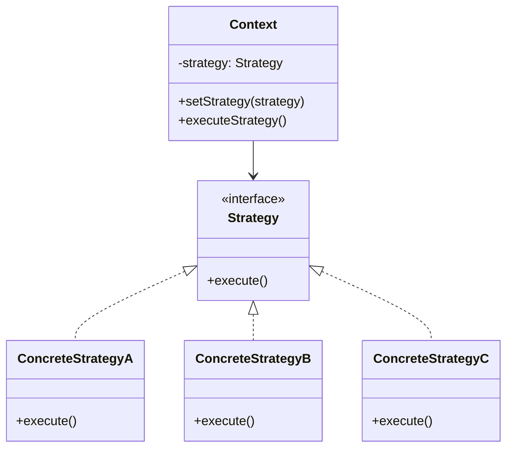
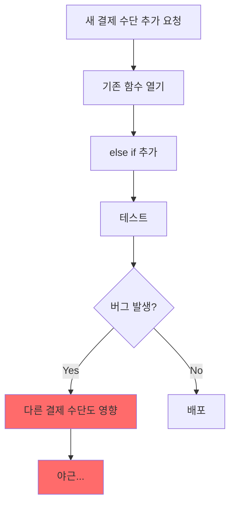

# Strategy 패턴: 알고리즘의 동적 교체

## "같은 목적, 다른 방법"

결제 시스템을 개발하던 어느 날이었습니다.

<Callout type="warning" title="흔한 SI 현장의 대화">
**PM**: "김대리님, 토스페이 연동 추가해주세요. 다음 주까지요."

**개발자**: "네... (결제 처리 함수 열어봄) 이미 카카오페이, 네이버페이, 신용카드, 계좌이체 if-else가 300줄인데... 여기에 또 추가해야 하나..."

**PM**: "아, 그리고 프로모션 기간에는 특정 결제 수단만 적용되게 해주시고요."

**개발자**: "..." (머리가 하얘짐)
</Callout>

처음엔 간단했습니다. 신용카드 결제 하나. 그 다음 계좌이체가 추가됐고, 카카오페이가 들어왔고, 네이버페이가 추가됐습니다. 매번 `if-else`를 늘려가며 버텼죠.

그런데 어느 순간 깨달았습니다. **결제 수단이 추가될 때마다 기존 코드를 건드려야 한다는 것**. 그리고 하나의 결제 수단에서 버그가 나면, 다른 결제 수단도 함께 영향을 받을 수 있다는 것.

이 문제를 우아하게 해결하는 것이 바로 **Strategy 패턴**입니다.

---

## Strategy 패턴이란?

**Strategy 패턴**은 GoF(Gang of Four) 디자인 패턴 중 하나로, **동일한 목적을 달성하는 여러 알고리즘(방법)을 캡슐화**하여 런타임에 교체할 수 있게 하는 패턴입니다.

<Callout type="info" title="핵심 개념">
**"같은 일을 하는 여러 방법을 각각의 클래스로 분리하고, 필요에 따라 바꿔 끼운다."**

- **Context**: 전략을 사용하는 주체. 어떤 전략을 쓸지 결정하고 실행합니다.
- **Strategy (Interface)**: 모든 전략이 따라야 하는 공통 인터페이스.
- **ConcreteStrategy**: 실제 알고리즘을 구현한 각각의 전략 클래스들.
</Callout>



쉽게 말해, **"결제한다"라는 목적은 같지만**, 신용카드로 결제하는 방법, 카카오페이로 결제하는 방법, 네이버페이로 결제하는 방법이 각각 다릅니다. 이 각각의 "방법"을 독립적인 클래스로 만들어서, 필요할 때 갈아끼우는 것이 Strategy 패턴입니다.

---

## 왜 필요한가요? if-else 지옥

### 현실에서 만나는 if-else 지옥

SI 프로젝트에서 가장 흔히 보는 코드 악취(Code Smell)가 바로 **거대한 조건문 분기**입니다.

```typescript
// ❌ 나쁜 예: 결제 처리 함수
async function processPayment(
  paymentMethod: string,
  amount: number,
  userId: string
) {
  if (paymentMethod === 'CREDIT_CARD') {
    // 신용카드 결제 로직 (50줄)
    const cardInfo = await getCardInfo(userId);
    const pgResponse = await callNicepayAPI({
      cardNumber: cardInfo.number,
      amount,
      // ...
    });
    if (pgResponse.status === 'success') {
      await savePaymentHistory(/* ... */);
      return { success: true, transactionId: pgResponse.tid };
    }
    throw new Error('카드 결제 실패');
    
  } else if (paymentMethod === 'BANK_TRANSFER') {
    // 계좌이체 로직 (40줄)
    const bankInfo = await getBankInfo(userId);
    const response = await callBankAPI({
      accountNumber: bankInfo.account,
      amount,
      // ...
    });
    // ...
    
  } else if (paymentMethod === 'KAKAO_PAY') {
    // 카카오페이 로직 (60줄)
    const kakaoToken = await getKakaoPayToken(userId);
    const response = await callKakaoPayAPI({
      token: kakaoToken,
      amount,
      // ...
    });
    // ...
    
  } else if (paymentMethod === 'NAVER_PAY') {
    // 네이버페이 로직 (55줄)
    // ...
    
  } else if (paymentMethod === 'TOSS_PAY') {
    // 토스페이 로직 (45줄)
    // ...
    
  } else {
    throw new Error('지원하지 않는 결제 수단입니다.');
  }
}
```

### 이 코드의 문제점

<Steps>
  <Step title="Single Responsibility 위반">
    한 함수가 5가지 결제 수단의 로직을 모두 알고 있습니다. 카카오페이 로직을 수정하려면 이 거대한 함수를 열어서 해당 분기를 찾아야 합니다.
  </Step>
  
  <Step title="Open-Closed Principle 위반">
    새로운 결제 수단(Apple Pay)을 추가하려면 **기존 함수를 수정**해야 합니다. "확장에는 열려있고, 수정에는 닫혀있어야 한다"는 원칙을 정면으로 위배합니다.
  </Step>
  
  <Step title="테스트 어려움">
    카카오페이만 테스트하고 싶어도, 이 거대한 함수 전체를 로드해야 합니다. Mock 처리도 복잡해집니다.
  </Step>
  
  <Step title="버그 전파 위험">
    네이버페이 로직을 수정하다가 실수로 위쪽의 카카오페이 코드를 건드릴 수 있습니다. 배포 후 "카카오페이가 안 돼요!" 장애 발생.
  </Step>
</Steps>



---

## Strategy 패턴 적용하기

### Step 1: 공통 인터페이스 정의

모든 결제 전략이 따라야 하는 "계약"을 정의합니다.

```typescript
// ⭕ strategies/payment-strategy.ts

export interface PaymentRequest {
  userId: string;
  amount: number;
  orderId: string;
  metadata?: Record<string, unknown>;
}

export interface PaymentResult {
  success: boolean;
  transactionId: string;
  message?: string;
  receiptUrl?: string;
}

// 모든 결제 전략이 구현해야 하는 인터페이스
export interface PaymentStrategy {
  readonly name: string; // 결제 수단 이름
  
  // 결제 실행
  pay(request: PaymentRequest): Promise<PaymentResult>;
  
  // 결제 취소
  cancel(transactionId: string): Promise<PaymentResult>;
  
  // 결제 가능 여부 확인 (선택적)
  isAvailable?(userId: string): Promise<boolean>;
}
```

### Step 2: 각 결제 전략 구현

각 결제 수단을 독립적인 클래스로 분리합니다.

```typescript
// ⭕ strategies/credit-card-strategy.ts

import { PaymentStrategy, PaymentRequest, PaymentResult } from './payment-strategy';

export class CreditCardStrategy implements PaymentStrategy {
  readonly name = '신용카드';
  
  async pay(request: PaymentRequest): Promise<PaymentResult> {
    // 카드 정보 조회
    const cardInfo = await this.getCardInfo(request.userId);
    
    // PG사 API 호출 (나이스페이 예시)
    const response = await this.callNicepayAPI({
      cardNumber: cardInfo.number,
      amount: request.amount,
      orderId: request.orderId,
    });
    
    if (response.resultCode !== '0000') {
      return {
        success: false,
        transactionId: '',
        message: response.resultMsg,
      };
    }
    
    return {
      success: true,
      transactionId: response.tid,
      receiptUrl: response.receiptUrl,
    };
  }
  
  async cancel(transactionId: string): Promise<PaymentResult> {
    const response = await this.callNicepayCancel(transactionId);
    return {
      success: response.resultCode === '0000',
      transactionId,
      message: response.resultMsg,
    };
  }
  
  private async getCardInfo(userId: string) {
    // 사용자의 등록된 카드 정보 조회
    // ...
  }
  
  private async callNicepayAPI(data: any) {
    // 나이스페이 결제 API 호출
    // ...
  }
  
  private async callNicepayCancel(tid: string) {
    // 나이스페이 취소 API 호출
    // ...
  }
}
```

```typescript
// ⭕ strategies/kakao-pay-strategy.ts

import { PaymentStrategy, PaymentRequest, PaymentResult } from './payment-strategy';

export class KakaoPayStrategy implements PaymentStrategy {
  readonly name = '카카오페이';
  
  private readonly kakaoPayApiUrl = 'https://kapi.kakao.com/v1/payment';
  
  async pay(request: PaymentRequest): Promise<PaymentResult> {
    // 카카오페이 토큰 조회
    const token = await this.getKakaoPayToken(request.userId);
    
    // 카카오페이 결제 준비
    const readyResponse = await this.ready({
      token,
      amount: request.amount,
      orderId: request.orderId,
    });
    
    // 카카오페이 결제 승인
    const approveResponse = await this.approve(readyResponse.tid);
    
    return {
      success: approveResponse.status === 'SUCCESS',
      transactionId: approveResponse.tid,
      receiptUrl: approveResponse.receiptUrl,
    };
  }
  
  async cancel(transactionId: string): Promise<PaymentResult> {
    const response = await this.cancelPayment(transactionId);
    return {
      success: response.status === 'CANCELLED',
      transactionId,
    };
  }
  
  async isAvailable(userId: string): Promise<boolean> {
    // 카카오페이 연동 여부 확인
    const token = await this.getKakaoPayToken(userId);
    return !!token;
  }
  
  private async getKakaoPayToken(userId: string) { /* ... */ }
  private async ready(data: any) { /* ... */ }
  private async approve(tid: string) { /* ... */ }
  private async cancelPayment(tid: string) { /* ... */ }
}
```

```typescript
// ⭕ strategies/naver-pay-strategy.ts

import { PaymentStrategy, PaymentRequest, PaymentResult } from './payment-strategy';

export class NaverPayStrategy implements PaymentStrategy {
  readonly name = '네이버페이';
  
  async pay(request: PaymentRequest): Promise<PaymentResult> {
    // 네이버페이 고유 로직
    const merchantId = process.env.NAVER_PAY_MERCHANT_ID;
    
    const response = await fetch('https://dev.apis.naver.com/naverpay/v1/payments', {
      method: 'POST',
      headers: {
        'X-Naver-Client-Id': merchantId!,
        'Content-Type': 'application/json',
      },
      body: JSON.stringify({
        merchantPayKey: request.orderId,
        productName: '주문 결제',
        totalPayAmount: request.amount,
        // ...
      }),
    });
    
    const data = await response.json();
    
    return {
      success: data.code === 'Success',
      transactionId: data.paymentId,
    };
  }
  
  async cancel(transactionId: string): Promise<PaymentResult> {
    // 네이버페이 취소 로직
    // ...
  }
}
```

### Step 3: Context (전략 사용자) 구현

전략을 선택하고 실행하는 역할을 담당합니다.

```typescript
// ⭕ services/payment-service.ts

import { PaymentStrategy, PaymentRequest, PaymentResult } from '@/strategies/payment-strategy';
import { CreditCardStrategy } from '@/strategies/credit-card-strategy';
import { KakaoPayStrategy } from '@/strategies/kakao-pay-strategy';
import { NaverPayStrategy } from '@/strategies/naver-pay-strategy';
import { TossPayStrategy } from '@/strategies/toss-pay-strategy';

export class PaymentService {
  private strategies: Map<string, PaymentStrategy>;
  
  constructor() {
    // 사용 가능한 전략 등록
    this.strategies = new Map([
      ['CREDIT_CARD', new CreditCardStrategy()],
      ['KAKAO_PAY', new KakaoPayStrategy()],
      ['NAVER_PAY', new NaverPayStrategy()],
      ['TOSS_PAY', new TossPayStrategy()],
    ]);
  }
  
  // 전략 가져오기
  private getStrategy(paymentMethod: string): PaymentStrategy {
    const strategy = this.strategies.get(paymentMethod);
    if (!strategy) {
      throw new Error(`지원하지 않는 결제 수단입니다: ${paymentMethod}`);
    }
    return strategy;
  }
  
  // 결제 실행
  async processPayment(
    paymentMethod: string,
    request: PaymentRequest
  ): Promise<PaymentResult> {
    const strategy = this.getStrategy(paymentMethod);
    return strategy.pay(request);
  }
  
  // 결제 취소
  async cancelPayment(
    paymentMethod: string,
    transactionId: string
  ): Promise<PaymentResult> {
    const strategy = this.getStrategy(paymentMethod);
    return strategy.cancel(transactionId);
  }
  
  // 사용 가능한 결제 수단 목록
  async getAvailablePaymentMethods(userId: string): Promise<string[]> {
    const available: string[] = [];
    
    for (const [key, strategy] of this.strategies) {
      if (strategy.isAvailable) {
        const isOk = await strategy.isAvailable(userId);
        if (isOk) available.push(key);
      } else {
        available.push(key); // isAvailable이 없으면 기본 가용
      }
    }
    
    return available;
  }
  
  // 새 전략 추가 (런타임에 동적 추가 가능)
  registerStrategy(key: string, strategy: PaymentStrategy): void {
    this.strategies.set(key, strategy);
  }
}
```

### Step 4: Next.js Server Action에서 사용

```typescript
// ⭕ app/api/payment/actions.ts
'use server';

import { PaymentService } from '@/services/payment-service';
import { revalidatePath } from 'next/cache';

const paymentService = new PaymentService();

export async function processPayment(formData: FormData) {
  const paymentMethod = formData.get('paymentMethod') as string;
  const amount = parseInt(formData.get('amount') as string);
  const orderId = formData.get('orderId') as string;
  const userId = formData.get('userId') as string;
  
  try {
    const result = await paymentService.processPayment(paymentMethod, {
      userId,
      amount,
      orderId,
    });
    
    if (result.success) {
      // 결제 성공 처리
      await savePaymentRecord({
        orderId,
        transactionId: result.transactionId,
        paymentMethod,
        amount,
        status: 'COMPLETED',
      });
      
      revalidatePath('/orders');
    }
    
    return result;
  } catch (error) {
    return {
      success: false,
      transactionId: '',
      message: error instanceof Error ? error.message : '결제 처리 중 오류 발생',
    };
  }
}

export async function cancelPayment(
  paymentMethod: string,
  transactionId: string
) {
  return paymentService.cancelPayment(paymentMethod, transactionId);
}
```

---

## 새 결제 수단 추가하기: Apple Pay

이제 PM이 요청한 "Apple Pay 추가"가 얼마나 간단해졌는지 봅시다.

<Callout type="success" title="Strategy 패턴의 진가">
**기존 코드를 한 줄도 수정하지 않고**, 새 파일 하나만 추가하면 됩니다.
</Callout>

```typescript
// ⭕ strategies/apple-pay-strategy.ts (새 파일)

import { PaymentStrategy, PaymentRequest, PaymentResult } from './payment-strategy';

export class ApplePayStrategy implements PaymentStrategy {
  readonly name = 'Apple Pay';
  
  async pay(request: PaymentRequest): Promise<PaymentResult> {
    // Apple Pay 고유 결제 로직
    const session = await this.createApplePaySession(request.amount);
    const token = await this.validateMerchant(session);
    
    const response = await fetch('https://apple-pay.apple.com/paymentservices/pay', {
      method: 'POST',
      body: JSON.stringify({
        token,
        amount: request.amount,
        merchantId: process.env.APPLE_MERCHANT_ID,
      }),
    });
    
    const data = await response.json();
    
    return {
      success: data.status === 'SUCCESS',
      transactionId: data.transactionIdentifier,
    };
  }
  
  async cancel(transactionId: string): Promise<PaymentResult> {
    // Apple Pay 환불 로직
    // ...
  }
  
  async isAvailable(userId: string): Promise<boolean> {
    // Safari + Apple 기기에서만 사용 가능
    // 서버 사이드에서는 클라이언트 정보 필요
    return true; // 프론트엔드에서 체크
  }
  
  private async createApplePaySession(amount: number) { /* ... */ }
  private async validateMerchant(session: any) { /* ... */ }
}
```

등록은 한 줄:

```typescript
// services/payment-service.ts
import { ApplePayStrategy } from '@/strategies/apple-pay-strategy';

// 생성자에서 추가
this.strategies.set('APPLE_PAY', new ApplePayStrategy());
```

끝입니다. 기존의 `CreditCardStrategy`, `KakaoPayStrategy` 등은 **전혀 건드리지 않았습니다**.

---

## 실전 활용 예제 2: 포인트 적립 정책

결제 수단만이 아닙니다. Strategy 패턴은 **같은 목적, 다른 방법**이 있는 모든 곳에 적용할 수 있습니다.

### 시나리오

- 일반회원: 결제 금액의 1% 적립
- VIP: 결제 금액의 3% 적립
- VVIP: 결제 금액의 5% 적립
- 프로모션 기간: 모든 등급 2배 적립

```typescript
// ⭕ strategies/point-strategy.ts

export interface PointCalculationRequest {
  userId: string;
  paymentAmount: number;
  userGrade: 'NORMAL' | 'VIP' | 'VVIP';
}

export interface PointStrategy {
  calculate(request: PointCalculationRequest): number;
}

// 일반회원 전략
export class NormalPointStrategy implements PointStrategy {
  private readonly rate = 0.01; // 1%
  
  calculate(request: PointCalculationRequest): number {
    return Math.floor(request.paymentAmount * this.rate);
  }
}

// VIP 전략
export class VipPointStrategy implements PointStrategy {
  private readonly rate = 0.03; // 3%
  
  calculate(request: PointCalculationRequest): number {
    return Math.floor(request.paymentAmount * this.rate);
  }
}

// VVIP 전략
export class VvipPointStrategy implements PointStrategy {
  private readonly rate = 0.05; // 5%
  
  calculate(request: PointCalculationRequest): number {
    return Math.floor(request.paymentAmount * this.rate);
  }
}

// 프로모션 데코레이터 전략 (기존 전략을 감싸서 2배)
export class PromotionPointStrategy implements PointStrategy {
  constructor(private readonly baseStrategy: PointStrategy) {}
  
  calculate(request: PointCalculationRequest): number {
    const basePoints = this.baseStrategy.calculate(request);
    return basePoints * 2; // 2배 적립
  }
}
```

### 포인트 서비스

```typescript
// ⭕ services/point-service.ts

import {
  PointStrategy,
  PointCalculationRequest,
  NormalPointStrategy,
  VipPointStrategy,
  VvipPointStrategy,
  PromotionPointStrategy,
} from '@/strategies/point-strategy';

export class PointService {
  private strategies: Map<string, PointStrategy>;
  private isPromotionPeriod: boolean = false;
  
  constructor() {
    this.strategies = new Map([
      ['NORMAL', new NormalPointStrategy()],
      ['VIP', new VipPointStrategy()],
      ['VVIP', new VvipPointStrategy()],
    ]);
  }
  
  // 프로모션 기간 설정
  setPromotionPeriod(enabled: boolean): void {
    this.isPromotionPeriod = enabled;
    
    // 프로모션 기간이면 모든 전략을 Promotion으로 래핑
    if (enabled) {
      for (const [key, strategy] of this.strategies) {
        // 이미 PromotionPointStrategy가 아닌 경우에만 래핑
        if (!(strategy instanceof PromotionPointStrategy)) {
          this.strategies.set(key, new PromotionPointStrategy(strategy));
        }
      }
    } else {
      // 프로모션 종료: 원래 전략으로 복구
      this.strategies = new Map([
        ['NORMAL', new NormalPointStrategy()],
        ['VIP', new VipPointStrategy()],
        ['VVIP', new VvipPointStrategy()],
      ]);
    }
  }
  
  // 포인트 계산
  calculatePoints(request: PointCalculationRequest): number {
    const strategy = this.strategies.get(request.userGrade);
    if (!strategy) {
      throw new Error(`알 수 없는 회원 등급: ${request.userGrade}`);
    }
    return strategy.calculate(request);
  }
}
```

---

## 실전 활용 예제 3: 파일 업로드 전략

환경에 따라 다른 저장소에 파일을 저장해야 하는 경우입니다.

### 시나리오

- 개발 환경: 로컬 디스크 저장
- 스테이징: Azure Blob Storage
- 프로덕션: AWS S3

```typescript
// ⭕ strategies/storage-strategy.ts

export interface UploadRequest {
  file: Buffer;
  fileName: string;
  contentType: string;
  folder?: string;
}

export interface UploadResult {
  success: boolean;
  url: string;
  key: string;
}

export interface StorageStrategy {
  upload(request: UploadRequest): Promise<UploadResult>;
  delete(key: string): Promise<boolean>;
  getSignedUrl(key: string, expiresIn?: number): Promise<string>;
}
```

```typescript
// ⭕ strategies/local-storage-strategy.ts

import fs from 'fs/promises';
import path from 'path';
import { StorageStrategy, UploadRequest, UploadResult } from './storage-strategy';

export class LocalStorageStrategy implements StorageStrategy {
  private readonly basePath: string;
  private readonly baseUrl: string;
  
  constructor() {
    this.basePath = process.env.LOCAL_UPLOAD_PATH || './uploads';
    this.baseUrl = process.env.LOCAL_BASE_URL || 'http://localhost:3000/uploads';
  }
  
  async upload(request: UploadRequest): Promise<UploadResult> {
    const folder = request.folder || 'default';
    const key = `${folder}/${Date.now()}-${request.fileName}`;
    const filePath = path.join(this.basePath, key);
    
    // 디렉토리 생성
    await fs.mkdir(path.dirname(filePath), { recursive: true });
    
    // 파일 저장
    await fs.writeFile(filePath, request.file);
    
    return {
      success: true,
      url: `${this.baseUrl}/${key}`,
      key,
    };
  }
  
  async delete(key: string): Promise<boolean> {
    const filePath = path.join(this.basePath, key);
    await fs.unlink(filePath);
    return true;
  }
  
  async getSignedUrl(key: string): Promise<string> {
    // 로컬에서는 서명된 URL이 필요 없음
    return `${this.baseUrl}/${key}`;
  }
}
```

```typescript
// ⭕ strategies/s3-storage-strategy.ts

import { S3Client, PutObjectCommand, DeleteObjectCommand, GetObjectCommand } from '@aws-sdk/client-s3';
import { getSignedUrl } from '@aws-sdk/s3-request-presigner';
import { StorageStrategy, UploadRequest, UploadResult } from './storage-strategy';

export class S3StorageStrategy implements StorageStrategy {
  private readonly client: S3Client;
  private readonly bucket: string;
  private readonly region: string;
  
  constructor() {
    this.region = process.env.AWS_REGION || 'ap-northeast-2';
    this.bucket = process.env.AWS_S3_BUCKET!;
    
    this.client = new S3Client({
      region: this.region,
      credentials: {
        accessKeyId: process.env.AWS_ACCESS_KEY_ID!,
        secretAccessKey: process.env.AWS_SECRET_ACCESS_KEY!,
      },
    });
  }
  
  async upload(request: UploadRequest): Promise<UploadResult> {
    const folder = request.folder || 'uploads';
    const key = `${folder}/${Date.now()}-${request.fileName}`;
    
    await this.client.send(new PutObjectCommand({
      Bucket: this.bucket,
      Key: key,
      Body: request.file,
      ContentType: request.contentType,
    }));
    
    return {
      success: true,
      url: `https://${this.bucket}.s3.${this.region}.amazonaws.com/${key}`,
      key,
    };
  }
  
  async delete(key: string): Promise<boolean> {
    await this.client.send(new DeleteObjectCommand({
      Bucket: this.bucket,
      Key: key,
    }));
    return true;
  }
  
  async getSignedUrl(key: string, expiresIn = 3600): Promise<string> {
    const command = new GetObjectCommand({
      Bucket: this.bucket,
      Key: key,
    });
    return getSignedUrl(this.client, command, { expiresIn });
  }
}
```

```typescript
// ⭕ strategies/azure-blob-strategy.ts

import { BlobServiceClient, ContainerClient } from '@azure/storage-blob';
import { StorageStrategy, UploadRequest, UploadResult } from './storage-strategy';

export class AzureBlobStrategy implements StorageStrategy {
  private readonly containerClient: ContainerClient;
  
  constructor() {
    const connectionString = process.env.AZURE_STORAGE_CONNECTION_STRING!;
    const containerName = process.env.AZURE_CONTAINER_NAME!;
    
    const blobServiceClient = BlobServiceClient.fromConnectionString(connectionString);
    this.containerClient = blobServiceClient.getContainerClient(containerName);
  }
  
  async upload(request: UploadRequest): Promise<UploadResult> {
    const folder = request.folder || 'uploads';
    const key = `${folder}/${Date.now()}-${request.fileName}`;
    
    const blockBlobClient = this.containerClient.getBlockBlobClient(key);
    await blockBlobClient.upload(request.file, request.file.length, {
      blobHTTPHeaders: { blobContentType: request.contentType },
    });
    
    return {
      success: true,
      url: blockBlobClient.url,
      key,
    };
  }
  
  async delete(key: string): Promise<boolean> {
    const blockBlobClient = this.containerClient.getBlockBlobClient(key);
    await blockBlobClient.delete();
    return true;
  }
  
  async getSignedUrl(key: string, expiresIn = 3600): Promise<string> {
    // Azure SAS 토큰 생성
    // ...
  }
}
```

### 환경에 따른 전략 선택

```typescript
// ⭕ services/storage-service.ts

import { StorageStrategy } from '@/strategies/storage-strategy';
import { LocalStorageStrategy } from '@/strategies/local-storage-strategy';
import { S3StorageStrategy } from '@/strategies/s3-storage-strategy';
import { AzureBlobStrategy } from '@/strategies/azure-blob-strategy';

function createStorageStrategy(): StorageStrategy {
  const env = process.env.NODE_ENV;
  const storageType = process.env.STORAGE_TYPE;
  
  // 환경 변수로 명시적 설정
  if (storageType === 's3') return new S3StorageStrategy();
  if (storageType === 'azure') return new AzureBlobStrategy();
  if (storageType === 'local') return new LocalStorageStrategy();
  
  // 환경에 따른 기본값
  switch (env) {
    case 'production':
      return new S3StorageStrategy();
    case 'staging':
      return new AzureBlobStrategy();
    default:
      return new LocalStorageStrategy();
  }
}

// 싱글톤으로 전략 인스턴스 생성
export const storageService = createStorageStrategy();
```

---

## Factory 패턴과의 조합

Strategy 패턴은 **Factory 패턴**과 함께 사용하면 더 강력해집니다. Factory가 적절한 Strategy를 생성해주는 역할을 합니다.

```typescript
// ⭕ factories/payment-strategy-factory.ts

import { PaymentStrategy } from '@/strategies/payment-strategy';
import { CreditCardStrategy } from '@/strategies/credit-card-strategy';
import { KakaoPayStrategy } from '@/strategies/kakao-pay-strategy';
import { NaverPayStrategy } from '@/strategies/naver-pay-strategy';
import { TossPayStrategy } from '@/strategies/toss-pay-strategy';
import { ApplePayStrategy } from '@/strategies/apple-pay-strategy';

export type PaymentMethodType = 
  | 'CREDIT_CARD' 
  | 'KAKAO_PAY' 
  | 'NAVER_PAY' 
  | 'TOSS_PAY'
  | 'APPLE_PAY';

export class PaymentStrategyFactory {
  private static readonly strategyMap: Record<PaymentMethodType, new () => PaymentStrategy> = {
    CREDIT_CARD: CreditCardStrategy,
    KAKAO_PAY: KakaoPayStrategy,
    NAVER_PAY: NaverPayStrategy,
    TOSS_PAY: TossPayStrategy,
    APPLE_PAY: ApplePayStrategy,
  };
  
  static create(paymentMethod: PaymentMethodType): PaymentStrategy {
    const StrategyClass = this.strategyMap[paymentMethod];
    
    if (!StrategyClass) {
      throw new Error(`지원하지 않는 결제 수단: ${paymentMethod}`);
    }
    
    return new StrategyClass();
  }
  
  static getAvailableMethods(): PaymentMethodType[] {
    return Object.keys(this.strategyMap) as PaymentMethodType[];
  }
}
```

```typescript
// 사용 예
const strategy = PaymentStrategyFactory.create('KAKAO_PAY');
const result = await strategy.pay({ userId, amount, orderId });
```

---

## Before vs After 비교

### Before: if-else 지옥

```typescript
// ❌ 나쁜 예: 300줄짜리 함수
async function processPayment(method: string, amount: number, userId: string) {
  if (method === 'CREDIT_CARD') {
    // 50줄의 신용카드 로직
  } else if (method === 'KAKAO_PAY') {
    // 60줄의 카카오페이 로직
  } else if (method === 'NAVER_PAY') {
    // 55줄의 네이버페이 로직
  } else if (method === 'TOSS_PAY') {
    // 45줄의 토스페이 로직
  } else if (method === 'APPLE_PAY') {  // 새로 추가할 때마다 기존 함수 수정
    // 50줄의 애플페이 로직
  }
  // ... 또 추가될 예정 ...
}
```

**문제점:**
- 하나의 함수가 모든 결제 로직을 담당 (SRP 위반)
- 새 결제 수단 추가 시 기존 함수 수정 (OCP 위반)
- 테스트하기 어려움
- 버그 전파 위험

### After: Strategy 패턴

```typescript
// ⭕ 좋은 예: 깔끔하게 분리된 구조

// 1. 인터페이스
interface PaymentStrategy {
  pay(request: PaymentRequest): Promise<PaymentResult>;
}

// 2. 각 전략 (각자 독립적인 파일)
class CreditCardStrategy implements PaymentStrategy { /* ... */ }
class KakaoPayStrategy implements PaymentStrategy { /* ... */ }
class NaverPayStrategy implements PaymentStrategy { /* ... */ }
// ... 새 전략 추가 시 새 파일만 만들면 됨

// 3. Context
class PaymentService {
  async processPayment(method: string, request: PaymentRequest) {
    const strategy = this.getStrategy(method);
    return strategy.pay(request);
  }
}
```

**개선점:**
- 각 결제 수단이 독립적인 클래스로 분리 (SRP 준수)
- 새 결제 수단 추가 시 기존 코드 수정 없음 (OCP 준수)
- 각 전략을 독립적으로 테스트 가능
- 한 전략의 버그가 다른 전략에 영향 없음

---

## 트레이드오프

### 장점

**1. 개방-폐쇄 원칙 (OCP)**
- 새 전략 추가 시 기존 코드 수정 없음
- 확장에 열려 있고, 수정에 닫혀 있음

**2. 단일 책임 원칙 (SRP)**
- 각 전략이 하나의 알고리즘만 담당
- 코드 변경 영향 범위가 명확

**3. 런타임 교체**
- 실행 중에도 전략 교체 가능
- 프로모션, A/B 테스트 등에 활용

**4. 테스트 용이성**
- 각 전략을 독립적으로 단위 테스트
- Mock 전략으로 쉽게 교체

**5. 관심사 분리**
- "어떤 결제 수단을 선택할지"와 "어떻게 결제할지"가 분리
- 팀 협업 시 각자 다른 전략 개발 가능

### 단점

**1. 클래스 폭발**
- 전략마다 클래스가 필요
- 파일 수가 늘어남

**2. 클라이언트가 전략을 알아야 함**
- Context를 사용하는 코드가 어떤 전략이 있는지 알아야 할 수 있음
- Factory 패턴으로 완화 가능

**3. 초기 설계 비용**
- 인터페이스 설계가 필요
- 간단한 경우 오버엔지니어링이 될 수 있음

**4. 전략 간 공유 로직**
- 여러 전략에 공통 로직이 있으면 중복 발생 가능
- Abstract 클래스나 Mixin으로 해결

---

## 언제 사용해야 할까?

### 사용해야 하는 경우 ✅

**1. if-else/switch가 3개 이상이고 계속 늘어날 때**
```typescript
// 이런 코드가 보이면 Strategy 패턴 고려
if (type === 'A') { /* ... */ }
else if (type === 'B') { /* ... */ }
else if (type === 'C') { /* ... */ }
// 또 추가될 예정...
```

**2. 같은 목적의 여러 알고리즘이 있을 때**
- 결제 수단 (신용카드, 간편결제, 계좌이체)
- 정렬 방식 (퀵소트, 머지소트, 버블소트)
- 할인 정책 (정률, 정액, 무료배송)

**3. 알고리즘 변경이 빈번할 때**
- 프로모션 기간에만 다른 로직 적용
- A/B 테스트로 알고리즘 비교
- 환경별로 다른 구현 (dev/staging/prod)

**4. 조건에 따라 다른 행동을 해야 할 때**
- 회원 등급별 혜택
- 지역별 배송비
- 파일 형식별 파싱

### 사용하지 말아야 하는 경우 ❌

**1. 분기가 2개 이하일 때**
```typescript
// 이 정도는 그냥 if-else가 나음
if (isPremium) {
  applyDiscount(10);
} else {
  applyDiscount(5);
}
```

**2. 분기가 거의 변하지 않을 때**
- 성별 (남/여) 정도의 고정 분기
- 변경 가능성이 거의 없는 경우

**3. 알고리즘 로직이 매우 단순할 때**
```typescript
// 한 줄짜리 로직에 Strategy 클래스는 과함
const tax = isTaxFree ? 0 : price * 0.1;
```

**4. 성능이 극도로 중요한 경우**
- 전략 객체 생성/호출의 오버헤드
- 대부분의 경우 무시해도 됨, 초당 수십만 건이 아니라면

---

## 실무 적용 체크리스트

<Callout type="info" title="Strategy 패턴 적용 체크리스트">
- [ ] 같은 목적의 여러 방법(알고리즘)이 있는가?
- [ ] if-else/switch 분기가 3개 이상인가?
- [ ] 새로운 분기가 추가될 가능성이 높은가?
- [ ] 각 분기의 로직이 10줄 이상으로 복잡한가?
- [ ] 런타임에 알고리즘을 교체해야 하는가?
- [ ] 각 알고리즘을 독립적으로 테스트하고 싶은가?

**3개 이상 "예"라면 Strategy 패턴을 고려하세요.**
</Callout>

---

## 마치며

<Callout type="success" title="결론">
Strategy 패턴은 **"같은 일을 하는 여러 방법"**이 있을 때, 그 방법들을 독립적인 클래스로 분리하여 **교체 가능하게 만드는** 패턴입니다.

핵심은 간단합니다:
1. 공통 인터페이스를 정의한다
2. 각 알고리즘을 별도 클래스로 구현한다
3. 필요할 때 갈아끼운다

이렇게 하면 **if-else 지옥에서 벗어나고**, **새 기능 추가가 기존 코드에 영향을 주지 않으며**, **각각을 독립적으로 테스트**할 수 있습니다.
</Callout>

<Callout type="warning" title="주의">
모든 조건문에 Strategy를 적용하려 하지 마세요. 

분기가 2개뿐이거나, 앞으로도 늘어날 가능성이 없거나, 로직이 매우 단순하다면 그냥 if-else가 더 낫습니다. **"이 분기가 계속 늘어날 것 같은데?"**라는 예감이 들 때 적용하세요.
</Callout>

다음 글에서는 Strategy 패턴과 궁합이 좋은 **Chain of Responsibility 패턴**을 알아봅니다. 승인 체인, 검증 파이프라인처럼 여러 핸들러를 거쳐야 하는 요청 처리에 대해 다룹니다.

---

<Reference 
  title="Strategy Pattern - Refactoring.Guru"
  url="https://refactoring.guru/design-patterns/strategy"
  description="Strategy 패턴의 개념과 다양한 언어별 구현 예제"
/>

<Reference 
  title="Strategy Pattern - Wikipedia"
  url="https://en.wikipedia.org/wiki/Strategy_pattern"
  description="Strategy 패턴의 역사와 GoF 원본 설명"
/>

<Reference 
  title="Replace Conditional with Polymorphism - Martin Fowler"
  url="https://refactoring.com/catalog/replaceConditionalWithPolymorphism.html"
  description="조건문을 다형성으로 대체하는 리팩토링 기법"
/>
