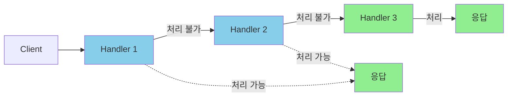
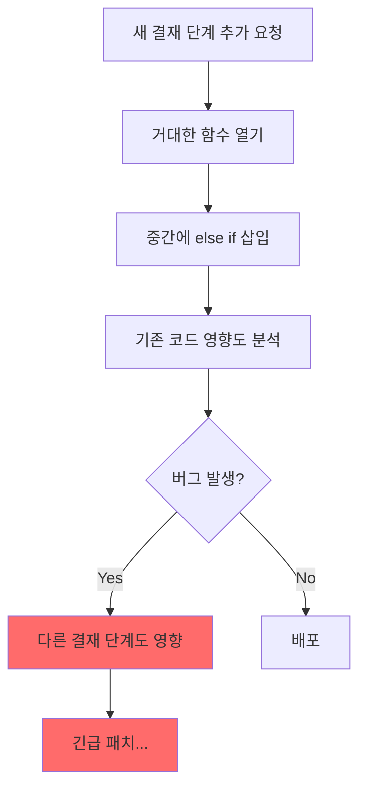

# Chain of Responsibility 패턴: 요청 처리의 연쇄

## "내가 처리할 수 있으면 처리, 아니면 다음으로"

결재 시스템을 개발하던 어느 날이었습니다.

<Callout type="warning" title="흔한 SI 현장의 대화">
**PM**: "박대리님, 결재 금액에 따라 승인 단계가 달라져야 해요. 100만원 이하는 팀장, 500만원 이하는 부서장, 1000만원 이하는 임원, 그 이상은 대표 결재까지 올라가야 하고요."

**개발자**: "네... (결재 처리 함수 열어봄) 현재 결재 승인자가 하드코딩되어 있는데..."

**PM**: "아, 그리고 이번 달부터 팀장 부재 시 파트장이 대신 결재할 수 있어야 해요. 그리고 휴가 중인 승인자는 자동으로 건너뛰고요."

**개발자**: "..." (이걸 if-else로 어떻게...)
</Callout>

처음엔 간단했습니다. 팀장 승인 → 부서장 승인 → 완료. 그런데 요구사항이 추가되면서 금액별 분기, 부재 시 대체 승인자, 긴급 결재 시 단계 스킵... 조건문이 기하급수적으로 늘어났습니다.

어느 날 문득 깨달았습니다. **결재 요청을 "처리 가능한 사람에게 순차적으로 전달하는 체인"으로 보면 어떨까?** 

이 생각이 바로 **Chain of Responsibility 패턴**의 핵심입니다.

---

## Chain of Responsibility 패턴이란?

**Chain of Responsibility 패턴**은 GoF(Gang of Four) 디자인 패턴 중 하나로, **요청을 처리할 수 있는 핸들러들을 체인으로 연결하고, 요청이 들어오면 체인을 따라 전달하면서 처리할 수 있는 핸들러가 처리**하게 하는 패턴입니다.

<Callout type="info" title="핵심 개념">
**"요청을 보내는 쪽과 받는 쪽을 분리하고, 여러 핸들러에게 처리 기회를 준다."**

- **Handler (Interface)**: 요청을 처리하거나 다음 핸들러에게 전달하는 공통 인터페이스
- **ConcreteHandler**: 실제 처리 로직을 구현한 각각의 핸들러
- **Client**: 체인의 첫 번째 핸들러에게 요청을 보내는 쪽
</Callout>



쉽게 말해, 고객 지원 티켓을 생각해보세요. 티켓이 들어오면 일반 상담원이 먼저 확인합니다. 자기가 처리할 수 있으면 처리하고, 아니면 선임 상담원에게 넘깁니다. 선임도 못 하면 팀장에게, 팀장도 못 하면 매니저에게... 이런 흐름이 바로 Chain of Responsibility입니다.

---

## 왜 필요한가요? 조건문 폭발

### 현실에서 만나는 승인 로직의 지옥

SI 프로젝트에서 결재 시스템은 필수입니다. 그리고 결재 시스템은 조건문 지옥의 온상이기도 합니다.

```typescript
// ❌ 나쁜 예: 결재 승인 함수
async function processApproval(
  request: ApprovalRequest
): Promise<ApprovalResult> {
  const amount = request.amount;
  const currentApprover = request.currentApprover;
  
  // 팀장 결재
  if (currentApprover.role === 'TEAM_LEADER') {
    if (amount <= 1000000) {
      // 100만원 이하는 팀장 최종 승인
      return finalApprove(request);
    } else if (currentApprover.isOnLeave) {
      // 휴가 중이면 대체 승인자
      const substitute = await getSubstitute(currentApprover.id);
      if (substitute) {
        return processApproval({ ...request, currentApprover: substitute });
      } else {
        // 대체 승인자 없으면 부서장에게 직접
        const deptHead = await getDepartmentHead(currentApprover.deptId);
        return processApproval({ ...request, currentApprover: deptHead });
      }
    } else {
      // 부서장에게 상신
      const deptHead = await getDepartmentHead(currentApprover.deptId);
      return requestApproval(request, deptHead);
    }
  }
  
  // 부서장 결재
  else if (currentApprover.role === 'DEPT_HEAD') {
    if (amount <= 5000000) {
      return finalApprove(request);
    } else if (currentApprover.isOnLeave) {
      // 또 같은 패턴 반복...
      const substitute = await getSubstitute(currentApprover.id);
      // ...
    } else {
      const executive = await getExecutive(currentApprover.deptId);
      return requestApproval(request, executive);
    }
  }
  
  // 임원 결재
  else if (currentApprover.role === 'EXECUTIVE') {
    if (amount <= 10000000) {
      return finalApprove(request);
    } else if (currentApprover.isOnLeave) {
      // 또 반복...
    } else {
      const ceo = await getCEO();
      return requestApproval(request, ceo);
    }
  }
  
  // 대표 결재
  else if (currentApprover.role === 'CEO') {
    // 대표는 무조건 최종 승인 가능
    return finalApprove(request);
  }
  
  throw new Error('알 수 없는 결재자 역할');
}
```

### 이 코드의 문제점

<Steps>
  <Step title="중복 코드의 향연">
    휴가 처리, 대체 승인자 조회 로직이 모든 분기에서 반복됩니다. 로직 하나 바뀌면 여러 곳을 수정해야 합니다.
  </Step>
  
  <Step title="새 결재 단계 추가의 고통">
    "파트장 결재 단계를 추가해주세요"라는 요청이 오면? 이 거대한 함수를 열어서 중간에 새로운 분기를 끼워넣어야 합니다. 기존 코드에 영향을 주지 않고 추가하기가 불가능합니다.
  </Step>
  
  <Step title="테스트의 어려움">
    부서장 결재만 테스트하고 싶어도 전체 함수를 로드해야 합니다. Mock 설정도 복잡해집니다.
  </Step>
  
  <Step title="조건 변경의 파급 효과">
    "부서장 결재 한도를 500만원에서 700만원으로 올려주세요." 간단해 보이지만, 이 함수의 어디를 수정해야 하는지 찾는 것부터가 일입니다.
  </Step>
</Steps>



---

## Chain of Responsibility 패턴 적용하기

### Step 1: 핸들러 인터페이스 정의

모든 승인자가 따라야 하는 "계약"을 정의합니다.

```typescript
// handlers/approval-handler.ts

export interface ApprovalRequest {
  id: string;
  type: 'EXPENSE' | 'LEAVE' | 'PURCHASE';
  amount: number;
  requesterId: string;
  description: string;
  metadata?: Record<string, unknown>;
}

export interface ApprovalResult {
  approved: boolean;
  handledBy: string;
  message?: string;
  nextHandler?: string;
}

// 모든 승인 핸들러가 구현해야 하는 인터페이스
export interface ApprovalHandler {
  readonly name: string;
  readonly approvalLimit: number;
  
  // 다음 핸들러 설정
  setNext(handler: ApprovalHandler): ApprovalHandler;
  
  // 요청 처리
  handle(request: ApprovalRequest): Promise<ApprovalResult>;
}
```

### Step 2: 추상 핸들러 구현

공통 로직을 담은 추상 클래스를 만듭니다.

```typescript
// handlers/base-approval-handler.ts

import { ApprovalHandler, ApprovalRequest, ApprovalResult } from './approval-handler';

export abstract class BaseApprovalHandler implements ApprovalHandler {
  protected nextHandler: ApprovalHandler | null = null;
  
  abstract readonly name: string;
  abstract readonly approvalLimit: number;
  
  // 체인 연결
  setNext(handler: ApprovalHandler): ApprovalHandler {
    this.nextHandler = handler;
    return handler; // 메서드 체이닝 지원
  }
  
  // 기본 처리 로직
  async handle(request: ApprovalRequest): Promise<ApprovalResult> {
    // 내가 처리할 수 있는지 확인
    if (this.canHandle(request)) {
      return this.processApproval(request);
    }
    
    // 다음 핸들러가 있으면 전달
    if (this.nextHandler) {
      return this.nextHandler.handle(request);
    }
    
    // 체인 끝까지 왔는데 아무도 처리 못함
    return {
      approved: false,
      handledBy: this.name,
      message: '승인 권한이 있는 결재자를 찾을 수 없습니다.',
    };
  }
  
  // 처리 가능 여부 판단 (하위 클래스에서 오버라이드 가능)
  protected canHandle(request: ApprovalRequest): boolean {
    return request.amount <= this.approvalLimit;
  }
  
  // 실제 승인 처리 (하위 클래스에서 구현)
  protected abstract processApproval(
    request: ApprovalRequest
  ): Promise<ApprovalResult>;
}
```

### Step 3: 구체적인 핸들러 구현

각 결재 단계를 독립적인 클래스로 분리합니다.

```typescript
// handlers/team-leader-handler.ts

import { BaseApprovalHandler } from './base-approval-handler';
import { ApprovalRequest, ApprovalResult } from './approval-handler';

export class TeamLeaderHandler extends BaseApprovalHandler {
  readonly name = '팀장';
  readonly approvalLimit = 1_000_000; // 100만원
  
  constructor(
    private readonly teamLeaderId: string,
    private readonly notificationService: NotificationService,
  ) {
    super();
  }
  
  protected async processApproval(
    request: ApprovalRequest
  ): Promise<ApprovalResult> {
    // 실제 승인 로직
    await this.saveApprovalLog(request, this.teamLeaderId);
    
    // 승인 완료 알림
    await this.notificationService.send(request.requesterId, {
      title: '결재 승인 완료',
      message: `${this.name}이 결재를 승인했습니다.`,
    });
    
    return {
      approved: true,
      handledBy: this.name,
      message: '팀장 결재 승인 완료',
    };
  }
  
  private async saveApprovalLog(request: ApprovalRequest, approverId: string) {
    // 결재 이력 저장
  }
}
```

```typescript
// handlers/department-head-handler.ts

import { BaseApprovalHandler } from './base-approval-handler';
import { ApprovalRequest, ApprovalResult } from './approval-handler';

export class DepartmentHeadHandler extends BaseApprovalHandler {
  readonly name = '부서장';
  readonly approvalLimit = 5_000_000; // 500만원
  
  constructor(
    private readonly deptHeadId: string,
    private readonly notificationService: NotificationService,
  ) {
    super();
  }
  
  protected async processApproval(
    request: ApprovalRequest
  ): Promise<ApprovalResult> {
    await this.saveApprovalLog(request, this.deptHeadId);
    
    await this.notificationService.send(request.requesterId, {
      title: '결재 승인 완료',
      message: `${this.name}이 결재를 승인했습니다.`,
    });
    
    return {
      approved: true,
      handledBy: this.name,
      message: '부서장 결재 승인 완료',
    };
  }
  
  private async saveApprovalLog(request: ApprovalRequest, approverId: string) {
    // 결재 이력 저장
  }
}
```

```typescript
// handlers/executive-handler.ts

import { BaseApprovalHandler } from './base-approval-handler';
import { ApprovalRequest, ApprovalResult } from './approval-handler';

export class ExecutiveHandler extends BaseApprovalHandler {
  readonly name = '임원';
  readonly approvalLimit = 10_000_000; // 1000만원
  
  constructor(
    private readonly executiveId: string,
    private readonly notificationService: NotificationService,
  ) {
    super();
  }
  
  protected async processApproval(
    request: ApprovalRequest
  ): Promise<ApprovalResult> {
    // 임원 결재는 추가 검토 프로세스
    await this.requestAdditionalReview(request);
    await this.saveApprovalLog(request, this.executiveId);
    
    await this.notificationService.send(request.requesterId, {
      title: '결재 승인 완료',
      message: `${this.name}이 결재를 승인했습니다.`,
    });
    
    return {
      approved: true,
      handledBy: this.name,
      message: '임원 결재 승인 완료',
    };
  }
  
  private async requestAdditionalReview(request: ApprovalRequest) {
    // 고액 결재 시 재무팀 검토 요청
    if (request.amount > 7_000_000) {
      // 재무팀 사전 검토
    }
  }
  
  private async saveApprovalLog(request: ApprovalRequest, approverId: string) {
    // 결재 이력 저장
  }
}
```

```typescript
// handlers/ceo-handler.ts

import { BaseApprovalHandler } from './base-approval-handler';
import { ApprovalRequest, ApprovalResult } from './approval-handler';

export class CEOHandler extends BaseApprovalHandler {
  readonly name = '대표이사';
  readonly approvalLimit = Infinity; // 무제한
  
  constructor(
    private readonly ceoId: string,
    private readonly notificationService: NotificationService,
  ) {
    super();
  }
  
  // 대표는 모든 요청을 처리할 수 있음
  protected canHandle(request: ApprovalRequest): boolean {
    return true; // 항상 처리 가능
  }
  
  protected async processApproval(
    request: ApprovalRequest
  ): Promise<ApprovalResult> {
    // 대표 결재는 이사회 보고 연동
    if (request.amount > 50_000_000) {
      await this.notifyBoardOfDirectors(request);
    }
    
    await this.saveApprovalLog(request, this.ceoId);
    
    await this.notificationService.send(request.requesterId, {
      title: '결재 최종 승인',
      message: '대표이사가 결재를 최종 승인했습니다.',
    });
    
    return {
      approved: true,
      handledBy: this.name,
      message: '대표이사 결재 승인 완료 (최종)',
    };
  }
  
  private async notifyBoardOfDirectors(request: ApprovalRequest) {
    // 고액 결재 이사회 보고
  }
  
  private async saveApprovalLog(request: ApprovalRequest, approverId: string) {
    // 결재 이력 저장
  }
}
```

### Step 4: 체인 조립 및 사용

```typescript
// services/approval-service.ts

import { ApprovalHandler, ApprovalRequest, ApprovalResult } from '@/handlers/approval-handler';
import { TeamLeaderHandler } from '@/handlers/team-leader-handler';
import { DepartmentHeadHandler } from '@/handlers/department-head-handler';
import { ExecutiveHandler } from '@/handlers/executive-handler';
import { CEOHandler } from '@/handlers/ceo-handler';

export class ApprovalService {
  private chain: ApprovalHandler;
  
  constructor(
    private readonly notificationService: NotificationService,
    private readonly userService: UserService,
  ) {
    // 체인 조립
    this.chain = this.buildChain();
  }
  
  private buildChain(): ApprovalHandler {
    // 핸들러 생성
    const teamLeader = new TeamLeaderHandler('TL001', this.notificationService);
    const deptHead = new DepartmentHeadHandler('DH001', this.notificationService);
    const executive = new ExecutiveHandler('EX001', this.notificationService);
    const ceo = new CEOHandler('CEO001', this.notificationService);
    
    // 체인 연결 (메서드 체이닝)
    teamLeader
      .setNext(deptHead)
      .setNext(executive)
      .setNext(ceo);
    
    return teamLeader; // 첫 번째 핸들러 반환
  }
  
  async requestApproval(request: ApprovalRequest): Promise<ApprovalResult> {
    return this.chain.handle(request);
  }
}
```

### Step 5: Next.js Server Action에서 사용

```typescript
// app/approval/actions.ts
'use server';

import { ApprovalService } from '@/services/approval-service';
import { NotificationService } from '@/services/notification-service';
import { UserService } from '@/services/user-service';
import { revalidatePath } from 'next/cache';

const approvalService = new ApprovalService(
  new NotificationService(),
  new UserService(),
);

export async function submitApprovalRequest(formData: FormData) {
  const request = {
    id: crypto.randomUUID(),
    type: formData.get('type') as 'EXPENSE' | 'LEAVE' | 'PURCHASE',
    amount: parseInt(formData.get('amount') as string),
    requesterId: formData.get('requesterId') as string,
    description: formData.get('description') as string,
  };
  
  try {
    const result = await approvalService.requestApproval(request);
    
    revalidatePath('/approvals');
    
    return result;
  } catch (error) {
    return {
      approved: false,
      handledBy: 'system',
      message: error instanceof Error ? error.message : '결재 요청 중 오류 발생',
    };
  }
}
```

---

## 실전 활용 예제 2: 요청 검증 파이프라인

결재 시스템만이 아닙니다. API 요청 검증에도 Chain of Responsibility가 빛을 발합니다.

### 시나리오

회원가입 요청이 들어오면 순차적으로 검증해야 합니다:
1. 필수값 체크 (이메일, 비밀번호, 이름)
2. 형식 검증 (이메일 형식, 비밀번호 규칙)
3. 중복 확인 (이메일 중복)
4. 비즈니스 룰 검증 (초대 코드 유효성, 가입 제한 등)

```typescript
// validators/validator-handler.ts

export interface ValidationRequest {
  email: string;
  password: string;
  name: string;
  inviteCode?: string;
}

export interface ValidationResult {
  valid: boolean;
  field?: string;
  message?: string;
}

export interface ValidatorHandler {
  setNext(handler: ValidatorHandler): ValidatorHandler;
  validate(request: ValidationRequest): Promise<ValidationResult>;
}
```

```typescript
// validators/base-validator.ts

export abstract class BaseValidator implements ValidatorHandler {
  protected nextHandler: ValidatorHandler | null = null;
  
  setNext(handler: ValidatorHandler): ValidatorHandler {
    this.nextHandler = handler;
    return handler;
  }
  
  async validate(request: ValidationRequest): Promise<ValidationResult> {
    const result = await this.doValidate(request);
    
    // 검증 실패하면 즉시 리턴 (체인 중단)
    if (!result.valid) {
      return result;
    }
    
    // 다음 검증자에게 전달
    if (this.nextHandler) {
      return this.nextHandler.validate(request);
    }
    
    // 모든 검증 통과
    return { valid: true };
  }
  
  protected abstract doValidate(
    request: ValidationRequest
  ): Promise<ValidationResult>;
}
```

```typescript
// validators/required-field-validator.ts

export class RequiredFieldValidator extends BaseValidator {
  protected async doValidate(
    request: ValidationRequest
  ): Promise<ValidationResult> {
    if (!request.email) {
      return { valid: false, field: 'email', message: '이메일은 필수입니다.' };
    }
    if (!request.password) {
      return { valid: false, field: 'password', message: '비밀번호는 필수입니다.' };
    }
    if (!request.name) {
      return { valid: false, field: 'name', message: '이름은 필수입니다.' };
    }
    return { valid: true };
  }
}
```

```typescript
// validators/format-validator.ts

export class FormatValidator extends BaseValidator {
  private readonly emailRegex = /^[^\s@]+@[^\s@]+\.[^\s@]+$/;
  private readonly passwordRegex = /^(?=.*[A-Za-z])(?=.*\d)(?=.*[@$!%*#?&])[A-Za-z\d@$!%*#?&]{8,}$/;
  
  protected async doValidate(
    request: ValidationRequest
  ): Promise<ValidationResult> {
    if (!this.emailRegex.test(request.email)) {
      return { 
        valid: false, 
        field: 'email', 
        message: '올바른 이메일 형식이 아닙니다.' 
      };
    }
    
    if (!this.passwordRegex.test(request.password)) {
      return { 
        valid: false, 
        field: 'password', 
        message: '비밀번호는 8자 이상, 영문/숫자/특수문자를 포함해야 합니다.' 
      };
    }
    
    return { valid: true };
  }
}
```

```typescript
// validators/duplicate-validator.ts

export class DuplicateValidator extends BaseValidator {
  constructor(private readonly userRepository: UserRepository) {
    super();
  }
  
  protected async doValidate(
    request: ValidationRequest
  ): Promise<ValidationResult> {
    const existingUser = await this.userRepository.findByEmail(request.email);
    
    if (existingUser) {
      return { 
        valid: false, 
        field: 'email', 
        message: '이미 가입된 이메일입니다.' 
      };
    }
    
    return { valid: true };
  }
}
```

```typescript
// validators/business-rule-validator.ts

export class BusinessRuleValidator extends BaseValidator {
  constructor(
    private readonly inviteCodeService: InviteCodeService,
    private readonly configService: ConfigService,
  ) {
    super();
  }
  
  protected async doValidate(
    request: ValidationRequest
  ): Promise<ValidationResult> {
    // 초대 코드 필수 기간 체크
    const isInviteRequired = this.configService.get('INVITE_REQUIRED');
    
    if (isInviteRequired && !request.inviteCode) {
      return { 
        valid: false, 
        field: 'inviteCode', 
        message: '현재 초대 코드가 있어야 가입할 수 있습니다.' 
      };
    }
    
    if (request.inviteCode) {
      const isValidCode = await this.inviteCodeService.validate(request.inviteCode);
      if (!isValidCode) {
        return { 
          valid: false, 
          field: 'inviteCode', 
          message: '유효하지 않은 초대 코드입니다.' 
        };
      }
    }
    
    return { valid: true };
  }
}
```

### 검증 체인 조립

```typescript
// services/registration-service.ts

export class RegistrationService {
  private validatorChain: ValidatorHandler;
  
  constructor(
    private readonly userRepository: UserRepository,
    private readonly inviteCodeService: InviteCodeService,
    private readonly configService: ConfigService,
  ) {
    this.validatorChain = this.buildValidatorChain();
  }
  
  private buildValidatorChain(): ValidatorHandler {
    const requiredValidator = new RequiredFieldValidator();
    const formatValidator = new FormatValidator();
    const duplicateValidator = new DuplicateValidator(this.userRepository);
    const businessRuleValidator = new BusinessRuleValidator(
      this.inviteCodeService,
      this.configService,
    );
    
    requiredValidator
      .setNext(formatValidator)
      .setNext(duplicateValidator)
      .setNext(businessRuleValidator);
    
    return requiredValidator;
  }
  
  async register(request: ValidationRequest) {
    // 검증 체인 실행
    const validationResult = await this.validatorChain.validate(request);
    
    if (!validationResult.valid) {
      throw new ValidationError(
        validationResult.field!,
        validationResult.message!,
      );
    }
    
    // 검증 통과 후 회원 생성
    return this.userRepository.create({
      email: request.email,
      password: await this.hashPassword(request.password),
      name: request.name,
    });
  }
  
  private async hashPassword(password: string): Promise<string> {
    // 비밀번호 해싱
  }
}
```

---

## 실전 활용 예제 3: API 미들웨어 체인

Express나 Next.js 미들웨어도 본질적으로 Chain of Responsibility입니다.

### 시나리오

API 요청이 들어오면 순차적으로 처리합니다:
1. 로깅 → 2. 인증 → 3. 권한 체크 → 4. Rate Limiting → 5. 실제 핸들러

```typescript
// middleware/middleware-handler.ts

export interface MiddlewareContext {
  request: Request;
  response: Response;
  user?: User;
  metadata: Record<string, unknown>;
}

export interface MiddlewareResult {
  continue: boolean;
  response?: Response;
}

export interface MiddlewareHandler {
  setNext(handler: MiddlewareHandler): MiddlewareHandler;
  process(context: MiddlewareContext): Promise<MiddlewareResult>;
}
```

```typescript
// middleware/base-middleware.ts

export abstract class BaseMiddleware implements MiddlewareHandler {
  protected nextHandler: MiddlewareHandler | null = null;
  
  setNext(handler: MiddlewareHandler): MiddlewareHandler {
    this.nextHandler = handler;
    return handler;
  }
  
  async process(context: MiddlewareContext): Promise<MiddlewareResult> {
    const result = await this.handle(context);
    
    // 처리를 중단해야 하면 (에러, 인증 실패 등)
    if (!result.continue) {
      return result;
    }
    
    // 다음 미들웨어로 전달
    if (this.nextHandler) {
      return this.nextHandler.process(context);
    }
    
    return { continue: true };
  }
  
  protected abstract handle(
    context: MiddlewareContext
  ): Promise<MiddlewareResult>;
}
```

```typescript
// middleware/logging-middleware.ts

export class LoggingMiddleware extends BaseMiddleware {
  protected async handle(context: MiddlewareContext): Promise<MiddlewareResult> {
    const startTime = Date.now();
    
    console.log(`[${new Date().toISOString()}] ${context.request.method} ${context.request.url}`);
    
    // 메타데이터에 시작 시간 저장 (나중에 응답 시간 계산용)
    context.metadata.startTime = startTime;
    
    return { continue: true };
  }
}
```

```typescript
// middleware/auth-middleware.ts

export class AuthMiddleware extends BaseMiddleware {
  constructor(private readonly authService: AuthService) {
    super();
  }
  
  protected async handle(context: MiddlewareContext): Promise<MiddlewareResult> {
    const authHeader = context.request.headers.get('Authorization');
    
    if (!authHeader || !authHeader.startsWith('Bearer ')) {
      return {
        continue: false,
        response: new Response(
          JSON.stringify({ error: '인증이 필요합니다.' }),
          { status: 401 },
        ),
      };
    }
    
    const token = authHeader.substring(7);
    
    try {
      const user = await this.authService.verifyToken(token);
      context.user = user;
      return { continue: true };
    } catch {
      return {
        continue: false,
        response: new Response(
          JSON.stringify({ error: '유효하지 않은 토큰입니다.' }),
          { status: 401 },
        ),
      };
    }
  }
}
```

```typescript
// middleware/authorization-middleware.ts

export class AuthorizationMiddleware extends BaseMiddleware {
  constructor(private readonly requiredRoles: string[]) {
    super();
  }
  
  protected async handle(context: MiddlewareContext): Promise<MiddlewareResult> {
    const user = context.user;
    
    if (!user) {
      return {
        continue: false,
        response: new Response(
          JSON.stringify({ error: '인증 정보가 없습니다.' }),
          { status: 401 },
        ),
      };
    }
    
    const hasPermission = this.requiredRoles.some(
      role => user.roles.includes(role)
    );
    
    if (!hasPermission) {
      return {
        continue: false,
        response: new Response(
          JSON.stringify({ error: '권한이 없습니다.' }),
          { status: 403 },
        ),
      };
    }
    
    return { continue: true };
  }
}
```

```typescript
// middleware/rate-limit-middleware.ts

export class RateLimitMiddleware extends BaseMiddleware {
  private requestCounts: Map<string, { count: number; resetTime: number }> = new Map();
  
  constructor(
    private readonly maxRequests: number = 100,
    private readonly windowMs: number = 60000, // 1분
  ) {
    super();
  }
  
  protected async handle(context: MiddlewareContext): Promise<MiddlewareResult> {
    const clientId = context.user?.id || context.request.headers.get('X-Forwarded-For') || 'unknown';
    const now = Date.now();
    
    const clientData = this.requestCounts.get(clientId);
    
    if (!clientData || now > clientData.resetTime) {
      // 새 윈도우 시작
      this.requestCounts.set(clientId, {
        count: 1,
        resetTime: now + this.windowMs,
      });
      return { continue: true };
    }
    
    if (clientData.count >= this.maxRequests) {
      return {
        continue: false,
        response: new Response(
          JSON.stringify({ 
            error: '요청 한도를 초과했습니다. 잠시 후 다시 시도해주세요.' 
          }),
          { 
            status: 429,
            headers: {
              'Retry-After': String(Math.ceil((clientData.resetTime - now) / 1000)),
            },
          },
        ),
      };
    }
    
    clientData.count++;
    return { continue: true };
  }
}
```

### 미들웨어 체인 조립

```typescript
// services/api-handler.ts

export class ApiHandler {
  private middlewareChain: MiddlewareHandler;
  
  constructor(authService: AuthService) {
    this.middlewareChain = this.buildMiddlewareChain(authService);
  }
  
  private buildMiddlewareChain(authService: AuthService): MiddlewareHandler {
    const logging = new LoggingMiddleware();
    const auth = new AuthMiddleware(authService);
    const authorization = new AuthorizationMiddleware(['admin', 'user']);
    const rateLimit = new RateLimitMiddleware(100, 60000);
    
    logging
      .setNext(auth)
      .setNext(authorization)
      .setNext(rateLimit);
    
    return logging;
  }
  
  async handleRequest(request: Request): Promise<Response> {
    const context: MiddlewareContext = {
      request,
      response: new Response(),
      metadata: {},
    };
    
    const result = await this.middlewareChain.process(context);
    
    if (!result.continue && result.response) {
      return result.response;
    }
    
    // 모든 미들웨어 통과 후 실제 비즈니스 로직 실행
    return this.executeBusinessLogic(context);
  }
  
  private async executeBusinessLogic(context: MiddlewareContext): Promise<Response> {
    // 실제 API 로직
  }
}
```

---

## Before vs After 비교

### Before: 조건문 지옥

```typescript
// ❌ 나쁜 예: 200줄짜리 결재 함수
async function processApproval(request: ApprovalRequest) {
  if (request.currentApprover.role === 'TEAM_LEADER') {
    if (request.amount <= 1000000) {
      // 팀장 처리 로직 (30줄)
    } else {
      // 부서장에게 전달 로직 (20줄)
    }
  } else if (request.currentApprover.role === 'DEPT_HEAD') {
    if (request.amount <= 5000000) {
      // 부서장 처리 로직 (30줄)
    } else {
      // 임원에게 전달 로직 (20줄)
    }
  } else if (request.currentApprover.role === 'EXECUTIVE') {
    // ... 계속 반복
  }
}
```

**문제점:**
- 하나의 함수가 모든 결재 로직을 담당 (SRP 위반)
- 새 결재 단계 추가 시 기존 함수 수정 (OCP 위반)
- 테스트하기 어려움
- 조건 변경의 파급 효과가 큼

### After: Chain of Responsibility 패턴

```typescript
// ⭕ 좋은 예: 깔끔하게 분리된 구조

// 1. 각 핸들러가 독립적
class TeamLeaderHandler extends BaseApprovalHandler {
  async processApproval(request) { /* 팀장 로직만 */ }
}

class DepartmentHeadHandler extends BaseApprovalHandler {
  async processApproval(request) { /* 부서장 로직만 */ }
}

// 2. 체인으로 연결
teamLeader
  .setNext(deptHead)
  .setNext(executive)
  .setNext(ceo);

// 3. 요청 처리
const result = await chain.handle(request);
```

**개선점:**
- 각 핸들러가 독립적인 클래스로 분리 (SRP 준수)
- 새 결재 단계 추가 시 체인에 끼워넣기만 하면 됨 (OCP 준수)
- 각 핸들러를 독립적으로 테스트 가능
- 체인 순서 변경이 자유로움

---

## 동적 체인 구성

Chain of Responsibility의 진가는 **런타임에 체인을 동적으로 구성**할 수 있다는 점입니다.

### 부서별 다른 결재 체인

```typescript
// factories/approval-chain-factory.ts

export class ApprovalChainFactory {
  constructor(
    private readonly userService: UserService,
    private readonly notificationService: NotificationService,
  ) {}
  
  async createChain(departmentId: string, amount: number): Promise<ApprovalHandler> {
    const department = await this.userService.getDepartment(departmentId);
    const handlers: ApprovalHandler[] = [];
    
    // 팀장 (모든 부서 공통)
    const teamLeader = await this.userService.getTeamLeader(departmentId);
    handlers.push(new TeamLeaderHandler(teamLeader.id, this.notificationService));
    
    // 부서별 특수 결재선
    if (department.type === 'SALES') {
      // 영업부서: 영업이사 단계 추가
      const salesDirector = await this.userService.getSalesDirector();
      handlers.push(new SalesDirectorHandler(salesDirector.id, this.notificationService));
    }
    
    if (department.type === 'RND') {
      // 연구개발부서: 기술이사 단계 추가
      const techDirector = await this.userService.getTechDirector();
      handlers.push(new TechDirectorHandler(techDirector.id, this.notificationService));
    }
    
    // 고액 결재면 임원/대표 추가
    if (amount > 5_000_000) {
      const executive = await this.userService.getExecutive();
      handlers.push(new ExecutiveHandler(executive.id, this.notificationService));
    }
    
    if (amount > 10_000_000) {
      const ceo = await this.userService.getCEO();
      handlers.push(new CEOHandler(ceo.id, this.notificationService));
    }
    
    // 체인 연결
    for (let i = 0; i < handlers.length - 1; i++) {
      handlers[i].setNext(handlers[i + 1]);
    }
    
    return handlers[0];
  }
}
```

### 조건부 핸들러 스킵

휴가 중인 결재자를 자동으로 건너뛰는 핸들러:

```typescript
// handlers/skip-on-leave-handler.ts

export class SkipOnLeaveHandler extends BaseApprovalHandler {
  constructor(
    private readonly wrappedHandler: ApprovalHandler,
    private readonly userService: UserService,
  ) {
    super();
  }
  
  get name() {
    return this.wrappedHandler.name;
  }
  
  get approvalLimit() {
    return this.wrappedHandler.approvalLimit;
  }
  
  async handle(request: ApprovalRequest): Promise<ApprovalResult> {
    // 휴가 중인지 확인
    const approver = await this.userService.getApprover(this.wrappedHandler.name);
    
    if (approver.isOnLeave) {
      // 휴가 중이면 다음 핸들러로 바로 전달
      if (this.nextHandler) {
        return this.nextHandler.handle(request);
      }
      return {
        approved: false,
        handledBy: this.name,
        message: `${this.name}이 부재 중이며, 다음 결재자가 없습니다.`,
      };
    }
    
    // 휴가 중이 아니면 원래 핸들러 실행
    const originalNext = (this.wrappedHandler as any).nextHandler;
    (this.wrappedHandler as any).nextHandler = this.nextHandler;
    
    const result = await this.wrappedHandler.handle(request);
    
    (this.wrappedHandler as any).nextHandler = originalNext;
    
    return result;
  }
  
  protected async processApproval(request: ApprovalRequest): Promise<ApprovalResult> {
    throw new Error('This should not be called directly');
  }
}
```

---

## 트레이드오프

### 장점

**1. 단일 책임 원칙 (SRP)**
- 각 핸들러가 하나의 처리 로직만 담당
- 코드 변경 영향 범위가 명확

**2. 개방-폐쇄 원칙 (OCP)**
- 새 핸들러 추가 시 기존 코드 수정 없음
- 체인에 끼워넣기만 하면 됨

**3. 요청-처리자 결합도 감소**
- 요청을 보내는 쪽이 누가 처리하는지 몰라도 됨
- 처리자 변경이 클라이언트에 영향 없음

**4. 유연한 체인 구성**
- 런타임에 체인 동적 구성 가능
- 순서 변경, 핸들러 추가/제거가 자유로움

**5. 테스트 용이성**
- 각 핸들러를 독립적으로 단위 테스트
- Mock 핸들러로 쉽게 교체

### 단점

**1. 처리 보장 없음**
- 체인 끝까지 갔는데 아무도 처리 못할 수 있음
- 기본 핸들러나 예외 처리 필요

**2. 디버깅 어려움**
- 요청이 어느 핸들러에서 처리됐는지 추적 필요
- 로깅 미들웨어 추가 권장

**3. 성능 오버헤드**
- 체인이 길면 모든 핸들러를 거쳐야 함
- 대부분의 경우 무시할 수 있는 수준

**4. 클래스 수 증가**
- 핸들러마다 클래스 필요
- 간단한 경우 오버엔지니어링이 될 수 있음

---

## 언제 사용해야 할까?

### 사용해야 하는 경우

**1. 다단계 승인/결재 프로세스**
```typescript
// 금액별, 부서별로 결재선이 동적으로 결정될 때
팀장 → 부서장 → 임원 → 대표
```

**2. 요청 검증 파이프라인**
```typescript
// 여러 검증을 순차적으로 거쳐야 할 때
필수값 체크 → 형식 검증 → 중복 확인 → 비즈니스 룰
```

**3. 이벤트 처리 체인**
```typescript
// 이벤트를 여러 핸들러가 처리할 수 있을 때
로깅 → 알림 → 분석 → 저장
```

**4. 미들웨어/필터 체인**
```typescript
// HTTP 요청을 여러 단계로 처리할 때
인증 → 권한 → Rate Limit → 캐싱 → 핸들러
```

### 사용하지 말아야 하는 경우

**1. 처리자가 고정되어 있을 때**
```typescript
// 무조건 특정 서비스가 처리해야 하는 경우
// 그냥 직접 호출이 더 명확
await specificService.process(request);
```

**2. 처리 단계가 2개 이하일 때**
```typescript
// 이 정도는 if-else가 더 직관적
if (isSimpleCase) {
  handleSimple();
} else {
  handleComplex();
}
```

**3. 모든 핸들러가 반드시 실행되어야 할 때**
```typescript
// 순차적으로 모두 실행해야 하면
// 그냥 순서대로 호출하는 게 명확
await step1.execute();
await step2.execute();
await step3.execute();
```

**4. 성능이 극도로 중요한 경우**
- 핸들러 체인 순회의 오버헤드
- 대부분 무시할 수 있지만, 초당 수십만 건이면 고려

---

## 실무 적용 체크리스트

<Callout type="info" title="Chain of Responsibility 패턴 적용 체크리스트">
- [ ] 요청을 처리할 수 있는 핸들러가 여러 개인가?
- [ ] 어떤 핸들러가 처리할지 런타임에 결정되는가?
- [ ] 처리 단계가 3개 이상인가?
- [ ] 처리 단계의 추가/제거가 빈번한가?
- [ ] 처리 순서를 유연하게 바꿔야 하는가?
- [ ] 각 처리 로직을 독립적으로 테스트하고 싶은가?

**3개 이상 "예"라면 Chain of Responsibility 패턴을 고려하세요.**
</Callout>

---

## 마치며

<Callout type="success" title="결론">
Chain of Responsibility 패턴은 **요청을 처리할 수 있는 핸들러들을 체인으로 연결하고, 요청이 처리될 때까지 체인을 따라 전달**하는 패턴입니다.

핵심은 간단합니다:
1. 공통 핸들러 인터페이스를 정의한다
2. 각 처리 로직을 별도 핸들러로 구현한다
3. 핸들러들을 체인으로 연결한다
4. 요청을 체인의 첫 핸들러에게 보낸다

이렇게 하면 **복잡한 조건문 분기에서 벗어나고**, **새 처리 단계 추가가 기존 코드에 영향을 주지 않으며**, **처리 순서를 유연하게 변경**할 수 있습니다.
</Callout>

<Callout type="warning" title="주의">
모든 순차 처리에 Chain of Responsibility를 적용하려 하지 마세요.

처리자가 고정되어 있거나, 단계가 2개뿐이거나, 모든 단계가 반드시 실행되어야 한다면 그냥 순차 호출이 더 낫습니다. **"이 요청을 누가 처리해야 하는지 동적으로 결정해야 하는데?"**라는 상황에서 적용하세요.
</Callout>

---

<Reference 
  title="Chain of Responsibility Pattern - Refactoring.Guru"
  url="https://refactoring.guru/design-patterns/chain-of-responsibility"
  description="Chain of Responsibility 패턴의 개념과 다양한 언어별 구현 예제"
/>

<Reference 
  title="Chain of Responsibility Pattern - Wikipedia"
  url="https://en.wikipedia.org/wiki/Chain-of-responsibility_pattern"
  description="Chain of Responsibility 패턴의 역사와 GoF 원본 설명"
/>

<Reference 
  title="Express.js Middleware"
  url="https://expressjs.com/en/guide/using-middleware.html"
  description="Chain of Responsibility 패턴의 실제 적용 사례인 Express 미들웨어"
/>

