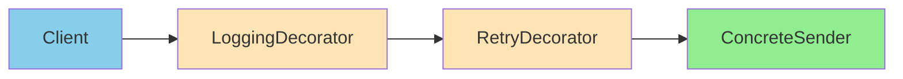

# Decorator 패턴: 기능의 동적 확장

## 시작하며

SI 프로젝트에서는 "기존 기능을 유지한 채 옵션만 켜고 끄는" 요구가 끝없이 들어옵니다.

- 알림 발송: 기본 이메일에 **재시도**, **SMS 폴백**, **발송 로그**를 붙여달라
- 파일 다운로드: 기존 응답에 **압축**, **암호화**, **감사 로그**를 선택적으로 적용해달라
- 외부 API 호출: 상황에 따라 **캐싱**을 쓰거나 **서킷 브레이커**를 켜달라

이때 기존 클래스를 수정하면 다른 팀·테넌트에 영향을 줄 수 있습니다. **Decorator 패턴**은 원본을 건드리지 않고, 필요한 기능을 감싸며 순서를 조합해 적용할 수 있는 해법입니다.

---

## 문제 상황: 상속과 플래그 파라미터의 늪

<Callout type="warning" title="흔한 요구사항 (알림 서비스)">
1) 기본 이메일 발송  
2) 실패 시 3회 재시도  
3) 모두 실패하면 SMS 폴백  
4) 발송 내역을 DB에 기록  
5) 대량 발송 시 속도 제한(Throttle)
</Callout>

순진하게 구현하면 이렇게 됩니다:

```typescript
// ❌ 플래그/상속 폭발
class NotificationService {
  constructor(
    private enableRetry = false,
    private enableSmsFallback = false,
    private enableLogging = false,
    private enableThrottle = false
  ) {}

  async send(message: Message) {
    if (this.enableThrottle) {
      await this.throttle();
    }

    try {
      await emailClient.send(message);
    } catch (error) {
      if (this.enableRetry) {
        await this.retry(message);
      }

      if (this.enableSmsFallback) {
        await smsClient.send(message);
      }
    }

    if (this.enableLogging) {
      await logHistory(message);
    }
  }
}
```

- 플래그가 늘어날수록 `if`가 폭발하고, 기능 순서를 바꾸려면 본문을 다시 수정해야 합니다.
- "로그를 가장 먼저 남기고 싶다", "SMS 폴백 전에 제한을 걸어달라" 같은 **순서 변경** 요청에 취약합니다.
- 클래스 상속으로 해결하려고 하면 `RetryEmailNotification`, `RetryAndLogEmailNotification`, `RetryLogThrottleEmailNotification` 같은 **서브클래스 조합 지옥**이 펼쳐집니다.

---

## Decorator 패턴 한눈에 보기

<Callout type="info" title="정의">
**객체를 감싸는 래퍼(Decorator)를 통해 런타임에 동적으로 기능을 추가하거나 변경**하는 패턴입니다. 원본 객체는 수정하지 않고, 데코레이터를 겹겹이 둘러 기능을 합성합니다.
</Callout>



- **구성(Composition)**: 데코레이터는 동일한 인터페이스를 구현하고, 내부에 원본(또는 또 다른 데코레이터)을 참조합니다.
- **순서 제어**: 감싸는 순서가 곧 실행 순서입니다. `Logging -> Retry -> Sender`와 `Retry -> Logging -> Sender`는 다른 동작을 만듭니다.
- **개방-폐쇄 원칙**: 기능 추가는 데코레이터 클래스를 더 만드는 것으로 충분합니다.

---

## 실전 시나리오: 다단계 알림 파이프라인

```
사용자 요청 → (Throttle) → (로그) → (재시도) → 기본 이메일 전송 → 실패 시 (SMS 폴백)
```

### 1단계: 공통 인터페이스 정의

```typescript
// notifications/notification-sender.ts
export interface NotificationSender {
  send(message: Message): Promise<void>;
}

export interface Message {
  to: string;
  title: string;
  body: string;
  meta?: Record<string, unknown>;
}
```

### 2단계: 기본 구현체

```typescript
// notifications/email-sender.ts
export class EmailSender implements NotificationSender {
  async send(message: Message) {
    await emailClient.send({
      to: message.to,
      subject: message.title,
      html: message.body,
    });
  }
}
```

### 3단계: 추상 데코레이터

```typescript
// notifications/decorators/base.decorator.ts
export abstract class NotificationDecorator implements NotificationSender {
  constructor(protected readonly sender: NotificationSender) {}
  abstract send(message: Message): Promise<void>;
}
```

### 4단계: 기능별 데코레이터

```typescript
// notifications/decorators/logging.decorator.ts
import { Logger } from '@nestjs/common';

export class LoggingDecorator extends NotificationDecorator {
  private readonly logger = new Logger(LoggingDecorator.name);

  async send(message: Message) {
    this.logger.log(`Send to ${message.to}, title="${message.title}"`);
    const started = performance.now();

    await this.sender.send(message);

    this.logger.log(
      `Done in ${Math.round(performance.now() - started)}ms`,
    );
  }
}
```

```typescript
// notifications/decorators/retry.decorator.ts
export class RetryDecorator extends NotificationDecorator {
  constructor(
    sender: NotificationSender,
    private readonly maxAttempts = 3,
    private readonly delayMs = 200,
  ) {
    super(sender);
  }

  async send(message: Message) {
    let lastError: unknown;

    for (let attempt = 1; attempt <= this.maxAttempts; attempt++) {
      try {
        await this.sender.send(message);
        return;
      } catch (error) {
        lastError = error;
        if (attempt < this.maxAttempts) {
          await new Promise((r) => setTimeout(r, this.delayMs));
        }
      }
    }

    throw lastError;
  }
}
```

```typescript
// notifications/decorators/fallback.decorator.ts
export class FallbackDecorator extends NotificationDecorator {
  constructor(
    sender: NotificationSender,
    private readonly fallback: NotificationSender,
  ) {
    super(sender);
  }

  async send(message: Message) {
    try {
      await this.sender.send(message);
    } catch (error) {
      await this.fallback.send(message);
    }
  }
}
```

```typescript
// notifications/decorators/throttle.decorator.ts
import { RateLimiterMemory } from 'rate-limiter-flexible';

const limiter = new RateLimiterMemory({
  points: 10, // 10 requests
  duration: 1, // per 1 second
});

export class ThrottleDecorator extends NotificationDecorator {
  async send(message: Message) {
    await limiter.consume(message.to);
    await this.sender.send(message);
  }
}
```

### 5단계: 조합(Composition)

```typescript
// notifications/factory.ts
export function buildNotificationSender(options: {
  useLogging?: boolean;
  useRetry?: boolean;
  useThrottle?: boolean;
  useSmsFallback?: boolean;
}): NotificationSender {
  let sender: NotificationSender = new EmailSender();

  if (options.useSmsFallback) {
    sender = new FallbackDecorator(sender, new SmsSender());
  }

  if (options.useThrottle) {
    sender = new ThrottleDecorator(sender);
  }

  if (options.useRetry) {
    sender = new RetryDecorator(sender, 3, 300);
  }

  if (options.useLogging) {
    sender = new LoggingDecorator(sender);
  }

  return sender;
}
```

```typescript
// use-case
const sender = buildNotificationSender({
  useLogging: true,
  useRetry: true,
  useThrottle: true,
  useSmsFallback: true,
});

await sender.send({
  to: 'user@example.com',
  title: '결재 요청 알림',
  body: '<p>결재가 필요합니다.</p>',
});
```

- **순서 제어**: `Logging → Retry → Throttle → Fallback → Email` 순서로 실행됩니다. 원하는 순서로 감싸기만 하면 됩니다.
- **새 기능 추가**: 예를 들어 **TemplateDecorator**, **EncryptionDecorator**를 추가해도 기존 데코레이터는 수정하지 않습니다.

---

## Before / After

```typescript
// ❌ 변경마다 if-else를 건드려야 하는 코드
async function sendNotification(message: Message) {
  if (isThrottled(message.to)) throw new Error('too many requests');
  try {
    await emailClient.send(message);
  } catch (e) {
    await smsClient.send(message); // 항상 폴백
  }
  await logHistory(message); // 항상 로깅
}
```

```typescript
// ✅ 조합으로 제어되는 코드
const sender = new LoggingDecorator(
  new RetryDecorator(
    new ThrottleDecorator(
      new FallbackDecorator(new EmailSender(), new SmsSender()),
    ),
  ),
);

await sender.send(message);
```

---

## NestJS에 적용하기

```typescript
// notifications/notification.module.ts
@Module({
  providers: [
    EmailSender,
    SmsSender,
    {
      provide: 'NotificationSender',
      useFactory: (
        config: ConfigService,
        email: EmailSender,
        sms: SmsSender,
      ): NotificationSender => {
        let sender: NotificationSender = email;

        if (config.get('notification.smsFallback')) {
          sender = new FallbackDecorator(sender, sms);
        }

        if (config.get('notification.retry')) {
          sender = new RetryDecorator(sender);
        }

        if (config.get('notification.logging')) {
          sender = new LoggingDecorator(sender);
        }

        return sender;
      },
      inject: [ConfigService, EmailSender, SmsSender],
    },
  ],
  exports: ['NotificationSender'],
})
export class NotificationModule {}
```

서비스에서는 인터페이스로만 주입받습니다:

```typescript
@Injectable()
export class ApprovalService {
  constructor(
    @Inject('NotificationSender')
    private readonly sender: NotificationSender,
  ) {}

  async notifyApproval(requestId: string) {
    const message = await this.buildMessage(requestId);
    await this.sender.send(message);
  }
}
```

---

## 프론트엔드에서도 유용하다

API 클라이언트를 감싸면 다음과 같이 쓸 수 있습니다.

```typescript
// http/http-client.ts
export interface HttpClient {
  request<T>(input: RequestInfo, init?: RequestInit): Promise<T>;
}

export class FetchClient implements HttpClient {
  async request<T>(input: RequestInfo, init?: RequestInit) {
    const res = await fetch(input, init);
    if (!res.ok) throw new Error(res.statusText);
    return (await res.json()) as T;
  }
}
```

```typescript
// http/decorators/auth-header.decorator.ts
export class AuthHeaderDecorator implements HttpClient {
  constructor(private readonly client: HttpClient) {}

  async request<T>(input: RequestInfo, init: RequestInit = {}) {
    const token = await getAccessToken();
    return this.client.request<T>(input, {
      ...init,
      headers: {
        ...(init.headers || {}),
        Authorization: `Bearer ${token}`,
      },
    });
  }
}
```

```typescript
// 조합 예시 (Next.js 클라이언트 컴포넌트)
const httpClient: HttpClient = new RetryHttpDecorator(
  new TraceDecorator(
    new AuthHeaderDecorator(new FetchClient()),
  ),
);

const data = await httpClient.request<User[]>('/api/users');
```

- axios → fetch 교체가 필요하면 `FetchClient`만 바꾸면 됩니다.
- 로깅, 트레이싱, 캐싱, 토큰 자동 갱신을 데코레이터로 켜고 끌 수 있습니다.

---

## Next.js Fullstack에서의 한계와 우회

Next.js(App Router, Server Actions)에서는 **요청 스코프 DI**가 없고, 서버와 클라이언트 경계가 자주 섞입니다. 그래서 NestJS처럼 클래스를 주입해 감싸는 전통적인 데코레이터 구성이 어렵습니다.

- **한계**
  - Route Handler/Server Action은 함수 단위라 의존성 그래프가 짧고, 각 요청마다 클래스를 인스턴스화하기 번거롭습니다.
  - Edge Runtime에서는 일부 라이브러리(예: Node 전용 Redis 클라이언트) 사용이 제한됩니다.
  - 클라이언트 컴포넌트까지 데코레이터 체인을 끌어가면 번들 크기와 직렬화 제약에 걸립니다.

- **우회 전략**
  - `/app/api/*` 또는 별도 `lib/services/*`에 **순수 함수형 데코레이터**를 둡니다. `withLogging(withRetry(withFetch(fetch)))`처럼 함수 합성으로 동일한 개념을 구현합니다.
  - Edge 전용과 Node 전용을 **두 레이어**로 분리합니다. 공용 인터페이스(`HttpClient`)는 유지하고 구현체만 `node`/`edge`로 나눠 주입합니다.
  - 가능하면 **BFF/백엔드 분리**가 가장 깔끔합니다. Next.js는 UI와 SSR/Suspense에 집중하고, 패턴이 필요한 복잡 로직은 BFF로 이동해 클래식 데코레이터를 적용합니다.

```typescript
// app/lib/http.ts - 함수형 합성
export type Http = <T>(url: string, init?: RequestInit) => Promise<T>;

export const withLogging =
  (next: Http): Http =>
  async (url, init) => {
    console.log('request', url);
    const res = await next(url, init);
    console.log('done', url);
    return res;
  };

export const withRetry =
  (next: Http, maxAttempts = 3): Http =>
  async (url, init) => {
    let last;
    for (let i = 1; i <= maxAttempts; i++) {
      try {
        return await next(url, init);
      } catch (e) {
        last = e;
      }
    }
    throw last;
  };
```

---

## Memory KV Store(예: Redis)와 함께 쓰기

Decorator는 **캐싱·락·스루/폴백**을 붙이는 데도 유용합니다.

```typescript
// http/decorators/cache.decorator.ts
export class CacheDecorator implements HttpClient {
  constructor(
    private readonly client: HttpClient,
    private readonly kv: { get: (k: string) => Promise<string | null>; set: (k: string, v: string, ttl: number) => Promise<void> },
    private readonly ttlSec = 60,
  ) {}

  async request<T>(input: RequestInfo, init?: RequestInit): Promise<T> {
    const key = `http:${input}:${JSON.stringify(init)}`;
    const cached = await this.kv.get(key);
    if (cached) return JSON.parse(cached) as T;

    const data = await this.client.request<T>(input, init);
    await this.kv.set(key, JSON.stringify(data), this.ttlSec);
    return data;
  }
}
```

- **KV 선택**: Redis, Upstash, Cloudflare KV 등 어떤 KV든 인터페이스만 맞추면 됩니다.
- **정합성**: TTL을 짧게, 혹은 `stale-while-revalidate`처럼 백그라운드 갱신을 추가하는 `StaleWhileRevalidateDecorator`를 한 겹 더 감쌀 수 있습니다.
- **락/멱등성**: Redis `SET NX PX` 기반으로 `IdempotencyDecorator`, `DedupDecorator`를 추가해 중복 호출을 막을 수 있습니다.
- **스탬피드 방지**: 캐시 미스 시 단일 항목만 갱신하도록 세마포어/락 데코레이터를 추가합니다.

---

## 적용 체크리스트

<Steps>
  <Step title="인터페이스 명확화">
    모든 데코레이터가 따를 얇은 인터페이스를 먼저 정의하세요. 메서드 시그니처가 불안정하면 데코레이터가 흔들립니다.
  </Step>
  <Step title="순서 설계">
    로깅처럼 앞뒤 어디에 붙여도 되는 것과, Throttle처럼 반드시 앞에 있어야 하는 것을 구분해 순서를 설계하세요.
  </Step>
  <Step title="상태 최소화">
    데코레이터 내부 상태를 최소화하고, 공통 상태는 Context로 분리하세요. 상태 공유가 필요하면 Request Context를 명시적으로 전달합니다.
  </Step>
  <Step title="구성(Composition) 팩토리">
    환경변수·테넌트 설정으로 데코레이터 조합을 결정하는 팩토리 함수를 둡니다. 코드 수정 없이 기능을 켜고 끌 수 있습니다.
  </Step>
</Steps>

---

## 언제 쓰면 안 될까?

- **기능 순서가 자주 바뀌고, 순서마다 의미가 크게 다르면**: 파이프라인 또는 전략 테이블이 더 명확할 수 있습니다.
- **상태 공유가 필요한 경우**: 데코레이터끼리 상태를 공유하면 의존성이 생깁니다. Context 객체나 미들웨어 스타일 파이프라인이 더 적합할 수 있습니다.
- **단일 책임이 불명확할 때**: 데코레이터가 비대해지면 다시 분해하거나 다른 패턴(Template Method, Middleware)와 조합을 고려하세요.

---

## 실무 팁

- **로깅/트레이싱을 가장 바깥에** 두면 실패 상황을 모두 기록할 수 있습니다.
- **예외 전달 규칙**을 정하세요. 예: `FallbackDecorator`는 마지막 예외를 삼키고 성공 처리, `LoggingDecorator`는 예외를 다시 던진다.
- **테스트**: 각 데코레이터를 단독으로 테스트한 뒤, 2~3개 조합을 스냅샷처럼 검증하세요. 전체 조합을 모두 테스트할 필요는 없습니다.
- **구성 정보화**: 테넌트별로 `notification: { retry: true, fallback: 'sms', throttle: false }`처럼 설정해두면 배포 없이 조합을 바꿀 수 있습니다.

---

## 마치며

Decorator 패턴은 **개방-폐쇄 원칙**을 실무에서 가장 쉽게 체감하게 해주는 패턴입니다. 기능을 추가하고 순서를 조합해야 하는 요구가 반복된다면, 거대한 `if-else`나 상속 트리를 만들기 전에 **데코레이터를 한 겹씩 감싸는 설계**를 시도해 보세요. 코드는 단순해지고, 팀은 빠르게 대응할 수 있습니다.
