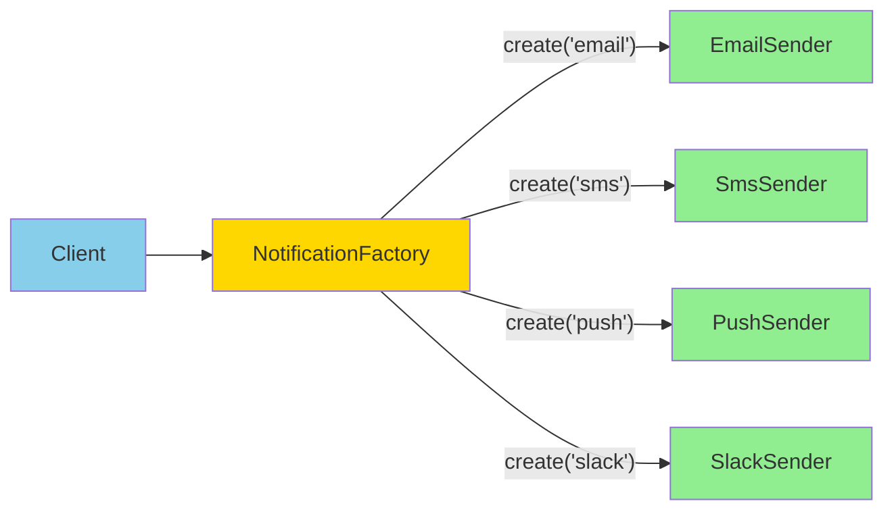

# Factory 패턴: 객체 생성의 캡슐화

## 시작하며

SI 프로젝트에서는 "타입에 따라 다른 객체를 생성"하는 요구사항이 끝없이 반복됩니다.

- 알림 발송: `type`이 `"email"`이면 `EmailSender`, `"sms"`면 `SmsSender`, `"push"`면 `PushSender`
- 리포트 생성: `"excel"` → `ExcelGenerator`, `"pdf"` → `PdfGenerator`, `"csv"` → `CsvGenerator`
- 결제 처리: `"kakao"` → `KakaoPayment`, `"toss"` → `TossPayment`, `"naver"` → `NaverPayment`
- 인증 전략: `"jwt"` → `JwtAuthService`, `"oauth"` → `OAuthService`, `"session"` → `SessionAuthService`

이런 코드가 여기저기 흩어지면 다음과 같은 문제가 발생합니다:
- 새로운 타입 추가 시 모든 분기문을 찾아 수정해야 함
- 객체 생성 로직이 복잡하면(API 키, DB 연결, 설정 로딩) 중복 코드 폭발
- "어떤 타입이 있는지" 파악하기 어려움

**Factory 패턴**은 객체 생성 로직을 한 곳에 모아두고, 호출하는 쪽은 "무엇을 만들지"만 알려주면 되는 패턴입니다.

---

## 문제 상황: new의 반복과 초기화 지옥

<Callout type="warning" title="흔한 요구사항 (알림 시스템)">
클라이언트가 원하는 방식으로 알림을 보내야 합니다:

- 일반 사용자: 이메일
- 프리미엄 사용자: SMS + 푸시 알림
- VIP 고객: Slack DM
- 관리자: Telegram 봇

각각의 발송 채널은 API 키, 연결 설정, 재시도 정책이 모두 다릅니다.
</Callout>

순진하게 구현하면 이렇게 됩니다:

```typescript
// ❌ 호출하는 곳마다 if-else와 초기화 로직 중복
async function sendNotification(type: string, message: Message) {
  if (type === 'email') {
    const sender = new EmailSender();
    await sender.configure({
      host: process.env.SMTP_HOST,
      port: parseInt(process.env.SMTP_PORT),
      auth: { user: process.env.SMTP_USER, pass: process.env.SMTP_PASS },
    });
    await sender.send(message);
  } else if (type === 'sms') {
    const sender = new SmsSender();
    await sender.configure({
      apiKey: process.env.SMS_API_KEY,
      provider: 'twilio',
    });
    await sender.send(message);
  } else if (type === 'push') {
    const sender = new PushSender();
    await sender.configure({
      fcmKey: process.env.FCM_KEY,
      apnsKey: process.env.APNS_KEY,
    });
    await sender.send(message);
  } else if (type === 'slack') {
    const sender = new SlackSender();
    await sender.configure({
      webhookUrl: process.env.SLACK_WEBHOOK,
      botToken: process.env.SLACK_BOT_TOKEN,
    });
    await sender.send(message);
  } else {
    throw new Error(`Unknown notification type: ${type}`);
  }
}
```

이제 이 로직을 **3개 서비스, 10개 API 핸들러**에서 복사해서 쓴다고 상상해 보세요:

- Slack 추가 시 10곳을 찾아 수정
- SMTP 설정 변경 시 3개 서비스 모두 수정
- 초기화 로직이 복잡해질수록 중복 코드 증가
- "어떤 타입이 지원되는지" 코드를 다 읽어봐야 앎

---

## Factory 패턴 한눈에 보기

<Callout type="info" title="정의">
**객체 생성 로직을 별도 클래스(Factory)로 분리**하여, 클라이언트는 생성 방법을 몰라도 "무엇을 만들지"만 요청하면 완전히 초기화된 객체를 받을 수 있게 하는 패턴입니다.
</Callout>



### 핵심 개념

- **단일 책임**: Factory는 "객체를 만드는 것"만 담당합니다.
- **캡슐화**: 복잡한 초기화 로직(설정 로딩, API 연결)은 Factory 내부에 숨겨집니다.
- **확장 용이**: 새로운 타입 추가 시 Factory에만 케이스를 추가하면 됩니다.
- **타입 안전**: TypeScript에서는 Factory가 유니온 타입을 좁혀 구체 타입을 반환할 수 있습니다.

### 변형 패턴들

Factory 패턴에는 여러 변형이 있습니다:

- **Simple Factory**: 정적 메서드로 객체 생성 (`NotificationFactory.create(type)`)
- **Factory Method**: 추상 클래스/인터페이스로 생성 메서드를 정의하고, 서브클래스에서 구현
- **Abstract Factory**: 관련된 객체들의 집합을 생성하는 팩토리의 팩토리

이 글에서는 SI 프로젝트에서 가장 자주 쓰이는 **Simple Factory**와 **Factory Method** 위주로 다룹니다.

---

## 실전 시나리오 1: 알림 발송 Factory

### 1단계: 공통 인터페이스 정의

```typescript
// notifications/notification-sender.interface.ts
export interface NotificationSender {
  send(message: NotificationMessage): Promise<void>;
}

export interface NotificationMessage {
  to: string;
  title: string;
  body: string;
  metadata?: Record<string, unknown>;
}
```

### 2단계: 구체 구현체들

```typescript
// notifications/senders/email.sender.ts
export class EmailSender implements NotificationSender {
  constructor(
    private readonly smtpConfig: {
      host: string;
      port: number;
      auth: { user: string; pass: string };
    },
  ) {}

  async send(message: NotificationMessage) {
    // nodemailer 등을 사용한 실제 발송 로직
    await emailClient.send({
      to: message.to,
      subject: message.title,
      html: message.body,
    });
  }
}
```

```typescript
// notifications/senders/sms.sender.ts
export class SmsSender implements NotificationSender {
  constructor(
    private readonly apiKey: string,
    private readonly provider: string,
  ) {}

  async send(message: NotificationMessage) {
    await smsClient.send({
      to: message.to,
      text: `${message.title}\n${message.body}`,
    });
  }
}
```

```typescript
// notifications/senders/push.sender.ts
export class PushSender implements NotificationSender {
  constructor(
    private readonly fcmKey: string,
    private readonly apnsKey: string,
  ) {}

  async send(message: NotificationMessage) {
    await fcmClient.send({
      token: message.to,
      notification: {
        title: message.title,
        body: message.body,
      },
    });
  }
}
```

```typescript
// notifications/senders/slack.sender.ts
export class SlackSender implements NotificationSender {
  constructor(
    private readonly webhookUrl: string,
    private readonly botToken: string,
  ) {}

  async send(message: NotificationMessage) {
    await slackClient.post(this.webhookUrl, {
      text: `*${message.title}*\n${message.body}`,
      channel: message.to,
    });
  }
}
```

### 3단계: Factory 구현

```typescript
// notifications/notification.factory.ts
import { Injectable } from '@nestjs/common';
import { ConfigService } from '@nestjs/config';

export type NotificationType = 'email' | 'sms' | 'push' | 'slack';

@Injectable()
export class NotificationFactory {
  constructor(private readonly config: ConfigService) {}

  create(type: NotificationType): NotificationSender {
    switch (type) {
      case 'email':
        return new EmailSender({
          host: this.config.get('SMTP_HOST'),
          port: this.config.get('SMTP_PORT'),
          auth: {
            user: this.config.get('SMTP_USER'),
            pass: this.config.get('SMTP_PASS'),
          },
        });

      case 'sms':
        return new SmsSender(
          this.config.get('SMS_API_KEY'),
          this.config.get('SMS_PROVIDER'),
        );

      case 'push':
        return new PushSender(
          this.config.get('FCM_KEY'),
          this.config.get('APNS_KEY'),
        );

      case 'slack':
        return new SlackSender(
          this.config.get('SLACK_WEBHOOK'),
          this.config.get('SLACK_BOT_TOKEN'),
        );

      default:
        // TypeScript exhaustiveness check
        const _exhaustive: never = type;
        throw new Error(`Unknown notification type: ${type}`);
    }
  }

  // 다중 채널 동시 발송을 위한 헬퍼
  createMultiple(types: NotificationType[]): NotificationSender[] {
    return types.map((type) => this.create(type));
  }
}
```

### 4단계: 사용

```typescript
// approvals/approval.service.ts
@Injectable()
export class ApprovalService {
  constructor(
    private readonly notificationFactory: NotificationFactory,
    private readonly userRepo: UserRepository,
  ) {}

  async notifyApprover(approvalId: string) {
    const approval = await this.findApproval(approvalId);
    const approver = await this.userRepo.findById(approval.approverId);

    // 사용자 등급에 따라 알림 채널 결정
    const notificationType = this.getNotificationTypeByUserGrade(
      approver.grade,
    );

    // Factory가 알아서 올바른 Sender를 만들어줌
    const sender = this.notificationFactory.create(notificationType);

    await sender.send({
      to: approver.contact,
      title: '결재 요청',
      body: `${approval.requester.name}님이 결재를 요청했습니다.`,
    });
  }

  // VIP는 Slack + SMS 동시 발송
  async notifyVIP(message: NotificationMessage) {
    const senders = this.notificationFactory.createMultiple(['slack', 'sms']);

    await Promise.all(senders.map((sender) => sender.send(message)));
  }

  private getNotificationTypeByUserGrade(
    grade: string,
  ): NotificationType {
    if (grade === 'VIP') return 'slack';
    if (grade === 'PREMIUM') return 'sms';
    return 'email';
  }
}
```

---

## Before / After

```typescript
// ❌ Factory 없이: 호출하는 곳마다 초기화 로직 반복
async function notifyUser(type: string, message: Message) {
  if (type === 'email') {
    const sender = new EmailSender();
    await sender.configure({ /* 복잡한 설정 */ });
    await sender.send(message);
  } else if (type === 'sms') {
    const sender = new SmsSender();
    await sender.configure({ /* 복잡한 설정 */ });
    await sender.send(message);
  }
  // ... 10줄 더
}

// 다른 파일에서 또 복사-붙여넣기
async function sendAlert(type: string, message: Message) {
  if (type === 'email') {
    const sender = new EmailSender();
    await sender.configure({ /* 복잡한 설정 */ });
    await sender.send(message);
  }
  // ...
}
```

```typescript
// ✅ Factory 적용: 생성 로직은 Factory에만 존재
async function notifyUser(type: NotificationType, message: Message) {
  const sender = notificationFactory.create(type);
  await sender.send(message);
}

async function sendAlert(type: NotificationType, message: Message) {
  const sender = notificationFactory.create(type);
  await sender.send(message);
}
```

- **코드 중복**: 10곳 → 1곳 (Factory)
- **새 타입 추가**: 10개 파일 수정 → Factory만 수정
- **초기화 로직 변경**: 모든 호출부 수정 → Factory만 수정

---

## 실전 시나리오 2: 리포트 생성 Factory

SI 프로젝트에서 자주 나오는 또 다른 Factory 적용 사례는 **리포트 생성**입니다.

```typescript
// reports/report-generator.interface.ts
export interface ReportGenerator {
  generate(data: unknown[]): Promise<Buffer>;
  getContentType(): string;
  getFileExtension(): string;
}

export type ReportFormat = 'excel' | 'pdf' | 'csv';
```

```typescript
// reports/generators/excel.generator.ts
import * as ExcelJS from 'exceljs';

export class ExcelReportGenerator implements ReportGenerator {
  async generate(data: unknown[]): Promise<Buffer> {
    const workbook = new ExcelJS.Workbook();
    const sheet = workbook.addWorksheet('Report');

    // 데이터 변환 로직
    const rows = data.map((item) => Object.values(item));
    sheet.addRows(rows);

    return Buffer.from(await workbook.xlsx.writeBuffer());
  }

  getContentType(): string {
    return 'application/vnd.openxmlformats-officedocument.spreadsheetml.sheet';
  }

  getFileExtension(): string {
    return 'xlsx';
  }
}
```

```typescript
// reports/generators/pdf.generator.ts
import * as PDFKit from 'pdfkit';

export class PdfReportGenerator implements ReportGenerator {
  async generate(data: unknown[]): Promise<Buffer> {
    return new Promise((resolve) => {
      const doc = new PDFKit();
      const chunks: Buffer[] = [];

      doc.on('data', (chunk) => chunks.push(chunk));
      doc.on('end', () => resolve(Buffer.concat(chunks)));

      doc.fontSize(12);
      data.forEach((item) => {
        doc.text(JSON.stringify(item));
      });

      doc.end();
    });
  }

  getContentType(): string {
    return 'application/pdf';
  }

  getFileExtension(): string {
    return 'pdf';
  }
}
```

```typescript
// reports/generators/csv.generator.ts
export class CsvReportGenerator implements ReportGenerator {
  async generate(data: unknown[]): Promise<Buffer> {
    const header = Object.keys(data[0] || {}).join(',');
    const rows = data.map((item) =>
      Object.values(item)
        .map((v) => `"${v}"`)
        .join(','),
    );

    const csv = [header, ...rows].join('\n');
    return Buffer.from(csv, 'utf-8');
  }

  getContentType(): string {
    return 'text/csv';
  }

  getFileExtension(): string {
    return 'csv';
  }
}
```

```typescript
// reports/report.factory.ts
@Injectable()
export class ReportFactory {
  create(format: ReportFormat): ReportGenerator {
    switch (format) {
      case 'excel':
        return new ExcelReportGenerator();
      case 'pdf':
        return new PdfReportGenerator();
      case 'csv':
        return new CsvReportGenerator();
      default:
        const _exhaustive: never = format;
        throw new Error(`Unknown report format: ${format}`);
    }
  }
}
```

### API에서 사용

```typescript
// reports/report.controller.ts
@Controller('reports')
export class ReportController {
  constructor(
    private readonly reportFactory: ReportFactory,
    private readonly dataService: DataService,
  ) {}

  @Get('download')
  async downloadReport(
    @Query('format') format: ReportFormat,
    @Res() res: Response,
  ) {
    const data = await this.dataService.getReportData();
    const generator = this.reportFactory.create(format);

    const buffer = await generator.generate(data);

    res.setHeader('Content-Type', generator.getContentType());
    res.setHeader(
      'Content-Disposition',
      `attachment; filename="report.${generator.getFileExtension()}"`,
    );

    res.send(buffer);
  }
}
```

클라이언트는 `/reports/download?format=excel` 또는 `/reports/download?format=pdf`로 요청하기만 하면, Factory가 알아서 적절한 Generator를 만들어줍니다.

---

## NestJS에서의 Factory: DI와 함께

NestJS의 강력한 DI 시스템과 Factory를 결합하면 더 강력한 패턴을 만들 수 있습니다.

### Provider로 등록된 구현체들 주입받기

```typescript
// payments/payment.factory.ts
@Injectable()
export class PaymentFactory {
  constructor(
    private readonly kakaoPayment: KakaoPaymentService,
    private readonly tossPayment: TossPaymentService,
    private readonly naverPayment: NaverPaymentService,
  ) {}

  create(provider: PaymentProvider): PaymentService {
    switch (provider) {
      case 'kakao':
        return this.kakaoPayment;
      case 'toss':
        return this.tossPayment;
      case 'naver':
        return this.naverPayment;
      default:
        const _exhaustive: never = provider;
        throw new Error(`Unknown payment provider: ${provider}`);
    }
  }
}
```

이렇게 하면:
- 각 `PaymentService` 구현체도 DI를 받을 수 있음 (Logger, ConfigService, HttpService 등)
- 싱글톤으로 관리되어 불필요한 인스턴스 생성 방지
- 테스트 시 Mock 주입 가능

### Dynamic Module과 Factory

```typescript
// notifications/notification.module.ts
@Module({})
export class NotificationModule {
  static forRoot(options: NotificationOptions): DynamicModule {
    return {
      module: NotificationModule,
      providers: [
        {
          provide: 'NOTIFICATION_OPTIONS',
          useValue: options,
        },
        {
          provide: NotificationFactory,
          useFactory: (config: ConfigService) => {
            return new NotificationFactory(config);
          },
          inject: [ConfigService],
        },
        EmailSender,
        SmsSender,
        PushSender,
      ],
      exports: [NotificationFactory],
    };
  }
}
```

이제 다른 모듈에서:

```typescript
@Module({
  imports: [
    NotificationModule.forRoot({
      defaultChannel: 'email',
      fallbackChannel: 'sms',
    }),
  ],
})
export class ApprovalModule {}
```

---

## Next.js에서의 Factory: 함수형 접근

Next.js App Router에서는 전통적인 클래스 DI 패턴이 잘 맞지 않습니다. 대신 **함수형 Factory**를 사용합니다.

### Server Actions에서 사용

```typescript
// lib/notifications/factory.ts
export type NotificationType = 'email' | 'sms' | 'push';

export function createNotificationSender(
  type: NotificationType,
): NotificationSender {
  switch (type) {
    case 'email':
      return {
        send: async (message) => {
          // 환경 변수는 런타임에서 직접 읽음
          await sendEmail({
            to: message.to,
            subject: message.title,
            body: message.body,
          });
        },
      };

    case 'sms':
      return {
        send: async (message) => {
          await sendSms({
            to: message.to,
            text: `${message.title}: ${message.body}`,
          });
        },
      };

    case 'push':
      return {
        send: async (message) => {
          await sendPushNotification({
            token: message.to,
            notification: {
              title: message.title,
              body: message.body,
            },
          });
        },
      };

    default:
      const _exhaustive: never = type;
      throw new Error(`Unknown type: ${type}`);
  }
}
```

```typescript
// app/actions/notify.ts
'use server';

import { createNotificationSender } from '@/lib/notifications/factory';

export async function notifyUser(
  userId: string,
  message: { title: string; body: string },
) {
  const user = await db.user.findUnique({ where: { id: userId } });

  // 사용자 등급에 따라 채널 결정
  const type = user.isPremium ? 'push' : 'email';
  const sender = createNotificationSender(type);

  await sender.send({
    to: user.contact,
    title: message.title,
    body: message.body,
  });
}
```

### Route Handler에서 리포트 생성

```typescript
// app/api/reports/route.ts
import { NextRequest, NextResponse } from 'next/server';
import { createReportGenerator } from '@/lib/reports/factory';

export async function GET(request: NextRequest) {
  const format = request.nextUrl.searchParams.get('format') as ReportFormat;

  if (!['excel', 'pdf', 'csv'].includes(format)) {
    return NextResponse.json({ error: 'Invalid format' }, { status: 400 });
  }

  const data = await fetchReportData();
  const generator = createReportGenerator(format);

  const buffer = await generator.generate(data);

  return new NextResponse(buffer, {
    headers: {
      'Content-Type': generator.getContentType(),
      'Content-Disposition': `attachment; filename="report.${generator.getFileExtension()}"`,
    },
  });
}
```

### 클라이언트 컴포넌트에서 사용

```typescript
// app/components/download-report-button.tsx
'use client';

import { useState } from 'react';

export function DownloadReportButton() {
  const [format, setFormat] = useState<ReportFormat>('excel');
  const [loading, setLoading] = useState(false);

  const handleDownload = async () => {
    setLoading(true);
    try {
      const response = await fetch(`/api/reports?format=${format}`);
      const blob = await response.blob();

      const url = URL.createObjectURL(blob);
      const a = document.createElement('a');
      a.href = url;
      a.download = `report.${format}`;
      a.click();
      URL.revokeObjectURL(url);
    } finally {
      setLoading(false);
    }
  };

  return (
    <div>
      <select value={format} onChange={(e) => setFormat(e.target.value as ReportFormat)}>
        <option value="excel">Excel</option>
        <option value="pdf">PDF</option>
        <option value="csv">CSV</option>
      </select>
      <button onClick={handleDownload} disabled={loading}>
        {loading ? '생성 중...' : '다운로드'}
      </button>
    </div>
  );
}
```

---

## 프레임워크별 고찰

### NestJS: DI 기반 Factory의 강점

<Callout type="success" title="NestJS에서의 장점">
- **싱글톤 관리**: Provider로 등록된 구현체들을 재사용
- **의존성 주입**: Factory 자체도 다른 서비스를 주입받을 수 있음
- **테스트 용이성**: Mock Provider로 쉽게 교체
- **순환 참조 방지**: forwardRef를 활용한 복잡한 의존성 관리
</Callout>

```typescript
// NestJS 권장 패턴: Provider 기반 Factory
@Injectable()
export class PaymentFactory {
  constructor(
    private readonly logger: Logger,
    private readonly config: ConfigService,
    @Inject('PAYMENT_PROVIDERS')
    private readonly providers: Map<string, PaymentService>,
  ) {}

  create(provider: string): PaymentService {
    const service = this.providers.get(provider);
    if (!service) {
      this.logger.error(`Unknown payment provider: ${provider}`);
      throw new BadRequestException(`Invalid provider: ${provider}`);
    }
    return service;
  }
}
```

### Next.js: 함수형 Factory의 단순함

<Callout type="info" title="Next.js에서의 특징">
- **함수형**: 클래스 없이 순수 함수로 Factory 구현
- **트리 쉐이킹**: 사용하지 않는 구현체는 번들에서 제외
- **Edge Runtime 호환**: 무거운 DI 컨테이너 없이 가벼운 함수
- **서버/클라이언트 경계**: 'use server'로 명확히 분리
</Callout>

```typescript
// Next.js 권장 패턴: 함수형 Factory
export function createPaymentService(
  provider: PaymentProvider,
): PaymentService {
  // 간단한 switch-case로 충분
  switch (provider) {
    case 'stripe':
      return createStripeService();
    case 'paypal':
      return createPaypalService();
    default:
      throw new Error(`Unknown provider: ${provider}`);
  }
}

// 필요하면 메모이제이션 추가
const cache = new Map<PaymentProvider, PaymentService>();

export function createPaymentServiceCached(
  provider: PaymentProvider,
): PaymentService {
  if (!cache.has(provider)) {
    cache.set(provider, createPaymentService(provider));
  }
  return cache.get(provider)!;
}
```

### 트레이드오프

| 측면 | NestJS | Next.js |
|------|--------|---------|
| **복잡도** | 높음 (DI 시스템) | 낮음 (순수 함수) |
| **타입 안전성** | 매우 높음 | 높음 |
| **테스트** | Mock Provider 주입 | 함수 교체 |
| **성능** | 싱글톤 재사용 | 함수 호출 오버헤드 거의 없음 |
| **확장성** | Dynamic Module | 함수 조합 |

---

## Registry 패턴과 조합하기

Factory가 복잡해지면 **Registry 패턴**과 조합합니다.

```typescript
// notifications/notification.registry.ts
export class NotificationRegistry {
  private readonly creators = new Map<
    NotificationType,
    () => NotificationSender
  >();

  register(type: NotificationType, creator: () => NotificationSender) {
    this.creators.set(type, creator);
  }

  create(type: NotificationType): NotificationSender {
    const creator = this.creators.get(type);
    if (!creator) {
      throw new Error(`No creator registered for type: ${type}`);
    }
    return creator();
  }

  listAvailableTypes(): NotificationType[] {
    return Array.from(this.creators.keys());
  }
}
```

```typescript
// notifications/notification.module.ts
const registry = new NotificationRegistry();

registry.register('email', () => new EmailSender(/* config */));
registry.register('sms', () => new SmsSender(/* config */));
registry.register('push', () => new PushSender(/* config */));

// 플러그인처럼 런타임에 추가 가능
if (config.get('SLACK_ENABLED')) {
  registry.register('slack', () => new SlackSender(/* config */));
}

export const notificationFactory = {
  create: (type: NotificationType) => registry.create(type),
  listTypes: () => registry.listAvailableTypes(),
};
```

이렇게 하면:
- 런타임에 동적으로 타입 추가/제거 가능
- 플러그인 시스템 구축 가능
- "어떤 타입들이 있는지" 프로그래밍 방식으로 조회 가능

---

## 적용 체크리스트

<Steps>
  <Step title="공통 인터페이스 정의">
    모든 구현체가 따를 인터페이스를 먼저 정의하세요. 메서드 시그니처가 일관되지 않으면 Factory가 의미 없습니다.
  </Step>
  
  <Step title="타입 정의">
    `NotificationType`, `ReportFormat`, `PaymentProvider` 같은 타입을 명확히 정의하고, 가능하면 유니온 타입으로 exhaustiveness check를 활용하세요.
  </Step>
  
  <Step title="초기화 로직 캡슐화">
    복잡한 설정 로딩, API 연결, 재시도 정책 같은 초기화 로직을 Factory 안에 숨기세요. 호출하는 쪽은 단순히 `create()`만 호출해야 합니다.
  </Step>
  
  <Step title="에러 처리">
    알 수 없는 타입이 들어왔을 때의 처리를 명확히 하세요. 기본값을 사용할지, 예외를 던질지 정책을 정하세요.
  </Step>
  
  <Step title="확장 가능성">
    새로운 타입 추가 시 Factory만 수정하면 되도록 설계하세요. Registry 패턴을 고려할 수도 있습니다.
  </Step>
</Steps>

---

## 언제 쓰면 안 될까?

<Callout type="warning" title="주의">
다음 상황에서는 Factory를 쓰지 않는 것이 더 좋습니다:
</Callout>

- **타입이 1~2개뿐일 때**: 간단한 if-else가 더 명확합니다.
- **생성 로직이 너무 단순할 때**: `new EmailSender()` 한 줄이면 충분한데 Factory를 만들면 오버엔지니어링입니다.
- **타입이 고정되어 절대 늘어나지 않을 때**: 확장 가능성이 없다면 Factory의 장점이 사라집니다.
- **각 타입별로 완전히 다른 인터페이스를 가질 때**: 공통 인터페이스를 억지로 만들면 오히려 복잡해집니다.

```typescript
// ❌ 이런 경우는 그냥 if-else가 낫습니다
function getEmailSender(): EmailSender | null {
  if (process.env.ENABLE_EMAIL === 'true') {
    return new EmailSender();
  }
  return null;
}
```

---

## 실무 팁

### 1. 타입 안전성 강화

```typescript
// ✅ 유니온 타입 + exhaustiveness check
export type NotificationType = 'email' | 'sms' | 'push';

function create(type: NotificationType): NotificationSender {
  switch (type) {
    case 'email':
      return new EmailSender();
    case 'sms':
      return new SmsSender();
    case 'push':
      return new PushSender();
    default:
      // 새 타입 추가 시 컴파일 에러 발생
      const _exhaustive: never = type;
      throw new Error(`Unknown type: ${type}`);
  }
}
```

### 2. 캐싱으로 성능 최적화

```typescript
export class NotificationFactory {
  private readonly cache = new Map<NotificationType, NotificationSender>();

  create(type: NotificationType): NotificationSender {
    if (!this.cache.has(type)) {
      this.cache.set(type, this.createInternal(type));
    }
    return this.cache.get(type)!;
  }

  private createInternal(type: NotificationType): NotificationSender {
    // 실제 생성 로직
  }
}
```

### 3. 설정 주입으로 유연성 확보

```typescript
export class NotificationFactory {
  constructor(private readonly config: NotificationConfig) {}

  create(type: NotificationType): NotificationSender {
    const typeConfig = this.config[type];
    if (!typeConfig.enabled) {
      throw new Error(`${type} is disabled`);
    }

    // 타입별 설정을 사용해 생성
    return this.createWithConfig(type, typeConfig);
  }
}
```

### 4. 테스트를 위한 Mock Factory

```typescript
// test/factories/notification.factory.mock.ts
export class MockNotificationFactory extends NotificationFactory {
  create(type: NotificationType): NotificationSender {
    return {
      send: jest.fn().mockResolvedValue(undefined),
    };
  }
}

// 테스트에서 사용
it('should send notification', async () => {
  const factory = new MockNotificationFactory();
  const service = new ApprovalService(factory);

  await service.notifyApprover('approval-123');

  expect(factory.create('email').send).toHaveBeenCalledTimes(1);
});
```

---

## 실전 예시: 다단계 복잡도 Factory

실제 프로젝트에서는 단순 switch-case보다 복잡한 로직이 필요할 수 있습니다.

```typescript
// 시나리오: 사용자 등급 + 시간대 + 채널 가용성을 고려한 알림 발송
@Injectable()
export class SmartNotificationFactory {
  constructor(
    private readonly config: ConfigService,
    private readonly channelMonitor: ChannelMonitorService,
  ) {}

  async create(
    user: User,
    priority: 'low' | 'medium' | 'high',
  ): Promise<NotificationSender> {
    // 1. 사용자 등급별 기본 채널
    const preferredChannel = this.getPreferredChannel(user.grade);

    // 2. 채널 가용성 확인
    const isAvailable = await this.channelMonitor.isHealthy(preferredChannel);

    // 3. 폴백 전략
    let channel = preferredChannel;
    if (!isAvailable) {
      channel = this.getFallbackChannel(preferredChannel);
    }

    // 4. 우선순위 높으면 멀티 채널
    if (priority === 'high') {
      return this.createMultiChannelSender([channel, 'sms']);
    }

    // 5. 시간대 고려 (야간에는 푸시 대신 이메일)
    if (this.isNightTime() && channel === 'push') {
      channel = 'email';
    }

    return this.createSingleChannelSender(channel);
  }

  private getPreferredChannel(grade: UserGrade): NotificationType {
    const mapping: Record<UserGrade, NotificationType> = {
      VIP: 'slack',
      PREMIUM: 'push',
      BASIC: 'email',
    };
    return mapping[grade] || 'email';
  }

  private getFallbackChannel(channel: NotificationType): NotificationType {
    const fallback: Record<NotificationType, NotificationType> = {
      slack: 'email',
      push: 'sms',
      sms: 'email',
      email: 'email', // 최종 폴백
    };
    return fallback[channel];
  }

  private isNightTime(): boolean {
    const hour = new Date().getHours();
    return hour >= 22 || hour < 8;
  }

  private createMultiChannelSender(
    channels: NotificationType[],
  ): NotificationSender {
    const senders = channels.map((ch) => this.createSingleChannelSender(ch));

    return {
      send: async (message) => {
        await Promise.all(senders.map((s) => s.send(message)));
      },
    };
  }

  private createSingleChannelSender(
    channel: NotificationType,
  ): NotificationSender {
    // 기존 Factory 로직
    switch (channel) {
      case 'email':
        return new EmailSender(/* config */);
      case 'sms':
        return new SmsSender(/* config */);
      // ...
    }
  }
}
```

---

## 마치며

Factory 패턴은 **"무엇을 만들지는 알지만, 어떻게 만드는지는 숨기고 싶을 때"** 사용하는 가장 기본적이면서도 강력한 생성 패턴입니다.

SI 프로젝트에서:
- 알림 발송, 리포트 생성, 결제 처리, 인증 전략 같은 **타입별 객체 생성**이 반복된다면
- 객체 생성 로직이 복잡하고 **설정이나 초기화가 많이 필요**하다면
- 새로운 타입이 자주 추가되어 **확장 가능성**이 중요하다면

Factory 패턴을 도입해 보세요. 코드 중복이 사라지고, 새로운 요구사항에 빠르게 대응할 수 있습니다. 하지만 타입이 1~2개뿐이거나 생성 로직이 단순하다면, 굳이 Factory를 만들지 말고 직접 `new`를 사용하는 것도 좋은 판단입니다. 패턴은 도구일 뿐, 문제를 해결하기 위한 수단입니다.

