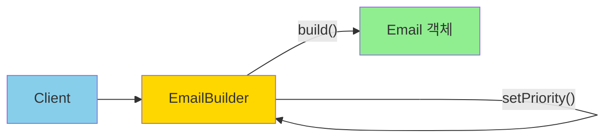

# Builder 패턴: 복잡한 객체의 단계별 조립

## 시작하며

SI 프로젝트에서 객체를 생성하다 보면, 생성자 파라미터가 끝도 없이 늘어나는 상황을 마주하게 됩니다.

```typescript
// ❌ 이게 뭔지 알아보려면 코드를 뜯어봐야 함
const email = new Email(
  'user@example.com',
  '제목',
  '본문',
  ['cc1@example.com', 'cc2@example.com'],
  ['attach1.pdf', 'attach2.pdf'],
  true,
  3,
  'high',
  new Date('2025-12-25 09:00'),
  'ko',
  true,
);
```

각 파라미터가 무엇을 의미하는지 알 수 없고, 순서를 바꾸면 컴파일 에러도 나지 않지만 로직이 완전히 깨집니다. 더 큰 문제는:

- **선택적 파라미터 처리**: 첨부파일이 없다면? `null`? `undefined`? `[]`?
- **순서 의존성**: 8번째 파라미터만 바꾸려면 앞의 7개를 모두 써야 함
- **가독성 제로**: 코드를 읽는 사람이 매번 클래스 정의를 찾아가야 함
- **유지보수 지옥**: 새 파라미터 추가 시 모든 호출부를 수정해야 함

**Builder 패턴**은 이런 복잡한 객체 생성을 단계적으로, 명확하게, 유연하게 만들어주는 패턴입니다.

---

## 문제 상황: 파라미터 폭발과 텔레스코핑 생성자

<Callout type="warning" title="흔한 요구사항 (이메일 발송 시스템)">
이메일 발송 API를 만들어야 합니다. 요구사항:

- **필수**: 받는 사람, 제목, 본문
- **선택**: 참조(CC), 숨은 참조(BCC), 첨부파일, 발송 예약 시간, 우선순위, 재시도 횟수, 템플릿 ID, 언어, 추적 활성화 여부, 사용자 정의 헤더

기획이 바뀔 때마다 옵션이 추가되고, 3개월 뒤에는 20개가 넘습니다.
</Callout>

### 안티패턴 1: 텔레스코핑 생성자

```typescript
class Email {
  // 생성자 오버로딩... 끝이 없다
  constructor(to: string, subject: string, body: string);
  constructor(
    to: string,
    subject: string,
    body: string,
    cc: string[],
  );
  constructor(
    to: string,
    subject: string,
    body: string,
    cc: string[],
    bcc: string[],
  );
  constructor(
    to: string,
    subject: string,
    body: string,
    cc: string[],
    bcc: string[],
    attachments: string[],
  );
  // ... 계속 늘어남
  
  constructor(
    public to: string,
    public subject: string,
    public body: string,
    public cc?: string[],
    public bcc?: string[],
    public attachments?: string[],
    public scheduledAt?: Date,
    public priority?: 'low' | 'medium' | 'high',
    public retryCount?: number,
    public templateId?: string,
    public language?: string,
    public trackingEnabled?: boolean,
  ) {}
}

// ❌ 사용: 순서를 외워야 하고, 중간 파라미터를 건너뛸 수 없음
const email = new Email(
  'user@example.com',
  '제목',
  '본문',
  undefined, // cc 없음
  undefined, // bcc 없음
  undefined, // attachments 없음
  new Date('2025-12-25'), // scheduledAt만 설정하고 싶은데...
);
```

### 안티패턴 2: 옵션 객체 (나쁘지 않지만 완벽하지 않음)

```typescript
interface EmailOptions {
  to: string;
  subject: string;
  body: string;
  cc?: string[];
  bcc?: string[];
  attachments?: string[];
  scheduledAt?: Date;
  priority?: 'low' | 'medium' | 'high';
  retryCount?: number;
  templateId?: string;
  language?: string;
  trackingEnabled?: boolean;
}

class Email {
  constructor(options: EmailOptions) {
    // 초기화 로직
  }
}

// ✅ 가독성은 좋아졌지만...
const email = new Email({
  to: 'user@example.com',
  subject: '제목',
  body: '본문',
  scheduledAt: new Date('2025-12-25'),
  priority: 'high',
});
```

**옵션 객체의 한계**:
- 필수 항목과 선택 항목을 타입으로 강제하기 어려움
- 유효성 검증 시점이 불명확 (생성자? 메서드 호출 시?)
- 단계적 조립 불가능 (한 번에 모든 걸 넘겨야 함)
- 복잡한 빌드 로직 (조건부 속성 설정) 표현 어려움

---

## Builder 패턴 한눈에 보기

<Callout type="info" title="정의">
**복잡한 객체의 생성 과정을 단계별로 분리**하여, 동일한 생성 프로세스로 서로 다른 표현의 객체를 만들 수 있게 하는 패턴입니다. 메서드 체이닝을 통해 가독성을 높이고, 필수/선택 항목을 명확히 구분합니다.
</Callout>



### 핵심 개념

- **메서드 체이닝**: 각 설정 메서드가 `this`를 반환하여 연속 호출 가능
- **명확성**: `builder.setTo('email').setSubject('제목')` - 각 값이 무엇인지 명확
- **유연성**: 필요한 항목만 설정. 순서 자유
- **불변성**: 최종 `build()` 호출 전까지는 객체가 생성되지 않음
- **타입 안전성**: TypeScript로 필수 항목 누락 시 컴파일 에러

### 패턴 구조

```typescript
// Builder 인터페이스
interface Builder {
  setRequiredField(value: string): this;
  setOptionalField(value: string): this;
  build(): Product;
}

// 구체 Builder
class ConcreteBuilder implements Builder {
  private product: Product;
  
  setRequiredField(value: string): this {
    this.product.field = value;
    return this;
  }
  
  build(): Product {
    // 유효성 검증
    return this.product;
  }
}
```

---

## 실전 시나리오 1: 이메일 발송 Builder

### 1단계: 기본 Builder 구현

```typescript
// email/email.entity.ts
export class Email {
  constructor(
    public readonly to: string,
    public readonly subject: string,
    public readonly body: string,
    public readonly cc: string[] = [],
    public readonly bcc: string[] = [],
    public readonly attachments: string[] = [],
    public readonly scheduledAt?: Date,
    public readonly priority: 'low' | 'medium' | 'high' = 'medium',
    public readonly retryCount: number = 3,
    public readonly templateId?: string,
    public readonly language: string = 'ko',
    public readonly trackingEnabled: boolean = true,
    public readonly customHeaders: Record<string, string> = {},
  ) {}
}
```

```typescript
// email/email.builder.ts
export class EmailBuilder {
  private to?: string;
  private subject?: string;
  private body?: string;
  private cc: string[] = [];
  private bcc: string[] = [];
  private attachments: string[] = [];
  private scheduledAt?: Date;
  private priority: 'low' | 'medium' | 'high' = 'medium';
  private retryCount: number = 3;
  private templateId?: string;
  private language: string = 'ko';
  private trackingEnabled: boolean = true;
  private customHeaders: Record<string, string> = {};

  setTo(to: string): this {
    this.to = to;
    return this;
  }

  setSubject(subject: string): this {
    this.subject = subject;
    return this;
  }

  setBody(body: string): this {
    this.body = body;
    return this;
  }

  addCc(cc: string): this {
    this.cc.push(cc);
    return this;
  }

  setCc(cc: string[]): this {
    this.cc = cc;
    return this;
  }

  addBcc(bcc: string): this {
    this.bcc.push(bcc);
    return this;
  }

  addAttachment(attachment: string): this {
    this.attachments.push(attachment);
    return this;
  }

  setAttachments(attachments: string[]): this {
    this.attachments = attachments;
    return this;
  }

  scheduleAt(date: Date): this {
    this.scheduledAt = date;
    return this;
  }

  setPriority(priority: 'low' | 'medium' | 'high'): this {
    this.priority = priority;
    return this;
  }

  setRetryCount(count: number): this {
    this.retryCount = count;
    return this;
  }

  useTemplate(templateId: string): this {
    this.templateId = templateId;
    return this;
  }

  setLanguage(language: string): this {
    this.language = language;
    return this;
  }

  enableTracking(enabled: boolean = true): this {
    this.trackingEnabled = enabled;
    return this;
  }

  addCustomHeader(key: string, value: string): this {
    this.customHeaders[key] = value;
    return this;
  }

  build(): Email {
    // 필수 항목 검증
    if (!this.to) {
      throw new Error('Email recipient (to) is required');
    }
    if (!this.subject) {
      throw new Error('Email subject is required');
    }
    if (!this.body && !this.templateId) {
      throw new Error('Email body or templateId is required');
    }

    // 비즈니스 로직 검증
    if (this.scheduledAt && this.scheduledAt < new Date()) {
      throw new Error('Scheduled time must be in the future');
    }

    return new Email(
      this.to,
      this.subject,
      this.body,
      this.cc,
      this.bcc,
      this.attachments,
      this.scheduledAt,
      this.priority,
      this.retryCount,
      this.templateId,
      this.language,
      this.trackingEnabled,
      this.customHeaders,
    );
  }
}
```

### 2단계: 사용

```typescript
// services/notification.service.ts
export class NotificationService {
  async sendWelcomeEmail(user: User) {
    const email = new EmailBuilder()
      .setTo(user.email)
      .setSubject('회원가입을 환영합니다!')
      .setBody(`안녕하세요 ${user.name}님, 가입을 환영합니다.`)
      .setPriority('high')
      .enableTracking()
      .build();

    await this.emailService.send(email);
  }

  async sendApprovalNotification(approval: Approval) {
    const email = new EmailBuilder()
      .setTo(approval.approver.email)
      .setSubject(`[결재 요청] ${approval.title}`)
      .useTemplate('approval-notification')
      .addCc(approval.requester.email)
      .addCc(approval.requester.manager.email)
      .setPriority('high')
      .setRetryCount(5)
      .addAttachment(approval.documentUrl)
      .addCustomHeader('X-Approval-Id', approval.id)
      .build();

    await this.emailService.send(email);
  }

  async scheduleMonthlyReport(users: User[]) {
    const nextMonth = new Date();
    nextMonth.setMonth(nextMonth.getMonth() + 1);
    nextMonth.setDate(1);
    nextMonth.setHours(9, 0, 0, 0);

    for (const user of users) {
      const email = new EmailBuilder()
        .setTo(user.email)
        .setSubject('월간 리포트')
        .useTemplate('monthly-report')
        .scheduleAt(nextMonth)
        .setPriority('low')
        .setLanguage(user.preferredLanguage)
        .build();

      await this.emailService.schedule(email);
    }
  }
}
```

---

## Before / After

```typescript
// ❌ Builder 없이: 순서와 의미를 파악하기 어려움
const email1 = new Email(
  'user@example.com',
  '제목',
  '본문',
  ['cc@example.com'],
  [],
  ['file.pdf'],
  undefined,
  'high',
  5,
  undefined,
  'ko',
  true,
  { 'X-Custom': 'value' },
);

// 선택적 파라미터 처리 혼란
const email2 = new Email(
  'user@example.com',
  '제목',
  '본문',
  undefined,
  undefined,
  undefined,
  new Date('2025-12-25'),
  'low',
);
```

```typescript
// ✅ Builder 적용: 명확하고 읽기 쉬움
const email1 = new EmailBuilder()
  .setTo('user@example.com')
  .setSubject('제목')
  .setBody('본문')
  .addCc('cc@example.com')
  .addAttachment('file.pdf')
  .setPriority('high')
  .setRetryCount(5)
  .addCustomHeader('X-Custom', 'value')
  .build();

// 필요한 것만 설정
const email2 = new EmailBuilder()
  .setTo('user@example.com')
  .setSubject('제목')
  .setBody('본문')
  .scheduleAt(new Date('2025-12-25'))
  .setPriority('low')
  .build();
```

**비교**:
- **가독성**: 각 값이 무엇인지 명확히 보임
- **순서**: 자유롭게 배치 가능
- **유지보수**: 새 옵션 추가해도 기존 코드 영향 없음
- **타입 안전성**: 필수 항목 누락 시 `build()`에서 에러

---

## 실전 시나리오 2: SQL 쿼리 빌더

SI 프로젝트에서 동적 쿼리를 만들어야 하는 경우가 많습니다. Builder 패턴이 완벽하게 들어맞는 사례입니다.

```typescript
// query/query-builder.ts
export class QueryBuilder {
  private selectFields: string[] = ['*'];
  private fromTable?: string;
  private joins: Array<{ type: string; table: string; on: string }> = [];
  private whereClauses: string[] = [];
  private orderByFields: Array<{ field: string; direction: 'ASC' | 'DESC' }> = [];
  private limitValue?: number;
  private offsetValue?: number;
  private groupByFields: string[] = [];
  private havingClauses: string[] = [];

  select(...fields: string[]): this {
    this.selectFields = fields;
    return this;
  }

  from(table: string): this {
    this.fromTable = table;
    return this;
  }

  join(table: string, on: string): this {
    this.joins.push({ type: 'INNER JOIN', table, on });
    return this;
  }

  leftJoin(table: string, on: string): this {
    this.joins.push({ type: 'LEFT JOIN', table, on });
    return this;
  }

  where(condition: string): this {
    this.whereClauses.push(condition);
    return this;
  }

  whereEquals(field: string, value: string | number): this {
    const valueStr = typeof value === 'string' ? `'${value}'` : value;
    this.whereClauses.push(`${field} = ${valueStr}`);
    return this;
  }

  whereIn(field: string, values: Array<string | number>): this {
    const valuesStr = values
      .map((v) => (typeof v === 'string' ? `'${v}'` : v))
      .join(', ');
    this.whereClauses.push(`${field} IN (${valuesStr})`);
    return this;
  }

  orderBy(field: string, direction: 'ASC' | 'DESC' = 'ASC'): this {
    this.orderByFields.push({ field, direction });
    return this;
  }

  limit(value: number): this {
    this.limitValue = value;
    return this;
  }

  offset(value: number): this {
    this.offsetValue = value;
    return this;
  }

  groupBy(...fields: string[]): this {
    this.groupByFields = fields;
    return this;
  }

  having(condition: string): this {
    this.havingClauses.push(condition);
    return this;
  }

  build(): string {
    if (!this.fromTable) {
      throw new Error('FROM clause is required');
    }

    let query = `SELECT ${this.selectFields.join(', ')}`;
    query += ` FROM ${this.fromTable}`;

    // JOIN
    for (const join of this.joins) {
      query += ` ${join.type} ${join.table} ON ${join.on}`;
    }

    // WHERE
    if (this.whereClauses.length > 0) {
      query += ` WHERE ${this.whereClauses.join(' AND ')}`;
    }

    // GROUP BY
    if (this.groupByFields.length > 0) {
      query += ` GROUP BY ${this.groupByFields.join(', ')}`;
    }

    // HAVING
    if (this.havingClauses.length > 0) {
      query += ` HAVING ${this.havingClauses.join(' AND ')}`;
    }

    // ORDER BY
    if (this.orderByFields.length > 0) {
      const orderClauses = this.orderByFields
        .map((o) => `${o.field} ${o.direction}`)
        .join(', ');
      query += ` ORDER BY ${orderClauses}`;
    }

    // LIMIT, OFFSET
    if (this.limitValue !== undefined) {
      query += ` LIMIT ${this.limitValue}`;
    }
    if (this.offsetValue !== undefined) {
      query += ` OFFSET ${this.offsetValue}`;
    }

    return query;
  }

  // 편의 메서드: 페이지네이션
  paginate(page: number, pageSize: number = 10): this {
    return this.limit(pageSize).offset((page - 1) * pageSize);
  }
}
```

### 사용 예시

```typescript
// repositories/user.repository.ts
export class UserRepository {
  async findActiveUsers(filters: UserFilters, pagination: Pagination) {
    const queryBuilder = new QueryBuilder()
      .select('users.id', 'users.name', 'users.email', 'roles.name as role')
      .from('users')
      .leftJoin('roles', 'users.role_id = roles.id')
      .where('users.deleted_at IS NULL')
      .where('users.status = \'active\'');

    // 동적 필터 추가
    if (filters.role) {
      queryBuilder.whereEquals('roles.name', filters.role);
    }
    if (filters.department) {
      queryBuilder.whereEquals('users.department', filters.department);
    }
    if (filters.createdAfter) {
      queryBuilder.where(`users.created_at >= '${filters.createdAfter}'`);
    }
    if (filters.ageRange) {
      queryBuilder
        .where(`users.age >= ${filters.ageRange.min}`)
        .where(`users.age <= ${filters.ageRange.max}`);
    }

    // 정렬 및 페이지네이션
    const query = queryBuilder
      .orderBy('users.created_at', 'DESC')
      .paginate(pagination.page, pagination.pageSize)
      .build();

    return this.db.query(query);
  }

  async getTopSpenders(limit: number = 10) {
    const query = new QueryBuilder()
      .select(
        'users.id',
        'users.name',
        'SUM(orders.amount) as total_spent',
        'COUNT(orders.id) as order_count',
      )
      .from('users')
      .join('orders', 'users.id = orders.user_id')
      .where('orders.status = \'completed\'')
      .groupBy('users.id', 'users.name')
      .having('SUM(orders.amount) > 1000000')
      .orderBy('total_spent', 'DESC')
      .limit(limit)
      .build();

    return this.db.query(query);
  }
}
```

**결과 쿼리**:

```sql
-- findActiveUsers 예시
SELECT users.id, users.name, users.email, roles.name as role
FROM users
LEFT JOIN roles ON users.role_id = roles.id
WHERE users.deleted_at IS NULL 
  AND users.status = 'active'
  AND roles.name = 'admin'
  AND users.department = 'Engineering'
ORDER BY users.created_at DESC
LIMIT 20 OFFSET 40

-- getTopSpenders 예시
SELECT users.id, users.name, SUM(orders.amount) as total_spent, COUNT(orders.id) as order_count
FROM users
INNER JOIN orders ON users.id = orders.user_id
WHERE orders.status = 'completed'
GROUP BY users.id, users.name
HAVING SUM(orders.amount) > 1000000
ORDER BY total_spent DESC
LIMIT 10
```

---

## 타입 안전한 Builder: Fluent Interface

TypeScript의 타입 시스템을 활용하면, 필수 항목을 설정하지 않으면 `build()`를 호출할 수 없게 만들 수 있습니다.

```typescript
// email/typed-email.builder.ts
type RequiredFields = 'to' | 'subject' | 'body';
type OptionalFields = 'cc' | 'bcc' | 'attachments' | 'priority';

// Builder 상태를 타입으로 추적
type BuilderState = {
  to: boolean;
  subject: boolean;
  body: boolean;
};

class TypedEmailBuilder<State extends Partial<BuilderState> = {}> {
  private data: Partial<Email> = {};

  setTo(to: string): TypedEmailBuilder<State & { to: true }> {
    this.data.to = to;
    return this as any;
  }

  setSubject(subject: string): TypedEmailBuilder<State & { subject: true }> {
    this.data.subject = subject;
    return this as any;
  }

  setBody(body: string): TypedEmailBuilder<State & { body: true }> {
    this.data.body = body;
    return this as any;
  }

  addCc(cc: string): this {
    if (!this.data.cc) this.data.cc = [];
    this.data.cc.push(cc);
    return this;
  }

  setPriority(priority: 'low' | 'medium' | 'high'): this {
    this.data.priority = priority;
    return this;
  }

  // build()는 필수 필드가 모두 설정된 경우에만 호출 가능
  build(
    this: TypedEmailBuilder<{ to: true; subject: true; body: true }>,
  ): Email {
    return new Email(
      this.data.to!,
      this.data.subject!,
      this.data.body!,
      this.data.cc,
      this.data.bcc,
      this.data.attachments,
      this.data.scheduledAt,
      this.data.priority,
      this.data.retryCount,
      this.data.templateId,
      this.data.language,
      this.data.trackingEnabled,
      this.data.customHeaders,
    );
  }
}

// 사용
const email = new TypedEmailBuilder()
  .setTo('user@example.com')
  .setSubject('제목')
  // .setBody('본문') // ❌ 주석 처리하면 build() 호출 불가
  .build(); // ✅ 타입 에러: body가 설정되지 않음

// ✅ 모든 필수 필드 설정 후에는 build() 가능
const validEmail = new TypedEmailBuilder()
  .setTo('user@example.com')
  .setSubject('제목')
  .setBody('본문')
  .build();
```

이 방식의 장점:
- **컴파일 타임 검증**: 필수 항목 누락 시 TypeScript 에러
- **자동 완성**: IDE가 필수 메서드를 제안
- **런타임 에러 방지**: `build()` 호출 전에 타입으로 검증

단점:
- 타입이 복잡해짐
- 모든 필드 조합에 대한 타입 정의 필요
- 가독성이 떨어질 수 있음

실무에서는 **간단한 Builder는 런타임 검증**, **복잡한 Builder는 타입 검증**을 혼용합니다.

---

## 실전 시나리오 3: HTTP 요청 Builder

API 클라이언트를 만들 때도 Builder 패턴이 유용합니다.

```typescript
// http/http-request.builder.ts
export class HttpRequestBuilder {
  private url?: string;
  private method: 'GET' | 'POST' | 'PUT' | 'DELETE' | 'PATCH' = 'GET';
  private headers: Record<string, string> = {};
  private queryParams: Record<string, string> = {};
  private body?: unknown;
  private timeout: number = 30000;
  private retries: number = 0;
  private retryDelay: number = 1000;
  private validateStatus?: (status: number) => boolean;

  setUrl(url: string): this {
    this.url = url;
    return this;
  }

  setMethod(method: 'GET' | 'POST' | 'PUT' | 'DELETE' | 'PATCH'): this {
    this.method = method;
    return this;
  }

  addHeader(key: string, value: string): this {
    this.headers[key] = value;
    return this;
  }

  setHeaders(headers: Record<string, string>): this {
    this.headers = { ...this.headers, ...headers };
    return this;
  }

  addQueryParam(key: string, value: string): this {
    this.queryParams[key] = value;
    return this;
  }

  setQueryParams(params: Record<string, string>): this {
    this.queryParams = params;
    return this;
  }

  setBody(body: unknown): this {
    this.body = body;
    return this;
  }

  setTimeout(timeout: number): this {
    this.timeout = timeout;
    return this;
  }

  setRetries(retries: number, delay: number = 1000): this {
    this.retries = retries;
    this.retryDelay = delay;
    return this;
  }

  setValidateStatus(fn: (status: number) => boolean): this {
    this.validateStatus = fn;
    return this;
  }

  // 편의 메서드들
  asJson(): this {
    return this.addHeader('Content-Type', 'application/json');
  }

  withAuth(token: string): this {
    return this.addHeader('Authorization', `Bearer ${token}`);
  }

  acceptJson(): this {
    return this.addHeader('Accept', 'application/json');
  }

  build(): HttpRequest {
    if (!this.url) {
      throw new Error('URL is required');
    }

    // 쿼리 파라미터를 URL에 추가
    const queryString = Object.entries(this.queryParams)
      .map(([key, value]) => `${key}=${encodeURIComponent(value)}`)
      .join('&');

    const fullUrl = queryString ? `${this.url}?${queryString}` : this.url;

    return {
      url: fullUrl,
      method: this.method,
      headers: this.headers,
      body: this.body,
      timeout: this.timeout,
      retries: this.retries,
      retryDelay: this.retryDelay,
      validateStatus: this.validateStatus,
    };
  }

  // 바로 실행
  async execute(): Promise<Response> {
    const request = this.build();
    return httpClient.send(request);
  }
}

export interface HttpRequest {
  url: string;
  method: string;
  headers: Record<string, string>;
  body?: unknown;
  timeout: number;
  retries: number;
  retryDelay: number;
  validateStatus?: (status: number) => boolean;
}
```

### 사용 예시

```typescript
// services/api.service.ts
export class ApiService {
  async fetchUsers(filters: UserFilters) {
    const request = new HttpRequestBuilder()
      .setUrl('https://api.example.com/users')
      .setMethod('GET')
      .withAuth(this.token)
      .acceptJson()
      .addQueryParam('page', String(filters.page))
      .addQueryParam('limit', String(filters.limit))
      .addQueryParam('status', filters.status)
      .setTimeout(10000)
      .setRetries(3, 2000)
      .build();

    return httpClient.send(request);
  }

  async createUser(userData: CreateUserDto) {
    return new HttpRequestBuilder()
      .setUrl('https://api.example.com/users')
      .setMethod('POST')
      .withAuth(this.token)
      .asJson()
      .acceptJson()
      .setBody(userData)
      .setTimeout(15000)
      .setValidateStatus((status) => status >= 200 && status < 300)
      .execute(); // build() + send()를 한 번에
  }

  async uploadFile(file: File) {
    const formData = new FormData();
    formData.append('file', file);

    return new HttpRequestBuilder()
      .setUrl('https://api.example.com/files')
      .setMethod('POST')
      .withAuth(this.token)
      .addHeader('Content-Type', 'multipart/form-data')
      .setBody(formData)
      .setTimeout(60000) // 파일 업로드는 타임아웃 길게
      .setRetries(0) // 파일 업로드는 재시도 안 함
      .execute();
  }
}
```

---

## NestJS에서의 Builder: DI와 함께

NestJS에서는 Builder를 Provider로 등록하여 의존성 주입을 활용할 수 있습니다.

```typescript
// email/email-builder.provider.ts
@Injectable()
export class EmailBuilderProvider {
  constructor(
    private readonly config: ConfigService,
    private readonly logger: Logger,
  ) {}

  // Factory 메서드: 새로운 Builder 인스턴스 생성
  create(): EmailBuilder {
    const builder = new EmailBuilder();

    // 기본값을 환경 변수나 설정에서 가져옴
    builder
      .setLanguage(this.config.get('DEFAULT_EMAIL_LANGUAGE', 'ko'))
      .setRetryCount(this.config.get('EMAIL_RETRY_COUNT', 3))
      .enableTracking(this.config.get('EMAIL_TRACKING_ENABLED', true));

    return builder;
  }

  // 사전 구성된 Builder들
  createForNotification(): EmailBuilder {
    return this.create()
      .setPriority('high')
      .setRetryCount(5)
      .addCustomHeader('X-Email-Type', 'notification');
  }

  createForMarketing(): EmailBuilder {
    return this.create()
      .setPriority('low')
      .setRetryCount(1)
      .enableTracking(true)
      .addCustomHeader('X-Email-Type', 'marketing')
      .addCustomHeader('List-Unsubscribe', this.config.get('UNSUBSCRIBE_URL'));
  }

  createForTransactional(): EmailBuilder {
    return this.create()
      .setPriority('high')
      .setRetryCount(5)
      .enableTracking(false)
      .addCustomHeader('X-Email-Type', 'transactional');
  }
}
```

```typescript
// services/notification.service.ts
@Injectable()
export class NotificationService {
  constructor(
    private readonly emailBuilderProvider: EmailBuilderProvider,
    private readonly emailService: EmailService,
  ) {}

  async sendApprovalRequest(approval: Approval) {
    const email = this.emailBuilderProvider
      .createForNotification()
      .setTo(approval.approver.email)
      .setSubject(`[결재 요청] ${approval.title}`)
      .setBody(this.renderApprovalTemplate(approval))
      .addCc(approval.requester.email)
      .addAttachment(approval.documentUrl)
      .build();

    await this.emailService.send(email);
  }

  async sendMarketingCampaign(campaign: Campaign, users: User[]) {
    const emails = users.map((user) =>
      this.emailBuilderProvider
        .createForMarketing()
        .setTo(user.email)
        .setSubject(campaign.subject)
        .useTemplate(campaign.templateId)
        .setLanguage(user.preferredLanguage)
        .addCustomHeader('X-Campaign-Id', campaign.id)
        .build(),
    );

    await this.emailService.sendBulk(emails);
  }
}
```

---

## Next.js에서의 Builder: 함수형 접근

Next.js에서는 클래스보다 함수형 Builder를 사용하는 것이 더 자연스럽습니다.

```typescript
// lib/email/email-builder.ts
export function createEmailBuilder() {
  let data: Partial<Email> = {
    cc: [],
    bcc: [],
    attachments: [],
    priority: 'medium',
    retryCount: 3,
    language: 'ko',
    trackingEnabled: true,
    customHeaders: {},
  };

  const builder = {
    setTo(to: string) {
      data.to = to;
      return builder;
    },

    setSubject(subject: string) {
      data.subject = subject;
      return builder;
    },

    setBody(body: string) {
      data.body = body;
      return builder;
    },

    addCc(cc: string) {
      data.cc!.push(cc);
      return builder;
    },

    addAttachment(attachment: string) {
      data.attachments!.push(attachment);
      return builder;
    },

    setPriority(priority: 'low' | 'medium' | 'high') {
      data.priority = priority;
      return builder;
    },

    scheduleAt(date: Date) {
      data.scheduledAt = date;
      return builder;
    },

    build(): Email {
      if (!data.to || !data.subject || !data.body) {
        throw new Error('Required fields missing');
      }

      return {
        to: data.to,
        subject: data.subject,
        body: data.body,
        cc: data.cc!,
        bcc: data.bcc!,
        attachments: data.attachments!,
        scheduledAt: data.scheduledAt,
        priority: data.priority!,
        retryCount: data.retryCount!,
        language: data.language!,
        trackingEnabled: data.trackingEnabled!,
        customHeaders: data.customHeaders!,
      };
    },
  };

  return builder;
}
```

```typescript
// app/actions/send-email.ts
'use server';

import { createEmailBuilder } from '@/lib/email/email-builder';
import { emailService } from '@/lib/email/email-service';

export async function sendContactEmail(formData: FormData) {
  const name = formData.get('name') as string;
  const email = formData.get('email') as string;
  const message = formData.get('message') as string;

  const emailToSend = createEmailBuilder()
    .setTo(process.env.CONTACT_EMAIL!)
    .setSubject(`[문의] ${name}님의 문의`)
    .setBody(`
      이름: ${name}
      이메일: ${email}
      
      문의 내용:
      ${message}
    `)
    .setPriority('medium')
    .addCustomHeader('X-Form-Type', 'contact')
    .build();

  await emailService.send(emailToSend);

  return { success: true };
}
```

---

## Director 패턴: 복잡한 빌드 프로세스 캡슐화

Builder가 복잡해지면 **Director**를 추가하여 빌드 프로세스를 캡슐화합니다.

```typescript
// email/email.director.ts
export class EmailDirector {
  constructor(private readonly builder: EmailBuilder) {}

  buildWelcomeEmail(user: User): Email {
    return this.builder
      .setTo(user.email)
      .setSubject('회원가입을 환영합니다!')
      .useTemplate('welcome-email')
      .setLanguage(user.preferredLanguage)
      .addCustomHeader('X-User-Id', user.id)
      .setPriority('high')
      .build();
  }

  buildPasswordResetEmail(user: User, resetToken: string): Email {
    const resetUrl = `https://example.com/reset-password?token=${resetToken}`;

    return this.builder
      .setTo(user.email)
      .setSubject('비밀번호 재설정 요청')
      .setBody(`
        안녕하세요 ${user.name}님,
        
        비밀번호 재설정을 요청하셨습니다.
        아래 링크를 클릭하여 비밀번호를 재설정하세요:
        
        ${resetUrl}
        
        이 링크는 1시간 동안 유효합니다.
      `)
      .setPriority('high')
      .setRetryCount(5)
      .enableTracking(false) // 보안상 추적 비활성화
      .addCustomHeader('X-Reset-Token', resetToken)
      .build();
  }

  buildOrderConfirmationEmail(order: Order): Email {
    const builder = this.builder
      .setTo(order.user.email)
      .setSubject(`주문 확인 (주문번호: ${order.id})`)
      .useTemplate('order-confirmation')
      .setPriority('high')
      .addCustomHeader('X-Order-Id', order.id);

    // 조건부 로직
    if (order.amount > 1000000) {
      builder.addCc('vip@example.com'); // 고액 주문은 VIP 팀에 참조
    }

    // 첨부파일 추가
    for (const invoice of order.invoices) {
      builder.addAttachment(invoice.url);
    }

    return builder.build();
  }

  buildMonthlyReport(user: User, reportData: ReportData): Email {
    const nextMonth = new Date();
    nextMonth.setMonth(nextMonth.getMonth() + 1);
    nextMonth.setDate(1);
    nextMonth.setHours(9, 0, 0, 0);

    return this.builder
      .setTo(user.email)
      .setSubject(`월간 리포트 - ${reportData.month}`)
      .useTemplate('monthly-report')
      .scheduleAt(nextMonth)
      .setPriority('low')
      .setLanguage(user.preferredLanguage)
      .addCustomHeader('X-Report-Period', reportData.month)
      .build();
  }
}
```

사용:

```typescript
@Injectable()
export class NotificationService {
  constructor(
    private readonly emailBuilderProvider: EmailBuilderProvider,
    private readonly emailService: EmailService,
  ) {}

  async sendWelcomeEmail(user: User) {
    const builder = this.emailBuilderProvider.create();
    const director = new EmailDirector(builder);

    const email = director.buildWelcomeEmail(user);
    await this.emailService.send(email);
  }

  async sendPasswordResetEmail(user: User, resetToken: string) {
    const builder = this.emailBuilderProvider.create();
    const director = new EmailDirector(builder);

    const email = director.buildPasswordResetEmail(user, resetToken);
    await this.emailService.send(email);
  }
}
```

**Director의 장점**:
- 복잡한 빌드 로직을 한 곳에 모음
- 동일한 Builder로 여러 타입의 객체 생성 가능
- 비즈니스 로직과 빌드 로직 분리

---

## 적용 체크리스트

<Steps>
  <Step title="복잡도 평가">
    생성자 파라미터가 5개 이상이거나, 선택적 파라미터가 3개 이상이면 Builder 패턴을 고려하세요. 단순한 객체는 그냥 생성자나 옵션 객체를 사용하는 것이 낫습니다.
  </Step>
  
  <Step title="필수/선택 항목 구분">
    어떤 필드가 필수이고 어떤 필드가 선택적인지 명확히 정의하세요. 필수 항목은 `build()` 메서드에서 검증합니다.
  </Step>
  
  <Step title="메서드 네이밍">
    일관된 네이밍 규칙을 사용하세요. `setXxx()` (단일 값), `addXxx()` (배열에 추가), `enableXxx()` (불린), `useXxx()` (선택지 중 하나)
  </Step>
  
  <Step title="유효성 검증">
    `build()` 메서드에서 비즈니스 로직 검증을 수행하세요. 잘못된 상태의 객체가 생성되지 않도록 보장합니다.
  </Step>
  
  <Step title="불변성 보장">
    `build()` 호출 후에는 Builder를 재사용하지 못하게 하거나, 매번 새로운 Builder 인스턴스를 사용하세요.
  </Step>
</Steps>

---

## 언제 쓰면 안 될까?

<Callout type="warning" title="주의">
다음 상황에서는 Builder를 쓰지 않는 것이 더 좋습니다:
</Callout>

- **파라미터가 2~3개뿐일 때**: 그냥 생성자가 더 간단합니다.
- **모든 필드가 필수일 때**: Builder의 유연성이 필요 없습니다.
- **객체가 단순할 때**: 간단한 DTO나 Value Object는 그냥 생성자로 충분합니다.
- **한 번만 생성하고 끝일 때**: Builder는 재사용성과 가독성이 목표인데, 한 곳에서만 쓰면 오버엔지니어링입니다.

```typescript
// ❌ 이런 경우는 그냥 생성자가 낫습니다
class Point {
  constructor(
    public x: number,
    public y: number,
  ) {}
}

// Builder를 만들 필요 없음
const point = new Point(10, 20);

// ❌ 모든 필드가 필수인 경우
class UserId {
  constructor(public value: string) {
    if (!value) throw new Error('UserId is required');
  }
}

// 이것도 Builder 필요 없음
const userId = new UserId('user-123');
```

---

## 실무 팁

### 1. 기본값 설정

```typescript
export class EmailBuilder {
  // 생성자에서 기본값 설정
  constructor() {
    this.priority = 'medium';
    this.retryCount = 3;
    this.language = 'ko';
    this.trackingEnabled = true;
  }

  // 또는 필드 선언 시 기본값
  private priority: 'low' | 'medium' | 'high' = 'medium';
  private retryCount: number = 3;
}
```

### 2. 체이닝 가능한 setter

```typescript
// ✅ this를 반환하여 체이닝 가능
setTo(to: string): this {
  this.to = to;
  return this;
}

// ❌ void 반환하면 체이닝 불가
setTo(to: string): void {
  this.to = to;
}
```

### 3. 편의 메서드 추가

```typescript
export class HttpRequestBuilder {
  // 자주 쓰는 패턴을 편의 메서드로
  asJson(): this {
    return this.addHeader('Content-Type', 'application/json')
               .addHeader('Accept', 'application/json');
  }

  withAuth(token: string): this {
    return this.addHeader('Authorization', `Bearer ${token}`);
  }

  paginate(page: number, pageSize: number = 10): this {
    return this.addQueryParam('page', String(page))
               .addQueryParam('limit', String(pageSize));
  }
}
```

### 4. 재사용 가능한 Builder

```typescript
// ✅ 새 Builder 인스턴스를 반환하는 Factory
export function createEmailBuilder(): EmailBuilder {
  return new EmailBuilder();
}

// ❌ Builder를 재사용하면 상태가 섞임
const builder = new EmailBuilder();
const email1 = builder.setTo('user1@example.com').build();
const email2 = builder.setTo('user2@example.com').build(); // email1의 다른 설정이 섞일 수 있음
```

### 5. 부분 빌드 허용

```typescript
export class QueryBuilder {
  // 부분 쿼리를 반환하는 메서드
  buildSelect(): string {
    return `SELECT ${this.selectFields.join(', ')} FROM ${this.fromTable}`;
  }

  buildWhere(): string {
    return this.whereClauses.length > 0
      ? `WHERE ${this.whereClauses.join(' AND ')}`
      : '';
  }

  build(): string {
    return [
      this.buildSelect(),
      this.buildWhere(),
      this.buildOrderBy(),
      this.buildLimit(),
    ]
      .filter(Boolean)
      .join(' ');
  }
}
```

---

## 프레임워크별 고찰

### NestJS: Provider 기반 Builder Factory

<Callout type="success" title="NestJS에서의 장점">
- **의존성 주입**: Builder Factory가 ConfigService 등을 주입받을 수 있음
- **사전 구성**: 환경별 기본값을 Builder에 미리 설정
- **재사용성**: 여러 Service에서 동일한 Builder Factory 사용
- **테스트**: Mock Provider로 쉽게 교체
</Callout>

```typescript
// Builder Provider
@Injectable()
export class EmailBuilderProvider {
  constructor(private readonly config: ConfigService) {}

  create(): EmailBuilder {
    return new EmailBuilder()
      .setRetryCount(this.config.get('EMAIL_RETRY_COUNT'))
      .setLanguage(this.config.get('DEFAULT_LANGUAGE'));
  }
}

// 사용
@Injectable()
export class NotificationService {
  constructor(
    private readonly emailBuilderProvider: EmailBuilderProvider,
  ) {}

  async notify(user: User) {
    const email = this.emailBuilderProvider
      .create()
      .setTo(user.email)
      .build();
  }
}
```

### Next.js: 함수형 Builder의 단순함

<Callout type="info" title="Next.js에서의 특징">
- **함수형**: 클래스 없이 클로저로 상태 관리
- **트리 쉐이킹**: 사용하지 않는 Builder 메서드는 번들에서 제외
- **서버 액션 친화적**: 'use server'와 잘 동작
- **경량화**: DI 컨테이너 없이 단순한 함수 호출
</Callout>

```typescript
// 함수형 Builder
export function createEmailBuilder() {
  let data: Partial<Email> = {};

  return {
    setTo: (to: string) => {
      data.to = to;
      return this;
    },
    build: () => {
      if (!data.to) throw new Error('to is required');
      return data as Email;
    },
  };
}

// Server Action에서 사용
'use server';
export async function sendEmail(formData: FormData) {
  const email = createEmailBuilder()
    .setTo(formData.get('to') as string)
    .build();
  
  await emailService.send(email);
}
```

---

## 마치며

Builder 패턴은 **복잡한 객체를 명확하고 단계적으로 생성**하고 싶을 때 사용하는 강력한 생성 패턴입니다.

SI 프로젝트에서:
- 생성자 파라미터가 5개 이상이고 **선택적 항목이 많다면**
- SQL 쿼리, HTTP 요청처럼 **동적으로 조건이 추가**되는 경우
- 이메일, 리포트, 대시보드 설정처럼 **옵션이 끝없이 늘어나는** 경우

Builder 패턴을 도입해 보세요. 코드 가독성이 크게 향상되고, 새로운 옵션 추가가 쉬워집니다. 

하지만 파라미터가 2~3개뿐이거나 모든 필드가 필수라면, 굳이 Builder를 만들지 말고 단순한 생성자나 옵션 객체를 사용하는 것도 좋은 판단입니다. 패턴은 문제를 해결하기 위한 도구일 뿐입니다.

