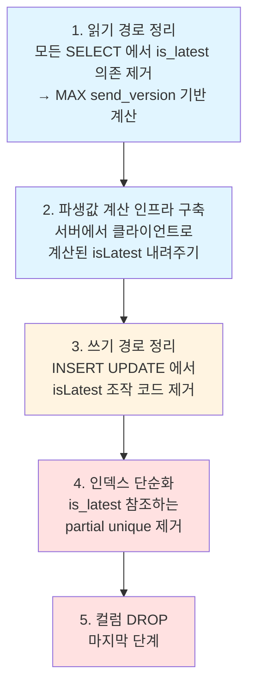

import { Callout } from '@/components/writing-ui';

> DB에 "최신"을 나타내는 boolean 컬럼 하나 지우는 데 10 커밋이 필요했다.
> 그 과정에서 실무가 던진 질문들을 교과서 원칙과 엮어 정리.

---

<Callout type="info" title="결론 먼저 (TL;DR)">
**파생 상태(derived state)는 저장하지 말고 계산하라.** 이미 다른 컬럼에서 계산 가능한 값을 별도 컬럼으로 저장하면 일관성 관리 지점이 둘로 늘고, 둘은 언젠가 어긋난다. 이 글은 프로덕션에서 57건의 불일치를 만들어낸 `is_latest` 컬럼을 제거하기 위해 **10 커밋으로 쪼갠 리팩터링**과 그 과정에서 드러난 6가지 설계 원칙의 기록이다.

핵심 질문 하나: **"이 값이 이미 있는 데이터로 계산 가능한가?"** → Yes면 저장할 이유가 없다.
</Callout>

---

## 배경

구매 플랫폼의 RFQ(견적요청) detail 테이블에 `is_latest`라는 boolean 컬럼이 있었다.

```ts
export const rfqDetails = pgTable("rfq_details", {
    // ...
    sendVersion: integer("send_version").notNull().default(0),   // 리비전 번호
    isLatest:    boolean("is_latest").notNull().default(true),   // 최신 여부 플래그
    // ...
}, (table) => ({
    // "RFQ 당 벤더의 최신 detail은 1개"를 DB에서 강제
    uniqueLatestVendor: uniqueIndex("unique_latest_vendor")
        .on(table.rfqId, table.vendorId)
        .where(sql`${table.isLatest} = true`),
}));
```

벤더가 RFQ에 응답할 때마다 `sendVersion`이 증가하고, 가장 최신 revision만 `isLatest = true`로 마킹된다. 단순해 보이는 설계다.

그런데 프로덕션 진단에서 **`is_latest = true`인 row의 `send_version`이 같은 (rfq, vendor) 조합의 MAX와 다른 케이스가 57건** 발견됐다. 플래그가 거짓말을 하고 있었다.

<Callout type="error" title="플래그가 거짓말을 한 순간">
운영 DB에서 `is_latest = true`인 레코드 중 57건이 해당 (rfq, vendor)의 최신 send_version이 아니었다. 즉, "이 row가 최신이다"라는 플래그가 **실제로는 구 버전을 가리키고 있었다**. 쿼리가 이 플래그를 믿고 있었으므로, 사용자들은 시시때때로 구 버전 데이터를 "최신"이라며 보고 있었다는 뜻.
</Callout>

이 컬럼을 제거하기로 결정하고 작전에 들어갔을 때, 그 "단순한" 컬럼 제거가 얼마나 복잡한 일인지 체감했다. 이 글은 그 과정에서 **교과서 원칙들이 실무에서 어떻게 드러나는지** 기록한 것이다.

---

## 1. Single Source of Truth (SSoT)

> 한 정보에 대해 **권위 있는 표현은 단 하나**여야 한다. 같은 정보를 두 곳에 저장하면 언젠가 둘이 어긋난다.

이 테이블에는 이미 `send_version`이라는 단조 증가하는 정수가 있었다. 같은 `(rfq, vendor)` 조합에서 **최신 = MAX(send_version)**이라는 정의가 자연스럽다. 굳이 `is_latest`를 둘 필요가 없었다.

그런데 한 번 추가되면, 이 컬럼은 **`send_version`과 "동기화된 상태"를 유지해야 한다**. 동기화 책임은 **앱 레이어**가 진다 — INSERT 시 새 row는 `true`, 기존 최신 row는 `false`로 UPDATE. 이게 매 흐름마다 정확히 작동한다는 **강한 가정**이 필요하다.

경험상 이 가정은 무너진다. 이유:

- **동시 INSERT 경합** — 두 요청이 거의 동시에 새 revision을 만들면 둘 다 `isLatest=true`로 들어간다 (partial unique가 한쪽을 거부하면 앱이 재시도, 그렇지 않으면 둘 다 true)
- **트랜잭션 경계** — UPDATE와 INSERT가 다른 트랜잭션이면 한쪽만 성공할 수 있음
- **수동 SQL / 복구 스크립트** — 사람이 직접 손대는 경로에서 일관성 보장 어려움
- **새로 합류한 개발자** — 플래그의 존재를 뒤늦게 알고 새 INSERT 경로에서 업데이트 누락

프로덕션의 57건은 이런 누수가 시간에 따라 쌓인 결과였다.

<Callout type="warning" title="핵심 교훈">
`send_version`만 제대로 관리하면 되는 일에, `is_latest`를 추가함으로써 **일관성 관리 포인트가 2개**가 됐다. **곱 복잡도(multiplicative complexity)** — SSoT 위반의 전형적 사례.
</Callout>

---

## 2. Derived State Should Be Computed, Not Stored

Martin Kleppmann, *Designing Data-Intensive Applications*:

> Derived data is redundant in the sense that it could be recreated from the existing data.
> ... but it is worth the extra disk space if it improves read performance. (Ch. 11)

핵심은 "cache나 materialized view처럼 **재생성 가능한 파생 상태**는 쓸 수 있지만, **source of truth와의 일관성을 누가 책임지는지**가 명확해야 한다"는 것.

`is_latest`의 경우:

| 항목 | 상태 |
|------|------|
| 재생성 가능한가? | **예** — `send_version = MAX(...)`로 언제든 계산 |
| 일관성 책임자 | 앱 레이어 (DB가 강제 못함) |
| 재생성 비용 | 낮음 — 쿼리 하나 |
| 저장 이득 | 거의 없음 — 인덱스 1개 절약 수준 |

이 조건이면 **저장할 이유가 없다**. 쿼리마다 계산하는 것이 더 안전.

### 대체 패턴 — Before / After

**Before: `is_latest` 플래그에 의존**

```ts
const latest = await db
  .select()
  .from(rfqDetails)
  .where(and(
    eq(rfqDetails.rfqId, rfqId),
    eq(rfqDetails.vendorId, vendorId),
    eq(rfqDetails.isLatest, true),   // 플래그 신뢰
  ));
```

**After: `MAX(send_version)`으로 계산**

```ts
const [latest] = await db
  .select()
  .from(rfqDetails)
  .where(and(
    eq(rfqDetails.rfqId, rfqId),
    eq(rfqDetails.vendorId, vendorId),
  ))
  .orderBy(desc(rfqDetails.sendVersion))
  .limit(1);
```

더 긴가? 약간. 하지만 **거짓말 가능성이 0**이다.

### 여러 벤더 대상으로 조회할 때

단일 (rfq, vendor)가 아닌, **한 RFQ의 모든 벤더의 최신 detail**을 구해야 하는 쿼리라면 `MAX ... GROUP BY` subquery + inner join 패턴을 쓴다.

```ts
const latest = db
  .select({
    vendorId: rfqDetails.vendorId,
    maxV: sql<number>`MAX(${rfqDetails.sendVersion})`.as('max_v'),
  })
  .from(rfqDetails)
  .where(eq(rfqDetails.rfqId, rfqId))
  .groupBy(rfqDetails.vendorId)
  .as('latest');

const rows = await db
  .select(/* ... */)
  .from(rfqDetails)
  .innerJoin(latest, and(
    eq(rfqDetails.vendorId, latest.vendorId),
    eq(rfqDetails.sendVersion, latest.maxV),
  ))
  .where(eq(rfqDetails.rfqId, rfqId));
```

쿼리 플래너가 이 패턴을 잘 처리한다. 인덱스가 `(rfq_id, vendor_id)`에 있다면 성능 이슈는 없다.

---

## 3. Invariant Enforcement — 어느 레이어에서 지킬 것인가

DB constraint는 강력한 도구다. 무결성 위반을 **런타임 예외**로 만들어 앱 레이어의 실수를 잡아준다.

그런데 이번 케이스의 `unique_latest_vendor` partial unique index:

```sql
CREATE UNIQUE INDEX unique_latest_vendor
  ON rfq_details (rfq_id, vendor_id)
  WHERE is_latest = true;
```

이게 진짜 지키고 싶은 invariant는 **"RFQ 당 벤더의 최신 detail은 1개"**다. 하지만 이 제약은 그걸 직접 표현하지 못한다. 대신 **"`is_latest=true`인 row가 조합당 1개"**를 강제한다.

두 조건은 **`is_latest`가 정직할 때만 같은 의미**. 앞서 봤듯 `is_latest`는 어긋날 수 있다 → 제약은 "가상의 invariant"를 지키고 있는 셈.

<Callout type="warning" title="DB constraint 의 올바른 용도">
**DB constraint 는 source data 의 독립적 무결성에만 쓰라.**

파생 상태의 일관성을 constraint로 지키려 하면, constraint가 source를 거꾸로 오염시킨다. 즉 "일관성을 지키는 제약"이 "제약을 지키려다 진실을 왜곡하는 구조"로 변한다.
</Callout>

### 경합 창(race window)의 현실

이번 케이스에서 특히 아팠던 것:

1. 벤더 재추가 흐름 — "이전 revision의 `is_latest = false`로 UPDATE → 새 detail INSERT(`is_latest = true`)"
2. 리팩터링 과정에서 **UPDATE 코드를 제거**했더니
3. INSERT 시 default `true`로 들어가면서 `unique_latest_vendor` 위반 → 500 에러

즉 **코드를 정리하는 과정 자체가 제약과 충돌**. 이 순간 깨달았다:

> "플래그를 안 읽을 거면 플래그를 안 쓰는 것도 아니다. **플래그가 존재하는 한, 쓰는 쪽은 제약에 계속 묶여 있다.**"

결국 **제약 자체를 제거**하는 것이 답이었다.

---

## 4. Denormalization의 숨은 비용

정규화/비정규화 tradeoff는 고전적 주제다. 보통 다음과 같이 가르친다:

- 정규화: 중복 제거, 일관성 ↑, 쓰기 간단, 읽기 JOIN 비용 ↑
- 비정규화: 읽기 빠름, 중복 있음, **일관성 관리 복잡도 ↑**

실무에서 비정규화 컬럼을 추가할 때는 보통 **읽기 성능 개선**을 목표로 한다. 그런데 `is_latest` 같은 "상태 플래그"는 **정말로 읽기 성능 문제였는지** 재고할 필요가 있다.

이번 케이스에서 `is_latest` 대신 `MAX(send_version)`을 계산해도 **쿼리 시간 차이는 사실상 0**이었다. `(rfq_id, vendor_id)` 인덱스가 이미 있어서 MAX가 인덱스 범위 스캔으로 끝난다. 비정규화로 얻은 것은 없고, 잃은 것은 일관성 보장.

<Callout type="info" title="새 플래그 컬럼을 추가할 때 체크리스트">
플래그 컬럼 하나 추가하기 전에 다음 5개 질문에 **구체적으로 답할 수 있어야** 한다. 하나라도 "모른다"가 섞이면 추가하지 않는다.

1. 이 상태는 source에서 **파생 계산 가능한가**? (Yes → 정말 저장이 필요한가?)
2. 계산 비용이 실제로 문제인가? (**측정했는가**, 상상했는가)
3. 저장한다면 **일관성 책임자는 누구인가**? (앱? trigger? materialized view?)
4. 일관성이 깨졌을 때 **어떻게 감지 + 복구**하는가?
5. 재생성(rebuild) 스크립트가 **항상 실행 가능**한가?

4, 5번에 "모른다"가 섞이면 플래그를 **추가하지 말아야 한다**.
</Callout>

---

## 5. `is_*` Boolean 플래그 안티패턴

`is_latest`, `is_active`, `is_deleted`, `is_primary` — 이런 boolean 플래그는 설계 단계에서 가장 유혹적이다. 쿼리가 깔끔해 보인다:

```sql
SELECT * FROM items WHERE is_active = true;
```

하지만 "active"는 **어느 시점의 관점이냐**에 따라 정의가 달라진다:

- 생성됐지만 발행 안 된 것? → inactive? active?
- 발행됐지만 만료된 것? → inactive? 최근 만료면 active?
- 사용자가 disable 했지만 pending 처리 안 된 것?

이런 모호성이 쌓이면 플래그는 **"현재 코드베이스가 이 상태를 어떻게 쓰는지"의 역사적 흔적**이 된다. 새 개발자는 플래그를 보고 의미를 상상하며 자신만의 해석으로 쿼리를 짠다. **의미 드리프트(semantic drift)**의 시작.

### 더 나은 대안

- **상태 전이 이벤트 테이블**: `status_changes(item_id, from, to, at)` — 상태 변경 이력 자체가 진실.
- **상태 컬럼(enum) + 타임스탬프**: `status`, `deleted_at`, `published_at` — enum이 의미를 명시하고, 시점은 타임스탬프가 담당.
- **파생 뷰**: `CREATE VIEW active_items AS SELECT ... WHERE status = 'published' AND deleted_at IS NULL` — 뷰 정의가 "active"의 의미를 코드로 고정.

<Callout type="note" title="플래그를 써도 되는 경우">
플래그는 **정말로 원자적 boolean invariant**일 때만 써라. 예를 들어 `is_email_verified`, `is_payment_completed` 같이 "true가 되면 다시는 false가 될 수 없는" 단방향 플래그. 이건 시간에 따라 변하거나 다른 조건과 조합될 여지가 적어 안전하다.

반면 "최신"처럼 **다른 값의 MAX/MIN**으로 결정되는 플래그나, "active"처럼 **여러 조건의 조합**으로 의미가 변하는 플래그는 피한다.
</Callout>

---

## 6. Evolutionary Database Design — 스키마는 제거될 수 있어야

Martin Fowler & Pramod Sadalage, *"Evolutionary Database Design"*:

> Database schemas should be subject to the same refactoring discipline as application code.

이번 작업이 10 커밋으로 쪼개진 이유가 여기 있다. 실무에서 스키마 변경은 **순서 의존적**이다.



각 단계가 **이전 단계 완료 후에만 안전**하다. 읽는 쪽이 아직 `is_latest`를 보고 있는데 컬럼을 DROP 하면 앱이 깨진다. 순서를 지켜야 한다.

그리고 실무에서는 단계 사이에 **프로덕션 배포 + 검증 기간**이 필요하다. "10 커밋"은 압축된 수치이고, 실제로는 수 주에 걸쳐 점진적으로 진행하는 경우가 많다.

### 삭제를 어렵게 만든 요인들

이 컬럼이 얼마나 여러 곳에 뿌리를 내렸는지 조사해보니:

- **쓰는 쪽 3곳** (INSERT 2개, UPDATE 1개)
- **읽는 쪽 16곳** (쿼리 필터)
- **클라이언트 소비 지점 5곳** (UI에서 "최신"을 판단하는 로직)
- **Partial unique + 일반 인덱스 총 3개**
- **docstring의 거짓 정보** — "미사용"이라 표시됐지만 실제로는 쓰이고 있던 함수

<Callout type="warning" title="docstring은 코드보다 썩기 쉽다">
docstring의 거짓말이 특히 흥미로웠다. 원저자가 **"언젠가 지우자"** 의도로 써둔 메모가 몇 달 지나 남아 있으면서, 다음 사람에게 **"이거 지워도 됨"**이라는 잘못된 신호를 보낸다.

의사 결정을 위해서는 **실제 grep 해서 호출부를 확인**해야 한다. "deprecated"라고 쓰여 있어도 그게 지금 현실을 반영한다는 보장은 없다.
</Callout>

---

## 7. 경합 조건이 만든 실제 데이터 — 오염이냐 비즈니스냐

프로덕션 진단에서 더 흥미로운 것은 **"완전히 같은 `(rfq, vendor, sv)` 조합에 detail이 2~3개"**인 17 그룹이었다. partial unique가 `is_latest = true`인 경우에만 작동하므로, 모두 `is_latest = false`면 제약 위반이 아니다. 그런 상태가 쌓였다.

이 17 그룹의 대부분은 이미 **계약 이력 테이블에 "벤더 서명 완료" 상태로 연결**돼 있었다 — 즉 벤더가 서명한 실제 계약의 근거 데이터. 단순 삭제로는 데이터 손실.

결국 결정:

> **"같은 (rfq, vendor)에 같은 sv로 detail이 여럿 있는 건 허용하자. 최신은 MAX로 계산하면 되니까."**

새 INSERT 플로우가 sv 증분만 제대로 하면 재발 없음.

이 결정은 **"DB 제약으로 막아야 할 invariant가 아니라 앱 로직의 책임"**이라는 관점 전환이기도 하다. `unique_latest_vendor`를 제거하는 선택은 원래 "복합 UNIQUE로 대체"하려던 계획보다 훨씬 단순한 길이었다.

<Callout type="note" title="오염된 데이터를 대하는 태도">
과거에 생긴 불일치 데이터를 마주쳤을 때 본능은 "깨끗하게 지우자"이지만, 그 데이터가 **실제 비즈니스 이벤트의 유일한 증거**인 경우가 많다. 이번에는 그 17 그룹이 서명된 계약의 근거였다.

**스키마를 데이터에 맞추는 게 데이터를 스키마에 맞추는 것보다 쉬울 때가 있다.** 특히 비즈니스 이력이 걸린 경우.
</Callout>

---

## 교훈 요약

### 새 컬럼을 만들기 전에 묻자

1. **source of truth는 어디에 있는가?** 이미 있는 데이터로 파생 계산 가능한가?
2. **일관성 책임자는 누구인가?** 앱? DB trigger? 없음?
3. **이 컬럼이 없으면 정말로 느려지는가?** 측정 데이터가 있는가?
4. **"정말 잠깐만 쓰고 나중에 치우자"인가?** — 이게 가장 큰 거짓말. 그 "나중"은 안 온다.

### DB constraint를 거는 기준

- **Source data의 독립적 invariant** — `email` 유일성, FK 참조, NOT NULL — 이건 DB가 지키는 게 맞다.
- **파생 상태의 일관성** — DB 제약으로 지키지 마라. source 계산으로 **dead-by-design**으로 만들어라.

### 플래그를 제거하는 순서 (진화적 리팩터링)

```
1. 읽기 경로 정리: 플래그 대신 파생 계산
2. 파생 계산을 서버 → 클라이언트에 내려주기 (타입 계약 유지)
3. 쓰기 경로에서 플래그 조작 제거
4. DB 제약(partial unique 등) 제거
5. 컬럼 DROP
```

각 단계를 커밋으로 분리하면 **롤백 가능하고 리뷰 가능하다**.

### 문서는 코드보다 썩기 쉽다

docstring의 "미사용", "deprecated", "곧 제거 예정" 같은 메모는 **작성 시점의 의도일 뿐**이다. 지금 현실을 반영하지 않을 수 있다. 의사 결정을 위해서는 **실제 grep해서 호출부를 확인**해야 한다.

---

## 참고

- Kleppmann, Martin. *Designing Data-Intensive Applications*. O'Reilly, 2017.
  - Ch. 3 "Storage and Retrieval" — B-tree, partial index
  - Ch. 11 "Stream Processing" — derived data, materialized view
- Fowler, Martin & Pramod Sadalage. *Refactoring Databases: Evolutionary Database Design*. Addison-Wesley, 2006.
- PostgreSQL Documentation. [Partial Indexes](https://www.postgresql.org/docs/current/indexes-partial.html).

---

## 부록: 실제 작업 로그

이번 코드베이스의 `is_latest` 제거 여정은 10 커밋이었다. 각 단계:

| Phase | 내용 |
|-------|------|
| 1-a | 단일 `(rfq, vendor)` 최신 SELECT를 `ORDER BY send_version DESC LIMIT 1`로 교체 (4 파일) |
| 1-b | RFQ 내 벤더별 최신 SELECT를 `MAX` subquery + inner join으로 교체 (4 파일) |
| 1-c | 벤더 기준 여러 RFQ 최신 SELECT를 `GROUP BY (rfq, vendor)` subquery로 교체 (2 파일) |
| 1-d | UPDATE 계열 dead code 제거 + 삭제 플로우 단순화 |
| 1-e | 서버에서 `isLatest = sendVersion === vendorMax` 파생 계산하여 클라이언트로 내려주기 |
| 2 | 관련 단순 인덱스 DROP + 다른 partial 인덱스의 WHERE 절 축약 |
| 3-a | 쓰기 경로에서 `isLatest` 조작 제거 |
| 3-b | dead function 삭제 (docstring이 거짓 정보) |
| 4 | `is_latest` 컬럼 DROP + `unique_latest_vendor` partial unique DROP |

컬럼 하나 지우는 데 이만큼 든다. **만들기 전에 생각하자.**
