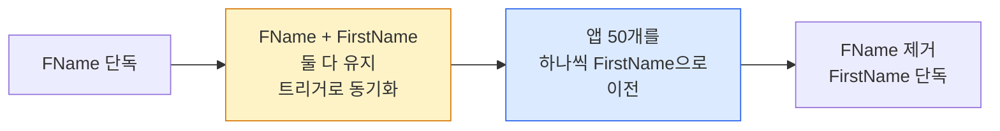

## 이게 뭔데

배포 파이프라인은 화려하다. 깃에 푸시하면 CI가 돌고, 테스트 통과하면 카나리로 5%만 흘려보내고, 메트릭 멀쩡하면 자동으로 100% 롤아웃. 애플리케이션 코드는 하루에 열 번도 배포한다. 자랑스럽게 "우린 진화적으로 일한다"고 말한다.

그런데 그 화려한 파이프라인 한가운데에 누구도 못 건드리는 성역이 하나 있다. **데이터베이스**다.

컬럼 하나 이름 바꾸려면 어떻게 되나. 일단 DBA한테 변경 요청서(CR)를 올린다. 다음 주 변경관리위원회(CAB) 회의에 안건으로 잡힌다. 회의에서 "영향 범위 분석서 첨부했냐"는 질문이 나온다. 다시 작성해서 올린다. 그다음 격주 정기 점검 윈도에 잡아서, 새벽 2시에, 전체 서비스 점검 공지 띄우고, DBA가 손으로 스크립트 돌린다. 컬럼 이름 하나 바꾸는 데 3주가 걸린다.

코드는 빛의 속도로 진화하는데, DB는 빙하기다. 이게 **변경 공포증**이다. 그리고 이건 개인의 게으름이 아니라, 데이터 커뮤니티가 수십 년에 걸쳐 정성껏 쌓아 올린 **문화**다.

<Callout type="warning" title="한 줄 요약">
스키마 변경이 어려운 건 기술 문제가 아니라 문화 문제다. "DB는 먼저 다 설계하고, 한 번 정하면 못 바꾼다"는 직렬적 문화가 변경 자체를 금지하는 프로세스로 굳어버렸다. 진화적 데이터베이스 개발의 첫걸음은 그 문화를 깨는 것이다.
</Callout>

## 시나리오: 이런 적 있을 거임

Customer 테이블에 `FName`이라는 컬럼이 있다. 누가 봐도 `FirstName`으로 바꾸는 게 맞다. 신입이 코드 리뷰에서 "이거 컬럼명 좀 명확하게 바꾸면 안 돼요?"라고 물어본다.

시니어가 피식 웃으며 답한다. "야, 그거 못 건드려. 저기 붙어 있는 외부 프로그램이 한 50개야."

그게 끝이다. `FName`은 영원히 `FName`으로 남는다. 5년 뒤에 입사한 후임도 똑같이 묻고, 똑같은 답을 듣는다. 테이블에는 `FName`, `addr1`, `addr2`, `flg_yn`, `temp_col_20190304_DO_NOT_USE` 같은 화석들이 지층처럼 쌓인다. 누구도 못 건드리니까.

여기서 진짜 문제는 컬럼 이름이 아니다. **"못 건드린다"가 기본값이 됐다는 사실**이다. 한번 이게 기본값이 되면 도미노가 시작된다.

- 잘못 설계한 테이블도 못 고친다. 그냥 옆에 새 테이블 하나 더 판다.
- 정규화가 깨진 컬럼도 못 고친다. 애플리케이션 코드에 if문을 발라서 가린다.
- 인덱스 하나 추가하는 것도 무서워서, 느린 쿼리를 그냥 캐시로 덮는다.

그래서 DB는 시간이 갈수록 나아지는 게 아니라 **나빠진다**. 코드는 리팩토링으로 계속 정리되는데, DB만 6년 전 신입이 급하게 짠 스키마 그대로다. 손대면 터지니까. 손 안 대면 안 터지니까. 그렇게 성역이 된다.

<Callout type="error" title="뭐가 문제냐면">
- **품질이 시간에 비례해 나빠진다**: 코드는 리팩토링으로 정리되는데 DB는 못 건드려서 부채만 쌓인다. 잘못된 설계가 영구화된다.
- **회피 비용이 더 비싸다**: 컬럼 못 고치니까 옆에 테이블 새로 파고, 코드에 if문 바르고, 캐시로 덮는다. 결국 변경을 피한 대가가 변경 자체보다 비싸진다.
- **공포가 공포를 부른다**: 한번 "못 건드린다"가 기본값이 되면, 작은 변경조차 시도하지 않게 된다. 변경 근육이 퇴화한다.
</Callout>

## 워터폴은 관광지로는 멋지다

Scott Ambler의 유명한 농담이 있다.

> "Waterfalls are wonderful tourist attractions. They are spectacularly bad strategies for organizing software development projects."
> (폭포는 훌륭한 관광 명소다. 소프트웨어 개발 프로젝트를 조직하는 전략으로는 굉장하게 나쁘다.)

오늘날 거의 모든 소프트웨어 프로세스 — Scrum이든 XP든 뭐든 — 는 본질적으로 **진화적(evolutionary)**이다. 진화적이라는 건 두 가지를 의미한다.

- **반복적(iterative)**: 모델링, 코딩, 테스트, 배포를 한 번에 다 하지 않고, 조금씩 여러 번 반복한다. "요구사항 전부 식별 → 상세 설계 → 구현 → 테스트 → 배포"로 이어지는 직렬(serial) 방식의 정반대다.
- **점진적(incremental)**: 시스템을 하나의 거대한 릴리스가 아니라, 작은 릴리스 여러 개로 쪼개서 내보낸다.

여기에 협업성을 더하면 **애자일**이 된다. 화이트보드 앞에서 떠드는 게 두꺼운 명세서 던지는 것보다 낫다는 그 철학. 개발팀은 이걸 20년 전에 받아들였다.

문제는, 이 흐름이 개발 커뮤니티에서는 표준이 됐는데 **데이터 커뮤니티에서는 그렇지 못했다**는 거다. 대부분의 데이터 기법은 여전히 직렬적이다. 구현이 "허락"되기 전에 꽤 상세한 데이터 모델을 먼저 다 그려야 하고, 그 모델은 기준선화(baseline)돼서 변경 관리 통제 하에 들어간다. 변경을 최소화하기 위해서.

Ambler는 여기서 칼을 꽂는다.

> "(If you consider the end results, this should really be called a change prevention process.)"
> (결과만 놓고 보면, 이건 사실 '변경 방지(change prevention) 프로세스'라고 불러야 한다.)

이름은 '변경 관리(change management)'라고 붙여놨지만, 실제로 하는 일은 변경을 **관리**하는 게 아니라 변경을 **막는** 거다. CR 올리고, CAB 통과하고, 윈도 잡고... 이 모든 절차의 실질적 효과는 "변경하지 마라"다. 그래서 우리는 변경을 안 하게 됐고, 그 결과가 `FName`이다.

<Callout type="info" title="왜 데이터만 직렬로 남았나">
이유가 없지 않다. 코드는 배포가 곧 교체다. 새 바이너리 올리면 옛날 건 그냥 사라진다. 하지만 데이터는 **상태**다. 컬럼을 지우면 그 안의 값도 같이 사라진다. 한번 손상되면 복구가 어렵다. 그래서 데이터 전문가들이 보수적인 데는 합리적인 핵이 있다. 핵심은 보수성 자체를 버리라는 게 아니라, "조심하는 것"과 "안 건드리는 것"을 구분하자는 거다. 조심하면서도 진화시킬 방법이 있다.
</Callout>

## 진화적 = 반복 + 점진, 그리고 의미 보존

그럼 DB를 진화시킨다는 건 구체적으로 뭔가. 핵심 도구가 **데이터베이스 리팩토링(database refactoring)**이다.

코드 리팩토링부터 보자. Fowler의 정의로, 코드 리팩토링은 **행위적 의미(behavioral semantics)를 유지하면서** 설계 품질만 개선하는, 규율 잡힌 작은 변경이다. `getPersons()`를 `getPeople()`로 이름 바꾸기 같은 거. 뭘 더하지도 빼지도 않는다. 그냥 더 나은 이름이 될 뿐이다. 그리고 중요한 건 — 이 메서드를 호출하는 **모든 곳을 다 바꿔서 예전처럼 동작하기 전까지는, 리팩토링이 끝난 게 아니다.**

데이터베이스 리팩토링도 똑같은 정신이다. 다만 보존해야 할 의미가 하나 더 있다.

- **행위적 의미(behavioral semantics)**: 동작이 그대로여야 한다.
- **정보적 의미(informational semantics)**: 그 안에 담긴 정보의 의미도 그대로여야 한다.

`Customer.FName`을 `Customer.FirstName`으로 바꾸는 건 데이터베이스 리팩토링이다. 컬럼 이름만 바뀌었을 뿐, 거기 담긴 "고객의 이름"이라는 정보는 한 글자도 안 변했다. 테이블·뷰 같은 구조뿐 아니라 저장 프로시저·트리거 같은 기능도 리팩토링 대상이다.

<Callout type="warning" title="DB 리팩토링이 코드 리팩토링보다 어려운 이유">
코드 리팩토링은 그 코드베이스 안에서 끝난다. 하지만 데이터베이스 리팩토링은 스키마뿐 아니라 그 스키마에 **결합(coupled)된 외부 시스템 전부** — 업무 애플리케이션, 배치, 리포팅, 데이터 추출, 다른 팀의 마이크로서비스까지 — 를 같이 손봐야 한다. 아까 그 "외부 프로그램 50개"가 바로 이 결합이다. 그러니 명백히 더 조심해야 한다. 어렵다는 게 "하지 말라"는 뜻은 아니지만.
</Callout>

여기가 핵심이다. 변경 공포증은 "스키마와 50개 시스템을 **동시에 한 방에** 바꿔야 한다"는 가정에서 나온다. 컬럼명을 바꾸는 순간 50개가 다 깨지니까 무서운 거다. 그런데 진화적 접근의 발상은 정반대다 — **동시에 안 바꾸면 된다.** 옛 컬럼과 새 컬럼을 한동안 **같이** 살려두고, 50개 시스템을 하나씩 천천히 옮긴 다음, 다 옮겨졌을 때 옛것을 치운다. 이 "잠깐 둘 다 살려두는 전환 기간"이 공포를 제거한다.



이게 진화적 사고의 정수다. 큰 변경을 무서운 한 방으로 치지 않고, **안전한 작은 단계의 연속**으로 쪼갠다. 2006년 책은 이 단계들을 번호 매긴 SQL 스크립트와 손코딩한 트리거로 구현했다. 골격은 그대로 유효하다. 다만 우리는 그 골격을 현대 도구로 자동화할 수 있게 됐을 뿐이다.

## 현대화: DB만 워터폴로 남은 아이러니

여기서 2006년과 2026년의 결정적 차이가 나온다. Ambler가 1장에서 진화적 데이터베이스 개발의 **장애물**로 두 가지를 꼽았다.

1. **문화적 장애물 (가장 극복하기 어려움)**
2. **도구 부족**

20년이 지나면서 2번은 **거의 사라졌다.** Ambler가 책에서 아쉬워했던 그 도구들이 지금은 다 있다.

```text
2006년 (책)                        →  2026년 (지금)
─────────────────────────────────────────────────────────
번호 매긴 SQL 스크립트 손관리       →  Flyway / Liquibase / Alembic
                                       Prisma Migrate / Rails Migration
손코딩한 동기화 트리거             →  expand-contract (parallel change) 패턴
점검 윈도에 손으로 DDL 실행         →  CREATE INDEX CONCURRENTLY
                                       ADD CONSTRAINT NOT VALID → VALIDATE
                                       gh-ost / pt-osc (온라인 스키마 변경)
DDL을 운영 DBA만 관리              →  마이그레이션을 앱 소스와 같은 Git에
                                       CI 파이프라인에서 자동 적용
```

마이그레이션 도구가 정확히 책이 말한 **형상 관리(configuration management)**를 구현한다. DDL 스크립트를 애플리케이션 소스 코드와 같은 Git 저장소에 두고, 버전을 매기고, 순서대로 적용하고, 어디까지 적용됐는지 추적한다. Flyway로 치면 이런 식이다.

```sql
-- V2026_06_09__01__add_first_name.sql
-- 1단계: 새 컬럼을 추가만 한다 (기존 FName은 그대로 살려둠)
ALTER TABLE customer ADD COLUMN first_name VARCHAR(100);

-- 기존 데이터 복사
UPDATE customer SET first_name = f_name WHERE first_name IS NULL;
```

```sql
-- V2026_06_23__01__drop_f_name.sql
-- 이 스크립트는 50개 앱이 전부 first_name으로 옮겨간 "다음" 릴리스에 들어간다
ALTER TABLE customer DROP COLUMN f_name;
```

두 변경 사이에 **2주의 전환 기간**이 있다. 그동안 옛 컬럼과 새 컬럼이 공존하고, 트리거(혹은 더블 라이트 코드)가 둘을 동기화한다. 앱은 준비되는 순서대로 하나씩 옮겨간다. 깨지는 순간이 없다. 이게 책의 "단계별 SQL 스크립트"를 현대 도구로 옮긴 모습이고, 동시에 그 무서웠던 한 방을 안전한 두 단계로 분해한 모습이다.

<Callout type="success" title="온라인 스키마 변경 — 잠금조차 안 걸린다">
"인덱스 걸면 테이블 락 걸려서 서비스 멈춘다"는 것도 옛날 공포다. PostgreSQL은 `CREATE INDEX CONCURRENTLY`로 쓰기를 막지 않고 인덱스를 만든다. 제약 조건은 `ADD CONSTRAINT ... NOT VALID`로 먼저 빠르게 걸고, 나중에 `VALIDATE CONSTRAINT`로 천천히 검증한다. MySQL은 gh-ost나 pt-osc 같은 도구가 그림자 테이블을 만들어 무중단으로 옮긴다. 새벽 2일에 점검 공지 띄우던 작업이, 이제 한낮에 트래픽 받으면서 돌아간다.
</Callout>

도구는 다 풀렸다. 그런데 `FName`은 여전히 `FName`이다. 왜? **1번, 문화적 장애물이 안 풀렸기 때문이다.** Ambler가 "가장 극복하기 어렵다"고 못 박은 그것.

## 1970년대의 흉터

문화는 왜 이렇게 질긴가. Ambler의 진단이 날카롭다.

오늘날 많은 데이터 전문가는 1970~80년대 초, **"코드 짜고 고치기(code-and-fix)"**가 만연하던 시절에 경력을 시작했다. 설계도 없이 일단 짜고, 터지면 고치고, 또 터지면 또 고치고. 그 결과는 끔찍했다. 유지보수 불가능한 스파게티, 아무도 이해 못 하는 시스템. 그 트라우마를 겪은 세대가 자연스럽게 내린 결론이 "그러니까 **미리 다 설계하고, 한번 정하면 함부로 바꾸지 말자**"였다. 무겁고 구조화된, 직렬적인 방법론. 그건 1970년대 맥락에선 **합리적인 대응**이었다.

문제는 그다음이다. 1990년대에 진화적·애자일 기법이 등장했을 때, 이 세대는 그걸 보고 **1970년대 code-and-fix의 재탕으로 오해했다.** "설계 없이 일단 짠다고? 그거 우리가 옛날에 해봤는데 망했어." 그래서 진화적 접근을 곧 저품질과 동일시했다.

이게 오해의 핵심이다. 애자일 커뮤니티가 20년에 걸쳐 증명한 건 이거다.

> **진화적이라고 해서 저품질일 필요는 없다.**

진화적 ≠ 무계획. 진화적은 요구사항을 탐색하고, 아키텍처를 미리 생각하고, 코딩 전에 모델링하는 걸 다 한다. 다만 그걸 **전부 미리 한 방에** 안 할 뿐이다. 적시(just-in-time)에, 필요한 만큼, 회귀 테스트라는 안전망을 깔고 한다. code-and-fix에는 없던 그 안전망 — 테스트와 작은 단계 — 이 진화를 안전하게 만든다. 1970년대의 무모함과는 정반대다.

<Callout type="note" title="당신이 보수적인 건 흉터 때문일 수 있다">
"DB는 함부로 건드리는 거 아니야"라는 직감 자체가 틀린 건 아니다. 그건 누군가 실제로 데이터를 날려먹고 얻은 흉터의 유산이다. 존중할 만하다. 다만 그 흉터가 "조심하자"를 넘어 "안 건드린다"까지 가버렸다면, 한번 의심해 볼 때다. 지금은 회귀 테스트, 전환 기간, 온라인 DDL, 자동 롤백이라는 안전 장비가 다 있다. 1970년대엔 맨몸으로 절벽을 탔지만, 지금은 로프와 안전벨트가 있다. 로프 있는데도 절벽을 안 타는 건, 조심이 아니라 그냥 안 하는 거다.
</Callout>

## 문화를 깨는 작은 첫걸음

그래서 어떻게 깨나. 거창한 조직 개편 말고, 현실적인 것부터.

<Steps>
<Step title="DDL을 Git에 넣는다 — 형상 관리부터">
가장 ROI 높은 첫수다. 마이그레이션 스크립트를 DBA의 로컬 폴더나 위키가 아니라, 애플리케이션 소스와 **같은 Git 저장소**에 둔다. Flyway든 Liquibase든 Alembic이든 Prisma든 뭐든. 이 순간 스키마 변경이 "특별한 의식"에서 "그냥 평범한 커밋"으로 격하된다. 코드 PR과 스키마 PR이 같은 흐름을 탄다. 변경이 일상이 된다.
</Step>
<Step title="변경을 작게 쪼개는 습관">
컬럼 5개를 한 번에 바꾸는 큰 변경 하나보다, 컬럼 1개씩 바꾸는 작은 변경 5개가 훨씬 안전하다. 작으면 영향 범위가 명확하고, 터져도 어디서 터졌는지 즉시 안다. 롤백도 쉽다. 진화적 개발은 결국 "큰 무서운 한 방"을 "작은 안전한 여러 단계"로 분해하는 기술이다.
</Step>
<Step title="핵심 로직에만이라도 회귀 테스트">
완전한 DB 단위 테스트 스위트를 처음부터 만들겠다는 건 비현실적이다. 시작은 핵심 비즈니스 로직 — 중요한 저장 프로시저, 참조 무결성(RI) 규칙 — 에 한해 최소한의 테스트부터. 테스트가 "안 깨졌다"고 말해주는 순간, 변경할 용기가 생긴다. 용기 없이는 리팩토링도 없다.
</Step>
<Step title="작게 자주 배포해 신뢰를 쌓는다">
가장 큰 장애물은 기술이 아니라 사람의 직감이다. 논쟁으로는 직감을 못 이긴다. 작은 스키마 변경을 안전하게, 무중단으로, 롤백 가능하게 여러 번 성공시켜서 **성공 사례를 눈앞에 쌓는 것**이 직감을 바꾼다. "어, 저거 별일 없네?"가 열 번 쌓이면 성역이 풀린다.
</Step>
</Steps>

규모도 현실에 맞춰라. 책은 7~8개의 물리 샌드박스(개발/통합/데모/QA/운영...)와 정교한 승격 게이트를 말하지만, 작은 팀이나 SI 프로젝트에 그건 과하다. 현실적으로는 (1) 개발자 로컬, (2) 통합/스테이징, (3) 운영의 **3단계만** 둬도 충분하다. 핵심은 단계 개수가 아니라, 변경이 이 단계들을 **막힘없이 흘러가느냐**다.

## 정리

변경 공포증은 게으름이 아니다. 1970년대 code-and-fix의 흉터에서 자라난, 한때는 합리적이었던 보수성이 시대를 못 따라가고 굳어버린 결과다. 그 보수성이 '변경 관리'라는 이름의 **변경 방지 프로세스**로 제도화됐고, 그래서 `FName`은 영원히 `FName`으로 남았다.

> **DB가 못 건드리는 성역이 된 건 기술의 한계가 아니라 문화의 관성이다.**

도구는 이미 다 풀렸다. 마이그레이션 도구가 형상 관리를 해주고, expand-contract 패턴이 무서운 한 방을 안전한 두 단계로 쪼개주고, 온라인 DDL이 잠금조차 없애줬다. 1970년대엔 맨몸으로 탔던 절벽을, 지금은 로프와 안전벨트를 다 갖추고 탄다. 남은 건 단 하나, **"DB는 안 건드린다"가 기본값이라는 그 직감을 의심하는 것**이다.

진화적 데이터베이스 개발의 첫걸음은 대단한 도구 도입이 아니다. DDL 스크립트 하나를 Git에 커밋하고, 컬럼 이름 하나를 안전하게 바꿔보는 것. 그 작은 성공 하나가 성역에 처음으로 금을 낸다.
