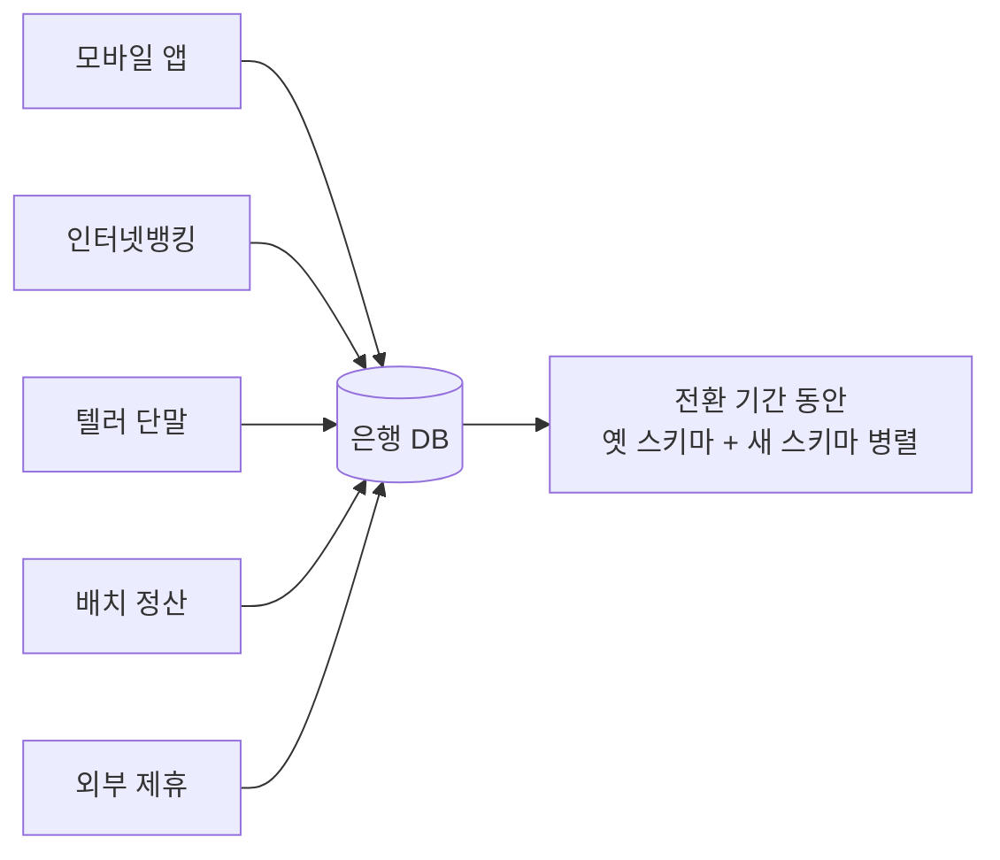
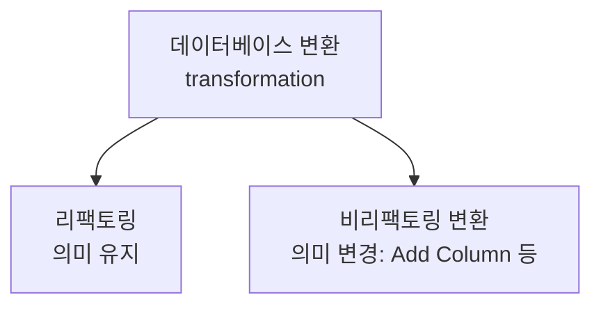

## 이게 뭔데

리팩토링 카탈로그를 처음 펼치면 좀 당황스럽다. `Move Column`, `Make Column Non Nullable`, `Add Foreign Key Constraint`, `Encapsulate Table With View`, `Rename Method`, `Add Column`... 이름만 수십 개가 줄줄이 나온다. 다 비슷해 보이는데 또 미묘하게 다르다. "그래서 얘들을 어떻게 머릿속에 정리하라는 거지?" 싶다.

그래서 Ambler & Sadalage는 이 수십 개를 **여섯 개의 범주**로 묶었다. 구조적, 데이터 품질, 참조 무결성, 아키텍처, 메서드, 그리고 비리팩토링 변환. 이 글은 개별 리팩토링 하나를 깊게 파는 글이 아니라, **카탈로그 전체의 지도**다. 어느 범주가 무슨 일을 하고, 대표 예가 뭐고, 실무에서 어디에 닿는지 — 산을 오르기 전에 등산로 입구에서 보는 안내판 같은 거다.

미리 솔직하게 깔고 가자. **이 분류는 완벽하지 않다.** 저자도 그렇게 인정한다. 어떤 리팩토링은 두 범주에 걸쳐 있고, 어디로 넣을지는 결국 "이 책을 어떻게 정리할까"라는 편의의 문제다. 그러니 범주를 외울 필요는 없다. 대신 "이런 결의 변경들이 있구나" 하는 **감**을 가져가는 게 목적이다.

<Callout type="info" title="한 줄 요약">
데이터베이스 리팩토링은 여섯 범주로 나뉜다 — 구조(테이블·뷰 모양), 데이터 품질(값의 품질), 참조 무결성(관계의 일관성), 아키텍처(앱이 DB와 대화하는 방식), 메서드(프로시저·함수·트리거의 품질), 그리고 의미를 바꾸는 비리팩토링 변환. 앞 다섯은 의미를 유지하고, 여섯 번째는 일부러 바꾼다.
</Callout>

## 무대 깔기: 같은 은행, 같은 테이블

이 시리즈가 계속 굴려 온 가상 도메인을 그대로 쓰자. 은행이다. 핵심 테이블 몇 개만 머릿속에 띄워두면 된다.

```text
Customer    고객 (이름, 주소, 가입일, ...)
Account     계좌 (계좌번호, 잔액, 개설일, ...)
Policy      보험 약관/정책
Insurance   보험 계약
```

그리고 한 가지 전제. 이 은행 DB는 **혼자 쓰는 게 아니다.** 모바일 앱, 인터넷뱅킹, 텔러 단말, 배치 정산, 외부 제휴 시스템 — 통제 범위 밖의 프로그램까지 줄줄이 붙어 있는 **다중 애플리케이션 데이터베이스**다. 그래서 어떤 변경이든 "오늘 밤 한 방에 바꾸고 끝"이 안 된다. **전환 기간(transition period)** 동안 옛것과 새것을 나란히 굴려야 한다.

이 전제가 여섯 범주를 관통하는 색깔이다. 범주가 달라도 "안전하게, 점진적으로, 의미 안 바꾸고" 라는 규율은 같다. 여섯 번째 범주만 예외고.



이제 여섯 범주를 하나씩 본다.

## 1. 구조적 리팩토링 (Structural)

**테이블과 뷰의 "모양"을 바꾼다.** 가장 직관적이고, 카탈로그에서 가장 양이 많은 동네다.

대표 예가 이 시리즈가 줄곧 우려먹은 `Move Column`이다. 잔액(`Balance`)이 처음엔 `Customer`에 붙어 있었다고 치자. 고객 한 명당 잔액 하나. 그런데 한 고객이 계좌를 여러 개 가지는 순간 이 모델은 무너진다. 잔액은 고객이 아니라 **계좌**의 속성이니까. 그래서 `Customer.Balance`를 `Account.Balance`로 옮긴다. 이게 구조적 리팩토링이다.

또 다른 단골은 `Split Column`(다목적 컬럼 분리)이다. 어떤 컬럼이 고객이면 생년월일, 직원이면 입사일을 담는 식으로 **하나가 두 가지 일을** 하고 있으면, 그건 분리하라는 신호다.

<Callout type="warning" title="뭐가 문제냐면">
구조적 변경은 "모양"을 바꾸기 때문에, 그 컬럼/테이블을 참조하던 **모든 SQL이 영향을 받는다.** `Customer.Balance`를 읽던 보고서, 그 컬럼에 쓰던 입금 로직, 위치 기반으로 "17번째 컬럼"을 긁던 레거시 코드까지. 그래서 다중 앱 환경에서는 두 컬럼을 동시에 살려두고 트리거나 동기화로 양쪽을 맞추는 전환 기간이 필수다.
</Callout>

현대 실무에서 이게 닿는 곳은 **expand-contract 패턴**(parallel change라고도 부른다)이다. 책의 "전환 기간"을 마이그레이션 도구로 옮기면 정확히 이 모양이 된다.

<Steps>
<Step title="Expand — 새 컬럼을 더한다">
`Account.Balance`를 추가한다. 아직 아무도 안 쓴다. Flyway/Liquibase/Alembic 마이그레이션 한 줄, 혹은 Prisma `migrate`. 기존 코드는 멀쩡히 돈다.
</Step>
<Step title="Migrate — 데이터를 채우고 양쪽을 동기화한다">
기존 `Customer.Balance`를 적절한 `Account.Balance`로 복사한다. 전환 기간 동안 둘 다 갱신되도록 트리거(또는 애플리케이션의 dual-write)로 묶는다.
</Step>
<Step title="Contract — 옛 컬럼을 뗀다">
모든 앱이 새 컬럼으로 갈아탄 게 확인되면, `Customer.Balance`와 동기화 트리거를 드롭한다. 이게 전환 기간의 끝이다.
</Step>
</Steps>

## 2. 데이터 품질 리팩토링 (Data Quality)

구조는 그대로 두고, **그 안에 담긴 값의 품질을 끌어올린다.**

대표 예 둘. 하나는 `Make Column Non Nullable` — NULL이 들어오던 컬럼을 "반드시 값이 있어야 함"으로 조인다. 다른 하나는 `Introduce Common Format` — 같은 의미인데 제각각으로 저장되던 값을 한 형식으로 통일한다. 전화번호가 `(416) 555-1234`, `905.555.1212`, `4165551234`처럼 뒤죽박죽이면, 저장은 `4165551234` 한 형식으로 통일하고 화면에서만 예쁘게 포맷한다.

<Callout type="note" title="이건 의미를 안 바꾸나?">
미묘하다. 전화번호 형식을 통일해도 "이 사람의 전화번호"라는 정보적 의미는 그대로다 — 표시할 때 다시 `(XXX) XXX-XXXX`로 보여주면 되니까. 그래서 리팩토링으로 친다. 단, `(XXX) XXX-XXXX` 형식의 문자열에만 동작하도록 만들어진 어떤 낡은 보고서가 있었다면, 그 보고서 입장에선 의미가 바뀐 거다. 그래서 "의미를 안 바꿨다"는 건 항상 **충분한 테스트로 확인하는** 거지, 그냥 믿는 게 아니다.
</Callout>

`Make Column Non Nullable`이 현대 실무에서 까다로운 이유는 따로 있다. 큰 테이블에 `NOT NULL` 제약을 거는 건 **잠금(lock)**과 풀스캔을 부른다. 그래서 PostgreSQL이라면 한 방에 `ALTER ... SET NOT NULL`을 치지 않는다.

```sql
-- 위험: 큰 테이블에서 전체 스캔 + 강한 락
ALTER TABLE Customer ALTER COLUMN email SET NOT NULL;

-- 안전: CHECK 제약을 NOT VALID로 먼저 걸고
ALTER TABLE Customer
  ADD CONSTRAINT email_not_null CHECK (email IS NOT NULL) NOT VALID;

-- 운영 트래픽 받으면서 천천히 검증
ALTER TABLE Customer VALIDATE CONSTRAINT email_not_null;
```

`NOT VALID`로 제약을 먼저 등록하면 신규/수정 행에만 적용되고 전체 스캔을 미룬다. 그다음 `VALIDATE`는 약한 락만 잡고 기존 행을 훑는다. 책이 2006년에 "전환 기간 동안 천천히"라고 말한 정신을, 현대 DB는 엔진 차원의 온라인 검증으로 받아준다.

## 3. 참조 무결성 리팩토링 (Referential Integrity)

**관계의 일관성을 보장한다.** 참조하는 행이 실제로 존재하게, 그리고 더 이상 필요 없는 행은 제대로 치워지게.

대표 예가 `Add Foreign Key Constraint`와 `Introduce Cascading Delete`다. 고객이 삭제되면 그 고객의 보험 계약(`Insurance`)도 같이 사라져야 한다면, 연쇄 삭제 트리거나 `ON DELETE CASCADE`를 건다. 반대로 "고아 행(orphan)"이 생기지 않게 외래 키로 막는다.

<Callout type="error" title="뭐가 문제냐면">
운영 DB에 외래 키를 뒤늦게 거는 순간, 이미 쌓여 있던 **고아 데이터가 발목을 잡는다.** `Insurance.customer_id`가 가리키는 `Customer`가 진작 사라진 행이 수천 건 있으면, 외래 키 추가가 통째로 실패한다. 그래서 무결성 리팩토링은 "제약을 건다"가 아니라 "**먼저 청소하고** 제약을 건다"가 진짜 작업이다.
</Callout>

여기서도 PostgreSQL의 `NOT VALID` 콤보가 빛난다.

```sql
-- 1) 기존 고아 행은 잠시 눈감고, 신규 행만 막는다
ALTER TABLE Insurance
  ADD CONSTRAINT fk_customer
  FOREIGN KEY (customer_id) REFERENCES Customer(id) NOT VALID;

-- 2) 고아 데이터를 청소한 뒤
DELETE FROM Insurance
WHERE customer_id NOT IN (SELECT id FROM Customer);

-- 3) 비로소 전체 검증 (약한 락)
ALTER TABLE Insurance VALIDATE CONSTRAINT fk_customer;
```

마이크로서비스 얘기를 잠깐 얹자. 요즘은 `Customer`와 `Insurance`가 **서로 다른 서비스의 DB**에 흩어져 있는 경우가 흔하다. 그러면 DB 차원의 외래 키를 아예 못 건다. 이때 참조 무결성은 제약 조건이 아니라 **이벤트와 보정(saga, outbox, CDC)**의 문제로 넘어간다. 고객 삭제 이벤트를 발행하고, 각 서비스가 자기 쪽 정리를 책임지는 식이다. 범주는 같은데(관계의 일관성), 도구가 트리거에서 이벤트로 바뀐 거다.

## 4. 아키텍처 리팩토링 (Architectural)

**외부 프로그램이 DB와 상호작용하는 전반적인 방식**을 개선한다. 테이블 모양이 아니라, "누가 어떻게 DB에 말을 거는가"의 구조다.

책의 대표 예는 좀 옛날 냄새가 난다. 여러 앱이 공유하던 자바 라이브러리 안의 계산 로직을 **저장 프로시저로 옮겨서**, 자바를 안 쓰는 앱도 같은 로직을 쓰게 만드는 식이다. 또 `Encapsulate Table With View` — 테이블을 직접 노출하는 대신 뷰로 감싸서, 나중에 테이블을 바꿔도 뷰 인터페이스는 유지하게 한다.

핵심은 **결합(coupling)을 줄이는 것**이다. 모두가 테이블을 직접 긁으면, 테이블 하나 바꿀 때 50개 앱이 깨진다. 뷰나 프로시저나 API로 한 겹 감싸두면, 안쪽을 바꿔도 바깥 계약은 지킬 수 있다.

<Callout type="error" title="현대판 아키텍처 냄새: 공유 DB">
마이크로서비스에서 가장 악명 높은 안티패턴이 바로 **여러 서비스가 같은 테이블을 직접 읽고 쓰는 공유 데이터베이스**다. 이건 책이 말한 "다중 애플리케이션 DB"의 극단판이고, 결합도 최악이다. 아키텍처 리팩토링의 현대적 목표는 이걸 푸는 거다 — 테이블 직접 접근을 끊고, API나 이벤트(CDC, Debezium, outbox)를 통해서만 데이터를 주고받게.
</Callout>

이 범주가 곧 자기모순처럼 보일 수 있다. "다른 편에선 JOIN 잘 쓰라며? 근데 여기선 DB 직접 접근을 끊으라고?" 충돌이 아니다. 한 서비스 안에서 자기 DB에 JOIN을 쓰는 건 권장이고, 남의 서비스 테이블을 몰래 JOIN으로 긁는 건 결합을 키우는 일이다. 경계가 다르다.

## 5. 메서드 리팩토링 (Method)

**저장 프로시저·함수·트리거 자체의 품질**을 올린다. 코드 리팩토링의 DB 버전이라고 보면 정확하다.

대표 예가 `Rename Method`(프로시저 이름 변경), `Parameterize Method`, `Remove Parameter` 같은 것들. `sp_CalcBal`처럼 암호 같은 이름을 `Calculate_Account_Balance`로 바꾸는, 그 흔한 정리 작업이다. 의미는 1도 안 바뀐다. 그냥 다음 사람이 덜 욕하게 만드는 일이다.

함정은 **누가 이 프로시저를 부르는지 다 알 수 없다는 것.** 코드 안의 함수면 IDE가 호출처를 다 찾아주지만, 저장 프로시저는 외부 배치 스크립트, 다른 앱, 심지어 운영자가 손으로 치는 쿼리에서까지 불릴 수 있다.

<Callout type="note" title="이름 바꾸기의 전환 기간">
프로시저 이름조차 한 방에 못 바꾼다. 새 이름 `Calculate_Account_Balance`를 만들고, 옛 이름 `sp_CalcBal`은 새 프로시저를 그대로 호출하는 **얇은 껍데기(wrapper)**로 남긴다. 옛 이름에 "removal date: 2026-12-31" 같은 폐기 날짜를 박아두고, 모든 호출자가 옮겨간 게 확인되면 그때 떼어낸다. 구조 리팩토링의 전환 기간과 정확히 같은 리듬이다.
</Callout>

요즘은 비즈니스 로직을 저장 프로시저에 욱여넣는 걸 선호하지 않는 팀이 많다(버전 관리, 테스트, 배포가 애플리케이션 코드보다 까다로워서). 그래도 트리거·함수는 여전히 살아 있고, Flyway/Liquibase로 프로시저 정의를 마이그레이션으로 관리하는 순간 메서드 리팩토링도 똑같이 버전 관리·코드 리뷰·CI 대상이 된다.

## 6. 비리팩토링 변환 (Non-Refactoring Transformation)

앞의 다섯과 **결이 다른** 마지막 범주다. 여기 들어오는 건 리팩토링이 아니다. **의미를 일부러 바꾸는** 스키마 변경이다.

리팩토링의 정의는 "의미(behavioral + informational)를 유지하면서 설계를 개선"이다. 그런데 `Add Column`(기존 테이블에 새 컬럼 추가)처럼 **새 정보를 더하는** 변경은 의미를 바꾼다. 그래서 책은 이걸 리팩토링이 아니라 변환(transformation)으로 따로 분류했다. 데이터베이스 변환은 더 큰 집합이고, 리팩토링은 그 **부분집합**이다.



여기서 미묘한 게 `Introduce Column`(빈 컬럼 추가)이다. 새 기능이 그 컬럼을 쓰기 전까지는 "의미를 안 바꾼 것처럼" 보인다. 근데 저자는 이것도 리팩토링이 아니라 변환으로 본다. 이유가 현실적이다.

<Callout type="warning" title="빈 컬럼도 누군가는 깬다">
- **위치 기반 접근**: "17번째 컬럼"을 이름 대신 순서로 참조하는 코드가 있으면, 중간에 컬럼을 끼우는 순간 깨진다.
- **바인딩된 레거시**: DB2 테이블에 바인딩된 COBOL 코드는 끝에 컬럼을 추가해도 재바인딩 없이는 깨진다.

그래서 판단 기준은 이론이 아니라 **실용성(practicality)**이다. "엄밀히 의미를 유지하느냐"보다 "현장에서 뭘 깨뜨리느냐"로 줄을 긋는다.
</Callout>

재미있는 건, 비리팩토링 변환이 **리팩토링의 한 단계로 끼어드는** 경우다. 1번에서 본 `Move Column`을 적용할 때, 그 안에서 `Introduce Column`(빈 새 컬럼 추가)을 한 스텝으로 쓴다. 변환이 리팩토링의 부품이 되는 셈이다. 그래서 둘은 적대 관계가 아니라 포함 관계다.

## 분류는 지도일 뿐, 영토가 아니다

여섯 칸을 다 봤으니, 이제 솔직한 얘기를 할 차례다. **이 분류는 깔끔하지 않다.**

저자가 직접 든 예가 `Replace Method With View`다. 이건 메서드(프로시저를 없앤다)에도 닿고, 아키텍처(앱이 DB와 대화하는 방식을 바꾼다)에도 닿는다. 양다리다. 책은 이걸 그냥 아키텍처로 욱여넣었다. 정답이라서가 아니라, **어딘가엔 넣어야 책의 목차가 만들어지니까.**

| 범주 | 한 줄 | 대표 예 | 의미 |
|---|---|---|---|
| 구조적 | 테이블·뷰의 모양 변경 | `Move Column`, `Split Column` | 유지 |
| 데이터 품질 | 값의 품질 개선 | `Make Column Non Nullable`, `Introduce Common Format` | 유지 |
| 참조 무결성 | 관계의 일관성 보장 | `Add Foreign Key`, `Introduce Cascading Delete` | 유지 |
| 아키텍처 | 앱이 DB와 대화하는 방식 | `Encapsulate Table With View`, 로직을 프로시저로 | 유지 |
| 메서드 | 프로시저·함수·트리거 품질 | `Rename Method`, `Parameterize Method` | 유지 |
| 비리팩토링 변환 | 의미를 바꾸는 변경 | `Add Column` | **변경** |

<Callout type="info" title="범주를 외우지 말고, 이렇게 써라">
실무에서 카탈로그를 펼칠 때 범주는 "외울 지식"이 아니라 "찾을 색인"이다. "잔액을 옮기고 싶다" → 구조적 동네. "NULL 좀 막고 싶다" → 데이터 품질 동네. "고아 행 없애고 싶다" → 참조 무결성 동네. 분류는 비슷한 작업을 옆에 모아둬서 빨리 찾게 해주는 장치일 뿐이다.
</Callout>

## 정리

데이터베이스 리팩토링 카탈로그는 여섯 범주로 묶인다. 다섯은 의미를 **유지**하고, 마지막 하나는 일부러 **바꾼다.**

- **구조적** — 테이블·뷰의 모양. (`Move Column`)
- **데이터 품질** — 값의 품질. (`Make Column Non Nullable`)
- **참조 무결성** — 관계의 일관성. (`Add Foreign Key`)
- **아키텍처** — 앱이 DB와 대화하는 방식. (`Encapsulate Table With View`)
- **메서드** — 프로시저·함수·트리거의 품질. (`Rename Method`)
- **비리팩토링 변환** — 의미를 바꾸는 변경. (`Add Column`)

그리고 이 분류는 완벽하지 않다. 어떤 작업은 두 칸에 걸치고, 어디에 넣을지는 결국 편의의 문제다. 하지만 그게 흠은 아니다.

> **지도는 영토와 똑같지 않아도 길을 찾게 해준다.**

여섯 범주의 가치는 정확한 경계선이 아니라, "비슷한 결의 변경끼리 모아둬서 다음에 비슷한 일을 만났을 때 어디를 펼칠지 알게 해준다"는 데 있다. 2006년 책이 트리거와 번호 매긴 SQL 스크립트로 그렸던 이 지도는, expand-contract, `NOT VALID`/`VALIDATE`, CDC, 마이그레이션 도구로 모양만 바뀌었을 뿐 — 칸의 의미는 그대로다. 안전하게, 점진적으로, 깨뜨리지 않고 바꾼다.
