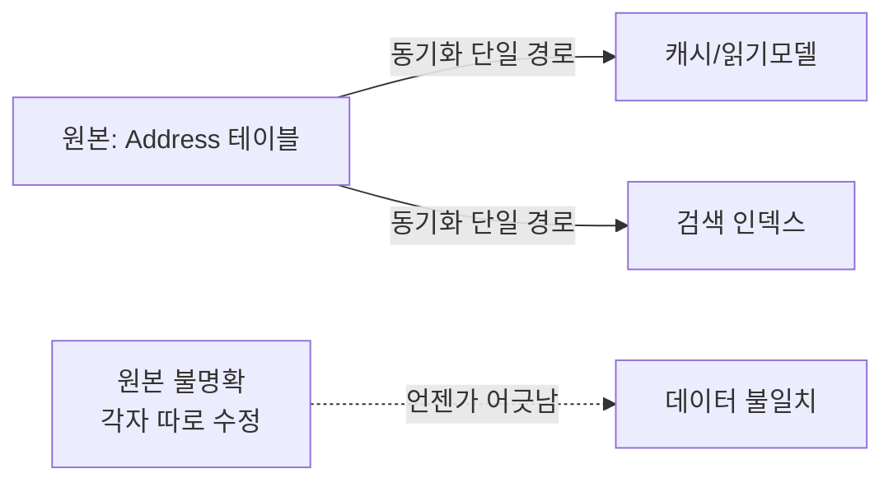

import { Callout } from '@/components/writing-ui';

## 이게 뭔데

Martin Fowler가 "코드 냄새(code smell)"라는 말을 만들었다. 코드를 보다가 "음... 뭔가 좀 구린데?" 싶은 그 느낌. 버그는 아닌데, 손볼 때가 됐다는 신호. 데이터베이스에도 똑같은 게 있다. **데이터베이스 냄새**.

여기서 중요한 건 단어 선택이다. 저자가 "오류(error)"라고 안 하고 굳이 "냄새(smell)"라고 한 데는 이유가 있다. 냄새가 난다고 무조건 썩은 게 아니거든.

<Callout type="info" title="림버거 치즈 vs 상한 우유">
림버거 치즈는 멀쩡한데도 발 냄새가 난다. 원래 그렇게 만든 거다. 냄새가 난다고 갖다 버리면 비싼 치즈만 날린다. 반면 우유에서 시큼한 냄새가 나면? 그건 진짜 상한 거다. 마시면 안 된다.

데이터베이스 냄새도 똑같다. **냄새가 난다 = 살펴봐라**지, **냄새가 난다 = 무조건 고쳐라**가 아니다. 코를 킁킁대고, 들여다보고, 생각하고, 합당하면 그때 리팩토링한다.
</Callout>

그러니까 이 글은 "이거 보이면 무조건 갈아엎어라" 리스트가 아니다. "이거 보이면 일단 멈춰서 냄새 좀 맡아봐라" 리스트다. 일곱 가지를 하나씩 보자. 책의 은행 도메인(Customer / Account / Balance / Policy / Insurance)을 계속 써먹을 거다.

## 1. 다목적 컬럼: 한 칸이 두 집 살림

제일 흔하고, 제일 교묘하다. **컬럼 하나가 상황에 따라 다른 의미로 쓰이는 것.**

`Customer` 테이블에 `important_date`라는 컬럼이 있다고 치자. 개인 고객이면 생년월일이 들어가고, 법인 고객이면 설립일이 들어간다. "어차피 둘 다 날짜잖아? 한 칸으로 합치면 컬럼도 아끼고 좋지." 이렇게 시작된다.

```sql
-- important_date가 두 가지 의미로 산다
SELECT customer_id, customer_type, important_date
FROM customer;
-- customer_type='개인' → important_date는 생년월일
-- customer_type='법인' → important_date는 설립일
```

문제는 어느 날 기획이 이렇게 말할 때 터진다. "개인 고객 생일에 축하 쿠폰 보내고 싶은데요. 아, 그리고 법인 고객은 설립 N주년에 기념 메일도요."

이제 너는 곤란해진다. 개인 고객한테는 입사일이... 아니 생일을 보내야 하고, 근데 이 컬럼이 생일인지 설립일인지는 `customer_type`을 봐야 알고, 그럼 직원이면서 동시에 고객인 사람은 생년월일을 어디다 저장하지? **한 칸에 두 개념을 욱여넣는 순간, 세 번째 개념이 들어올 자리가 사라진다.**

<Callout type="warning" title="뭐가 문제냐면">
- **NULL 비교나 조건문 없이는 의미를 못 읽는다.** 컬럼 값만 봐서는 그게 뭔지 모른다. 항상 `customer_type` 같은 짝꿍 컬럼을 같이 봐야 한다.
- **제약조건을 못 건다.** 생년월일이면 "오늘보다 과거"라는 체크가 말이 되는데, 설립일이 섞여 있으면 그 체크가 어디까지 유효한지 애매해진다.
- **새 케이스가 들어오면 구조가 깨진다.** 세 번째 의미가 필요해지는 순간 답이 없다.
</Callout>

해법은 보통 **컬럼을 의미별로 쪼개는 것**이다. `birth_date`와 `incorporation_date`를 따로 두고, 해당 안 되는 쪽은 NULL. 컬럼 늘어나는 게 아까운가? 의미가 섞여서 영원히 헷갈리는 것보다 NULL 몇 개가 싸다.

## 2. 다목적 테이블: 한 테이블이 동물원

컬럼 단위로 일어나던 일이 테이블 단위로 커지면 이게 된다. **한 테이블이 성격이 다른 여러 종류의 엔티티를 다 떠안는 것.**

`Customer` 테이블에 개인도 넣고 법인도 넣는다. 개인한테만 있는 컬럼(생년월일, 성별), 법인한테만 있는 컬럼(사업자번호, 대표자명)이 한 테이블에 다 모인다. 결과는?

```sql
-- 개인 고객 행
-- name=홍길동, birth_date=1990-01-01, gender=M,
-- biz_number=NULL, ceo_name=NULL, ...

-- 법인 고객 행
-- name=ACME(주), birth_date=NULL, gender=NULL,
-- biz_number=123-45-67890, ceo_name=김대표, ...
```

테이블 절반이 NULL밭이다. 행마다 의미 있는 컬럼이 다르다. 이걸 **"스위스 군용 칼 테이블"**이라고 불러도 된다. 다 되는데, 뭐 하나 제대로 되는 게 없는.

NULL이 많다는 건 그냥 보기 싫은 게 아니라 실제 비용이다. "법인인데 대표자명이 비어 있다"는 걸 막으려면 `customer_type='법인'일 때만 ceo_name NOT NULL` 같은 조건부 제약을 걸어야 하는데, 이게 RDBMS마다 지원이 들쭉날쭉하고 복잡하다. 결국 검증을 애플리케이션 코드로 떠넘기게 되고, 그 코드는 까먹기 십상이다.

이걸 정리하는 길은 보통 두 가지다.

```text
방법 A — 공통은 부모, 차이는 자식 (테이블 상속/서브타입)
  Customer (id, name, type, created_at)   ← 공통
    ├─ IndividualCustomer (customer_id, birth_date, gender)
    └─ CorporateCustomer  (customer_id, biz_number, ceo_name)

방법 B — 진짜 별개면 그냥 갈라라
  IndividualCustomer (...)
  CorporateCustomer  (...)
```

어느 쪽이든 핵심은 **"다른 모양의 데이터는 다른 테이블에"**다.

## 3. 중복 데이터: 같은 주소가 두 군데, 그것도 다르게

저자가 운영 데이터베이스에서 **가장 심각하다**고 콕 집은 냄새. 같은 사실(fact)이 여러 군데 저장돼 있는 것.

같은 사람의 주소가 `Customer` 테이블엔 "서울시 강남구 123", `Policy`(보험증권) 테이블엔 "서울시 송파구 456"으로 들어가 있다. 둘 중 뭐가 진짜인가? 모른다. 둘 다 업데이트됐어야 하는데 한쪽만 바뀐 거다. 이게 **데이터 불일치(inconsistency)**다.

<Callout type="error" title="중복 데이터가 진짜 무서운 이유">
중복 자체가 문제가 아니다. **중복이 어긋나는 순간**이 문제다. 그리고 중복은 시간이 지나면 반드시 어긋난다. 한쪽만 고치는 코드, 트랜잭션 밖에서 도는 배치, 한 군데만 아는 신입의 핫픽스... 어긋날 경로는 셀 수 없이 많다.

그리고 어긋난 다음엔 더 무섭다. 보험금 지급 주소로 "송파구 456"을 쓸까, "강남구 123"을 쓸까? 어느 쪽을 골라도 절반은 틀린다.
</Callout>

정석은 **정규화**다. 주소를 한 군데(예: `Address` 테이블)에 두고, 나머지는 그걸 참조한다. 진실의 출처(source of truth)를 하나로.

다만 현대 실무에선 의도된 중복도 있다. 성능을 위한 **비정규화**, 빠른 조회를 위한 **읽기 모델/캐시**, 이벤트 소싱의 **프로젝션** 같은 것들. 이건 "냄새지만 림버거 치즈"인 경우다. 단, 조건이 붙는다. **누가 원본이고 누가 사본인지가 명확하고, 사본을 동기화하는 단일 경로가 있어야 한다.** 그게 없는 중복은 그냥 상한 우유다.



## 4. 컬럼이 너무 많은 테이블: 응집력이 샜다

`Customer` 테이블에 컬럼이 80개쯤 된다. 배송 주소, 청구 주소, 계절용 별장 주소, 집 전화, 회사 전화, 휴대폰, 비상 연락처... 다 한 테이블에 펼쳐져 있다. `phone1`, `phone2`, `phone3`, `phone4`까지 갔다면 빨간 불이다.

이건 **응집력이 부족하다**는 신호다. 한 테이블이 자기 책임이 아닌 데이터까지 떠안으려 한 거다. 주소는 주소대로, 전화번호는 전화번호대로 자기 생명주기가 있는데 그걸 컬럼으로 납작하게 눌러놨다. 그래서 "전화번호 하나 더 추가"가 "컬럼 하나 더 추가 = 스키마 변경 = 전 애플리케이션 재배포"가 된다.

```sql
-- 정규화 전: 전화번호가 컬럼으로 박제됨
customer(id, name, phone_home, phone_work, phone_mobile, phone_emergency)

-- 정규화 후: 1:N으로 풀어줌
customer(id, name)
phone_number(id, customer_id, type, number)
-- type에 'home','work','mobile' ... 몇 개든 행으로 추가
```

`Address`도 마찬가지. `shipping_*`, `billing_*` 컬럼을 따로 두는 대신 `address` 테이블로 빼고 `type`으로 구분하면, 별장 주소가 생기든 말든 행 하나 추가로 끝난다.

<Callout type="note" title="무조건 쪼개라는 건 아님">
컬럼 많은 게 다 죄는 아니다. 진짜로 한 엔티티의 속성이 많을 수도 있다. 핵심은 **"이 컬럼들이 정말 한 덩어리로 같이 살고 같이 죽는가"**다. `phone1~4`처럼 번호 붙은 반복 컬럼, 명백히 다른 엔티티(주소/전화번호)가 끼어든 경우 — 그게 쪼갤 신호다.
</Callout>

## 5. 행이 너무 많은 테이블: 이건 성능 냄새

위 네 개가 "설계가 구리다" 계열이었다면, 이건 결이 다르다. 행이 수억 개로 불어나면 그 자체가 냄새다. 설계는 멀쩡한데 **규모 때문에** 손볼 때가 온 거다.

해법은 보통 분할이다.

- **수직 분할(컬럼 이동)**: 자주 안 쓰는 큰 컬럼(예: 약관 원문 텍스트, 첨부 BLOB)을 별도 테이블로 뺀다. 핵심 테이블이 가벼워져 자주 도는 쿼리가 빨라진다.
- **수평 분할(행 이동)**: 행을 기준에 따라 여러 테이블/파티션으로 나눈다. 오래된 거래 내역을 아카이브 테이블로 빼거나, 날짜/지역 기준으로 파티셔닝하거나.

현대 RDBMS는 **선언적 파티셔닝**을 지원한다. PostgreSQL의 `PARTITION BY RANGE (created_at)` 같은 거. 손으로 테이블 쪼개고 라우팅하던 2006년식 노가다를 엔진이 대신해준다.

<Callout type="warning" title="이 냄새는 성급하게 맡지 마라">
"언젠가 커질 테니 미리 샤딩해두자"는 대표적인 과잉 엔지니어링이다. 분할은 조인·트랜잭션·운영 복잡도를 다 끌어올린다. 인덱스로 해결되는 걸 분할로 풀면 손해다. **행이 너무 많아서 진짜로 느려졌을 때**, 그때 측정하고 나눠라.
</Callout>

## 6. 똑똑한 컬럼: 제일 위험한 냄새

이름이 "smart"라서 좋아 보이지만, 여기서 smart는 칭찬이 아니다. **컬럼 값의 내부 위치마다 다른 의미가 숨어 있는 것.** 사람이 머리 쓴 티가 나는데, 그게 나중에 다 부메랑으로 돌아온다.

은행에서 흔한 예: 계좌번호 앞 4자리가 개설 지점 코드, 그다음 2자리가 상품 종류, 나머지가 일련번호. 그래서 어디선가 이런 코드가 돌아간다.

```sql
-- 계좌번호 한 컬럼에서 의미를 칼질해 꺼냄
SELECT
  SUBSTRING(account_no, 1, 4) AS branch_code,
  SUBSTRING(account_no, 5, 2) AS product_type,
  SUBSTRING(account_no, 7)    AS serial
FROM account
WHERE SUBSTRING(account_no, 1, 4) = '0021';  -- 인덱스 못 탐
```

이게 왜 폭탄이냐면:

<Callout type="error" title="똑똑한 컬럼의 청구서">
- **인덱스를 못 탄다.** `SUBSTRING(account_no, 1, 4) = '0021'`은 컬럼 전체를 함수로 변형하니까 일반 인덱스가 안 먹는다. 지점별 조회가 매번 풀스캔.
- **구조가 의미를 강제로 동결시킨다.** 지점 코드가 4자리로 부족해지는 날, 혹은 지점이 통폐합되는 날, 모든 계좌번호 체계가 흔들린다. 데이터가 곧 구조라서 못 바꾼다.
- **검증이 불가능에 가깝다.** "5~6번째 자리는 유효한 상품 코드여야 함" 같은 규칙을 DB가 모른다. 그냥 문자열일 뿐이니까.
</Callout>

해법은 **숨어 있는 의미를 진짜 컬럼으로 꺼내는 것**이다. `branch_code`, `product_type`을 독립 컬럼(이왕이면 FK)으로 두고, 거기에 인덱스와 제약을 건다. 계좌번호는 그냥 식별자로만 남긴다.

### 현대판 똑똑한 컬럼: JSON blob과 EAV

2006년엔 똑똑한 컬럼이 주로 "고정 길이 문자열 잘라 쓰기"나 "텍스트 컬럼에 XML 욱여넣기"였다. 2026년 버전은 더 세련된 탈을 쓰고 나타난다.

**첫째, JSON blob 남발.** 요즘 RDBMS는 `JSONB` 같은 걸 잘 지원한다. 그래서 자꾸 이런 유혹에 빠진다. "스키마 바꾸기 귀찮은데, 그냥 `data` 컬럼 하나 두고 JSON으로 다 때려넣자."

```sql
-- 현대판 똑똑한 컬럼: 의미가 전부 JSON 안에 숨음
SELECT * FROM customer
WHERE data->>'risk_grade' = 'A'
  AND (data->'flags'->>'vip')::boolean = true;
```

JSON 자체가 나쁜 게 아니다. **진짜로 가변적이고 비정형인 데이터(외부 API 원문 응답, 사용자 정의 설정 등)에는 적합하다.** 문제는 **명백히 정형이고 자주 조회·검증하는 핵심 속성**까지 JSON에 처박을 때다. 그 순간 `risk_grade`는 위치 의미를 가진 똑똑한 컬럼이 된다. 타입 체크도 안 되고, FK도 못 걸고, 인덱스도 (전용 인덱스 안 만들면) 안 탄다. "스키마 안 바꿔도 돼서 좋다"의 대가는 "스키마가 코드 곳곳에 흩어져서 아무도 진실을 모른다"이다.

**둘째, EAV(Entity-Attribute-Value).** "어떤 속성이 들어올지 모르니까 유연하게" 하겠다고 `(entity_id, attribute_name, value)` 테이블 하나로 모든 속성을 행으로 저장하는 패턴.

```sql
-- EAV: 모든 속성이 행으로
-- entity_id=1, attr='credit_limit', value='5000000'
-- entity_id=1, attr='risk_grade',   value='A'
-- entity_id=1, attr='vip',          value='true'
```

극단적으로 유연하지만, 대가가 살벌하다. 속성 하나 읽으려고 self-join을 줄줄이 걸어야 하고, `value`는 죄다 문자열이라 타입이 없고, "신용한도는 양수" 같은 제약을 DB가 못 건다. **유연성을 얻는 대신 관계형 데이터베이스가 잘하는 거의 모든 걸 포기하는 거래**다. 진짜 메타데이터성/플러그인성 데이터가 아니면 거의 항상 후회한다.

<Callout type="info" title="공통 진단법">
JSON blob이든 EAV든 똑똑한 컬럼이든, 냄새의 정체는 하나다. **"데이터의 의미가 스키마가 아니라 값 안에/코드 안에 숨어 있다."** DB한테 물어보면 모르고, 애플리케이션 코드를 읽어야만 의미를 안다면 — 그게 그 냄새다.
</Callout>

## 7. 변경에 대한 두려움: 가장 확실한 신호

마지막이자, 저자가 **가장 확실한 신호**라고 부른 것. 다른 여섯 개랑 성격이 완전히 다르다. 이건 스키마의 모양이 아니라 **너의 마음 상태**가 냄새다.

"이 테이블 좀 고쳐야 하는데... 이거 건드리는 애플리케이션이 50개라서요. 뭐 하나 깨질지 몰라서 못 건드리겠어요."

이 말이 입에서 나오는 순간, 그게 바로 리팩토링이 필요하다는 가장 강력한 증거다. 왜냐하면 **무서워서 못 바꾼다는 건, 이미 그 스키마가 심각한 기술 부채이자 리스크라는 뜻**이거든. 두려움은 증상이 아니라 진단이다.

이 두려움은 보통 두 가지에서 온다.

- **결합이 너무 강하다.** 50개 앱이 한 테이블에 직접 `SELECT *`로 붙어 있다. 컬럼 하나 이름만 바꿔도 어디서 터질지 모른다.
- **안전망이 없다.** 마이그레이션 도구도, 테스트도, 롤백 계획도 없어서 변경이 전부 외줄타기다.

<Callout type="success" title="두려움을 줄이는 현대적 무기">
이 시리즈 전체가 사실 "변경에 대한 두려움"을 없애는 법이다. 핵심 도구들:

- **마이그레이션 자동화** — Flyway, Liquibase, Alembic, Rails/Prisma 마이그레이션. 변경을 버전 관리하고 재현 가능하게 만든다. 손으로 ALTER 치고 "잘 됐겠지" 하던 시절과 작별.
- **expand-contract(parallel change)** — 새 구조를 추가(expand)하고, 둘을 잠시 병행하며 소비자를 옮기고, 다 옮기면 옛 구조를 제거(contract). 한 번에 안 깨고 단계적으로.
- **온라인 스키마 변경** — `CREATE INDEX CONCURRENTLY`, `NOT VALID` 제약 후 `VALIDATE`, gh-ost/pt-osc. 락 안 걸고 운영 중에 바꾼다.
- **공유 DB 결합 끊기** — "50개 앱이 한 DB에 직접 붙음"은 마이크로서비스의 대표 안티패턴이다. API/이벤트로 경계를 긋고, CDC(Debezium)/outbox로 데이터를 흘려보내면 소비자가 직접 테이블에 의존하지 않게 된다.
</Callout>

두려움의 진짜 무서운 점은 **악순환**이라는 거다. 무서워서 안 바꾼다 → 부채가 쌓인다 → 더 무서워진다 → 더 안 바꾼다. 이 고리는 시간이 풀어주지 않는다. 오히려 매일 조금씩 조인다.

## "앞에서 제대로 만들면 되잖아?"

여기까지 보면 꼭 이런 반박이 나온다. "냄새 날 일을 애초에 안 만들면 되지 않나? 처음에 데이터 모델링을 빡세게 해서 완벽하게 뽑으면?"

저자의 대답은 단호하다. **30년 경험상, 전통적인 "앞에서 다 모델링" 방식은 IT 업계 전반에서 잘 안 통했다.** 이유는 간단하다. 비즈니스는 점점 더 빠른 속도로 변경을 요구한다. 처음에 아무리 완벽하게 그려도, 6개월 뒤 기획이 "법인 고객도 받기로 했어요"라고 말하는 순간 그 완벽한 모델은 낡는다.

<Callout type="note" title="그럼 모델링 하지 말라고?">
아니다. 저자가 권하는 건 **균형**이다. AMDD(Agile Model-Driven Development) 식으로 **고수준 모델링은 앞에서 가볍게**, **세부는 필요할 때 JIT(Just-In-Time)로** 한다. 큰 그림은 잡되, 모든 디테일을 미리 못 박지는 않는다.

핵심 통찰은 이거다. **리팩토링은 모델링 실패가 아니라 정상적인 진화 과정이다.** 냄새가 나는 건 네가 멍청해서가 아니라, 어제의 옳은 결정이 오늘의 요구사항과 안 맞아서다. 그러니 부끄러워 말고 고치면 된다.
</Callout>

## 정리

데이터베이스 냄새 일곱 개를 한 줄씩 다시 보자.

```text
1. 다목적 컬럼     — 한 칸에 두 의미 → 세 번째가 못 들어옴
2. 다목적 테이블   — 한 테이블에 여러 종 → NULL밭
3. 중복 데이터     — 같은 사실이 여러 곳 → 언젠가 어긋남 (제일 심각)
4. 컬럼 과다       — phone1~4 → 응집력 누수, 정규화 신호
5. 행 과다         — 규모 냄새 → 측정 후 분할 (성급 금지)
6. 똑똑한 컬럼     — 값 안에 의미 숨김 → JSON blob/EAV가 현대판
7. 변경의 두려움   — 마음이 냄새 → 가장 확실한 리팩토링 신호
```

그리고 절대 까먹으면 안 되는 대전제.

> **냄새가 난다 = 살펴봐라. 냄새가 난다 ≠ 무조건 고쳐라.**

림버거 치즈인지 상한 우유인지 구분하는 게 먼저다. 의도된 비정규화, 진짜 비정형 데이터용 JSON, 측정 전엔 안 건드리는 분할 — 이런 건 냄새가 나도 멀쩡한 치즈일 수 있다. 반대로 "무서워서 못 바꾼다"는 거의 항상 상한 우유다.

킁킁대고, 들여다보고, 생각하고, 합당하면 고친다. 그게 전부다.
