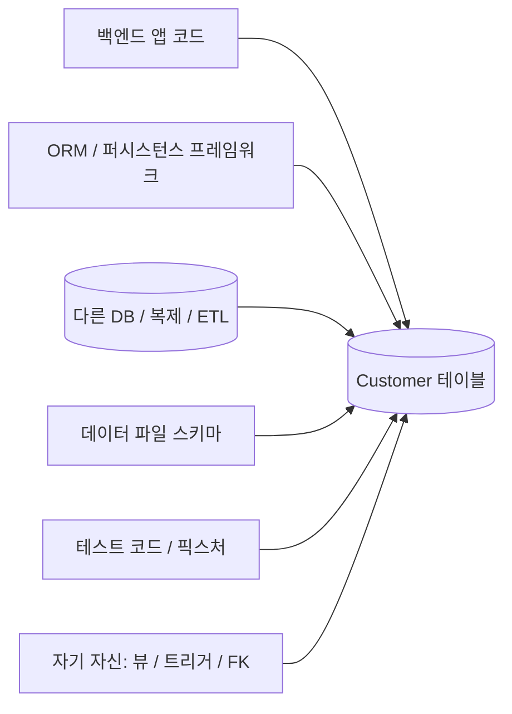
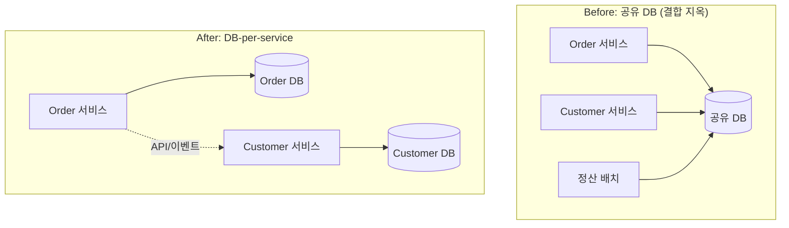

## 이게 왜 중요하냐면

컬럼 하나 이름을 바꾸려는데 손이 안 나간다. `Customer.FName`을 `FirstName`으로 고치고 싶을 뿐이다. 그런데 `git grep FName`을 때리는 순간 영혼이 빠져나간다. 백엔드 코드 47군데, 리포팅 쿼리 12개, 야간 배치 잡 3개, 옆 팀이 만든 정산 시스템 어딘가, 그리고 5년 전 누가 짠 엑셀 매크로까지. 컬럼 하나가 온 회사에 못처럼 박혀 있는 거다.

이게 **결합(coupling)**이다. DB 스키마에 직접 꽂혀 있는 게 많을수록, 그 스키마는 못 바꾼다. 리팩토링이 어려운 게 아니라 **물리적으로 손을 댈 수가 없다.** 그래서 다들 "건드리면 죽으니까 그냥 두자"가 되고, 그 두려움이 쌓여서 레거시가 된다.

<Callout type="warning" title="한 줄 요약">
DB는 스키마 자체가 어려워서 못 바꾸는 게 아니다. 스키마에 **직접 매달려 있는 것들**이 많아서 못 바꾸는 거다. 결합을 줄이는 가장 효과적인 방법은 DB 접근을 한 겹으로 캡슐화해서, 직접 꽂힌 못의 개수를 줄이는 것이다.
</Callout>

비유를 하나 들자. 벽에 콘센트 하나 옮기는 작업을 생각해 보자. 그 콘센트에 멀티탭 하나만 꽂혀 있으면, 멀티탭 뽑고 옮기고 다시 꽂으면 끝이다. 근데 그 콘센트에 냉장고, 에어컨, 컴퓨터, 전자레인지가 **직접** 다 꽂혀 있으면? 콘센트를 옮기는 순간 온 집안 가전이 꺼진다. 멀티탭이 바로 **캡슐화 계층**이다. 못을 한 군데로 모아주는 물건.

## 누가 DB에 매달려 있나

리팩토링이 어려운 이유를 알려면, 먼저 DB가 **무엇에 결합되는지** 알아야 한다. 책에서 한 줄로 짚는 걸 현장 풍경으로 펼치면 이렇다. 다중 애플리케이션 환경에서 데이터베이스 하나에 매달릴 수 있는 것들:



여섯 갈래다. 하나씩 보면 다 익숙할 거다.

- **앱 소스 코드** — 여기저기 박힌 `SELECT FName, LName FROM Customer`. 가장 흔하고 가장 많다.
- **ORM / 퍼시스턴스 프레임워크** — 엔티티 매핑(`@Column("FName")`)이 컬럼명에 직접 묶여 있다.
- **다른 데이터베이스** — 복제 슬레이브, 데이터 웨어하우스로 빼는 ETL 잡, CDC 파이프라인. 컬럼 이름이 바뀌면 적재가 깨진다.
- **데이터 파일 스키마** — CSV 익스포트, 고정폭 파일, 외부 연동 포맷. 컬럼 순서·이름에 기대고 있다.
- **테스트 코드** — 픽스처와 셋업 스크립트가 스키마를 그대로 박아놨다.
- **자기 자신** — 뷰, 저장 프로시저, 트리거, FK 제약. DB 안에서도 자기 컬럼에 결합된다.

핵심 통찰은 이거다. **결합을 0으로 만들 수는 없다.** 누군가는 데이터를 읽어야 하니까. 하지만 직접 꽂힌 갈래의 개수를 줄이고, 가능하면 한 갈래로 모을 수는 있다. 그게 "관리 가능한 수준으로 낮춘다"는 말의 정체다.

<Callout type="error" title="뭐가 문제냐면">
- **변경 비용이 결합 개수에 비례한다**: 컬럼 하나 고치는 데 47군데를 동시에 고쳐야 하면, 그건 한 번의 커밋이 아니라 한 번의 프로젝트다.
- **두려움이 누적된다**: "못 바꾼다"가 "안 바꾼다"가 되고, 안 바꾼 채 기능만 얹다 보면 스키마가 화석이 된다. 책이 말하는 6가지 냄새(다목적 컬럼, 중복 데이터, 똑똑한 컬럼 등)는 대부분 "두려워서 못 고친" 흔적이다.
- **변경이 빌드 타임에 안 걸린다**: 리포팅 쿼리나 배치 잡은 앱 빌드에 포함 안 되니까, 컬럼을 바꿔도 컴파일은 통과한다. 그러고 새벽 3시 배치가 터진다.
</Callout>

## 캡슐화: 못을 한 군데로 모은다

해법은 단순하다. **외부 프로그램이 DB에 직접 닿지 못하게, 접근을 한 겹으로 감싼다.** 책은 구현 수단으로 DAO, 퍼시스턴스 프레임워크, 저장 프로시저, 웹 서비스를 든다. 2006년의 어휘지만 본질은 지금도 똑같다. 오늘날의 이름표를 붙이면 이렇게 된다.

<Tabs defaultValue="dao">
  <TabsList>
    <TabsTrigger value="dao">DAO / 리포지토리</TabsTrigger>
    <TabsTrigger value="sp">저장 프로시저</TabsTrigger>
    <TabsTrigger value="api">서비스 API / 이벤트</TabsTrigger>
  </TabsList>

  <TabsContent value="dao">

**DAO(Data Access Object) / 리포지토리 패턴.** 가장 흐름 좋은 선택지다. 비즈니스 클래스마다 데이터 접근 로직을 별도 객체로 분리한다. `CustomerDAO`, `AccountDAO`처럼. 비즈니스 코드는 `customerDAO.findById(id)`만 부르고, 그 안에서 `Customer` 테이블의 실제 컬럼명을 아는 건 DAO 하나뿐이다.

```typescript
// 비즈니스 코드는 컬럼명을 모른다. DAO만 안다.
interface CustomerRepository {
  findById(id: string): Promise<Customer>;
  findByPolicyNumber(policyNo: string): Promise<Customer | null>;
  save(customer: Customer): Promise<void>;
  delete(id: string): Promise<void>;
}
```

`FName -> FirstName` 리팩토링이 들어와도, 고칠 곳은 `CustomerRepository` 구현체 **한 군데**다. 호출하는 100군데는 손도 안 댄다. 멀티탭에 가전을 다 꽂아둔 덕이다.

  </TabsContent>

  <TabsContent value="sp">

**저장 프로시저(Stored Procedure).** DB 안쪽으로 캡슐화하는 방법이다. 앱은 `sp_GetCustomerBalance(@id)`만 부르고, 그 프로시저 안에서 어떤 테이블의 어떤 컬럼을 읽는지는 DB가 숨긴다. 컬럼 구조가 바뀌어도 프로시저 시그니처만 유지하면 앱은 모른다.

```sql
-- 앱은 이 시그니처만 안다. 내부 테이블 구조는 캡슐화됨.
CREATE PROCEDURE GetCustomerBalance
  @CustomerId INT
AS
BEGIN
  SELECT a.AccountId, a.Balance
  FROM Account a
  WHERE a.CustomerId = @CustomerId;
END;
```

장점은 DB를 여러 이기종 클라이언트가 공유할 때(앱 + 리포팅 + 외부 연동) 한 군데에서 통제된다는 것. 단점도 분명하다. 비즈니스 로직이 DB로 새어들어가면 버전 관리·테스트·이식성이 나빠진다. SI 현장처럼 클라이언트가 잡다하면 유효한 선택이지만, 단일 앱 환경에선 보통 DAO/리포지토리가 더 깔끔하다.

  </TabsContent>

  <TabsContent value="api">

**서비스 API / 이벤트.** 마이크로서비스 시대의 캡슐화다. DB는 그 DB를 소유한 서비스 하나만 직접 접근하고, 다른 서비스는 **DB가 아니라 API나 이벤트로** 데이터를 받는다. 옆 팀이 `Customer` 테이블에 직접 `SELECT`를 박는 게 아니라, `GET /customers/{id}`를 호출하거나 `CustomerUpdated` 이벤트를 구독한다.

```text
[Order 서비스]  --(API 호출)-->  [Customer 서비스]  --(직접 접근)-->  (Customer DB)
                <--(이벤트 구독)--
```

이렇게 하면 `Customer` DB 스키마를 바꿔도 영향 범위가 Customer 서비스 안으로 갇힌다. 계약(API/이벤트 스키마)만 유지하면 외부는 모른다. 이게 다음 절에서 말할 "공유 DB 탈출"의 핵심 메커니즘이다.

  </TabsContent>
</Tabs>

<Callout type="info" title="거창하게 안 가도 된다">
캡슐화라고 하면 풀 ORM 도입이나 마이크로서비스 분해를 떠올리는데, 그렇게까지 안 가도 된다. 책의 5.9가 말하는 **최소 기준은 "하드코딩 SQL이라도 한 곳에 모으기"**다. 흩어진 `SELECT`를 Mapper/DAO 한 군데로 긁어모으는 것만으로도, 나중에 컬럼을 찾아 고치는 비용이 극적으로 준다. SI·소규모 팀이라면 여기서 시작하는 게 현실적이다. ORM 안 써도 `find/save/delete/retrieve`를 클래스마다 일관되게 두는 것만으로 절반은 한 거다.
</Callout>

## SQL 중복이 곧 결합이다

캡슐화의 적은 **SQL 중복**이다. 책의 5.11이 짚는 핵심인데, 이유가 재밌다. SQL은 너무 쓰기 쉽다. 그래서 필요할 때마다 그냥 거기서 한 줄 짜버린다. 컨트롤러에서 한 번, 서비스에서 한 번, 배치에서 한 번, 리포팅 뷰에서 한 번, 트리거에서 또 한 번. 같은 "고객의 미납 잔액 구하기"가 다섯 군데에 미묘하게 다른 모양으로 복붙돼 있다.

문제는 **SQL이 많을수록 그 컬럼에 결합된 코드가 많아진다**는 거다. 중복은 단순히 DRY 위반이 아니라, 리팩토링 대상에 매달린 못의 개수를 늘리는 행위다. 잔액 계산 로직 하나가 5군데면, `Balance` 컬럼을 바꾸려면 5군데를 동시에 찾아 고쳐야 하고, 그중 하나라도 빠뜨리면 정합성이 깨진다.

```sql
-- 같은 "미납 잔액" 로직이 여기저기 미묘하게 다르게 복붙됨

-- 컨트롤러 A
SELECT SUM(Balance) FROM Account WHERE CustomerId = ? AND Status = 'OVERDUE';

-- 배치 잡 B (Status 조건을 깜빡함 — 이미 미세하게 다름)
SELECT SUM(Balance) FROM Account WHERE CustomerId = ?;

-- 리포팅 뷰 C (컬럼명만 살짝 다른 옛날 버전)
SELECT SUM(Bal) FROM Acct WHERE CustId = ? AND Stat = 'OVERDUE';
```

이걸 한 곳으로 모은다. 리포지토리 메서드 하나, 또는 뷰 하나, 또는 도메인 서비스 하나로. **"이 데이터를 어떻게 구하는가"의 정의는 단 한 군데에만 있어야 한다.**

```typescript
// 미납 잔액의 정의는 여기 한 군데뿐. 나머지는 다 이걸 부른다.
class AccountRepository {
  async getOverdueBalance(customerId: string): Promise<number> {
    const rows = await this.db.query(
      "SELECT SUM(Balance) AS total FROM Account WHERE CustomerId = ? AND Status = 'OVERDUE'",
      [customerId],
    );
    return rows[0]?.total ?? 0;
  }
}
```

<Callout type="note" title="중복을 줄이는 현대적 수단들">
- **쿼리를 한 군데로**: 리포지토리/매퍼(MyBatis, jOOQ), 또는 ORM의 쿼리 정의. 같은 쿼리를 두 번 짜고 있으면 신호다.
- **메타데이터에서 생성**: ORM이 매핑 메타데이터로 SQL을 생성하면 손으로 쓴 SQL 자체가 사라진다. 책이 "더 좋게는"이라고 한 그 방향이다.
- **뷰로 캡슐화**: DB 안에서 반복되는 조인/계산은 뷰 하나로 묶어, 쿼리들이 뷰만 보게 한다(단, 뷰가 또 중복되지 않게).
</Callout>

## 진짜 지옥: 공유 데이터베이스

여기까지가 단일 앱 안의 결합이라면, 진짜 손 못 대게 만드는 건 **여러 시스템이 DB 하나를 공유하는 상황**이다. SI 현장에서 제일 자주 만나는 풍경이기도 하다. 운영 중인 레거시 DB 하나에 우리 앱, 협력사 정산 시스템, 야간 배치, 리포팅 도구, 사장님 엑셀이 **다 직접** 꽂혀 있다.

이게 마이크로서비스 세계에서 말하는 **공유 DB 안티패턴(Shared Database)**이다. 서비스를 아무리 잘게 쪼개도, 다 같은 테이블에 직접 `SELECT/UPDATE`를 박으면 결합은 그대로다. 서비스 경계는 코드에만 있고 데이터엔 없는 셈이라, 컬럼 하나 바꾸려면 모든 서비스 팀과 협상해야 한다. 책 5.6이 말하는 "전환 기간을 시스템 소유자들과 협상한다"가 바로 이 고통의 다른 이름이다 — 저자조차 "실제로 제대로 시도된 걸 본 적 없다"고 솔직히 적을 만큼 느리고 고된 길이다.

탈출 방향은 **DB-per-service**. 각 서비스가 자기 데이터를 소유하고, 남의 데이터는 직접 안 읽는다.



그럼 "남의 데이터가 필요한데 직접 못 읽으면 어떻게 하냐"가 문제인데, 여기서 현대적 도구들이 들어온다.

<Steps>
  <Step title="동기 조회는 API로">
    당장 최신 값이 필요하면 소유 서비스의 API를 부른다. `Order` 서비스가 고객 이름이 필요하면 `Customer` 서비스에 물어본다. 느슨하지만 계약(스키마)만 지키면 내부 컬럼은 자유롭게 바꿀 수 있다.
  </Step>
  <Step title="비동기 전파는 이벤트로">
    매번 물어보기 부담되면, 소유 서비스가 변경을 이벤트로 흘린다(`CustomerUpdated`). 구독자가 자기 쪽에 필요한 만큼만 사본(read model)을 둔다. 결합을 시간축으로 떼어내는 방식이다.
  </Step>
  <Step title="DB 변경을 새는 outbox/CDC로">
    이벤트를 안정적으로 내보내려면, DB 트랜잭션과 이벤트 발행을 한 트랜잭션에 묶는 **outbox 패턴**, 또는 **CDC(Debezium)**로 DB 변경 로그를 그대로 이벤트 스트림으로 뽑는다. 외부 시스템이 테이블을 직접 폴링하던 결합이, 이벤트 구독이라는 한 겹으로 캡슐화된다.
  </Step>
</Steps>

<Callout type="info" title="여기까지 다 안 가도 된다 (다시)">
DB-per-service, CDC, 이벤트 소싱은 다중 애플리케이션·다팀 환경의 무기다. **단일 앱이 DB를 혼자 쓰는 상황이면 이 절의 절반은 오버킬이다.** 그 경우엔 스키마와 코드를 같은 릴리스에서 동시에 바꾸면 되고(전환 기간도 동기화 트리거도 필요 없다), 캡슐화는 "SQL을 DAO/리포지토리 한 곳에 모으기" 수준에서 끝내도 충분하다. 결합이 진짜 위험해지는 건 "운영 DB를 여러 협력사·배치·리포팅이 공유"할 때뿐이다. 자기 상황을 먼저 보고 약을 골라라.
</Callout>

## 캡슐화가 리팩토링을 살리는 자리

이 모든 게 왜 리팩토링 얘기냐면 — 캡슐화 계층이 있으면 **expand-contract(parallel change)**가 깔끔하게 돌아가기 때문이다. 컬럼명을 바꾸는 시나리오로 보자. `Customer.FName -> FirstName`.

<Steps>
  <Step title="Expand: 새 컬럼 추가">
    `FirstName` 컬럼을 추가하고, 전환 기간 동안 두 컬럼을 동기화한다(트리거 또는 앱 더블라이트). 마이그레이션 도구(Flyway/Liquibase/Alembic)로 버전 관리되는 변경 스크립트로 적용한다.
  </Step>
  <Step title="Migrate: 읽는 쪽을 한 곳에서 전환">
    여기가 캡슐화의 보상이다. 읽기를 `FName`에서 `FirstName`으로 바꾸는 작업이, SQL이 흩어져 있으면 47군데지만 **리포지토리 한 곳에 모여 있으면 한 줄**이다. 못이 멀티탭에 모여 있으니 멀티탭만 옮기면 된다.
  </Step>
  <Step title="Contract: 옛 컬럼 제거">
    모든 클라이언트가 새 컬럼만 쓰는 게 확인되면 동기화를 끄고 `FName`을 떨군다. 공유 DB라면 이 "확인"이 협상이지만, API/이벤트로 캡슐화돼 있으면 계약만 지킨 채 내부에서 조용히 처리된다.
  </Step>
</Steps>

즉 캡슐화는 그 자체가 목적이 아니라, **리팩토링의 2단계(읽는 쪽 전환)를 한 점으로 압축하는 장치**다. 결합이 흩어져 있으면 expand-contract의 중간 단계가 거대한 일괄 수정이 되고, 모여 있으면 작은 커밋이 된다. 같은 리팩토링인데 비용이 자릿수로 달라진다.

## 정리

DB가 못 바뀌는 건 스키마가 어려워서가 아니다. 스키마에 직접 매달린 게 많아서다.

> **결합을 줄인다 = DB에 직접 꽂힌 못의 개수를 줄인다. 캡슐화는 그 못들을 한 군데(멀티탭)로 모으는 일이다.**

방향은 상황에 맞춰 고른다. 단일 앱이면 "SQL을 DAO/리포지토리 한 곳에 모으기"만으로 충분하고, 그것만 해도 향후 리팩토링 비용이 크게 준다. 여러 시스템이 DB를 공유하는 다중 애플리케이션 환경이면 저장 프로시저로 한 군데서 통제하거나, 더 멀리는 DB-per-service로 데이터를 서비스가 소유하게 하고 API·이벤트(outbox/CDC)로 외부 결합을 한 겹으로 캡슐화한다. 그리고 어느 경우든 SQL 중복은 잡아라 — 중복은 곧 못의 개수다.

캡슐화를 해두면 컬럼 하나 바꾸는 일이 47군데를 동시에 수술하는 프로젝트가 아니라, 한 곳을 고치는 작은 커밋이 된다. 리팩토링이 쉬워진다는 건 결국 그런 의미다. 손댈 수 있게 만들어 두는 것.
