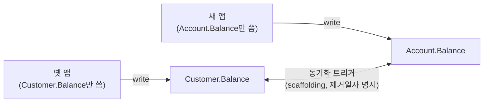
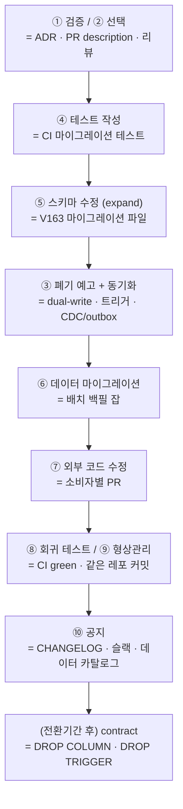

import { Callout, Steps, Step, Tabs, TabsList, TabsTrigger, TabsContent, Icon } from '@/components/writing-ui';

## 이런 적 있을 거임

개발자 Eddy가 새 거래 유형을 하나 붙이고 있었다. 적금 이자 계산인지 뭔지, 아무튼 "잔액"을 건드려야 하는 일이었다. 그래서 코드를 따라 내려가다가 `Customer.Balance`를 발견한다. 그리고 잠깐 멈춘다.

"...잔액이 왜 고객한테 붙어 있지?"

은행 도메인을 조금이라도 아는 사람이라면 등이 서늘해지는 순간이다. 한 명의 고객은 입출금 계좌, 적금 계좌, 마이너스 통장을 따로따로 가질 수 있다. 잔액은 **계좌(Account)마다** 다르다. 고객(Customer)한테 잔액이 하나 박혀 있다는 건, 이 스키마가 처음부터 "고객 = 계좌 1개"라고 착각하고 태어났다는 뜻이다. Eddy가 발견한 건 버그가 아니라 **설계의 흉터**다.

여기서 신입 Eddy라면 이렇게 할 거다. `Account` 테이블에 `Balance` 컬럼을 새로 하나 추가하고(`Introduce Column`), 자기 기능에서는 그걸 쓰고, `Customer.Balance`는 그냥 둔다. 동작은 한다. 그리고 6개월 뒤 누군가 "왜 잔액이 두 군데서 따로 노냐"고 슬랙에 글을 올린다.

다행히 Eddy는 페어 프로그래밍과 공동 모델링을 믿는 사람이라, 혼자 지르는 대신 DBA Beverley를 부른다. 그리고 둘이 같이 내린 결론은 컬럼을 **추가**하는 게 아니라 **이동(Move Column)**하는 거였다. `Customer.Balance`를 `Account.Balance`로 옮긴다. 문제는 옳게 봤는데 해법을 잘못 짚었던 Eddy를, Beverley의 스키마 지식이 바로잡은 셈이다.

<Callout type="info" title="핵심 요약">
하나의 데이터베이스 리팩토링은 "ALTER TABLE 한 줄"이 아니다. **검증 → 선택 → 폐기 예고 → 테스트 → 스키마 수정 → 데이터 마이그레이션 → 외부 코드 수정 → 회귀 테스트 → 버전 관리 → 공지**까지 10개의 활동이 한 세트다. 이 글은 `Move Column` 하나를 그 10단계로 끝까지 따라가며, 각 단계가 오늘날 PR/마이그레이션 파일/CI에서 어떻게 생겼는지 매핑한다.
</Callout>

이 글에서 한 가지만 가져가라. **리팩토링의 고된 작업은 운영이 아니라 개발 샌드박스 안에서 일어난다.** 샌드박스에서 검토하고 구현하고 테스트해서 다 익은 다음에야 다른 환경으로 승격한다. 운영에서 손코딩으로 `ALTER`를 치는 그림은 이 책에 없다. 자, 풀코스를 시작하자.

## 풀코스 10단계

Eddy와 Beverley가 반복적으로 수행하는 활동을 순서대로 펼친다. 단계마다 "2006년 책은 이렇게 했고, 2026년 우리는 이렇게 한다"를 같이 본다.

<Steps>

<Step title="① 이 리팩토링이 적절한지 검증한다">

제일 먼저 할 일은 코드를 짜는 게 아니라 **멈추고 따지는** 거다. Beverley가 세 가지를 묻는다.

1. **이게 말이 되는 변경인가?** 기존 구조가 사실 맞을 수도 있다. 개발자가 설계를 오해해서 멀쩡한 걸 고치려는 경우는 생각보다 흔하다. DBA는 팀 DB, 전사 DB, 누가 어디에 결합돼 있는지를 알기 때문에 더 넓은 그림에서 판단할 수 있다.
2. **지금 정말 필요한가?** 이건 반쯤 직감이다. Eddy가 업무 요구사항으로 이걸 설명할 수 있나? 과거에 좋은 제안을 했나, 아니면 사흘 뒤 마음 바꿔서 롤백하게 만든 전적이 있나?
3. **그만한 값어치가 있나?** 영향(impact) 평가다. 이 컬럼에 외부 프로그램이 어떻게 결합돼 있는지 알아야 한다. **이 컬럼 하나 옮기는 데 50개 애플리케이션을 다 갱신·테스트·재배포해야 한다면**, 아무리 옳은 변경이라도 실행 불가능일 수 있다.

이번 케이스는 설계 문제가 명백히 심각하고(잔액이 계좌가 아니라 고객에 붙어 있다), 영향받는 앱이 많아도 진행할 가치가 있다고 둘은 판단한다.

<Callout type="note" title="데이터가 우리 DB가 아닐 수도 있다">
좋은 DBA는 우리 DB가 그 데이터의 **유일한 출처가 아닐 수 있다**는 걸 안다. 만약 다른 시스템이 계좌 정보의 공식 저장소(system of record)라면, 진짜 답은 컬럼 이동이 아니라 "공식 데이터 출처를 쓰도록(Use Official Data Source)" 바꾸는 거다. 마이크로서비스 세상에선 이게 더 흔하다. "잔액"이 사실 별도 계좌 서비스의 소유물인데 우리가 복제본을 들고 있던 거라면, 옮길 게 아니라 **소유권을 인정하고 호출**하는 게 맞다.
</Callout>

**오늘날엔:** 이 단계가 곧 **설계 RFC / ADR(아키텍처 결정 기록) / PR description**이다. 마이그레이션 파일을 커밋하기 전에 "왜 옮기는가, 누가 영향받는가"를 글로 적고 리뷰받는 행위. 소규모 팀에 전담 DBA가 없다면, "스키마 바꾸기 전 한 명이라도 더 본다"는 코드 리뷰 한 단계가 Beverley의 역할을 대신한다.

</Step>

<Step title="② 가장 적절한 리팩토링을 고른다">

문제를 옳게 봤다고 해법까지 옳은 건 아니다. Eddy의 처방은 `Introduce Column`(새 컬럼 추가)이었지만, 그 컬럼은 이미 잘못된 위치에 존재하고 있었다. 그래서 진짜 답은 `Move Column`이다.

<Callout type="warning" title="작은 단계로 (Take Small Steps)">
컬럼을 옮기면서 이름도 바꾸고(`Balance` → `AvailableBalance`) 형식도 통일하고 싶을 수 있다. **한꺼번에 하지 마라.** `Move Column` → `Rename Column` → `Introduce Common Format`을 **하나씩 따로** 성공시킨다. 이렇게 하면 뭔가 깨졌을 때 버그가 "방금 바꾼 그 하나" 안에 있을 확률이 높아서 찾기가 쉽다. 세 개를 한 마이그레이션에 욱여넣으면, 깨졌을 때 셋 중 누구 잘못인지 한참 헤맨다.
</Callout>

**오늘날엔:** Flyway/Liquibase/Alembic/Rails 마이그레이션에서 이건 곧 "**마이그레이션 파일을 작게 쪼개라**"는 규율이다. `V163__move_balance_to_account.sql` 하나, `V164__rename_balance.sql` 하나. 한 파일에 ALTER를 다섯 줄 쌓는 게 아니라, 되돌릴 단위로 쪼갠다.

</Step>

<Step title="③ 원본 스키마 폐기를 예고한다 (선택)">

여기가 이 리팩토링의 심장이다. 여러 애플리케이션이 `Customer.Balance`를 읽고 쓰고 있다면, **전부를 같은 날 동시에 바꿔서 배포할 수는 없다**고 가정해야 한다. 협력사 배치 잡이 있고, 리포팅 도구가 있고, 담당자가 퇴사한 레거시 앱이 있다.

그래서 **전환 기간(transition period, = 폐기/deprecation 기간)**을 둔다. 이 기간 동안 옛 스키마와 새 스키마를 **동시에** 지원해서, 다른 팀들이 자기 시스템을 천천히 고칠 시간을 준다. 길면 몇 분기에서 몇 년이다.

전환 기간 동안의 두 가지 가정:
- 어떤 앱은 아직 `Customer.Balance`만 쓰고, 어떤 앱은 새 `Account.Balance`만 쓴다.
- 한 앱은 둘 중 **하나만** 쓰면 된다. 어느 쪽을 쓰든 모두 정상 동작해야 한다.

이걸 가능하게 하는 게 **스캐폴딩 코드(scaffolding code)**, 즉 **동기화 트리거**다. 새 코드가 `Account.Balance`를 갱신하면 트리거가 `Customer.Balance`도 맞춰주고, 옛 코드가 `Customer.Balance`를 갱신하면 트리거가 `Account.Balance`도 맞춰준다. 두 컬럼을 풀로 붙여놓는(glued together) 거다. 트리거에는 `Customer.Balance` 컬럼과 **같은 제거 날짜**를 적어둔다.



<Callout type="error" title="주의: 모든 리팩토링이 전환 기간을 요하는 건 아니다">
`Introduce Column Constraint`나 `Apply Standard Codes`처럼 단지 허용 값을 **좁히는** 변경은 전환 기간이 없다. 다만 좁아진 값이 기존 앱을 깰 수 있으니 그건 그것대로 조심. 전환 기간이 필요한 건 `Move Column`처럼 **옛/새 구조가 공존해야 하는** 구조적 리팩토링이다.
</Callout>

**오늘날엔:** 이 전환 기간이 바로 그 유명한 **expand-contract(parallel change) 패턴**이다.

<Steps>
<Step title="Expand (확장)">새 구조를 추가한다. `Account.Balance` 컬럼을 더하되 옛 `Customer.Balance`는 그대로 둔다. 양쪽 다 존재.</Step>
<Step title="Migrate (이행)">읽기/쓰기를 점진적으로 새 컬럼으로 옮긴다. 트리거나 애플리케이션의 이중 쓰기(dual-write)로 둘을 동기화하며, 모든 소비자가 새 컬럼으로 넘어올 때까지 기다린다.</Step>
<Step title="Contract (수축)">아무도 옛 컬럼을 안 쓰는 게 확인되면 `Customer.Balance`와 트리거를 제거한다. 이게 ⑤단계 "전환 기간 종료 후 DDL"이다.</Step>
</Steps>

2006년의 책은 트리거로 동기화했지만, 오늘날 마이크로서비스 환경에선 트리거 대신 **CDC(Debezium)**나 **outbox 패턴**으로 이중 쓰기를 구현하는 경우가 많다. 공유 DB에 트리거를 박는 것 자체가 또 다른 결합이라, 서비스 경계가 분명하면 이벤트로 동기화하는 게 더 깔끔할 때가 있다. 어느 쪽이든 본질은 같다. **두 진실을 한동안 나란히 살려두고, 천천히 한쪽으로 수렴시킨다.**

</Step>

<Step title="④ 전·중·후로 테스트한다">

TDD다. 테스트를 먼저 쓰고, 그걸 통과시킬 만큼의 코드(주로 DDL)를 쓰고, 리팩토링이 완성될 때까지 반복한다. `Move Column`에 필요한 테스트는 대충 이런 종류다.

- **스키마 테스트**: 동기화 트리거가 진짜로 양방향 동기화를 하나? 참조 무결성(연쇄 삭제, 존재 규칙)은 지켜지나? 기본값이 실제로 할당되나? `CHECK` 제약(예: 잔액은 음수 불가)이 작동하나?
- **데이터 마이그레이션 검증**: `Customer.Balance` → `Account.Balance` 복사가 **고객별로** 올바른가? 계좌가 여러 개인 고객은 어떻게 처리했나? (이게 사실 가장 까다로운 부분이다 — 1:1 가정으로 만든 컬럼을 1:N으로 푸는 거니까.)
- **외부 접근 코드 테스트**: 최종 스키마를 적용해보고 **뭐가 깨지는지** 본다. 풀 회귀 스위트가 있어야 안심하고 리팩토링할 수 있다. 없을 확률이 높지만, 지금이 그 스위트를 만들기 시작할 최적의 타이밍이다.

**오늘날엔:** 이게 곧 **CI 파이프라인**이다. 마이그레이션 PR을 올리면 CI가 깨끗한 DB에 마이그레이션을 적용하고(`flyway migrate` / `alembic upgrade head`), 시드 데이터를 넣고, 트리거/제약 테스트와 앱 통합 테스트를 돌린다. 마이그레이션 롤백(`down`)까지 적용했다 되돌려보는 것도 여기서 한다. Beverley가 손으로 하던 "조금 테스트, 조금 변경"을 PR마다 자동으로 돌리는 거다.

</Step>

<Step title="⑤ 데이터베이스 스키마를 수정한다">

이제야 DDL을 쓴다. 개발 샌드박스에서 `Account.Balance` 컬럼과 두 개의 동기화 트리거를 추가하고, 제거 날짜를 `COMMENT`로 박는다.

```sql
-- 163: Account에 Balance 추가
ALTER TABLE Account ADD Balance NUMERIC;
COMMENT ON COLUMN Customer.Balance IS 'deprecated, remove on 2026-12-14';

-- 동기화 트리거 (양방향 scaffolding) — 개념도
CREATE OR REPLACE TRIGGER SyncCustomerToAccount /* ... */;
CREATE OR REPLACE TRIGGER SyncAccountToCustomer /* ... */;
```

여기서 책의 황금률: **작은 스크립트로 작업하고 고유 번호를 부여한다.** 1부터 시작해 리팩토링마다 카운터를 올린다. 왜 이렇게까지 하냐면:

- **단순성**: 작고 집중된 변경이 유지보수하기 쉽다. 특정 리팩토링을 취소해야 하면 그 번호만 빼면 된다.
- **정확성**: 정해진 순서로 적용해 스키마를 정확히 의도한 모양으로 진화시킨다. 리팩토링은 서로 위에 쌓인다 — 컬럼 이름을 바꾼 뒤 몇 주 후 이동하면, 두 번째가 첫 번째에 의존한다. 순서가 곧 정확성이다.
- **버전 관리**: DB 인스턴스마다 버전이 다르다(개발 163, 통합 161, QA 155, 운영 134). 통합을 163으로 올리려면 162, 163만 적용하면 된다. 현재 버전 추적을 위해 `DatabaseConfiguration` 같은 공통 테이블을 둔다.

전환 기간이 끝난 뒤 실행할 DDL은 **같은 식별자로 따로** 캡처해둔다.

```sql
-- (전환 기간 종료 후, contract 단계)
ALTER TABLE Customer DROP COLUMN Balance;
DROP TRIGGER SyncCustomerToAccount;
DROP TRIGGER SyncAccountToCustomer;
```

<Callout type="success" title="이 패턴, 어디서 많이 봤다 싶으면">
"번호 매긴 작은 스크립트 + 버전 추적 테이블" — 이게 바로 **Flyway와 Liquibase**가 구현하는 것 그 자체다. `V163__...sql` 파일명의 `163`이 책의 고유 번호고, `flyway_schema_history` 테이블이 책의 `DatabaseConfiguration`이다. Alembic의 리비전 체인, Rails/Django 마이그레이션의 타임스탬프 버전도 똑같은 발상이다. **2006년에 손코딩하던 규율을 도구가 강제해주는 시대**라는 게 핵심 변화다. 손으로 카운터 올리지 말고 도구 써라.
</Callout>

`Move Column`에서 특히 조심할 건, 이 ALTER가 **운영에서 테이블을 잠그면 안 된다**는 점이다. 큰 테이블에 컬럼을 더하거나 인덱스를 만드는 작업은 락 때문에 장애가 된다. 그래서 온라인 스키마 변경 도구를 쓴다.

<Tabs defaultValue="pg">
<TabsList>
<TabsTrigger value="pg">PostgreSQL</TabsTrigger>
<TabsTrigger value="mysql">MySQL</TabsTrigger>
</TabsList>
<TabsContent value="pg">

```sql
-- 인덱스는 테이블 락 없이
CREATE INDEX CONCURRENTLY idx_account_balance ON Account (Balance);

-- 제약은 두 단계로: 먼저 NOT VALID(즉시·논블로킹), 나중에 VALIDATE
ALTER TABLE Account ADD CONSTRAINT chk_balance CHECK (Balance >= 0) NOT VALID;
ALTER TABLE Account VALIDATE CONSTRAINT chk_balance;  -- 풀 테이블 락 없이 검증
```

</TabsContent>
<TabsContent value="mysql">

```text
# gh-ost로 무중단 스키마 변경 (그림자 테이블 + 바이너리 로그)
gh-ost \
  --table=Account \
  --alter="ADD COLUMN Balance DECIMAL(18,2)" \
  --execute

# 또는 pt-online-schema-change (pt-osc)
```

</TabsContent>
</Tabs>

</Step>

<Step title="⑥ 원본 데이터를 마이그레이션한다 (선택)">

스키마만 바꾸고 끝이 아니다. 기존 `Customer.Balance` 값을 새 `Account.Balance`로 **옮겨야** 한다. 같은 식별 번호의 별도 스크립트(DML)로 만든다.

```sql
-- 163 (data): 기존 잔액을 계좌로 복사
UPDATE Account
SET Balance = (
  SELECT Balance FROM Customer
  WHERE Customer.CustomerID = Account.CustomerID
);
```

여기서 데이터 품질 문제가 같이 튀어나오는 경우가 흔하다. 레거시 설계에서 컬럼을 옮기다 보면 "어, 이 고객은 계좌가 셋인데 잔액이 하나밖에 없네?", "이 값은 NULL인데 의미가 뭐지?" 같은 게 나온다. 구조적 리팩토링 중에 데이터 품질 리팩토링(`Introduce Common Format`, `Apply Standard Type` 등)이 필요해지는 거다. 그래도 한 번에 다 하지 말고 작은 단계로(②의 규칙) 쪼개는 게 정석이다.

**오늘날엔:** 이 DML이 마이그레이션 파일의 일부이거나, 데이터 양이 크면 **백필(backfill) 잡**으로 분리한다. 수백만 행을 한 트랜잭션에서 `UPDATE`하면 락과 WAL 폭증으로 터지니까, 배치로 끊어서(예: 1만 행씩) 돌린다. 스키마 마이그레이션(빠름·즉시)과 데이터 백필(느림·점진)을 **분리**하는 게 현대의 기본기다.

</Step>

<Step title="⑦ 외부 접근 프로그램을 수정한다">

스키마가 바뀌면 그걸 건드리는 모든 외부 프로그램을 고쳐야 한다. 레거시 앱, ORM 매핑, 데이터 복제 코드, 리포팅 시스템... `Customer.Balance`를 읽던 `SELECT`를 `Account.Balance`로 바꾸는 일이다.

<Callout type="error" title="뭐가 진짜 어려운가">
기술적 난이도? 그건 보통 쉬운 쪽이다. **진짜 어려운 건 정치(politics)다.** 여러 프로그램이 이 컬럼에 결합돼 있으면, 그중 일부는 담당 팀이 갱신을 미루거나, 아예 담당 팀이 없다. 누군가는 갱신 책임과 비용을 져야 한다. 이상적으론 각 앱의 주인 팀이 책임지지만, 안 되면 결국 우리 팀이 떠안는다. **"공유 DB"가 안티패턴이라 불리는 이유가 바로 이거다** — 한 컬럼을 옮기는데 조직 전체의 협조를 구걸해야 한다.
</Callout>

돈도 인력도 없어서 외부 프로그램을 도저히 못 고치는 상황이라면 선택지는 둘뿐이다. (1) 전환 기간을 수십 년으로 늘려서 못 고치는 놈은 그대로 두고 나머지만 개선된 설계를 쓴다(단점: 스캐폴딩 트리거가 영원히 남아 성능 갉아먹고 DB가 지저분해진다). (2) 그냥 리팩토링을 안 한다.

<Callout type="note" title="문서가 필요하면, 리팩토링이 필요하다는 신호다">
어떤 컬럼이나 프로시저를 "이게 사실은 이런 의미고요, 예외가 있는데..." 하고 여러 문단으로 설명해야 한다면, 그건 그 부분을 더 이해하기 쉽게 리팩토링하라는 신호다. 단순한 이름 변경 하나가 문서 세 문단을 통째로 지운다. 설계가 깔끔할수록 문서가 덜 필요하다.
</Callout>

</Step>

<Step title="⑧ 회귀 테스트를 실행한다">

"조금 테스트, 조금 변경, 조금 테스트"를 리팩토링이 끝날 때까지 반복한다. 작은 변경이라는 게 여기서 빛을 발한다 — 테스트가 깨지면 **방금 바꾼 그 자리**에 문제가 있다는 걸 거의 확신할 수 있다. 한 번에 다섯 개를 바꿨으면 이 확신이 안 선다.

**오늘날엔:** ④에서 만든 CI가 이걸 매 푸시마다 돌린다. 사람이 "이제 테스트 돌릴 차례"라고 기억할 필요가 없다.

</Step>

<Step title="⑨ 작업을 형상 관리한다">

성공하면 **모든 산출물**을 버전 관리에 체크인한다. 소스 코드와 똑같이 다룬다 — 생성한 스크립트, 테스트 데이터와 생성 코드, 테스트 케이스, 문서, 모델 전부.

<Callout type="info" title="지속적 개발을 지향하라">
조직이 모든 앱을 꾸준히 진화시키고 정기 배포하면, DB를 쓰는 모든 앱이 규칙적으로 갱신되므로 **전환 기간을 짧게** 가져갈 수 있다. CI/CD가 잘 돌고 모든 소비자가 2주 스프린트마다 배포되는 팀이라면, 몇 년짜리 전환 기간이 며칠로 줄어든다. expand-contract의 "contract"를 빨리 당길 수 있는 조직적 토대가 바로 지속적 배포다.
</Callout>

**오늘날엔:** 이건 그냥 **마이그레이션 파일을 애플리케이션 소스와 같은 레포에 커밋하는 것**이다. SI/소규모 팀에서 반드시 지킬 핵심도 이거다 — 마이그레이션 스크립트가 앱 코드와 한 저장소에서, 한 PR로, 같은 버전 히스토리로 관리되는 것. 스키마와 코드가 따로 노는 순간 재앙이 시작된다.

</Step>

<Step title="⑩ 리팩토링을 공지한다">

데이터베이스는 **공유 자원**이다. 그래서 마지막은 "알리기"다. 초기엔 팀 내 스탠드업에서 한마디 하는 걸로 충분하다. 하지만 사전 운영 테스트 환경으로 승격할 때쯤이면 다른 팀에도 알려야 한다 — 메일링 리스트, 정기 상태 보고 항목, 또는 운영 DBA 그룹 공식 보고로.

핵심 산출물은 **데이터베이스 릴리스 노트(release notes)**다. 변경 리팩토링을 순서대로 나열한다.

```text
163: Move the Customer.Balance column into the Account table
164: Rename Account.Balance to Account.AvailableBalance
```

그리고 PDM(물리 데이터 모델)을 갱신한다. PDM은 스키마를 기술하는 주 모델이자, 애플리케이션 프로젝트가 끝나도 살아남는 몇 안 되는 "보존(keeper)" 모델이다.

<Callout type="warning" title="데이터 모델을 성급히 발행하지 마라">
진화적 접근에선 설계가 시간에 따라 떠오르기 때문에 초기엔 스키마가 출렁인다. 새 부분이 **안정될 때까지 기다렸다가** PDM 갱신을 발행하면, 문서화 노력도 줄고 다른 팀이 미완성 설계에 맞춰 헛고생하는 것도 막는다.
</Callout>

**오늘날엔:** 릴리스 노트는 **PR description + CHANGELOG + 마이그레이션 파일명** 자체가 대신한다. `V163__move_balance_to_account.sql`이라는 파일명 하나가 곧 "163: Move the Customer.Balance column into the Account table"이다. 공지는 슬랙 채널 핀이나, 스키마 레지스트리/데이터 카탈로그 갱신으로 이어진다.

</Step>

</Steps>

## 책의 10단계를 PR 한 장으로

위 열 단계를 멀리서 보면, 사실 우리가 매주 하는 일과 똑같다. 단지 그게 "데이터베이스"라서 무서워 보였을 뿐이다. 책의 활동을 현대 워크플로로 한 번에 매핑하면 이렇다.



여기서 끝까지 잊지 말 게 두 가지다.

첫째, **전환 기간(③)이 모든 안전의 원천이다.** 옛/새 스키마가 한동안 공존하기 때문에, 스키마 변경과 그걸 쓰는 앱 변경을 **같은 날 다 같이 배포할 필요가 없다.** 이게 데이터베이스 리팩토링 배포가 전통적 "빅뱅 스키마 변경"보다 훨씬 안전한 이유다. 개별 리팩토링은 작고 단순해서 위험이 낮고, 회귀 스위트가 동작을 보장하고, 전환 기간이 배포를 분리해준다.

둘째, **단일 앱(SI·소규모 팀)이면 이 풀코스의 절반은 0으로 수렴한다.** 우리가 만든 앱 하나가 DB를 독점한다면, 옛/새 스키마를 몇 년씩 병렬로 끌 이유가 없다. 스키마와 코드를 **같은 릴리스에서 동시에** 바꾸면 끝이다. 전환 기간, 동기화 트리거, CCB(변경통제위원회) 같은 무거운 의식은 다 빼도 된다.

<Callout type="success" title="SI·소규모 팀이 실제로 지킬 핵심만">
1. 변경을 **작은 번호 매긴 마이그레이션 스크립트**로 쪼갠다.
2. **스키마 버전 테이블**로 환경별 버전을 추적한다(Flyway/Liquibase가 알아서 해준다).
3. 마이그레이션을 **앱 소스와 같은 레포**에 버전 관리한다.
4. 운영 적용 전 **데이터 백업 + 핵심 회귀 테스트**.

전담 DBA가 없으면 "스키마 바꾸기 전 한 사람이라도 더 리뷰"가 Beverley 역할을 대신한다. 손코딩 대신 **Flyway/Liquibase/Alembic 도입**이 이 책의 패턴을 그대로 구현해주니, 그게 현실적 정답이다.
</Callout>

## 정리

`Move Column` 하나를 핑계로 데이터베이스 리팩토링의 풀코스 열 단계를 다 돌았다. 처음에 "잔액이 왜 고객에 붙어 있지?" 하던 Eddy의 한마디가, 검증부터 공지까지 열 개의 활동으로 펼쳐졌다.

> **데이터베이스 리팩토링은 `ALTER TABLE` 한 줄이 아니라, 검증·테스트·전환 기간·동기화·공지가 한 세트인 절차다.**

핵심을 한 번 더 압축하면:

- **고된 작업은 운영이 아니라 개발 샌드박스에서** 끝낸다. 익은 다음에 승격한다.
- **작은 단계로.** 옮기고, 이름 바꾸고, 형식 통일하고 — 한꺼번에 말고 하나씩. 깨졌을 때 범인을 바로 안다.
- **전환 기간 = expand-contract.** 옛/새 구조를 잠시 공존시키고 천천히 수렴시키는 게 모든 안전의 원천이다.
- **2006년의 손코딩 규율을 2026년엔 도구가 강제해준다.** 번호 매긴 스크립트는 Flyway/Liquibase, 동기화 트리거는 dual-write/CDC/outbox, "조금 테스트 조금 변경"은 CI다. 발상은 그대로, 실행만 자동화됐다.

무서웠던 건 데이터베이스가 아니라, 절차 없이 운영에서 손으로 치던 그 `ALTER` 한 줄이었다. 절차가 있으면 스키마 변경은 그냥 또 하나의 평범한 PR이 된다.
