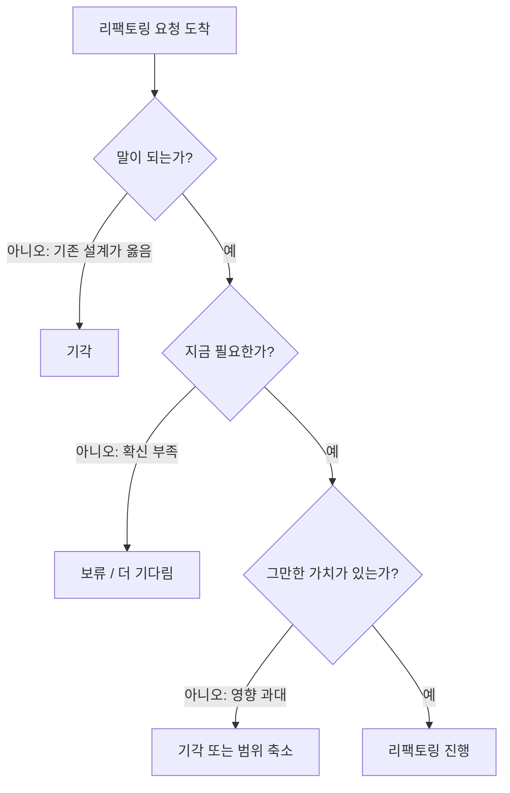

## 이게 뭔데

스키마를 바꾸겠다고 결심하는 데는 보통 10초도 안 걸린다. "어, 이 컬럼 위치가 이상한데? 옮겨야겠다." 그런데 진짜 일은 그 결심 이후부터다. 컬럼 하나 옮기는 게 50개 앱을 갱신·테스트·재배포하는 6개월짜리 프로젝트로 번지는 걸 한 번이라도 봤다면, 손대기 전에 멈춰서 따져보는 절차가 왜 필요한지 안다.

『Refactoring Databases』가 리팩토링 "수행" 첫 단계로 코드 한 줄이 아니라 **질문 세 개**를 두는 이유가 이거다. 변경 자체가 아니라, 변경이 적절한지부터 검증한다. DBA Beverley가 개발자 Eddy의 요청을 받으면 키보드부터 잡는 게 아니라 세 가지를 따진다.

1. 이 리팩토링이 **말이 되는가**?
2. 지금 **정말 필요한** 변경인가?
3. **그만한 가치**가 있는가?

<Callout type="info" title="한 줄 요약">
스키마 리팩토링은 "할 수 있냐"가 아니라 "해야 하냐"를 먼저 묻는다. 타당성(말이 되나) · 시점(지금이냐) · 가치(영향 대비 이득)의 세 관문을 통과 못 하면, 가장 좋은 리팩토링은 안 하는 리팩토링이다.
</Callout>

## 시나리오: 이런 적 있을 거임

은행 DB를 떠올려보자. `Customer` 테이블에 `Balance` 컬럼이 있다. 개발자 Eddy가 새 거래 유형을 붙이다가 깨닫는다. "잠깐, 잔액은 고객 속성이 아니잖아? 한 고객이 계좌 세 개면 잔액이 세 개인데, 왜 `Customer`에 `Balance`가 있지?" 맞는 지적이다. 잔액은 `Account`를 기술하는 값이지 `Customer`를 기술하는 값이 아니다.

Eddy는 신나서 티켓을 끊는다. "`Account`에 `Balance` 컬럼 추가(`Introduce Column`)." 그리고 DBA Beverley한테 와서 말한다. "컬럼 하나만 추가해주세요, 5분이면 되죠?"

여기서 Beverley가 키보드를 잡으면 그건 좋은 DBA가 아니다. 좋은 DBA는 일단 의자를 뒤로 빼고 세 가지를 묻는다. 그리고 이 짧은 대화에서 셋 다 흥미로운 답이 나온다.

## 질문 1: 이 리팩토링이 말이 되는가

첫 번째 관문은 **타당성**이다. 개발자가 변경을 원하는 이유의 절반은 "기존 설계를 오해해서"다. 진짜로 잘못된 설계인 경우도 있지만, 멀쩡한 설계를 잘못 읽고 "이거 이상한데요?" 하는 경우가 그만큼 흔하다.

Beverley가 Eddy보다 판단에 유리한 위치인 이유는 단순하다. DBA는 **전체 그림**을 본다. 팀 DB만 보는 게 아니라 전사 DB, 다른 팀의 연락처, 과거 이 스키마가 왜 이렇게 됐는지의 맥락까지 안다. Eddy는 자기 기능 화면 하나를 보고 "이상하다" 했지만, Beverley는 "그 컬럼이 왜 거기 있는지" 역사를 알 수도 있다.

흥미로운 건, 이번 예제에서 Eddy는 **문제는 옳게 짚었는데 해법을 잘못 짚었다**는 점이다. 잔액이 `Customer`에 있는 게 이상하다는 진단은 정확하다. 그런데 해법은 "`Account`에 새 컬럼을 추가"가 아니다. 그 컬럼은 이미 존재한다 — `Customer`라는 **틀린 위치**에. 그러니 진짜 답은 `Introduce Column`(새로 추가)이 아니라 `Move Column`(옮기기)이다. 같은 데이터를 두 군데 두고 동기화 지옥에 빠지느냐, 한 번에 옮기느냐의 차이다.

<Callout type="note" title="진단과 처방은 다른 일이다">
개발자가 "문제가 있다"고 느끼는 직감은 대체로 믿을 만하다. 사람이 매일 그 화면을 보다가 위화감을 느끼는 데는 이유가 있다. 하지만 그 위화감에서 곧장 튀어나온 처방("컬럼 추가하면 됨")은 자주 틀린다. 첫 번째 질문의 진짜 목적은 변경을 거부하는 게 아니라, **올바른 문제를 올바른 리팩토링에 연결**하는 거다.
</Callout>

## 질문 2: 지금 정말 필요한 변경인가

두 번째 관문은 **시점**이다. 변경이 타당하다고 해서 지금 당장 해야 하는 건 아니다.

책은 이 판단을 솔직하게 "직감(gut call)"이라고 부른다. Beverley는 Eddy라는 사람을 그동안 봐온 경험으로 판단한다. 이 사람이 정당한 업무 요구사항을 설명할 수 있는가? 과거에 좋은 변경을 제안했던 사람인가? 아니면 사흘 뒤에 마음 바꿔서 "아 그거 그냥 두세요" 하고 되돌리게 만든 전적이 있는가?

이게 비과학적으로 들릴 수 있는데, 실무에선 의외로 핵심이다. "확신 없는 변경"을 통합 환경에 밀어넣으면, 그걸 되돌리는 비용이 처음 넣는 비용보다 크다. 그래서 Beverley의 선택지는 항상 "한다 / 안 한다"만 있는 게 아니다. **"조금 더 생각해보고 오세요"** 또는 **"실제 통합 환경에 적용하기 전에 며칠 더 기다려봅시다"** 같은 보류 카드가 있다.

<Callout type="warning" title="'지금'이라는 함정">
"이왕 손댄 김에"는 스키마 변경에서 가장 비싼 말이다. 코드 리팩토링은 잘못되면 git revert 한 방이지만, 운영 DB에 이미 적용되고 여러 앱이 새 스키마를 바라보기 시작한 변경은 되돌리는 게 또 하나의 마이그레이션이다. 시점 판단의 본질은 "지금 안 하면 영원히 못 하나?"를 묻는 거다. 대부분은 답이 "아니오"고, 그렇다면 확신이 설 때까지 기다리는 게 싸다.
</Callout>

## 질문 3: 그만한 가치가 있는가 (영향 평가)

세 번째 관문이 제일 무겁다. **가치**, 즉 영향 대비 이득이다. 여기서 "전체 영향(impact)"을 평가한다.

핵심은 이거다. 우리 DB에 붙어 있는 외부 프로그램이 이 스키마 부분에 **어떻게 결합돼 있는지** 이해해야 한다. 컬럼 하나 옮기는 게 SQL 한 줄이라고 생각하면 오산이다. 그 컬럼을 `SELECT`하는 앱이 50개면, 그 50개를 전부 갱신·테스트·재배포해야 리팩토링이 끝난다. 그 순간 "5분짜리 컬럼 이동"은 분기를 넘기는 대형 프로젝트가 된다.

그래서 영향이 크면 **"하지 않는다"**가 합리적 결론일 수 있다. 설계가 약간 안 예쁜 것과, 50개 앱을 건드리는 리스크를 맞바꾸는 거다. 심지어 단일 애플리케이션이라도 그 앱이 해당 스키마 부분에 강하게 결합돼 있으면(쿼리가 컬럼명을 하드코딩하고, 리포트가 직접 테이블을 긁고, 저장 프로시저가 줄줄이 의존하고...) 가치가 없을 수 있다.

물론 반대로 갈 수도 있다. 이번 은행 예제에서는 설계 문제가 명백히 심각해서, **많은 앱이 영향받는데도 진행하기로** 결정한다. 잔액이 엉뚱한 테이블에 있는 건 그냥 안 예쁜 수준이 아니라 데이터 모델의 거짓말이고, 새 기능을 붙일 때마다 이 거짓말이 비용을 청구하기 때문이다. 가치 평가는 "영향이 크면 무조건 안 함"이 아니라 **영향과 이득을 저울에 같이 올리는** 일이다.



## 데이터가 다른 곳에 있을 수도 있다

세 질문을 통과하기 전에 함정이 하나 더 있다. **우리 DB가 이 데이터의 유일한 출처가 아닐 수 있다.**

은행 예제로 돌아가면, Account 정보의 **공식 저장소**가 우리 DB가 아니라 다른 시스템일 수 있다. 코어뱅킹 원장이 따로 있고, 우리 DB의 `Balance`는 그걸 복제해 온 캐시일 뿐이라면? 그러면 "컬럼을 옮긴다"는 리팩토링 자체가 잘못된 처방이다. 진짜 답은 `Use Official Data Source` — 우리 로컬 사본을 만지작거릴 게 아니라 공식 출처를 바라보게 고치는 거다.

좋은 DBA가 전사의 데이터 출처를 다 꿰고 있어야 하는 이유가 이거다. 같은 이름의 컬럼이 회사 안에 일곱 군데 있고, 그중 어느 게 "진실"인지 아는 사람이 의사결정 테이블에 있어야 한다. 마이크로서비스 시대엔 이게 더 날카로워진다 — 다른 서비스가 자기 DB로 소유한 데이터를 우리가 공유 DB로 직접 긁고 있었다면, 리팩토링 이전에 **그 결합 자체가 안티패턴**이다.

<Callout type="error" title="뭐가 문제냐면">
- **로컬 사본을 진실로 착각**: 우리 테이블의 컬럼을 고치면 끝날 줄 알았는데, 그 값은 사실 상류 시스템에서 흘러온 복제본이라 고쳐봤자 다음 동기화에 덮어쓰인다.
- **소유권 경계를 침범**: 다른 서비스가 소유한 데이터를 공유 DB로 직접 읽고 있으면, 스키마 리팩토링은 남의 집 벽을 허무는 일이 된다.
- **공식 출처 무지**: 같은 데이터의 "정본"이 어디인지 모르면, 가장 정교한 영향 분석도 틀린 테이블을 분석하게 된다.
</Callout>

## 강화: 직감을 데이터로 받치기

2006년의 Beverley는 세 번째 질문(영향 평가)을 상당 부분 머릿속 지식과 경험으로 답했다. "내가 알기로 이 컬럼 쓰는 앱이..." 이건 작은 조직에선 통하지만, 앱이 50개를 넘어가고 사람이 분기마다 바뀌는 환경에선 위험하다. 직감은 출발점으로 두고, 그 위에 **데이터 기반 영향 분석**을 얹는 게 현대적 강화다.

핵심 질문은 그대로다. "이 컬럼/테이블에 누가, 어떻게 결합돼 있나?" 답을 머리 대신 시스템에서 끌어온다.

<Steps>
<Step title="쿼리 로그로 실사용 추적">
머릿속 "이 컬럼 누가 쓰지?"를 실측으로 바꾼다. PostgreSQL `pg_stat_statements`, MySQL general/slow query log, 또는 프록시(ProxySQL) 로그를 일정 기간 수집해 해당 컬럼·테이블이 등장하는 실제 쿼리를 모은다. 코드 검색으로는 안 잡히는 동적 SQL·BI 도구·애드혹 리포트까지 드러난다.
</Step>
<Step title="스키마 사용 분석으로 결합 측정">
어떤 앱이 어떤 컬럼을 SELECT/WHERE/JOIN에 쓰는지를 집계해 "결합 강도"를 본다. 어떤 컬럼은 한 화면에서만 읽고, 어떤 컬럼은 50개 쿼리의 WHERE에 박혀 있다. 후자가 바로 "강하게 결합돼 가치가 없을 수 있는" 그 부분이다.
</Step>
<Step title="의존성 추적으로 숨은 결합 발굴">
뷰, 저장 프로시저, 트리거, 머티리얼라이즈드 뷰, FK 제약이 그 컬럼에 거는 의존성을 카탈로그(information_schema, pg_depend)에서 뽑는다. 앱 코드만 보면 멀쩡한데 뷰 하나가 그 컬럼에 매달려 있어서 변경이 줄줄이 깨지는 경우가 여기서 걸린다.
</Step>
<Step title="소유권·출처 확인">
데이터 카탈로그/리니지 도구로 이 컬럼의 상류 출처를 확인한다. "데이터가 다른 곳에 있을 수도 있다"를 직감이 아니라 리니지 그래프로 검증하는 단계다. 상류가 있으면 Move/Rename가 아니라 Use Official Data Source가 답이다.
</Step>
</Steps>

이렇게 모은 결과가 세 번째 질문의 저울에 올라간다. 쿼리 로그에 그 컬럼이 한 달간 두 번 등장했고, 의존하는 뷰가 없고, 상류 출처도 없다면 — 영향이 작으니 진행. 반대로 200개 쿼리에 박혀 있고 BI 대시보드 12개가 매달려 있다면 — 직감이 "괜찮을 거야" 하더라도 데이터가 "아니"라고 말한다.

<Callout type="info" title="영향이 커도 진행해야 할 때의 출구">
영향 분석 결과가 "크다"고 나왔는데 설계 문제는 심각해서 꼭 해야 한다면, 답은 "포기"가 아니라 **expand-contract(parallel change)**다. 새 컬럼/테이블을 추가(expand)하고, 양쪽을 동시에 채워 동기화하며, 소비자들이 새 쪽으로 옮길 **전환 기간**을 준 뒤, 마지막에 옛 구조를 제거(contract)한다. 영향이 크다는 건 "하지 마라"가 아니라 "한 방에 하지 말고 단계로 쪼개라"는 신호이기도 하다. 그래서 영향 평가의 결론은 종종 진행 여부가 아니라 **전략 선택**으로 이어진다.
</Callout>

## 작은 단계로

세 질문을 다 통과해 "진행"으로 결정됐다 치자. 그래도 한 번에 다 바꾸지 않는다. 잔액 컬럼을 옮기면서 이름도 바꾸고 공통 형식까지 적용해야 한다면, `Move Column` → `Rename Column` → `Introduce Common Format`을 **하나씩 순서대로** 성공시킨다.

이유는 디버깅 산수다. 세 변경을 한 마이그레이션에 욱여넣고 뭔가 깨지면, 범인 후보가 셋이다. 하나씩 적용하면 방금 깬 게 범인일 확률이 압도적으로 높아 추적이 쉽다. 마이그레이션 도구(Flyway/Liquibase/Alembic/Rails)에서도 변경 하나당 마이그레이션 파일 하나로 쪼개면, 실패 시 어느 단계에서 멈췄는지 버전 테이블이 정확히 알려준다.

```text
V14__move_balance_to_account.sql        -- 1단계: 컬럼 이동만
V15__rename_balance_to_current_balance.sql  -- 2단계: 이름만
V16__normalize_balance_format.sql       -- 3단계: 형식만
```

"이왕 하는 김에 한 파일에 다 넣자"의 유혹은 질문 2에서 한 번 걸렀어야 할 욕심이 마이그레이션 단계에서 또 고개를 든 거다. 여기서도 거절한다.

## 정리

스키마 리팩토링의 첫 단계는 SQL이 아니라 **거절할 줄 아는 절차**다. 모든 "이거 이상한데요?"가 변경으로 이어지면 운영 DB는 누더기가 된다.

> **가장 좋은 리팩토링은, 검증을 통과하지 못한 리팩토링을 안 하는 것이다.**

세 질문으로 정리하면 이렇다.

- **말이 되는가** — 진단은 맞아도 처방은 틀릴 수 있다. 올바른 문제를 올바른 리팩토링에 연결한다.
- **지금 필요한가** — 확신이 없으면 보류가 싸다. "이왕 하는 김에"는 스키마에서 가장 비싼 말이다.
- **그만한 가치가 있는가** — 영향과 이득을 같은 저울에 올린다. 직감은 출발점, 쿼리 로그·스키마 사용 분석·의존성 추적·리니지로 받친다.

그리고 결정 전에 항상 한 번 더 묻는다. "이 데이터, 정말 우리 DB가 주인 맞아?" 주인이 아니면, 옮길 게 아니라 출처를 바라보게 고치는 거다. 통과했으면 그때 비로소 손을 댄다 — 그것도 한 번에 하나씩, 작은 단계로.
